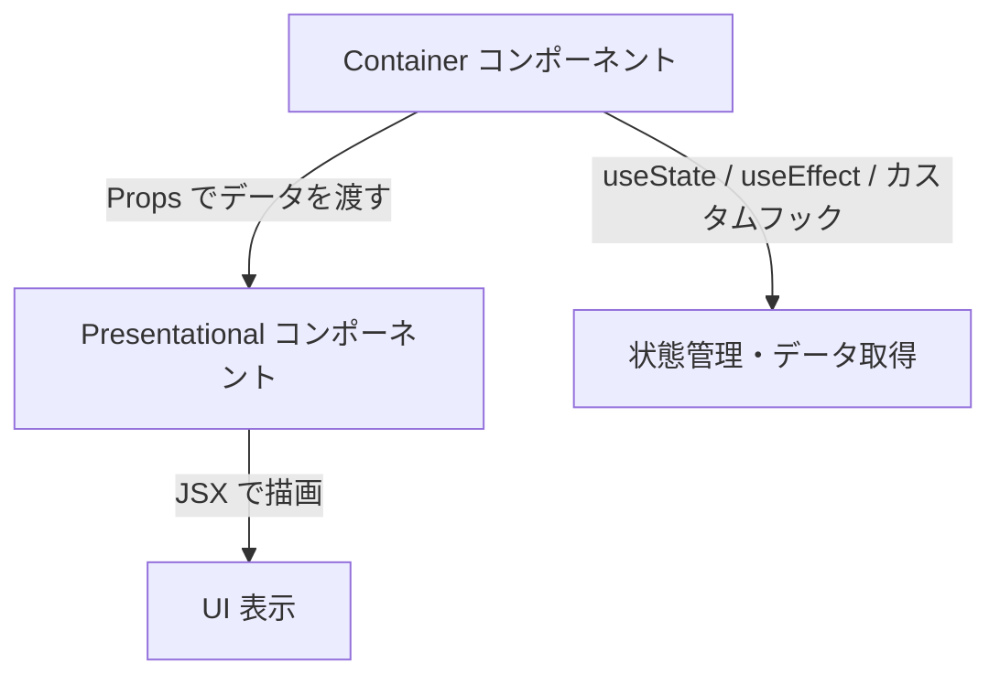
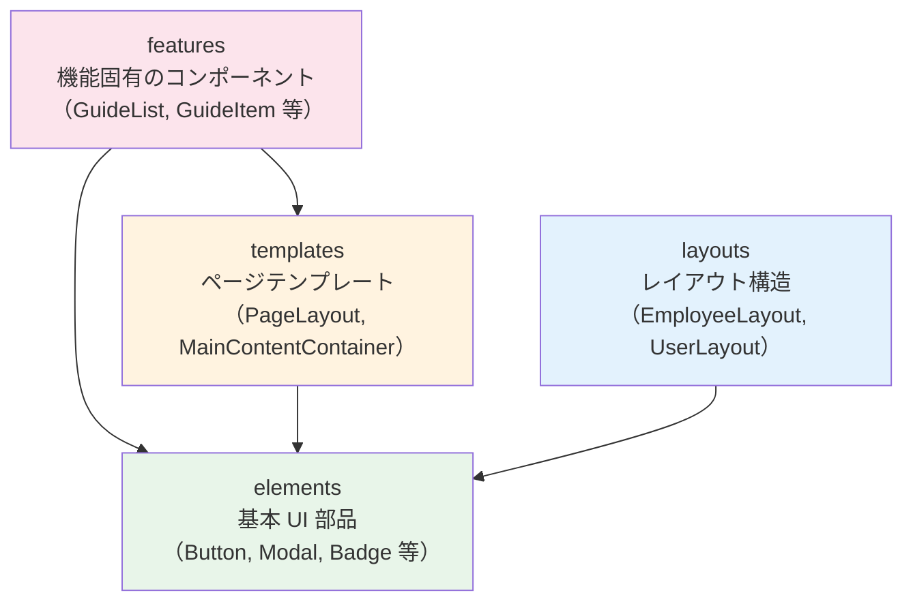

# 2-3-4 コンポーネント設計パターン

📝 **前提知識**: このセクションは 2-3-3 レンダリングの仕組みと最適化 の内容を前提としています。

## 🎯 このセクションで学ぶこと

- Container / Presentational パターンでロジックと見た目を分離する考え方を理解する
- 合成パターンと `children` によるコンポーネントの入れ子構造を理解する
- コンポーネント自体を Props として渡す高度な合成パターンを理解する
- LMS のコンポーネント分類（elements / layouts / templates / features）の 4 層設計を理解する

このセクションでは、React コンポーネントをどのように分割・組み合わせるかという「設計パターン」を学び、LMS の実コードでその実践例を確認します。

---

## 導入: 「動くコード」から「良い設計」へ

ここまでのセクションで、コンポーネント、JSX、State、Hooks、レンダリングの仕組みを学びました。これらの知識があれば、React で UI を「動かす」ことは可能です。しかし、実際の開発では「動くコード」だけでは不十分です。

たとえば、1 つのコンポーネントにデータ取得、状態管理、バリデーション、UI 表示のすべてを詰め込んだらどうなるでしょうか。コードは数百行に膨れ上がり、テストは困難になり、UI だけ変更したいのにロジック部分にも影響が出るリスクがあります。

Laravel で Controller にビジネスロジック・バリデーション・ビュー生成をすべて書く「ファットコントローラー」が問題になるのと同じ構造です。Laravel では Controller と View を分離し、さらにサービス層を導入して責務を分けました。React にも同様の「責務分離のパターン」があります。

### 🧠 先輩エンジニアはこう考える

> LMS の開発を始めたとき、最初は 1 つのコンポーネントにすべてを書いていました。API からデータを取得して、状態を管理して、条件分岐で UI を出し分けて...。動きはしますが、数ヶ月後に別の人が読むと「この State は何に使っているのか」「このロジックはどこまでが表示用でどこからがビジネスロジックか」が分からなくなります。Laravel でファットコントローラーを避けるのと同じで、React にも「どこに何を書くか」のパターンがあります。これを知っているだけで、コードを読むスピードが格段に上がりますし、Claude Code に指示を出すときも「Container と Presentational に分けて」と一言伝えるだけで意図が伝わります。

---

## Container / Presentational パターン

### なぜ分離するのか

React コンポーネントの責務は大きく 2 つに分けられます。

| 責務 | 具体的な処理 |
|---|---|
| **ロジック** | データ取得、状態管理、イベントハンドラの定義、ビジネスルール |
| **見た目** | HTML 構造の出力、スタイルの適用、Props を受け取って表示 |

この 2 つの責務を 1 つのコンポーネントに混在させると、以下の問題が起きます。

- **再利用性の低下**: 同じ見た目を別のデータソースで使いたいとき、コンポーネントごとコピーする必要がある
- **テストの困難さ**: UI のテストをしたいだけなのに、API モックやステート管理のセットアップが必要になる
- **変更の影響範囲**: デザイン修正がロジックに影響する（またはその逆）

### Laravel との対比

この分離は Laravel の設計と対比すると理解しやすくなります。

| Laravel | React | 責務 |
|---|---|---|
| Controller | Container コンポーネント | ロジックの制御（データ取得・状態管理） |
| Blade View | Presentational コンポーネント | 見た目の表示（受け取ったデータの描画） |

Laravel の Controller はリクエストを処理し、必要なデータを準備して View に渡します。View は受け取ったデータを HTML に変換するだけです。React の Container / Presentational パターンもまったく同じ構造です。

### パターンの構造



**Container コンポーネント** は「何を表示するか」を決めます。

- State を管理する
- データ取得やイベントハンドリングのロジックを持つ
- 取得したデータを Presentational コンポーネントに Props で渡す
- 自身はほとんど UI を持たない

**Presentational コンポーネント** は「どう表示するか」を決めます。

- Props を受け取って JSX を返すだけ
- State を持たない（あるいは UI 用の State のみ: 開閉状態、ホバー状態など）
- データの取得元を知らない

### LMS の実例: GuideList と GuideItem

LMS のガイド（教材）管理画面では、このパターンが使われています。

`GuideList` は Container の役割を持ちます。以下は主要部分の抜粋です。

```tsx
// features/v2/guide/components/GuideList.tsx
type Props = {
  guides: IndexHttpDocument['response']['data']
  workspaceId: string
  onUpdate?: () => void
}

export function GuideList({ guides, workspaceId, onUpdate }: Props) {
  const [items, setItems] = useState(guides)
  const [isDragProcess, setIsDragProcess] = useState(false)
  const prevGuidesRef = useRef(guides)

  useEffect(() => {
    if (!isDragProcess && prevGuidesRef.current !== guides) {
      setItems(guides)
      prevGuidesRef.current = guides
    }
  }, [guides, isDragProcess])

  const { sensors, collisionDetection, handleDragStart, handleDragEnd } = useGuideDrag({
    items,
    setItems,
    workspaceId,
    // ...コールバック省略
  })

  return (
    <DndContext
      sensors={sensors}
      collisionDetection={collisionDetection}
      onDragStart={handleDragStart}
      onDragEnd={handleDragEnd}
    >
      <SortableContext items={guideIds} strategy={verticalListSortingStrategy}>
        <div className='flex flex-col gap-4'>
          {items.map((guide, index) => (
            <GuideItem
              key={guide.id}
              guide={guide}
              index={index}
              workspaceId={workspaceId}
              onUpdate={onUpdate}
            />
          ))}
        </div>
      </SortableContext>
    </DndContext>
  )
}
```

`GuideList` は **ロジック** に集中しています。

- `useState` でドラッグ中のアイテム順序を管理
- `useRef` で前回の Props を追跡
- `useGuideDrag` カスタムフック でドラッグ&ドロップのロジックを管理
- 各ガイドの表示は `GuideItem` に委譲

一方、`GuideItem` はそれぞれのガイド 1 件分の **見た目** を担当します。以下は主要部分の抜粋です。

```tsx
// features/v2/guide/components/GuideItem.tsx
type Props = {
  guide: IndexHttpDocument['response']['data'][number]
  index: number
  workspaceId: string
  onUpdate?: () => void
}

export function GuideItem({ guide, index, workspaceId, onUpdate }: Props) {
  const [isExpanded, setIsExpanded] = useState(false)
  // ...UI 表示のためのロジック

  return (
    <div ref={setNodeRef} style={style} className='flex flex-col rounded-md border ...'>
      <div className='flex items-center gap-2 px-4 py-3'>
        <DragHandle attributes={attributes} listeners={listeners} />
        <span className='text-base font-semibold text-text-primary'>{guide.title}</span>
        <PublicStatusChip isPublic={guide.isPublic} />
      </div>
      {/* 展開時のチャプター一覧 */}
    </div>
  )
}
```

`GuideItem` は Props で受け取った `guide` データを表示することに集中しています。`isExpanded` のような UI 用の State は持っていますが、データ取得やビジネスロジックは持ちません。

💡 **TIP**: 現代の React では、カスタムフック を使ってロジックを分離する方法が主流になっています。`GuideList` が `useGuideDrag` という Hooks にドラッグロジックを切り出しているのがその例です。Container / Presentational の考え方は、コンポーネント分割の指針として今も有効です。

---

## 合成パターンと children の活用

### コンポーネントの「入れ子」という考え方

Container / Presentational パターンは「ロジックと見た目の分離」でした。次に学ぶ合成パターン（Composition Pattern）は「コンポーネントの組み合わせ方」に関する設計です。

HTML を思い出してください。`<div>` の中に `<p>` を入れ、その中に `<span>` を入れる。この「入れ子」構造は HTML の基本です。React の合成パターンも同じ発想で、コンポーネントの中に別のコンポーネントを「入れ子」にして、柔軟な UI を構築します。

### children Props

React では、コンポーネントの開きタグと閉じタグの間に書いた内容が、自動的に `children` という Props で渡されます。

```tsx
// 使う側
<PageLayout title="ダッシュボード" breadcrumbs={breadcrumbs}>
  <DashboardContent />    {/* ← これが children */}
</PageLayout>
```

```tsx
// PageLayout の定義側
function PageLayout({ title, breadcrumbs, children }) {
  return (
    <div>
      <h2>{title}</h2>
      <div>{children}</div>  {/* ← ここに DashboardContent が入る */}
    </div>
  )
}
```

Laravel の Blade で `@yield('content')` を使ってレイアウトテンプレートにコンテンツを注入するのと同じ考え方です。`children` は React 版の `@yield` と言えます。

### LMS の実例: PageLayout

LMS の `PageLayout` は、ページの共通レイアウト（パンくずリスト + タイトル + コンテンツエリア）を提供するコンポーネントです。

```tsx
// components/v2/templates/PageLayout.tsx
type Props = {
  title: string
  breadcrumbs: BreadcrumbItem[]
  children: React.ReactNode
  className?: string
}

export function PageLayout({ title, breadcrumbs, children, className = '' }: Props) {
  return (
    <div className={`mx-9 my-6 ${className}`}>
      <div className='hidden xl:block'>
        <Breadcrumbs items={breadcrumbs} />
        <h2 className='my-2 text-2xl font-bold'>{title}</h2>
      </div>
      <div className='mx-auto max-w-[1380px]'>{children}</div>
    </div>
  )
}
```

`PageLayout` は `title` と `breadcrumbs` を受け取ってヘッダー部分を描画し、`children` で受け取ったコンテンツをメインエリアに表示します。このコンポーネントは「中に何が入るか」を知りません。ダッシュボードでもユーザー一覧でも、どんなコンテンツでも受け入れます。

### LMS の実例: MainContentContainer

さらにシンプルな例として、`MainContentContainer` があります。

```tsx
// components/v2/templates/MainContentContainer.tsx
type Props = {
  children: ReactNode
  className?: string
}

export function MainContentContainer({ children, className = '' }: Props) {
  return <div className={`w-full shrink-0 xl:w-[768px] ${className}`}>{children}</div>
}
```

このコンポーネントは「メインコンテンツの幅を制御する」という 1 つの責務だけを持っています。`children` で受け取ったコンテンツを幅制限付きの `div` で囲むだけです。

これらを組み合わせると、以下のような入れ子構造になります。

```tsx
<PageLayout title="ガイド管理" breadcrumbs={breadcrumbs}>
  <MainContentContainer>
    <GuideList guides={guides} workspaceId={workspaceId} />
  </MainContentContainer>
</PageLayout>
```

各コンポーネントが自分の責務だけを担い、`children` で柔軟に組み合わさっています。

### レンダープロップパターン

`children` は通常 JSX 要素を受け取りますが、**関数** を渡すこともできます。これをレンダープロップ（Render Props）パターンと呼びます。

LMS の `Modal` コンポーネントでは、`footer` Props がこのパターンを使っています。

```tsx
// components/v2/elements/Modal.tsx
type FooterProps = {
  onClose?: () => void
}

type Props = Omit<HeroModalProps, 'children'> & {
  isOpen: boolean
  header?: React.ReactNode
  body?: React.ReactNode
  footer?: (props: FooterProps) => React.ReactNode
  onSubmit?: (e: React.FormEvent<HTMLFormElement>) => void
}
```

注目すべきは `footer` の型です。`React.ReactNode`（JSX 要素）ではなく、`(props: FooterProps) => React.ReactNode`（**関数**）になっています。これにより、Modal の内部で管理している `onClose` を外側のコンポーネントに渡すことができます。

```tsx
// Modal 内部での footer の使い方
{footer && <HeroModalFooter>{footer({ onClose: handleClose })}</HeroModalFooter>}
```

Modal は自身が管理する `handleClose` 関数を `footer` に渡します。使う側は次のように書けます。

```tsx
<Modal
  isOpen={isOpen}
  header="確認"
  body={<p>本当に削除しますか？</p>}
  footer={({ onClose }) => (
    <>
      <Button onPress={onClose}>キャンセル</Button>
      <Button color="danger" onPress={handleDelete}>削除</Button>
    </>
  )}
/>
```

`footer` が関数であることで、Modal 内部の `onClose` にアクセスしつつ、フッターの UI は呼び出し側が自由に決められます。

🔑 **キーポイント**: レンダープロップパターンは「親コンポーネントが持つ内部情報を、子の描画ロジックに渡す」ための仕組みです。通常の `children` では親の内部データを子に渡すことができませんが、関数として渡すことでこの制約を超えられます。

---

## コンポーネントを Props として渡すパターン

### 合成のさらに先へ

`children` は「中身」を丸ごと注入するのに便利ですが、「特定のスロットに別のコンポーネントを差し込みたい」場合には向きません。たとえば、レイアウトコンポーネントに「サイドバー部分だけ差し替えたい」という要件を考えてみましょう。

React では、コンポーネント自体を Props として渡すことができます。文字列や数値を渡すのと同じ感覚で、コンポーネント（関数）そのものを渡すのです。

### LMS の実例: EmployeeLayout

LMS の管理者向けレイアウト `EmployeeLayout` は、ロール（管理者・コーチ・CS）ごとに異なるサイドバーを表示する必要があります。

```tsx
// components/v2/layouts/EmployeeLayout.tsx
type SidebarProps = {
  onHoverChange?: (isHovered: boolean) => void
  onOpenChange?: (isOpen: boolean) => void
}

type Props = {
  children: React.ReactNode
  actor: Actor
  Sidebar: ComponentType<SidebarProps>
  onSidebarToggle: () => void
  employeeRole?: EMPLOYEE_ROLE
}

export function EmployeeLayout({ children, actor, Sidebar, onSidebarToggle, employeeRole }: Props) {
  const router = useRouter()

  useEffect(() => {
    if (!employeeRole) return
    if (actor.role !== employeeRole) {
      router.replace('/v2/employee/login')
    }
  }, [actor.role, employeeRole, router])

  if (employeeRole && actor.role !== employeeRole) {
    return null
  }

  return (
    <div className='flex h-screen w-full overflow-hidden bg-brand-secondary-800'>
      <Sidebar />
      <div className='flex min-w-0 flex-1 flex-col'>
        <div className='shrink-0'>
          <EmployeeHeader actor={actor} onSidebarToggle={onSidebarToggle} />
        </div>
        <div className='relative mb-1 mr-1 min-h-0 flex-1 overflow-y-auto rounded-lg bg-background-default'>
          <main>{children}</main>
        </div>
      </div>
    </div>
  )
}
```

ここで注目すべきは `Sidebar: ComponentType<SidebarProps>` という Props の型です。

- `ComponentType` は React が提供する型で、「React コンポーネントとして使える関数（またはクラス）」を意味します
- `<SidebarProps>` はそのコンポーネントが受け取る Props の型です
- JSX 内で `<Sidebar />` のように、渡されたコンポーネントをそのままレンダリングしています

使う側では、ロールに応じて異なるサイドバーコンポーネントを渡します。

```tsx
// 管理者ページの場合
<EmployeeLayout actor={actor} Sidebar={AdminSidebar} onSidebarToggle={toggle}>
  <AdminDashboard />
</EmployeeLayout>

// コーチページの場合
<EmployeeLayout actor={actor} Sidebar={CoachSidebar} onSidebarToggle={toggle}>
  <CoachDashboard />
</EmployeeLayout>
```

`EmployeeLayout` 自体は変更せず、`Sidebar` Props に渡すコンポーネントを変えるだけで、異なるサイドバーを持つレイアウトを実現しています。

### UserLayout との比較

一方、受講生向けの `UserLayout` は常に `UserSidebar` を使うため、サイドバーを Props で受け取らず内部で直接インポートしています。

```tsx
// components/v2/layouts/UserLayout.tsx
import { UserSidebar } from '@/components/v2/layouts/UserSidebar'

export function UserLayout({ children, actor, /* ...他の Props */ }: Props) {
  return (
    <div className='flex h-screen w-full overflow-hidden bg-brand-secondary-800'>
      <UserSidebar onOpenChange={onSidebarOpenChange} />
      {/* ...メインコンテンツ */}
    </div>
  )
}
```

この対比は設計判断の良い例です。

- **EmployeeLayout**: サイドバーがロールごとに変わる → コンポーネントを Props で注入（柔軟性を優先）
- **UserLayout**: サイドバーが固定 → 直接インポート（シンプルさを優先）

すべてのコンポーネントを Props で渡せるように設計する必要はありません。「変化する部分」だけを注入可能にするのが、良い設計のバランスです。

---

## LMS のコンポーネント分類

### 4 層のディレクトリ構造

ここまで個々の設計パターンを見てきました。では、プロジェクト全体でコンポーネントをどう整理するのでしょうか。LMS では `frontend/src/components/v2/` 配下に 4 つのディレクトリを設けて、コンポーネントを責務ごとに分類しています。

| 層 | ディレクトリ | 数 | 責務 |
|---|---|---|---|
| **elements** | `components/v2/elements/` | 57 個 | 最小の UI 部品。ボタン、入力欄、モーダルなど |
| **layouts** | `components/v2/layouts/` | 13 個 | ページ全体のレイアウト構造。ヘッダー、サイドバー、レイアウト枠 |
| **templates** | `components/v2/templates/` | 4 個 | ページコンテンツの共通テンプレート。パンくず + タイトル + コンテンツエリア |
| **features** | `components/v2/features/` | 1 個 | 特定の機能に紐づくコンポーネント（※大半は `features/v2/` 配下に配置） |

💡 **TIP**: `features` 層のコンポーネントは `components/v2/features/` には 1 つしかありませんが、機能固有のコンポーネントは `frontend/src/features/v2/` ディレクトリ配下にそれぞれの機能名ごとに配置されています。たとえば、先ほど見た `GuideList` や `GuideItem` は `features/v2/guide/components/` にあります。

### 各層の責務と依存関係



依存の方向に注目してください。

- **elements** は他の層に依存しません。最も再利用性が高い層です
- **layouts** は elements を使いますが、templates や features には依存しません
- **templates** は elements を使います
- **features** は templates と elements を使います

この依存関係は「下の層は上の層を知らない」という原則を守っています。Laravel のアーキテクチャで言えば、View が Controller を呼び出すことがないのと同じ方向性です。

### 具体的なコンポーネント例

**elements 層**: UI の最小単位

```tsx
// components/v2/elements/Button.tsx
type Props = {
  children: React.ReactNode
} & HeroButtonProps

export function Button({ children, ...props }: Props) {
  return <HeroButton {...props}>{children}</HeroButton>
}
```

`Button` は HeroUI の `Button` をラップしたコンポーネントです。HeroUI のすべての Props をそのまま受け取り、LMS のプロジェクト内で統一的に使えるようにしています。ライブラリを直接使わずラップすることで、将来 UI ライブラリを変更する際の影響範囲を限定できます。

```tsx
// components/v2/elements/Badge.tsx
type Props = {
  count: number
  variant?: 'default' | 'inverse'
  maxDisplay?: number
  className?: string
}

export function Badge({ count, variant = 'default', maxDisplay = 99, className = '' }: Props) {
  const displayText = count > maxDisplay ? `${maxDisplay}+` : String(count)
  const isInverse = variant === 'inverse'

  return (
    <span
      className={cn(
        'flex h-5 min-w-5 shrink-0 items-center justify-center rounded-full px-1 text-xs font-bold',
        isInverse
          ? 'bg-background-subtle text-brand-primary'
          : 'bg-brand-primary text-text-inverse',
        className,
      )}
      aria-label={`未読${count}件`}
    >
      {displayText}
    </span>
  )
}
```

`Badge` は未読数を表示するコンポーネントです。`count` を受け取り、99 を超えたら `99+` と表示し、`variant` でデザインのバリエーションを切り替えます。ビジネスロジックは持たず、表示に特化しています。

**layouts 層**: ページ構造の定義

先ほど見た `EmployeeLayout` と `UserLayout` がこの層に属します。ヘッダー、サイドバー、メインコンテンツエリアの配置を決めるコンポーネントです。

**templates 層**: コンテンツエリアのテンプレート

`PageLayout` と `MainContentContainer` がこの層です。layouts がページ全体の「枠」を決めるのに対し、templates はその枠の中の「コンテンツエリア」の構造を決めます。

### 設計パターンと 4 層の関係

このセクションで学んだ設計パターンは、4 層構造の中で以下のように活用されています。

| パターン | 活用場面 | 例 |
|---|---|---|
| Container / Presentational | features 層のコンポーネント分割 | `GuideList`(Container) + `GuideItem`(Presentational) |
| children による合成 | templates 層と layouts 層 | `PageLayout`, `MainContentContainer` |
| レンダープロップ | elements 層の柔軟な拡張 | `Modal` の `footer` Props |
| コンポーネント Props | layouts 層の差し替え可能な設計 | `EmployeeLayout` の `Sidebar` Props |

設計パターンは「目的」であり、4 層構造は「整理棚」です。パターンを知ることで適切にコンポーネントを設計でき、4 層構造に従うことでプロジェクト全体の見通しが良くなります。

---

## ✨ まとめ

- **Container / Presentational パターン** は、ロジック（データ取得・状態管理）と見た目（UI 表示）を分離する設計です。Laravel の Controller / View 分離と同じ発想で、再利用性とテスト容易性を高めます
- **合成パターン** は、`children` Props を使ってコンポーネントを入れ子にし、柔軟な UI を構築する手法です。レンダープロップパターンでは関数を渡すことで、親の内部データを子の描画に活用できます
- **コンポーネントを Props として渡すパターン** は、`ComponentType` 型を使ってコンポーネント自体を注入する高度な合成です。変化する部分だけを差し替え可能にすることで、柔軟性とシンプルさのバランスを取ります
- **LMS の 4 層構造** （elements / layouts / templates / features）は、コンポーネントを責務ごとに分類する整理方法です。下の層は上の層に依存しないという原則により、再利用性と保守性を確保しています

---

この Chapter では、React のコア概念を体系的に学んできました。コンポーネントと JSX による UI の構築、State と Hooks による状態管理とロジックの再利用、レンダリングの仕組みと最適化、そしてこのセクションで扱った設計パターンとコンポーネント分類です。これらは React アプリケーションを読み解くための基盤となる知識です。

しかし、React 単体ではまだ解決できない課題があります。ページ間の遷移（ルーティング）をどう実現するのか、初回表示を高速化するためにサーバー側でレンダリング（SSR）するにはどうするのか、画像やフォントの最適化はどう行うのか。次の Chapter では、React のメタフレームワークである Next.js が App Router のファイルベースルーティングを中心に、これらの課題をどのように解決するかを学びます。
