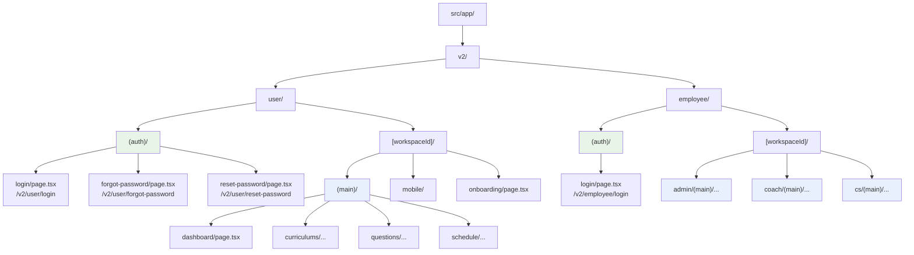

# 2-4-1 Next.js の設計思想と App Router

この Chapter「Next.js」では、React のメタフレームワークである Next.js 14 の App Router アーキテクチャを理解します。全 3 セクションで構成されています。

| セクション | テーマ | 種類 |
|---|---|---|
| 2-4-1 | Next.js の設計思想と App Router | 概念 |
| 2-4-2 | Server Components と Client Components | 概念 |
| 2-4-3 | レイアウト・ミドルウェア・設定 | 概念 |

📖 **この Chapter の進め方**: まず本セクションで Next.js がなぜ必要かを理解し、App Router のファイルベースルーティングを学びます。次に Server Components と Client Components の境界を理解し、最後にレイアウト・ミドルウェア・設定で実践的な構成を読み解きます。

📝 **前提知識**: このセクションはセクション 2-3-1（コンポーネントと JSX）の内容を前提としています。

## 🎯 このセクションで学ぶこと

- なぜ React 単体ではプロダクション開発に不十分なのかを理解する
- Next.js が解決する 3 つの課題（ルーティング・SSR・最適化）を把握する
- App Router のファイルベースルーティングの仕組みを理解する
- 動的ルーティングとルートグループの使い方を LMS の実例で学ぶ

React のコンポーネントを学んだ次のステップとして、Next.js がそれらのコンポーネントをどのように「アプリケーション」として組み上げるかを見ていきます。

---

## 導入: React だけでは足りないもの

前の Chapter で、React のコンポーネント、JSX、フック（Hooks）を学びました。React を使えば UI を宣言的に構築できます。しかし、React はあくまで **UI ライブラリ** です。実際のプロダクション開発では、React だけではカバーできない課題がいくつもあります。

たとえば、以下のような疑問に React 単体では答えられません。

- `/dashboard` や `/settings` のような URL をどう管理するのか？
- 検索エンジンにページの内容を正しく認識させるにはどうするのか？
- 画像やフォントの読み込みを最適化するにはどうするのか？
- 開発環境と本番環境のビルド設定をどう切り替えるのか？

Laravel を思い出してください。PHP 単体でも Web アプリケーションは作れますが、ルーティング、ミドルウェア、Eloquent、Blade テンプレートといった仕組みがなければ、すべてを自分で組み立てなくてはなりません。Laravel は PHP の上にこれらの仕組みを提供することで、開発者がビジネスロジックに集中できるようにしています。

Next.js は、React に対して Laravel が PHP に対して果たすのと同じ役割を担います。

### 🧠 先輩エンジニアはこう考える

> LMS の開発を始めた頃、React のコンポーネントは書けるのに「ページ間の遷移をどう作るの？」「API からのデータ取得はどこでやるの？」という壁にぶつかりました。React 公式ドキュメントにも「プロダクションで使うならフレームワークを使ってください」と書かれています。React はあくまでも UI を作る道具で、アプリケーションとして成立させるには Next.js のようなフレームワークが必要です。Laravel がルーティングや認証を提供してくれるのと同じで、Next.js がルーティングやサーバーサイドレンダリングを提供してくれます。この対応関係がわかると、Next.js の機能がすんなり頭に入ります。

---

## Next.js とは何か

Next.js は、React の **メタフレームワーク** です。「メタフレームワーク」とは、ライブラリやフレームワークの上にさらに構造を提供するフレームワークのことです。React（UI ライブラリ）の上に、プロダクション開発に必要な機能一式を提供します。

LMS では **Next.js 14** を使用しています。

### Laravel との対比で理解する Next.js の役割

Laravel が PHP に提供する機能と、Next.js が React に提供する機能を対比すると、Next.js の全体像がつかめます。

| 機能領域 | Laravel（PHP） | Next.js（React） |
|---|---|---|
| ルーティング | `routes/web.php` でルートを定義 | `src/app/` のディレクトリ構造がルートになる |
| ミドルウェア | `app/Http/Middleware/` | `middleware.ts`（セクション 2-4-3 で詳しく扱います） |
| レンダリング | Blade テンプレートでサーバー側で HTML 生成 | Server Components / Client Components で柔軟に選択 |
| API | `routes/api.php` でエンドポイント定義 | `route.ts` で API ルートを定義 |
| 設定管理 | `config/*.php` | `next.config.mjs` |
| 静的ファイル | `public/` ディレクトリ | `public/` ディレクトリ |
| 環境変数 | `.env` ファイル | `.env` ファイル（`NEXT_PUBLIC_` プレフィックスで公開） |
| ビルド・最適化 | `php artisan optimize` | `next build`（画像最適化・コード分割を自動実行） |

💡 **TIP**: Laravel と Next.js は「サーバーサイド MVC フレームワーク」と「フロントエンドメタフレームワーク」という異なるカテゴリですが、開発者に提供する構造には多くの共通点があります。この対応関係を意識すると、Next.js の機能を効率的に理解できます。

### Next.js が解決する 3 つの課題

Next.js が React の上に提供する主要な機能は、大きく 3 つに分類できます。

**1. ルーティング**

React 単体にはページ遷移の仕組みがありません。Next.js はファイルシステムベースのルーティングを提供し、ディレクトリ構造がそのまま URL になります。この仕組みにより、Laravel の `routes/web.php` にルートを定義するのと同じように、直感的にページを追加できます。

**2. サーバーサイドレンダリング（SSR）**

React のコンポーネントは通常、ブラウザ上の JavaScript で描画されます（クライアントサイドレンダリング）。しかしこの方式では、初期表示が遅くなったり、検索エンジンのクローラーがコンテンツを取得できないといった問題があります。Next.js はサーバー側で React コンポーネントを HTML にレンダリングしてからブラウザに送る仕組みを提供します。Server Components と Client Components の詳細はセクション 2-4-2 で扱いますので、今は概要だけ把握すれば十分です。

**3. 最適化**

画像の自動リサイズ・フォーマット変換、フォントの最適化、JavaScript のコード分割（必要な部分だけ読み込む）など、パフォーマンスに関わる多くの最適化を自動で行います。Laravel で `php artisan optimize` を実行するのと似ていますが、Next.js ではビルド時に自動的に最適化が適用されます。

💡 **TIP**: Next.js は画像の自動最適化（`next/image`）、フォントの最適化、コード分割（dynamic import）などの機能も提供していますが、これらは後続のセクションや Part 6 で LMS の実コードとともに学びます。

---

## App Router のファイルベースルーティング

Next.js 14 のルーティングシステムは **App Router** と呼ばれます。App Router の最大の特徴は、**ファイルシステムがそのままルーティングになる** ことです。

📝 **ノート**: Next.js には以前 **Pages Router** という別のルーティングシステムがありました。LMS では新しい **App Router** を採用しています。Web 上の情報を参照するときは、App Router（`app/` ディレクトリ）と Pages Router（`pages/` ディレクトリ）を混同しないよう注意してください。

### Laravel のルーティングとの比較

Laravel では、`routes/web.php` にルートを定義します。

```php
// routes/web.php
Route::get('/dashboard', [DashboardController::class, 'index']);
Route::get('/settings', [SettingsController::class, 'index']);
Route::get('/users/{userId}', [UserController::class, 'show']);
```

URL とコントローラーの対応を **コードで明示的に** 記述します。ルートが増えるとファイルが長くなり、「このページはどのコントローラーに対応するのか」を調べるには `routes/web.php` を読む必要があります。

Next.js の App Router では、**ディレクトリ構造** が URL を決定します。

```
src/app/
├── dashboard/
│   └── page.tsx       → /dashboard
├── settings/
│   └── page.tsx       → /settings
└── users/
    └── [userId]/
        └── page.tsx   → /users/123
```

🔑 **重要**: App Router では、`page.tsx` というファイル名が特別な意味を持ちます。ディレクトリの中に `page.tsx` が存在すると、そのディレクトリのパスがルートとして公開されます。`page.tsx` のないディレクトリは URL としてアクセスできません。

この仕組みにより、プロジェクトのディレクトリ構造を見るだけで、アプリケーションのすべての URL が把握できます。Laravel で `php artisan route:list` を実行してルート一覧を確認するのと似た感覚ですが、App Router ではファイルシステムそのものがルート一覧です。

### page.tsx の役割

`page.tsx` は、そのルートにアクセスしたときに表示される React コンポーネントをエクスポートします。Laravel のコントローラーメソッドが View を返すのと同じ役割です。

```tsx
// src/app/dashboard/page.tsx
export default function DashboardPage() {
  return (
    <div>
      <h1>ダッシュボード</h1>
    </div>
  )
}
```

LMS の実際のルートページを見てみましょう。ルートの `page.tsx` は、ユーザーをログインページにリダイレクトしています。

```tsx
// frontend/src/app/page.tsx
import { redirect } from 'next/navigation'

export default function Home() {
  redirect('/v2/user/login')
}
```

Laravel の `routes/web.php` で `Route::redirect('/', '/login')` を書くのと同じ発想です。Next.js では `redirect()` 関数を使ってリダイレクトを実現します。

---

## 動的ルーティング

Web アプリケーションでは、URL にパラメータを含むルートが必要です。ユーザー詳細ページ（`/users/123`）や、記事詳細ページ（`/articles/456`）のように、URL の一部が動的に変わるケースです。

### Laravel との対比

Laravel では、ルート定義に `{param}` プレースホルダーを使います。

```php
// routes/web.php
Route::get('/users/{userId}/profile', [ProfileController::class, 'show']);
```

Next.js の App Router では、`[param]` という角括弧付きのディレクトリ名が動的セグメントになります。

```
src/app/users/[userId]/profile/page.tsx → /users/123/profile
```

動的セグメントの値は、コンポーネントの `params` プロパティとして受け取れます。

```tsx
// src/app/users/[userId]/profile/page.tsx
type Props = {
  params: { userId: string }
}

export default function ProfilePage({ params }: Props) {
  // params.userId に URL の値が入る（例: "123"）
  return <div>ユーザー {params.userId} のプロフィール</div>
}
```

Laravel のコントローラーで `public function show($userId)` と引数で受け取るのと同じ仕組みです。

### LMS の動的ルーティング実例

LMS では、**ワークスペース ID** を動的セグメントとして使っています。`[workspaceId]` ディレクトリが URL パスの一部となり、マルチテナント構造を実現しています。

```
frontend/src/app/v2/user/[workspaceId]/(main)/dashboard/page.tsx
```

この構造から生成される URL は以下のようになります。

```
/v2/user/abc-123/(main)/dashboard
```

ただし、`(main)` はルートグループ（後述）なので実際の URL には含まれません。実際の URL は以下です。

```
/v2/user/abc-123/dashboard
```

さらに深いネストの例として、カリキュラムの教材ページがあります。

```
frontend/src/app/v2/user/[workspaceId]/(main)/curriculums/[curriculumId]/chapters/[chapterId]/sections/
```

この構造は以下の URL に対応します。

```
/v2/user/{workspaceId}/curriculums/{curriculumId}/chapters/{chapterId}/sections/
```

⚠️ **注意**: 動的セグメントの値は常に **文字列（string）** として渡されます。Laravel の `Route::get('/users/{userId}')` でも `$userId` は文字列ですが、Eloquent が自動的に型変換してくれます。Next.js では自分で必要な型変換を行う必要があります。

---

## ルートグループ

App Router には、**URL に影響を与えずにルートを整理する** 仕組みがあります。それが **ルートグループ** です。ディレクトリ名を丸括弧 `()` で囲むと、そのディレクトリは URL パスに含まれません。

### なぜルートグループが必要なのか

LMS を例に考えましょう。ユーザー向けのページには、大きく 2 種類あります。

1. **認証ページ**: ログイン、パスワードリセットなど（ヘッダーやサイドバーが不要）
2. **メインページ**: ダッシュボード、カリキュラム、設定など（ヘッダーやサイドバーが必要）

この 2 種類のページでは、画面のレイアウト（外枠のデザイン）が異なります。しかし、URL の構造には影響させたくありません。ログインページの URL を `/v2/user/auth/login` ではなく `/v2/user/login` にしたいのです。

ルートグループを使うと、ディレクトリ上はグループ分けしつつ、URL には反映されないようにできます。

```
src/app/v2/user/
├── (auth)/              ← URL に含まれない
│   ├── login/
│   │   └── page.tsx     → /v2/user/login
│   └── forgot-password/
│       └── page.tsx     → /v2/user/forgot-password
└── [workspaceId]/
    └── (main)/          ← URL に含まれない
        ├── dashboard/
        │   └── page.tsx → /v2/user/{workspaceId}/dashboard
        └── settings/
            └── page.tsx → /v2/user/{workspaceId}/settings
```

🔑 **重要**: ルートグループの主な用途は **レイアウトの切り替え** です。`(auth)` グループと `(main)` グループにそれぞれ異なる `layout.tsx` を配置することで、認証ページはシンプルなレイアウト、メインページはサイドバー付きレイアウトを適用できます。`layout.tsx` の詳細はセクション 2-4-3 で扱います。

Laravel にはルートグループに直接対応する機能はありませんが、強いて言えば `Route::group()` でミドルウェアやプレフィックスをまとめるのに似ています。ただし、Laravel のルートグループは URL プレフィックスの追加やミドルウェアの適用が主目的であり、Next.js のルートグループは URL に影響しないレイアウトの切り替えが主目的です。

---

## LMS のルート構成

ここまで学んだファイルベースルーティング、動的ルーティング、ルートグループの知識を使って、LMS の実際のルート構成を読み解きましょう。

LMS のフロントエンドは、大きく **user** （受講生向け）と **employee** （従業員向け）の 2 つに分かれています。さらに employee は **admin** （管理者）、**coach** （コーチ）、**cs** （カスタマーサクセス）の 3 つのロールに分かれています。

### 全体構造の Mermaid 図



### ルート設計のポイント

この構造から、LMS のルート設計には以下の意図が読み取れます。

**1. バージョニング（v2/）**

URL に `v2` を含めることで、v1 から v2 への段階的な移行を可能にしています。v1 のページを残したまま v2 のページを追加できるため、ユーザーへの影響を最小限に抑えられます。

**2. ロール分離（user/ と employee/）**

受講生と従業員でルートを完全に分離しています。同じ「カリキュラム一覧」でも、受講生が見る画面と管理者が見る画面では表示内容やレイアウトが大きく異なるため、ルートレベルで分けるのは合理的です。

**3. マルチテナント（[workspaceId]/）**

ワークスペース ID を動的セグメントにすることで、複数のワークスペースに対応しています。URL にワークスペース ID が含まれるため、ブックマークやリンク共有時にも正しいワークスペースのページにアクセスできます。

**4. レイアウト切り替え（(auth)/ と (main)/）**

認証前のページ（ログイン、パスワードリセット）と認証後のメインページで、ルートグループによるレイアウトの切り替えを行っています。認証ページはシンプルな中央寄せレイアウト、メインページはサイドバーとヘッダーを持つレイアウトになっています。

**5. 従業員ロール別の分離（admin/ coach/ cs/）**

従業員向けのルートはさらにロール別に分かれています。各ロールには異なるメニュー項目やアクセス権限があるため、ルートレベルで分離することで、ロールごとのレイアウトやナビゲーションを管理しやすくしています。

### ルート構成の対応表

LMS の主要な URL とディレクトリの対応をまとめます。

| URL | ディレクトリ | 説明 |
|---|---|---|
| `/v2/user/login` | `v2/user/(auth)/login/page.tsx` | 受講生ログイン |
| `/v2/user/{id}/dashboard` | `v2/user/[workspaceId]/(main)/dashboard/page.tsx` | 受講生ダッシュボード |
| `/v2/user/{id}/curriculums` | `v2/user/[workspaceId]/(main)/curriculums/...` | カリキュラム一覧 |
| `/v2/employee/login` | `v2/employee/(auth)/login/page.tsx` | 従業員ログイン |
| `/v2/employee/{id}/admin/...` | `v2/employee/[workspaceId]/admin/(main)/...` | 管理者画面 |
| `/v2/employee/{id}/coach/...` | `v2/employee/[workspaceId]/coach/(main)/...` | コーチ画面 |
| `/v2/employee/{id}/cs/...` | `v2/employee/[workspaceId]/cs/(main)/...` | CS 画面 |

💡 **TIP**: LMS のディレクトリ構造を眺めるだけで、「どんなページが存在するか」「どのロールがどの機能を使えるか」がおおよそ把握できます。これがファイルベースルーティングの大きなメリットです。Laravel で `php artisan route:list` を実行するまでもなく、ディレクトリツリーがルート一覧になっています。

---

## ✨ まとめ

- **Next.js は React のメタフレームワーク** であり、Laravel が PHP に対して果たす役割と同様に、ルーティング・SSR・最適化といったプロダクション開発に必要な機能を React に提供する
- **App Router** はファイルシステムベースのルーティングを採用しており、`src/app/` 配下のディレクトリ構造がそのまま URL パスになる。`page.tsx` があるディレクトリだけがルートとして公開される
- **動的ルーティング** は `[param]` ディレクトリで実現する。Laravel の `{param}` と同じ役割だが、ルート定義ファイルではなくディレクトリ名で表現する
- **ルートグループ** は `(groupName)` ディレクトリで実現する。URL に影響を与えずにルートを整理でき、主にレイアウトの切り替えに使う
- LMS では `v2/user/` と `v2/employee/` でロール別にルートを分離し、`[workspaceId]` でマルチテナントに対応し、`(auth)` と `(main)` でレイアウトを切り替えている

---

次のセクションでは、App Router のもう一つの重要な概念である Server Components と Client Components の境界について学びます。`'use client'` ディレクティブの意味と、Server Components と Client Components の境界がどこで決まるか、そしてレンダリング戦略（SSR/SSG/ISR）の違いを理解していきます。
