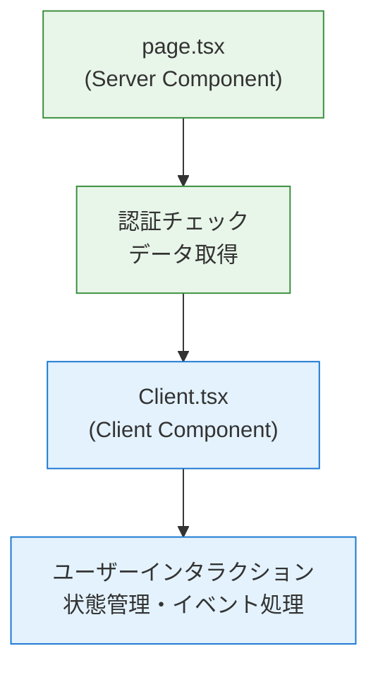
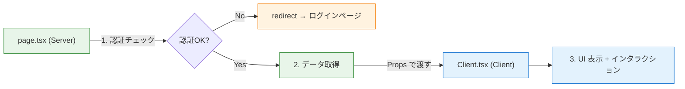

# 2-4-2 Server Components と Client Components

📝 **前提知識**: このセクションは 2-4-1 Next.js の設計思想と App Router の内容を前提としています。

## 🎯 このセクションで学ぶこと

- Server Components と Client Components の違いと、それぞれの役割を理解する
- `'use client'` ディレクティブの意味と、Server/Client の境界がどこで決まるかを理解する
- LMS の実コードで使われている Server → Client の分離パターンを読み解く
- レンダリング戦略（SSR/SSG/ISR）の概要を把握する

まず「コンポーネントがどこで実行されるか」という視点を学び、Server Components と Client Components の使い分けを理解した上で、LMS の実コードでその分離パターンを確認します。最後にレンダリング戦略の全体像を概観します。

---

## 導入: 「どこで実行されるか」という新しい視点

Chapter 2-3 の React では、コンポーネントはすべてブラウザ上で動くものとして学んできました。`useState` でステートを管理し、`useEffect` でデータを取得し、イベントハンドラでユーザー操作に応答する。これらはすべてブラウザ（クライアント）側の処理です。

しかし、Next.js 14 の App Router を使うと、新たな疑問が生まれます。

- API からデータを取得するロジックは、ブラウザで実行するべきか、サーバーで実行するべきか
- API キーやデータベース接続情報を含む処理を、ブラウザに送ってよいのか
- ページを表示するたびにブラウザでデータを取得すると、ユーザーには一瞬空白のページが見えてしまう

Laravel の世界では、この問題は存在しませんでした。Controller がサーバー側でデータを取得し、Blade テンプレートに渡して HTML を生成し、完成した HTML をブラウザに送る。すべてがサーバーで完結していたからです。

Next.js 14 の **Server Components** は、この Laravel 的な「サーバーで処理を完結させる」感覚を React の世界に持ち込みます。すべてのコンポーネントをブラウザで動かすのではなく、「このコンポーネントはサーバーで実行する」「このコンポーネントはブラウザで実行する」と役割を分けるのです。

### 🧠 先輩エンジニアはこう考える

> LMS の開発で Server Components を使い始めたとき、最初は「結局 Laravel に戻ったのか？」と思いました。サーバーでデータを取得して、テンプレートに渡して表示する。やっていることは Controller + Blade と同じに見えます。でも決定的に違うのは、サーバー側の処理とクライアント側のインタラクションを **1つのコンポーネントツリー** の中で自然に組み合わせられること。Laravel だと「サーバーで HTML を返す」か「API + SPA で全部クライアント」かの二者択一でしたが、Server Components はそのいいとこ取りなんです。LMS では page.tsx でデータを取得して Client.tsx に渡す、というパターンを徹底しています。この分離がわかると、LMS のフロントエンドのコードがすっと読めるようになります。


---

## Server Components とは

Next.js 14 の App Router では、**すべてのコンポーネントはデフォルトで Server Components** です。`page.tsx` や `layout.tsx` に書いたコンポーネントは、特に何も指定しなければサーバー側で実行されます。

### サーバーで実行されるとはどういうことか

Server Components は、Node.js のサーバー上で実行されます。つまり、ブラウザには送られません。サーバーで実行された結果（レンダリング結果）だけがブラウザに送られます。

これは Laravel の Controller + Blade と非常によく似ています。

```php
// Laravel: Controller がデータ取得 → Blade に渡す
class UserController extends Controller
{
    public function show(int $id)
    {
        $user = User::findOrFail($id);  // サーバーでデータ取得
        return view('users.show', compact('user'));  // Blade テンプレートに渡す
    }
}
```

Server Components では、同じことを React コンポーネントの中で行います。

```tsx
// Next.js: Server Component がデータ取得 → JSX で描画
export default async function Page({ params }: { params: { id: string } }) {
  const { id } = params
  const user = await fetchUser(id)  // サーバーでデータ取得

  return <div>{user.name}</div>  // JSX でレンダリング
}
```

注目すべきポイントは、コンポーネント関数が `async` であることです。Server Components は `async` / `await` を使ってサーバー上で直接データを取得できます。`useEffect` でブラウザからAPI を呼ぶ必要がありません。

### Server Components の利点

Server Components がサーバーで実行されることには、いくつかの重要な利点があります。

| 利点 | 説明 |
|---|---|
| **セキュリティ** | API キー、データベース接続情報、内部 API の URL などがブラウザに送られない |
| **パフォーマンス** | データ取得がサーバー側で完結するため、ブラウザとサーバー間の往復通信が減る |
| **バンドルサイズ** | サーバーでしか使わないライブラリ（データベースクライアント等）がブラウザに送られない |
| **初期表示速度** | データが埋め込まれた HTML がブラウザに届くため、ユーザーは即座にコンテンツを見られる |

🔑 **重要な制約**: Server Components はサーバーで実行されるため、ブラウザの機能を使えません。具体的には、`useState`、`useEffect` などの React Hooks、`onClick` などのイベントハンドラ、`window` や `document` などのブラウザ API が使えません。

---

## Client Components とは

ブラウザでのインタラクション（ボタンのクリック、フォームの入力、状態の変更など）が必要な場合は、**Client Components** を使います。

Client Components は、ファイルの先頭に `'use client'` ディレクティブを記述することで宣言します。

```tsx
'use client'

import { useState } from 'react'

export default function Counter() {
  const [count, setCount] = useState(0)

  return (
    <button onClick={() => setCount(count + 1)}>
      カウント: {count}
    </button>
  )
}
```

`'use client'` は「このファイルと、このファイルがインポートするモジュールはブラウザで実行する」という宣言です。この1行が Server と Client の境界を決定します。

### Client Components が必要になる場面

Chapter 2-3 で学んだ React の機能は、すべて Client Components 側で使うものです。

| 機能 | 該当セクション | なぜ Client が必要か |
|---|---|---|
| `useState` / `useReducer` | 2-3-2 State と Hooks | ステート管理はブラウザ側の機能 |
| `useEffect` | 2-3-2 State と Hooks | 副作用の実行はブラウザのライフサイクルに依存 |
| `useContext` | 2-3-2 State と Hooks | Context はクライアント側のコンポーネントツリーで共有 |
| `onClick` / `onChange` 等 | 2-3-1 コンポーネントと JSX | イベントハンドラはブラウザのイベントシステムに依存 |
| `useRouter` (next/navigation) | - | クライアント側のナビゲーション |
| `window` / `document` | - | ブラウザ API はサーバーに存在しない |

⚠️ **注意**: `'use client'` を付けたコンポーネントが「ブラウザでしか動かない」という意味ではありません。Client Components はサーバー側でも HTML としてプリレンダリングされ、ブラウザに送られた後にインタラクティブになります（ハイドレーション）。`'use client'` は「ブラウザ側でも実行される」という意味です。

---

## Server → Client の境界パターン

Server Components と Client Components をどう組み合わせるかが、Next.js 14 アプリケーション設計の核心です。LMS では、以下のパターンが一貫して使われています。



🔑 **基本原則**: データの取得は Server 側（`page.tsx`）で行い、インタラクションは Client 側（`Client.tsx`）で行う。Server Component が取得したデータを Props として Client Component に渡します。

この分離パターンは、Laravel の Controller と Blade の関係に対応します。

| Laravel | Next.js (App Router) |
|---|---|
| Controller（データ取得・認証） | `page.tsx`（Server Component） |
| Blade テンプレート（表示・フォーム） | `Client.tsx`（Client Component） |
| `compact('users')` でデータを渡す | Props でデータを渡す |

---

## LMS の Server/Client 分離の実例

LMS のコードを見て、この分離パターンがどう実践されているかを確認しましょう。

### 実例 1: ログインページ（認証チェック → リダイレクト → Client 表示）

ログインページでは、Server Component がすでにログイン済みかどうかをチェックし、ログイン済みであればリダイレクト、未ログインであればログインフォームを表示します。

```tsx
// frontend/src/app/v2/user/(auth)/login/page.tsx
import { fetchMeAsUser } from '@/features/v2/user/api/fetchMeAsUser'
import { getUserRedirectPath } from '@/features/v2/userAuth/utils/getUserRedirectPath'
import { isMobileUserAgent } from '@/lib/v2/device-detection'
import { headers } from 'next/headers'
import { redirect } from 'next/navigation'
import Client from './Client'

export default async function Page() {
  const response = await fetchMeAsUser({}, { callbacks: { onAuthError: () => {} } })
  const user = response?.data

  if (user?.id && user.activeWorkspace) {
    const headersList = await headers()
    const isMobile = isMobileUserAgent(headersList.get('user-agent'))
    const redirectPath = getUserRedirectPath(user, isMobile)
    if (redirectPath) {
      redirect(redirectPath)
    }
  }

  return <Client />
}
```

この `page.tsx` の処理の流れを追ってみましょう。

1. **`fetchMeAsUser`** でサーバー側から認証 API を呼び、現在のユーザー情報を取得する
2. ユーザーがログイン済み（`user.id` が存在する）であれば、**`redirect`** で適切なページにリダイレクトする。モバイルかどうかも `headers()` でサーバー側で判定する
3. 未ログインであれば、**`<Client />`** コンポーネントを表示する

ここでの重要なポイントは、認証チェックとリダイレクトがすべてサーバー側で完了していることです。ブラウザにはログインフォームの HTML か、リダイレクトレスポンスのどちらかしか届きません。

対応する Client Component は次のようになっています。

```tsx
// frontend/src/app/v2/user/(auth)/login/Client.tsx
'use client'

import { Image } from '@/components/v2/elements/Image'
import LoginForm from '@/features/v2/userAuth/components/LoginForm'
import { Suspense } from 'react'

export default function Client() {
  return (
    <div className='flex min-h-screen flex-col justify-center xl:flex-row xl:justify-start'>
      {/* 左側: イラストエリア */}
      <div className='hidden w-full items-center justify-center bg-brand-secondary-800 xl:flex xl:w-1/2'>
        <div className='relative p-8'>
          <Image src='/images/v2/login_hero.png' alt='ログインイラスト' height={384} width={384} />
        </div>
      </div>

      {/* 右側: ログインフォームエリア */}
      <div className='flex w-full items-center justify-center bg-white xl:w-1/2'>
        <Suspense>
          <LoginForm />
        </Suspense>
      </div>
    </div>
  )
}
```

Client Component 側は `'use client'` を宣言し、ログインフォーム（`LoginForm`）の表示を担当しています。`LoginForm` はフォーム入力や送信ボタンのクリックなど、ブラウザでのインタラクションが必要なため Client Component です。

💡 この例ではログインページのため、Server Component から Client Component にデータを渡していません（Props なし）。ログイン済みユーザーはサーバー側でリダイレクトされるため、Client Component が表示される時点で「未ログイン」が確定しています。

### 実例 2: 管理画面（`Promise.all` で並列データ取得）

面談担当者管理ページでは、Server Component が複数の API を並列に呼び出してデータを取得します。

💡 **TIP**: LMS の実コードでは `params` の型が `Promise<{ workspaceId: string }>` となっており、`await params` でパラメータを取り出しています。これは Next.js 15 で導入された非同期 `params` API に対応した書き方です。Next.js 14 では `params` は同期オブジェクトでしたが、LMS では将来のアップグレードを見据えてこの形式を採用しています。

```tsx
// frontend/src/app/v2/employee/[workspaceId]/admin/(main)/application-interviewers/page.tsx
import { fetchApplicationInterviewEmployeesByApplication } from '@/features/v2/applicationInterviewEmployee/api/fetchApplicationInterviewEmployeesByApplication'
import { APPLICATION_TYPE } from '@/features/v2/applicationInterviewEmployee/constants/applicationType'
import Client from './Client'

type Props = {
  params: Promise<{ workspaceId: string }>
}

export default async function Page({ params }: Props) {
  const { workspaceId } = await params

  const [
    cancellationApplicationInterviewEmployees,
    suspendApplicationInterviewEmployees,
    coachChangeApplicationInterviewEmployees,
  ] = await Promise.all([
    fetchApplicationInterviewEmployeesByApplication({
      pathParams: { workspaceId },
      queryParams: { applicationType: APPLICATION_TYPE.CANCELLATION_APPLICATION },
    }),
    fetchApplicationInterviewEmployeesByApplication({
      pathParams: { workspaceId },
      queryParams: { applicationType: APPLICATION_TYPE.SUSPEND_APPLICATION },
    }),
    fetchApplicationInterviewEmployeesByApplication({
      pathParams: { workspaceId },
      queryParams: { applicationType: APPLICATION_TYPE.COACH_CHANGE_APPLICATION },
    }),
  ])

  return (
    <Client
      workspaceId={workspaceId}
      cancellationApplicationInterviewEmployees={cancellationApplicationInterviewEmployees.data}
      suspendApplicationInterviewEmployees={suspendApplicationInterviewEmployees.data}
      coachChangeApplicationInterviewEmployees={coachChangeApplicationInterviewEmployees.data}
    />
  )
}
```

この例のポイントは **`Promise.all`** です。3つの API 呼び出しを並列で実行することで、順番に呼ぶよりも待ち時間が短くなります。この並列データ取得はサーバー側で行われるため、ブラウザからの通信は発生しません。

Laravel に置き換えると、Controller の中で複数のモデルからデータを取得して `compact()` で View に渡すのと同じ発想です。

```php
// Laravel で同じことをする場合のイメージ
public function index(string $workspaceId)
{
    $cancellation = ApplicationInterviewEmployee::where('type', 'cancellation')->get();
    $suspend = ApplicationInterviewEmployee::where('type', 'suspend')->get();
    $coachChange = ApplicationInterviewEmployee::where('type', 'coach_change')->get();

    return view('admin.interviewers', compact('cancellation', 'suspend', 'coachChange'));
}
```

違いは、Laravel では Eloquent でデータベースに直接アクセスしていたのに対し、Next.js の Server Component ではバックエンド API を呼び出してデータを取得している点です。LMS はフロントエンド（Next.js）とバックエンド（Laravel）が別アプリケーションとして分離されているため、Server Component はバックエンドの API 経由でデータを取得します。

取得したデータは Props として `Client` コンポーネントに渡され、Client 側でテーブル表示やソート、ルーティングなどのインタラクティブな処理が行われます。

### 実例 3: カリキュラムページ（認証 + データ取得）

カリキュラムのセクション表示ページでは、認証チェックとデータ取得の両方を Server Component が担当しています。

```tsx
// frontend/src/app/v2/user/[workspaceId]/(main)/curriculums/[curriculumId]/chapters/[chapterId]/sections/[sectionId]/page.tsx
import { fetchPublicSection } from '@/features/v2/section/api/fetchPublicSection'
import { requireUser } from '@/hooks/v2/auth'
import Client from './Client'

type Props = {
  params: Promise<{
    workspaceId: string
    curriculumId: string
    chapterId: string
    sectionId: string
  }>
}

export default async function Page({ params }: Props) {
  const { workspaceId, curriculumId, chapterId, sectionId } = await params

  // ユーザー情報を取得
  const user = await requireUser()
  const userId = user.id

  // セクション情報を取得（公開中のもののみ）
  const { data: section } = await fetchPublicSection({
    pathParams: { workspaceId, curriculumId, chapterId, sectionId },
  })

  return <Client workspaceId={workspaceId} userId={userId} section={section} />
}
```

ここで使われている **`requireUser`** は、LMS が用意した Server Component 用の認証ヘルパー関数です。以下は主要部分の抜粋です。

```tsx
// frontend/src/hooks/v2/auth.ts
import { fetchMeAsUser } from '@/features/v2/user/api/fetchMeAsUser'
import { buildLoginUrlWithRedirect } from '@/lib/v2/redirect'
import { headers } from 'next/headers'
import { redirect } from 'next/navigation'
import { cache } from 'react'

export const requireUser = cache(
  async (): Promise<FetchMeAsUserHttpDocument['response']['data']> => {
    const { data: user } = await fetchMeAsUser({}, {})

    if (!user?.id) {
      const currentPath = await getCurrentPath()
      redirect(buildLoginUrlWithRedirect('/v2/user/login', currentPath))
    }

    return user
  },
)
```

`requireUser` の処理は次のとおりです。

1. サーバー側で認証 API を呼び出し、ユーザー情報を取得する
2. ユーザーが未認証であれば、ログインページにリダイレクトする（リダイレクト後に元のページに戻れるよう、現在のパスを URL に含める）
3. 認証済みであれば、ユーザー情報を返す

`cache` で関数をラップしているのは、同じリクエスト内で `requireUser` が複数回呼ばれた場合に API の重複呼び出しを防ぐためです。

💡 Laravel の認証ミドルウェア（`auth` ミドルウェア）に相当する処理が、Server Component のヘルパー関数として実装されています。Laravel では `Route::middleware('auth')` でルートに認証を適用しますが、LMS の Next.js では各 `page.tsx` の中で `requireUser()` を呼ぶことで認証チェックを行っています。

### 3 つの実例に共通するパターン

ここまでの実例を振り返ると、LMS のコードに一貫したパターンが見えてきます。



| 責務 | 実行場所 | 担当ファイル |
|---|---|---|
| 認証チェック（`requireUser` / `fetchMeAsUser`） | サーバー | `page.tsx` |
| データ取得（`fetch*` 関数） | サーバー | `page.tsx` |
| リダイレクト（`redirect`） | サーバー | `page.tsx` |
| UI の表示・状態管理・イベント処理 | ブラウザ | `Client.tsx` |

この分離により、セキュリティに関わる処理（認証チェック、API キーを使ったデータ取得）はサーバーで完結し、ブラウザには必要なデータだけが Props として渡されます。

---

## レンダリング戦略の概要

Next.js 14 では、コンポーネントをいつ、どのようにレンダリングするかを制御する複数の戦略があります。ここでは概要のみを把握してください。深い理解は現時点では不要です。

| 戦略 | 正式名称 | いつレンダリングされるか | 適する用途 |
|---|---|---|---|
| **SSR** | Server-Side Rendering | リクエストのたびにサーバーで生成 | ユーザーごとに異なるデータを表示するページ（認証が必要なページ等） |
| **SSG** | Static Site Generation | ビルド時に HTML を生成 | すべてのユーザーに同じ内容を表示するページ（ブログ記事、ドキュメント等） |
| **ISR** | Incremental Static Regeneration | ビルド時に生成 + 一定時間後に再生成 | 頻繁には変わらないが定期的に更新されるページ（商品一覧等） |

### LMS ではどの戦略が使われているか

LMS は認証が必要なアプリケーションであり、ほとんどのページでログインユーザーごとに異なるデータを表示します。そのため、LMS のページは基本的に **SSR** （リクエストごとにサーバーでレンダリング）で動作しています。

先ほど見た `page.tsx` が `async` 関数で `await` を使ってデータを取得していたのは、まさにリクエストのたびにサーバーで実行される SSR の動作です。

📝 App Router では、コンポーネント内で `cookies()` や `headers()` などのリクエスト依存の関数を使うと自動的に SSR になります。LMS の認証チェック（`requireUser` 内の `headers()` 呼び出し）がこれに該当するため、明示的な設定なしで SSR として動作しています。

---

## ✨ まとめ

- Next.js 14 の App Router では、**すべてのコンポーネントはデフォルトで Server Components** であり、サーバー上で実行される。`async` / `await` で直接データを取得でき、API キーなどの機密情報がブラウザに漏れない
- ブラウザでのインタラクション（ステート管理、イベントハンドラ、Hooks）が必要な場合は、ファイル先頭に **`'use client'`** を記述して Client Components にする
- LMS では **`page.tsx`（Server）→ `Client.tsx`（Client）** の分離パターンが一貫して使われている。認証チェックとデータ取得は Server 側で行い、UI 表示とインタラクションは Client 側が担当する
- LMS は認証が必要なアプリケーションのため、基本的に **SSR** （リクエストごとのサーバーレンダリング）で動作している

---

次のセクションでは、layout.tsx、loading.tsx、error.tsx といった App Router の特殊ファイルの役割、ミドルウェアによるリクエスト制御の仕組み、そして next.config.mjs による Next.js の設定方法を学びます。ミドルウェアによるリクエスト制御が、Server Components での認証チェックとどう使い分けられるかも理解していきます。
