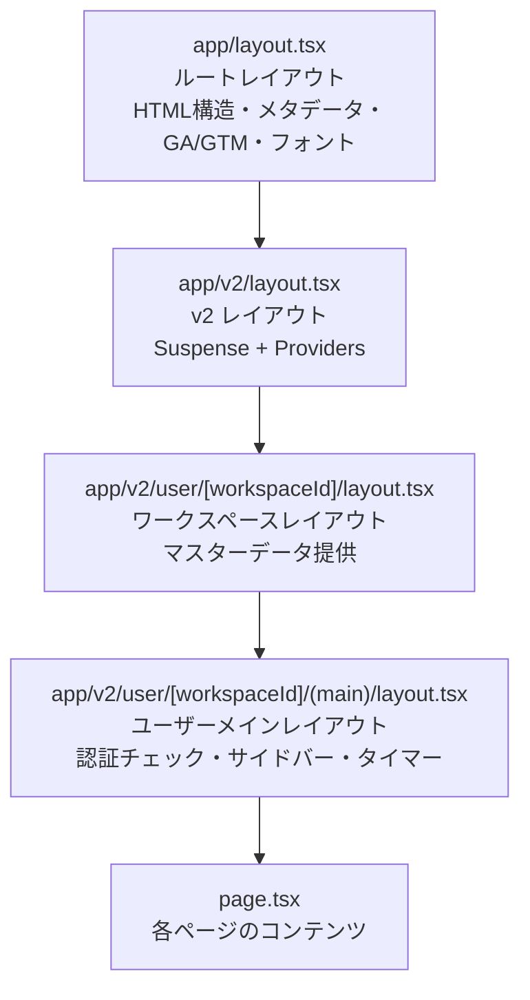

# 2-4-3 レイアウト・ミドルウェア・設定

📝 **前提知識**: このセクションは 2-4-2 Server Components と Client Components の内容を前提としています。

## 🎯 このセクションで学ぶこと

- `layout.tsx` によるネストレイアウトの仕組みと、ページ遷移時に再レンダリングされない特性を理解する
- `loading.tsx`・`error.tsx`・`not-found.tsx` といった特殊ファイルの役割を理解する
- Next.js のミドルウェア（`middleware.ts`）の概念と、LMS が採用する代替パターンを理解する
- `next.config.mjs` の設定項目を読み解けるようになる

このセクションでは、App Router が提供する「ページの枠組み」を管理する仕組みと、アプリケーション全体の設定について学びます。

---

## 導入: 「ページ共通の枠組み」をどう管理するか

Web アプリケーションには、ページごとに異なるコンテンツの他に、すべてのページで共通する要素があります。ヘッダー、サイドバー、フッター、ナビゲーションといったものです。

Laravel の Blade テンプレートでは、`@extends('layouts.app')` と `@yield('content')` を使ってレイアウトを共有していました。親テンプレートに共通部分を定義し、各ページが `@section('content')` で中身だけを差し替える仕組みです。

しかし、Blade のレイアウトはサーバーサイドでリクエストのたびに全体が再生成されます。ページ遷移のたびにヘッダーやサイドバーも含めて HTML を丸ごと作り直していました。

Next.js の App Router では、この「共通の枠組み」をよりスマートに管理します。レイアウトはネスト（入れ子）構造で定義でき、ページ遷移時にレイアウト部分は再レンダリングされません。さらに、ローディング状態やエラー状態を宣言的に管理する仕組みも組み込まれています。

### 🧠 先輩エンジニアはこう考える

> LMS の開発で最初に感心したのは、レイアウトの設計です。ルートレイアウトで Google Analytics やフォント設定を一括管理し、v2 レイアウトで UI プロバイダーを注入し、さらにユーザー用レイアウトで認証チェックとサイドバーを組み込む。この階層構造のおかげで、各レイヤーの責務が明確に分離されています。Blade のレイアウトだと、認証チェックと UI の枠組みとメタデータ設定が 1 つのテンプレートに混在しがちでしたが、Next.js のネストレイアウトなら自然に分離できます。

---

## layout.tsx の仕組み

### レイアウトとは何か

Next.js 14 の App Router における **layout.tsx** は、複数のページで共有される UI の枠組みを定義するファイルです。`app/` ディレクトリの各階層に配置でき、その階層以下のすべてのページに適用されます。

Laravel の Blade テンプレートと対比すると、以下のように対応します。

| Blade テンプレート | Next.js App Router |
|---|---|
| `@extends('layouts.app')` | 親ディレクトリの `layout.tsx` が自動適用 |
| `@yield('content')` | `{children}` Props |
| `@section('content')` | `page.tsx` のコンテンツ |
| `@include('partials.header')` | レイアウト内のコンポーネント呼び出し |

Blade との大きな違いは、Next.js のレイアウトでは各ページが「どのレイアウトを使うか」を明示的に宣言する必要がないことです。ファイルシステムの階層構造がそのままレイアウトの適用範囲を決定します。

### ネストするレイアウト

App Router のレイアウトは入れ子構造になります。`app/layout.tsx` がルートレイアウトとして全ページに適用され、その下の階層に配置された `layout.tsx` が追加のレイアウト層として重なっていきます。

🔑 **レイアウトの重要な特性**: ページ遷移時にレイアウトは再レンダリングされません。たとえばユーザーが `/dashboard` から `/settings` に遷移したとき、共通のレイアウト（サイドバーやヘッダー）は状態を保持したまま、`page.tsx` の部分だけが差し替わります。これは Blade テンプレートがリクエストごとに全体を再生成する動作とは根本的に異なります。

### LMS のレイアウト階層

LMS のフロントエンドでは、ユーザー画面（v2）に対して以下のようなレイアウト階層が構築されています。



それぞれの階層を実際のコードで確認しましょう。

#### ルートレイアウト（`app/layout.tsx`）

ルートレイアウトはアプリケーション全体に適用される最上位のレイアウトです。`<html>` タグと `<body>` タグを含む唯一のレイアウトであり、必ず 1 つ存在する必要があります。

```tsx
// frontend/src/app/layout.tsx
import { GOOGLE_ANALYTICS_ID, GOOGLE_TAG_MANAGER_ID } from '@/config/v2'
import { fetchMasters } from '@/features/v1/master/api'
import '@/globals.css'
import { GoogleAnalytics, GoogleTagManager } from '@next/third-parties/google'
import type { Metadata } from 'next'
import { Inter } from 'next/font/google'

export async function generateMetadata(): Promise<Metadata> {
  // マスターデータを取得
  const { data: masters } = await fetchMasters()
  const isStaging = masters.isStaging
  const faviconPath = isStaging ? '/favicon-staging.ico' : '/favicon.ico'
  const title = isStaging ? '【STG】COACHTECH LMS' : 'COACHTECH LMS'

  return {
    robots: { index: false, follow: false },
    title,
    description: 'Google Search Console HTML Tag',
    verification: {
      google: 'ptjeL0idTf_1zkUtS093IjpwIIXQCdeyomhqdsqdTHk',
    },
    icons: {
      icon: faviconPath,
      shortcut: faviconPath,
      apple: faviconPath,
    },
  }
}

const inter = Inter({ subsets: ['latin'] })

export default function RootLayout({
  children,
}: Readonly<{
  children: React.ReactNode
}>) {
  return (
    <html lang='ja'>
      <head>
        <link rel='preconnect' href={process.env.NEXT_PUBLIC_API_URL} crossOrigin='use-credentials' />
        <link rel='dns-prefetch' href={process.env.NEXT_PUBLIC_API_URL} />
      </head>
      {!!GOOGLE_TAG_MANAGER_ID && <GoogleTagManager gtmId={GOOGLE_TAG_MANAGER_ID} />}
      {!!GOOGLE_ANALYTICS_ID && <GoogleAnalytics gaId={GOOGLE_ANALYTICS_ID} />}
      <body className={inter.className}>{children}</body>
    </html>
  )
}
```

このルートレイアウトが担っている責務を整理します。

- **メタデータ生成**: `generateMetadata` で動的にタイトルやファビコンを設定。ステージング環境と本番環境で区別できるようにしています
- **フォント設定**: `next/font/google` の `Inter` フォントを使い、ブラウザのレイアウトシフト（FOUT）を防いでいます
- **外部サービス統合**: Google Analytics と Google Tag Manager をコンポーネントとして組み込んでいます
- **API 接続の高速化**: `preconnect` と `dns-prefetch` でバックエンド API への接続を事前に確立しています

💡 `generateMetadata` は Server Component のみで使える非同期関数です。サーバーサイドで API を呼び出してメタデータを動的に生成できます。2-4-2 で学んだ Server Components の特性が活きている部分です。

#### v2 レイアウト（`app/v2/layout.tsx`）

```tsx
// frontend/src/app/v2/layout.tsx
import { Providers } from '@/providers/v2/providers'
import { Suspense } from 'react'

export default function V2Layout({
  children,
}: Readonly<{
  children: React.ReactNode
}>) {
  return (
    <Suspense>
      <Providers>{children}</Providers>
    </Suspense>
  )
}
```

v2 レイアウトは非常にシンプルですが、重要な役割を果たしています。

- **Suspense 境界**: React の `Suspense` でラップし、非同期処理の待機中に安全なフォールバックを提供します
- **プロバイダー注入**: `Providers` コンポーネントが HeroUI のテーマプロバイダーやトースト通知、ローディング状態の管理を子コンポーネント全体に提供します

`Providers` の中身を見てみましょう。

```tsx
// frontend/src/providers/v2/providers.tsx
'use client'

import { LoadingProvider } from '@/hooks/v2/useLoading'
import { isMobileDevice } from '@/lib/v2/device-detection'
import { HeroUIProvider } from '@heroui/react'
import { ToastProvider } from '@heroui/toast'
import { useRouter } from 'next/navigation'
import { useEffect, useState, type FC, type ReactNode } from 'react'

export const Providers: FC<{ children: ReactNode }> = ({ children }) => {
  const router = useRouter()
  const [placement, setPlacement] = useState<'top-center' | 'bottom-right'>('bottom-right')

  useEffect(() => {
    const handleResize = () => {
      setPlacement(isMobileDevice() ? 'top-center' : 'bottom-right')
    }

    handleResize() // 初回実行
    window.addEventListener('resize', handleResize)
    return () => window.removeEventListener('resize', handleResize)
  }, [])

  return (
    <HeroUIProvider locale='ja' navigate={router.push}>
      <ToastProvider placement={placement} toastProps={{ timeout: 1000 }} />
      <LoadingProvider>{children}</LoadingProvider>
    </HeroUIProvider>
  )
}
```

`Providers` は `'use client'` ディレクティブを持つ Client Component です。`useRouter` や `useEffect` などのフックを使用するため、クライアントサイドで実行される必要があります。v2 レイアウト自体は Server Component ですが、`Providers` を Client Component として切り出すことで、境界を適切に分離しています。

#### ユーザーメインレイアウト（`app/v2/user/[workspaceId]/(main)/layout.tsx`）

最も具体的なレイアウトが、ユーザーのメイン画面用レイアウトです。

```tsx
// frontend/src/app/v2/user/[workspaceId]/(main)/layout.tsx
'use client'

import { UserLayout } from '@/components/v2/layouts/UserLayout'
import { ACCOUNT_TYPE } from '@/constants/v2/accountType'
import useDisclosure from '@/hooks/v2/useDisclosure'
import { buildLoginUrlWithCurrentPath } from '@/lib/v2/redirect'
import { useActorHydrated, useActorStore } from '@/store/v2/actor-store'
import { useLearningTimerStore } from '@/store/v2/learning-timer-store'
import { useSidebarStore } from '@/store/v2/sidebar-store'
import { useRouter } from 'next/navigation'
import { useEffect, useState } from 'react'

export default function Layout({ children }: { children: React.ReactNode }) {
  const router = useRouter()
  const { actor, actorType, isManualLogout, clearManualLogout } = useActorStore((state) => state)
  const [isSidebarOpen, setIsSidebarOpen] = useState(false)

  // サイドバーの状態（Zustand）
  const togglePinned = useSidebarStore((state) => state.togglePinned)

  // タイマーの状態（Zustand）
  const { isTimerOpen, openTimer, closeTimer } = useLearningTimerStore()

  // 質問パネルの状態
  const questionDrawer = useDisclosure()

  const userId = actor?.id

  // ストアの復元完了を検知
  const isHydrated = useActorHydrated()

  useEffect(() => {
    if (!isHydrated) return

    if (!actor || actorType !== ACCOUNT_TYPE.USER) {
      if (isManualLogout) {
        clearManualLogout()
        router.push('/v2/user/login')
      } else {
        router.push(buildLoginUrlWithCurrentPath('/v2/user/login'))
      }
    }
  }, [isHydrated, actor, actorType, router])

  // ストア復元中、または認証されていない場合は何も表示しない
  if (!isHydrated || !actor || actorType !== ACCOUNT_TYPE.USER) {
    return null
  }

  return (
    <UserLayout
      actor={actor}
      isSidebarOpen={isSidebarOpen}
      onSidebarOpenChange={setIsSidebarOpen}
      onSidebarToggle={togglePinned}
      isTimerOpen={isTimerOpen}
      onTimerClose={closeTimer}
      onTimerToggle={() => (isTimerOpen ? closeTimer() : openTimer())}
      questionDrawer={questionDrawer}
      userId={userId}
    >
      {children}
    </UserLayout>
  )
}
```

このレイアウトは `'use client'` ディレクティブを持つ Client Component であり、以下の責務を担っています。

- **認証チェック**: Zustand ストア（`useActorStore`）からユーザー情報を取得し、未認証ならログインページにリダイレクト。ストアのハイドレーション完了（`isHydrated`）を待ってからチェックを行います
- **サイドバー状態管理**: `useSidebarStore` でピン留め状態を管理
- **学習タイマー**: `useLearningTimerStore` で学習時間計測の状態を管理
- **UI 表示**: `UserLayout` コンポーネントにサイドバー、タイマー、質問パネルなどの共通 UI を集約

#### ワークスペースレイアウト（`app/v2/user/[workspaceId]/layout.tsx`）

ワークスペースレイアウトは Server Component で、マスターデータ（ワークスペースの基本情報）を配下のページに提供します。

```tsx
// frontend/src/app/v2/user/[workspaceId]/layout.tsx
import MasterProviderWrapper from '@/features/v2/master/components/MasterProviderWrapper'

export default function WorkspaceLayout({ children }: { children: React.ReactNode }) {
  return <MasterProviderWrapper>{children}</MasterProviderWrapper>
}
```

`MasterProviderWrapper` がマスターデータの取得と Context への注入を担当し、配下のすべてのページからマスターデータにアクセスできるようにしています。

#### ユーザーメインレイアウト（`app/v2/user/[workspaceId]/(main)/layout.tsx`）

📝 パスに含まれる `(main)` はセクション 2-4-1 で学んだルートグループの仕組みで、URL には影響しません。`/v2/user/123/dashboard` のようなパスでアクセスしたとき、`(main)` は URL に現れず、レイアウトの適用範囲をグルーピングするためだけに使われます。

### レイアウトの階層構造がもたらすメリット

ここまで見てきたように、LMS のレイアウトは各階層が独立した責務を持っています。

| 階層 | 責務 | Server / Client |
|---|---|---|
| ルートレイアウト | HTML 構造、メタデータ、フォント、外部サービス | Server Component |
| v2 レイアウト | Suspense 境界、UI プロバイダー | Server Component（Providers は Client） |
| ワークスペースレイアウト | マスターデータ提供 | Server Component |
| ユーザーメインレイアウト | 認証チェック、サイドバー、タイマー | Client Component |

この分離により、たとえば認証チェックのロジックを変更しても、メタデータ設定やプロバイダー構成には影響しません。また、ユーザーがページ間を遷移しても、サイドバーの開閉状態やタイマーの計測状態が維持されます。これがレイアウトが「再レンダリングされない」ことの実用的な意味です。

---

## 特殊ファイル

App Router では、`page.tsx` と `layout.tsx` 以外にも、特定の役割を持つ特殊ファイルを配置できます。

### loading.tsx（Suspense 境界）

`loading.tsx` は、ページの読み込み中に表示されるローディング UI を定義するファイルです。Next.js 14 はこのファイルを自動的に React の `Suspense` 境界でラップします。

```tsx
// app/dashboard/loading.tsx（一般的な例）
export default function Loading() {
  return <div>読み込み中...</div>
}
```

`loading.tsx` を配置すると、そのディレクトリの `page.tsx` が非同期処理（データフェッチなど）を行っている間、自動的にローディング UI が表示されます。

### error.tsx（エラー境界）

`error.tsx` は、そのディレクトリ以下で発生したランタイムエラーをキャッチし、エラー UI を表示するファイルです。React の Error Boundary を自動的に設定してくれます。

```tsx
// app/dashboard/error.tsx（一般的な例）
'use client' // error.tsx は必ず Client Component

export default function Error({
  error,
  reset,
}: {
  error: Error
  reset: () => void
}) {
  return (
    <div>
      <h2>エラーが発生しました</h2>
      <button onClick={reset}>再試行</button>
    </div>
  )
}
```

⚠️ **注意**: `error.tsx` は必ず `'use client'` ディレクティブが必要です。エラーのリカバリ（`reset` 関数による再試行）はクライアントサイドで行われるためです。

### not-found.tsx（404 ページ）

`not-found.tsx` は、存在しないページにアクセスしたときに表示されるカスタム 404 ページを定義します。`app/not-found.tsx` に配置するとアプリケーション全体の 404 ページとして機能します。

LMS の `not-found.tsx` を見てみましょう。

```tsx
// frontend/src/app/not-found.tsx
import { Link } from '@/components/v2/elements/Link'
import { FiAlertTriangle, FiHome } from 'react-icons/fi'

export default function NotFound() {
  return (
    <div className='flex min-h-screen items-center justify-center bg-gradient-to-br from-blue-50 via-white to-indigo-50'>
      <div className='relative w-full max-w-lg px-6'>
        {/* 背景装飾 */}
        <div className='absolute inset-0 -z-10'>
          <div className='absolute -left-4 -top-4 size-72 animate-pulse rounded-full bg-blue-200 opacity-20 blur-3xl'></div>
          <div
            className='absolute -bottom-4 -right-4 size-72 animate-pulse rounded-full bg-indigo-200 opacity-20 blur-3xl'
            style={{ animationDelay: '1s' }}
          ></div>
        </div>

        <div className='animate-fade-in relative rounded-2xl bg-white/80 p-8 text-center shadow-2xl backdrop-blur-sm'>
          {/* 404アイコン */}
          <div className='mx-auto mb-6 flex size-24 items-center justify-center rounded-full bg-gradient-to-r from-red-100 to-orange-100'>
            <FiAlertTriangle className='size-12 text-red-500' />
          </div>

          {/* 404テキスト */}
          <h1 className='mb-4 bg-gradient-to-r from-red-500 to-orange-500 bg-clip-text text-8xl font-bold text-transparent'>
            404
          </h1>

          {/* タイトル */}
          <h2 className='mb-4 text-2xl font-bold text-gray-800'>ページが見つかりませんでした</h2>

          {/* 説明文 */}
          <p className='mb-8 whitespace-pre-line leading-relaxed text-gray-600'>
            {`お探しのページは存在しないか、移動または削除された可能性があります。
正しいURLをご確認いただくか、以下のリンクからお進みください。`}
          </p>

          {/* アクションボタン */}
          <div className='space-y-4'>
            <Link
              href='/v2/user/login/'
              className='group relative inline-flex w-full items-center justify-center rounded-xl bg-gradient-to-r from-blue-600 to-indigo-600 px-6 py-3 font-semibold text-white transition-all duration-300 hover:scale-105 hover:from-blue-700 hover:to-indigo-700 hover:shadow-lg active:scale-95'
            >
              <FiHome className='mr-2 size-5 transition-transform group-hover:scale-110' />
              ログインページへ
            </Link>
          </div>
        </div>
      </div>
    </div>
  )
}
```

<!-- TODO: 画像追加 - LMS の 404 ページ -->

LMS の 404 ページは、グラデーション背景やアニメーション付きのアイコン、ログインページへの誘導ボタンなど、ユーザーフレンドリーなデザインになっています。`not-found.tsx` は Server Component として動作するため、`'use client'` ディレクティブは不要です。

### LMS における loading.tsx / error.tsx の不在

LMS のコードベースを確認すると、`loading.tsx` と `error.tsx` は使用されていません。これには理由があります。

- **loading.tsx の代替**: LMS では、ローディング状態を `Providers` 内の `LoadingProvider` で一元管理しています。各コンポーネントが `useLoading` フックを通じてローディング状態を制御するパターンを採用しており、ページ単位の `loading.tsx` よりも細かい粒度でローディング表示を制御できます
- **error.tsx の代替**: API 通信のエラーハンドリングは、HTTP クライアント層（`fetch.ts`）で一括処理しています。認証エラー（401）やセッション切れ（419）はリダイレクトで対応し、その他のエラーはトースト通知で表示するパターンです

💡 `loading.tsx` と `error.tsx` は Next.js が提供する便利な仕組みですが、すべてのプロジェクトで使う必要はありません。LMS のように独自のローディング/エラーハンドリング基盤がある場合は、そちらを活用する設計も有効です。

### 特殊ファイルの一覧

App Router で使える特殊ファイルを整理しておきます。

| ファイル | 役割 | LMS での使用 |
|---|---|---|
| `page.tsx` | ページのコンテンツ | 使用 |
| `layout.tsx` | 共有レイアウト | 使用（多階層） |
| `loading.tsx` | ローディング UI | 未使用（LoadingProvider で代替） |
| `error.tsx` | エラー UI | 未使用（HTTP クライアント層で代替） |
| `not-found.tsx` | 404 ページ | 使用（ルートに配置） |
| `template.tsx` | 毎回再マウントされるレイアウト | 未使用 |

---

## ミドルウェアの概念

### Next.js の middleware.ts

Next.js には、リクエストがページに到達する前に処理を挟むための **middleware.ts** という仕組みがあります。プロジェクトのルート（`src/` ディレクトリ直下）に配置し、すべてのリクエスト（または指定したパスのリクエスト）に対して実行されます。

```tsx
// src/middleware.ts（一般的な例）
import { NextResponse } from 'next/server'
import type { NextRequest } from 'next/server'

export function middleware(request: NextRequest) {
  // 認証トークンの確認
  const token = request.cookies.get('auth-token')

  if (!token) {
    return NextResponse.redirect(new URL('/login', request.url))
  }

  return NextResponse.next()
}

// ミドルウェアを適用するパスを指定
export const config = {
  matcher: ['/dashboard/:path*', '/settings/:path*'],
}
```

### Laravel ミドルウェアとの対比

Laravel のミドルウェアに馴染みがあるあなたにとって、Next.js のミドルウェアは概念的に似ています。ただし、実行環境と適用方法に違いがあります。

| 項目 | Laravel ミドルウェア | Next.js middleware.ts |
|---|---|---|
| 実行環境 | サーバー（PHP ランタイム） | Edge Runtime（軽量な JavaScript ランタイム） |
| 定義方法 | クラスとして定義（`handle` メソッド） | 関数としてエクスポート |
| 適用方法 | ルートやグループに `->middleware('auth')` で適用 | `matcher` 設定でパスを指定 |
| 適用単位 | ルート単位で柔軟に設定 | ファイル 1 つで全体を管理 |
| 主な用途 | 認証、認可、ロギング、CORS | 認証、リダイレクト、ヘッダー操作 |

🔑 Next.js のミドルウェアは **Edge Runtime** で実行されるため、Node.js の全機能は使えません。データベースへの直接アクセスや、Node.js 固有のモジュール（`fs` など）は利用できない点に注意してください。

### LMS がミドルウェアを使わない理由

LMS のフロントエンドには `middleware.ts` が存在しません。代わりに、レイアウトレベルでの認証チェックで同等の機能を実現しています。

先ほど見たユーザーメインレイアウト（`app/v2/user/[workspaceId]/(main)/layout.tsx`）がその実装です。Zustand ストアからユーザー情報を取得し、未認証であればログインページにリダイレクトしています。

この設計を選択した背景を整理します。

1. **認証状態の管理方法**: LMS ではクライアントサイドの Zustand ストアで認証状態を管理しています。`middleware.ts` は Edge Runtime で実行されるため、Zustand ストアに直接アクセスできません
2. **認証チェックの粒度**: ミドルウェアはパスパターンでの一括制御ですが、レイアウトレベルなら階層ごとに異なる認証ロジック（ユーザー用、管理者用、コーチ用など）を適用できます
3. **ストアのハイドレーション**: クライアントサイドでストアが復元（ハイドレーション）されるのを待ってから認証チェックを行う必要があり、この処理は Client Component 内で `useEffect` を使って実現するのが自然です

```tsx
// ユーザーメインレイアウトの認証チェック部分（再掲）
const isHydrated = useActorHydrated()

useEffect(() => {
  if (!isHydrated) return

  if (!actor || actorType !== ACCOUNT_TYPE.USER) {
    if (isManualLogout) {
      clearManualLogout()
      router.push('/v2/user/login')
    } else {
      router.push(buildLoginUrlWithCurrentPath('/v2/user/login'))
    }
  }
}, [isHydrated, actor, actorType, router])
```

`isHydrated` が `true` になるまで認証チェックを遅延させ、ストアの復元完了後に判定を行っています。手動ログアウト（`isManualLogout`）の場合はシンプルにログインページへ、それ以外（セッション切れなど）の場合は現在のパスを保持した URL でリダイレクトし、再ログイン後に元のページに戻れるようにしています。

---

## next.config.mjs の設定

Next.js アプリケーションの動作を制御する設定ファイルが `next.config.mjs` です。Laravel における `config/app.php` のような役割を果たします。LMS の設定ファイルを読み解いてみましょう。

```javascript
// frontend/next.config.mjs
import bundleAnalyzer from '@next/bundle-analyzer'

const withBundleAnalyzer = bundleAnalyzer({
  enabled: process.env.ANALYZE === 'true',
})

/** @type {import('next').NextConfig} */
const nextConfig = {
  reactStrictMode: true,
  trailingSlash: true,
  productionBrowserSourceMaps: false,
  images: { unoptimized: true },
}

export default withBundleAnalyzer(nextConfig)
```

各設定項目の意味を確認します。

### reactStrictMode

```javascript
reactStrictMode: true,
```

React の **Strict Mode** を有効にする設定です。開発環境で以下の問題を検出するのに役立ちます。

- 非推奨の API の使用
- `useEffect` の副作用の不備（開発時にエフェクトを 2 回実行して問題を検出）
- 予期しない再レンダリング

本番環境には影響しません。開発時のデバッグを助ける仕組みなので、基本的に `true` にしておくのが推奨です。

### trailingSlash

```javascript
trailingSlash: true,
```

URL の末尾にスラッシュを付けるかどうかの設定です。`true` にすると、`/dashboard` ではなく `/dashboard/` が正規の URL になります。

LMS では `trailingSlash: true` を有効にしています。これにより、リダイレクトの一貫性が保たれ、CloudFront のキャッシュキーが統一されるメリットがあります。

### productionBrowserSourceMaps

```javascript
productionBrowserSourceMaps: false,
```

本番環境でブラウザ用のソースマップを生成するかどうかの設定です。`false` にすることで、本番ビルドのファイルサイズを削減し、ソースコードの内容がブラウザの開発者ツールから確認されることを防いでいます。

### images

```javascript
images: { unoptimized: true },
```

Next.js の画像最適化機能を無効にする設定です。Next.js にはビルトインの画像最適化（`next/image` コンポーネント）がありますが、この機能は Next.js サーバー上での画像変換処理を前提としています。LMS ではアップロード画像を API 経由で取得するため、Next.js 側の最適化が不要であり、`unoptimized: true` で無効化しています。

### bundleAnalyzer

```javascript
import bundleAnalyzer from '@next/bundle-analyzer'

const withBundleAnalyzer = bundleAnalyzer({
  enabled: process.env.ANALYZE === 'true',
})

export default withBundleAnalyzer(nextConfig)
```

**@next/bundle-analyzer** は、ビルドされた JavaScript バンドルの内容を視覚的に分析するツールです。`ANALYZE=true npm run build` のように環境変数を指定してビルドすると、どのライブラリがどれだけのサイズを占めているかをツリーマップで確認できます。

この設定は「プラグインパターン」を使っています。`withBundleAnalyzer(nextConfig)` のように設定オブジェクトを関数でラップすることで、Next.js の設定を拡張しています。Laravel で例えるなら、`config/app.php` の配列を返す前にミドルウェアで加工するようなイメージです。

---

## ✨ まとめ

- **layout.tsx** はネストレイアウトを定義するファイルであり、ページ遷移時に再レンダリングされない。LMS ではルートレイアウト、v2 レイアウト、ワークスペースレイアウト、ユーザーメインレイアウトの 4 階層でそれぞれの責務を分離している
- **特殊ファイル** （`loading.tsx`、`error.tsx`、`not-found.tsx`）はページの状態に応じた UI を宣言的に定義できる。LMS では `not-found.tsx` のみ使用し、ローディングとエラーは独自の仕組みで管理している
- **middleware.ts** はリクエストがページに到達する前に処理を挟む仕組み。LMS ではクライアントサイドの Zustand ストアで認証を管理しているため、レイアウトレベルの認証チェックで代替している
- **next.config.mjs** はアプリケーション全体の動作を設定するファイル。LMS では `reactStrictMode`、`trailingSlash`、画像最適化の無効化、バンドル分析ツールを設定している

---

Chapter 4「Next.js」では、Next.js の設計思想と App Router の仕組み、Server Components と Client Components の使い分け、そしてレイアウト・ミドルウェア・設定について学びました。Laravel がサーバーサイドで完結していた Web 開発を、Next.js がどのようにフロントエンド側から再構築しているかが見えてきたはずです。

Part 2 全体を振り返ると、JavaScript の基礎（PHP との違い、非同期処理、モジュールシステム）から始まり、TypeScript で型安全性を加え、React でコンポーネント指向の UI 構築を学び、最後に Next.js でそれらを本格的なアプリケーションとして統合するところまで到達しました。これらはすべて LMS フロントエンドを「読む」ための基盤です。

Part 3「フロントエンドエコシステム」では、この基盤の上に乗るライブラリ群を学びます。Zustand による状態管理、SWR によるデータフェッチ、React Hook Form によるフォーム処理、HeroUI や MUI といった UI ライブラリ、そしてリッチコンテンツの実装パターンを理解し、LMS フロントエンドのコードを実践的に読み解ける力を身につけていきます。
