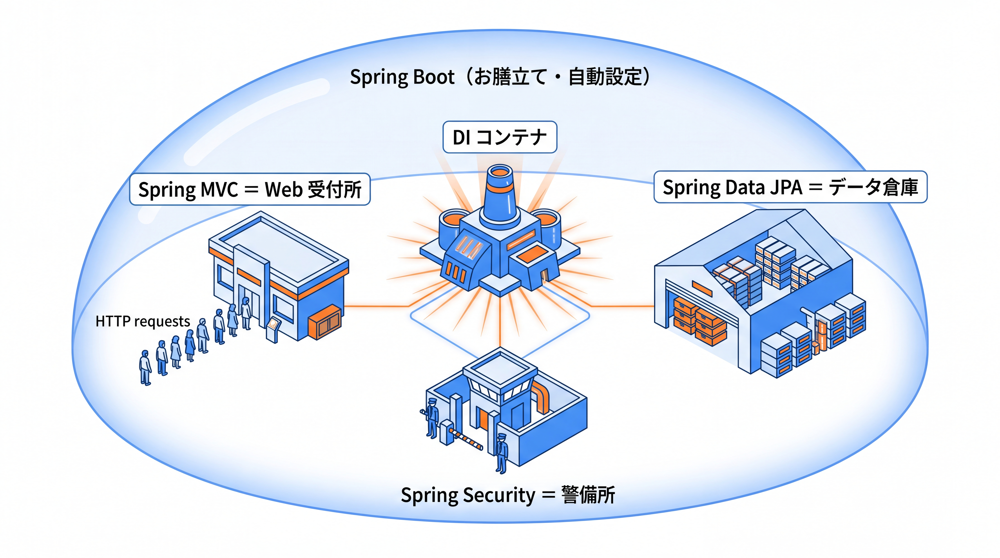
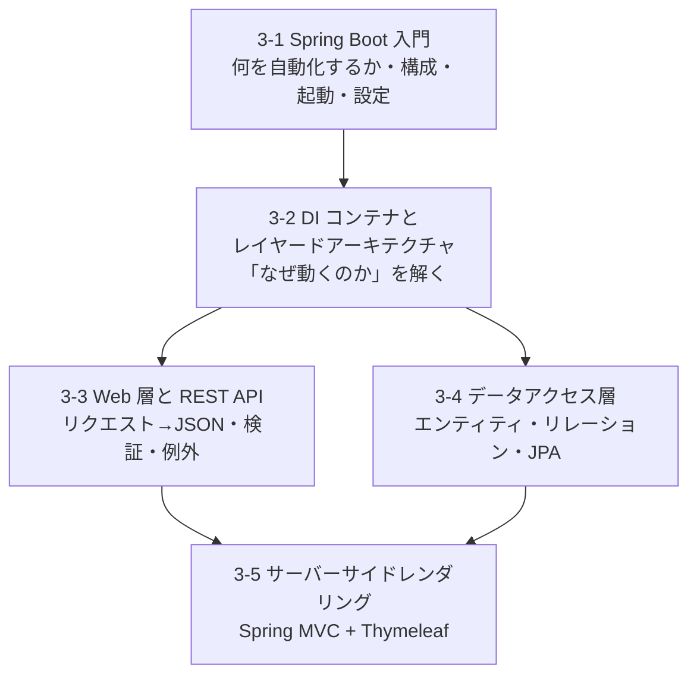
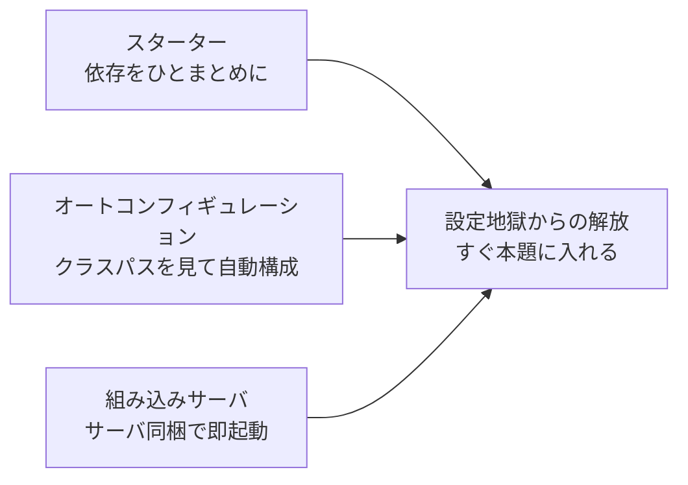
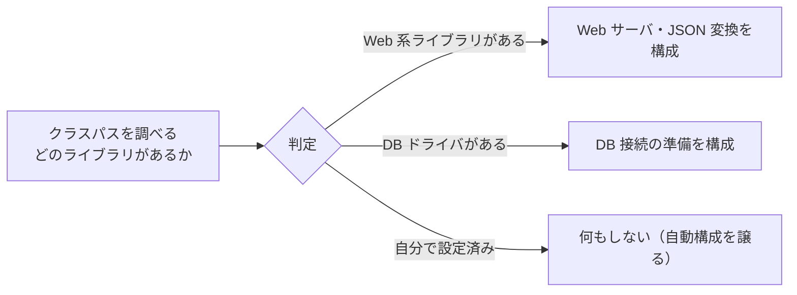

# 3-1-1 Spring と Spring Boot の世界

Chapter 3-1 では、Spring Boot がそもそも何者で、何を自動でやってくれるのかを俯瞰し、その上でプロジェクトを構成・起動・設定できるところまでを扱います。Part 2 まではあなた自身が書いた Java だけで動くコードを読んできましたが、ここからは Spring Boot という巨大なフレームワークの上に乗ります。まずは「乗る土台」の正体をつかみましょう。

| セクション | テーマ | 種類 |
|---|---|---|
| 3-1-1 Spring と Spring Boot の世界 | Spring エコシステム・Spring Boot の役割・スターター・オートコンフィギュレーション | 概念 |
| 3-1-2 Maven とプロジェクトの構成 | `pom.xml`・依存管理・標準プロジェクト構造・ビルドライフサイクル | 概念 |
| 3-1-3 アプリケーションの起動と設定 | `@SpringBootApplication`・組み込みサーバ・`application.yml`・プロファイル | 概念 |

📖 **この Chapter の進め方**: まず本セクションで Spring と Spring Boot の関係、そして Spring Boot が「設定地獄」をどう解消するかを俯瞰します。次に 3-1-2 で、プロジェクトの設計図である `pom.xml` と標準的なフォルダ構成を読み解きます。最後に 3-1-3 で、アプリの起点となる `@SpringBootApplication` と設定の与え方を学び、Spring Boot アプリを「構成し、起動し、設定できる」状態を完成させます。

📝 **前提知識**: このセクションは「2-3-2 ポリモーフィズム」の内容を前提としています。

## 🎯 このセクションで学ぶこと

- Spring（巨大なエコシステムとその中心にある DI コンテナ）と Spring Boot の関係を説明できる
- Spring Boot が何を自動化しているか（スターター・オートコンフィギュレーション・「規約より設定」）を俯瞰できる
- Laravel の「規約」と初期構成のありがたみが、Spring Boot のどの仕組みに対応するかを説明できる

本セクションでは、まず Part 3 全体の地図を確認したあと、Spring Framework とは何かから始め、Spring Boot の役割、スターター、オートコンフィギュレーションへと進みます。

---

## 導入: その「お膳立て」は、誰がやっていたのか

Laravel で新しいアプリを始めるとき、あなたは `composer create-project` を一度叩くだけで作業を始められました。ルーティングの仕組みも、DB 接続の設定も、リクエストを受けて画面を返す土台も、すべてお膳立てされた状態でプロジェクトが手元に届きました。`routes/web.php` にルートを 1 行書けば、もう動きます。当たり前のように感じていたかもしれませんが、あの「最初から動く状態」は、Laravel というフレームワークが膨大な初期設定を肩代わりしてくれていたから成り立っていました。

Java と Spring の世界でも、同じ「お膳立て」が必要です。Web サーバを起動し、HTTP リクエストを Java のメソッドに振り分け、DB に繋ぎ、JSON を組み立てる。これらをゼロから自前で組むと、本来やりたい「タスクを登録する」機能にたどり着く前に、設定だけで日が暮れます。その面倒を引き受けてくれるのが **Spring Boot** です。本セクションでは、Spring という大きな世界の中で Spring Boot がどんな役割を担い、Laravel が裏でやっていた「お膳立て」を Java ではどう実現するのかを俯瞰します。

### 🧠 先輩エンジニアの思考プロセス

> Laravel から Java に移って最初に戸惑ったのは、「フレームワークを入れた直後に動くもの」が少なかったことでした。私が最初に触ったのは Spring Boot ではなく素の Spring で、XML の設定ファイルに Bean を一つひとつ書き連ねる時代でした。DB に繋ぐだけで設定ファイルが何十行にもなり、Laravel の `.env` を数行いじれば動いていた身からすると、別世界のように感じたものです。
>
> Spring Boot を初めて使ったときの感想は「これが欲しかった」でした。依存を一つ足すだけで Web サーバまで付いてきて、設定ファイルはほぼ空でも動く。Laravel が当たり前にやっていた「規約に従えば設定はいらない」という発想が、ようやく Java にも来たと感じました。今では新規プロジェクトで素の Spring を選ぶことはまずありません。

---

## Part 3 の地図: Spring で API の縦串を通す

Part 3 は、Spring Boot を使って 1 本の REST API を上から下まで（Web 層からデータ層まで）組めるようになる Part です。Part 1・2 で身につけた Java とオブジェクト指向を土台に、いよいよフレームワークの上で開発します。学ぶ順序は次のとおりです。

- **3-1 Spring Boot 入門**: Spring Boot が何を自動化しているかを俯瞰し、プロジェクトの構成・起動・設定を扱います（本 Chapter）。
- **3-2 DI コンテナとレイヤードアーキテクチャ**: Laravel のサービスコンテナやファサードが見せていた「魔法」を、DI（依存性注入）コンテナという明示的な仕組みとして解き明かします。あわせて Controller・Service・Repository という層の分け方を学びます。
- **3-3 Web 層と REST API の実装**: HTTP リクエストを受けて JSON を返す Web 層を組みます。ルーティング・DTO・バリデーション・例外ハンドリングまで、API の入出力を一通り扱います。
- **3-4 データアクセス層と Spring Data JPA**: テーブルとクラスを対応づけるエンティティ、リレーション、リポジトリ、トランザクションを学び、DB 操作を Eloquent の知識を足がかりに組みます。
- **3-5 サーバーサイドレンダリング入門**: Spring Boot は JSON だけでなく HTML 画面も返せます。Spring MVC と Thymeleaf で最小の画面描画を組み、業務系案件に多い構成に備えます。

🔑 とりわけ **3-2 の DI コンテナ** が Part 3 の核心です。Spring Boot が動くすべての「なぜ」はここに集約されます。3-3 や 3-4 で書くコードが「なぜそう書くだけで動くのか」を説明できるかどうかは、3-2 の理解にかかっています。本セクションでは DI の詳細には踏み込みませんが、「Spring の中心には DI コンテナがある」という地図上の位置だけ、先に頭に置いておいてください。

---

## Spring Framework とは何か

**Spring Framework** （スプリングフレームワーク）は、Java でアプリケーションを作るための土台を提供する、巨大なフレームワークです。「巨大」というのは比喩ではありません。Spring は単一の製品ではなく、Web 開発・データアクセス・セキュリティ・メッセージングなど、用途ごとに多数のプロジェクトが集まった **エコシステム** を形成しています。あなたが Part 3 以降で触れる主なものだけでも、次のように分かれています。

| プロジェクト | 役割 | 本教材で扱う Part |
|---|---|---|
| Spring Framework（Core） | DI コンテナなど全体の土台 | Part 3（3-2） |
| Spring MVC | Web 層（HTTP リクエスト処理・REST API） | Part 3（3-3, 3-5） |
| Spring Data JPA | データアクセス層（DB 操作） | Part 3（3-4） |
| Spring Security | 認証・認可 | Part 4（4-1） |

これだけ広いエコシステムですが、その **中心にあるのは DI コンテナ** （DI = Dependency Injection、依存性注入）という一つの仕組みです。DI コンテナとは、ごく大づかみに言えば「アプリで使う部品（オブジェクト）を、あなたの代わりに生成し、必要なところへ手渡してくれる管理役」です。あなたが `new` で部品を組み立てて回るのではなく、コンテナが組み立てて配ってくれます。

実はこの発想、あなたは Laravel で既に体験しています。Laravel のコントローラのメソッドに型を書いておくと、必要なクラスのインスタンスが勝手に注入されてきました。あの「勝手に注入される」仕組みが、Laravel のサービスコンテナです。Spring の DI コンテナはそれと同じ役割を、より明示的な形で担います。そしてこの「実装を差し替えられる」設計を支えているのが、Part 2 の最後（2-3-2）で学んだ **ポリモーフィズム** です。インターフェース型で受け取っておけば中身の実装を入れ替えられる、というあの考え方が、DI の根っこにあります。

ここでは「Spring の中心には DI コンテナがある」と俯瞰できれば十分です。DI が具体的にどう動くのか、なぜそれが「魔法」ではなく仕組みなのかは、本 Chapter の次の Chapter（3-2-1）で正式に解き明かします。

💡 **Laravel との対応**: Laravel が「フルスタックフレームワーク」として 1 つにまとまっているのに対し、Spring は用途ごとのプロジェクトの集合体です。Laravel で言えば、ルーティング・Eloquent・認証がそれぞれ独立したライブラリとして提供され、必要なものを組み合わせて使うイメージに近いです。バラバラだと組み合わせが大変そうに聞こえますが、その「組み合わせの面倒」を引き受けるのが、次に説明する Spring Boot です。

---

## Spring Boot の役割: 設定地獄からの解放

Spring Framework は強力ですが、かつては使い始めるまでが大変でした。どのライブラリをどのバージョンで組み合わせるか、Web サーバとどう繋ぐか、DB 接続をどう設定するか。これらを XML の設定ファイルや Java の設定クラスに一つひとつ書き連ねる必要があり、本題に入る前の準備だけで膨大な記述が積み上がりました。世界中の開発者がこれを **設定地獄** （configuration hell）と呼んでいました。

**Spring Boot** （スプリングブート）は、この設定地獄を解消するために生まれました。Spring Boot は新しいフレームワークではなく、Spring Framework の上に乗る「立ち上げを劇的に楽にする層」だと捉えてください。Spring Boot が提供する価値は、大きく次の 3 つです。

このうち **スターター** と **オートコンフィギュレーション** を本セクションで、**組み込みサーバ** は次の次のセクション（3-1-3）で扱います。これら全体を貫く設計思想が、**「規約より設定」** （Convention over Configuration）です。これは「みんなが普通こうするだろう、という一般的なやり方（規約）をフレームワーク側が初めから用意しておき、特別なことをしたいときだけ設定を書けばよい」という考え方です。

この発想自体は、あなたにとって目新しくありません。Laravel がまさにそうでした。コントローラを `app/Http/Controllers` に置く、モデルは単数形・テーブルは複数形、`.env` に DB 接続情報を書く。こうした「決まりごと」に従うだけで、いちいち設定しなくても動きました。Spring Boot は、Java の世界に同じ「決まりごとに従えば設定はいらない」という快適さを持ち込んだものです。

💡 **Laravel との対応**: Laravel の「規約」と初期構成のありがたみが、そのまま Spring Boot のオートコンフィギュレーションに対応します。Laravel が `config/database.php` の既定値や命名規則で「書かなくても動く」状態を作っていたのと同じように、Spring Boot はクラスパスの状況を見て妥当な既定を自動で当てはめます。どちらも「特別なことをしたいときだけ設定を上書きする」点で発想が一致しています。

> 💡 **バージョンの前提**: 本教材は **Spring Boot 4.0.x** を前提に書きます（**4.0.x** は 2025年11月に正式リリースされました。具体的な数値が要る箇所では、2026年6月時点の最新パッチ **4.0.6** を用います）。その土台となる **Spring Framework は 7.0** 系、動かす Java は **21** （LTS）です。現場では Spring Boot 3.x もまだ広く使われているため、書き方が変わる箇所では「3.x ではこう書く」というコラムを随所で添えます。

---

## スターター: 依存をひとまとめにする

Java のプロジェクトでは、使いたいライブラリ（依存ライブラリ）を一つひとつ指定して取り込みます。Laravel での `composer require` に相当する作業です。ところが Web アプリを 1 つ作るだけでも、実際には大量のライブラリが必要になります。Spring MVC 本体、JSON を組み立てるライブラリ、Web サーバ、バリデーション、ログ出力。これらを個別に、しかも互いにバージョンが噛み合うように選ぶのは骨が折れます。

そこで Spring Boot は **スターター** （starter）という仕組みを用意しました。スターターは「ある目的に必要なライブラリ一式を、相性の取れたバージョンでまとめた依存の詰め合わせ」です。たとえば Web アプリを作りたいなら、`spring-boot-starter-web` という 1 つのスターターを取り込むだけで、Spring MVC・JSON 処理・組み込み Web サーバ（Tomcat）などがまとめて手に入ります。代表的なスターターを挙げます。

| スターター | 何が手に入るか |
|---|---|
| `spring-boot-starter-web` | Spring MVC・JSON 処理・組み込み Tomcat（REST API / Web アプリの土台） |
| `spring-boot-starter-data-jpa` | Spring Data JPA・Hibernate（DB 操作。3-4 で使用） |
| `spring-boot-starter-validation` | Bean Validation（入力検証。3-3-3 で使用） |
| `spring-boot-starter-security` | Spring Security（認証・認可。Part 4 で使用） |
| `spring-boot-starter-test` | JUnit Jupiter・Mockito など（テスト一式。Part 4 で使用） |

スターターの名前には規約があります。Spring チームが公式に提供するものは必ず `spring-boot-starter-*` という形をとり、`*` の部分が用途を表します。一方、サードパーティが提供するスターターは `名前-spring-boot-starter` の形にする決まりで、`spring-boot-` で始めてはいけません（公式の予約済み）。名前の形を見れば、それが公式提供かどうかが判別できるようになっています。

💡 **Laravel との対応**: スターターは、Laravel で言えば「目的別にまとめられた Composer パッケージ」に近い存在です。`laravel/sanctum` を入れれば認証に必要なものが一通り揃ったように、`spring-boot-starter-web` を入れれば Web 開発に必要なものが一通り揃います。違いは、スターターが「動作確認済みのバージョンの組み合わせ」まで保証してくれる点です。どのライブラリをどのバージョンで合わせるかという悩みを、スターター（と次セクションで扱う親 POM）が引き受けます。

---

## オートコンフィギュレーション: クラスパスを見て自動で構成する

スターターは「必要なライブラリを集める」役割でした。しかし、ライブラリを集めただけでは動きません。集めたライブラリを「実際に使える状態にセットアップする」工程が要ります。たとえば Web サーバを起動し、JSON を組み立てる部品を準備し、DB ドライバがあれば接続の準備をする。この **セットアップを自動で行う** のが **オートコンフィギュレーション** （auto-configuration、自動構成）です。

オートコンフィギュレーションの仕組みは、ひとことで言えば「クラスパス（取り込んだライブラリの一覧）を見て、状況に応じて妥当な構成を自動で当てはめる」というものです。動作のイメージは次のとおりです。

具体的には、Spring Boot は起動時に「Tomcat に関するクラスがクラスパスにあるか」「Jackson（JSON ライブラリ）があるか」「DB ドライバがあるか」といった条件を一つひとつ確認します。条件に当てはまれば、それに対応する設定（必要な部品＝Bean の登録）を自動で行います。`spring-boot-starter-web` を入れただけで Web サーバが立ち上がるのは、スターターが Tomcat をクラスパスに乗せ、オートコンフィギュレーションがそれを検知して「では Web サーバを構成しよう」と判断するからです。

重要な性質がもう一つあります。オートコンフィギュレーションは **出しゃばりません** （公式は「非侵襲的（non-invasive）」と表現しています）。もしあなたが自分で設定を書いた場合、自動構成はその部分から **手を引きます**。たとえば DB 接続を自分で細かく設定すれば、Spring Boot の自動の DB 設定は黙って身を引きます。つまり「普通でよければ何も書かなくてよい、こだわりたいところだけ書けば自動構成が譲ってくれる」という、まさに「規約より設定」を体現した動きをします。

💡 **どの自動構成が効いたか確かめたいとき**: 起動時に `--debug` を付けると、Spring Boot が「どの自動構成が適用され、どれが見送られたか」の一覧（条件レポート）を出力します。`java -jar myapp.jar --debug` のように指定します。「なぜか動かない／余計なものが動く」を調べるときの定番の手段です。

💡 **Laravel との対応**: Laravel では、サービスプロバイダ（Service Provider）が「このパッケージを使うならこういう設定を登録する」という初期化を担っていました。あなたがパッケージを入れると、そのパッケージのサービスプロバイダが自動で読み込まれ、必要な準備が整いました。Spring Boot のオートコンフィギュレーションは、これに非常に近い役割です。「ライブラリの存在を検知して、使える状態に整える」という働きが共通しています。

---

## ✨ まとめ

- **Spring Framework** は用途別のプロジェクトが集まった巨大なエコシステムで、その中心には部品（Bean）を生成・配布する **DI コンテナ** がある（DI の詳細は 3-2-1 で解説）
- **Spring Boot** は Spring の上に乗り、かつての「設定地獄」を解消する層。貫く思想は **「規約より設定」** で、Laravel の規約・初期構成のありがたみに対応する
- **スターター** は「目的別に必要なライブラリ一式を相性の取れたバージョンでまとめた詰め合わせ」。公式は `spring-boot-starter-*`、例として `spring-boot-starter-web` で Web 開発の土台が一括で揃う
- **オートコンフィギュレーション** はクラスパスを見て妥当な構成を自動で当てはめる仕組み。自分で設定した部分からは手を引く（非侵襲的）。Laravel のサービスプロバイダによる自動初期化に対応する

---

次のセクションでは、Spring Boot プロジェクトの設計図である `pom.xml` を読み解きます。スターターで集めた依存をどう記述するのか（依存管理）、推移的依存や親 POM がバージョンをどう統一するのか、`src/main/java` などの標準プロジェクト構造はどうなっているのか、そしてコンパイルからパッケージングまでのビルドライフサイクルを学び、「Spring Boot プロジェクトに依存をどう追加するか」を説明できるようにします。
