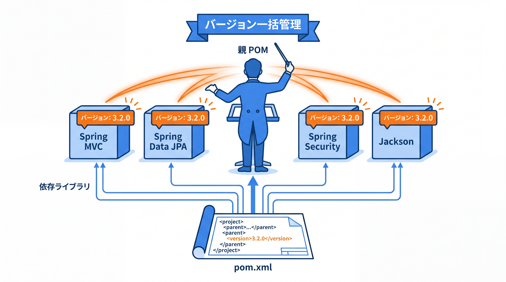
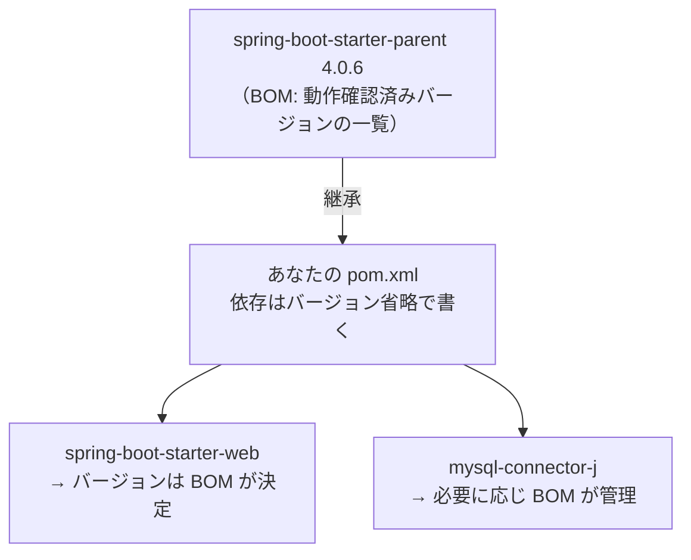
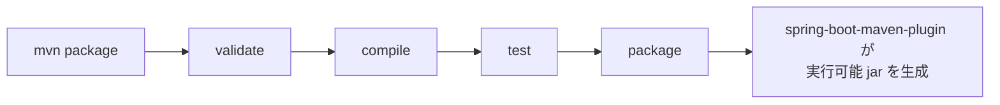

# 3-1-2 Maven とプロジェクトの構成

📝 **前提知識**: このセクションは「3-1-1 Spring と Spring Boot の世界」と「1-1-3 Java プロジェクトの形」の内容を前提としています。

## 🎯 このセクションで学ぶこと

- `pom.xml` の構造（座標・依存・親 POM）を読み解き、依存をどう追加するか説明できる
- 依存管理・推移的依存・親 POM（BOM）がバージョンをどう統一するかを理解する
- `src/main/java` などの標準プロジェクト構造とビルドライフサイクルを理解する

本セクションでは、`pom.xml` の座標から始め、依存と親 POM、標準プロジェクト構造、そしてビルドライフサイクルへと進みます。

---

## 導入: プロジェクトの設計図はどこにあるのか

Laravel のプロジェクトを開いたとき、あなたはまず `composer.json` を見たはずです。どのパッケージをどのバージョンで使うのか、オートロードはどう設定されているのか。プロジェクトの依存と構成を一望できる、いわば「設計図」のファイルでした。`composer install` を叩けば、そこに書かれた依存がまとめてダウンロードされ、`composer require` で新しいパッケージを足せました。

Java と Spring Boot の世界にも、これに相当する設計図があります。それが **Maven** （メイヴン）というビルドツールが読む `pom.xml` です。前のセクション（3-1-1）で学んだスターターも、実際には `pom.xml` に「この依存を使う」と書くことで取り込まれます。本セクションでは、この `pom.xml` を読み解き、「Spring Boot プロジェクトに依存をどう追加するのか」「集めた依存のバージョンはどう統一されるのか」を理解します。Java のコードがどの単位で構成されるか（パッケージ・クラス・`main`）は 1-1-3 で扱いました。ここではその外側、プロジェクト全体の組み立て方に踏み込みます。

### 🧠 先輩エンジニアの思考プロセス

> Laravel 時代、私は `composer.json` のバージョン指定にそこまで神経を使っていませんでした。`composer require` で入れれば、だいたい噛み合ったバージョンが入ってくる感覚でした。Java で初めて自分でライブラリを足したとき、依存ライブラリ同士のバージョンが合わずにビルドが通らない、という壁にぶつかって面食らったのを覚えています。
>
> 救いだったのが Spring Boot の親 POM でした。親 POM がライブラリ群のバージョンを一括で決めてくれるので、私が `pom.xml` に書く依存にはバージョンを書かなくてよい。Spring Boot のバージョンを 1 つ上げれば、関連ライブラリのバージョンが一斉に整合の取れた組み合わせへ揃います。「バージョンの組み合わせを自分で管理しなくていい」ことが、これほど楽だとは思いませんでした。



---

## pom.xml の構造: 座標でプロジェクトを識別する

`pom.xml`（POM = Project Object Model、プロジェクトオブジェクトモデル）は、Maven が読むプロジェクトの設計図です。XML 形式で書かれ、プロジェクトの名前・依存・ビルド方法などを宣言的に記述します。Composer の `composer.json` が JSON だったのに対し、Maven は XML を使う、という違いがまずあります。

`pom.xml` の最初に来るのが、そのプロジェクト自身を一意に識別する **座標** （coordinates）です。座標は次の 3 つの要素からなります。

| 要素 | 役割 | 例 |
|---|---|---|
| `groupId` | 組織・グループの識別子（ドメインの逆順が慣例） | `com.example` |
| `artifactId` | 成果物（プロジェクト）の名前 | `taskapp` |
| `version` | バージョン | `0.0.1-SNAPSHOT` |

この 3 つの組み合わせで、世界中のどのライブラリとも重複しない一意な「住所」が決まります。本教材のタスク管理アプリなら、`com.example` というグループの `taskapp` というプロジェクト、と読めます。実際の `pom.xml` の骨格は次のようになります（以下は主要部分の抜粋です。文字コードやプロパティなど一部を省略しています）。

```xml
<!-- pom.xml -->
<project xmlns="http://maven.apache.org/POM/4.0.0" ...>
    <modelVersion>4.0.0</modelVersion>

    <!-- 親 POM: Spring Boot が依存バージョンを一括管理する -->
    <parent>
        <groupId>org.springframework.boot</groupId>
        <artifactId>spring-boot-starter-parent</artifactId>
        <version>4.0.6</version>
        <relativePath/>
    </parent>

    <!-- このプロジェクト自身の座標 -->
    <groupId>com.example</groupId>
    <artifactId>taskapp</artifactId>
    <version>0.0.1-SNAPSHOT</version>

    <properties>
        <java.version>21</java.version>
    </properties>

    <dependencies>
        <!-- Web 開発の土台（Spring MVC・JSON・組み込み Tomcat） -->
        <dependency>
            <groupId>org.springframework.boot</groupId>
            <artifactId>spring-boot-starter-web</artifactId>
        </dependency>

        <!-- MySQL ドライバ（実行時にだけ必要なので runtime スコープ） -->
        <dependency>
            <groupId>com.mysql</groupId>
            <artifactId>mysql-connector-j</artifactId>
            <scope>runtime</scope>
        </dependency>

        <!-- テスト一式（Part 4 で詳説） -->
        <dependency>
            <groupId>org.springframework.boot</groupId>
            <artifactId>spring-boot-starter-test</artifactId>
            <scope>test</scope>
        </dependency>
    </dependencies>

    <build>
        <plugins>
            <plugin>
                <groupId>org.springframework.boot</groupId>
                <artifactId>spring-boot-maven-plugin</artifactId>
            </plugin>
        </plugins>
    </build>
</project>
```

注目すべき点は、`spring-boot-starter-web` や `spring-boot-starter-test` に **バージョン番号が書かれていない** ことです。普通なら依存にはバージョンが必須ですが、ここでは省略できています。なぜそれで動くのかが、次の親 POM の話につながります。

💡 **Laravel との対応**: `pom.xml` は `composer.json` に相当する「プロジェクトの設計図」です。`composer.json` の `require` セクションに書いたパッケージが、`pom.xml` では `<dependencies>` の中の `<dependency>` に相当します。座標（`groupId` / `artifactId`）は、Composer のパッケージ名（`laravel/sanctum` のような `ベンダー/パッケージ` 形式）に対応すると考えると馴染みやすいはずです。

---

## 依存管理と親 POM: バージョンを一括で揃える

依存を `pom.xml` に書くと、Maven はそれをダウンロードしてプロジェクトで使えるようにします。このとき Maven が自動でやってくれる重要な働きが **推移的依存** （transitive dependencies）の解決です。あなたが指定した依存が、さらに別のライブラリに依存していれば、Maven はそれらも芋づる式に取り込みます。`spring-boot-starter-web` を 1 つ書くだけで Spring MVC・Tomcat・JSON ライブラリまで揃うのは、スターター（3-1-1）の働きに加えて、この推移的依存の解決が効いているからです。Composer が依存パッケージのさらに依存まで自動で入れてくれたのと、まったく同じ仕組みです。

では、先ほどスターターにバージョンを書かなくてよかったのはなぜでしょうか。鍵は `pom.xml` の冒頭にあった **親 POM** （parent POM）です。本教材のプロジェクトは、`spring-boot-starter-parent` という Spring Boot 公式の親 POM を継承しています。

```xml
<!-- pom.xml -->
<parent>
    <groupId>org.springframework.boot</groupId>
    <artifactId>spring-boot-starter-parent</artifactId>
    <version>4.0.6</version>
    <relativePath/>
</parent>
```

この親 POM は、内部に **BOM** （Bill of Materials、部品表）という「ライブラリ名とバージョンの対応表」を持っています。Spring Boot 4.0.6 の BOM には、「`spring-boot-starter-web` はこのバージョン、Jackson はこのバージョン、JUnit はこのバージョン」といった **動作確認済みの組み合わせ** が一覧で登録されています。あなたの `pom.xml` で依存のバージョンを省略すると、Maven は親 POM の BOM を見て「ではこのバージョンを使う」と自動で補ってくれます。だからスターターにバージョンを書かなくてよかったのです。



この仕組みの恩恵は大きいものです。Spring Boot のバージョンを `4.0.6` から上げれば、BOM が管理する関連ライブラリのバージョンが一斉に整合の取れた組み合わせへ更新されます。バージョンの食い合わせを一つひとつ気にする必要がありません。これが、先輩エンジニアが「自分で管理しなくていい」と言っていた中身です。

> 💡 **Spring Boot 3.x でも同じ仕組みです**: 親 POM による BOM 管理は、Spring Boot のバージョンによらず同じ仕組みです。3.x 案件では `<version>` を `3.5.x` のような 3 系の番号にするだけで、その版に対応した BOM が効きます。書き方は変わりません。

💡 **MySQL ドライバの注意点**: MySQL ドライバの座標は `com.mysql:mysql-connector-j` です。少し古い記事では `mysql:mysql-connector-java` という旧い座標が使われていることがありますが、これは改名済みです。現在は `com.mysql:mysql-connector-j` を使います。スコープに `runtime` を指定しているのは、このドライバがコンパイル時には不要で、アプリの実行時にだけ必要だからです。

---

## 標準プロジェクト構造: 置き場所が決まっている

Maven にも「規約より設定」の発想が貫かれています。ソースコードやリソースを **決められた場所** に置けば、設定なしで Maven がそれらを認識します。この決まった配置を **標準ディレクトリレイアウト** （standard directory layout）と呼びます。Spring Boot プロジェクトの典型的な構造は次のとおりです。

```text
taskapp/
├── pom.xml                          ← プロジェクトの設計図
├── src/
│   ├── main/
│   │   ├── java/                    ← アプリのソースコード
│   │   │   └── com/example/taskapp/
│   │   │       └── TaskappApplication.java   ← 起動クラス（3-1-3 で解説）
│   │   └── resources/               ← 設定ファイル・静的リソース
│   │       └── application.yml      ← アプリ設定（3-1-3 で解説）
│   └── test/
│       └── java/                    ← テストコード
│           └── com/example/taskapp/
└── target/                          ← ビルド成果物の出力先（自動生成）
```

それぞれの役割を整理します。

| ディレクトリ | 役割 |
|---|---|
| `src/main/java` | アプリ本体の Java ソースコード。パッケージ（`com.example.taskapp` など）はここからの階層で表す |
| `src/main/resources` | 設定ファイル（`application.yml` など）や静的リソース。成果物に同梱される |
| `src/test/java` | テストコード。アプリ本体とは分離される（Part 4 で本格的に使用） |
| `target/` | コンパイル結果やパッケージ済みファイルの出力先。Maven が自動生成するため、Git の管理対象からは外す |

1-1-3 で学んだとおり、Java ではパッケージ名とフォルダ階層が一致します。`com.example.taskapp` パッケージのクラスは、`src/main/java/com/example/taskapp/` の下に置きます。本教材のコード例で `com.example.taskapp.entity` や `com.example.taskapp.controller` といったパッケージが出てきますが、それらはすべてこの `src/main/java` の下に、パッケージ名どおりの階層で配置されると考えてください。

💡 **Laravel との対応**: Laravel もフォルダ構成が規約で決まっていました。コントローラは `app/Http/Controllers`、モデルは `app/Models`、設定は `config/`。「どこに何を置くか」が決まっているので、プロジェクトを開けばすぐ目的のファイルにたどり着けました。Maven の標準ディレクトリレイアウトはこれと同じ発想で、`src/main/java` にコード、`src/main/resources` に設定、と置き場所が決まっています。

---

## ビルドライフサイクルと Maven プラグイン

最後に、`pom.xml` に基づいて Maven が実際にプロジェクトを「ビルドする」流れを見ます。Maven のビルドは **ビルドライフサイクル** （build lifecycle）という、決められた順序の **フェーズ** （phase）の連なりとして進みます。主なフェーズは次の順に並んでいます。

| フェーズ | 何をするか | コマンド例 |
|---|---|---|
| `validate` | プロジェクトの妥当性を検証する | |
| `compile` | ソースコードをコンパイルする | `mvn compile` |
| `test` | テストを実行する | `mvn test` |
| `package` | コンパイル結果を jar などにまとめる | `mvn package` |
| `install` | 成果物をローカルリポジトリに登録する | `mvn install` |

重要な性質は、あるフェーズを実行すると、**それより前のフェーズがすべて先に実行される** ことです。たとえば `mvn package` を叩くと、`validate` → `compile` → `test` → `package` が順に走ります。コンパイルもテストも済ませた上で、初めてパッケージングされる、という流れです。

そして Spring Boot プロジェクトで効いているのが、`pom.xml` の `<build>` に書いた **`spring-boot-maven-plugin`** （Spring Boot Maven プラグイン）です。このプラグインは、`package` フェーズで **実行可能 jar** （executable jar）を作ります。実行可能 jar とは、アプリのコード・すべての依存ライブラリ・組み込み Web サーバまでを 1 つの jar に同梱したもので、`java -jar` だけで単独起動できます。この「1 つの jar で完結して起動する」仕組みは、3-1-3 で扱う組み込みサーバと密接に関わります。



💡 **Laravel との対応**: Laravel では `composer install` で依存を解決し、`php artisan` で各種コマンド（マイグレーション・キャッシュ生成など）を実行していました。Maven では、依存解決は `pom.xml` を書いてビルドすれば自動で行われ、artisan コマンドに相当するのが `mvn package` や `mvn test` といった **Maven ゴール** の実行です。「`artisan migrate` のように目的別のコマンドを叩く」感覚を、Maven では「`mvn <フェーズ/ゴール>` を叩く」に置き換えると馴染みやすいはずです。

---

## ✨ まとめ

- `pom.xml` は Maven が読むプロジェクトの設計図（Composer の `composer.json` に相当）。冒頭の **座標** （`groupId` / `artifactId` / `version`）でプロジェクトを一意に識別する
- 依存は `<dependencies>` に書き、Maven が **推移的依存** まで自動解決する。**親 POM** （`spring-boot-starter-parent`）が持つ **BOM** によりバージョンが一括管理されるため、スターターはバージョンを省略して書ける
- **標準ディレクトリレイアウト** により置き場所が規約で決まる。`src/main/java`（ソース）・`src/main/resources`（設定）・`src/test/java`（テスト）。パッケージ名とフォルダ階層は一致する
- **ビルドライフサイクル** （`compile` → `test` → `package` …）は前のフェーズを順に実行する。`spring-boot-maven-plugin` が `package` で **実行可能 jar** を生成し、`java -jar` 単独起動を可能にする

---

次のセクションでは、生成されたプロジェクトを実際に動かします。アプリの起点となる `@SpringBootApplication`（`main` から `SpringApplication.run` で起動する仕組み）、jar に同梱されて別途サーバを立てずに動く組み込みサーバ、設定を与える `application.yml`、そして環境ごとに設定を切り替えるプロファイルを学び、「Spring Boot アプリに設定値をどう与えるか」を説明できるようにします。
