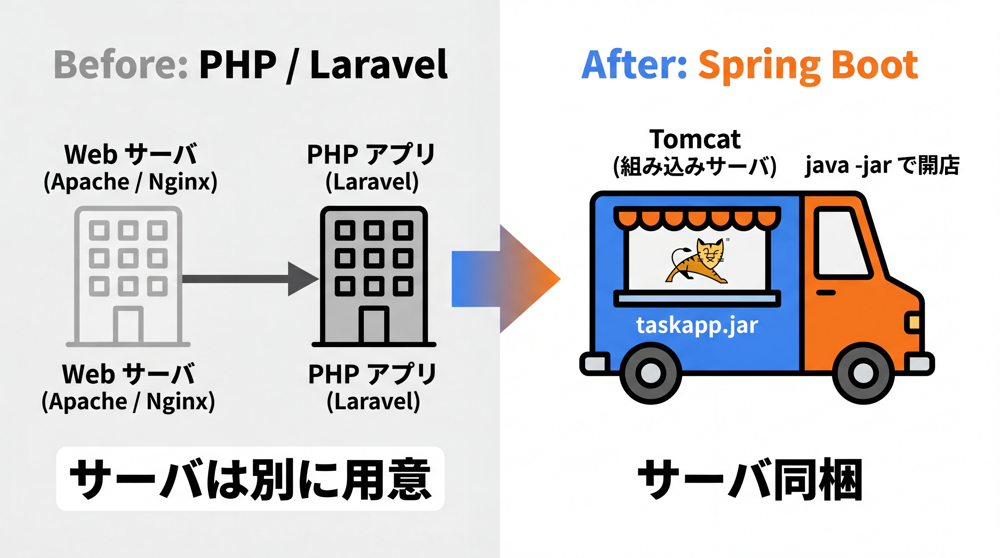
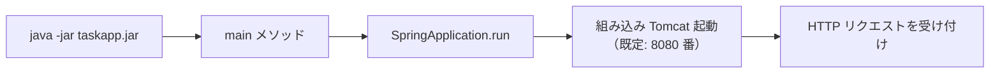
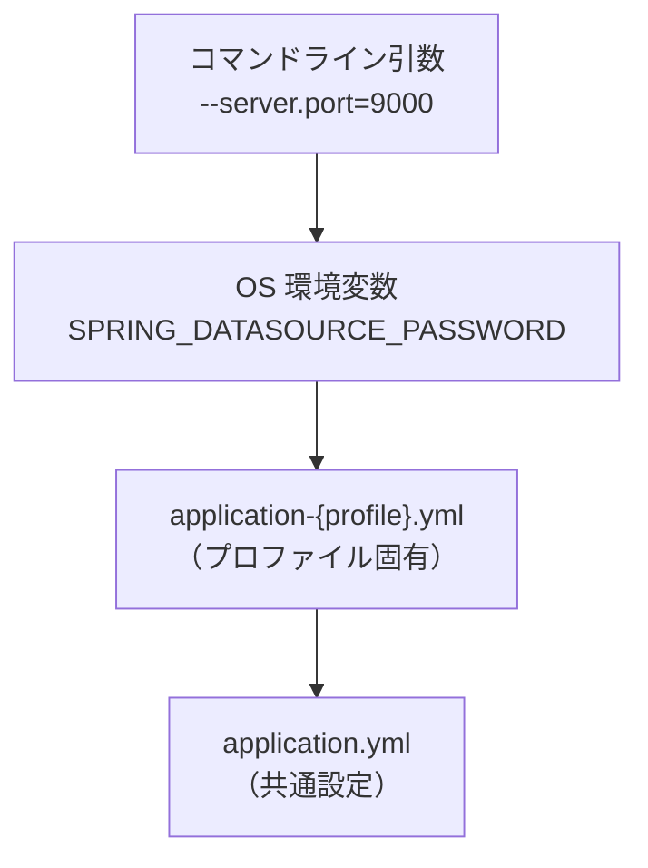

# 3-1-3 アプリケーションの起動と設定

📝 **前提知識**: このセクションは「3-1-2 Maven とプロジェクトの構成」の内容を前提としています。

## 🎯 このセクションで学ぶこと

- `@SpringBootApplication` がアプリの起点としてどう働くかを説明できる
- 組み込みサーバにより、別途サーバを立てずに `java -jar` で起動できる仕組みを理解する
- `application.yml` での設定の与え方・プロファイル・設定値の優先順位を理解する

本セクションでは、アプリの起点 `@SpringBootApplication` から始め、組み込みサーバ、`application.yml` での設定、プロファイルと設定値の優先順位へと進みます。

---

## 導入: アプリはどこから起動し、設定はどこに書くのか

Laravel では、アプリの起動も設定も、あなたが意識せずとも整っていました。リクエストは `public/index.php` から入り、フレームワークが順に処理を組み立てる。設定は `.env` に DB のホストやパスワードを書き、`config/*.php` で細かく調整する。本番と開発で値を切り替えるのも `.env` を差し替えるだけでした。Web サーバ（Apache や Nginx）は別途用意するのが前提で、PHP はそのサーバの上で動いていました。

Spring Boot では、この「起点」「設定」「サーバ」の 3 つが、Laravel とは違った形で用意されています。アプリはどのクラスから起動するのか。Web サーバは誰が立てるのか。DB 接続のような設定はどこに書き、環境ごとにどう切り替えるのか。本セクションでこの 3 点を押さえれば、3-1 で学んできた Spring Boot プロジェクトを「構成し、起動し、設定できる」状態が完成します。

### 🧠 先輩エンジニアの思考プロセス

> Laravel から来て一番意外だったのは、Spring Boot アプリが Web サーバを内蔵していたことです。PHP の頃は Apache や Nginx を別に立て、その上に PHP を乗せるのが当たり前でした。Spring Boot では Tomcat が jar の中に同梱されていて、`java -jar` を叩くだけでサーバごと立ち上がります。最初は「サーバはどこ？」と探してしまいました。
>
> 設定まわりは、むしろ Laravel に似ていて安心しました。`application.yml` は `.env` と `config/*.php` を足したような立ち位置で、プロファイルを使えば本番・開発の切り替えも素直にできます。さらに本番のパスワードは環境変数で上書きできるので、機密をファイルに直書きせずに済む。この優先順位の仕組みを理解してから、環境ごとの設定で悩むことがほぼなくなりました。



---

## @SpringBootApplication: アプリの起点

Spring Boot アプリの起点は、`@SpringBootApplication` というアノテーションが付いた 1 つのクラスです。本教材のタスク管理アプリでは `TaskappApplication` がそれにあたります。3-1-2 で見たとおり、このクラスは `src/main/java/com/example/taskapp/` に置かれます。

```java
// TaskappApplication.java
package com.example.taskapp;

import org.springframework.boot.SpringApplication;
import org.springframework.boot.autoconfigure.SpringBootApplication;

@SpringBootApplication
public class TaskappApplication {

    public static void main(String[] args) {
        SpringApplication.run(TaskappApplication.class, args);
    }
}
```

このクラスがやっていることは、見た目どおりシンプルです。Java プログラムの入り口である `main` メソッド（1-1-3 で学んだ「型紙」）の中で、`SpringApplication.run(...)` を呼ぶ。たったこれだけで、Spring Boot アプリ全体が起動します。`run` に渡しているのは、起点となるクラス（`TaskappApplication.class`）と、コマンドライン引数（`args`）です。

肝心なのは `@SpringBootApplication` です。これは 1 つで複数の役割を兼ねる「便利アノテーション」で、内部に次の 3 つのアノテーションを束ねています。

| 内包するアノテーション | 役割 |
|---|---|
| `@SpringBootConfiguration` | このクラスを設定の起点（`@Configuration` の一種）として扱う |
| `@EnableAutoConfiguration` | オートコンフィギュレーション（3-1-1）を有効にする |
| `@ComponentScan` | 部品（Bean）を自動で探して登録する（コンポーネントスキャン） |

3 つ目の `@ComponentScan`（コンポーネントスキャン）は、「このクラスが置かれたパッケージ（`com.example.taskapp`）とその下を自動で走査し、部品として登録すべきクラスを見つけて DI コンテナに登録する」働きをします。あなたが 3-3 や 3-4 で書く `TaskController` や `TaskService` が、特別な登録作業なしに動くのは、このコンポーネントスキャンが効いているからです。だからこそ、起点クラスはパッケージの最上位（`com.example.taskapp`）に置くのが定石です。これより上の階層は走査されないため、配置を誤ると「なぜか部品が見つからない」という事態になります。

ここでは「`@SpringBootApplication` がオートコンフィギュレーションとコンポーネントスキャンを有効にする起点だ」と押さえれば十分です。コンポーネントスキャンが Bean をどう集め、DI コンテナがそれをどう配るのかという核心は、次の Chapter（3-2-1）で正式に解き明かします。

💡 **Laravel との対応**: Laravel の起点が `public/index.php` で、そこからフレームワークがブートストラップされていったのと同じ役割を、`@SpringBootApplication` 付きの `main` メソッドが担います。Laravel が `app/Providers` のサービスプロバイダを自動で読み込んで初期化したのと、Spring Boot がコンポーネントスキャンで部品を自動収集するのは、発想が重なります。

---

## 組み込みサーバ: サーバを別途立てない

導入で触れたとおり、Spring Boot の大きな特徴の一つが **組み込みサーバ** （embedded server）です。`spring-boot-starter-web`（3-1-1）を取り込むと、Web サーバである **Tomcat** がアプリの依存として一緒に入り、jar の中に同梱されます。3-1-2 で `spring-boot-maven-plugin` が作る「実行可能 jar」に触れましたが、その jar にはアプリのコードだけでなく、この Tomcat まで含まれています。

結果として、起動はこれだけです。

```bash
# 3-1-2 でビルドした実行可能 jar を起動する
java -jar target/taskapp-0.0.1-SNAPSHOT.jar
```

このコマンド 1 つで、内蔵された Tomcat が立ち上がり、既定で 8080 番ポートでリクエストを待ち受けます。PHP のように Apache や Nginx を別途インストール・設定する必要はありません。アプリとサーバが一体になって動く、と捉えてください。



この「サーバ同梱で単独起動できる」性質は、後の Part で効いてきます。Docker でアプリを動かすとき（Part 4）、コンテナの中で別途 Web サーバを立てる必要がなく、jar を 1 つ起動すればよいだけになります。配布も運用もシンプルになる、というのが組み込みサーバの実務上のうまみです。

💡 **Laravel との対応**: Laravel ではローカル開発に `php artisan serve` で簡易サーバを立て、本番では Apache / Nginx + PHP-FPM を構成しました。Spring Boot は開発でも本番でも同じ組み込み Tomcat で動くため、「ローカルと本番でサーバ構成が違う」ことに悩みにくい、という違いがあります。

---

## application.yml: 設定の与え方

DB 接続情報のような設定は、`src/main/resources/`（3-1-2 で学んだリソースの置き場所）に置く設定ファイルに書きます。ファイル名は `application.yml`（または `application.properties`）と決まっており、Spring Boot が起動時に自動で読み込みます。これも「規約より設定」の一例で、決まった名前・場所に置くだけで認識されます。

```yaml
# application.yml
spring:
  datasource:
    url: jdbc:mysql://localhost:3306/taskapp
    username: taskuser
    password: secret
  jpa:
    hibernate:
      ddl-auto: update      # スキーマの扱い（詳細は 3-4 で）

server:
  port: 8080                # 組み込みサーバのポート
```

YAML 形式では、インデント（字下げ）で階層を表します。上の例は `spring.datasource.url` のような階層的なキーを、見やすく入れ子で書いたものです。`server.port` を変えればサーバのポートが変わり、`spring.datasource.*` で DB 接続先を指定します。3-1-1 で学んだオートコンフィギュレーションは、ここに書かれた値を読み取って DB 接続などを構成します。

設定ファイルには 2 つの書き方があります。YAML 形式（`application.yml`）と、キーと値を 1 行ずつ並べる properties 形式（`application.properties`）です。同じ設定を properties 形式で書くと次のようになります。

```properties
# application.properties
spring.datasource.url=jdbc:mysql://localhost:3306/taskapp
spring.datasource.username=taskuser
spring.datasource.password=secret
server.port=8080
```

どちらでも構いませんが、階層が深くなると YAML の方が見通しが良いため、本教材では `application.yml` を基本とします。

💡 **Laravel との対応**: `application.yml` は、Laravel の `.env`（環境ごとの値）と `config/*.php`（アプリの設定）を 1 つにまとめたような立ち位置です。`.env` に `DB_HOST` や `DB_PASSWORD` を書いていたのが、`application.yml` の `spring.datasource.*` に対応します。「設定をコードに直書きせず、外部のファイルに集約する」という考え方そのものは、Laravel と完全に共通しています。

---

## プロファイルと設定値の優先順位: 環境ごとに切り替える

開発環境と本番環境では、DB の接続先もログの詳しさも変えたいものです。Spring Boot はこれを **プロファイル** （profile）という仕組みで実現します。プロファイルは「環境ごとの設定の束」に名前を付けたもので、`application-{プロファイル名}.yml` という命名のファイルに、その環境だけの設定を書きます。

```yaml
# application-dev.yml （開発環境用）
spring:
  datasource:
    url: jdbc:mysql://localhost:3306/taskapp_dev
```

```yaml
# application-prod.yml （本番環境用）
spring:
  datasource:
    url: jdbc:mysql://db.example.com:3306/taskapp
```

どのプロファイルを使うかは `spring.profiles.active` で指定します。たとえば `dev` を有効にすると、まず共通の `application.yml` が読み込まれ、その上に `application-dev.yml` が **上書き** で重ねられます。共通設定をベースに、環境固有の値だけを差分として持たせる、という使い方です。

```yaml
# application.yml （共通設定 + どのプロファイルを使うか）
spring:
  profiles:
    active: dev      # dev プロファイルを有効化（application-dev.yml が重なる）
```

さらに重要なのが、**設定値の優先順位** （precedence）です。同じキーが複数の場所で指定されたとき、Spring Boot は決まった優先順位で「どの値を採用するか」を決めます。優先度が高い（後から勝つ）順に並べると、おおよそ次のようになります。



つまり、**コマンドライン引数や環境変数** は、設定ファイルの値を上書きします。これは実務でとても役立ちます。本番の DB パスワードのような機密情報を `application.yml` に直書きせず、起動時の環境変数（たとえば `SPRING_DATASOURCE_PASSWORD`）で与えられます。コードやファイルに機密を残さずに済む、という安全な運用が可能になります。

💡 厳密には、Java のシステムプロパティ（`-Dkey=value`）は OS の環境変数よりさらに上位です。本文の図は主要な関係を簡略化して示しています。

```bash
# 起動時にコマンドライン引数でポートを上書きする例
java -jar target/taskapp-0.0.1-SNAPSHOT.jar --server.port=9000
```

💡 **Laravel との対応**: Laravel でも `.env` を本番・開発で差し替え、機密は環境変数で与えるのが定石でした。Spring Boot のプロファイルは「`.env` を環境ごとに用意する」感覚に近く、設定値の優先順位（環境変数 > ファイル）は、Laravel で本番のサーバ環境変数が `.env` より優先されたのと同じ発想です。「環境ごとに切り替え、機密は外から注入する」という運用が、そのまま通用します。

> 💡 **環境変数とキー名の対応**: `application.yml` の `spring.datasource.password` は、環境変数では `SPRING_DATASOURCE_PASSWORD`（大文字・`.` を `_` に置換）として与えられます。Spring Boot がキー名の表記ゆれを吸収する（リラックスバインディングと呼びます）ためで、ファイルのキーと環境変数を自然に対応づけられます。

---

## ✨ まとめ

- `@SpringBootApplication` を付けたクラス（`TaskappApplication`）の `main` で `SpringApplication.run(...)` を呼ぶのがアプリの起点。このアノテーションはオートコンフィギュレーションと **コンポーネントスキャン** を有効にする（核心は 3-2-1）
- **組み込みサーバ** （Tomcat）が実行可能 jar に同梱されるため、`java -jar` だけで起動できる。Apache / Nginx を別途立てる必要がない。Docker 運用（Part 4）でも効いてくる
- 設定は `src/main/resources/application.yml`（または `application.properties`）に書き、Spring Boot が自動で読み込む。Laravel の `.env` / `config/*.php` に対応する
- **プロファイル** （`application-{profile}.yml` と `spring.profiles.active`）で環境ごとに設定を切り替える。**設定値の優先順位** はコマンドライン引数・環境変数がファイルを上書きするため、機密は環境変数で外から注入できる

【Chapter 3-1 の振り返り】本章では、Spring Boot が何を自動化しているかを俯瞰し、プロジェクトを構成・起動・設定できるようになりました。3-1-1 で Spring エコシステムとその中心にある DI コンテナ、Spring Boot のスターターとオートコンフィギュレーション・「規約より設定」を俯瞰し、3-1-2 で設計図である `pom.xml`（座標・依存管理・親 POM）と標準プロジェクト構造・ビルドライフサイクルを読み解き、3-1-3 で `@SpringBootApplication`・組み込みサーバ・`application.yml`・プロファイルによる起動と設定を学びました。Spring Boot が「設定地獄」をどう肩代わりしているのか、その全体像がつかめたはずです。

---

次の Chapter では、いよいよ Part 3 の核心である DI コンテナに踏み込みます。最初のセクション 3-2-1 では、IoC（制御の反転）と DI（依存性注入）という考え方、部品である Bean、それらを管理する `ApplicationContext`、本章で名前だけ触れたコンポーネントスキャンと `@Component` 系のアノテーション、そしてコンストラクタインジェクションを学びます。Laravel のサービスコンテナやファサードが見せていた「魔法」を明示的な仕組みとして解き明かし、Spring Boot のコードが「なぜ動くのか」を自分の言葉で説明できるようになります。
