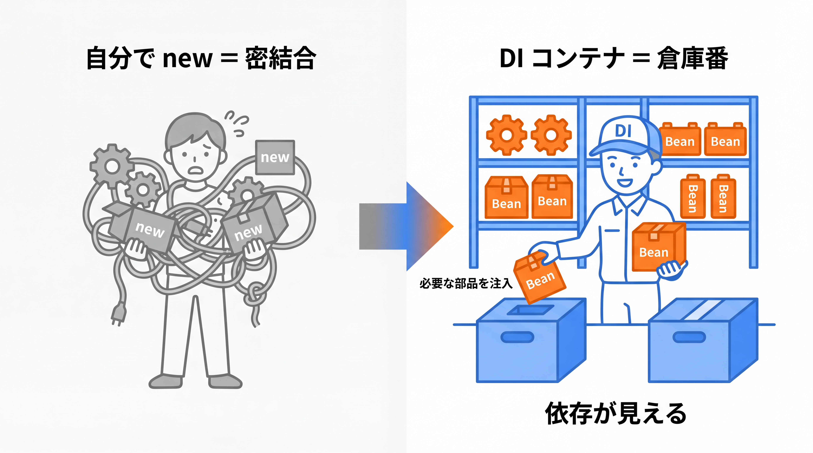
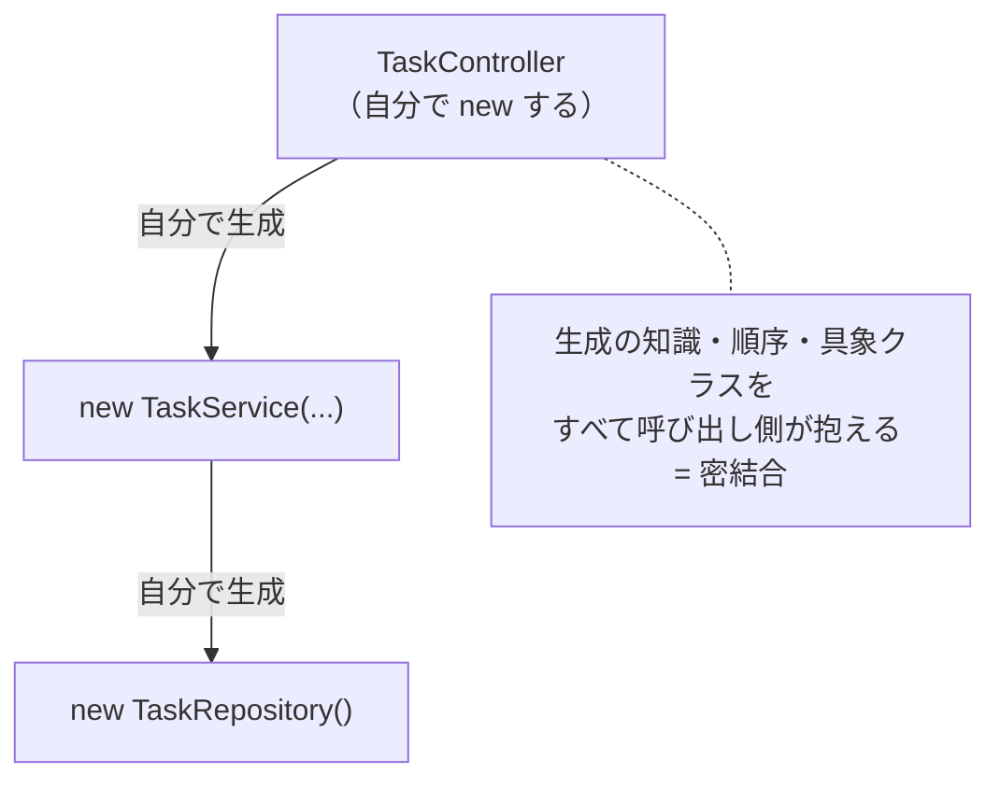
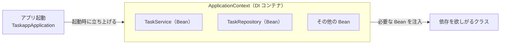
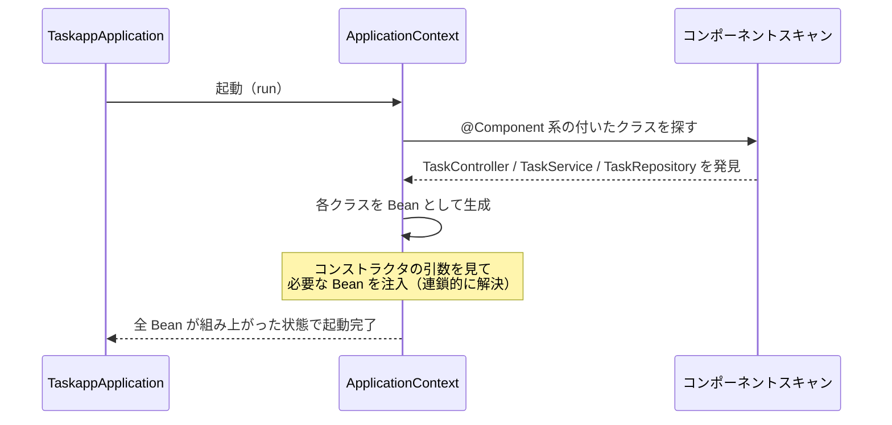

# 3-2-1 IoC と DI コンテナ

Chapter 3-2 では、本教材の核心である DI コンテナの仕組みを「魔法を解く」形で理解し、層に責務を分けた設計へとつなげます。Laravel のサービスコンテナやファサードが裏で勝手にやってくれていたことを、Spring では誰が・いつ・どうやって行うのかを明示的に説明できるようにします。

| セクション | テーマ | 種類 |
|---|---|---|
| 3-2-1 IoC と DI コンテナ | IoC・DI・Bean・ApplicationContext・コンポーネントスキャン・@Component 系・コンストラクタインジェクション | 概念 |
| 3-2-2 レイヤードアーキテクチャ | Controller / Service / Repository の責務分離・@Service / @Repository・依存の方向 | 概念 |

📖 **この Chapter の進め方**: まず本セクションで、Spring の中心にある DI コンテナの仕組みを解き明かします。「なぜ `new` を書かなくてもインスタンスが手元に来るのか」を、IoC・DI・Bean・コンポーネントスキャンという用語で説明できるようにします。次に 3-2-2 で、その注入の仕組みを使って Controller / Service / Repository の 3 層に責務を分け、依存の方向を整えた設計へと発展させます。

📝 **前提知識**: このセクションは「2-3-2 ポリモーフィズム」の内容を前提としています。

## 🎯 このセクションで学ぶこと

- 自分で `new` し続けると何に困るか（密結合）を理解し、IoC（制御の反転）と DI（依存性注入）が何を解決するのかを説明できる
- Bean・`ApplicationContext`・コンポーネントスキャン・`@Component` 系アノテーションが、どう連携してインスタンスを用意するのかを説明できる
- コンストラクタインジェクションで依存をインターフェース型で受け取る書き方を理解し、Laravel のサービスコンテナの「魔法」を Spring の明示的な仕組みとして読み解ける

本セクションでは、直接 `new` する問題から始め、IoC と DI の考え方、Bean とコンテナ、コンポーネントスキャンによる自動登録、そしてコンストラクタインジェクションへと進みます。

---

## 導入: あの「魔法」は何だったのか

Laravel では、コントローラのメソッドに型ヒントを書くだけで、必要なクラスのインスタンスが引数に「勝手に」入ってきました。`public function store(TaskService $service)` と書けば、`$service` には実体が入った状態で渡される。明示的にどこかで `new TaskService(...)` を書いた記憶はないのに、です。`app(TaskService::class)` や `resolve(...)` でも同じものを取り出せました。サービスコンテナという仕組みがインスタンスを管理し、必要な場所へ届けてくれていたわけです。

Java で同じ構成を、まず素朴に書いてみると、この「魔法」のありがたみが逆方向から見えてきます。Spring を知らずに `TaskController` を書くと、コントローラの中で `new TaskService(...)` を呼び、その `TaskService` が必要とする部品もまた自分で `new` して渡さなければなりません。依存がネストするほど、組み立ての記述は雪だるま式に膨らみます。本セクションは、Laravel が隠していた「サービスコンテナの魔法」を、Spring の **DI コンテナ** という明示的な仕組みとして一枚ずつ解いていきます。

### 🧠 先輩エンジニアの思考プロセス

> Laravel 時代の私は、サービスコンテナを「便利な箱」くらいにしか捉えていませんでした。型ヒントを書けば実体が来る、`app()` で取り出せる、それで日々の開発は回っていたからです。中で何が起きているのかを説明できないまま使っていて、テストで実装を差し替える段になって初めて「これは一体どういう仕組みなんだ」と詰まりました。
>
> Java に移って Spring の DI コンテナを学んだとき、あの箱の中身がようやく腑に落ちました。Spring は隠さず、コンストラクタという形で依存を表に出させます。最初は `new` を書けないことに戸惑いましたが、依存が引数として明示される分、クラスが何に頼っているのかが一目で読めるようになりました。私の現場では、この「依存が見える」状態がテストの書きやすさに直結していて、結果的に書く手間以上のものが返ってきています。



---

## 自分で `new` し続けると何に困るのか（密結合）

まず、Spring を使わずに素朴に書いた状態を見ます。タスクを扱うアプリで、Web のリクエストを受ける `TaskController` が、ビジネスロジックを担う `TaskService` を使い、その `TaskService` がデータ取得のための `TaskRepository` を使う、という縦の依存を考えます（`TaskRepository` の中身は 3-4-2 で扱います。ここでは「データ取得を担う部品」とだけ捉えてください）。

各クラスが、自分の使う部品を自分で `new` するとこうなります。

```java
// TaskController.java
public class TaskController {
    private final TaskService taskService;

    public TaskController() {
        // 自分が使う TaskService を、自分で組み立てている
        // しかも TaskService が必要とする TaskRepository まで、ここで new する羽目になる
        this.taskService = new TaskService(new TaskRepository());
    }
}
```

一見動きそうですが、この書き方には実務で効いてくる問題が潜んでいます。

第一に、**組み立ての知識が呼び出し側に漏れている** ことです。`TaskController` は本来「リクエストを受けて応答を返す」のが仕事のはずなのに、`TaskService` が内部で `TaskRepository` を必要とすることまで知っていて、その生成順序まで負っています。`TaskService` のコンストラクタ引数が 1 つ増えただけで、それを使う `TaskController` 側の `new` も直さなければなりません。

第二に、**実装を差し替えられない** ことです。2-3-2 で見たように、`TaskService` が部品をインターフェース型で受け取っていても、`new TaskService(new TaskRepository())` と具象クラスを直接渡してしまえば、差し替えの余地が消えます。テストのときに偽物の `TaskRepository` を入れたくても、`TaskController` のコンストラクタが本物の `new TaskRepository()` を握っているため、外から差し込めません。

第三に、**同じ部品があちこちで重複して作られる** ことです。`TaskRepository` を必要とするクラスが 5 つあれば、5 か所で `new TaskRepository()` が書かれます。DB 接続を握るような部品を、リクエストごと・利用箇所ごとに作り直すのは無駄が大きく、設定を一元管理することもできません。



このように、クラスどうしが具体的な生成方法でがっちり結びついた状態を **密結合** と呼びます。2-3-2 で「呼ぶ側がインターフェースだけに依存していれば、中身は後から差し替えられる」と学びましたが、`new` で具象クラスを直接抱えると、その利点が台無しになります。生成の責任をクラス自身から引き剥がす仕組みが要る、というのがここでの問題意識です。

💡 **Laravel との対応**: Laravel でコントローラに `new TaskService(...)` を書くことは、まずなかったはずです。型ヒントに書けばサービスコンテナが解決してくれたからです。つまり Laravel はこの「密結合」の問題を、サービスコンテナが裏で肩代わりして回避していました。Spring の DI コンテナも、解決する問題は同じです。違いは、Spring がその仕組みを隠さず明示する点にあります。

---

## IoC（制御の反転）と DI（依存性注入）

密結合の根っこは、「クラスが、自分の使う部品の生成と取得を自分で制御している」ことにあります。`TaskController` が `new TaskService(...)` を呼ぶのは、まさにこれです。

この制御を反転させる、というのが **IoC（Inversion of Control、制御の反転）** の考え方です。部品をいつ・どう生成し、どこから持ってくるかという制御を、クラス自身ではなく **外側の仕組み（コンテナ）** に委ねます。クラスは「私にはこの部品が必要だ」と宣言するだけで、実際の生成・取得には関与しません。生成を支配する側が、クラスからコンテナへと反転するわけです。

そして、その「外側の仕組み」が部品を実際にクラスへ渡す具体的なやり方が **DI（Dependency Injection、依存性注入）** です。Spring 公式ドキュメントは DI を IoC の一形態と位置づけ、次のように説明しています。

> Dependency injection (DI) is a specialized form of IoC, whereby objects define their dependencies ... only through constructor arguments, arguments to a factory method, or properties that are set on the object instance after it is constructed ... The IoC container then injects those dependencies when it creates the bean.
>
> （出典: Spring Framework Reference「Introduction to the Spring IoC Container and Beans」2026年6月時点）

要点はこうです。オブジェクトは自分が必要とする依存を **コンストラクタの引数** などの形で宣言する。そしてコンテナが、そのオブジェクトを生成するときに依存を **注入（inject）** する。クラス自身が依存を探しに行く（直接 `new` する、サービスロケータで引いてくる）のとは逆方向です。

2-3-2 で書いた `TaskService` を思い出してください。あのコードは、まさにこの形をすでに体現していました。

```java
// TaskService.java（2-3-2 で扱った形）
public class TaskService {
    private final NotificationSender sender;   // 依存をインターフェース型で宣言

    public TaskService(NotificationSender sender) {   // 依存をコンストラクタ引数で受け取る
        this.sender = sender;
    }
    // ...
}
```

`TaskService` は `sender` を自分で `new` していません。「私には `NotificationSender` が必要だ」とコンストラクタで宣言し、実体は外から受け取っています。2-3-2 では実体を `new TaskService(new EmailNotificationSender())` のように手で渡していました。この「外から渡す」役割を肩代わりするのが DI コンテナです。

🔑 IoC は「生成・取得の制御をクラスからコンテナへ反転する」という **考え方**、DI は「依存をコンストラクタ等で受け取る形にして、コンテナが注入する」という **その具体的な実現手段** です。Spring が DI コンテナと呼ばれるのは、この DI を中心に据えてアプリケーションを組み立てるからです。

💡 **Laravel との対応**: Laravel のサービスコンテナがやっていたのも、まさに IoC / DI です。コントローラの型ヒントを見て実体を解決し、引数に注入していました。Laravel ではこれを「自動解決（autowiring）」と呼び、ほとんど意識せず使えたぶん仕組みが見えにくかったはずです。Spring も自動で解決しますが、依存をコンストラクタという形で表に出させるため、「何が・どこへ注入されるか」がコードから読み取れます。

---

## Bean とは何か、それを束ねる `ApplicationContext`

コンテナが依存を注入できるのは、注入すべきインスタンスをコンテナ自身が生成し、保持しているからです。このコンテナが管理するインスタンスを Spring では **Bean** と呼びます。

Spring 公式ドキュメントの定義は次のとおりです。

> In Spring, the objects that form the backbone of your application and that are managed by the Spring IoC container are called beans. A bean is an object that is instantiated, assembled, and managed by a Spring IoC container.
>
> （出典: Spring Framework Reference「Introduction to the Spring IoC Container and Beans」2026年6月時点）

つまり Bean とは、あなたが `new` するのではなく、**コンテナが生成・組み立て・管理する** インスタンスのことです。先ほどの例で言えば、`TaskService` も `TaskRepository` も、コンテナに任せれば Bean になります。あなたのアプリの骨格を成す部品を、コンテナが一手に引き受けて管理する、というのが Spring の中心的なアイデアです。

📝 **Bean の定義**: 単なる Java オブジェクトのうち、**Spring IoC コンテナによって生成・組み立て・管理されるもの** が Bean です。あなたが一時的に `new` するただのオブジェクト（たとえばループ内で作る `StringBuilder`）は Bean ではありません。コンテナの管理下にあるかどうかが境目です。

その Bean を保持し、必要なときに取り出せるようにしている入れ物が **`ApplicationContext`** です。Spring アプリケーションが起動すると、この `ApplicationContext`（DI コンテナの実体）が立ち上がり、管理対象の Bean をすべて生成して内部に保持します。依存の注入も、Bean の取り出しも、この `ApplicationContext` を通じて行われます。

`ApplicationContext` は、より基本的な `BeanFactory` というインターフェースを拡張し、その機能をすべて含んだ上位のインターフェースです。Bean を管理する基本機能に加えて、メッセージリソースの解決（国際化）、イベント発行、Web アプリ向けの文脈（`WebApplicationContext`）といった応用機能を備えています。実務でコンテナと言うときは、ほぼこの `ApplicationContext` を指すと考えて差し支えありません。



💡 **Laravel との対応**: `ApplicationContext` は、Laravel のサービスコンテナ（`Illuminate\Container\Container`、`app()` で参照していたもの）に対応します。Laravel が起動時にコンテナを立ち上げ、バインドされたものを解決して配っていたのと、役割はそのままです。Laravel では「コンテナにバインドする」ことを `bind` / `singleton` でやりましたが、Spring ではこの後に見る **アノテーション** がその登録を担います。

---

## コンポーネントスキャンと `@Component` 系アノテーション

ここで一つ疑問が湧きます。コンテナは、どのクラスを Bean として管理すべきだと判断するのでしょうか。Laravel ではサービスプロバイダで `bind` / `singleton` を書いて登録しました。Spring の主流は、もっと宣言的です。クラスに **目印（アノテーション）** を付けておき、コンテナが起動時にその目印を探し回って自動で登録します。この探索が **コンポーネントスキャン（component scanning）** です。

目印の基本形が `@Component` です。クラスに `@Component` を付けると、「これはコンテナが管理すべき部品（コンポーネント）だ」という宣言になります。コンポーネントスキャンはこの目印の付いたクラスを検出し、対応する Bean をコンテナに登録します。公式ドキュメントは「Spring can automatically detect stereotyped classes and register corresponding `BeanDefinition` instances with the `ApplicationContext`」と述べており、目印付きクラスを自動検出して `ApplicationContext` に登録する、という流れがそのまま書かれています。

そして `@Component` には、役割を明示するための **特化版** が用意されています。公式ドキュメントの説明は次のとおりです。

> @Component is a generic stereotype for any Spring-managed component. @Repository, @Service, and @Controller are specializations of @Component for more specific use cases (in the persistence, service, and presentation layers, respectively).
>
> （出典: Spring Framework Reference「Classpath Scanning, Managed Components, and Writing Configurations with Java」2026年6月時点）

これらは「ステレオタイプアノテーション」と呼ばれ、`@Repository`・`@Service`・`@Controller` はいずれも内部で `@Component` を含んでいます（メタアノテーションと呼ばれる仕組みです）。したがって、Bean として登録される効果はどれも同じです。違うのは **役割の表明** です。

| アノテーション | 役割（どの層の部品か） | 本教材での使い所 |
|---|---|---|
| `@Component` | 汎用。特定の層に属さない部品 | 上記に当てはまらない補助的な部品 |
| `@Service` | ビジネスロジックを担う部品 | `TaskService` |
| `@Repository` | 永続化（データアクセス）を担う部品 | `TaskRepository` |
| `@Controller` | プレゼンテーション層（Web 入出力）を担う部品 | `TaskController`（REST では `@RestController`） |

`TaskService` には `@Service` を付けます。これで `TaskService` はコンポーネントスキャンに検出され、Bean としてコンテナに登録されます。

```java
// TaskService.java
import org.springframework.stereotype.Service;

@Service
public class TaskService {
    // ...（依存はこの後コンストラクタで受け取る）
}
```

では、スキャンは誰が・どこから始めるのでしょうか。ここで 3-1-3 で触れた `@SpringBootApplication` が効いてきます。アプリの起動クラスに付くこのアノテーションは、内部に `@ComponentScan` を含んでおり、**起動クラスが置かれたパッケージ（およびその配下のサブパッケージ）** を起点にスキャンを行います。

```java
// TaskappApplication.java
package com.example.taskapp;

import org.springframework.boot.SpringApplication;
import org.springframework.boot.autoconfigure.SpringBootApplication;

@SpringBootApplication   // この中に @ComponentScan が含まれる
public class TaskappApplication {
    public static void main(String[] args) {
        SpringApplication.run(TaskappApplication.class, args);
    }
}
```

起動クラスを `com.example.taskapp` に置けば、`com.example.taskapp.service`・`com.example.taskapp.controller`・`com.example.taskapp.repository` など配下のパッケージ（3 章で採用するパッケージ構成）がすべてスキャン対象になります。`@Service` や `@Controller` を付けたクラスは、これだけで自動的に Bean になるわけです。

⚠️ **注意**: コンポーネントスキャンは「起動クラスのパッケージ配下」しか見ません。`@Service` を付けたのに Bean として認識されない場合、そのクラスが起動クラスのパッケージの **外** （たとえば `com.other` の下）に置かれていないかをまず疑ってください。本教材のパッケージ構成（すべて `com.example.taskapp` 配下）を守っていれば、この落とし穴は避けられます。

💡 **Laravel との対応**: Laravel ではサービスプロバイダの `register()` の中で `$this->app->singleton(...)` のように、登録するクラスを 1 つずつ手で書きました。Spring のコンポーネントスキャンは、その登録作業を「目印を付けておけば自動で拾う」方式に置き換えたものです。登録を集中管理する代わりに、各クラスが自分の役割（`@Service` など）を自己申告する、と捉えると感覚がつかめます。

---

## コンストラクタインジェクション（推奨）とインターフェース型での受け取り

Bean がコンテナに登録されたら、あとはそれを必要とするクラスへ注入する番です。Spring には依存を注入する方法がいくつかありますが、**コンストラクタインジェクション** （コンストラクタの引数で受け取る方式）が推奨されます。公式ドキュメントは次のように述べています。

> The Spring team generally advocates constructor injection, as it lets you implement application components as immutable objects and ensures that required dependencies are not null. Furthermore, constructor-injected components are always returned to the client (calling) code in a fully initialized state.
>
> （出典: Spring Framework Reference「Dependency Injection」2026年6月時点）

コンストラクタで受け取ると、(1) フィールドを `final` にして **不変（immutable）** にできる、(2) 必須の依存が **null にならない** （注入されないとインスタンスが作れない）、(3) 生成された時点で **完全に初期化された状態** になる、という利点があります。

`TaskController` を、密結合だった最初の例から書き直してみます。自分で `new` する代わりに、必要な `TaskService` をコンストラクタで受け取ります。

```java
// TaskController.java
import org.springframework.web.bind.annotation.RestController;

@RestController
public class TaskController {
    private final TaskService taskService;   // final で不変

    // 必要な依存をコンストラクタ引数で宣言するだけ。new はしない
    public TaskController(TaskService taskService) {
        this.taskService = taskService;
    }
    // ...（リクエストを処理するメソッドは 3-3-1 で）
}
```

最初の例にあった `new TaskService(new TaskRepository())` が消えた点に注目してください。`TaskController` はもう、`TaskService` の組み立て方を知りません。「私には `TaskService` が要る」と引数で宣言するだけです。コンテナは起動時に、`TaskController` を生成しようとして「コンストラクタが `TaskService` を要求している」と気づき、登録済みの `TaskService` Bean を探して注入します。その `TaskService` がさらに `TaskRepository` を要求していれば、コンテナはそれも連鎖的に解決します。組み立ての連鎖を、丸ごとコンテナが引き受けるわけです。

ここで 2-3-2 のポリモーフィズムが効きます。依存は **具象クラスではなくインターフェース型で受け取る** のが、Spring の典型です。`TaskRepository` を例にすると、`TaskService` はインターフェースとしての `TaskRepository` を受け取り、その実体（実装）はコンテナが注入します（`TaskRepository` を `JpaRepository` を継承したインターフェースとして定義し、実装を Spring が用意する流れは 3-4-2 で扱います。ここでは「`TaskService` はインターフェースに依存し、実体はコンテナが差し込む」という形だけ押さえてください）。

```java
// TaskService.java
import org.springframework.stereotype.Service;

@Service
public class TaskService {
    private final TaskRepository taskRepository;   // インターフェース型で受け取る

    public TaskService(TaskRepository taskRepository) {
        this.taskRepository = taskRepository;
    }
    // findAll() / findById(Long id) / create(...) などのビジネスロジックは 3-2-2・3-3 で
}
```

🔑 `TaskService` は `TaskRepository` という **型（契約）** にしか依存しておらず、その実体が何であるかを知りません。これはまさに 2-3-2 で `TaskService` が `NotificationSender` 型で実装を受け取り、メールにも Slack にも差し替えられた、あのポリモーフィズムです。本番ではコンテナが本物の実装を注入し、テストでは偽物の実装を注入できます。「インターフェースで受けて、実装は外から注入する」という 2-3-2 の設計を、Spring のコンテナが自動でやってくれている、というのが Spring が interface 中心に書かれる理由です。

`@Autowired` というアノテーションを見たことがあるかもしれません。これは「ここに注入してほしい」と明示する目印ですが、公式ドキュメントによれば、**コンストラクタが 1 つだけのクラスでは省略できます** （「An `@Autowired` annotation on such a constructor is not necessary if the target bean defines only one constructor」）。上の `TaskController` も `TaskService` もコンストラクタが 1 つなので、`@Autowired` を書かなくてもコンテナはそのコンストラクタを使って注入します。本教材では、`final` フィールド + 単一コンストラクタの形を基本とし、`@Autowired` は省略します。

⚠️ **注意**: フィールドに直接 `@Autowired` を付ける「フィールドインジェクション」を世の中の記事でよく見かけますが、本教材では使いません。フィールドインジェクションは `final` にできず、依存が外から見えにくく、テスト時に差し替えづらいという難点があります。コンストラクタインジェクションを既定としてください。

💡 **Laravel との対応**: Laravel でコントローラのメソッドやコンストラクタに型ヒントを書くと、サービスコンテナが型を見て実体を注入してくれました。Spring のコンストラクタインジェクションは、これとほぼ同じ体験です。型ヒント（Java では引数の型）を手がかりにコンテナが解決する、という骨格は共通しています。違いは、Laravel が「実装を差し替えたいときはサービスプロバイダで `bind` する」必要があったのに対し、Spring では `@Service` などで登録された Bean のうち型に合うものが自動的に選ばれる点です。

ここまでをつなぐと、起動から注入までの流れはこうなります。



Laravel が `app()` の裏で黙ってやっていた「登録された実体を、型を頼りに解決して注入する」という一連の処理が、Spring ではこのように明示的な仕組みとして説明できます。これが「魔法を解く」ということです。

---

## ✨ まとめ

- 自分で `new` し続けると、生成の知識が呼び出し側に漏れ（密結合）、実装を差し替えられず、同じ部品が重複して作られる。生成の責任をクラスから引き剥がす仕組みが要る
- IoC（制御の反転）は「生成・取得の制御をクラスからコンテナへ反転する」考え方、DI（依存性注入）は「依存をコンストラクタ等で宣言し、コンテナが注入する」その実現手段
- コンテナが生成・組み立て・管理するインスタンスが Bean、それを束ねる入れ物が `ApplicationContext`。`@Component` 系（`@Service` / `@Repository` / `@Controller`）を付けたクラスを `@SpringBootApplication` 由来のコンポーネントスキャンが検出し、Bean として登録する
- 推奨はコンストラクタインジェクション（不変・null 安全・完全初期化）。依存はインターフェース型で受け取り、実体はコンテナが注入する。ここで 2-3-2 のポリモーフィズムが効き、Laravel のサービスコンテナの「魔法」が明示的な仕組みとして読み解ける

---

次のセクションでは、この DI の仕組みを土台に、Controller / Service / Repository の責務分離を学びます。それぞれが何を担うか（入出力・ビジネスロジック・永続化）、`@Service` / `@Repository` がステレオタイプとしてどう役割を表すか、そして依存の方向（Controller から Service、Service から Repository へと上から下に向かい、下位は上位を知らない）を整理し、層をまたぐ設計をコンストラクタ DI でつなぐところまで進みます。
