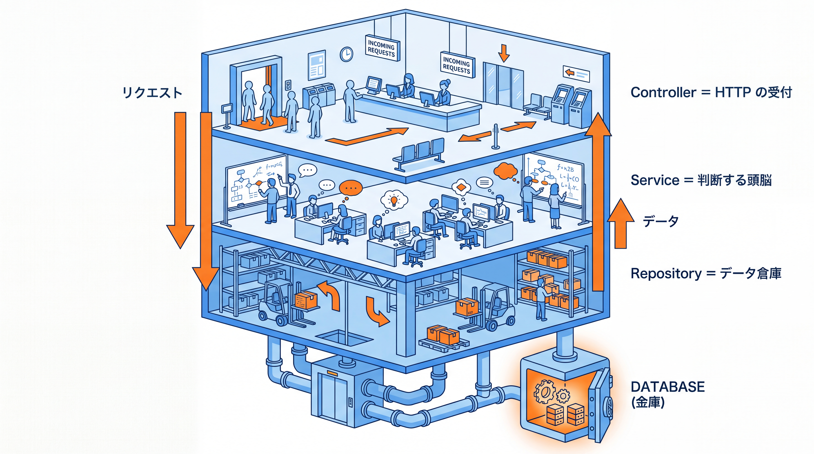
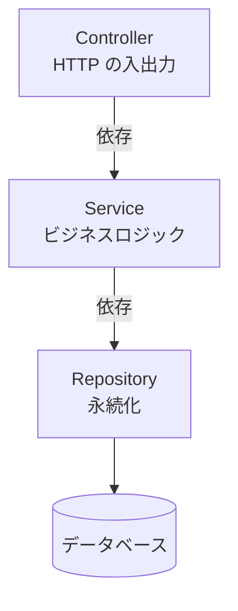
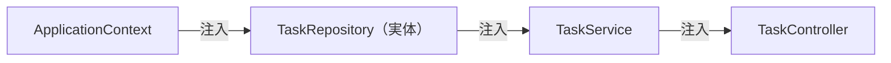
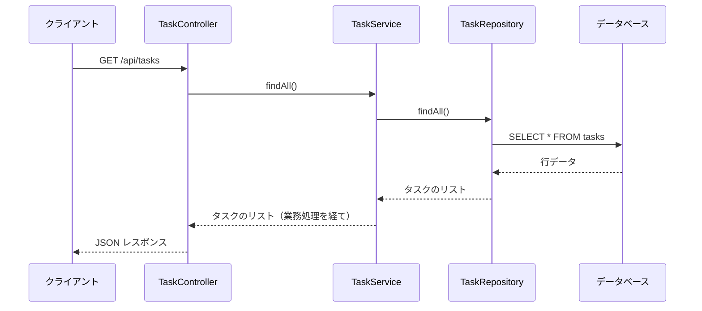

# 3-2-2 レイヤードアーキテクチャ

📝 **前提知識**: このセクションは「3-2-1 IoC と DI コンテナ」の内容を前提としています。

## 🎯 このセクションで学ぶこと

- Controller / Service / Repository の 3 層がそれぞれ何を担うか（入出力・ビジネスロジック・永続化）を説明できる
- 依存の方向（上から下へ・下位は上位を知らない）と、`@Service` / `@Repository` がステレオタイプとして役割を表す意味を理解する
- 3 層をコンストラクタインジェクションでつなぎ、リクエストが層をまたいで往復する流れを説明できる

本セクションでは、ロジックの置き場所という課題から始め、3 層それぞれの責務、依存の方向、ステレオタイプアノテーション、そして層を貫く流れへと進みます。

---

## 導入: そのロジック、どこに書きますか

Laravel を使い始めたころ、私はコントローラに何でも書いていました。リクエストを受け取り、バリデーションし、DB を引き、業務上の判断をし、レスポンスを組み立てる。最初のうちは見通しがよくても、機能が増えるにつれてコントローラのメソッドは数十行、ときに百行を超えていきました。同じ業務ロジック（たとえば「期限切れのタスクだけ抽出する」）が複数のコントローラに散らばり、直すときにどこを直せばいいのか分からなくなる。いわゆる「太ったコントローラ（Fat Controller）」です。

この痛みへの答えが、責務を **層（レイヤー）** に分けることです。Laravel でも、ロジックが膨らんだときに Service クラスを切り出した経験があるかもしれません。Spring では、その層分けが「推奨される作法」を超えて、フレームワークの標準的な前提になっています。本セクションでは、Web の入出力を担う Controller、ビジネスロジックを担う Service、永続化を担う Repository という 3 層に責務を分け、それを 3-2-1 で学んだコンストラクタ DI でつなぐ設計を学びます。

### 🧠 先輩エンジニアの思考プロセス

> Laravel 時代、私のコントローラは肥大化の常連でした。最初は「とりあえずここに書けば動く」でコントローラに直書きし、後から同じ処理を別の画面でも使いたくなって、コピーして貼り付ける。やがて同じバグを 3 か所で直す羽目になり、ようやく Service クラスへ切り出し始めました。層を分ける意味を、頭ではなく痛みで理解した感じです。
>
> Java の現場に来て驚いたのは、Controller / Service / Repository の 3 層が「議論の余地のない初期構成」として最初から用意されていたことです。新しい機能を足すとき、入出力なら Controller、業務判断なら Service、DB アクセスなら Repository と、書く場所が自然に決まる。どこに書くか迷う時間が減り、レビューで「これは Service に出して」と指摘し合えるのも、層の名前が共通言語になっているからだと感じています。



---

## 3 層の責務: 誰が何を担うのか

レイヤードアーキテクチャは、アプリケーションを役割ごとの層に縦に積み重ねる設計です。本教材の REST API では、次の 3 層を使います。

| 層 | 担うこと | 担わないこと |
|---|---|---|
| Controller（コントローラ） | HTTP の入出力。リクエストを受け取り、適切な形で応答を返す | 業務上の判断・DB アクセス |
| Service（サービス） | ビジネスロジック。業務上のルール・判断・複数操作の調整 | HTTP の詳細・SQL の詳細 |
| Repository（リポジトリ） | 永続化。DB へのデータの読み書き | 業務上の判断・HTTP |

それぞれを具体的に見ます。

Controller は **HTTP の世界とアプリの境界** です。「どの URL の、どの HTTP メソッドのリクエストか」を受け取り、必要な値を取り出して Service に渡し、Service が返した結果を HTTP レスポンス（JSON やステータスコード）に変換します。Controller の関心は「HTTP としてどう受けて、どう返すか」に限られ、業務上の判断や DB の操作には踏み込みません（受け取り方・返し方の具体は 3-3 で扱います）。

**Service はアプリの頭脳** です。「タスクを完了できるのはどんなときか」「削除前に何を確認するか」といった業務上のルールをここに集約します。複数の Repository をまたいで処理を調整するのも Service の仕事です。Service は HTTP のことも SQL の詳細も知りません。だからこそ、同じビジネスロジックを REST API からも、後で学ぶ画面描画（3-5）からも、再利用できます。

**Repository はデータの出入り口** です。DB からエンティティを読み出し、変更を書き戻すことに専念します。「どんな SQL が発行されるか」はこの層の関心で、業務判断は持ちません（Spring Data JPA を使った具体的な実装は 3-4 で扱います。ここでは「データアクセスを担う層」という位置づけだけ押さえてください）。

この分け方の効用は、**変更の影響を 1 つの層に閉じ込められる** ことです。応答の形式を変えたいなら Controller だけ、業務ルールを変えたいなら Service だけ、DB アクセスの方法を変えたいなら Repository だけを触ればよい。導入で挙げた「太ったコントローラ」は、3 つの関心が 1 か所に混ざっていたから直しにくかったわけです。

💡 **Laravel との対応**: Laravel の標準は Controller と Model（Eloquent）の 2 層構成でした。Model がデータアクセスと一部のロジックを兼ね、残りのロジックは Controller に書く。規模が大きくなったとき、あなたは Controller と Model の間に Service クラスを挟んで「太ったコントローラ」を解消した経験があるかもしれません。Spring の 3 層は、その Service を最初から正式な層として据えたものです。Laravel の Eloquent Model が担っていた「データアクセス」は Repository（と次章のエンティティ）へ、ロジックは Service へと、役割がよりはっきり分かれます。

---

## 依存の方向: 上から下へ、下位は上位を知らない

3 層は、ただ役割が違うだけでなく、**依存の向きが決まっている** ことが肝心です。Controller は Service に依存し、Service は Repository に依存します。矢印は常に上から下へ、一方向に流れます。



重要なのは、**この矢印が逆流しない** ことです。Service は Controller を知りませんし、Repository は Service を知りません。下位の層は、自分を呼び出す上位の層の存在を一切意識しないのです。

なぜそうするのか。下位が上位を知らなければ、**下位の層を上位から切り離して扱える** からです。Repository は「誰に呼ばれるか」を気にしないので、テストでも単独で動かせますし、別の Service から再利用しても問題ありません。Service が HTTP（Controller の世界）を知らないからこそ、同じ Service を REST API と画面描画の両方から呼べます。もし Service が Controller に依存していたら、画面描画のために Service を使おうとするたびに HTTP の文脈が絡みついてきて、再利用できなくなります。

🔑 「上位は下位に依存してよいが、下位は上位を知らない」。この一方向の依存が、層をまたぐ設計の背骨です。3-2-1 で学んだ密結合の回避（生成を自分で抱えない）に加えて、**依存の向きをそろえる** ことで、各層を独立して変更・テスト・再利用できる構造になります。

---

## `@Service` と `@Repository`: 役割を表すステレオタイプ

3-2-1 で、`@Component` の特化版として `@Service`・`@Repository`・`@Controller` があることを見ました。これらは **ステレオタイプアノテーション** （役割を表す目印）で、どれも Bean として登録される効果は `@Component` と同じです。違うのは、クラスがどの層に属するのかを宣言する点でした。

レイヤードアーキテクチャの文脈で見ると、この使い分けの意味がはっきりします。アノテーションを見ただけで、そのクラスがどの層の部品なのかが分かるのです。

| 層 | アノテーション | 意味 |
|---|---|---|
| Controller | `@Controller` / `@RestController` | プレゼンテーション層（Web 入出力）の部品 |
| Service | `@Service` | サービス層（ビジネスロジック）の部品 |
| Repository | `@Repository` | 永続化層（データアクセス）の部品 |

機能としては `@Component` 一つで済むのに、わざわざ層ごとに使い分けるのは、**コードに役割を語らせる** ためです。`@Service` の付いたクラスを見れば「ここに業務ロジックがある」と分かり、`@Repository` を見れば「ここが DB との境界だ」と分かります。チームで「このロジックは Service に出そう」と会話できるのも、この共通の語彙があるからです。

💡 `@Repository` には、機能面の付加価値もあります。データアクセスで発生するベンダー固有の例外を、Spring の統一的な例外（`DataAccessException` の体系）へ変換してくれます。詳細は 3-4 で扱いますが、「`@Repository` は単なる目印以上の意味も持つ」ことだけ頭の隅に置いてください。なお `@RestController` は `@Controller` の特化版で、「戻り値を常に JSON として返す `@Controller`」と捉えられます（3-3-1・3-5-1 で扱います）。

---

## 3 層を DI でつなぐ: 最小の骨組み

ここまでの責務分離と依存の方向を、3-2-1 で学んだコンストラクタインジェクションで実際につなぎます。タスク一覧を取得する経路を、3 層の骨組みとして最小限のコードで示します。各層が自分の責務に集中し、下位の層をコンストラクタで受け取る形に注目してください。

まず Controller です。HTTP リクエストを受け、Service を呼び、結果を返すことに徹します。

```java
// TaskController.java
import org.springframework.web.bind.annotation.GetMapping;
import org.springframework.web.bind.annotation.RequestMapping;
import org.springframework.web.bind.annotation.RestController;

import java.util.List;

@RestController
@RequestMapping("/api/tasks")
public class TaskController {
    private final TaskService taskService;   // 下位の Service に依存

    public TaskController(TaskService taskService) {   // コンストラクタで注入
        this.taskService = taskService;
    }

    @GetMapping
    public List<Task> list() {
        return taskService.findAll();   // 業務処理は Service に委ねる
    }
    // リクエストの受け取り方・レスポンスの組み立て（DTO・ステータスコード等）は 3-3 で
}
```

`list()` は `taskService.findAll()` を呼ぶだけで、DB アクセスも業務判断もしていません。HTTP の入口として、受けて・委ねて・返すことに専念しています。

次に Service です。ビジネスロジックを担い、Repository を呼びます。

```java
// TaskService.java
import org.springframework.stereotype.Service;

import java.util.List;

@Service
public class TaskService {
    private final TaskRepository taskRepository;   // 下位の Repository に依存

    public TaskService(TaskRepository taskRepository) {   // コンストラクタで注入
        this.taskRepository = taskRepository;
    }

    public List<Task> findAll() {
        return taskRepository.findAll();   // 永続化は Repository に委ねる
        // 「完了済みを除く」「期限順に並べる」といった業務ルールがあればここに書く
    }
    // findById(Long id) / create(...) / update(...) / delete(Long id) も同様に Repository を使う
}
```

`TaskService` は HTTP を知りません。`TaskController` から呼ばれていることも意識せず、ただ「タスク一覧を返す」という業務を遂行します。だからこそ、後の章で画面描画（3-5）から同じ `TaskService` を呼べます。

最後に Repository です。データアクセスに専念します。

```java
// TaskRepository.java
import org.springframework.data.jpa.repository.JpaRepository;

public interface TaskRepository extends JpaRepository<Task, Long> {
    // findAll() などの基本的なデータ操作は JpaRepository から継承される（中身は 3-4-2 で）
}
```

`TaskRepository` は **インターフェース** であり、その実体（実装）は Spring Data JPA がコンテナに用意します（仕組みは 3-4-2 で解説します。ここでは「インターフェースを定義するだけで、実装はフレームワークが Bean として提供する」とだけ捉えてください）。3-2-1 で学んだ「インターフェース型で受け取り、実体はコンテナが注入する」が、ここでもそのまま当てはまります。`TaskService` は `TaskRepository` という契約に依存し、実体が何かは知りません。

これらをコンテナが起動時に組み上げます。`TaskController` を作るには `TaskService` が要り、`TaskService` を作るには `TaskRepository` が要る。コンテナはこの連鎖をたどり、下から順に Bean を生成して注入していきます。あなたが `new` を書く箇所は、どこにもありません。



💡 **Laravel との対応**: Laravel でコントローラに `TaskService` を型ヒントし、その `TaskService` のコンストラクタにリポジトリ相当を型ヒントすれば、サービスコンテナが連鎖的に解決して注入してくれました。Spring の 3 層も構造はそのままで、各クラスが下位をコンストラクタで受け取り、コンテナが連鎖を解決します。Laravel で Service を切り出したときの「コントローラは薄く、ロジックは Service へ」という感覚が、Spring ではフレームワークの標準としてそのまま通用します。

---

## 層をまたぐ流れ: リクエストの一往復

3 層がつながった状態で、1 つの HTTP リクエスト（タスク一覧取得）が層をどう通り、どう戻ってくるのかを追います。これがレイヤードアーキテクチャの動きの全体像です。



リクエストは上の層から下の層へと降りていき（Controller → Service → Repository → DB）、データは下から上へと戻ってきます。各層は、自分の隣の層としかやり取りしません。Controller は Repository を直接呼ばず、必ず Service を通します。Service は DB を直接触らず、必ず Repository を通します。この「隣としか話さない」規律が、層の独立性を保ちます。

⚠️ **注意**: 手早く済ませたくて Controller から Repository を直接呼びたくなる場面があります（一覧をただ返すだけなら Service は素通りに見えるため）。しかし層を飛ばすと、後から業務ルールを足したくなったときに置き場所がなくなり、ロジックが Controller に逆流して「太ったコントローラ」へ逆戻りします。たとえ素通りでも Service を挟んでおくと、ロジックの置き場所が常に確保されます。

🔑 レイヤードアーキテクチャの本質は、「役割で層を分け（責務分離）」「依存を上から下へ一方向にそろえ（依存の方向）」「隣の層としかやり取りしない」という 3 つの規律です。この上に Spring の DI コンテナが乗ることで、各層を独立して変更・テスト・再利用できる構造が、特別な努力なしに保たれます。

---

## ✨ まとめ

- Controller は HTTP の入出力、Service はビジネスロジック、Repository は永続化を担う。関心を層に分けることで、変更の影響を 1 つの層に閉じ込められる（太ったコントローラの解消）
- 依存は上から下へ一方向（Controller → Service → Repository）に流れ、下位は上位を知らない。これにより各層を独立して変更・テスト・再利用できる
- `@Service` / `@Repository` は `@Component` の特化版（ステレオタイプ）で、Bean 登録の効果は同じだが、クラスがどの層の部品かを表明し、コードに役割を語らせる
- 3 層は各クラスが下位をコンストラクタで受け取り、コンテナが連鎖的に Bean を解決して組み上げる。リクエストは層を上から下へ降り、データが下から上へ戻る一往復で処理される

【Chapter 3-2 の振り返り】本章では、本教材の核心である DI コンテナを「魔法を解く」形で押さえました。3-2-1 で、自分で `new` する密結合の問題から出発し、IoC（制御の反転）と DI（依存性注入）、Bean と `ApplicationContext`、コンポーネントスキャンと `@Component` 系、コンストラクタインジェクションまでを通して「なぜ動くのか」を説明できるようにしました。3-2-2 では、その注入の仕組みを土台に、Controller / Service / Repository の 3 層へ責務を分け、依存の方向をそろえる設計へと発展させました。Laravel のサービスコンテナの「魔法」が、Spring では明示的な仕組みとして読み解ける、という一貫した視点が Part 3 の残りを支えます。

---

次の Chapter 3-3 では、いよいよ Web 層に踏み込み、REST API を実装します。最初のセクション 3-3-1 では、`@RestController` と `@GetMapping` などの HTTP メソッドに対応するアノテーション、`@PathVariable` / `@RequestParam` / `@RequestBody` によるリクエスト値の受け取り、`ResponseEntity` とステータスコードの扱いを学び、エンドポイントを設計できるようにします。本章で薄く保った Controller に、リクエストを受けて返す具体的な肉付けをしていきます。
