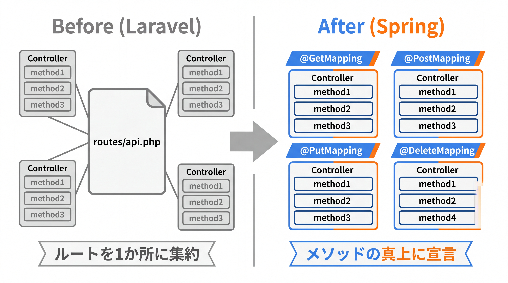
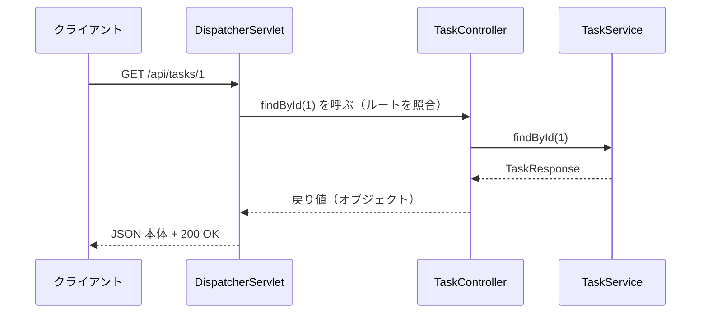

# 3-3-1 リクエストを受けて返す

Chapter 3-3 では、3-2 で整えた層構造の上に Web 層を載せ、HTTP リクエストを受け取って JSON を返すところから、入力検証・エラー設計まで、REST API を一通り組めるようにします。読者がすでに持っている REST の原則を、Spring のアノテーションでどう表現するかが本章の主題です。

| セクション | テーマ | 種類 |
|---|---|---|
| 3-3-1 リクエストを受けて返す | `@RestController`・HTTP メソッドのマッピング・パラメータの受け取り・`ResponseEntity`・ステータスコード | 概念 |
| 3-3-2 DTO と JSON | DTO・Jackson によるシリアライズ・`record` DTO・リクエスト / レスポンスの分離・エンティティ ↔ DTO 変換 | 概念 |
| 3-3-3 バリデーションと例外ハンドリング | Bean Validation・`@Valid`・`@RestControllerAdvice` による統一エラーレスポンス | 概念 |

📖 **この Chapter の進め方**: まず本セクションで、リクエストをどのメソッドが受け、何を返すかという Web 層の骨格を組みます。次に 3-3-2 で、その入出力を `record` の DTO として整え、Jackson による JSON 変換を押さえます。最後に 3-3-3 で、入力検証とエラーレスポンスの設計を加え、Web 層を実務で使える形に仕上げます。

📝 **前提知識**: このセクションは「3-2-2 レイヤードアーキテクチャ」の内容を前提としています。

## 🎯 このセクションで学ぶこと

- `@RestController` と `@GetMapping` などで、HTTP メソッド・パスをハンドラメソッドに対応づけられる
- `@PathVariable`・`@RequestParam`・`@RequestBody` でリクエストの各部分を引数として受け取れる
- 戻り値の自動 JSON 化・`ResponseEntity`・`@ResponseStatus` で、ステータスコードを含むレスポンスを設計できる

本セクションでは、ルーティングがどこに行ったのかという疑問から始め、コントローラの宣言、メソッドとパスのマッピング、パラメータの受け取り、レスポンスとステータスコード、そして `/api/tasks` の CRUD 設計へと進みます。

---

## 導入: ルーティングファイルが、どこにもない

Laravel では、URL とコントローラの対応は `routes/web.php` や `routes/api.php` に集約されていました。「この API のエンドポイント一覧を見たい」と思ったら、まずルーティングファイルを開く。それが習慣だったはずです。

ところが Spring Boot のプロジェクトを開いても、それに相当するルーティングファイルが見つかりません。`routes/` ディレクトリも、ルートを並べた設定ファイルもありません。では、どの URL がどの処理に届くのかは、いったいどこで決まっているのでしょうか。

答えは「**コントローラのメソッドに直接書く**」です。Spring では、ルートの宣言とそれを処理するコードが同じ場所にあります。メソッドの真上にアノテーションで「このメソッドは `GET /api/tasks/{id}` を担当する」と宣言する、という発想です。本セクションでは、この「ルーティングファイルのない世界」での書き方を、既習の REST 原則を足がかりに押さえます。

### 🧠 先輩エンジニアの思考プロセス

> Laravel 時代の私は、ルーティングファイルとコントローラを行き来しながら開発していました。`api.php` でルートを定義し、対応するコントローラを開き、また `api.php` に戻ってミドルウェアを足す。ルート定義と処理が別ファイルにあるのは、一覧性が高い反面、片方を直してもう片方を直し忘れる事故もそれなりにありました。
>
> Spring に移ってまず戸惑ったのが、そのルーティングファイルが無いことでした。最初は「全体像が見えない」と不安でしたが、慣れると逆でした。メソッドの真上に `@GetMapping("/{id}")` と書いてあるので、処理を読みながらそのルートも同時に分かります。エンドポイント一覧が欲しければ IDE が一覧表示してくれるので、結局困りませんでした。



---

## @RestController: 「JSON を返すコントローラ」を宣言する

Spring で REST API のコントローラを作るには、クラスに `@RestController` を付けます。これは 3-2 で学んだ DI（依存性注入）コンテナに「このクラスは Web リクエストを処理する Bean だ」と知らせる目印であり、同時に「このクラスのメソッドの戻り値は、すべて HTTP レスポンスの本体（多くは JSON）として書き出す」という指示でもあります。

```java
// TaskController.java
package com.example.taskapp.controller;

import com.example.taskapp.service.TaskService;
import org.springframework.web.bind.annotation.RequestMapping;
import org.springframework.web.bind.annotation.RestController;

@RestController
@RequestMapping("/api/tasks")
public class TaskController {

    private final TaskService taskService;

    public TaskController(TaskService taskService) {   // コンストラクタインジェクション（3-2-1）
        this.taskService = taskService;
    }
}
```

クラスに付けた `@RequestMapping("/api/tasks")` は、このコントローラが扱うパスの共通の接頭辞です。以降このクラスの各メソッドは、`/api/tasks` を起点にしたパスを担当します。

コンストラクタで `TaskService`（3-2-2 で導入したビジネスロジックの層）を受け取っている点に注目してください。コントローラは「リクエストを受け取り、サービスに処理を任せ、結果を返す」係です。データの取得や更新そのものはサービスより奥（最終的には 3-4 で学ぶデータアクセス層）が担い、コントローラは Web の入り口に徹します。

💡 **Laravel との対応**: `@RestController` は、Laravel の API 用コントローラ（`return response()->json(...)` を返すコントローラ）に近い立場です。Laravel ではコントローラのメソッドで明示的に JSON を返していましたが、`@RestController` では戻り値が自動で JSON 化されるため、毎回 `json(...)` で包む必要がありません。

---

## HTTP メソッドをメソッドにマッピングする

REST では、同じリソースに対する操作を HTTP メソッド（GET / POST / PUT / DELETE）で区別します。この対応づけは、あなたが Laravel で `Route::get` / `Route::post` と書き分けていたことと同じ発想です。Spring では、それをハンドラメソッドの上のアノテーションで宣言します。

```java
// TaskController.java（メソッドのマッピング。本体は後の節で埋めます）
import org.springframework.web.bind.annotation.*;

@RestController
@RequestMapping("/api/tasks")
public class TaskController {

    @GetMapping                 // GET /api/tasks
    public ... findAll() { ... }

    @GetMapping("/{id}")        // GET /api/tasks/{id}
    public ... findById(...) { ... }

    @PostMapping                // POST /api/tasks
    public ... create(...) { ... }

    @PutMapping("/{id}")        // PUT /api/tasks/{id}
    public ... update(...) { ... }

    @DeleteMapping("/{id}")     // DELETE /api/tasks/{id}
    public ... delete(...) { ... }
}
```

`@GetMapping`・`@PostMapping`・`@PutMapping`・`@DeleteMapping` は、それぞれ HTTP メソッドに対応します。これらはすべて `@RequestMapping` の短縮形で、たとえば `@GetMapping("/{id}")` は `@RequestMapping(value = "/{id}", method = RequestMethod.GET)` と同じ意味です。日常的には短縮形のほうを使います。

アノテーションのカッコに書いたパス（`"/{id}"`）は、クラスの `@RequestMapping("/api/tasks")` に続けて連結されます。つまり `@GetMapping("/{id}")` は最終的に `GET /api/tasks/{id}` を担当します。カッコを省いた `@GetMapping` は接頭辞そのもの（`/api/tasks`）に対応します。

メソッド名（`findAll`・`findById` など）は Spring にとっては自由で、ルーティングには影響しません。読みやすい名前を付ければ十分です。ルートを決めるのはあくまでアノテーションです。

💡 **Laravel との対応**: `Route::get('/tasks/{id}', [TaskController::class, 'show'])` のように「メソッド・パス・ハンドラ」を 1 行で結びつけていたものが、Spring では「ハンドラ（メソッド）の真上にメソッドとパスを宣言する」形に変わります。結びつける 3 要素は同じで、書く場所が違うだけです。

---

## パスとパラメータを受け取る

リクエストから値を取り出す方法は、その値が HTTP のどこに乗っているかで変わります。Spring では引数にアノテーションを付けて「この引数はここから取る」と指定します。代表的なのは次の 3 つです。

```java
// TaskController.java
@GetMapping("/{id}")
public ... findById(@PathVariable Long id) {           // パスの {id} を受け取る
    return taskService.findById(id);
}

@GetMapping
public ... findAll(@RequestParam(required = false) Boolean done) {  // ?done=true を受け取る
    // done が null なら全件、指定があれば絞り込む、といった分岐ができる
    return taskService.findAll();
}

@PostMapping
public ... create(@RequestBody TaskCreateRequest request) {   // リクエストボディ（JSON）を受け取る
    return taskService.create(request);
}
```

- `@PathVariable`: URL のパスに埋め込まれた値を受け取ります。`@GetMapping("/{id}")` の `{id}` が、引数 `Long id` に入ります。Laravel の `show($id)` でルートパラメータを受け取っていたのと同じ役割です。プレースホルダ名と引数名が同じなら、対応は自動で決まります。
- `@RequestParam`: クエリ文字列（`?done=true&page=2`）の値を受け取ります。Laravel の `$request->query('done')` に相当します。`required = false` を付けると省略可能になり、省略時は `null` になります。
- `@RequestBody`: リクエストボディ（POST / PUT で送られる JSON）を、指定した型のオブジェクトに変換して受け取ります。Laravel の `$request->all()` や FormRequest でボディを受け取っていたことに相当します。ここで使う `TaskCreateRequest` のような入力用の型（DTO）は次の 3-3-2 で本格的に設計します。

💡 引数名による自動対応が効くのは、ビルドがコンパイル時に `-parameters` を付けているためです（Spring Boot の Maven / Gradle プラグインは既定で付与します）。名前が曖昧、または古いビルド設定では `@PathVariable("id")` のように名前を明示すると確実です。

🔑 値が「パスのどこにあるか」でアノテーションを使い分けるのがポイントです。URL の一部なら `@PathVariable`、`?` 以降のクエリなら `@RequestParam`、ボディの JSON なら `@RequestBody` です。

⚠️ **注意**: `@RequestParam` は既定で必須です。クライアントが省略しうるパラメータには `required = false`（または `defaultValue` の指定）を付けないと、省略されたときにエラーになります。「フィルタ条件は任意」のようなクエリでは特に忘れがちです。

---

## レスポンスとステータスコードを設計する

REST API では、何を返すかと同じくらい、どのステータスコードで返すかが重要です。読者はすでに「作成は 201、見つからなければ 404、本体なしの成功は 204」といった原則を知っています。Spring でそれをどう表現するかを見ていきます。

### 戻り値は自動で JSON になる

`@RestController` のメソッドがオブジェクトを返すと、Spring がそれを JSON に変換してレスポンス本体に書き出します。この変換を担うのが `HttpMessageConverter` という仕組み（既定では JSON 変換に Jackson を使う。詳細は 3-3-2）で、ステータスコードは特に指定しなければ `200 OK` になります。

```java
// TaskController.java
@GetMapping
public List<TaskResponse> findAll() {
    return taskService.findAll();   // List がそのまま JSON 配列になり、200 OK で返る
}
```

ここで返している `TaskResponse` は、API のレスポンス用の型（DTO）です。これも 3-3-2 で正式に設計します。本セクションでは「メソッドが返したオブジェクトが JSON になり、既定で 200 で返る」という流れをつかめれば十分です。

### ステータスコードを変えたいとき

200 以外のステータスを返したい場面では、主に 2 つの方法があります。

一つは `@ResponseStatus` です。メソッドに付けると、そのメソッドが正常終了したときのステータスコードを固定できます。作成系で 201 を返す典型に向きます。

```java
// TaskController.java
import org.springframework.http.HttpStatus;
import org.springframework.web.bind.annotation.ResponseStatus;

@PostMapping
@ResponseStatus(HttpStatus.CREATED)   // 正常終了時に 201 を返す
public TaskResponse create(@RequestBody TaskCreateRequest request) {
    return taskService.create(request);
}

@DeleteMapping("/{id}")
@ResponseStatus(HttpStatus.NO_CONTENT)   // 204（本体なし）
public void delete(@PathVariable Long id) {
    taskService.delete(id);
}
```

もう一つは `ResponseEntity` です。これは「ステータスコード・ヘッダ・本体」をまとめて表す戻り値の型で、状況に応じてステータスを動的に変えたいときに使います。公式ドキュメントは `ResponseEntity` を「`@ResponseBody` と同じだがステータスとヘッダを持つもの」と説明しています。

```java
// TaskController.java
import org.springframework.http.ResponseEntity;

@GetMapping("/{id}")
public ResponseEntity<TaskResponse> findById(@PathVariable Long id) {
    TaskResponse task = taskService.findById(id);
    return ResponseEntity.ok(task);                 // 200 OK + 本体

    // 例: 作成では 201 + Location ヘッダを付けられる
    // return ResponseEntity.status(HttpStatus.CREATED).body(created);
    // 例: 本体なしの成功は 204
    // return ResponseEntity.noContent().build();
}
```

※ 上記コードのコメント部分は、同じ場面で使える別パターン（ステータスを明示する書き方）を並べて示したものです。`findById` 自体は最初の `return` で完結します。

`@ResponseStatus` は「このメソッドは常にこのステータス」という固定的な指定、`ResponseEntity` は「実行時にステータスやヘッダを組み立てる」柔軟な指定、と使い分けます。本教材では、作成 / 削除のように結果が決まっているものは `@ResponseStatus`、ヘッダ制御や条件分岐が要るものは `ResponseEntity`、という方針で進めます。

なお「見つからなければ 404」を、いま見せた範囲で実現しようとすると、見つからなかったときのために `if` で分岐して `ResponseEntity.notFound()` を返す、という書き方になります。ただし全メソッドにそれを書くのは煩雑です。Spring では `TaskNotFoundException`（1-3-2 で定義した独自の非検査例外）のような例外を投げ、それを一箇所でまとめて 404 に変換する設計が定石です。この「例外を投げ、一箇所でステータスに変換する」仕組みは 3-3-3 で扱います。

💡 **Laravel との対応**: Laravel では `response()->json($data, 201)` や `abort(404)` でステータスを指定し、`findOrFail()` が見つからないときに自動で 404 を返してくれました。Spring の `@ResponseStatus` / `ResponseEntity` はステータス指定の手段に、3-3-3 の例外ハンドリングは `findOrFail()` の「投げれば 404」に、それぞれ対応します。

---

## エンドポイント設計: REST の原則を Spring で表す

ここまでの道具を使って、タスク管理 API の CRUD を設計します。リソースは「タスク（`/api/tasks`）」で、操作を HTTP メソッドで区別する、という REST の原則は Laravel 時代とまったく同じです。違うのは「ルーティングファイルではなくアノテーションで宣言する」点だけです。

| 操作 | HTTP メソッド | パス | Spring の宣言 | 主なステータス |
|---|---|---|---|---|
| 一覧取得 | GET | `/api/tasks` | `@GetMapping` | 200 |
| 1 件取得 | GET | `/api/tasks/{id}` | `@GetMapping("/{id}")` | 200 / 404 |
| 作成 | POST | `/api/tasks` | `@PostMapping` | 201 |
| 更新 | PUT | `/api/tasks/{id}` | `@PutMapping("/{id}")` | 200 / 404 |
| 削除 | DELETE | `/api/tasks/{id}` | `@DeleteMapping("/{id}")` | 204 / 404 |

これをコントローラにまとめると、次の形になります（戻り値の型 `TaskResponse` と入力の型 `TaskCreateRequest` / `TaskUpdateRequest` は 3-3-2 で設計します。ここでは「リクエストが届き、サービスに渡り、結果が返る」という縦の流れに注目してください）。

```java
// TaskController.java
package com.example.taskapp.controller;

import com.example.taskapp.dto.TaskCreateRequest;
import com.example.taskapp.dto.TaskResponse;
import com.example.taskapp.dto.TaskUpdateRequest;
import com.example.taskapp.service.TaskService;
import org.springframework.http.HttpStatus;
import org.springframework.web.bind.annotation.*;

import java.util.List;

@RestController
@RequestMapping("/api/tasks")
public class TaskController {

    private final TaskService taskService;

    public TaskController(TaskService taskService) {
        this.taskService = taskService;
    }

    @GetMapping
    public List<TaskResponse> findAll() {
        return taskService.findAll();
    }

    @GetMapping("/{id}")
    public TaskResponse findById(@PathVariable Long id) {
        return taskService.findById(id);   // 見つからなければ TaskNotFoundException（404 化は 3-3-3）
    }

    @PostMapping
    @ResponseStatus(HttpStatus.CREATED)
    public TaskResponse create(@RequestBody TaskCreateRequest request) {
        return taskService.create(request);
    }

    @PutMapping("/{id}")
    public TaskResponse update(@PathVariable Long id, @RequestBody TaskUpdateRequest request) {
        return taskService.update(id, request);
    }

    @DeleteMapping("/{id}")
    @ResponseStatus(HttpStatus.NO_CONTENT)
    public void delete(@PathVariable Long id) {
        taskService.delete(id);
    }
}
```

1 件のリクエストがこのコントローラを通っていく流れは、次のように整理できます。



クライアントからのリクエストは、まず Spring MVC の入口である `DispatcherServlet` が受け取り、アノテーションの宣言をもとに「どのコントローラのどのメソッドが担当か」を照合して呼び出します。コントローラはサービスに処理を委ね、戻り値を返すだけ。その戻り値を `DispatcherServlet` が JSON に変換し、ステータスコードを添えてクライアントへ返します。`DispatcherServlet` は Spring が用意するため、あなたが書くのはコントローラのメソッドだけです。

🔑 コントローラの責務は「受け取って、サービスに渡して、結果を返す」ことに尽きます。ルートの宣言・パラメータの取り出し・JSON 変換・ステータス付与という Web の作法を、Spring がアノテーションを手がかりに肩代わりしてくれる、という構図を押さえてください。

---

## ✨ まとめ

- Spring にはルーティングファイルがなく、ルートはコントローラのメソッドにアノテーションで直接宣言する。`@RestController` はクラスを「JSON を返すコントローラ」にする
- `@GetMapping` / `@PostMapping` / `@PutMapping` / `@DeleteMapping` で HTTP メソッドとパスをメソッドに対応づける。クラスの `@RequestMapping` の接頭辞に連結される
- リクエストの値は、ありかに応じて `@PathVariable`（パス）・`@RequestParam`（クエリ）・`@RequestBody`（ボディの JSON）で受け取る
- 戻り値は自動で JSON 化され既定で 200。`@ResponseStatus` で固定（201 / 204 など）、`ResponseEntity` で動的にステータス・ヘッダを組み立てる

---

次のセクションでは、ここで戻り値や `@RequestBody` の型として登場した DTO を本格的に設計します。API の入出力を運ぶ器としての DTO とは何か、なぜエンティティを直接返さないのか、`record` を使った DTO の定義、Jackson によるシリアライズ（JSON との相互変換）、そしてリクエスト用 DTO とレスポンス用 DTO の分離とエンティティ ↔ DTO の変換まで、API の入出力設計を一通り押さえます。
