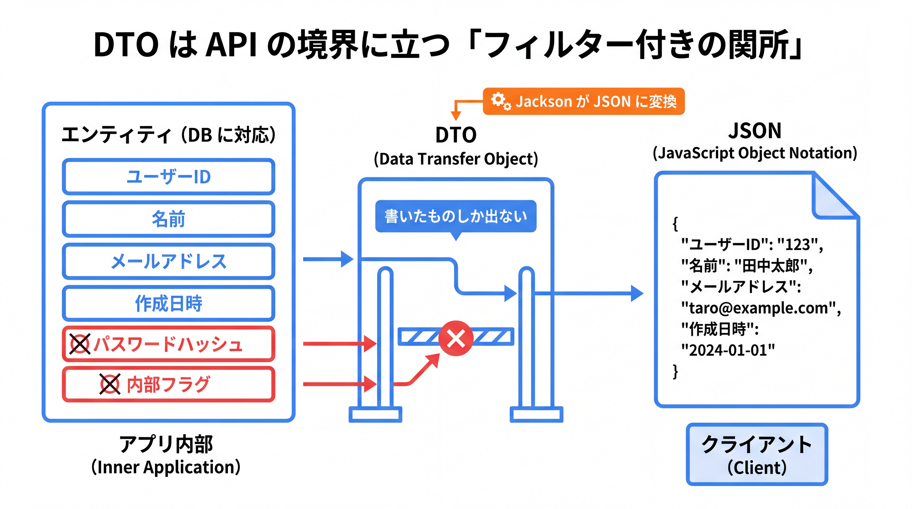
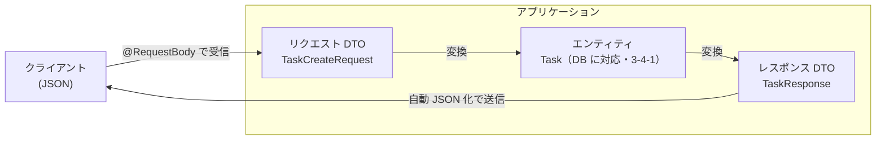

# 3-3-2 DTO と JSON

📝 **前提知識**: このセクションは「3-3-1 リクエストを受けて返す」「2-4-1 record と enum」の内容を前提としています。

## 🎯 このセクションで学ぶこと

- DTO（データ転送オブジェクト）が API の境界で果たす役割と、エンティティを直接返さない理由を説明できる
- `record` で DTO を定義し、Jackson によって JSON と相互変換される仕組みを理解する
- リクエスト用 DTO とレスポンス用 DTO を分け、エンティティ ↔ DTO の変換を手で書ける

本セクションでは、DTO とは何かから始め、エンティティを直接返さない理由、Jackson による JSON のシリアライズ、そしてリクエスト / レスポンス DTO の分離とエンティティ ↔ DTO 変換へと進みます。

---

## 導入: モデルをそのまま JSON にして返していた頃の話

3-3-1 では、コントローラの戻り値や `@RequestBody` の型として `TaskResponse` や `TaskCreateRequest` を「DTO」と呼んで登場させましたが、中身には踏み込みませんでした。本セクションでその正体を明らかにします。

Laravel 時代を思い出してください。API を作り始めたばかりの頃、`return Task::all();` のように Eloquent モデルをそのまま返していなかったでしょうか。これは動きはしますが、テーブルのカラムがそっくり JSON に出てしまいます。`created_at` も `updated_at` も、場合によっては隠したい内部用のカラムまで、すべてレスポンスに漏れます。だからこそ Laravel には API リソース（`JsonResource`）があり、「DB のモデルとは別に、レスポンスの形を定義する」という考え方が用意されていました。

Spring でも事情は同じです。DB に対応するクラス（エンティティ）を API でそのまま返すと、同じ問題が起きます。そこで API の境界には、入出力専用の器である **DTO** （Data Transfer Object、データ転送オブジェクト）を置きます。本セクションは、この DTO を `record` で簡潔に定義し、Jackson で JSON に変換する流れを押さえます。

### 🧠 先輩エンジニアの思考プロセス

> 駆け出しの頃の私は、Eloquent モデルをそのまま `return` する API を平気で書いていました。動くし、楽だったからです。痛い目を見たのは、`users` テーブルにパスワードハッシュや内部フラグのカラムが増えたとき。気づかないうちに、それらがレスポンスの JSON に混ざって外へ出ていました。レビューで指摘されて青くなったのを覚えています。
>
> Java に移ってからは、API の入口と出口に DTO を必ず挟むようにしました。エンティティに何を足しても、DTO に書いていないフィールドは外に出ません。レスポンスの形が型として 1 か所に決まっているので、「このカラム、返してよかったんだっけ」と毎回悩むこともなくなりました。最初は変換コードがひと手間ですが、事故が消えた価値のほうがずっと大きいです。



---

## DTO とは: API の境界を運ぶデータの器

**DTO** は、層と層のあいだ、とりわけ API の境界（クライアントとアプリケーションの境目）でデータを運ぶためだけの型です。ロジックは持たず、必要なフィールドだけを並べた「データの器」です。

REST API には 2 つの境界の通過があります。クライアントから送られてくる入力（リクエスト）と、クライアントへ返す出力（レスポンス）です。DTO は、この通過するデータの形を型として固定します。



外の世界（JSON）と内側の世界（DB に対応するエンティティ）のあいだに DTO を挟むことで、「外向けの形」と「内部の形」を独立して変えられるようになります。

📝 ここで言う **エンティティ** とは、あなたが Laravel で慣れ親しんだ Eloquent モデルに相当する、**DB のテーブルにマップされるクラス** のことです。Laravel の `Task` モデルが `tasks` テーブルに対応していたように、Java では `Task` エンティティが `tasks` テーブルに対応します。Java での具体的な作り方（`@Entity` などのアノテーション）は次の Chapter の 3-4-1 で学びます。本セクションでは「DB に対応する内部のクラス」という Eloquent モデルの類推で捉えてください。

---

## なぜエンティティを直接返さないのか

DTO を挟まず、DB に対応するエンティティをそのまま API で返すこともコード上は可能です。それでも分けるのには、はっきりした理由があります。Laravel で Eloquent モデルを直接返していたときの問題を、そのまま Java に当てはめて整理します。

- **内部構造の露出**: エンティティは DB のテーブル構造を反映します。それをそのまま返すと、テーブルのカラム名・構造といった内部の都合が API の仕様として外に固定されてしまいます。テーブルを少しリファクタしただけで API の形が変わり、クライアントが壊れる、という事態を招きます。
- **過剰・不足**: 一覧画面では `id` と `title` だけ欲しいのに、エンティティを返すと全カラムが付いてきます（過剰）。逆に、複数テーブルをまたいだ集計値のように「テーブルには無いがレスポンスには欲しい」値は表現できません（不足）。DTO なら、画面や用途に合わせて過不足なく形を作れます。
- **セキュリティ**: パスワードハッシュ・内部フラグ・他ユーザーの情報など、外に出してはいけないフィールドがエンティティに含まれることがあります。エンティティを直接返すと、フィールドを足した瞬間にうっかり漏れます。DTO は「書いたものしか出ない」ため、漏洩の経路を断てます。

🔑 DTO を挟む本質は、API の契約（外向けの形）を、DB の都合（内部の形）から **切り離す** ことです。これは Laravel の API リソースが担っていた役割とまったく同じで、目的も同じです。

💡 **Laravel との対応**: レスポンス用 DTO は Laravel の API リソース（`JsonResource`）に、リクエスト用 DTO は FormRequest（入力の受け皿）に対応します。Laravel が「モデルとは別にレスポンス / リクエストの形を定義する」道具を用意していたのと同じ発想を、Java では DTO という型で実現します。

---

## record で DTO を定義する

DTO は「フィールドを並べて、作って、読むだけ」のデータの器です。これはまさに 2-4-1 で学んだ `record` の出番です。`record` なら、コンストラクタ・アクセサ・`equals` / `hashCode` / `toString` が 1 行の定義から自動生成されるため、DTO を最小のコードで書けます。

```java
// TaskResponse.java
package com.example.taskapp.dto;

import java.time.LocalDate;

public record TaskResponse(Long id, String title, boolean done, LocalDate dueDate) {
}
```

これだけで、レスポンス用の DTO が完成します。2-4-1 で確認したとおり、`record` のアクセサは `getTitle()` ではなく `title()` という `get` の付かない名前になります。JavaBeans の getter 規約に慣れていると戸惑う点ですが、後述のとおり Spring の JSON 変換はこの `record` のアクセサにそのまま対応します。

💡 **どこで `record`、どこで通常クラスか**: DTO は「作って渡すだけ」の不変データなので `record` が最適です（2-4-1）。一方、3-4-1 で学ぶエンティティは DB の行に対応し、永続化のあいだに値が変化しうるため `record` には向かず、可変な通常のクラスで作ります。「外向きの DTO は `record`、内部のエンティティは通常クラス」と覚えておくと整理しやすいです。

---

## Jackson によるシリアライズ（DTO ↔ JSON）

DTO を JSON に変換する（シリアライズ）、また受信した JSON を DTO に変換する（デシリアライズ）処理は、Spring が **Jackson** というライブラリで自動的に行います。3-3-1 で触れた `HttpMessageConverter` の正体が、この Jackson による変換です。

`@RestController` のメソッドが `TaskResponse` を返すと、Jackson が各アクセサ（`id()`・`title()` など）を呼んで、対応するキーを持つ JSON を組み立てます。

```java
// 戻り値
new TaskResponse(1L, "牛乳を買う", false, LocalDate.of(2026, 6, 30));
```

```json
{
  "id": 1,
  "title": "牛乳を買う",
  "done": false,
  "dueDate": "2026-06-30"
}
```

逆に、`@RequestBody TaskCreateRequest request` でリクエストを受けると、Jackson は送られてきた JSON のキーを `record` のコンポーネント名に対応づけ、コンストラクタを呼んで DTO を組み立てます。あなたが変換コードを書く必要はなく、型を宣言するだけで成立します。

### Spring Boot 4 の Jackson 3: import の混在に注意

ここで、Spring Boot 4 ならではの注意点があります。本教材が前提とする Spring Boot 4.0.x は、JSON 処理に **Jackson 3** を採用しています（公式ブログ「Introducing Jackson 3 support in Spring」2026年6月時点）。Jackson 3 では、Jackson 2 から **コア型のパッケージが変わりました**。

具体的には、`ObjectMapper` / `JsonMapper` といったコア型のパッケージが `com.fasterxml.jackson` から **`tools.jackson`** に移りました（例: `tools.jackson.databind.json.JsonMapper`、`tools.jackson.databind.*`）。一方で、**アノテーションは後方互換のため `com.fasterxml.jackson.annotation` のまま据え置かれています**。公式ブログも、パッケージが `com.fasterxml.jackson` から `tools.jackson` に変わったとしたうえで「jackson-annotations は後方互換のため変わらない」と明記しています。

このため、Jackson のアノテーションと型を両方使うコードでは、**import が 2 つのパッケージに混在します**。これは初見で必ず引っかかる点なので、はっきり示しておきます。

```java
// 例: Jackson の設定で ObjectMapper を直接触る場合（普段の DTO では不要）
import tools.jackson.databind.json.JsonMapper;          // ← 型は tools.jackson（Jackson 3）
import com.fasterxml.jackson.annotation.JsonProperty;   // ← アノテーションは com.fasterxml のまま
```

ほとんどの DTO では `ObjectMapper` を直接触ることはなく、Spring が裏で変換してくれます。`@RestController` と `@RequestBody` を使うだけなら、上記の `JsonMapper` の import を自分で書く場面はまずありません。重要なのは「**型は `tools.jackson`、アノテーションは `com.fasterxml.jackson.annotation` で、import が混ざる**」という事実を知っておくことです。

⚠️ **注意**: IDE の補完で `ObjectMapper` を import するとき、候補に `com.fasterxml.jackson.databind.ObjectMapper`（Jackson 2 の古い方）が出ることがあります。Spring Boot 4 で正しいのは `tools.jackson.databind` 側です。Jackson 2 のオートコンフィグは段階移行のため非推奨の形で当面残っているので、誤って古い import を選ぶとかみ合わず混乱します。`tools.jackson` を選んでください。

### よく使う Jackson アノテーション

DTO のフィールド名と JSON のキー名を変えたい、特定のフィールドを JSON に出したくない、といった調整はアノテーションで行います。これらは前述のとおり `com.fasterxml.jackson.annotation` パッケージです。

```java
// TaskResponse.java（JSON のキー名を変える例）
package com.example.taskapp.dto;

import com.fasterxml.jackson.annotation.JsonProperty;   // Jackson 3 でも annotation は com.fasterxml
import java.time.LocalDate;

public record TaskResponse(
        Long id,
        String title,
        boolean done,
        @JsonProperty("due_date") LocalDate dueDate   // JSON では due_date というキーにする
) {
}
```

- `@JsonProperty("due_date")`: JSON 上のキー名を明示します。Java 側は `dueDate`（キャメルケース）、JSON 側は `due_date`（スネークケース）にしたいときなどに使います。
- `@JsonIgnore`: そのフィールドを JSON に含めません（入出力の両方から外れます）。

> 💡 **Spring Boot 3.x ではこう書きます**: 本教材は 4.0.x（Jackson 3）が前提です。現場でよく出会う 3.x は Jackson 2 を使うため、`ObjectMapper` などの型の import が `com.fasterxml.jackson.databind.ObjectMapper` になります。一方、`@JsonProperty` などのアノテーションは 4.0 / 3.x のどちらも `com.fasterxml.jackson.annotation` で共通です（挙動もほぼ同じ）。「型の import だけがバージョンで変わる」と覚えておくと、版をまたぐ案件でも迷いません。

---

## リクエスト / レスポンス DTO の分離とエンティティ ↔ DTO 変換

DTO は入力用と出力用で分けるのが定石です。入力と出力では必要なフィールドが違うからです。3-3-1 で登場した 3 つの DTO を、改めて役割とともに定義します。

```java
// TaskCreateRequest.java（作成リクエスト。id や done はクライアントから受け取らない）
package com.example.taskapp.dto;

import java.time.LocalDate;

public record TaskCreateRequest(String title, String description, LocalDate dueDate) {
}
```

```java
// TaskUpdateRequest.java（更新リクエスト。done の切り替えを含む）
package com.example.taskapp.dto;

import java.time.LocalDate;

public record TaskUpdateRequest(String title, boolean done, LocalDate dueDate) {
}
```

（先に挙げた `TaskResponse` を再掲します。ここでは入力用 DTO と並べて対比します。）

```java
// TaskResponse.java（レスポンス。クライアントに見せたいフィールドだけ）
package com.example.taskapp.dto;

import java.time.LocalDate;

public record TaskResponse(Long id, String title, boolean done, LocalDate dueDate) {
}
```

入力用 DTO（`TaskCreateRequest`）には `id` がありません。`id` はサーバ側が採番するもので、作成時にクライアントから受け取るべきではないからです。出力用 DTO（`TaskResponse`）には逆に採番済みの `id` を含めます。このように、入力と出力で形を分けられるのが DTO を分離する利点です。

### エンティティ ↔ DTO の変換

DTO とエンティティは別の型なので、両者のあいだで値を詰め替える変換が要ります。本教材では、まず仕組みが明快な **手動マッピング** を基本とします。サービス層（3-2-2）で、エンティティから DTO を組み立てる流れの例を示します。

```java
// TaskService.java（変換部分の抜粋。エンティティ Task の作り方は 3-4-1 で学びます）
public TaskResponse findById(Long id) {
    Task task = taskRepository.findById(id)              // エンティティを取得（3-4 のデータ層）
            .orElseThrow(() -> new TaskNotFoundException("タスクが見つかりません: id=" + id));
    return toResponse(task);                              // エンティティ → DTO に変換して返す
}

// エンティティ → レスポンス DTO
private TaskResponse toResponse(Task task) {
    return new TaskResponse(
            task.getId(),
            task.getTitle(),
            task.isDone(),         // boolean の done は getter が isDone()（2-4-1 のフィールド名を踏襲）
            task.getDueDate()
    );
}
```

逆向き（リクエスト DTO → エンティティ）も同様に、DTO のアクセサで値を取り出してエンティティを組み立てます。

```java
// TaskService.java（作成。リクエスト DTO からエンティティを組み立てる）
public TaskResponse create(TaskCreateRequest request) {
    Task task = new Task();                  // エンティティの生成（3-4-1）
    task.setTitle(request.title());          // record のアクセサは get なしの title()
    task.setDescription(request.description());
    task.setDueDate(request.dueDate());
    Task saved = taskRepository.save(task);  // 保存（3-4 のデータ層）
    return toResponse(saved);
}
```

ここで `Task` エンティティの取得・保存（`taskRepository`）や、エンティティ自体の定義は、次の Chapter（3-4）の領域です。本セクションでは「DTO とエンティティは別物で、サービス層で手動で詰め替える」という変換の流れに注目してください。エンティティの実装は 3-4-1 で埋まります。

⚠️ **注意**: 手動マッピングは、フィールドが多いほどコードが冗長になります。とはいえ「どのフィールドをどう移すか」が明示的でデバッグしやすく、学習段階では仕組みが見える手動マッピングが向いています。

💡 **変換を自動化するライブラリもあります**: 手動マッピングの定型を減らす道具として **MapStruct** などのライブラリがあります。アノテーションで対応を宣言すると、変換コードをコンパイル時に自動生成してくれます。本教材では手動マッピングを基本としますが、フィールドの多い実務プロジェクトではこうした選択肢があると知っておくと役立ちます（本教材では深入りしません）。

💡 **Laravel との対応**: エンティティ → レスポンス DTO の変換は、Eloquent モデルを API リソースに詰め替える `new TaskResource($task)` に相当します。リクエスト DTO → エンティティの変換は、FormRequest で受けた値をモデルに代入していた処理に対応します。Laravel ではフレームワークが整形を担う部分が多めでしたが、Java では変換を自分の手（または MapStruct）で書く分、何がどう移っているかが明示的になります。

---

## ✨ まとめ

- DTO は API の境界でデータを運ぶ器。エンティティ（Eloquent モデルに相当する DB マップ対象クラス）を直接返すと、内部構造の露出・過不足・情報漏洩を招くため、入出力には DTO を挟む
- DTO は「作って読むだけ」の不変データなので `record` で簡潔に定義する。エンティティは可変な通常クラスで作る（3-4-1）
- DTO ↔ JSON の変換は Jackson が自動で行う。Spring Boot 4 は Jackson 3 を採用し、型の import は `tools.jackson`、アノテーション（`@JsonProperty` 等）は `com.fasterxml.jackson.annotation` のままで、import が混在する
- 入力用（`TaskCreateRequest` 等）と出力用（`TaskResponse`）で DTO を分け、エンティティとのあいだはサービス層で手動マッピングする（MapStruct 等の自動化もある）

---

次のセクションでは、ここで定義したリクエスト DTO に入力検証（バリデーション）を加え、エラーの設計まで踏み込みます。`jakarta.validation.constraints` の制約アノテーションによる Bean Validation、`@Valid` でリクエストを検証する仕組み、検証に失敗したときの例外、そして `@RestControllerAdvice` による統一エラーレスポンスの組み立てまでを学び、入力検証とエラー設計を一通り押さえます。
