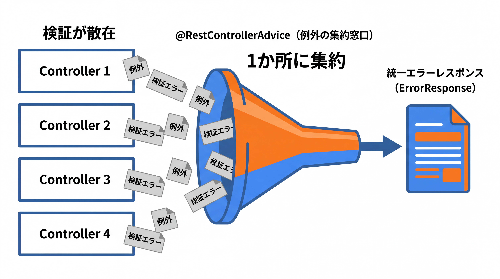
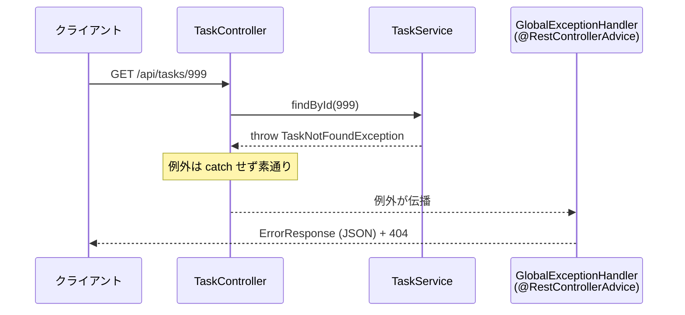

# 3-3-3 バリデーションと例外ハンドリング

📝 **前提知識**: このセクションは「3-3-2 DTO と JSON」の内容を前提としています。

## 🎯 このセクションで学ぶこと

- Bean Validation の制約アノテーションをリクエスト DTO に付け、`@Valid` で入力を検証できる
- `@RestControllerAdvice` と `@ExceptionHandler` で、例外を一箇所にまとめて処理できる
- `ErrorResponse` で統一されたエラーレスポンスを設計し、検証エラーをフィールドごとに返せる

本セクションでは、入力検証の課題から始め、Bean Validation による制約の宣言、`@Valid` での検証、例外を一箇所で処理する仕組み、そして統一エラーレスポンスの設計へと進みます。

---

## 導入: バリデーションと例外処理が、コントローラ中に散らばる

3-3-2 までで、リクエストを DTO で受け、レスポンスを DTO で返す形が整いました。ですが、まだ「不正な入力」と「失敗したときのエラー応答」を扱っていません。

検証を素朴に書くと、コントローラのメソッドの冒頭が `if (request.title() == null) { ... }` のようなチェックで埋まります。さらに、見つからない・不正・予期しない、といった失敗ごとに `if` でステータスを返し分ける処理も各メソッドに散らばります。Laravel では、この入力検証を FormRequest に、例外処理を例外ハンドラ（`Handler`）に切り出すことで、コントローラを本来のロジックだけに保てました。

Spring にも同じ発想の道具があります。入力検証は **Bean Validation** （制約をアノテーションで宣言）と `@Valid`、例外処理は **`@RestControllerAdvice`** （例外を一箇所で受けて整形）です。本セクションでは、検証とエラー応答をコントローラの外に追い出し、Web 層を整った形に仕上げます。

### 🧠 先輩エンジニアの思考プロセス

> Laravel に FormRequest があると知る前の私は、コントローラの先頭に検証の `if` をずらずら書いていました。同じ「タイトルは必須」の検証を、作成と更新の両方のメソッドにコピペして、片方だけ直し忘れる。そんなことをやっていました。FormRequest にルールを集約してからは、コントローラがすっきりして、検証の重複も消えました。
>
> Java に来て安心したのは、同じ「宣言で検証する」発想がそのまま使えたことです。DTO のフィールドに `@NotBlank` と書けば、それが検証ルールになる。例外も `@RestControllerAdvice` という 1 クラスに集約でき、コントローラからエラー処理の `if` が消えました。FormRequest と例外ハンドラでやっていたことが、ほぼそのまま別の名前で揃っている、という感覚でした。



---

## Bean Validation: 制約をアノテーションで宣言する

**Bean Validation** は、オブジェクトのフィールドが満たすべき制約をアノテーションで宣言する Java 標準の仕組みです。制約アノテーションは `jakarta.validation.constraints` パッケージにあり、`@NotNull`・`@NotBlank`・`@Size`・`@Email`・`@Min` / `@Max` などが用意されています。

3-3-2 で定義した `TaskCreateRequest` に、入力ルールを宣言してみます。

```java
// TaskCreateRequest.java
package com.example.taskapp.dto;

import jakarta.validation.constraints.NotBlank;
import jakarta.validation.constraints.Size;
import java.time.LocalDate;

public record TaskCreateRequest(
        @NotBlank
        @Size(max = 100)
        String title,                 // 必須・100 文字以内

        @Size(max = 1000)
        String description,           // 任意・1000 文字以内

        LocalDate dueDate
) {
}
```

- `@NotBlank`: `null`・空文字・空白だけ、のいずれも許しません。「必須の文字列」に使います。
- `@Size(max = 100)`: 文字列の長さ（やコレクションの要素数）の上限・下限を制約します。
- `@Email`: メールアドレスの形式を検証します（`User` の `email` などに使えます）。
- `@NotNull`: `null` だけを禁じます（空文字は許す点が `@NotBlank` との違いです）。

制約は、3-3-2 で見たとおり `record` のコンポーネントにそのまま付けられます。「どんな値が正しいか」をフィールドの宣言と同じ場所に書けるのが Bean Validation の利点です。

### 依存を別途追加する

ここで重要な前提があります。Bean Validation の機能は、Web スターター（`spring-boot-starter-web`）には含まれません。Spring Boot 2.3 以降、バリデーションは別のスターターに分離されたため、`spring-boot-starter-validation` を明示的に追加する必要があります。

```xml
<!-- pom.xml（依存に追加する） -->
<dependency>
    <groupId>org.springframework.boot</groupId>
    <artifactId>spring-boot-starter-validation</artifactId>
</dependency>
```

⚠️ **注意**: この依存を追加し忘れると、`@NotBlank` などを書いても検証が一切働かない（例外も出ず素通りする）状態になります。「アノテーションは付けたのにバリデーションが効かない」という詰まり方の多くが、この依存の入れ忘れです。

> 💡 **レガシー案件での名前空間（javax → jakarta）**: 本教材は `jakarta.validation.*` を使います。Spring Boot 2.x までのレガシーな案件では、これが `javax.validation.*` でした（`javax.validation.constraints.NotBlank` など）。Java EE が Jakarta EE に移行した際にパッケージが `javax` から `jakarta` へ変わったもので、アノテーション名（`@NotBlank` 等）自体は同じです。古いコードで `javax.validation` を見かけたら「`jakarta` の前身だ」と気づけるようにしておいてください。

---

## @Valid: リクエストを検証する

制約を宣言しただけでは検証は走りません。コントローラで「このリクエストを検証せよ」と指示する必要があります。それが `@Valid`（`jakarta.validation.Valid`）です。`@RequestBody` の引数に付けます。

```java
// TaskController.java
import jakarta.validation.Valid;
import org.springframework.http.HttpStatus;
import org.springframework.web.bind.annotation.*;

@PostMapping
@ResponseStatus(HttpStatus.CREATED)
public TaskResponse create(@Valid @RequestBody TaskCreateRequest request) {
    return taskService.create(request);   // 検証を通過したリクエストだけがここに届く
}
```

`@Valid @RequestBody` と並べると、Spring は JSON を `TaskCreateRequest` に変換した直後に Bean Validation を実行します。すべての制約を満たせばメソッド本体が実行され、満たさなければ本体に入る前に検証エラーとして処理が中断されます。コントローラのメソッド本体は「検証済みの入力」を前提に書けるため、冒頭の `if` チェックが要らなくなります。

公式ドキュメント（Spring Web MVC リファレンス）は、`@RequestBody` の引数に `@jakarta.validation.Valid` または Spring の `@Validated` を付けると Bean Validation が適用される、と説明しています。検証に失敗したとき、Spring は **`MethodArgumentNotValidException`** という例外を投げます。この例外をどう受け止めるかが、次の話です。

💡 **Laravel との対応**: `@Valid @RequestBody TaskCreateRequest` は、Laravel のコントローラ引数で FormRequest を型指定していたこと（`public function store(StoreTaskRequest $request)`）に対応します。FormRequest がルールに通らないリクエストをコントローラに入れなかったのと同じく、`@Valid` も検証を通った入力だけをメソッド本体に届けます。

---

## 例外を一箇所で処理する: @RestControllerAdvice

検証エラー（`MethodArgumentNotValidException`）も、3-3-1 で触れた「見つからない」エラー（`TaskNotFoundException`）も、各コントローラで個別に `catch` していては処理が散らばります。これらをアプリケーション全体で一箇所にまとめて受け止める仕組みが **`@RestControllerAdvice`** です。

`@RestControllerAdvice` を付けたクラスに、`@ExceptionHandler` を付けたメソッドを並べると、コントローラで発生した例外が型ごとにそのメソッドへ送られます。例外を投げる側（コントローラやサービス）は、エラー応答の組み立てを一切気にせず「異常なら例外を投げる」だけで済みます。



まず、3-3-2 で登場した独自例外 `TaskNotFoundException` を 404 に変換するハンドラを書きます。この例外は 1-3-2 で `RuntimeException` を継承する非検査例外として定義済みのものを、そのまま再利用します。

```java
// GlobalExceptionHandler.java
package com.example.taskapp.exception;

import com.example.taskapp.dto.ErrorResponse;
import org.springframework.http.HttpStatus;
import org.springframework.http.ResponseEntity;
import org.springframework.web.bind.annotation.ExceptionHandler;
import org.springframework.web.bind.annotation.RestControllerAdvice;

@RestControllerAdvice
public class GlobalExceptionHandler {

    @ExceptionHandler(TaskNotFoundException.class)
    public ResponseEntity<ErrorResponse> handleTaskNotFound(TaskNotFoundException ex) {
        ErrorResponse body = new ErrorResponse(HttpStatus.NOT_FOUND.value(), ex.getMessage(), null);
        return ResponseEntity.status(HttpStatus.NOT_FOUND).body(body);   // 404
    }
}
```

これで、サービス層が `throw new TaskNotFoundException(...)` するだけで、クライアントには 404 と整形された JSON が返ります。3-3-1 で「全メソッドに 404 の `if` を書くのは煩雑なので、例外を投げて一箇所で変換する」と予告したのが、この仕組みです。Laravel の `findOrFail()` が見つからないときに自動で 404 を返してくれたのと、結果として同じことを実現しています。

💡 **Laravel との対応**: `@RestControllerAdvice` + `@ExceptionHandler` は、Laravel の例外ハンドラ（`app/Exceptions/Handler.php` の `render` メソッドで例外ごとに応答を切り替えていた処理）に対応します。「例外の型を見て、対応する HTTP レスポンスに変換する一元的な場所」という役割が共通します。

---

## 統一エラーレスポンスを設計する

エラー応答の JSON の形がエンドポイントごとにバラバラだと、クライアントは扱いに困ります。そこで、エラーレスポンスの形も DTO（`record`）として一つに固定します。これが `ErrorResponse` です。

検証エラーでは「どのフィールドが、なぜ駄目だったか」をクライアントに返したいので、フィールドごとのエラーを保持できる形にします。

```java
// ErrorResponse.java
package com.example.taskapp.dto;

import java.util.List;

public record ErrorResponse(
        int status,            // HTTP ステータスコード（404, 400 など）
        String message,        // 全体的なエラーメッセージ
        List<FieldError> errors  // フィールドごとのエラー（検証エラー以外では null）
) {
    public record FieldError(String field, String message) {   // ネストした record
    }
}
```

次に、検証失敗時の `MethodArgumentNotValidException` を受けるハンドラを `GlobalExceptionHandler` に追加します。この例外は、どのフィールドがどの制約に違反したかの情報を持っているので、それを `ErrorResponse` に詰め替えます。

```java
// GlobalExceptionHandler.java（検証エラーのハンドラを追加）
import com.example.taskapp.dto.ErrorResponse.FieldError;
import org.springframework.web.bind.MethodArgumentNotValidException;
import java.util.List;

@ExceptionHandler(MethodArgumentNotValidException.class)
public ResponseEntity<ErrorResponse> handleValidation(MethodArgumentNotValidException ex) {
    List<FieldError> fieldErrors = ex.getBindingResult().getFieldErrors().stream()
            .map(e -> new FieldError(e.getField(), e.getDefaultMessage()))   // 2-4-3 の Stream
            .toList();
    ErrorResponse body = new ErrorResponse(
            HttpStatus.BAD_REQUEST.value(), "入力内容に誤りがあります", fieldErrors);
    return ResponseEntity.badRequest().body(body);   // 400
}
```

`ex.getBindingResult().getFieldErrors()` で違反したフィールドの一覧を取り出し、2-4-3 で学んだ `Stream` でフィールド名とメッセージのペアに変換しています。結果として、検証に失敗したリクエストには次のような JSON が 400 で返ります。

```json
{
  "status": 400,
  "message": "入力内容に誤りがあります",
  "errors": [
    { "field": "title", "message": "空白は許可されていません" }
  ]
}
```

これで、エラーの種類が違っても（404 でも 400 でも）レスポンスの形は `ErrorResponse` で統一されます。クライアントは常に `status`・`message`・`errors` の 3 つを見ればよく、扱いが安定します。

🔑 統一エラーレスポンスの要点は、「例外の種類をハンドラが HTTP ステータスに対応づけ、応答の形を 1 つの DTO に揃える」ことです。`TaskNotFoundException` は 404、検証エラー（`MethodArgumentNotValidException`）は 400、というように型ごとにマッピングします。

💡 **Laravel との対応**: Laravel ではバリデーション失敗時に 422（Unprocessable Entity）でフィールドごとのエラーが返るのが既定でした。Spring の `@RequestBody` 検証失敗は既定で 400（Bad Request）です。どちらのステータスにするかは API の方針次第ですが（必要なら 422 に変えることもできます）、「フィールドごとのエラーを構造化して返す」という発想は共通です。本教材では Spring の既定に沿って 400 で進めます。

なお、ここで扱ったのは「例外を受けて統一エラーレスポンスを **作る仕組み**」までです。どの例外をどの層で処理すべきか、例外をどう分類・設計するか、ログとどう連携させるか、といった例外設計の指針は、Part 4 の 4-3-1（例外設計とログ）で扱います。本セクションで組んだ `@RestControllerAdvice` の仕組みを土台に、そこで設計の観点へ踏み込みます。

---

## ✨ まとめ

- Bean Validation は制約をアノテーション（`jakarta.validation.constraints` の `@NotBlank` / `@Size` / `@Email` 等）で宣言する。利用には `spring-boot-starter-validation` の追加が必要
- `@Valid @RequestBody` でリクエストを検証する。失敗すると Spring が `MethodArgumentNotValidException` を投げ、メソッド本体には検証済みの入力だけが届く
- `@RestControllerAdvice` + `@ExceptionHandler` で例外を一箇所に集約する。`TaskNotFoundException` を 404、検証エラーを 400 にマッピングし、コントローラからエラー処理を追い出せる
- エラー応答は `ErrorResponse`（`record`）で形を統一し、検証エラーはフィールドごとに返す。例外の分類・設計指針・ログ連携は 4-3-1 で扱う

【Chapter 3-3 の振り返り】本章では、Web 層を一通り組めるようにしました。3-3-1 でリクエストの受け取り（`@RestController`・HTTP メソッドのマッピング・`@PathVariable` / `@RequestParam` / `@RequestBody`）と JSON 応答・ステータスコード設計を、3-3-2 で入出力を運ぶ DTO（`record`）と Jackson による JSON 変換・エンティティ ↔ DTO の分離を、そして本セクションで入力検証（Bean Validation・`@Valid`）とエラー設計（`@RestControllerAdvice` による統一エラーレスポンス）を学びました。リクエストを受けて、検証し、処理を委ね、JSON で応答し、失敗を整ったエラーで返す、という API の Web 層の縦串が通りました。

---

次の Chapter（3-4）からは、これまで「Eloquent モデルに相当する DB マップ対象クラス」と類推で済ませてきたエンティティの実体に踏み込みます。最初の 3-4-1 では、`@Entity`・`@Id`・`@GeneratedValue` といったアノテーションでクラスをテーブルに対応づけ、カラムマッピング（`LocalDateTime` などの日付・時刻型を含む）の書き方を学びます。あわせて JPA / Hibernate がそのマッピングをもとに何をしてくれるのか（その役割）を押さえ、テーブルとクラスをどう対応づけるのかを明らかにします。Laravel の Eloquent モデルとマイグレーションでやっていたことが、Java ではエンティティとスキーマ管理としてどう実現されるのかが見えてきます。
