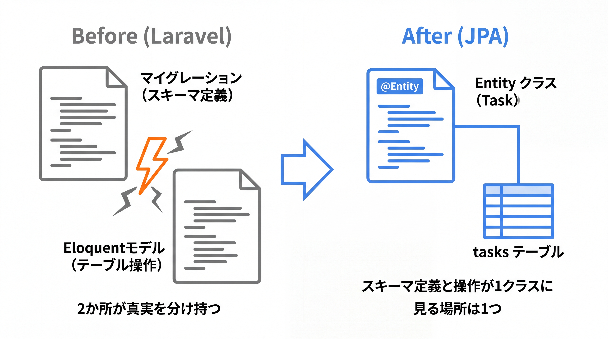
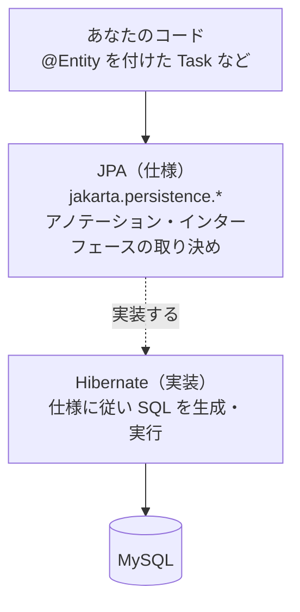

# 3-4-1 エンティティとマッピング

Chapter 3-4 では、Web 層の下にあるデータアクセス層を扱います。Java のクラスをデータベースのテーブルに対応づけ（エンティティ）、関連を表現し（リレーション）、データを取り出す入口（リポジトリ）を用意し、最後に整合性と性能（トランザクションと N+1）まで踏み込みます。Eloquent で身につけた感覚を足がかりに、Spring Data JPA でデータ層を組めるようになるのがこの Chapter のゴールです。

| セクション | テーマ | 種類 |
|---|---|---|
| 3-4-1 エンティティとマッピング | JPA / Hibernate の役割・`@Entity`・`@Id`・`@GeneratedValue`・カラムマッピング | 概念 |
| 3-4-2 リレーションとリポジトリ | `@OneToMany` / `@ManyToOne` / `@ManyToMany`・`JpaRepository`・派生クエリ・`@Query`・`Pageable` | 概念 |
| 3-4-3 トランザクションと N+1 | `@Transactional`・遅延 / 即時フェッチ・N+1 問題と対策 | 概念 |

📖 **この Chapter の進め方**: まず本セクションで、1 つのテーブルに対応する 1 つのエンティティ（`Task`）の作り方を押さえます。次に 3-4-2 で、エンティティどうしの関連（タスクとユーザー、タスクとタグ）と、データを取り出すリポジトリを学びます。最後に 3-4-3 で、複数の操作をまとめて成功・失敗させるトランザクションと、関連を引くときに性能を落とす N+1 問題への対策を扱います。

📝 **前提知識**: このセクションは「3-2-2 レイヤードアーキテクチャ」の内容を前提としています。

## 🎯 このセクションで学ぶこと

- ORM の仕組みの中で、JPA（仕様）と Hibernate（実装）がそれぞれ何を担うのかを説明できる
- `@Entity`・`@Id`・`@GeneratedValue` でクラスをテーブルに、フィールドを列に、主キーを自動採番に対応づけられる
- `@Column` / `@Table` でカラム名や制約を調整し、`LocalDate` / `LocalDateTime` などの日付・時刻型を扱える

本セクションでは、JPA と Hibernate の役割分担から始め、`@Entity` でクラスをテーブルに対応づける書き方、主キーと自動採番、カラムマッピングと日付・時刻型へと進み、最後にエンティティ特有の `equals` / `hashCode` の罠を確認します。

---

## 導入: マイグレーションとモデルが、1 つのクラスに溶け合う

Laravel でテーブルを 1 つ増やすとき、あなたは 2 つのファイルを書いていました。スキーマを定義する **マイグレーション** （`Schema::create('tasks', ...)`）と、そのテーブルを操作する **Eloquent モデル** （`class Task extends Model`）です。テーブルの構造はマイグレーションが語り、モデルはそのテーブルに対する振る舞いを持つ。役割がきれいに分かれていました。

JPA のエンティティは、この 2 つの役割を 1 つのクラスに統合します。`Task` というクラスにフィールドを型付きで宣言すると、そのクラスがそのまま「`tasks` テーブルはこういう列を持つ」というスキーマの定義を兼ねます。マイグレーションファイルは要りません。クラスがテーブルを語るのです。Laravel の感覚で言えば「マイグレーションとモデルが 1 つのクラスに溶け合った」状態だと捉えると、最初のとっかかりがつかみやすいはずです。

### 🧠 先輩エンジニアの思考プロセス

> Laravel 時代、私はマイグレーションとモデルがずれることに何度か泣かされました。マイグレーションで `nullable` を足したのにモデルの `$fillable` を直し忘れたり、列名を変えたのに片方だけ追従していたり。2 か所が真実を分け持っているせいで、どちらが正なのか分からなくなる瞬間が必ず来るのです。
>
> Java のエンティティに移って、その種の食い違いがほぼ消えました。列の定義もマッピングも 1 つのクラスにあるので、見るべき場所が 1 つになる。最初は「クラスにデータベースの知識を持たせるのは行儀が悪いのでは」と身構えましたが、`Task` クラスを開けばテーブルの形が全部分かる安心感の方が、現場ではずっと効きました。



---

## JPA と Hibernate の役割

データアクセス層に入る前に、登場人物の役割をはっきりさせておきます。3-3-2 で DTO を学んだとき、「エンティティ ＝ あなたが知る Eloquent モデルに相当する、DB にマップされるクラス」と前振りしました。その実体がここで登場します。

まず **ORM** （Object-Relational Mapping）とは、オブジェクト（Java のクラス・インスタンス）とリレーショナルデータベースの行を相互に対応づけ、SQL を直接書かずにデータを読み書きできるようにする仕組みです。これは概念としては既習です。Eloquent もまさに ORM でした。

Java の世界では、この ORM が 2 つの層に分かれています。

- **JPA** （Jakarta Persistence API）は **仕様** です。`@Entity` や `@Id` といったアノテーション、`EntityManager` といったインターフェースの「あるべき形」を定めた取り決めであり、それ自体は動くプログラムではありません。Java の標準仕様の一部で、パッケージは `jakarta.persistence.*` です。
- **Hibernate** は、その JPA 仕様を実際に動かす **実装** です。`@Entity` の付いたクラスを読み取り、対応する SQL を組み立て、データベースとやり取りする実務を担います。JPA という「規格書」に対する「実際の製品」が Hibernate だとイメージするとよいでしょう。



🔑 あなたが書くのは JPA のアノテーション（`@Entity` など）であり、実際に SQL を発行するのは Hibernate です。仕様と実装を分けておくことで、原理的には Hibernate を別の JPA 実装に差し替えても、あなたのエンティティのコードはそのまま動きます。これは 2-3 で学んだ「インターフェース（契約）と実装の分離」が、フレームワークの規模で実践されている例です。

Spring Data JPA は、この JPA / Hibernate のさらに上に乗り、リポジトリという便利な入口を提供する Spring のライブラリです（3-4-2 で扱います）。本教材で使う依存は `spring-boot-starter-data-jpa` で、これを入れると JPA・Hibernate・Spring Data JPA がまとめて構成されます。

💡 **Laravel との対応**: Eloquent は「ORM の仕様」と「その実装」が一体になった 1 つのライブラリでした。Java では JPA（仕様）と Hibernate（実装）に分かれています。普段書くコードは JPA のアノテーションなので、Hibernate を直接意識する場面は多くありませんが、ログに流れる SQL やエラーメッセージに `org.hibernate.*` が出てくるのはこのためです。

---

## @Entity でクラスをテーブルに対応づける

それでは、Part 1 / Part 2 から登場している `Task` を、JPA のエンティティとして書いてみます。まずは最小の形からです。

```java
// Task.java
package com.example.taskapp.entity;

import jakarta.persistence.Entity;
import jakarta.persistence.GeneratedValue;
import jakarta.persistence.GenerationType;
import jakarta.persistence.Id;

@Entity
public class Task {

    @Id
    @GeneratedValue(strategy = GenerationType.IDENTITY)
    private Long id;

    private String title;
    private boolean done;
}
```

このクラスに付けたアノテーションが、それぞれ次の意味を持ちます。

- **`@Entity`**: 「このクラスは 1 つのテーブルに対応する」という宣言です。これを付けると、Hibernate がこのクラスを管理対象（永続化の対象）として扱います。テーブル名は既定でクラス名（`Task`）から導かれ、データベースによっては `task` のように小文字化されます。
- **`@Id`**: そのフィールドが **主キー** （プライマリキー）であることを示します。Laravel のマイグレーションで `$table->id()` が暗黙に作っていた `id` 列に相当します。
- **`@GeneratedValue(strategy = GenerationType.IDENTITY)`**: 主キーの値を **自動採番** する指示です。`IDENTITY` は、MySQL の `AUTO_INCREMENT` のように、データベース側の自動増分カラムに採番を任せる戦略です。新しい `Task` を保存すると、`id` はデータベースが採番してくれます。

📝 主キーの型に `Long`（参照型）を使っている点に注意してください。プリミティブの `long` ではなく `Long` を選ぶのは、保存前のエンティティでは「まだ採番されていない ＝ `null`」という状態を表せるようにするためです。`long` だと未採番を `0` としか表現できず、採番済みかどうかを判別できません。

`@GeneratedValue` の `strategy` には他にも選択肢があります。本教材では MySQL を使うので `IDENTITY` を基本としますが、現場では次の戦略も見かけます。

| 戦略 | 採番の仕方 | 主な用途 |
|---|---|---|
| `IDENTITY` | DB の自動増分カラムに任せる | MySQL（本教材の既定） |
| `SEQUENCE` | DB のシーケンスオブジェクトを使う | PostgreSQL・Oracle |
| `AUTO` | DB に応じて Hibernate が自動選択 | DB を固定しないとき |

💡 **Laravel との対応**: `@Entity` ＋ `@Id` ＋ `@GeneratedValue(IDENTITY)` の 3 点セットが、Eloquent モデルの `class Task extends Model` ＋ マイグレーションの `$table->id()`（自動増分の主キー）にあたります。Eloquent が規約で暗黙に決めていた「主キーは `id`・自動増分」を、JPA ではアノテーションで明示する、という違いです。

---

## カラムマッピングと制約

`@Entity` を付けたクラスのフィールドは、既定でそのまま列になります。`String title` は `title` 列（文字列型）、`boolean done` は `done` 列（真偽値型）です。フィールド名から列名が導かれ、フィールドの Java 型から列の型が決まります。これは Eloquent が「モデルのプロパティ ＝ テーブルの列」とみなしていた感覚に近いものです。

列名や制約を細かく指定したいときは、`@Column` を使います。また、テーブル名をクラス名と変えたいときは `@Table` を使います。

```java
// Task.java（一部）
import jakarta.persistence.Column;
import jakarta.persistence.Table;

@Entity
@Table(name = "tasks")
public class Task {

    @Id
    @GeneratedValue(strategy = GenerationType.IDENTITY)
    private Long id;

    @Column(nullable = false, length = 100)
    private String title;

    @Column(columnDefinition = "TEXT")
    private String description;

    private boolean done;
}
```

- **`@Table(name = "tasks")`**: テーブル名を明示的に `tasks` にします。既定のテーブル名がクラス名から導かれて意図とずれる場合や、命名規約を揃えたい場合に使います。
- **`@Column(nullable = false, length = 100)`**: `title` 列を NOT NULL・最大長 100 にします。Laravel のマイグレーションで `$table->string('title', 100)` と書いていたのに相当します。
- **`@Column(columnDefinition = "TEXT")`**: `description` を長文用の TEXT 型にします。`description` は任意項目（`null` を許す）なので `nullable` は既定（許可）のままにしています。

⚠️ **注意**: `@Column` を省略しても列は作られます（既定の名前・型で）。`@Column` は「既定でよければ書かなくてよい」追加情報です。一方、`@Id` は省略できません。主キーのないエンティティは JPA では許されず、起動時にエラーになります。

### 日付・時刻型のマッピング

実務のエンティティには、作成日時や期限といった日付・時刻が必ず登場します。Java では、これらを `java.time` パッケージの型で表します。

- **`LocalDate`**: 日付のみ（時刻なし）。タスクの期限 `dueDate` のような「○月○日」を表すのに使います。
- **`LocalDateTime`**: 日付＋時刻。作成日時 `createdAt` のような「いつ作られたか」を表すのに使います。

これらは、特別なアノテーションなしでそのままフィールドにできます。Hibernate が `LocalDate` を DB の DATE 型に、`LocalDateTime` を TIMESTAMP（または DATETIME）型に自動で対応づけます（Hibernate は `java.time` の型を JDBC の日付・時刻型へ変換します）。

```java
// Task.java（日付・時刻フィールドを追加）
import java.time.LocalDate;
import java.time.LocalDateTime;

@Entity
@Table(name = "tasks")
public class Task {

    @Id
    @GeneratedValue(strategy = GenerationType.IDENTITY)
    private Long id;

    @Column(nullable = false, length = 100)
    private String title;

    @Column(columnDefinition = "TEXT")
    private String description;

    private boolean done;

    private LocalDate dueDate;          // 期限（日付のみ）

    private LocalDateTime createdAt;    // 作成日時（日付＋時刻）

    // JPA はフィールドアクセスにこの引数なしコンストラクタを必要とする
    protected Task() {
    }

    // getter / setter は省略
}
```

📝 **引数なしコンストラクタ**: エンティティには、引数のない（デフォルト）コンストラクタが必要です。Hibernate がデータベースから読み出したデータでインスタンスを組み立てる際に、内部でこのコンストラクタを使うためです。外部から直接呼ばせたくないので `protected` にしておくのが定石です。2-1 で学んだ「コンストラクタを定義すると既定の引数なしコンストラクタは消える」ルールがあるため、独自のコンストラクタを足す場合は引数なし版も明示的に書きます。

ここまでで、`Task` エンティティの主要フィールド（`id` / `title` / `description` / `done` / `dueDate` / `createdAt`）が揃いました。`User` への参照（`@ManyToOne`）とタグ（`@ManyToMany`）という **関連** のフィールドは、リレーションを扱う 3-4-2 で追加します。

なお、関連先として 3-4-2 で本格的に使う `User` も、最小の形だけ示しておきます。構造は `Task` と同じく、`@Entity` ＋ `@Id` ＋ `@GeneratedValue` の組み合わせです。

```java
// User.java
package com.example.taskapp.entity;

import jakarta.persistence.*;
import java.time.LocalDateTime;

@Entity
@Table(name = "users")
public class User {

    @Id
    @GeneratedValue(strategy = GenerationType.IDENTITY)
    private Long id;

    @Column(nullable = false, unique = true)
    private String username;

    @Column(nullable = false)
    private String email;

    private LocalDateTime createdAt;

    protected User() {
    }

    // getter / setter は省略
}
```

💡 認証に使うパスワードなどのフィールドは Part 4（セキュリティ）の領域です。Part 3 では `User` は上記の最小構成にとどめます。

💡 **Spring Boot 3.x / レガシーではこう書きます**: 本教材は Jakarta EE ベースの `jakarta.persistence.*` を使います。Spring Boot 2.x までの古い案件では、同じアノテーションが `javax.persistence.*` という旧パッケージにありました（`javax.persistence.Entity` など）。import の先頭が `javax` で始まっていたら、それは 2.x 世代のコードだと気づけるようにしておくと、案件の世代を読み取る手がかりになります。アノテーション名そのもの（`@Entity`・`@Id` 等）は変わりません。

---

## スキーマはどう作られるか（ddl-auto）

エンティティを書いたら、対応するテーブルは誰が作るのでしょうか。Laravel では `php artisan migrate` を自分で実行していました。Spring Boot では、`application.yml` の `spring.jpa.hibernate.ddl-auto` という設定で、起動時の振る舞いを選べます。

```yaml
# application.yml
spring:
  jpa:
    hibernate:
      ddl-auto: validate
```

主な値は次のとおりです。

| 値 | 起動時の振る舞い |
|---|---|
| `none` | 何もしない（既存スキーマに任せる） |
| `validate` | エンティティとテーブルの構造が一致するか **検証** だけする（不一致なら起動失敗） |
| `update` | 不足する列・テーブルを追加しようとする |
| `create` | 起動のたびにテーブルを作り直す（既存データは消える） |

⚠️ **注意**: `create` や `update` は手軽ですが、本番環境では使いません。意図しないスキーマ変更やデータ消失につながるためです。実務では、スキーマの変更管理は Flyway や Liquibase といった専用ツール（Laravel のマイグレーションに近い役割）に任せ、`ddl-auto` は `validate` か `none` にしておくのが定石です。本教材では、起動時にエンティティとテーブルのずれを検知できる `validate` を基本とします。実際にテーブルを用意して接続する手順は Part 5 のハンズオンで扱うので、ここでは「`ddl-auto` で起動時のスキーマ確認方法を選ぶ」という役割を押さえれば十分です。

---

## エンティティの equals / hashCode の罠

`equals` と `hashCode` の契約（`equals` が等しい 2 つは `hashCode` も必ず等しい）は 2-2-1 で学びました。`Set` や `Map` のキーで正しく動かすために、`equals` をオーバーライドするなら `hashCode` も必ずセットで実装する、というあの契約です。

エンティティでは、ここに **特有の罠** があります。

⚠️ 自動採番される `id`（`@GeneratedValue`）を `equals` / `hashCode` の判定基準に使うと、**永続化の前後で同一性が崩れます**。`new Task(...)` した直後のエンティティは `id` がまだ `null` です。これを `Set` に入れてから保存すると、保存時にデータベースが `id` を採番するため `hashCode` の元になる値が `null` から数値へ変わってしまいます。すると、最初に入れたときと同じオブジェクトなのに `Set` の中で見つけられなくなる、という不可解な挙動が起きます。

深入りはしませんが、対処の方向性だけ示します。実務では「`id` だけに頼らない」のが基本で、よく採られる手は次のいずれかです。

- `equals` / `hashCode` を **オーバーライドしない** （既定の参照同一性のまま使う）。1 つの永続化コンテキスト内では Hibernate が同一行に同一インスタンスを返すため、これで困らない場面が多い。
- 採番に依存しない **業務的な一意キー** （たとえばユーザーのメールアドレスのような自然キー）があるなら、それで `equals` / `hashCode` を組む。

🔑 押さえるべき一点は、「エンティティの `equals` / `hashCode` を自動採番 ID で安易に実装してはいけない」ことです。契約そのものは 2-2-1 のとおりなので、ここではこのエンティティ特有の注意だけ覚えておけば十分です。

---

## ✨ まとめ

- ORM は JPA（仕様・`jakarta.persistence.*`）と Hibernate（実装・SQL を発行）に分かれる。あなたが書くのは JPA のアノテーションで、SQL を組み立てるのは Hibernate
- `@Entity` でクラスをテーブルに、`@Id` ＋ `@GeneratedValue(strategy = GenerationType.IDENTITY)` で主キーを自動採番に対応づける。Eloquent のモデル＋マイグレーションが 1 つのクラスに統合される
- `@Column` / `@Table` で列名・制約・テーブル名を調整する。`LocalDate` / `LocalDateTime` は特別な指定なしで日付・時刻列に対応づく。`ddl-auto` で起動時のスキーマ確認方法を選ぶ
- 自動採番 ID を `equals` / `hashCode` に使うと永続化前後で同一性が崩れる。エンティティでは安易に実装しないのが安全

---

次のセクションでは、エンティティどうしの関連を表すマッピングと、データを取り出すリポジトリを学びます。`@OneToMany` / `@ManyToOne` / `@ManyToMany` でタスクとユーザー、タスクとタグの関連を定義し、`JpaRepository` を継承するだけで CRUD を手に入れる仕組み、メソッド名から SQL を生成する派生クエリ、複雑な検索を JPQL で書く `@Query`、そして `Pageable` によるページネーションとソートまで、関連を含むデータ操作を一通り扱います。
