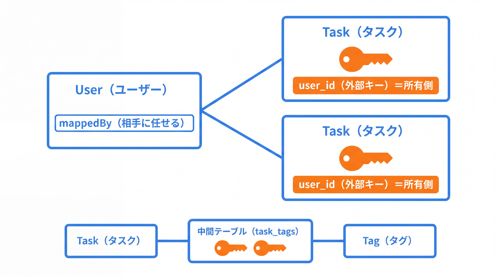
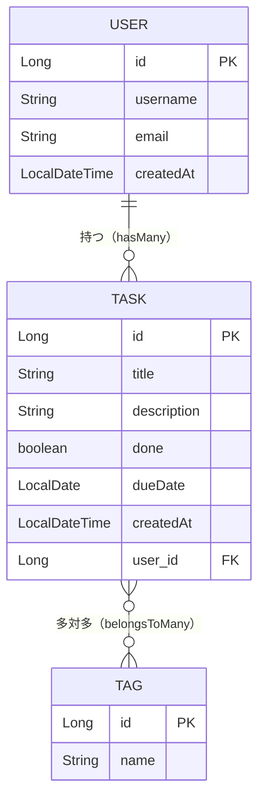

# 3-4-2 リレーションとリポジトリ

📝 **前提知識**: このセクションは「3-4-1 エンティティとマッピング」の内容を前提としています。

## 🎯 このセクションで学ぶこと

- `@ManyToOne` / `@OneToMany` / `@ManyToMany` でエンティティどうしの関連を、所有側と `mappedBy` を意識して定義できる
- `JpaRepository` を継承するだけで CRUD を手に入れ、メソッド名から SQL を生成する派生クエリと、JPQL を書く `@Query` を使い分けられる
- `Pageable` / `Page` でページネーションとソートを実装できる

本セクションでは、タスクとユーザー（多対一）・タスクとタグ（多対多）の関連マッピングから始め、`JpaRepository` による CRUD、派生クエリ、`@Query`（JPQL）、ページネーションとソートへと進みます。

---

## 導入: hasMany / belongsTo を、アノテーションで書く

Laravel で関連を定義するとき、あなたはモデルにメソッドを書いていました。`User` モデルに `tasks()` を生やして `return $this->hasMany(Task::class)`、`Task` モデルに `user()` を生やして `return $this->belongsTo(User::class)`。こう書いておけば、`$user->tasks` でそのユーザーのタスク一覧を、`$task->user` でタスクの持ち主を、SQL を書かずにたどれました。多対多も `belongsToMany` の一行で、中間テーブルごと面倒を見てくれました。

JPA でも考え方は同じです。違うのは、関連を **フィールドとアノテーション** で表すことです。`Task` に `User user` というフィールドを持たせて `@ManyToOne` を付ければ、それが `belongsTo` にあたります。`User` に `List<Task> tasks` を持たせて `@OneToMany` を付ければ `hasMany` です。Eloquent のリレーションメソッドが、型付きフィールド＋アノテーションに置き換わっただけだと捉えると、移行はスムーズです。

### 🧠 先輩エンジニアの思考プロセス

> Laravel の `hasMany` / `belongsTo` は、正直どちらにどう書くかをよく忘れていました。それでも動いたのは、Eloquent が文字列とメソッド名でゆるく結びつけてくれていたからです。スペルを間違えても、実際にその関連をたどるまでエラーにならない。便利でしたが、タイプミスが本番まで生き残ることもありました。
>
> JPA に来て最初に戸惑ったのが「所有側」という考え方です。双方向の関連では、どちらか一方だけが外部キーを管理し、もう一方は `mappedBy` で「相手に任せている」と宣言する。最初は面倒に見えましたが、外部キーの実体がどちらの列にあるのかをコードがはっきり語ってくれるので、慣れるとむしろ事故が減りました。型とアノテーションで縛られている分、スペルミスはコンパイル時か起動時に止まります。



---

## エンティティの関連を図で押さえる

具体的なコードに入る前に、本教材のドメインで扱う 3 つのエンティティの関連を図で確認します。

- **ユーザーとタスク**: 1 人のユーザーが複数のタスクを持つ（1 対多）。タスク側から見れば、1 つのタスクは 1 人のユーザーに属する（多対一）。
- **タスクとタグ**: 1 つのタスクに複数のタグを付けられ、1 つのタグは複数のタスクに付く（多対多）。このセクションで `Tag` エンティティを新たに導入します。



多対多（タスクとタグ）は、リレーショナルデータベースでは直接表現できないため、**中間テーブル** （`task_tags` のような結合テーブル）を介して表します。Laravel の `belongsToMany` が裏で中間テーブルを使っていたのと同じ構造です。図では線が交差していますが、実体としては `task_id` と `tag_id` の 2 列を持つ結合テーブルが間に立ちます。

---

## 多対一と一対多（Task ↔ User）

まず、タスクとユーザーの関連です。「多くのタスクが 1 人のユーザーに属する」関係なので、タスク側が **多対一** （`@ManyToOne`）、ユーザー側が **一対多** （`@OneToMany`）になります。

タスク側（多側）から書きます。

```java
// Task.java（関連フィールドを追加）
import jakarta.persistence.ManyToOne;
import jakarta.persistence.JoinColumn;

@Entity
@Table(name = "tasks")
public class Task {

    @Id
    @GeneratedValue(strategy = GenerationType.IDENTITY)
    private Long id;

    @Column(nullable = false, length = 100)
    private String title;

    private boolean done;

    @ManyToOne
    @JoinColumn(name = "user_id")
    private User user;

    // 他のフィールド・コンストラクタ・getter / setter は省略
}
```

- **`@ManyToOne`**: 「多くの `Task` が 1 つの `User` に対応する」という関連です。Laravel の `belongsTo(User::class)` にあたります。
- **`@JoinColumn(name = "user_id")`**: この関連を表す **外部キー列** が `tasks` テーブルの `user_id` 列であることを示します。外部キーを実際に持つ側（`tasks` テーブル）を **所有側** と呼びます。多対一の関連では、外部キーは「多」側のテーブルに置かれるので、`Task` が所有側です。

💡 `@ManyToOne` の既定のフェッチは EAGER（即時）です。本書のコードは最小形のため既定のままにしていますが、実務では `@ManyToOne(fetch = FetchType.LAZY)` と遅延に寄せることが多くあります（フェッチ戦略と N+1 問題は 3-4-3 で扱います）。

次に、ユーザー側（一側）です。1 人のユーザーが複数のタスクを持つので `@OneToMany` を使います。

```java
// User.java（関連フィールドを追加）
import jakarta.persistence.OneToMany;
import java.util.ArrayList;
import java.util.List;

@Entity
@Table(name = "users")
public class User {

    @Id
    @GeneratedValue(strategy = GenerationType.IDENTITY)
    private Long id;

    @Column(nullable = false, unique = true)
    private String username;

    @OneToMany(mappedBy = "user")
    private List<Task> tasks = new ArrayList<>();

    // 他のフィールド・コンストラクタ・getter / setter は省略
}
```

- **`@OneToMany(mappedBy = "user")`**: 「1 人の `User` が複数の `Task` を持つ」関連です。Laravel の `hasMany(Task::class)` にあたります。
- **`mappedBy = "user"`** が、JPA で初学者がつまずく要点です。これは「この関連の外部キーは私（`User`）が管理しているのではなく、相手側の `Task` の `user` フィールドが管理している」という宣言です。`"user"` は `Task` クラスの関連フィールド名を指します。`mappedBy` が付いた側を **非所有側** （逆側）と呼びます。

🔑 双方向の関連では、外部キーを管理する **所有側は 1 つだけ** にします。所有側（`Task`）に `@JoinColumn` を置き、非所有側（`User`）に `mappedBy` を置く。この役割分担を守らないと、Hibernate が外部キーを二重に管理しようとして、意図しない結合テーブルが作られたり更新が壊れたりします。「外部キーの列を持つ方が所有側」と覚えておくと迷いません。

⚠️ **注意**: コレクション側のフィールド（`List<Task> tasks`）は `new ArrayList<>()` で初期化しておきます。`null` のままだと、ユーザーにまだタスクがない状態でリストを操作したときに `NullPointerException` になりやすいためです。

💡 **Laravel との対応**: `@ManyToOne` ＋ `@JoinColumn` が `belongsTo`、`@OneToMany(mappedBy = ...)` が `hasMany` に対応します。Eloquent では外部キー名（`user_id`）が規約で暗黙に決まり、所有側という概念を意識する必要はありませんでした。JPA では外部キー列とどちらが所有側かをアノテーションで明示します。情報が増えた分、関連の実体がコードから読み取れます。

---

## 多対多（Task ↔ Tag）

次に、タスクとタグの多対多です。ここで `Tag` エンティティを導入します。

```java
// Tag.java
package com.example.taskapp.entity;

import jakarta.persistence.*;
import java.util.HashSet;
import java.util.Set;

@Entity
@Table(name = "tags")
public class Tag {

    @Id
    @GeneratedValue(strategy = GenerationType.IDENTITY)
    private Long id;

    @Column(nullable = false, unique = true)
    private String name;

    @ManyToMany(mappedBy = "tags")
    private Set<Task> tasks = new HashSet<>();

    protected Tag() {
    }

    // getter / setter は省略
}
```

タスク側に、所有側として多対多を定義します。

```java
// Task.java（タグの関連を追加）
import jakarta.persistence.ManyToMany;
import jakarta.persistence.JoinTable;
import java.util.HashSet;
import java.util.Set;

@Entity
@Table(name = "tasks")
public class Task {

    // 省略（id・title・done・user など）

    @ManyToMany
    @JoinTable(
        name = "task_tags",
        joinColumns = @JoinColumn(name = "task_id"),
        inverseJoinColumns = @JoinColumn(name = "tag_id")
    )
    private Set<Tag> tags = new HashSet<>();
}
```

- **`@ManyToMany`**: 多対多の関連です。Laravel の `belongsToMany(Tag::class)` にあたります。
- **`@JoinTable`**: 多対多を表す **中間テーブル** を定義します。`name = "task_tags"` が結合テーブル名、`joinColumns` が「このエンティティ（`Task`）側の外部キー列」、`inverseJoinColumns` が「相手（`Tag`）側の外部キー列」です。Laravel のマイグレーションで中間テーブルを手で作っていた `task_id` / `tag_id` の 2 列が、ここに対応します。
- **`Tag` 側の `@ManyToMany(mappedBy = "tags")`** は、多対一・一対多のときと同じく非所有側を表します。`"tags"` は `Task` クラスの関連フィールド名です。多対多でも所有側は片方だけで、`@JoinTable` を書いた `Task` が所有側、`mappedBy` を書いた `Tag` が非所有側です。

📝 多対多のコレクションに `List` ではなく `Set` を使っているのは、同じタグが 1 つのタスクに重複して付くことを防ぎたいからです。`Set` は重複を許さない集合なので（1-3-1）、多対多の表現に向いています。ここで 2-2-1 で学んだ `equals` / `hashCode` が効いてきますが、`Tag` のように「名前が同じなら同じタグ」とみなせるなら自然キー（`name`）で実装するか、あるいは 3-4-1 で触れたとおり安易な実装を避ける、という方針になります。

---

## JpaRepository: 継承するだけで CRUD が手に入る

エンティティを定義したら、それを読み書きする入口が必要です。Spring Data JPA では、これを **リポジトリ** が担います。3-2-2 で「データアクセスの責務は Repository 層」と学んだ、あの層の実体です。

リポジトリは、インターフェースを 1 つ定義するだけで用意できます。

```java
// TaskRepository.java
package com.example.taskapp.repository;

import com.example.taskapp.entity.Task;
import org.springframework.data.jpa.repository.JpaRepository;

public interface TaskRepository extends JpaRepository<Task, Long> {
}
```

たったこれだけです。`JpaRepository<Task, Long>` を継承すると、型パラメータで「`Task` エンティティを `Long` 型の主キーで扱う」と指定したことになり、基本的な CRUD メソッドがすべて使えるようになります。

| メソッド | 役割 | Eloquent の対応 |
|---|---|---|
| `save(task)` | 保存（新規 insert / 既存 update） | `$task->save()` |
| `findById(id)` | 主キーで 1 件取得（`Optional<Task>` を返す） | `Task::find($id)` |
| `findAll()` | 全件取得 | `Task::all()` |
| `deleteById(id)` | 主キーで削除 | `Task::destroy($id)` |
| `count()` | 件数 | `Task::count()` |

🔑 ここが Spring Data JPA の最大の特徴です。**実装クラスを 1 行も書いていない** のに、これらのメソッドが動きます。Spring が起動時にこのインターフェースを見つけ、`JpaRepository` の標準実装（`SimpleJpaRepository`）を裏で生成して Bean として登録するからです。3-2-1 で学んだ DI コンテナと、2-3 で学んだインターフェースの組み合わせが、ここで効いています。あなたは契約（インターフェース）だけを宣言し、実装は Spring が用意する、という構図です。

`findById` が `Optional<Task>` を返す点も押さえておきます。2-4-3 で学んだ `Optional` です。「見つからないかもしれない」ことを戻り値の型で表しており、`null` チェックの代わりに `orElseThrow(...)` などで安全に扱えます。Eloquent の `find()` が `null` を返しうるのに対し、JPA は `Optional` で「不在の可能性」を型として明示します。

```java
// 使う側（Service など）のイメージ
Task task = taskRepository.findById(id)
        .orElseThrow(() -> new TaskNotFoundException(id));
```

`TaskNotFoundException` は Part 1 / 2 で登場した独自例外（`RuntimeException` を継承する非検査例外）です。「該当データがなければ例外を投げる」というこの形は、3-3-3 や Part 5 でそのまま使います。

`User` と `Tag` のリポジトリも同様に定義します。

```java
// UserRepository.java
public interface UserRepository extends JpaRepository<User, Long> {
}
```

```java
// TagRepository.java
public interface TagRepository extends JpaRepository<Tag, Long> {
}
```

💡 **Laravel との対応**: Eloquent では、モデル自身が `find()` や `all()` といったデータ操作メソッドを `Model` から継承していました（データとデータ操作が同じクラスに同居）。JPA では、データを表す **エンティティ** （`Task`）と、データ操作の入口である **リポジトリ** （`TaskRepository`）を分けます。責務が分かれる分クラスは増えますが、3-2-2 のレイヤード設計（エンティティはデータ、操作は Repository 層）にきれいに収まります。

---

## 派生クエリ: メソッド名から SQL が生まれる

主キー以外の条件で検索したいときはどうするか。Spring Data JPA には **派生クエリ** （Query Methods）という仕組みがあります。決められた規約に沿ってメソッド名を書くだけで、Spring がその名前を解釈して SQL を自動生成してくれます。

```java
// TaskRepository.java
public interface TaskRepository extends JpaRepository<Task, Long> {

    // user_id で絞り込む（関連先のプロパティをたどる）
    List<Task> findByUserId(Long userId);

    // done = true のものだけ
    List<Task> findByDoneTrue();

    // タイトルに含まれる文字列で検索（部分一致）
    List<Task> findByTitleContaining(String keyword);

    // 完了状態 ＋ 期限の前後で絞り込む（AND 条件）
    List<Task> findByDoneFalseAndDueDateBefore(LocalDate date);
}
```

メソッド名は、`find` ＋ `By` ＋ 条件、という構造で読み解きます。

- **`findByUserId`**: `user` フィールドの先にある `id` をたどって絞り込みます（プロパティをドット区切りでたどる感覚を、メソッド名では大文字の区切りで表します）。タスクの持ち主で一覧を引く、もっとも使う形です。
- **`findByDoneTrue`** / **`findByDoneFalse`**: 真偽値フィールドが `true` / `false` のものを取り出します。
- **`findByTitleContaining`**: `title` の部分一致検索（SQL の `LIKE %keyword%`）です。
- **`And`** でつないで複数条件を、**`OrderBy...Asc` / `Desc`** で並び順を表せます。

派生クエリで使える主なキーワードを挙げておきます。

| キーワード | 意味 | 例 |
|---|---|---|
| `And` / `Or` | 複数条件の連結 | `findByDoneTrueAndUserId(...)` |
| `Containing` / `Like` | 部分一致 | `findByTitleContaining(...)` |
| `Between` / `LessThan` / `GreaterThan` | 範囲・比較 | `findByDueDateBetween(...)` |
| `OrderBy...Asc` / `Desc` | 並び順 | `findByUserIdOrderByDueDateAsc(...)` |
| `True` / `False` | 真偽値 | `findByDoneTrue()` |

⚠️ **注意**: 派生クエリはメソッド名を **正確な規約どおり** に書く必要があります。フィールド名のスペルを間違えると、Spring が解釈できず **起動時にエラー** になります。これは欠点ではなく利点で、Eloquent の文字列ベースのクエリビルダなら実行時まで気づけなかったミスを、アプリ起動の段階で止めてくれます。

💡 **Laravel との対応**: Eloquent のクエリビルダ（`Task::where('user_id', $id)->where('done', true)->get()`）を、メソッド名そのもの（`findByUserIdAndDoneTrue`）で表現するのが派生クエリです。条件を「呼び出し時に組み立てる」のではなく「メソッド名として宣言する」点が発想の違いです。

---

## @Query: 複雑なクエリは JPQL で書く

派生クエリは便利ですが、条件が複雑になるとメソッド名が長くなりすぎて読めなくなります。そういうときは、`@Query` アノテーションでクエリを直接書きます。書くのは SQL ではなく **JPQL** （Jakarta Persistence Query Language）です。

JPQL は、テーブルや列ではなく **エンティティとそのフィールド** に対して書くクエリ言語です。`SELECT * FROM tasks` ではなく `SELECT t FROM Task t` のように、クラス名（`Task`）とフィールド名を使います。Eloquent のクエリビルダが最終的に SQL に変換されていたのと同じく、JPQL も Hibernate が実際の SQL に変換します。

```java
// TaskRepository.java
import org.springframework.data.jpa.repository.Query;
import org.springframework.data.repository.query.Param;

public interface TaskRepository extends JpaRepository<Task, Long> {

    @Query("select t from Task t where t.user.id = :userId and t.done = false")
    List<Task> findIncompleteTasksByUser(@Param("userId") Long userId);
}
```

- **`@Query("...")`**: 中に JPQL を書きます。import は `org.springframework.data.jpa.repository.Query` です。
- **`:userId`** は **名前付きパラメータ** で、メソッド引数の `@Param("userId")` と結びつきます。`@Param` のインポートは `org.springframework.data.repository.query.Param` です。
- JPQL の中の `Task` は **クラス名**、`t.user.id` は「`Task` の `user` フィールドの先の `id`」というオブジェクトのたどり方です。テーブル名・列名ではない点に注意してください。

💡 派生クエリで素直に書ける範囲は派生クエリで、結合や集計を含む複雑な条件は `@Query` で、と使い分けるのが定石です。どちらも `TaskRepository` という同じインターフェースに並べられます。

---

## ページネーションとソート

一覧 API では、全件を一度に返すと件数が増えたときに重くなります。Laravel で `Task::paginate(20)` を使ってページ分割していたのと同じことを、Spring Data JPA は `Pageable` と `Page` で実現します。

リポジトリのメソッドに `Pageable` 型の引数を足すと、そのメソッドはページネーションに対応します。戻り値を `Page<Task>` にすると、ページの中身に加えて「総件数」「総ページ数」といったメタ情報も受け取れます。

```java
// TaskRepository.java
import org.springframework.data.domain.Page;
import org.springframework.data.domain.Pageable;

public interface TaskRepository extends JpaRepository<Task, Long> {

    Page<Task> findByUserId(Long userId, Pageable pageable);
}
```

呼び出す側は、`PageRequest` で「何ページ目を・何件ずつ・どの順で」を組み立てて渡します。

```java
// 使う側（Service など）のイメージ
import org.springframework.data.domain.PageRequest;
import org.springframework.data.domain.Sort;

// 0 ページ目（先頭）・20 件ずつ・dueDate の昇順
Pageable pageable = PageRequest.of(0, 20, Sort.by("dueDate").ascending());
Page<Task> page = taskRepository.findByUserId(userId, pageable);

List<Task> content = page.getContent();   // このページのタスク一覧
long total = page.getTotalElements();      // 全体の件数
int pages = page.getTotalPages();          // 総ページ数
```

- **`PageRequest.of(0, 20, ...)`**: ページ番号は **0 始まり** です（先頭ページが `0`）。Laravel の `paginate()` がページ番号 1 始まりだったのと違う点に注意してください。
- **`Sort.by("dueDate").ascending()`**: 並び替えの指定です。`Sort` 単体（`Pageable` なし）を引数にすれば、ページングなしの並び替えだけもできます。
- これらの型はすべて `org.springframework.data.domain.*` に属します。

📝 `Page` が持つ総件数（`getTotalElements`）を得るために、Spring は本体のクエリに加えて件数を数える COUNT クエリも自動で発行します。総件数が不要で、次ページの有無だけ分かればよい場合は、`Page` の代わりに軽量な `Slice` を使う選択肢もあります（COUNT クエリを省けます）。

💡 **Laravel との対応**: `Task::where(...)->paginate(20)` が返していたページネータと、`Page<Task>` がほぼ同じ役割です。`paginate()` がページ番号・1 ページ件数・総件数・リンク情報を持っていたように、`Page` も中身とメタ情報を持ちます。違いはページ番号の起点（Laravel は 1、Spring は 0）です。

---

## ✨ まとめ

- 関連は型付きフィールド＋アノテーションで表す。`@ManyToOne` ＋ `@JoinColumn` が `belongsTo`、`@OneToMany(mappedBy = ...)` が `hasMany`、`@ManyToMany` ＋ `@JoinTable` が `belongsToMany`。双方向では外部キーを持つ側が所有側、相手は `mappedBy` で非所有側
- `JpaRepository<Task, Long>` を継承するだけで CRUD が手に入る。実装クラスは不要で、Spring が起動時に標準実装を Bean として生成する。`findById` は `Optional` を返す
- 派生クエリはメソッド名（`findByUserId`・`findByDoneTrue` など）から SQL を自動生成する。複雑なクエリは `@Query` に JPQL（エンティティとフィールドに対するクエリ）で書く
- ページネーションとソートは `Pageable` / `Page` / `PageRequest` / `Sort` で行う（ページ番号は 0 始まり）。`paginate()` の感覚がそのまま生きる

---

次のセクションでは、複数のデータ操作をまとめて扱うトランザクションと、関連を引くときの性能問題を学びます。`@Transactional` で「全部成功か全部失敗か」を保証する仕組み、関連をいつ読み込むかを決める遅延フェッチと即時フェッチ、そして一覧で関連をたどるたびにクエリが増えてしまう N+1 問題と、その対策（fetch join）まで、性能と整合性に配慮したデータアクセスを扱います。
