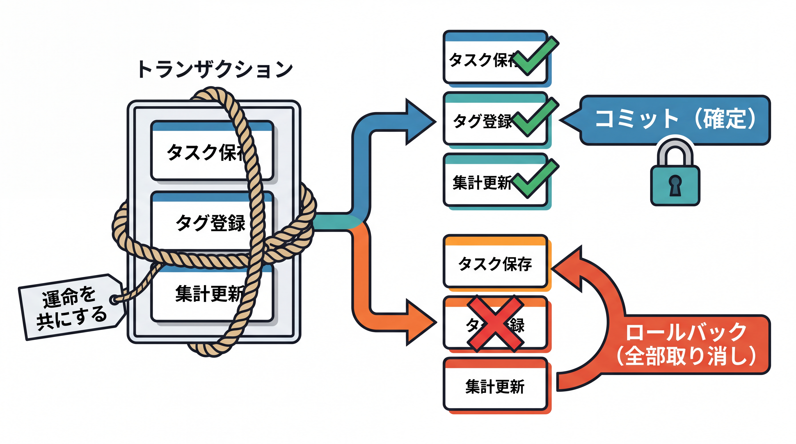
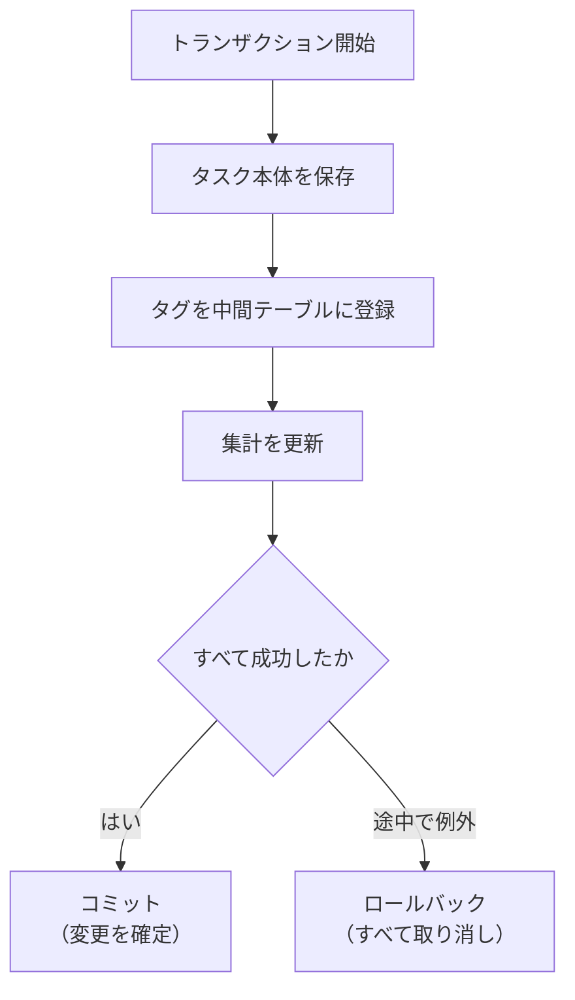
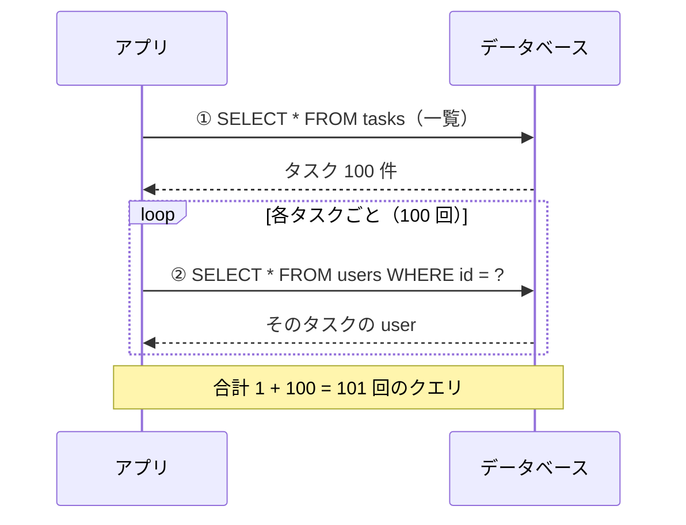

# 3-4-3 トランザクションと N+1

📝 **前提知識**: このセクションは「3-4-2 リレーションとリポジトリ」の内容を前提としています。

## 🎯 このセクションで学ぶこと

- トランザクション（複数の操作を「全部成功か全部失敗か」にまとめる仕組み）を理解し、`@Transactional` をどの層にどう付けるかを説明できる
- 遅延フェッチと即時フェッチの違いと、`LazyInitializationException` がなぜ起きるかを理解する
- N+1 問題が起きる仕組みを説明し、fetch join や `@EntityGraph` で対策できる

本セクションでは、新規概念であるトランザクションを丁寧に導入し、`@Transactional` の使い所、遅延 / 即時フェッチ、そして N+1 問題とその対策へと進みます。

---

## 導入: 「途中で失敗したらどうなる」を引き受ける

タスクを 1 件作るとき、実は複数の書き込みが連鎖することがあります。タスク本体を `tasks` に保存し、付けられたタグを中間テーブル `task_tags` に登録し、関連する集計を更新する。もし 2 番目の書き込みが終わった直後にデータベースとの接続が切れたら、どうなるでしょうか。タスク本体は保存されたのに、タグの登録は途中まで、という **中途半端な状態** がデータベースに残ります。これは、あってはならない状態です。

この「途中で失敗したら、行った操作をすべてなかったことにする」を保証する仕組みが **トランザクション** です。PHP / Laravel で `with()` による N+1 対策は経験済みのはずですが、トランザクションはおそらく踏み込んでこなかった領域でしょう。本セクションでは、これを新しい概念として丁寧に立ち上げ、そのうえで JPA 特有の性能問題（N+1）まで扱います。

### 🧠 先輩エンジニアの思考プロセス

> Laravel 時代、私はトランザクションを意識せずに書いていた時期がありました。注文を保存して、在庫を減らして、ポイントを加算する。普段は問題なく動くのに、ある日、在庫更新でエラーが出たケースで「注文だけ保存されてポイントは付かない」というデータがぽつぽつ生まれていることに気づきました。原因の調査に丸一日かかり、結局は処理全体をトランザクションで囲っていなかったことが原因でした。
>
> Spring に来てからは、Service のメソッドに `@Transactional` を 1 つ付けるだけで、そのメソッドの中の書き込みがまとめて成功・失敗するようになりました。`DB::transaction` でコールバックを囲んでいた頃と狙いは同じですが、メソッド境界がそのまま処理の境界になるので、囲い忘れがほぼなくなったのが大きい。あの丸一日のような事故は、それ以来起きていません。



---

## トランザクションとは

**トランザクション** とは、複数のデータベース操作を **1 つのまとまり** として扱い、「全部成功するか、全部なかったことにするか」のどちらかにする仕組みです。途中まで成功して途中で失敗した、という中途半端な結果を許しません。

成功して結果を確定させることを **コミット**、失敗して操作をすべて取り消すことを **ロールバック** と呼びます。トランザクションの中で行った変更は、コミットされて初めてデータベースに正式に反映されます。途中で例外が起きればロールバックされ、トランザクション開始前の状態に戻ります。

この性質は **原子性** （Atomicity）と呼ばれます。「これ以上分割できない 1 つの単位」という意味で、トランザクションの中身は分割不能な 1 操作のように振る舞います。



📝 トランザクションには、原子性のほかにも一貫性（Consistency）・独立性（Isolation）・永続性（Durability）という性質があり、頭文字をとって **ACID** と呼ばれます。実務で最初に効いてくるのは本セクションで扱う原子性なので、まずはそこを押さえれば十分です。残りの性質は、複数の処理が同時に走るときの整合性（独立性）など、より進んだ場面で関わってきます。

💡 **Laravel との対応**: Laravel で `DB::transaction(fn () => { ... })` とコールバックを囲むと、その中の処理がまとめてコミットされ、例外が出れば自動でロールバックされました。あの「囲んだ範囲が運命を共にする」感覚が、トランザクションの原子性そのものです。Spring では、この「囲む」という操作を、次に見る `@Transactional` がメソッド単位で担います。

---

## @Transactional の使い所

Spring では、トランザクションの境界を `@Transactional` アノテーションで宣言します。コールバックで処理を囲む代わりに、**メソッドに付ける** だけで、そのメソッドの実行全体が 1 つのトランザクションになります。メソッドが正常に終わればコミット、途中で例外が投げられればロールバックされます。

付ける場所は、原則として **Service 層のメソッド** です。3-2-2 で学んだとおり、ビジネスロジック（業務的な処理のまとまり）の責務は Service 層にあります。「タスクとタグをまとめて保存する」のような、複数の Repository 呼び出しにまたがる処理のまとまりが、ちょうどトランザクションの境界と一致するためです。

```java
// TaskService.java
package com.example.taskapp.service;

import org.springframework.stereotype.Service;
import org.springframework.transaction.annotation.Transactional;

@Service
public class TaskService {

    private final TaskRepository taskRepository;

    public TaskService(TaskRepository taskRepository) {
        this.taskRepository = taskRepository;
    }

    @Transactional
    public Task create(Task task) {
        // この中の複数の書き込みは、まとめて成功 / 失敗する
        Task saved = taskRepository.save(task);
        // ... タグの登録など、他の書き込みが続いても 1 トランザクション
        return saved;
    }
}
```

ここで押さえる要点が 3 つあります。

**1. import は Spring 版を使う**

`@Transactional` には、`org.springframework.transaction.annotation.Transactional`（Spring 版）と `jakarta.transaction.Transactional`（Jakarta 標準版）の 2 つがあります。本教材では、`readOnly` などの細かい属性が使える **Spring 版** を使います。import の先頭が `org.springframework` であることを確認してください。

**2. ロールバックは「非検査例外」で起きる**

Spring の既定では、メソッドの中で **`RuntimeException`（非検査例外）または `Error`** が投げられるとロールバックされ、検査例外（`IOException` など）では既定では **ロールバックされません**。1-3-2 で学んだ検査例外／非検査例外の区別が、ここで効いてきます。

3-3-3 や 3-4-2 で使う `TaskNotFoundException` は `RuntimeException` を継承する非検査例外なので、これが投げられればトランザクションは自動でロールバックされます。「業務的な失敗は非検査例外で投げる」という設計は、この既定の挙動と相性がよいわけです（もし検査例外でもロールバックしたいなら、`@Transactional(rollbackFor = Exception.class)` のように指定します）。

**3. 読み取り専用には `readOnly = true`**

データを書き換えず取得するだけのメソッドには、`@Transactional(readOnly = true)` を付けられます。これは「このトランザクションは読み取りしかしない」と宣言するもので、Hibernate が変更検知のための余計な処理を省くなど、読み取りを最適化できます。

```java
// TaskService.java（読み取りメソッド）
@Transactional(readOnly = true)
public List<Task> findAll() {
    return taskRepository.findAll();
}
```

🔑 実は、`JpaRepository` の標準メソッド（`save`・`findById` など）自体も、内部では既にトランザクション境界を持っています（読み取り系は `readOnly`、更新系は通常のトランザクション）。それでも Service 層に `@Transactional` を付けるのは、**複数の Repository 呼び出しを 1 つのトランザクションにまとめる** ためです。Spring Data JPA 公式も、処理のまとまりが始まる Service 層でトランザクション境界を宣言することを推奨しています。Repository を 1 回呼ぶだけのメソッドなら標準のトランザクションで足りますが、2 回以上呼ぶならまとめる意味が出てきます。

💡 **Laravel との対応**: `DB::transaction(fn () => ...)` でコールバックを囲んでいたのが、`@Transactional` をメソッドに付ける形に変わります。Laravel ではコールバックの範囲が、Spring ではメソッドの範囲がトランザクション境界です。例外で自動ロールバックされる点は両者に共通しますが、Spring は「非検査例外で」という既定がある点を覚えておくとよいでしょう。

---

## 遅延フェッチと即時フェッチ

トランザクションを理解したところで、JPA の性能を左右するもう 1 つの軸、**いつ関連を読み込むか** に移ります。

`Task` を 1 件取得したとき、その `user` や `tags` も一緒に読み込まれるのでしょうか。これを決めるのが **フェッチ戦略** です。2 つのモードがあります。

- **遅延フェッチ** （`FetchType.LAZY`）: 関連は **実際にアクセスするまで読み込まない**。`task.getUser()` を初めて呼んだ瞬間に、追加のクエリで読み込みます。普段は本体だけを軽く取り、必要になったときだけ関連を引く、という戦略です。
- **即時フェッチ** （`FetchType.EAGER`）: 本体を取得すると同時に、関連も **必ず一緒に読み込む**。

JPA には、関連の種類ごとに既定のフェッチ戦略が決まっています。

| 関連 | 既定のフェッチ |
|---|---|
| `@ManyToOne` / `@OneToOne` | EAGER（即時） |
| `@OneToMany` / `@ManyToMany` | LAZY（遅延） |

「多」を含む側（一覧になりうる関連）は既定が遅延、というのが基本の考え方です。一覧をまるごと毎回読み込むと重くなりやすいためです。`@ManyToOne` で `user` を持つ `Task` は、既定では `task` を取ると `user` も一緒に読み込まれます。

⚠️ **よくあるエラー**: 遅延フェッチには、初学者が必ず一度は踏む落とし穴があります。

> ```
> org.hibernate.LazyInitializationException:
> could not initialize proxy - no Session
> ```
>
> **原因**: 遅延フェッチの関連は「アクセスした瞬間にクエリで読み込む」ため、データベースとの接続（Hibernate の Session）が生きている間にアクセスする必要があります。トランザクションが終わった後（たとえば Controller で DTO に変換する段階）で初めて `task.getTags()` にアクセスすると、もう Session が閉じていて読み込めず、この例外になります。
>
> **対処法**: 関連へのアクセスを、トランザクションが生きている **Service 層の中** で済ませるのが基本です。あるいは、後述する fetch join で必要な関連を最初から読み込んでおきます。`FetchType.EAGER` にして無理やり回避するのは、次の N+1 問題を招きやすいので避けます。

💡 関連を `EAGER` に変えれば `LazyInitializationException` は起きなくなりますが、それは別の問題（不要な関連まで毎回読み込む・N+1 を誘発する）を生みます。フェッチ戦略はエンティティ側で固定せず、`@ManyToOne` も含めて基本は遅延に寄せ、必要な関連を **クエリ単位で** 読み込むのが、実務でのセオリーです。

---

## N+1 問題

ここで、JPA でもっとも有名な性能問題、**N+1 問題** を扱います。これは Laravel でも `with()` で対策していた、あの問題です。考え方は既習なので、JPA でどう現れ、どう潰すかに焦点を当てます。

タスク一覧を取得し、それぞれの持ち主（`user`）の名前を表示する場面を考えます。素朴に書くと、こうなります。

```java
List<Task> tasks = taskRepository.findAll();   // ① 一覧を 1 回取得
for (Task task : tasks) {
    System.out.println(task.getUser().getUsername());   // ② 各タスクで user を読み込む
}
```

※ ここでは関連 `user` を遅延フェッチ（`FetchType.LAZY`）にした前提で説明します（3-4-2 のコードは最小形のため既定のままです）。

このとき発行されるクエリは、次のようになります。



一覧を取る 1 回のクエリに加えて、タスクが N 件あれば、その持ち主を引くために N 回のクエリが発行されます。合計 **1 + N 回**。これが「N+1 問題」と呼ばれるゆえんです。100 件なら 101 回、1000 件なら 1001 回。件数が増えるほどクエリが線形に膨らみ、一覧表示が劇的に遅くなります。

🔑 N+1 は、関連を 1 件ずつ後追いで読み込むために起きます。本来 1 回の結合で済むはずのデータ取得が、ループの中で小さなクエリに分割されてしまうのが本質です。

---

## N+1 への対策: fetch join と @EntityGraph

対策の基本は、**関連を最初の 1 回のクエリでまとめて読み込む** ことです。Laravel の `with()`（eager ロード）でやっていたのと同じ発想を、JPA では主に 2 つの方法で実現します。

### fetch join（JPQL）

3-4-2 で学んだ `@Query` の JPQL に、`join fetch` を書きます。これは「結合した相手も同時に取得しておく」という指示で、本体と関連を 1 回のクエリでまとめて読み込みます。

```java
// TaskRepository.java
@Query("select t from Task t join fetch t.user")
List<Task> findAllWithUser();
```

`join fetch t.user` が「`Task` を取るとき、その `user` も結合して一緒に読み込む」という指示です。これを使えば、先ほどの一覧＋持ち主の取得が、N+1 回ではなく **1 回のクエリ** で済みます。

### @EntityGraph

メソッドに `@EntityGraph` アノテーションを付け、`attributePaths` で「一緒に読み込む関連」を指定する方法もあります。JPQL を書かずに、派生クエリや標準メソッドに対してフェッチ対象を宣言できるのが利点です。

```java
// TaskRepository.java
import org.springframework.data.jpa.repository.EntityGraph;

public interface TaskRepository extends JpaRepository<Task, Long> {

    @EntityGraph(attributePaths = {"user"})
    List<Task> findByDoneFalse();
}
```

import は `org.springframework.data.jpa.repository.EntityGraph` です。`attributePaths = {"user"}` で「`findByDoneFalse` を実行するときは `user` も一緒に読み込む」と宣言しています。複数の関連を指定したいときは `{"user", "tags"}` のように並べます。

📝 どちらを使っても、狙いは同じ「N+1 を 1 回のクエリにまとめる」ことです。JPQL で明示的に書きたいなら `join fetch`、メソッド名ベースの派生クエリにフェッチ指定を足したいなら `@EntityGraph`、と状況で選びます。

⚠️ **注意**: 一覧で複数の「多」側の関連（たとえば `tags` のような `@ManyToMany`）を同時に fetch join すると、結合結果の行数が掛け算で膨らみ、かえって非効率になることがあります（重複行の発生）。一覧でまとめて引くのは多対一の関連（`user` のような単一の相手）を基本とし、多側を複数同時に引くケースは慎重に、という勘所だけ持っておけば、入門段階では十分です。

💡 **Laravel との対応**: `Task::with('user')->get()` で N+1 を潰していた経験が、そのまま JPA に生きます。`with('user')` が「関連を eager ロードして 1 回でまとめて取る」指示だったのと同じ役割を、JPA では `join fetch` や `@EntityGraph` が果たします。「一覧で関連をたどるなら、最初にまとめて読む」という勘所は言語をまたいで共通です。

---

## ✨ まとめ

- トランザクションは複数の操作を「全部成功（コミット）か全部取り消し（ロールバック）か」にまとめる仕組み（原子性）。Spring では `@Transactional` を Service 層のメソッドに付けて境界を宣言する。import は Spring 版を使う
- `@Transactional` の既定では、非検査例外（`RuntimeException`）と `Error` でロールバックされ、検査例外ではされない。読み取り専用には `readOnly = true` を付けて最適化する
- 関連の読み込みには遅延フェッチ（LAZY）と即時フェッチ（EAGER）がある（`@ManyToOne` は既定 EAGER、`@OneToMany` / `@ManyToMany` は既定 LAZY）。Session が閉じた後に遅延関連へアクセスすると `LazyInitializationException` が起きる
- N+1 問題は、一覧の各要素で関連を後追いに読み込むことで起きる（1 + N 回のクエリ）。対策は fetch join（JPQL の `join fetch`）や `@EntityGraph` で関連を 1 回でまとめて読み込むこと。`with()` の経験がそのまま生きる

---

【Chapter 3-4 の振り返り】この Chapter では、データアクセス層を Eloquent の知識を足がかりに組めるようになりました。まず 3-4-1 で、Java のクラスをテーブルに対応づける **エンティティ** （`@Entity`・`@Id`・`@GeneratedValue`・カラムマッピング）を、マイグレーションとモデルが 1 つに溶け合ったものとして押さえました。次に 3-4-2 で、エンティティどうしの **リレーション** （`@ManyToOne` / `@OneToMany` / `@ManyToMany`）と、継承するだけで CRUD が手に入る **リポジトリ** （`JpaRepository`・派生クエリ・`@Query`・`Pageable`）を学びました。そして本セクションで、**トランザクション** （`@Transactional` による整合性）と **N+1 対策** （性能）まで踏み込みました。`hasMany` / `belongsTo` / `with()` / `paginate()` といった Eloquent の感覚が、JPA のアノテーションとリポジトリにそのまま橋渡しされたことを確認できたはずです。これで、Web 層（Chapter 3-3）からデータ層（Chapter 3-4）まで、REST API の縦串が一本通りました。

次のセクションからは Chapter 3-5 に入り、Spring Boot が JSON だけでなく **画面（HTML）も返せる** ことを学びます。まず 3-5-1 で、`@Controller`（`@RestController` との違い）・ビュー解決・`Model` でのデータ受け渡しを扱い、「JSON を返す API」と「HTML 画面を返す MVC」の違いを説明できるようになります。これまで作ってきた `@RestController` が、実は「戻り値を常に JSON 化する特別な `@Controller`」だったと位置づけ直すところから始めます。
