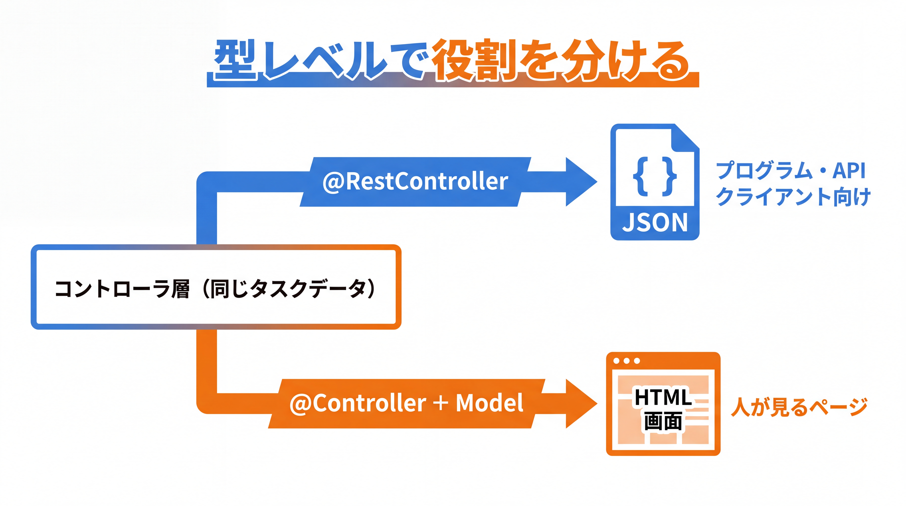
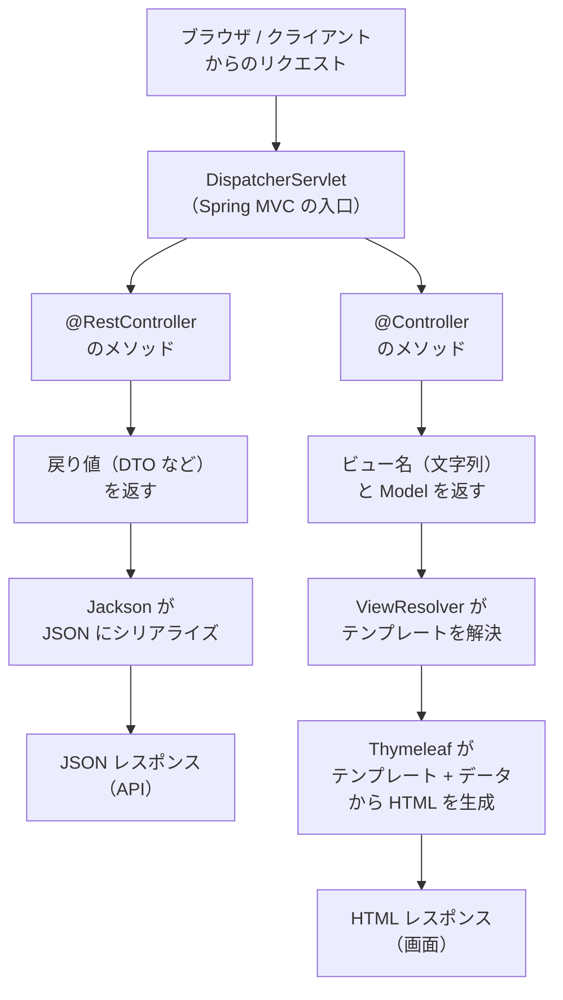

# 3-5-1 画面を返す Spring MVC

Chapter 3-5 では、ここまで JSON を返す REST API として組んできた Spring Boot に、もう一つの顔を加えます。**HTML 画面（サーバーサイドレンダリング）** を返す使い方です。同じタスクデータを、API では JSON として、画面では HTML として返す。その違いと共通点を、最小構成で押さえます。

| セクション | テーマ | 種類 |
|---|---|---|
| 3-5-1 画面を返す Spring MVC | `@Controller`・ビュー解決・`Model` でのデータ受け渡し・API と MVC の違い | 概念 |
| 3-5-2 Thymeleaf テンプレートの基本 | `th:text`・`th:each`・`th:if`・フラグメント・画面描画 | 概念 |

📖 **この Chapter の進め方**: まず本セクションで、`@Controller` が「ビュー名を返す」仕組みと、`Model` でデータをテンプレートへ渡す流れを押さえ、「JSON を返す API」と「HTML を返す MVC」の違いを掴みます。次に 3-5-2 で、渡されたデータを実際に画面へ描画するテンプレートエンジン Thymeleaf の書き方（変数展開・繰り返し・条件・フラグメント）を、Blade の経験を足がかりに学びます。

📝 **前提知識**: このセクションは「3-3-1 リクエストを受けて返す」の内容を前提としています。

## 🎯 このセクションで学ぶこと

- `@Controller` と `@RestController` の違いを理解し、`@Controller` のメソッドが戻り値の文字列を **ビュー名** として返すことを説明できる
- ビュー解決の仕組み（ビュー名 → テンプレート → HTML）と、`Model` でデータをテンプレートへ渡す流れを理解する
- 「JSON を返す API」と「HTML を返す MVC」の違いを、処理の流れの図で説明できる

本セクションでは、「Spring Boot ＝ REST API 専用」という誤解を解くところから始め、`@Controller` の役割、ビュー解決、`Model` でのデータ受け渡し、そして API と MVC の流れの対比へと進みます。

---

## 導入: 「Spring Boot は API 専用」ではない

Part 3 ではここまで、`@RestController` でリクエストを受け、DTO を JSON にして返す REST API を組んできました。この流れを通すうちに、「Spring Boot はバックエンドの API を作るためのもの」という像ができているかもしれません。半分は正しく、半分は誤解です。

Spring Boot は、JSON を返す API と同じくらい自然に、**HTML 画面そのもの** を返せます。サーバー側でデータを HTML に埋め込んで完成させ、ブラウザにページとして返す。これが **サーバーサイドレンダリング** です。あなたが Laravel で `return view('tasks.index', [...])` と書いてタスク一覧ページを返していた、まさにあの形です。そして業務系・SIer 案件では、フロントエンドフレームワークを使わず、この画面描画型の構成（Spring MVC + テンプレートエンジン）が今も数多く稼働しています。だから、API だけでなく「画面を返す Spring」にも備えておく価値があります。

本 Chapter で扱うのは、Part 5 の総合ハンズオンで作る `タスク一覧` の **読み取り専用画面** に直結する最小構成です。API を主役に保ちつつ、同じタスクデータを HTML でも返せることを掴むのがねらいです。

### 🧠 先輩エンジニアの思考プロセス

> Laravel 時代は、コントローラのメソッドの最後に `return view(...)` と書けば画面が返り、`return response()->json(...)` と書けば JSON が返りました。同じコントローラの中で、戻り値の書き方だけで「画面か、データか」を切り替えていたわけです。Java に移って Spring を触り始めたとき、最初に組んだのが REST API だったので、しばらく「Spring は JSON を返す道具」だと思い込んでいました。
>
> その思い込みが崩れたのは、画面ありきの業務システムの案件に入ったときです。フロントは別チーム、ではなく、サーバー側で HTML を組み立てて返す構成でした。調べてみると、Spring では `@RestController` と `@Controller` という別々のアノテーションで、JSON を返すか画面を返すかを宣言していました。Laravel が 1 つのコントローラで両方こなしていたところを、Spring は型レベルで役割を分けている。この違いさえ掴めば、画面側の実装は Blade の経験そのままで進められました。



---

## `@Controller` と `@RestController` の違い

Part 3 の Web 層（3-3-1）で使ってきた `@RestController` は、実は単独の特別な仕組みではありません。**`@RestController` は「`@Controller` に `@ResponseBody` を全メソッド分まとめて付けたもの」** です（Spring Web MVC リファレンス。https://docs.spring.io/spring-framework/reference/web/webmvc.html ）。この一文に、API と画面の違いがすべて詰まっています。

順を追って分解します。土台になるのは `@Controller` です。`@Controller` を付けたクラスのメソッドが `String` を返すと、Spring はその文字列を **ビュー名（論理ビュー名）** として解釈します。「この名前のテンプレートで画面を描いてください」という指示として扱うわけです。戻り値の文字列は、そのまま HTTP レスポンスの本文になるのではありません。

ここに `@ResponseBody` が加わると、振る舞いが反転します。`@ResponseBody` は「メソッドの戻り値を、ビュー名としてではなく、**レスポンス本文そのもの** として書き出す」ための指示です。オブジェクトを返せば Jackson が JSON にシリアライズし（3-3-2）、それがそのままボディになります。

```java
// TaskViewController.java（@Controller: 戻り値はビュー名）
@Controller
public class TaskViewController {

    @GetMapping("/tasks")
    public String list() {
        return "tasks/list";   // ビュー名。テンプレートを探して HTML にする
    }
}
```

```java
// TaskController.java（@RestController: 戻り値はレスポンス本文）
@RestController
@RequestMapping("/api/tasks")
public class TaskController {

    @GetMapping
    public List<TaskResponse> list() {
        return taskService.findAll().stream()
            .map(/* Task → TaskResponse へ変換 */)
            .toList();        // この List がそのまま JSON ボディになる
    }
}
```

同じ `String` を返しても、`@Controller` なら「`tasks/list` というビューを探せ」、`@RestController` なら「`tasks/list` という文字列をそのままボディに書け」という意味になります。🔑 つまり **`@RestController` は「戻り値を常に JSON 化（本文化）する `@Controller`」** だと捉えれば、両者は地続きです。

> 💡 `@Controller` でも個別に JSON を返せます: `@Controller` のメソッドに `@ResponseBody` を 1 つだけ付ければ、そのメソッドだけ JSON を返せます。`@RestController` は「クラスの全メソッドに `@ResponseBody` を付けた」ショートカットにすぎません。画面と API を 1 クラスに混ぜることは設計上おすすめしませんが、仕組みとしてはこのように連続しています。

💡 **Laravel との対応**: Laravel のコントローラは 1 つで、`return view('tasks.index', [...])` と書けば画面、`return TaskResource::collection($tasks)`（または `response()->json(...)`）と書けば JSON でした。Spring はこの「画面か、データか」をクラスのアノテーション（`@Controller` か `@RestController` か）で宣言します。画面を返すクラスが `@Controller`、JSON を返すクラスが `@RestController` です。

---

## ビュー解決: ビュー名からテンプレート、そして HTML へ

`@Controller` が返した `"tasks/list"` という文字列が、どうやって実際の HTML になるのでしょうか。間に立つのが **ビュー解決（View Resolution）** という仕組みです。流れはこうです。

1. コントローラが論理ビュー名（`"tasks/list"`）を返す
2. Spring MVC の中心（`DispatcherServlet`）がその名前を受け取り、**ViewResolver** に渡す
3. ViewResolver が名前を実際のテンプレートファイルに対応づける
4. テンプレートエンジン（本教材では Thymeleaf）がテンプレートとデータから HTML を生成し、レスポンスとして返す

ここで重要なのは、コントローラは「`tasks/list` という名前のビュー」としか言っていない点です。それが `templates/tasks/list.html` というファイルなのか、別のディレクトリの別形式なのかは、ViewResolver の設定が決めます。コントローラはファイルパスを直接知りません。この間接化のおかげで、テンプレートの置き場所や形式を変えても、コントローラのコードはそのままで済みます。

そして、その設定を肩代わりするのが **オートコンフィギュレーション** （3-1-1）です。`pom.xml` に `spring-boot-starter-thymeleaf` を追加するだけで、Spring Boot は「ビュー名は `src/main/resources/templates/` 配下の `.html` ファイルに対応づける」という規約を自動で構成します。`"tasks/list"` は `src/main/resources/templates/tasks/list.html` に解決されます。接頭辞（`templates/`）と接尾辞（`.html`）が規約で決まっているわけです。

```text
src/main/resources/
└── templates/
    └── tasks/
        └── list.html   ← ビュー名 "tasks/list" がここに解決される
```

つまり、画面描画に必要な「依存の追加」と「ビュー名 → ファイルの対応づけ」は、スターターを 1 行足すだけで整います。あなたは規約どおりの場所にテンプレートを置けばよいだけです。

> 💡 **Laravel との対応**: Laravel の `return view('tasks.index')` で、`tasks.index` が `resources/views/tasks/index.blade.php` に対応していたのと同じ発想です。ドット区切りがスラッシュ区切りに、`resources/views/` が `src/main/resources/templates/` に、`.blade.php` が `.html` に変わるだけです。「論理的なビュー名を、規約に従って実ファイルへ解決する」点はそっくりです。

⚠️ **注意**: `@Controller` のメソッドで `return "tasks/list"` と書いても、`spring-boot-starter-thymeleaf`（または他のテンプレートエンジンのスターター）が依存に無いと、ビュー名を解決できず画面は表示できません。画面を返すには、まずスターターの追加が前提です。本教材のスターター方針は 3-1-2 で整理したとおりです。

---

## `Model` でデータをテンプレートへ渡す

ビュー名だけでは、中身が空のテンプレートしか描けません。タスク一覧を表示するには、コントローラからテンプレートへ **データ** を渡す必要があります。その受け渡しを担うのが **`Model`** です。

`@Controller` のメソッドの引数に `Model` を宣言すると、Spring がそれを用意して渡してくれます（DI コンテナがメソッド引数を解決する仕組みの一例です。3-2-1）。`model.addAttribute("名前", 値)` で属性を載せると、その「名前」でテンプレート側から値を参照できるようになります。

```java
// TaskViewController.java
@Controller
public class TaskViewController {

    private final TaskService taskService;

    public TaskViewController(TaskService taskService) {  // コンストラクタインジェクション（3-2-1）
        this.taskService = taskService;
    }

    @GetMapping("/tasks")
    public String list(Model model) {
        List<Task> tasks = taskService.findAll();   // Service から一覧を取得（3-2-2）
        model.addAttribute("tasks", tasks);          // "tasks" という名前でテンプレートへ渡す
        return "tasks/list";                          // このビューを描画する
    }
}
```

ここで載せた属性名 `"tasks"` が、次のセクション（3-5-2）でテンプレートから `${tasks}` として参照する名前になります。つまり、コントローラの責務は「データを集めて `Model` に載せ、どのビューで描くかを返す」までです。実際に HTML を組み立てるのはテンプレート側の仕事で、ここで役割が分かれます。

💡 画面を返す `@Controller` でも、データの取得は Service 層に任せます（`taskService.findAll()`）。コントローラがデータを集めて画面に渡し、ビジネスロジックは Service が持つ、というレイヤードアーキテクチャ（3-2-2）の責務分担は、JSON を返す API でも HTML を返す画面でも変わりません。**変わるのは「最後に何を返すか」だけ** です。

💡 **Laravel との対応**: `return view('tasks.index', ['tasks' => $tasks])` の第 2 引数（ビューに渡す連想配列）が、Spring の `model.addAttribute("tasks", tasks)` に当たります。Blade 側で `$tasks` と書いて参照したのと同様に、テンプレート側では `${tasks}` で参照します（具体的な書き方は 3-5-2）。

---

## JSON を返す API と HTML を返す MVC

ここまでの話を、リクエストが来てからレスポンスが返るまでの流れで対比します。両者は途中まで同じで、最後の一区間だけが分かれます。



共通しているのは、どちらも `DispatcherServlet` を入口に、URL とメソッドに応じたコントローラのメソッドが呼ばれる点です。`@GetMapping`・`@PathVariable`・`@RequestParam` といったマッピングの道具（3-3-1）も、`@Controller` でそのまま使えます。リクエストを受けるところまでは API も画面も同じ Spring MVC の上に乗っています。

分かれるのは戻り値の扱いです。

- **`@RestController`**: 戻り値のオブジェクトを Jackson が JSON にシリアライズし、それがレスポンス本文になる。ビューは介在しない（3-3-2）
- **`@Controller`**: 戻り値の文字列をビュー名として ViewResolver が解決し、Thymeleaf がテンプレートと `Model` のデータから HTML を生成して返す

| 観点 | JSON を返す API | HTML を返す MVC |
|---|---|---|
| アノテーション | `@RestController` | `@Controller` |
| メソッドの戻り値 | DTO などのオブジェクト | ビュー名（`String`） |
| データの渡し方 | 戻り値そのもの | `Model` の属性 |
| 変換するもの | Jackson（→ JSON） | Thymeleaf（→ HTML） |
| 返るもの | JSON | HTML ページ |
| 主な利用者 | フロント / 別システム | ブラウザ（人が見る画面） |

🔑 同じ `TaskService.findAll()` が返したタスク一覧を、`TaskController` は `List<TaskResponse>` の JSON として、`TaskViewController` は `tasks/list.html` の HTML として返します。データ層・ロジック層は共通のまま、出口（Web 層の返し方）だけが違う。これが「Spring Boot は API も画面も返せる」の実体です。

💡 **Laravel との対応**: Laravel でも、同じ Eloquent クエリの結果を、API ルートでは API リソース（JSON）として、Web ルートでは Blade ビュー（HTML）として返せました。`routes/api.php` と `routes/web.php` で入口を分けていた感覚に近いものを、Spring は `@RestController` と `@Controller` というクラスの宣言で表現します。

---

## ✨ まとめ

- `@RestController` は「`@Controller` に `@ResponseBody` を全メソッド分付けたもの」。`@Controller` のメソッドが返す文字列は **ビュー名** として解釈され、`@RestController` では戻り値がそのままレスポンス本文（JSON）になる
- ビュー解決は「ビュー名 → ViewResolver → テンプレート → HTML」の流れ。`spring-boot-starter-thymeleaf` を追加すると、ビュー名は `src/main/resources/templates/` 配下の `.html` に規約で解決される（`"tasks/list"` → `templates/tasks/list.html`）
- `Model` の `addAttribute("tasks", ...)` でテンプレートへデータを渡す。属性名がテンプレート側の参照名になる。データ取得は Service に任せ、レイヤードの責務分担は API と変わらない
- API と MVC は `DispatcherServlet` まで共通で、最後の「戻り値の扱い」だけが分かれる。同じタスクデータを、API は JSON で、MVC は HTML で返す

---

次のセクションでは、`Model` で渡したデータを実際に画面へ描画するテンプレートエンジン Thymeleaf の基本を学びます。`th:text` と `${...}` による変数展開、`th:each` による繰り返しと `th:if` / `th:unless` による条件分岐、`th:href` と `@{...}` によるリンク、そして `th:fragment` と `th:replace` / `th:insert` によるフラグメント（共通レイアウトの括り出し）を、Blade の `{{ }}`・`@foreach`・`@if`・`@extends` の経験を足がかりに押さえます。
