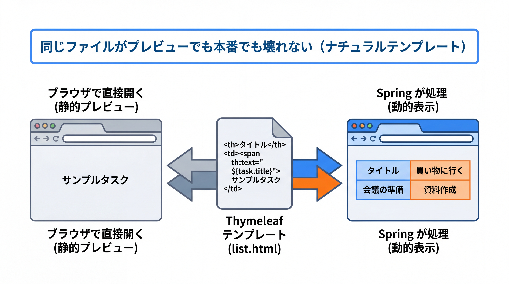

# 3-5-2 Thymeleaf テンプレートの基本

📝 **前提知識**: このセクションは「3-5-1 画面を返す Spring MVC」の内容を前提としています。

## 🎯 このセクションで学ぶこと

- `th:text` と `${...}` による変数展開を理解し、Thymeleaf がデフォルトで HTML エスケープすることを説明できる
- `th:each` による繰り返しと `th:if` / `th:unless` による条件分岐、`th:href` と `@{...}` によるリンクを書ける
- `th:fragment` と `th:replace` / `th:insert` で共通レイアウトを括り出せる

本セクションでは、Thymeleaf の「ナチュラルテンプレート」という考え方から始め、変数展開、繰り返しと条件、リンク、フラグメントへと進み、3-5-1 で `Model` に載せたタスク一覧を実際の HTML として描画します。

---

## 導入: Blade の代わりに何を使うのか

3-5-1 で、`@Controller` がビュー名を返し、`Model` でテンプレートへデータを渡すところまで掴みました。では、その「テンプレート」をどう書くのか。Laravel では Blade がその役割を担い、`{{ $task->title }}` や `@foreach` でデータを HTML に流し込んでいました。Spring Boot で標準的に使われるテンプレートエンジンが **Thymeleaf** です。

Thymeleaf には、Blade とは異なる際立った特徴があります。**ナチュラルテンプレート** という考え方です。Thymeleaf のテンプレートは、独自構文で HTML を「汚す」のではなく、HTML タグの **属性** として記述します。たとえば値の差し込みは `<td th:text="${task.title}">サンプル</td>` のように、`th:text` という属性で書きます。この `th:` 付き属性はブラウザにとって未知の属性なので無視され、テンプレートをそのままブラウザで開くと、タグの中身（`サンプル`）が静的なプレビューとして表示されます（Thymeleaf チュートリアル。https://www.thymeleaf.org/doc/tutorials/3.1/usingthymeleaf.html ）。Spring が処理すると、その中身が `${task.title}` の値に置き換わります。

```html
<!-- ブラウザで直接開くと「サンプルタスク」と表示され、
     Spring が処理すると task.title の値に置き換わる -->
<td th:text="${task.title}">サンプルタスク</td>
```

つまり、テンプレートが常に「壊れていない HTML」のままで、デザイナーがブラウザで確認しながら作業でき、開発者は同じファイルに動的な振る舞いを足せます。Blade の `{{ }}` がそのままブラウザに見えてしまうのとは対照的です。この発想を頭に置きつつ、具体的な書き方に入ります。

### 🧠 先輩エンジニアの思考プロセス

> Blade では、テンプレートを単体でブラウザに開いても `{{ $task->title }}` という文字列がそのまま表示されてしまい、見た目の確認は結局アプリを起動してからでした。私は HTML コーダーから上がってきた静的ファイルに、後から `@foreach` や `{{ }}` を埋め込む作業を何度もやりましたが、埋め込んだ瞬間にプレビューが壊れるのが地味に不便でした。
>
> Thymeleaf に移って、その不便さが消えました。`th:text` は HTML の属性なので、ブラウザは知らない属性として無視し、タグの中身がそのままプレビューになります。動的な部分を足してもファイルは正しい HTML のままで、コーダーが作った見た目を壊さずにデータを流し込めます。最初は「属性に式を書く」のが回りくどく感じましたが、静的プレビューが生き続ける安心感に、すぐ慣れました。



---

## 変数展開: `th:text` と `${...}`

最も基本となるのが、`Model` に載せた値をタグの中身として差し込む **変数展開** です。`th:text` 属性に `${...}`（変数式）を書きます。`${...}` の中では、3-5-1 で `model.addAttribute("tasks", ...)` と載せた属性名（`tasks`）や、そのプロパティ（`task.title`）を参照できます。

```html
<!-- src/main/resources/templates/tasks/list.html（抜粋） -->
<h1 th:text="${title}">タスク一覧</h1>
<p th:text="${task.title}">サンプルタスク</p>
```

`${task.title}` のようにドットでプロパティをたどると、Thymeleaf は内部で `task` の getter（`getTitle()`）を呼びます。Java のプロパティアクセスは getter 経由が基本なので（2-1-2）、`boolean` の `done` なら `${task.done}` が `isDone()` を呼びます。フィールド名でアクセスを書ける点は Blade の `$task->title` に近い感覚です。

🔑 Thymeleaf の重要な安全性として、`th:text` は **デフォルトで HTML をエスケープ** します。値に `<b>` のようなタグが含まれていても、`&lt;b&gt;` に変換して出力するので、ユーザー入力をそのまま埋め込んでも HTML が壊れたり差し込まれたりしません（XSS 対策）。意図的にタグとして解釈させたい（HTML をそのまま出したい）場合のみ、`th:utext`（unescaped text）を使います。`th:utext` は信頼できる値にだけ使うのが鉄則です。

```html
<!-- th:text: <b>注意</b> という入力 → 画面には「<b>注意</b>」という文字列がそのまま見える（安全） -->
<p th:text="${task.title}">サンプル</p>

<!-- th:utext: <b>注意</b> という入力 → 「注意」が太字でレンダリングされる（信頼できる値のみ） -->
<p th:utext="${task.title}">サンプル</p>
```

💡 **Laravel との対応**: Blade の `{{ $task->title }}` が `th:text="${task.title}"` に当たります。**エスケープがデフォルトで有効** な点も同じです。Blade で生 HTML を出すときに使った `{!! $html !!}` が、Thymeleaf の `th:utext` に相当します。「既定は安全、危険な出力は明示的に書く」という設計思想は両者で共通です。

---

## 繰り返しと条件: `th:each` と `th:if` / `th:unless`

タスク一覧のように、コレクションを表の行として繰り返し描くには **`th:each`** を使います。`th:each="task : ${tasks}"` と書くと、`tasks`（`Model` に載せたリスト）を 1 件ずつ取り出し、その要素を `task` という名前で、その要素を含むタグの中で参照できます。

```html
<!-- src/main/resources/templates/tasks/list.html（抜粋） -->
<table>
  <thead>
    <tr><th>タイトル</th><th>状態</th><th>期限</th></tr>
  </thead>
  <tbody>
    <tr th:each="task : ${tasks}">
      <td th:text="${task.title}">サンプルタスク</td>
      <td th:text="${task.done} ? '完了' : '未完了'">未完了</td>
      <td th:text="${task.dueDate}">2026-06-30</td>
    </tr>
  </tbody>
</table>
```

`th:each` を付けた `<tr>` が、タスクの件数だけ複製されます。各 `<td>` の `th:text` で、その行のタスク（`task`）のプロパティ（`title`・`done`・`dueDate`、3-5-1 で確認したフィールド）を差し込んでいます。状態の列では `${task.done} ? '完了' : '未完了'` という条件式（三項演算子）で `boolean` を日本語に変換しています。

繰り返しのインデックスや「最初／最後」を知りたいときは、ステータス変数を添えます。`th:each="task, stat : ${tasks}"` と書くと、`stat.index`（0 始まり）・`stat.count`（1 始まり）・`stat.first` / `stat.last`・`stat.odd` / `stat.even` などが使えます（変数名を省くと `taskStat` が自動で作られます）。

```html
<!-- 行番号（1 始まり）を表示する例 -->
<tr th:each="task, stat : ${tasks}">
  <td th:text="${stat.count}">1</td>
  <td th:text="${task.title}">サンプルタスク</td>
</tr>
```

条件によって要素を出し分けるには **`th:if`** と、その逆の **`th:unless`** を使います。条件が真のときだけタグを出力します。たとえば「タスクが 0 件のときだけメッセージを出す」「期限切れのときだけ印を付ける」といった分岐です。

```html
<!-- 一覧が空のときだけ表示 -->
<p th:if="${#lists.isEmpty(tasks)}">タスクはまだありません。</p>

<!-- 完了タスクにだけ印を付ける（done が true のとき表示） -->
<span th:if="${task.done}">✓ 完了</span>
```

`#lists.isEmpty(...)` は Thymeleaf がリスト操作のために用意しているユーティリティです（`#lists`・`#strings` など `#` で始まる組み込みオブジェクトがあります）。`th:if` は `boolean` だけでなく、**非ゼロの数値** （`0` は偽）や、`"false"` / `"off"` / `"no"` 以外の文字列も真として扱う点に注意します。

💡 **Laravel との対応**: Blade の `@foreach ($tasks as $task) ... @endforeach` が `th:each="task : ${tasks}"`、`@if (...)` が `th:if="..."`、`@unless` が `th:unless` に当たります。Blade の `$loop->iteration` や `$loop->first` に相当するのが、Thymeleaf のステータス変数 `stat.count` / `stat.first` です。Blade が独立したブロック構文だったのに対し、Thymeleaf は HTML タグの属性として書くのが大きな違いです。

---

## リンクと URL: `th:href` と `@{...}`

画面には他ページへのリンクが付きものです。Thymeleaf では `href` 属性を **`th:href`** で動的に組み立て、URL は **`@{...}`（リンク式）** で書きます。`@{...}` は、`/` で始まるパスにアプリのコンテキストパスを自動で付け、パラメータの URL エンコードも行ってくれます。

```html
<!-- 静的な href はプレビュー用、th:href が処理時に効く -->
<a href="/tasks/1" th:href="@{/tasks/{id}(id=${task.id})}">詳細</a>
```

`@{/tasks/{id}(id=${task.id})}` は、パス中の `{id}` を `task.id` の値で埋めて `/tasks/1` のような URL を生成します。クエリパラメータを付けたいときは `@{/tasks(done=${task.done})}` のように書くと `/tasks?done=true` になります。`th:href` 以外にも、`th:src`（画像）・`th:action`（フォーム送信先）など、属性名の前に `th:` を付けて動的化できます。

なお、本 Chapter で作る `タスク一覧` は **読み取り専用** の画面です。新規作成・編集のフォーム（`th:action` を使った `<form>` 送信）は扱いません。データの登録・更新は REST API（`POST /api/tasks` など、3-3-1）の役割であり、画面側は一覧の表示に絞ることで、API を主役に保ちます。リンクの書き方は、一覧から各タスクの詳細へ飛ぶ程度に押さえておけば十分です。

💡 **Laravel との対応**: Blade では `<a href="{{ url('/tasks/'.$task->id) }}">` や `{{ route('tasks.show', $task->id) }}` で URL を組み立てました。Thymeleaf の `@{/tasks/{id}(id=${task.id})}` がこれに当たります。コンテキストパスを自動で前置し、パラメータをエンコードしてくれる点も `url()` / `route()` と同じ発想です。

---

## フラグメントとレイアウト: `th:fragment` と `th:replace` / `th:insert`

複数のページで共通するヘッダーやフッターを毎回コピーするのは避けたいものです。Thymeleaf では、再利用したい HTML 片を **フラグメント** として切り出し、各ページから差し込めます。フラグメントの定義は **`th:fragment`**、差し込みは **`th:replace`** （または `th:insert`）で行います。

まず共通部品をフラグメントとして定義します。

```html
<!-- src/main/resources/templates/fragments/layout.html（抜粋） -->
<footer th:fragment="copyright">
  <p>&copy; 2026 タスク管理アプリ</p>
</footer>
```

これを別のテンプレートから差し込みます。差し込みの指定は `~{テンプレート名 :: フラグメント名}` の形（フラグメント式）で書きます。

```html
<!-- src/main/resources/templates/tasks/list.html（抜粋） -->
<div th:replace="~{fragments/layout :: copyright}"></div>
```

`th:replace` は **そのタグ自体をフラグメントで置き換えます**。上の例では `<div>` が消え、`<footer>...</footer>` だけが残ります。一方 **`th:insert`** は、**そのタグを残し、中にフラグメントを挿入します** （`<div><footer>...</footer></div>` になる）。外側のタグを残したいかどうかで使い分けます。多くの共通部品は外枠が不要なので `th:replace` がよく使われます。

```html
<!-- th:replace → <footer>...</footer>（div は消える） -->
<div th:replace="~{fragments/layout :: copyright}"></div>

<!-- th:insert → <div><footer>...</footer></div>（div は残る） -->
<div th:insert="~{fragments/layout :: copyright}"></div>
```

これで、ヘッダー・フッター・共通のナビゲーションを 1 か所で定義し、各画面から差し込んで再利用できます。共通レイアウトの括り出しは、画面が増えるほど効いてきます。

💡 **Laravel との対応**: Blade の `@extends('layouts.app')` + `@section` / `@yield` による「レイアウト継承」や、`@include('partials.footer')` による「部品の差し込み」に当たるのが、Thymeleaf の `th:fragment` + `th:replace` / `th:insert` です。Blade の `@include` が `th:insert` に近く、より柔軟なレイアウト構成には `th:fragment` を組み合わせます（さらに本格的なレイアウト継承が必要なら、追加ライブラリの Thymeleaf Layout Dialect もありますが、本教材の最小構成ではフラグメントの差し込みで十分です）。

---

## まとめて見る: タスク一覧テンプレート

ここまでの要素を組み合わせると、3-5-1 で `TaskViewController` が `model.addAttribute("tasks", ...)` で渡したタスク一覧を、次のように 1 枚の画面として描けます。

```html
<!-- src/main/resources/templates/tasks/list.html -->
<!DOCTYPE html>
<html xmlns:th="http://www.thymeleaf.org">
<head>
  <meta charset="UTF-8">
  <title>タスク一覧</title>
</head>
<body>
  <h1>タスク一覧</h1>

  <p th:if="${#lists.isEmpty(tasks)}">タスクはまだありません。</p>

  <table th:unless="${#lists.isEmpty(tasks)}">
    <thead>
      <tr><th>#</th><th>タイトル</th><th>状態</th><th>期限</th></tr>
    </thead>
    <tbody>
      <tr th:each="task, stat : ${tasks}">
        <td th:text="${stat.count}">1</td>
        <td th:text="${task.title}">サンプルタスク</td>
        <td th:text="${task.done} ? '完了' : '未完了'">未完了</td>
        <td th:text="${task.dueDate}">2026-06-30</td>
      </tr>
    </tbody>
  </table>

  <div th:replace="~{fragments/layout :: copyright}"></div>
</body>
</html>
```

`xmlns:th="http://www.thymeleaf.org"` は `th:` 属性を使うための名前空間宣言で、ナチュラルテンプレートとして成立させるためのお作法です。このファイルはブラウザで直接開いても「サンプルタスク」などのプレビューが見える正しい HTML であり、Spring が処理すると `tasks` の実データに置き換わって完成します。同じ `Task`（`title`・`done`・`dueDate`）を、`TaskController` は JSON で、このテンプレートは HTML の表で描く。データは同じ、出口だけが違う、という 3-5-1 の対比がここで具体になりました。

---

## ✨ まとめ

- `th:text="${...}"` で `Model` の値を差し込む。`th:text` は **デフォルトで HTML エスケープ** する（XSS 対策）。生 HTML を出すときだけ `th:utext` を使う
- `th:each="task : ${tasks}"` で繰り返し（`stat.count` / `stat.first` などのステータス変数も使える）、`th:if` / `th:unless` で条件分岐する
- `th:href="@{/tasks/{id}(id=${task.id})}"` でリンクを組み立てる。`@{...}` はコンテキストパス付与とパラメータエンコードを担う。本教材の画面は読み取り専用一覧に絞る
- `th:fragment` で共通部品を定義し、`th:replace`（タグごと置換）/ `th:insert`（タグを残して挿入）で差し込む。共通レイアウトを 1 か所に括り出せる

【Chapter 3-5 の振り返り】本章では、Spring Boot が JSON だけでなく **画面（HTML）も返せる** ことを学びました。3-5-1 で `@Controller` がビュー名を返し `Model` でデータを渡す仕組みと、「JSON を返す API」と「HTML を返す MVC」の違いを掴み、3-5-2 で Thymeleaf の変数展開・繰り返し・条件・フラグメントを Blade の経験を足がかりに押さえました。同じタスクデータ（`Task` の `title`・`done`・`dueDate`）を、`TaskController` は API として JSON で、`TaskViewController` + `tasks/list.html` は画面として HTML で返す。データ層・ロジック層は共通のまま出口だけが違う、という API 開発と画面描画型 MVC の違いを掴んだことで、「Spring Boot ＝ API 専用」という誤解を越えました。これは業務系・SIer 案件の画面描画型構成への備えになります。

【Part 3 の振り返り】Part 3 では、Spring Boot で **REST API の縦串** を体系的に組む力を身につけました。3-1（入門）で Spring Boot がスターターとオートコンフィギュレーションで何を自動化しているかを俯瞰し、3-2（DI コンテナとレイヤードアーキテクチャ）で「なぜ動くのか」を IoC / DI コンテナとして解き明かし、Controller / Service / Repository に責務を分ける設計を学びました。3-3（Web 層）でリクエストの受け取りから DTO・JSON・バリデーション・統一エラーハンドリングまで API の表側を通し、3-4（データアクセス層）でエンティティ・リレーション・リポジトリ・トランザクション・N+1 対策を、Eloquent の知識を足がかりに組めるようにしました。そして 3-5（サーバーサイドレンダリング）で画面描画まで触れました。Part 2 のインターフェースとポリモーフィズムが DI の理解を支え、その DI が縦串全体の土台になっています。Web 層からデータ層、そして画面まで、Spring Boot で API の縦串を一通り組めるようになりました。

---

次の Part 4 では、ここまで組んだ API の縦串に、実務に耐える品質（認証・テスト・運用）を備えます。最初の Chapter 4-1 では Spring Security に入り、その最初のセクション 4-1-1 で、リクエストが順に通る **フィルタチェーン** の仕組み、**認証** （誰なのか）と **認可** （何をしてよいか）の違い、それを設定する `SecurityFilterChain`、そして安全に保管するための **パスワードハッシュ** を学び、Spring Security が何を守っているのかを説明できるようになります。Laravel のミドルウェア・認証・ポリシーの経験が、その理解を支えます。
