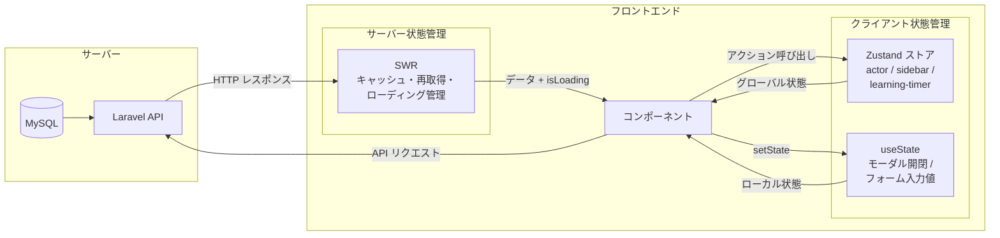
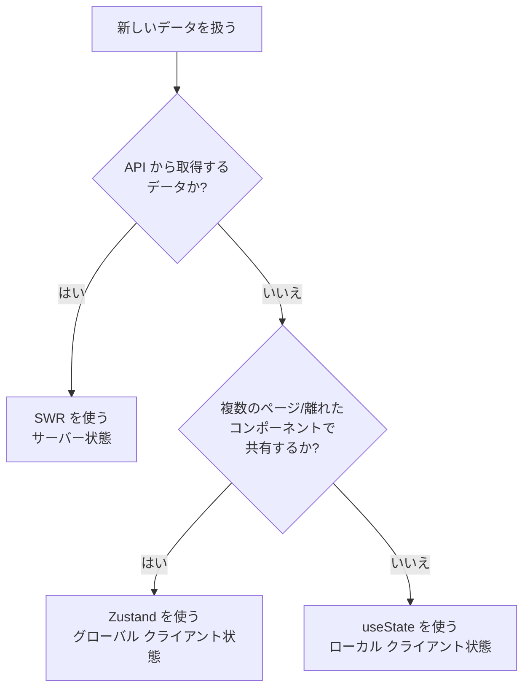

# 3-1-1 フロントエンドのデータ管理戦略

この Chapter「状態管理とデータフェッチ」は以下の 3 セクションで構成されます。

| セクション | テーマ | 種類 |
|---|---|---|
| 3-1-1 | フロントエンドのデータ管理戦略 | 概念 |
| 3-1-2 | Zustand によるグローバル状態管理 | 概念 |
| 3-1-3 | HTTP クライアントと SWR（フロントエンド・バックエンド繋ぎ込みの実装） | 概念 |

**Chapter ゴール**: フロントエンドにおけるデータの流れ（取得・保持・更新）の全体像を理解する

📖 まず本セクションでフロントエンドのデータを「種類」と「スコープ」の 2 軸で整理するメンタルモデルを学びます。次に Zustand によるグローバル状態管理の設計パターンを理解し、最後に HTTP クライアントと SWR によるサーバーデータの取得・キャッシュの仕組みを学びます。3 つのセクションを通して、LMS フロントエンドの「どのデータを、どの技術で、どこに保持するか」の全体像が見えるようになります。

## 🎯 このセクションで学ぶこと

- フロントエンドで管理するデータを **サーバー状態** と **クライアント状態** に分類できるようになる
- データのスコープを **グローバル状態** と **ローカル状態** に分類できるようになる
- 2 つの軸を組み合わせた 4 象限で LMS のデータ管理アーキテクチャの全体像を把握する

サーバー状態とクライアント状態の違いを理解し、それぞれに適した技術（SWR / Zustand / useState）の使い分けを学びます。

---

## 導入: SPA ではなぜ「データ管理」が課題になるのか

セクション 2-1-1 で学んだとおり、Laravel + Blade の構成では、サーバーがデータベースからデータを取得し、HTML に埋め込んでブラウザに返していました。ブラウザが表示する HTML にはすでにデータが含まれているため、フロントエンド側で「データをどう持つか」を考える必要がありませんでした。

```php
// Laravel のコントローラー: データ取得と HTML 生成が一体
public function index()
{
    $users = User::all();         // DB からデータ取得
    return view('users.index', compact('users'));  // HTML に埋め込んで返す
}
```

SPA + API アーキテクチャでは、この構造が根本的に変わります。フロントエンド（Next.js）とバックエンド（Laravel）が別のアプリケーションとして動作し、フロントエンドは API を通じてデータを取得します。つまり、フロントエンド側で以下のことを自分で管理しなければなりません。

- **いつ** API を呼ぶか（ページ表示時？ボタンクリック時？）
- **取得したデータをどこに保持するか**（コンポーネントの中？アプリ全体で共有？）
- **データが古くなったらどうするか**（再取得のタイミングは？キャッシュの有効期限は？）
- **画面の操作状態をどう持つか**（モーダルの開閉、サイドバーの状態、入力中のフォーム値）

これらの問題は Laravel + Blade では存在しなかったか、サーバー側で自然に解決されていたものです。SPA ではこれらすべてをフロントエンドで設計する必要があり、これが「データ管理」が課題になる理由です。

### 🧠 先輩エンジニアはこう考える

> LMS の開発で最初に戸惑ったのが、まさにこの「データの置き場所」の問題でした。Laravel なら Controller でデータを取って View に渡せば終わりですが、フロントエンドではそうはいきません。受講生の情報を表示するページで API からデータを取得したあと、別のタブに切り替えてまた戻ってきたとき、もう一度 API を呼ぶのか？ それとも前に取得したデータを再利用するのか？ さらに、サイドバーの開閉状態は全ページで共有したいけれど、モーダルの開閉状態はそのコンポーネントだけで持ちたい。こうした「データの性質に応じた管理戦略」を整理できると、フロントエンドの設計が一気に見通しよくなります。

---

## サーバー状態 vs クライアント状態

フロントエンドが扱うデータは、大きく **サーバー状態**（Server State）と **クライアント状態**（Client State）の 2 種類に分けられます。この分類がデータ管理の最も重要な出発点です。

### サーバー状態とは

**サーバー状態** は、バックエンドのデータベースに保存されていて、API を通じて取得するデータです。

- 受講生の一覧、プロフィール情報
- 学習進捗、タイムライン
- 面談スケジュール、チャットメッセージ
- 試験の問題や回答

サーバー状態には以下の特性があります。

| 特性 | 説明 |
|---|---|
| **非同期** | API 通信を伴うため、取得に時間がかかる |
| **共有所有** | 自分だけでなく他のユーザーも同じデータを変更できる |
| **経時劣化** | 時間が経つとフロントエンドが持つデータとサーバーの実際のデータがずれる可能性がある |
| **信頼の源泉がサーバー側** | 正しいデータは常にサーバーにあり、フロントエンドのデータはそのコピーに過ぎない |

Laravel 開発の経験に照らすと、Eloquent で取得するデータはすべてサーバー状態に該当します。Blade テンプレートではリクエストのたびにサーバーから最新データを取得して HTML を生成するため、「データが古くなる」問題は起きにくい構造でした。SPA ではページ遷移で HTML 全体を再読み込みしないため、この問題に正面から向き合う必要があります。

### クライアント状態とは

**クライアント状態** は、サーバーには存在せず、フロントエンドの中だけで完結するデータです。

- モーダルやドロワーの開閉状態
- サイドバーの固定/解除の設定
- フォームの入力途中の値
- 学習タイマーの動作状態（計測中/停止中）
- ドラッグ中の UI パネルの位置やサイズ

クライアント状態の特性はサーバー状態の正反対です。

| 特性 | 説明 |
|---|---|
| **同期的** | API 通信なしで即座に読み書きできる |
| **単一所有** | そのブラウザ（またはコンポーネント）だけが所有する |
| **常に最新** | 自分で設定した値がそのまま有効。外部から変更されることはない |
| **信頼の源泉がフロントエンド側** | フロントエンドが唯一の正しいデータ |

### なぜこの区別が重要なのか

サーバー状態とクライアント状態では、管理に必要な機能が全く異なります。

サーバー状態を管理するには、**非同期通信**、**キャッシュ**、**再取得**、**ローディング/エラー状態の表示** といった仕組みが必要です。一方、クライアント状態はシンプルに「値を読み書きする」だけで済みます。

この違いを無視して、すべてのデータを同じ仕組みで管理しようとすると、コードが不必要に複雑になります。たとえば、モーダルの開閉（クライアント状態）にキャッシュの仕組みは不要ですし、API から取得した受講生一覧（サーバー状態）を単純な `useState` だけで管理すると、再取得やキャッシュ無効化のロジックを全部自分で書くことになります。

💡 **TIP**: 「このデータは API から来るのか、それともフロントエンドの中で生まれるのか」を最初に問いかける習慣をつけましょう。この一問が、適切な技術選定の出発点になります。

---

## グローバル状態 vs ローカル状態

データの種類（サーバー/クライアント）に加えて、もう 1 つの軸が **スコープ**（データの共有範囲）です。

### ローカル状態

**ローカル状態** は、1 つのコンポーネント（またはその子コンポーネント）の中だけで使われるデータです。React の `useState` で管理するのが基本です。

```tsx
// モーダルの開閉はこのコンポーネントだけで使う → ローカル状態
const [isOpen, setIsOpen] = useState(false)
```

LMS の例を見てみましょう。`StatusChangeModal` コンポーネントでは、フォームの入力値やバリデーション状態を `useState` や `useForm` で管理しています。これらの状態はモーダルが閉じられれば不要になり、他のコンポーネントからアクセスする必要もありません。

ローカル状態の判断基準はシンプルです。

- そのコンポーネントが表示されている間だけ必要なデータか？
- 他のコンポーネントからアクセスする必要がないか？

両方とも「はい」なら、ローカル状態で十分です。

### グローバル状態

**グローバル状態** は、アプリケーション全体（または広い範囲のコンポーネント）で共有されるデータです。

```tsx
// ログインユーザー情報はどのページからもアクセスしたい → グローバル状態
const actor = useActorStore((state) => state.actor)
```

グローバル状態が必要になる典型的なケースは以下の通りです。

- **認証情報**: ログインユーザーの情報は、ヘッダー、サイドバー、各ページなどあらゆる場所で参照される
- **UI レイアウト設定**: サイドバーの固定/解除はすべてのページに影響する
- **進行中のプロセス**: 学習タイマーはページを移動しても動き続ける必要がある

セクション 2-3-2 で学んだ `useState` はローカル状態に適していますが、グローバル状態には力不足です。親から子へ Props で受け渡す「バケツリレー」が深くなりすぎるためです。React の `useContext` もグローバル状態に使えますが、再レンダリングの範囲が広くなりやすいという課題があります。そこで LMS では、グローバルなクライアント状態の管理に **Zustand** を採用しています。

💡 **TIP**: 「ローカルで始めて、必要になったらグローバルに昇格させる」が鉄則です。最初からグローバルにすると、どこからでもデータを変更できてしまい、バグの原因を追跡しにくくなります。

---

## LMS のデータ管理マップ

ここまで学んだ 2 つの軸（サーバー/クライアント、グローバル/ローカル）を組み合わせると、フロントエンドのデータを 4 つの象限に整理できます。LMS の実例と、それぞれに対応する技術をマッピングしてみましょう。

### 4 象限マップ

| | グローバル（アプリ全体で共有） | ローカル（コンポーネント内で完結） |
|---|---|---|
| **サーバー状態**（API から取得） | SWR で取得・キャッシュ管理。受講生一覧、学習進捗、面談スケジュールなど | SWR で取得するが特定コンポーネントでのみ使用。ユーザータイムライン、個別の試験結果など |
| **クライアント状態**（フロントエンドで生成） | Zustand でストア管理。認証情報（actor-store）、サイドバー設定（sidebar-store）、学習タイマー（learning-timer-store）| useState で管理。モーダル開閉、フォーム入力値、ドロップダウンの選択状態など |

📝 **ノート**: サーバー状態の「グローバル/ローカル」は、データの性質ではなく「アプリ内で共有する必要があるか」で決まります。SWR はキャッシュキーが同じであればどのコンポーネントから呼んでもキャッシュを共有するため、技術的にはグローバルに近い動作をします。ここでの区別は「複数の離れたコンポーネントから同じデータを参照するか」という設計上の意図に基づいています。

### LMS のデータの流れ

以下の図は、LMS フロントエンドにおけるデータの流れを示しています。左側がデータの発生源、右側がデータを使うコンポーネントです。



この図で重要なのは、データの種類ごとに **管理の仕組み** が分かれている点です。

- **サーバー状態**: API から SWR を通じて取得され、キャッシュと再取得の仕組みが自動的に機能する
- **グローバルなクライアント状態**: Zustand のストアに保持され、どのコンポーネントからも `useXxxStore` フックでアクセスできる
- **ローカルなクライアント状態**: `useState` でコンポーネント内に閉じて管理される

### 各技術の役割

3 つの技術がそれぞれ異なる責務を担っています。

**SWR**（サーバー状態の管理）

```tsx
// frontend/src/features/v2/userTimeline/hooks/useFetchUserTimeline.ts
export default function useFetchUserTimeline(
  workspaceId: string,
  userId: string,
  swrOptions?: SWRConfiguration,
) {
  const fetcher = () => fetchUserTimelineByUserId({ pathParams: { workspaceId, userId } })
  return useSWR(
    [`/api/workspaces/${workspaceId}/user/${userId}/user-timeline`],
    fetcher,
    swrOptions,
  )
}
```

SWR は API からデータを取得し、**キャッシュ**、**再取得**、**ローディング状態の管理**、**エラーハンドリング** を自動で行います。コンポーネントは `useSWR` フックを呼ぶだけで、データ取得の複雑さから解放されます。「SWR」は「stale-while-revalidate」の略で、「古いキャッシュを表示しつつ裏で最新データを取得する」という HTTP キャッシュ戦略に由来しています。

**Zustand**（グローバルなクライアント状態の管理）

```typescript
// frontend/src/store/v2/sidebar-store.ts
export const useSidebarStore = create<SidebarStore>()(
  persist(
    (set) => ({
      isPinned: false,
      togglePinned: () => set((state) => ({ isPinned: !state.isPinned })),
      setPinned: (pinned) => set({ isPinned: pinned }),
    }),
    {
      name: 'sidebar-store',
    },
  ),
)
```

Zustand はグローバルなクライアント状態を管理するための軽量なライブラリです。LMS ではサイドバーの固定状態、認証情報、学習タイマーの状態など、ページ遷移を跨いで保持すべきクライアント状態を Zustand で管理しています。`persist` ミドルウェアにより、ブラウザをリロードしても状態が `localStorage` に保持されます。

**useState**（ローカルなクライアント状態の管理）

```tsx
// コンポーネント内でのみ使うローカル状態
const [isOpen, setIsOpen] = useState(false)
const [selectedTab, setSelectedTab] = useState('overview')
```

React 標準の `useState` は、そのコンポーネントの中だけで完結する状態に使います。モーダルの開閉、フォーム入力中の値、ドロップダウンの選択状態など、他のコンポーネントと共有する必要のないデータがこれに該当します。

### 技術選定のフローチャート

新しいデータを扱う場面に出会ったとき、以下のフローで適切な技術を選べます。



⚠️ **注意**: 実際の開発では「API のレスポンスを加工してグローバルに保持したい」など、複数の象限にまたがるケースもあります。たとえば LMS の `actor-store` は、API から取得した認証情報を Zustand で永続化しています。これは「サーバーから取得したデータを、クライアント状態として保持する」パターンです。こうした境界ケースについては、セクション 3-1-2 と 3-1-3 で具体的に扱います。

---

## ✨ まとめ

- フロントエンドのデータは **サーバー状態**（API から取得、非同期、経時劣化する）と **クライアント状態**（フロントエンドで生成、同期的、自分だけが所有する）に分類できる
- データのスコープは **グローバル状態**（アプリ全体で共有）と **ローカル状態**（コンポーネント内で完結）に分類できる
- LMS では、サーバー状態を **SWR** で、グローバルなクライアント状態を **Zustand** で、ローカルなクライアント状態を **useState** で管理している
- 「API から来るか？」「複数の場所で共有するか？」の 2 つの問いで、適切な技術を選定できる

---

次のセクションでは、Zustand によるグローバル状態管理を深掘りし、ストア設計における State と Action の分離パターン、persist ミドルウェアによる状態の永続化、そして SSR ハイドレーション問題の解決パターンを学びます。
