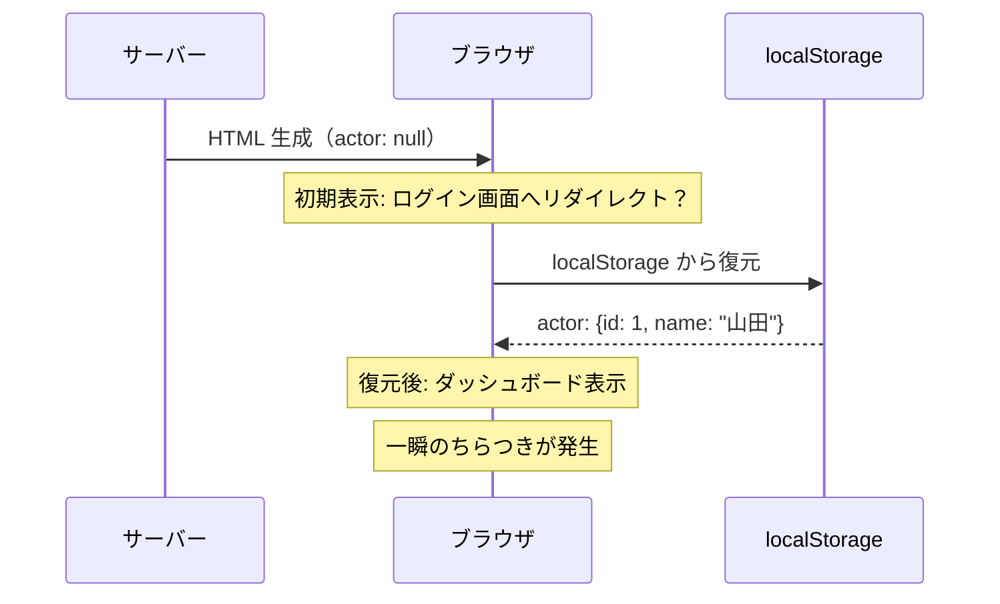

# 3-1-2 Zustand によるグローバル状態管理

📝 **前提知識**: このセクションはセクション 3-1-1 フロントエンドのデータ管理戦略の内容を前提としています。

## 🎯 このセクションで学ぶこと

- Zustand のストア設計パターン（State と Action の型分離）を理解する
- persist ミドルウェアによる localStorage 永続化の仕組みを理解する
- SSR ハイドレーション問題とその解決パターン（`useActorHydrated` フック）を理解する
- LMS で使われている 3 つのストアの役割と設計を把握する

React Context の課題を出発点に、Zustand がどのような設計思想でグローバル状態管理を実現するかを学び、LMS の実コードで設計パターンを確認していきます。

---

## 導入: React Context だけでは何が辛いのか

セクション 3-1-1 で、クライアント状態を管理する手段として Zustand を紹介しました。しかし、React にはもともと **Context API** というグローバル状態の共有メカニズムがあります。なぜわざわざ外部ライブラリを使うのでしょうか。

React Context は、プロバイダーで囲んだコンポーネントツリー全体に値を渡す仕組みです。小規模なデータ（テーマ設定、ロケールなど）には十分ですが、状態管理の中心として使うと 3 つの課題にぶつかります。

**1. ボイラープレートの多さ**

Context で状態を管理するには、Context の作成、プロバイダーコンポーネントの定義、カスタムフックの作成という 3 つの手順が必要です。状態の種類ごとにこれを繰り返すと、コード量が急速に膨らみます。

**2. 再レンダリングの範囲が広すぎる**

Context の値が変わると、その Context を購読しているすべてのコンポーネントが再レンダリングされます。たとえば、ユーザー情報とサイドバーの開閉状態を同じ Context に入れた場合、サイドバーを開閉するだけで、ユーザー情報しか使っていないコンポーネントまで再レンダリングされます。

**3. ミドルウェアの不在**

「状態を localStorage に自動保存したい」「状態の変更をログに記録したい」といった横断的な処理を、Context だけで実現する標準的な方法がありません。

Zustand は、これら 3 つの課題をすべて解決するために設計されたライブラリです。

### 🧠 先輩エンジニアはこう考える

> LMS の開発初期には Context ベースの状態管理も検討しましたが、管理する状態が増えるにつれてプロバイダーのネストが深くなり、見通しが悪くなっていきました。Zustand に移行してからは、ストアをファイル単位で分割できるので、状態の追加が気軽にできます。特に persist ミドルウェアは、ログイン状態やサイドバーの開閉をブラウザリロード後も維持するのに欠かせません。Context でこれを自前実装するとかなりの手間です。

---

## Zustand の基本モデル

Zustand（ドイツ語で「状態」の意味）は、React のグローバル状態管理ライブラリです。基本的なメンタルモデルはシンプルで、`create()` 関数でストアを作り、そのストアをフックとして使うだけです。

### ストアの作成

最もシンプルなストアは次のようになります。

```typescript
import { create } from 'zustand'

type CounterStore = {
  count: number
  increment: () => void
}

const useCounterStore = create<CounterStore>((set) => ({
  count: 0,
  increment: () => set((state) => ({ count: state.count + 1 })),
}))
```

`create()` に渡す関数は `set` を受け取ります。`set` はストアの状態を更新する関数で、React の `useState` における `setState` に相当します。戻り値は初期状態とアクション（状態を変更する関数）を含むオブジェクトです。

🔑 **ポイント**: `create()` の戻り値はそのまま React フックになります。プロバイダーで囲む必要はありません。これが Context との最大の違いです。

### フックとしての利用

コンポーネントでストアを使うときは、通常のフックと同じように呼び出します。

```tsx
function Counter() {
  const count = useCounterStore((state) => state.count)
  const increment = useCounterStore((state) => state.increment)

  return <button onClick={increment}>{count}</button>
}
```

### セレクターによる再レンダリング制御

上のコードで `(state) => state.count` の部分を **セレクター** と呼びます。セレクターは、ストアの状態の中から必要な部分だけを取り出す関数です。

Zustand は、セレクターの戻り値が変わったコンポーネントだけを再レンダリングします。つまり、`state.count` を購読しているコンポーネントは、`state.count` が変わったときだけ再レンダリングされ、他のストアの値が変わっても影響を受けません。

これが Context の「値が変わると全購読者が再レンダリング」という問題を解決する仕組みです。

```tsx
// Good: count が変わったときだけ再レンダリング
const count = useCounterStore((state) => state.count)

// 全プロパティを取得する場合（小さなストアでは実用的）
const { count, increment } = useCounterStore((state) => state)
```

⚠️ **注意**: セレクターなしで `useCounterStore()` と呼ぶと、ストア内のどの値が変わっても再レンダリングが発生します。意図的に全プロパティを取得する場合は `(state) => state` を明示するのがよいでしょう。

---

## State/Action 分離パターン

Zustand のストアには「状態（State）」と「状態を変更する操作（Action）」の両方が含まれます。小さなストアではこれらを 1 つの型にまとめても問題ありませんが、LMS では **State と Action の型を分離する** パターンを採用しています。

### LMS の actor-store に見る設計

LMS のログインユーザー情報を管理する `actor-store.ts` を見てみましょう。

```typescript
// frontend/src/store/v2/actor-store.ts

// データの「形」を定義する型
export type ActorState = {
  actor: Actor | null
  actorType: ActorType | null
  isManualLogout: boolean
}

// データを「操作する関数」を定義する型
export type ActorAction = {
  setActor: (actor: Actor | null) => void
  setActorType: (actorType: ActorType | null) => void
  setManualLogout: () => void
  clearManualLogout: () => void
}

// ストアの型は State と Action の交差型
export type ActorStore = ActorState & ActorAction
```

`ActorState` はストアが保持するデータの形を定義し、`ActorAction` はそのデータに対する操作を定義します。ストア全体の型 `ActorStore` は、これら 2 つの **交差型**（`&`）で表現されます。

💡 **なぜ分離するのか**: State と Action を分けることで、「このストアがどんなデータを持つか」と「そのデータにどんな操作ができるか」が型定義を見るだけで一目でわかります。ストアが大きくなっても見通しがよく、変更の影響範囲を把握しやすくなります。

### 初期状態の切り出し

LMS では、初期状態を `defaultInitState` として別に定義し、スプレッド構文でストアに展開しています。

```typescript
// frontend/src/store/v2/actor-store.ts

export const defaultInitState: ActorState = {
  actor: null,
  actorType: null,
  isManualLogout: false,
}

export const useActorStore = create<ActorStore>()(
  persist(
    (set) => ({
      ...defaultInitState,
      setActor: (actor: Actor | null) => set({ actor }),
      setActorType: (actorType: ActorType | null) => set({ actorType }),
      setManualLogout: () => set({ isManualLogout: true }),
      clearManualLogout: () => set({ isManualLogout: false }),
    }),
    {
      name: 'actor-store',
    },
  ),
)
```

`defaultInitState` を切り出す利点は 2 つあります。テスト時にストアを初期状態にリセットしやすいことと、初期値の定義が Action の実装と混ざらないことです。

### Actor 型の設計

`Actor` 型は、API レスポンスの型定義から派生しています。

```typescript
// frontend/src/type/v2/index.ts

export type Actor =
  | FetchMeAsUserHttpDocument['response']['data']
  | FetchCurrentEmployeeAsEmployeeHttpDocument['response']['data']

export type ActorType = ACCOUNT_TYPE
```

`Actor` は **ユニオン型** で、受講生（User）のレスポンスデータか、社員（Employee）のレスポンスデータのどちらかです。`ActorType` は `'user'` または `'employee'` を表す文字列リテラル型です。このように、API レスポンスの型をそのままストアの型として再利用することで、API から取得したデータをそのままストアに格納できます。

---

## persist ミドルウェア

ブラウザをリロードすると、JavaScript のメモリ上にある状態はすべて消えます。ログインユーザーの情報やサイドバーの開閉状態を毎回リセットするのでは、ユーザー体験が損なわれます。

Zustand の **persist ミドルウェア** は、ストアの状態を localStorage に自動で保存・復元する仕組みです。

```typescript
import { create } from 'zustand'
import { persist } from 'zustand/middleware'

export const useActorStore = create<ActorStore>()(
  persist(
    (set) => ({
      // ...ストアの定義
    }),
    {
      name: 'actor-store', // localStorage のキー名
    },
  ),
)
```

📝 **ミドルウェア** とは、ストアの作成関数をラップして追加の機能を差し込む仕組みです。Laravel のミドルウェアが HTTP リクエスト/レスポンスの前後に処理を挟むのと似た考え方です。`persist` は `create()` の引数をラップし、状態が変わるたびに localStorage への保存処理を自動で行います。

persist ミドルウェアに必要な設定は `name`（localStorage のキー名）だけです。状態が更新されるたびに、JSON にシリアライズされて localStorage に保存されます。ページをリロードすると、localStorage から状態が復元（ハイドレーション）されます。

### LMS のストアと永続化キー

LMS の 3 つのストアは、すべて persist ミドルウェアを使っています。

```typescript
// frontend/src/store/v2/sidebar-store.ts

type SidebarStore = {
  isPinned: boolean
  togglePinned: () => void
  setPinned: (pinned: boolean) => void
}

export const useSidebarStore = create<SidebarStore>()(
  persist(
    (set) => ({
      isPinned: false,
      togglePinned: () => set((state) => ({ isPinned: !state.isPinned })),
      setPinned: (pinned) => set({ isPinned: pinned }),
    }),
    {
      name: 'sidebar-store',
    },
  ),
)
```

sidebar-store は State と Action を 1 つの型にまとめています。プロパティが `isPinned` の 1 つだけなので、分離するメリットが薄いためです。このように、ストアの規模に応じて型設計の粒度を判断するのが実践的なアプローチです。

---

## SSR ハイドレーション問題と解決

persist ミドルウェアは便利ですが、Next.js のような SSR（サーバーサイドレンダリング）フレームワークと組み合わせると、1 つ厄介な問題が発生します。

### 問題: サーバーとクライアントの不一致

Next.js はまずサーバー側で HTML を生成します。サーバーには localStorage がないため、ストアの状態は常に初期値（`actor: null` 等）で HTML が作られます。

その後、ブラウザ側で JavaScript が実行され、localStorage から状態が復元されます。この復元プロセスを **ハイドレーション** と呼びます。

問題は、サーバーで生成された HTML（初期値）とクライアントで復元された状態が異なる場合に、React がエラーを出したり、意図しない UI が一瞬表示されたりすることです。



たとえば、ログイン済みユーザーがダッシュボードにアクセスしたとき、サーバーは `actor: null`（未ログイン）の状態で HTML を生成します。そのため、ハイドレーション完了前に「ログインしていない」と判断してログインページにリダイレクトしてしまう可能性があります。

### 解決: useActorHydrated フック

LMS では、この問題を `useActorHydrated` フックで解決しています。

```typescript
// frontend/src/store/v2/actor-store.ts

export function useActorHydrated() {
  const [hydrated, setHydrated] = useState(false)

  useEffect(() => {
    // すでに復元済みなら即座に true
    if (useActorStore.persist.hasHydrated()) {
      setHydrated(true)
      return
    }

    // まだ復元中なら、完了時に true にするリスナーを登録
    const unsub = useActorStore.persist.onFinishHydration(() => {
      setHydrated(true)
    })
    return unsub
  }, [])

  return hydrated
}
```

このフックは以下のように動作します。

1. 初期値は `false`（まだ復元されていない）
2. `useEffect` 内で、すでにハイドレーション済みかどうかを `hasHydrated()` で確認
3. 未完了なら、`onFinishHydration` でコールバックを登録して完了を待つ
4. 完了したら `hydrated` を `true` に更新

💡 `useEffect` はブラウザ側でのみ実行されるため、サーバーレンダリング時には `hydrated` は常に `false` のままです。これにより、サーバー側で localStorage に依存する処理を安全に回避できます。

### レイアウトでの認証ガードパターン

`useActorHydrated` の実際の使われ方を、LMS のユーザー向けレイアウトで確認しましょう。

```tsx
// frontend/src/app/v2/user/[workspaceId]/(main)/layout.tsx

export default function Layout({ children }: { children: React.ReactNode }) {
  const router = useRouter()
  const { actor, actorType, isManualLogout, clearManualLogout } = useActorStore((state) => state)

  // ストアの復元完了を検知
  const isHydrated = useActorHydrated()

  useEffect(() => {
    // 復元が完了するまでは何もしない
    if (!isHydrated) return

    // 復元完了後にログイン状態を判定
    if (!actor || actorType !== ACCOUNT_TYPE.USER) {
      if (isManualLogout) {
        clearManualLogout()
        router.push('/v2/user/login')
      } else {
        router.push(buildLoginUrlWithCurrentPath('/v2/user/login'))
      }
    }
  }, [isHydrated, actor, actorType, router])

  // ストア復元中、または認証されていない場合は何も表示しない
  if (!isHydrated || !actor || actorType !== ACCOUNT_TYPE.USER) {
    return null
  }

  return (
    <UserLayout
      actor={actor}
      // ...その他の props
    >
      {children}
    </UserLayout>
  )
}
```

このコードの流れを整理します。

1. **`!isHydrated` の間は `return null`**: ストアの復元が完了するまで、画面には何も表示しません。これにより、未ログインと誤判定してリダイレクトしてしまう問題を防ぎます
2. **復元完了後にログイン判定**: `isHydrated` が `true` になったら、`actor` と `actorType` を確認して認証状態を判定します
3. **手動ログアウトの区別**: `isManualLogout` フラグにより、ユーザーが意図的にログアウトした場合と、セッション切れの場合でリダイレクト先の URL を切り替えています。手動ログアウトなら単純にログインページへ、そうでなければ現在のパスを保持した URL へリダイレクトします

🔑 **ガードパターンの構造**: `useEffect` で副作用（リダイレクト）を処理し、レンダリング部分の `if` 文で表示を制御する。この 2 段構えのパターンは、認証が必要なページで広く使われる設計です。

### ハイドレーションが必要なストアとそうでないストア

LMS の 3 つのストアのうち、ハイドレーションのガードが必要なのは **actor-store だけ** です。なぜでしょうか。

sidebar-store と learning-timer-store は、ハイドレーション前に初期値が表示されても大きな問題がありません。サイドバーが一瞬閉じた状態で表示されるだけで、すぐに localStorage の値で上書きされます。

一方、actor-store はハイドレーション前の初期値（`actor: null`）が「未ログイン」を意味するため、認証判定に直結します。復元を待たずに判定してしまうと、ログイン済みユーザーがログインページにリダイレクトされるという深刻な問題が発生します。

---

## LMS の 3 ストア一覧

LMS のフロントエンドで使われている Zustand ストアを整理します。すべて `frontend/src/store/v2/` ディレクトリに配置されています。

| ストア | ファイル | 役割 | 永続化キー | State/Action 分離 | ハイドレーションガード |
|---|---|---|---|---|---|
| actor-store | `actor-store.ts` | ログインユーザー情報、アカウント種別、手動ログアウトフラグの管理 | `actor-store` | あり | あり（`useActorHydrated`） |
| sidebar-store | `sidebar-store.ts` | サイドバーのピン留め状態の管理 | `sidebar-store` | なし（単一型） | なし |
| learning-timer-store | `learning-timer-store.ts` | 学習タイマーの ID・ステータス・開閉状態の管理 | `learning-timer-store-v2` | あり | なし |

いくつかのポイントを補足します。

**永続化キー** は localStorage のキーです。ブラウザの開発者ツール（Application タブ > Local Storage）で実際の値を確認できます。learning-timer-store のキーが `learning-timer-store-v2` となっているのは、ストアの構造を変更した際にバージョンを上げたためです。既存の古い形式のデータとの衝突を避ける実践的なテクニックです。

**State/Action 分離** は、ストアの規模に応じた判断です。sidebar-store はプロパティが 1 つだけなので分離していませんが、actor-store と learning-timer-store は複数のプロパティを持つため分離しています。

**ハイドレーションガード** は、初期値のまま処理を進めると問題が起きるストアだけに適用します。actor-store は認証判定に使われるため必須ですが、sidebar-store と learning-timer-store は一瞬の表示ずれが許容できるためガード不要です。

### learning-timer-store の設計

learning-timer-store は actor-store と同じ State/Action 分離パターンを踏襲しています。

```typescript
// frontend/src/store/v2/learning-timer-store.ts

export type LearningTimerState = {
  timerId: string
  timerStatus: TimerStatus
  isTimerOpen: boolean
}

export type LearningTimerAction = {
  setTimerId: (timerId: string) => void
  setTimerStatus: (status: TimerStatus) => void
  setTimerOpen: (isOpen: boolean) => void
  openTimer: () => void
  closeTimer: () => void
}

export const useLearningTimerStore = create<LearningTimerStore>()(
  persist(
    (set) => ({
      ...defaultInitState,
      setTimerId: (timerId: string) => set({ timerId }),
      setTimerStatus: (status: TimerStatus) => set({ timerStatus: status }),
      setTimerOpen: (isOpen: boolean) => set({ isTimerOpen: isOpen }),
      openTimer: () => set({ isTimerOpen: true }),
      closeTimer: () => set({ isTimerOpen: false }),
    }),
    {
      name: 'learning-timer-store-v2',
    },
  ),
)
```

`openTimer` と `closeTimer` は `setTimerOpen(true)` / `setTimerOpen(false)` のショートカットです。呼び出し側で `setTimerOpen(true)` と書くよりも `openTimer()` のほうが意図が明確になるため、このようなヘルパーアクションを用意するのは一般的なパターンです。

---

## ✨ まとめ

- **Zustand** は `create()` でストアを作り、フックとして使うシンプルなグローバル状態管理ライブラリです。React Context と比べてボイラープレートが少なく、セレクターによる再レンダリング最適化が組み込まれています
- LMS では **State/Action 分離パターン** を採用し、ストアの型定義をデータの形（State）と操作（Action）に分けています。ストアの規模に応じて、分離するかどうかを判断します
- **persist ミドルウェア** により、ストアの状態が localStorage に自動保存・復元されます。設定は `name`（キー名）を指定するだけです
- Next.js の SSR では localStorage がないため、ハイドレーション前に初期値で処理が進む **SSR ハイドレーション問題** が発生します。`useActorHydrated` フックで復元完了を待ち、認証判定やリダイレクトを安全に行う **ガードパターン** で解決しています
- LMS の 3 ストア（actor-store / sidebar-store / learning-timer-store）は、すべて persist を使った永続化ストアですが、ハイドレーションガードが必要なのは認証に関わる actor-store だけです

---

次のセクションでは、フロントエンドからバックエンドへのデータ取得の仕組みとして、LMS のカスタム HTTP クライアント fetch.ts の設計（CSRF トークン取得、認証エラーハンドリング、419 リトライ、型安全な HttpDocument パターン）、SWR のキャッシュ・再検証戦略、feature/api/ ディレクトリでの API 関数定義パターンを学びます。
