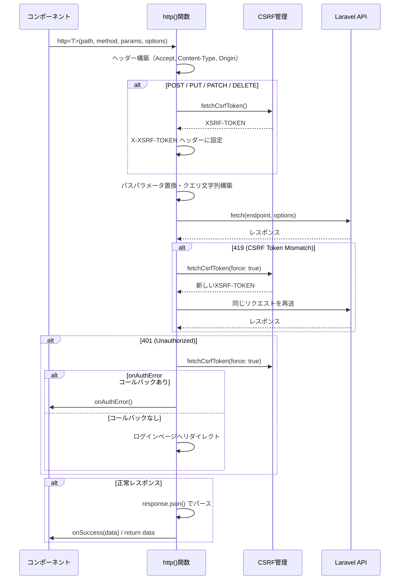

# 3-1-3 HTTP クライアントと SWR（フロントエンド・バックエンド繋ぎ込みの実装）

📝 **前提知識**: このセクションはセクション 3-1-1（フロントエンドのデータ管理戦略）とセクション 2-1-1（モダン Web アプリケーションのアーキテクチャ）の内容を前提としています。

## 🎯 このセクションで学ぶこと

- LMS のカスタム HTTP クライアント（`fetch.ts`）が CSRF トークン取得・認証エラーハンドリング・419 リトライをどう実装しているかを理解する
- **HttpDocument** 型パターンによる型安全な API 呼び出しの仕組みを理解する
- SWR のキャッシュ・再検証戦略と、条件付きフェッチの使い方を理解する
- `features/api/` ディレクトリでの API 関数定義パターンと、API 関数 → カスタムフック → コンポーネントの 3 層構造を理解する

セクション 2-1-1 で学んだ SPA + API アーキテクチャの概念（CORS、CSRF、Cookie 認証）が、LMS の実装でどのようにコードに落とし込まれているかを追跡していきます。

---

## 導入: 概念から実装へのギャップ

セクション 2-1-1 では、SPA + API アーキテクチャにおけるフロントエンドとバックエンドの通信の仕組みを学びました。CSRF トークンをリクエストに含める必要があること、Cookie ベースの認証でセッションを維持すること、認証エラーが起きたらログイン画面にリダイレクトすること。これらの概念は理解できたはずです。

しかし、実際の LMS のコードを読もうとすると、新たな疑問が生まれます。CSRF トークンはいつ、どこで取得しているのか。トークンの期限が切れたらどうなるのか。API のレスポンスの型はどう定義しているのか。同じ API を複数のコンポーネントから呼ぶとき、リクエストは重複しないのか。

LMS ではこれらの課題を、2 つの仕組みで解決しています。1 つ目は `fetch.ts` に集約されたカスタム HTTP クライアントです。CSRF トークンの管理、エラーハンドリング、リトライロジックをすべてこのファイルに閉じ込めることで、個々の API 呼び出しはビジネスロジックに集中できます。2 つ目は SWR によるサーバー状態管理です。セクション 3-1-1 で学んだ「サーバー状態」の管理を、キャッシュと自動再検証によって宣言的に行います。

このセクションでは、この 2 つの仕組みを順番に読み解いていきます。

### 🧠 先輩エンジニアはこう考える

> LMS の `fetch.ts` は約 270 行のファイルですが、フロントエンドとバックエンドを繋ぐすべてのロジックがここに集約されています。私がこのファイルを最初に読んだとき、「CSRF トークンの取得タイミング」と「419 リトライ」の部分で手が止まりました。Laravel Sanctum の仕様を知らないと、なぜこのコードが必要なのかわからないからです。逆に言えば、2-1-1 で学んだ概念がここで実装に直結します。概念と実装を行き来しながら読むと、理解が一気に深まるはずです。

---

## HttpDocument 型パターン

LMS の API 呼び出しで最も特徴的なのは、**HttpDocument** 型パターンです。これは API の「契約」を TypeScript の型で表現する設計です。

### なぜ API に型が必要か

バックエンドの API には、パスパラメータ、クエリパラメータ、リクエストボディ、レスポンスという 4 つの要素があります。これらを型なしで扱うと、以下のような問題が起きます。

- パスに含めるべき `workspaceId` を渡し忘れても実行時まで気づかない
- リクエストボディのフィールド名を typo しても、TypeScript がエラーを出さない
- レスポンスの構造を毎回 API ドキュメントで確認する必要がある

HttpDocument 型は、これら 4 つの要素をジェネリクスの型パラメータとして定義することで、API 呼び出しをコンパイル時に検証可能にします。

### HttpDocument 型の定義

```typescript
// frontend/src/lib/v2/fetch.ts
export type HttpDocument<
  PathParams = Record<string, string>,
  QueryParams = Record<string, unknown>,
  RequestBody = Record<string, unknown>,
  Response = any,
> = {
  params: {
    pathParams?: PathParams
    queryParams?: QueryParams
    requestBody?: RequestBody
  }
  response: Response
  options?: {
    callbacks?: {
      onSuccess?: (data: Response) => void
      onError?: (error: Error) => void
      onAuthError?: () => void
    }
    tags?: string[]
  }
}
```

4 つの型パラメータはそれぞれデフォルト値を持っているため、必要な部分だけを指定できます。セクション 2-2-2 で学んだジェネリクスがここで活用されています。

### 具体例: 試験種別の作成 API

実際の API 定義を見てみましょう。試験種別（examType）を作成する API です。

```typescript
// frontend/src/features/v2/examType/api/store.ts
import type { HttpDocument } from '@/lib/v2/fetch'
import { http } from '@/lib/v2/fetch'

export type StoreHttpDocument = HttpDocument<
  { workspaceId: string },          // PathParams: URL に埋め込むパラメータ
  undefined,                         // QueryParams: なし
  { name: string; termUpdateFlag: boolean },  // RequestBody: 送信するデータ
  undefined                          // Response: レスポンスボディなし
>

export function store(
  params: StoreHttpDocument['params'],
  options?: StoreHttpDocument['options'],
) {
  return http<StoreHttpDocument>(
    `/api/workspaces/:workspaceId/exam-types`,
    'POST',
    params,
    options,
  )
}
```

この定義から以下のことがわかります。

- **PathParams** に `{ workspaceId: string }` を指定しているため、呼び出し側は `pathParams.workspaceId` を必ず渡す必要があります
- **RequestBody** に `{ name: string; termUpdateFlag: boolean }` を指定しているため、リクエストボディの型が保証されます
- **Response** が `undefined` なので、この API はレスポンスボディを返しません（204 No Content 相当）

`http()` 関数のジェネリクスに `StoreHttpDocument` を渡すことで、`params` と戻り値の型が自動的に推論されます。これが HttpDocument パターンの核心です。API のパスパラメータ `:workspaceId` が実行時に `pathParams.workspaceId` の値で置換される仕組みは、次のセクションで解説します。

---

## http() 関数の処理フロー

`http()` 関数は LMS のすべての API リクエストが通る関門です。CSRF トークンの取得、エラーハンドリング、リトライロジックがすべてこの関数に集約されています。

### 全体のシーケンス



### ステップごとの解説

**1. ヘッダー構築**

```typescript
// frontend/src/lib/v2/fetch.ts
const headers: RequestInit['headers'] = {
  Accept: 'application/json',
  'Content-Type': 'application/json',
}

if (isServerSide) {
  const nextHeaders = await import('next/headers')
  const nextHeadersInstance = await nextHeaders.headers()
  headers['origin'] = APP_URL || ''
  headers['cookie'] = nextHeadersInstance.get('cookie') ?? ''
} else {
  headers['origin'] = APP_URL || ''
}
```

`Accept: 'application/json'` は、Laravel に「JSON で返してほしい」と伝えるヘッダーです。これがないと、Laravel がエラー時に HTML のエラーページを返す場合があります。`origin` ヘッダーは CORS の検証で使われます。サーバーサイド（SSR）では、ブラウザの Cookie にアクセスできないため、Next.js の `headers()` から Cookie を明示的に取得して転送しています。

**2. CSRF トークンの設定（変更系リクエストのみ）**

```typescript
// frontend/src/lib/v2/fetch.ts
if (['POST', 'PUT', 'PATCH', 'DELETE'].includes(method)) {
  await fetchCsrfToken()

  if (isServerSide) {
    const nextHeaders = await import('next/headers')
    const cookies = await nextHeaders.cookies()
    headers['X-XSRF-TOKEN'] = cookies.get('XSRF-TOKEN')?.value ?? ''
  } else {
    const token = getCsrfTokenFromCookie()
    headers['X-XSRF-TOKEN'] = token ?? ''
  }
}
```

GET リクエストには CSRF トークンが不要です。POST / PUT / PATCH / DELETE のときだけ `fetchCsrfToken()` を呼び、`X-XSRF-TOKEN` ヘッダーに設定します。セクション 2-1-1 で学んだ「CSRF トークンを変更系リクエストに付与する」という概念が、まさにこのコードで実装されています。

**3. パスパラメータの置換と URL の構築**

```typescript
// frontend/src/lib/v2/fetch.ts
const replacePathParams = <PathParams extends Record<string, string>>(
  path: string,
  pathParams: PathParams,
) => {
  return path.replace(/:([a-zA-Z0-9_]+)/g, (_, key) => {
    const value = pathParams[key]
    if (value === undefined) {
      throw new Error(`Missing required path parameter: ${key}`)
    }
    return encodeURIComponent(value)
  })
}
```

パス内の `:workspaceId` のようなプレースホルダーを、正規表現で実際の値に置換します。未定義のパラメータがあればエラーを投げるため、HttpDocument 型の型安全性とあわせて二重にチェックされます。

**4. 419 リトライ**

```typescript
// frontend/src/lib/v2/fetch.ts
let response = await fetch(endpoint, fetchOptions)

if (response.status === 419 && !isServerSide) {
  await fetchCsrfToken(true)  // force: true で強制再取得
  headers['X-XSRF-TOKEN'] = getCsrfTokenFromCookie() ?? ''
  response = await fetch(endpoint, fetchOptions)  // 同じリクエストを再送
}
```

HTTP 419 は Laravel 独自のステータスコードで、「CSRF トークンの不一致」を意味します。トークンの有効期限が切れた場合などに発生します。LMS では、419 を受け取ると CSRF トークンを強制的に再取得し、1 回だけリトライします。リトライは 1 回のみなので無限ループの心配はありません。

💡 **なぜサーバーサイドではリトライしないのか**: SSR 環境ではブラウザの Cookie を直接操作できません。Cookie の再取得ができないため、サーバーサイドでの 419 リトライは実装していません。

**5. 401 ハンドリング**

```typescript
// frontend/src/lib/v2/fetch.ts
if (response.status === 401) {
  if (!isServerSide) {
    await fetchCsrfToken(true)
  }

  if (onAuthError) {
    onAuthError()
  } else {
    if (isServerSide) {
      redirect('/v2/user/login')
    } else {
      location.href = buildLoginUrlWithCurrentPath('/v2/user/login')
    }
  }
}
```

401 Unauthorized が返されると、セッションが切れたことを意味します。デフォルトの動作はログインページへのリダイレクトですが、`onAuthError` コールバックを渡すことでカスタムの動作に差し替えられます。`buildLoginUrlWithCurrentPath` は現在のページ URL をクエリパラメータに含めるため、ログイン後に元のページに戻れる仕組みです。

**6. エラーハンドリングとレスポンスパース**

```typescript
// frontend/src/lib/v2/fetch.ts
// その他のエラー
if (isServerSide) {
  throw new Error('API Error: ' + errorBody)
} else {
  const error = new Error('API Error ' + errorBody)
  if (onError !== undefined) {
    onError(error)
  } else {
    handleError()  // HeroUI の toast でエラー表示
    throw error
  }
}
```

サーバーサイドではエラーを throw して Next.js のエラーバウンダリに処理を委ねます。クライアントサイドでは `onError` コールバックがあればそれを呼び、なければ HeroUI の toast でユーザーにエラーを通知します。

正常レスポンスの場合は `response.json()` でパースし、`onSuccess` コールバックがあれば呼び出した上でデータを返します。

---

## CSRF トークンの管理

LMS には CSRF トークンを扱う 3 つの関数があります。それぞれの役割を整理しましょう。

| 関数 | 用途 | 呼び出し元 |
|---|---|---|
| `prefetchCsrfToken()` | ページ表示時に事前取得 | ログインページのコンポーネント |
| `fetchCsrfToken(force?)` | リクエスト前に取得（キャッシュ活用） | `http()` 関数内部 |
| `getCsrfTokenFromCookie()` | Cookie から現在のトークンを読み取り | `http()` 関数内部 |

### prefetchCsrfToken(): 事前取得

```typescript
// frontend/src/lib/v2/fetch.ts
export async function prefetchCsrfToken() {
  if (typeof window === 'undefined') return  // SSR では何もしない
  if (getCsrfTokenFromCookie()) return        // 既にトークンがあればスキップ

  await fetch(`${API_URL}/api/sanctum/csrf-cookie`, {
    method: 'GET',
    credentials: 'include',
    cache: 'no-store',
  })
}
```

この関数はログインページのマウント時に呼ばれます。ユーザーがログインボタンを押す前に CSRF トークンを取得しておくことで、ログインリクエストの待ち時間を短縮する **プリフェッチパターン** です。`credentials: 'include'` は、セクション 2-1-1 で学んだ Cookie ベース認証に必要な設定です。これを指定することで、Laravel Sanctum が発行した Cookie をブラウザが保存します。

### fetchCsrfToken(): 通常取得

```typescript
// frontend/src/lib/v2/fetch.ts
async function fetchCsrfToken(force: boolean = false) {
  if (force) {
    await fetch(`${API_URL}/api/sanctum/csrf-cookie`, {
      method: 'GET',
      credentials: 'include',
      cache: 'no-store',
    })
    return
  }

  if (!isServerSide && getCsrfTokenFromCookie()) {
    return  // 既存トークンがあればスキップ
  }

  await fetch(`${API_URL}/api/sanctum/csrf-cookie`, {
    method: 'GET',
    credentials: 'include',
    cache: 'no-store',
  })
}
```

`http()` 関数内部で変更系リクエストの前に呼ばれます。`force` パラメータが `false`（デフォルト）の場合、既存の Cookie にトークンがあればネットワークリクエストをスキップします。`force: true` は 419 や 401 エラー後の再取得で使われます。

### getCsrfTokenFromCookie(): Cookie からの読み取り

```typescript
// frontend/src/lib/v2/fetch.ts
function getCsrfTokenFromCookie(): string | null {
  if (isServerSide) return null

  const cookie = document.cookie
    .split('; ')
    .find((row) => row.startsWith('XSRF-TOKEN='))

  if (!cookie) return null

  const token = cookie.split('=')[1]
  return token ? decodeURIComponent(decodeURIComponent(token)) : null
}
```

ブラウザの `document.cookie` から `XSRF-TOKEN` Cookie の値を取得します。`decodeURIComponent` を 2 回呼んでいるのは、Laravel Sanctum がトークンをダブルエンコードして Cookie に保存するためです。

🔑 **3 つの関数の連携**: `prefetchCsrfToken()` が事前に Cookie を準備し、`fetchCsrfToken()` がリクエスト前に Cookie の有無を確認し、`getCsrfTokenFromCookie()` が実際の値を読み取ります。この 3 段階の仕組みにより、不要なネットワークリクエストを最小限に抑えつつ、CSRF トークンの有効性を保証しています。

---

## サーバーサイド vs クライアントサイドの分岐

`fetch.ts` の中には、`isServerSide`（`typeof window === 'undefined'`）による分岐が複数あります。これは Next.js の SSR 環境とブラウザ環境で、Cookie へのアクセス方法が根本的に異なるためです。

| 操作 | クライアントサイド（ブラウザ） | サーバーサイド（SSR） |
|---|---|---|
| Cookie の読み取り | `document.cookie` | `next/headers` の `cookies()` |
| Cookie の送信 | `credentials: 'include'` で自動送信 | `headers['cookie']` で明示的に転送 |
| CSRF トークン取得 | `getCsrfTokenFromCookie()` | `cookies.get('XSRF-TOKEN')?.value` |
| 401 時のリダイレクト | `location.href = ...` | Next.js の `redirect()` |
| 419 リトライ | 実行する | 実行しない |

```typescript
// frontend/src/lib/v2/fetch.ts
const isServerSide = typeof window === 'undefined'
```

この判定はモジュールの読み込み時に一度だけ評価されます。Server Components から `http()` 関数が呼ばれる場合は `true`、Client Components からブラウザで呼ばれる場合は `false` になります。

💡 **なぜサーバーサイドで Cookie を明示的に転送するのか**: ブラウザでは `credentials: 'include'` を指定するだけで Cookie が自動送信されます。しかし SSR では Node.js がリクエストを送るため、ブラウザの Cookie にアクセスできません。Next.js の `headers()` を使ってリクエストヘッダーから Cookie を取り出し、バックエンドへのリクエストに手動で含める必要があります。

---

## SWR によるサーバー状態管理

セクション 3-1-1 で、フロントエンドのデータは「サーバー状態」と「クライアント状態」に分けて管理すると学びました。LMS では、サーバー状態の管理に **SWR** を使用しています。

### SWR とは何か

SWR は Vercel（Next.js の開発元）が提供するデータフェッチライブラリです。名前は HTTP のキャッシュ無効化戦略 **stale-while-revalidate** に由来します。これは「古いキャッシュを先に表示しつつ、裏で最新データを取得する」というアプローチです。

SWR を使わない場合、データの取得には `useEffect` と `useState` を組み合わせる必要があります。

```tsx
// SWR なしの場合（ボイラープレートが多い）
function ExamTypeList({ workspaceId }: { workspaceId: string }) {
  const [data, setData] = useState(null)
  const [isLoading, setIsLoading] = useState(true)
  const [error, setError] = useState(null)

  useEffect(() => {
    index({ pathParams: { workspaceId } })
      .then(setData)
      .catch(setError)
      .finally(() => setIsLoading(false))
  }, [workspaceId])

  // ローディング、エラー、データ表示のハンドリング...
}
```

SWR を使うと、キャッシュ管理、ローディング状態、エラーハンドリング、自動再検証がすべて組み込みで提供されます。

```tsx
// SWR ありの場合（宣言的にデータ取得）
function ExamTypeList({ workspaceId }: { workspaceId: string }) {
  const { data, isLoading, error } = useSWR(
    [`/api/workspaces/${workspaceId}/exam-types`],
    () => index({ pathParams: { workspaceId } }),
  )
  // すぐにデータ表示のロジックに入れる
}
```

### キャッシュキーの設計

SWR のキャッシュは **キー** で管理されます。同じキーを持つ `useSWR` 呼び出しは、キャッシュを共有します。

```typescript
// キーの例: 配列で構成
[`/api/workspaces/${workspaceId}/exam-types`]

// パラメータが異なるデータは別のキーにする
[`/api/employee-shifts`, { employeeId, startDate, endDate }]
```

LMS では、API のエンドポイントパスをキーのベースにし、必要に応じてクエリパラメータをオブジェクトとして含めています。これにより以下が実現されます。

- **同じ API を別のコンポーネントから呼んでも、リクエストは 1 回だけ**: 同じキーの `useSWR` はキャッシュを共有するため、ネットワークリクエストが重複しません
- **パラメータが変わったら自動で再取得**: キーの値が変わると、SWR は新しいデータを自動的にフェッチします

### 条件付きフェッチ（null キー）

SWR でデータを取得したくない場合、キーに `null` を渡すとフェッチが無効化されます。LMS ではこのパターンが頻繁に使われています。

```typescript
// frontend/src/features/v2/aiChatbot/hooks/useAiConversationDetail.ts
export default function useAiConversationDetail(
  workspaceId: string,
  conversationId: string | null,
  swrOptions?: SWRConfiguration,
) {
  const fetcher = () =>
    show({
      pathParams: {
        workspaceId,
        conversationId: conversationId!,
      },
    })

  return useSWR(
    conversationId
      ? [`/api/workspaces/${workspaceId}/ai-chatbot/conversations/${conversationId}`]
      : null,  // conversationId が null なら取得しない
    fetcher,
    swrOptions,
  )
}
```

`conversationId` が `null` の場合（まだ会話が選択されていない場合）、SWR はフェッチを実行しません。`conversationId` に値が設定されると、自動的にデータ取得が開始されます。これは「ユーザーのインタラクションに応じて段階的にデータを取得する」というパターンを宣言的に表現できるため、`useEffect` の条件分岐よりもシンプルに書けます。

### 再検証戦略

SWR は、以下のタイミングでデータの再検証（revalidate）を自動実行します。

| トリガー | 説明 | デフォルト |
|---|---|---|
| **revalidateOnFocus** | ブラウザのタブにフォーカスが戻ったとき | 有効 |
| **revalidateOnReconnect** | ネットワーク接続が復帰したとき | 有効 |
| **refreshInterval** | 一定間隔での定期的な再取得 | 無効（0） |
| **revalidateOnMount** | コンポーネントのマウント時 | 有効 |

LMS では、API ごとに `swrOptions` で再検証の挙動をカスタマイズしています。例えば、Google Calendar のイベント取得では `shouldRetryOnError: false` を指定して、Google API のエラー時にリトライしないようにしています。

### mutate によるキャッシュの手動更新

データを変更した後（POST / PUT / DELETE 後）、関連するキャッシュを更新する必要があります。SWR では `mutate` 関数でこれを行います。

```typescript
// useSWR の戻り値に含まれる mutate
const { data, mutate } = useSWR(key, fetcher)

// データ変更後にキャッシュを再検証
await store({ pathParams: { workspaceId }, requestBody: { name: '新しい試験種別', termUpdateFlag: false } })
mutate()  // 同じキーのデータを再取得
```

`mutate()` を引数なしで呼ぶと、SWR はサーバーからデータを再取得してキャッシュを更新します。

---

## features/api/ ディレクトリパターン

LMS の API 呼び出しは、3 つの層に分かれた構造で整理されています。

```text
features/v2/examType/
├── api/           ← 第1層: API 関数定義
│   ├── index.ts      GET /api/workspaces/:workspaceId/exam-types
│   ├── store.ts      POST /api/workspaces/:workspaceId/exam-types
│   ├── update.ts     PUT /api/workspaces/:workspaceId/exam-types/:id
│   └── destroy.ts    DELETE /api/workspaces/:workspaceId/exam-types/:id
├── hooks/         ← 第2層: カスタムフック（SWR でラップ）
│   └── useExamTypes.ts
└── components/    ← 第3層: UI コンポーネント
    └── ExamTypeList.tsx
```

### 第 1 層: API 関数定義

API の 1 エンドポイントにつき 1 ファイルを作成します。それぞれが HttpDocument 型の定義と、`http()` 関数を呼び出す薄いラッパー関数を持ちます。

```typescript
// frontend/src/features/v2/examType/api/index.ts
import type { HttpDocument } from '@/lib/v2/fetch'
import { http } from '@/lib/v2/fetch'

export const INDEX_TAG = 'exam-types'

export type IndexHttpDocument = HttpDocument<
  { workspaceId: string },
  { isPublic?: number },
  undefined,
  {
    data: {
      id: string
      termUpdateFlag: boolean
      name: string
    }[]
  }
>

export function index(
  params: IndexHttpDocument['params'],
  options?: IndexHttpDocument['options'],
) {
  return http<IndexHttpDocument>(
    `/api/workspaces/:workspaceId/exam-types`,
    'GET',
    params,
    {
      ...options,
      tags: [INDEX_TAG, ...(options?.tags ?? [])],
    },
  )
}
```

🔑 **INDEX_TAG** に注目してください。これは Next.js の `revalidateTag()` で使われるタグで、サーバーサイドのキャッシュ無効化に使用します。データ変更時に関連するキャッシュをタグ単位で一括無効化できます。

### 第 2 層: カスタムフック

API 関数を SWR でラップし、コンポーネントから使いやすいインターフェースを提供します。

```typescript
// カスタムフックの典型的なパターン（概念例）
function useExamTypes(workspaceId: string, swrOptions?: SWRConfiguration) {
  return useSWR(
    [`/api/workspaces/${workspaceId}/exam-types`],
    () => index({ pathParams: { workspaceId } }),
    swrOptions,
  )
}
```

### 第 3 層: コンポーネント

カスタムフックを呼び出して、データを表示します。

```tsx
// コンポーネントでの使用パターン（概念例）
function ExamTypeList({ workspaceId }: { workspaceId: string }) {
  const { data, isLoading } = useExamTypes(workspaceId)

  if (isLoading) return <Spinner />
  return (
    <ul>
      {data?.data.map((type) => (
        <li key={type.id}>{type.name}</li>
      ))}
    </ul>
  )
}
```

💡 **この 3 層構造のメリット**: API の詳細（エンドポイント、パラメータ、型）は第 1 層に閉じ込められ、キャッシュ戦略は第 2 層で管理し、コンポーネントはデータの表示だけに集中できます。新しい API を追加するときも、同じパターンに従ってファイルを作成するだけです。

### 複数の SWR を組み合わせるパターン

1 つのフックで複数の API を並列に呼び出すパターンも LMS で使われています。スケジュール画面のカスタムフックが好例です。

```typescript
// frontend/src/features/v2/schedule/hooks/useCsScheduleData.ts
export function useCsScheduleData(query: UseCsScheduleDataQuery, swrOptions?: SWRConfiguration) {
  const { employeeId, workspaceId, startDate, endDate, startDatetime, endDatetime } = query

  // シフトデータのフェッチ
  const { data: shiftsData, mutate: mutateShifts } = useSWR(
    employeeId ? [`/api/employee-shifts`, { employeeId, startDate, endDate }] : null,
    () => indexEmployeeShifts({
      queryParams: { employeeId: employeeId!, startDate, endDate },
    }).then((res) => res.data),
    swrOptions,
  )

  // Googleカレンダーイベントデータのフェッチ
  const { data: googleCalendarEventsData, mutate: mutateGoogleCalendarEvents } = useSWR(
    employeeId ? [`/api/google-calendar-events`, { employeeId, startDate, endDate }] : null,
    () => fetchGoogleCalendarEvents({
      queryParams: { employeeId: employeeId!, startDate, endDate },
    }).then((res) => res),
    { ...swrOptions, shouldRetryOnError: false },
  )

  // 申請面談データのフェッチ
  const { data: applicationInterviewsData, mutate: mutateApplicationInterviews } = useSWR(
    workspaceId && employeeId
      ? [`/api/workspaces/${workspaceId}/employees/${employeeId}/application-interviews`,
         { startDatetime, endDatetime }]
      : null,
    () => fetchApplicationInterviewsByEmployeeId({
      pathParams: { workspaceId, employeeId: employeeId! },
      queryParams: { startDatetime, endDatetime },
    }).then((res) => res.data),
    swrOptions,
  )

  // 統合された mutate 関数
  const mutate = () => {
    mutateShifts()
    mutateGoogleCalendarEvents()
    mutateApplicationInterviews()
  }

  return { shiftsData: shiftsData ?? [], googleCalendarEventsData: googleCalendarEventsData ?? [], applicationInterviewsData: applicationInterviewsData ?? [], mutate }
}
```

3 つの `useSWR` が同じフック内で並列にデータを取得します。それぞれが独立したキーを持つため、キャッシュも独立しています。`mutate` 関数は 3 つの個別の `mutate` をまとめて呼び出すことで、画面全体のデータを一括で再検証します。すべてのフェッチで `employeeId` が `null` のとき `null` キーを返しているため、従業員が選択されるまでどのフェッチも実行されません。

---

## useSWRInfinite によるページネーション

通常の `useSWR` は 1 回のフェッチで全データを取得しますが、大量のデータを扱う場合はページネーションが必要です。SWR は **useSWRInfinite** という専用フックを提供しており、LMS の AI チャットボットの会話一覧で使われています。

```typescript
// frontend/src/features/v2/aiChatbot/hooks/useAiConversations.ts
export default function useAiConversations(
  workspaceId: string,
  userId: string,
  swrOptions?: SWRConfiguration,
) {
  const result = useSWRInfinite<FetchByUserIdHttpDocument['response']>(
    (pageIndex, previousPageData) => {
      // 前のページのデータが空なら終了
      if (previousPageData && previousPageData.data.length === 0) return null
      // 最終ページに達したら終了
      const hasMorePages =
        previousPageData?.meta &&
        previousPageData.meta.currentPage < previousPageData.meta.lastPage
      if (previousPageData && !hasMorePages) return null
      // 次のページのパラメータを返す
      return {
        pathParams: { workspaceId, userId },
        queryParams: { page: pageIndex + 1 },
      }
    },
    (params) => fetchByUserId(params),
    swrOptions,
  )

  // 全ページのデータをフラット化
  const conversations = result.data?.flatMap((page) => page.data) ?? []

  // 次のページがあるかの判定
  const hasMore =
    result.data && result.data.length > 0
      ? result.data[result.data.length - 1].meta.currentPage <
        result.data[result.data.length - 1].meta.lastPage
      : false

  // 次のページを読み込む関数
  const loadMore = useCallback(() => {
    if (!result.isValidating) {
      result.setSize((prev) => prev + 1)
    }
  }, [result])

  return { ...result, conversations, hasMore, loadMore }
}
```

`useSWRInfinite` の第 1 引数は **getKey 関数** です。ページインデックスと前のページのデータを受け取り、次のページのキー（パラメータ）を返します。`null` を返すとそれ以上の読み込みを停止します。

このフックが返す `conversations` は全ページのデータを `flatMap` で 1 つの配列にまとめたもの、`hasMore` は次のページが存在するかの判定、`loadMore` は次のページの読み込みをトリガーする関数です。コンポーネント側は以下のように使います。

```tsx
// コンポーネントでの使用パターン（概念例）
function ConversationList() {
  const { conversations, hasMore, loadMore, isLoading } = useAiConversations(workspaceId, userId)

  return (
    <div>
      {conversations.map((conv) => <ConversationItem key={conv.id} {...conv} />)}
      {hasMore && <button onClick={loadMore}>もっと見る</button>}
    </div>
  )
}
```

⚠️ **useSWRInfinite と useSWR の使い分け**: 全件を一度に取得する API には `useSWR` を、ページネーション付きの API には `useSWRInfinite` を使います。LMS では会話一覧やログ一覧など、データ量が多い画面で `useSWRInfinite` が使われています。

---

## ✨ まとめ

- **HttpDocument 型パターン** は、API の契約（パスパラメータ、クエリパラメータ、リクエストボディ、レスポンス）を TypeScript の型で表現する設計です。コンパイル時に型チェックが働くため、API 呼び出しのミスを早期に発見できます
- **http() 関数** は、ヘッダー構築 → CSRF トークン取得 → リクエスト送信 → 419 リトライ → 401 ハンドリング → レスポンスパースという一連の処理を 1 つの関数に集約しています。セクション 2-1-1 で学んだ CSRF 保護と Cookie 認証の概念が、このコードで具体的に実装されています
- **CSRF トークン管理** は、`prefetchCsrfToken()`（事前取得）、`fetchCsrfToken()`（リクエスト前取得）、`getCsrfTokenFromCookie()`（Cookie からの読み取り）の 3 段階で行われ、不要なネットワークリクエストを抑えつつトークンの有効性を保証しています
- **SWR** は、キャッシュ共有・自動再検証・条件付きフェッチ（null キー）により、サーバー状態を宣言的に管理します。Zustand がクライアント状態を管理し、SWR がサーバー状態を管理するという、セクション 3-1-1 で学んだ役割分担がここで実装に結びつきます
- **features/api/ ディレクトリパターン** は、API 関数定義 → カスタムフック → コンポーネントの 3 層構造で API 呼び出しを整理します。新しい API の追加は、このパターンに沿ってファイルを作成するだけです

---

このセクションで、Chapter 3-1（状態管理とデータフェッチ）は完了です。クライアント状態を Zustand で管理し、サーバー状態を SWR と HTTP クライアントで管理する仕組みを理解しました。次の Chapter 3-2 では、もう 1 つの重要なフロントエンド領域であるフォーム入力の管理に進みます。React Hook Form の制御モデル（useForm/useController）、Yup スキーマバリデーション、yupResolver による統合、LMS のフォームパターンを学びます。
