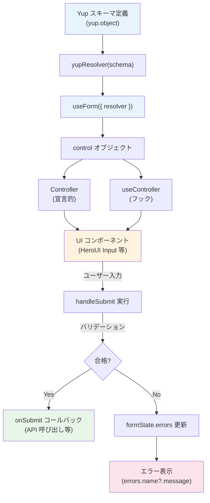

# 3-2-1 React Hook Form と Yup

この Chapter では、ユーザー入力の収集と検証の仕組みを学びます。フォームはあらゆる Web アプリケーションの中核であり、LMS でも生徒登録、面談予約、設定変更など数多くの場面で使われています。Chapter 02 は本セクション 1 つで構成されており、React Hook Form によるフォーム制御と Yup によるバリデーションの両方をカバーします。

📖 **この Chapter の進め方**: 本セクションを通して読み進めてください。前半で React Hook Form と Yup それぞれの仕組みを理解し、後半で LMS の実コードに現れる 5 つのフォームパターンを確認します。

📝 **前提知識**: このセクションはセクション 2-3-2（State と Hooks）の内容を前提としています。

## 🎯 このセクションで学ぶこと

- React Hook Form の制御モデル（`useForm` / `useController`）とパフォーマンス戦略を理解する
- `Controller` と `useController` を使って HeroUI などの外部 UI ライブラリと統合するパターンを理解する
- Yup スキーマバリデーションの基本と、LMS 独自のカスタマイズ（日本語ロケール・`equalTo` メソッド）を理解する
- `yupResolver` による React Hook Form と Yup の接続の仕組みを理解する
- LMS のフォームパターン 5 種を読み解けるようになる

まず「なぜフロントエンドでもバリデーションが必要なのか」という問いから始め、React Hook Form の制御モデル、Yup のスキーマ定義、両者の統合、そして LMS の実装パターンの順に進みます。

---

## 導入: サーバーサイドバリデーションだけでは足りない理由

あなたは Laravel の `FormRequest` によるバリデーションを知っています。`rules()` メソッドでルールを定義し、リクエストがコントローラーに到達する前にサーバー側で検証する仕組みです。これは堅牢で、セキュリティ上も必須です。

しかし、SPA（Single Page Application）アーキテクチャでは、フォームの送信はページ遷移ではなく API リクエストです。ユーザーがフォームを入力し、送信ボタンを押し、サーバーからエラーが返ってくるまで数百ミリ秒から数秒かかります。入力欄が 10 個あるフォームで、送信後に初めて「姓には英数字を使用できません」と表示されたら、ユーザー体験としては不十分です。

**フロントエンドバリデーション** は、ユーザーが入力した瞬間やフィールドからフォーカスを外した瞬間にエラーを表示します。これにより、ユーザーは問題をすぐに修正でき、無駄な API リクエストも発生しません。

ただし、フロントエンドバリデーションはあくまで UX の改善であり、サーバーサイドバリデーションの代替にはなりません。ブラウザの開発者ツールからバリデーションを迂回して API を直接呼ぶことは容易だからです。つまり、**両方必要** です。

| バリデーション | 目的 | タイミング |
|---|---|---|
| フロントエンド（React Hook Form + Yup） | UX 向上・即時フィードバック | 入力中 / フォーカス移動時 / 送信時 |
| サーバーサイド（Laravel FormRequest） | セキュリティ・データ整合性 | API リクエスト受信時 |

### 🧠 先輩エンジニアはこう考える

> LMS の開発では、フロントエンドとバックエンドの両方にバリデーションを書くので「二重管理では？」と感じるかもしれません。実際、ルールの同期は手間です。ただ、フロントエンドのバリデーションがないフォームは、ユーザーから「入力しづらい」「何が間違っているかわからない」というフィードバックが必ず来ます。特に LMS のように入力項目の多い管理画面では、即時バリデーションの有無がユーザー体験を大きく左右します。React Hook Form + Yup の組み合わせは、この「二重管理」のコストを最小限に抑えつつ、リッチなバリデーション体験を提供してくれます。

---

## React Hook Form の制御モデル

**React Hook Form**（react-hook-form ^7.51.3）は、React でフォームを扱うためのライブラリです。最大の特徴は、**非制御コンポーネント（Uncontrolled Components）戦略** によるパフォーマンスの高さです。

### なぜ「非制御」が重要なのか

セクション 2-3-2 で学んだように、React の `useState` でフォームの値を管理すると、入力のたびに State が更新され、コンポーネントが再レンダリングされます。入力欄が 1 つなら問題ありませんが、10 個、20 個と増えると、1 文字入力するたびにフォーム全体が再レンダリングされ、パフォーマンスが低下します。

React Hook Form は、内部で `ref` を使ってフォームの値を DOM 要素から直接取得します。React の State を経由しないため、入力のたびに再レンダリングが発生しません。これが「非制御コンポーネント戦略」です。

### useForm() の基本

`useForm()` は React Hook Form の中核となるフック（Hooks）です。フォームの設定を受け取り、フォーム操作に必要な関数群を返します。

```tsx
import { useForm } from 'react-hook-form'
import { yupResolver } from '@hookform/resolvers/yup'
import * as yup from 'yup'

// 1. スキーマ定義（後述の Yup セクションで詳しく解説）
const schema = yup.object({
  email: yup.string().email().required(),
  password: yup.string().min(8).required(),
})
type FormValues = yup.InferType<typeof schema>

// 2. useForm の呼び出し
const {
  register,       // input 要素にフォーム制御を接続する関数
  handleSubmit,   // フォーム送信時のラッパー（バリデーション実行 → 成功時のみコールバック呼び出し）
  formState,      // エラー情報・送信状態などのオブジェクト
  control,        // Controller / useController に渡す制御オブジェクト
  reset,          // フォームの値を初期値に戻す
  setValue,       // 特定フィールドの値をプログラムから設定する
  watch,          // 特定フィールドの値をリアクティブに監視する
  trigger,        // バリデーションを手動で発火する
} = useForm<FormValues>({
  mode: 'onSubmit',                    // バリデーション実行タイミング
  resolver: yupResolver(schema),       // Yup との接続（後述）
  defaultValues: { email: '', password: '' },
})
```

`useForm` が返すオブジェクトの中で特に重要なのは以下の 3 つです。

| プロパティ / 関数 | 役割 |
|---|---|
| `register` | ネイティブの `<input>` 要素に `name`, `ref`, `onChange`, `onBlur` を一括で設定する |
| `handleSubmit` | フォーム送信時にバリデーションを実行し、成功した場合だけコールバック関数を呼ぶ |
| `formState.errors` | フィールドごとのエラー情報を保持するオブジェクト |

### mode オプション: バリデーションのタイミング

`mode` オプションはバリデーションがいつ実行されるかを制御します。LMS では主に 2 つの値が使われています。

| mode | タイミング | LMS での使い分け |
|---|---|---|
| `'onSubmit'` | フォーム送信時のみ（デフォルト） | シンプルなフォーム（AI チャットボット入力、テスト種別作成など） |
| `'all'` | 送信時 + 入力変更時 + フォーカス移動時 | 入力項目が多く即時フィードバックが重要なフォーム（プロフィール編集、予定作成など） |

`'onSubmit'` はユーザーが送信するまでエラーを表示しないので、短いフォームに適しています。`'all'` は入力中にリアルタイムでエラーを表示するので、長いフォームや複雑なバリデーションルールがある場合に有効です。

---

## Controller と useController

### なぜ Controller が必要なのか

`register` はネイティブの HTML `<input>` 要素を対象とした仕組みです。しかし、LMS では HeroUI の `<Input>` や `<Select>`、`<Switch>` といった外部 UI ライブラリのコンポーネントを使います。これらは内部で独自の状態管理を行う **制御コンポーネント（Controlled Components）** であり、`register` が期待する `ref` を直接受け取れません。

ここで **`Controller`** と **`useController`** の出番です。これらは React Hook Form の非制御戦略と、外部 UI ライブラリの制御コンポーネントを橋渡しする役割を持ちます。

### Controller コンポーネント

`Controller` は、`render` プロップで UI コンポーネントを描画する宣言的なパターンです。

```tsx
import { Controller, useForm } from 'react-hook-form'
import { Input } from '@heroui/react'

<Controller
  name='name'
  control={control}
  render={({ field }) => (
    <Input
      {...field}                          // value, onChange, onBlur, ref を一括で渡す
      placeholder='テスト種別名を入力'
      variant='bordered'
      isInvalid={!!errors.name}           // HeroUI のエラー表示
      errorMessage={errors.name?.message} // エラーメッセージ
    />
  )}
/>
```

`render` 関数が受け取る `field` オブジェクトには `value`, `onChange`, `onBlur`, `ref` が含まれています。これをスプレッド演算子（`...field`）で UI コンポーネントに渡すことで、React Hook Form がコンポーネントの値を追跡できるようになります。

### useController フック

`useController` は `Controller` と同じ機能をフック形式で提供します。JSX の外でフィールドの状態にアクセスしたい場合や、複数のフィールドをまとめて管理したい場合に便利です。

```tsx
import { useController, useForm } from 'react-hook-form'

const { handleSubmit, control } = useForm<FormValues>({
  mode: 'onSubmit',
  resolver: yupResolver(schema),
  defaultValues: { title: '', content: '' },
})

// JSX の外でフィールドを定義
const fields = {
  title: useController({ name: 'title', control }),
  content: useController({ name: 'content', control }),
}

// field オブジェクトと fieldState（エラー情報）の両方にアクセスできる
<input {...fields.title.field} />
{fields.title.fieldState.error && (
  <p className='mt-1 text-sm text-semantic-error-text'>
    {fields.title.fieldState.error.message}
  </p>
)}
```

### Controller と useController の使い分け

| パターン | 向いている場面 |
|---|---|
| `Controller`（コンポーネント） | JSX の中で宣言的に書きたい場合。HeroUI の `<Input>` を 1 つラップする典型的なケース |
| `useController`（フック） | JSX の外でフィールドの値やエラー状態を参照したい場合。複数フィールドをオブジェクトにまとめて管理する場合 |

LMS のコードベースでは、両方のパターンが使われています。どちらを使うかはコンポーネントの複雑さや開発者の好みによりますが、機能的な違いはありません。

---

## Yup スキーマバリデーション

**Yup**（yup ^1.6.1）は、JavaScript / TypeScript のオブジェクトに対してスキーマベースのバリデーションを行うライブラリです。Laravel の `FormRequest` における `rules()` メソッドに相当する役割を果たします。

### スキーマ定義の基本

Yup ではバリデーションルールを「スキーマ」としてチェーンメソッドで定義します。Laravel のバリデーションルールとの対応を見てみましょう。

| Yup | Laravel | 意味 |
|---|---|---|
| `yup.string()` | `'string'` | 文字列型 |
| `yup.number()` | `'numeric'` | 数値型 |
| `yup.boolean()` | `'boolean'` | 真偽値型 |
| `yup.object({ ... })` | `rules()` 全体 | オブジェクト構造 |
| `.required()` | `'required'` | 必須 |
| `.max(100)` | `'max:100'` | 最大値 / 最大文字数 |
| `.min(8)` | `'min:8'` | 最小値 / 最小文字数 |
| `.email()` | `'email'` | メールアドレス形式 |
| `.matches(regex)` | `'regex:...'` | 正規表現マッチ |
| `.test(name, msg, fn)` | カスタムルール | カスタムバリデーション |

Laravel では文字列でルールを定義しますが、Yup ではメソッドチェーンで型安全に定義できます。

```typescript
const schema = yup.object({
  name: yup.string()
    .required('テスト種別名は必須です')
    .max(100, 'テスト種別名は100文字以内で入力してください'),
  termUpdateFlag: yup.boolean().required(),
})
```

### yup.InferType による型推論

Yup の大きな利点の 1 つは、スキーマから TypeScript の型を自動生成できることです。

```typescript
const schema = yup.object({
  title: yup.string().required(),
  content: yup.string().required(),
})

// スキーマから型を自動推論
type FormValues = yup.InferType<typeof schema>
// → { title: string; content: string }
```

これにより、スキーマ定義と型定義を二重管理する必要がなくなります。スキーマを変更すれば型も自動的に変わるため、バリデーションルールとフォームの値の型が常に一致することが保証されます。

### カスタムバリデーション: test メソッド

標準のバリデーションメソッドでカバーできないルールには `test` メソッドを使います。LMS では、名前に英数字や記号を禁止するカスタムバリデーションが良い例です。

```typescript
const schema = yup.object({
  lastName: yup.string()
    .required('姓を入力してください。')
    .test(
      'no-forbidden-chars',                             // テスト名（一意な識別子）
      '姓には英数字や記号を使用できません。',                  // エラーメッセージ
      (value) => {                                      // バリデーション関数（true で合格）
        if (!value) return true
        return validateNameNoForbiddenChars(value)
      }
    ),
})
```

`test` の第 3 引数は関数で、`true` を返せばバリデーション成功、`false` を返せば失敗です。Laravel のカスタムルールクラスの `passes()` メソッドと似た発想です。

### LMS の日本語ロケール設定

LMS では、Yup のデフォルトエラーメッセージを日本語にカスタマイズしています。この設定は `frontend/src/lib/v2/yup.ts` で行われています。

```typescript
// frontend/src/lib/v2/yup.ts
import * as Yup from 'yup'

const jpLocaleObject = {
  mixed: {
    default: ({ label }: MessageParams) => `${labelText(label, 'が')}無効です。`,
    required: ({ label }: MessageParams) => `${labelText(label)}入力必須です。`,
    notType: ({ label, originalValue }: MessageParams & { originalValue?: unknown }) =>
      originalValue === '' ? `${labelText(label)}入力必須です。` : `形式が無効です。`,
  },
  string: {
    min: ({ label, min }: MessageParams & { min: number }) =>
      `${labelText(label)}${min}文字以上で入力してください。`,
    max: ({ label, max }: MessageParams & { max: number }) =>
      `${labelText(label)}${max}文字以下で入力してください。`,
    email: 'メールアドレス形式で入力してください。',
    // ...
  },
  // ...
}

Yup.setLocale(jpLocaleObject)
```

`Yup.setLocale()` を呼ぶことで、アプリケーション全体のデフォルトメッセージが日本語に置き換わります。各バリデーションメソッド（`.required()`, `.max()` など）に個別にメッセージを渡さなくても、自動的に日本語のエラーメッセージが生成されます。`label` パラメータを利用して「姓は入力必須です。」のようにフィールド名を動的に埋め込む工夫もされています。

### LMS のカスタムメソッド: equalTo

同じファイルでは、パスワード確認などに使う `equalTo` メソッドが追加されています。

```typescript
// frontend/src/lib/v2/yup.ts
Yup.addMethod<Yup.StringSchema>(
  Yup.string,
  'equalTo',
  function (refField: string, refLabel: string, message?: string) {
    return this.test(
      'equalTo',
      message || `\${label}が${refLabel}と一致していません。`,
      function (value) {
        const refValue = this.resolve(Yup.ref(refField))
        return value === refValue || createError({ ... })
      },
    )
  },
)

// TypeScript の型定義を拡張
declare module 'yup' {
  interface StringSchema {
    equalTo(refField: string, refLabel: string, message?: string): this
  }
}
```

`Yup.addMethod` で独自のバリデーションメソッドを追加し、`declare module` で TypeScript に型情報を教えています。これにより、`yup.string().equalTo('password', 'パスワード')` のようにチェーンメソッドとして自然に使えます。Laravel の `Rule::in()` のようなカスタムルールを作るイメージです。

💡 LMS では `yup` を直接インポートせず、このカスタマイズ済みの **`frontend/src/lib/v2/yup.ts`** をインポートして使います。これにより、日本語ロケールと `equalTo` メソッドが自動的に適用されます。

---

## yupResolver による統合

React Hook Form と Yup はそれぞれ独立したライブラリです。この 2 つを接続するのが **`@hookform/resolvers`**（@hookform/resolvers ^5.1.1）パッケージの `yupResolver` です。

### 統合の仕組み

`yupResolver` は、Yup のスキーマを React Hook Form が理解できるバリデーション関数に変換するアダプターです。

```typescript
import { useForm } from 'react-hook-form'
import { yupResolver } from '@hookform/resolvers/yup'
import yup from '@/lib/v2/yup'  // LMS のカスタマイズ済み Yup

const schema = yup.object({
  title: yup.string().required(),
  content: yup.string().required(),
})
type FormValues = yup.InferType<typeof schema>

const { handleSubmit, control } = useForm<FormValues>({
  resolver: yupResolver(schema),  // ここで接続
  defaultValues: { title: '', content: '' },
})
```

`resolver` オプションに `yupResolver(schema)` を渡すだけで、フォーム送信時（または `mode` で指定したタイミング）に Yup のスキーマによるバリデーションが自動的に実行されます。

### データの流れ

スキーマの定義からエラー表示まで、データがどのように流れるかを図で確認しましょう。



この流れを整理すると、次の 4 つのレイヤーに分かれます。

1. **スキーマ層**（Yup）: バリデーションルールと型を定義
2. **接続層**（yupResolver）: Yup スキーマを React Hook Form の resolver 形式に変換
3. **フォーム管理層**（React Hook Form）: フォームの値・エラー・送信状態を一元管理
4. **表示層**（Controller / useController + UI ライブラリ）: ユーザーとのインタラクション

💡 `@hookform/resolvers` は Yup 以外にも **Zod, Joi, Superstruct** などのバリデーションライブラリに対応しています。LMS では Yup を採用していますが、resolver パターンのおかげでバリデーションライブラリの切り替えが容易な設計になっています。

---

## LMS のフォームパターン

LMS のコードベースには、フォームの複雑さに応じた 5 つのパターンが存在します。シンプルなものから順に見ていきましょう。

### パターン 1: useController によるシンプルなフォーム

最も基本的なパターンです。AI チャットボットの入力フォーム（`features/v2/aiChatbot/components/AiChatbotInputForm.tsx`）を例に見てみます。

```tsx
// features/v2/aiChatbot/components/AiChatbotInputForm.tsx
const schema = yup.object().shape({
  title: yup.string().required('タイトルを入力してください'),
  content: yup.string().required('質問内容を入力してください'),
})
type FormValues = yup.InferType<typeof schema>

const { handleSubmit, control } = useForm<FormValues>({
  mode: 'onSubmit',
  resolver: yupResolver(schema),
  defaultValues: { title: '', content: '' },
})

const fields = {
  title: useController({ name: 'title', control }),
  content: useController({ name: 'content', control }),
}
```

**特徴**:
- `mode: 'onSubmit'` で送信時のみバリデーション
- `useController` で全フィールドをオブジェクトにまとめて管理
- エラー表示は `fields.title.fieldState.error?.message` でアクセス

送信ハンドラでは、Yup のバリデーションに加えてビジネスロジック固有のチェック（トークン数上限）も行っています。

```tsx
const submit = async (data: FormValues) => {
  // Yup バリデーション通過後に追加チェック
  if (countTokens(data.content) > AI_CHATBOT_MAX_INPUT_TOKENS) {
    setLimitError('入力内容が長すぎます。内容を短くしてから再度お試しください。')
    return
  }
  onSubmit({ title: data.title.trim(), content: data.content.trim() })
}

<form onSubmit={handleSubmit(submit)}>...</form>
```

🔑 `handleSubmit` が Yup バリデーションを実行し、成功時のみ `submit` 関数が呼ばれます。`submit` 関数の引数 `data` は型安全な `FormValues` 型です。

### パターン 2: Controller + モーダルフォーム

モーダルダイアログ内のフォームでは、`Controller` コンポーネントと HeroUI の `<Input>` を組み合わせるパターンがよく使われます。テスト種別作成モーダル（`features/v2/examType/components/CreateExamTypeModal.tsx`）の例です。

```tsx
// features/v2/examType/components/CreateExamTypeModal.tsx
const createExamTypeFormSchema = yup.object({
  name: yup.string().required('テスト種別名は必須です').max(100, 'テスト種別名は100文字以内で入力してください'),
  termUpdateFlag: yup.boolean().required(),
})
type CreateExamTypeFormValues = yup.InferType<typeof createExamTypeFormSchema>

const {
  handleSubmit,
  formState: { errors, isSubmitting },
  control,
  reset,
} = useForm<CreateExamTypeFormValues>({
  mode: 'onSubmit',
  resolver: yupResolver(createExamTypeFormSchema),
  defaultValues: { name: '', termUpdateFlag: false },
})
```

**特徴**:
- `Controller` で HeroUI の `<Input>` をラップし、`isInvalid` / `errorMessage` プロップでエラー表示を統合
- `reset()` でモーダルを閉じる際にフォームをクリア
- `isSubmitting` で送信中のボタン無効化を制御

```tsx
<Controller
  name='name'
  control={control}
  render={({ field }) => (
    <Input
      {...field}
      placeholder='テスト種別名を入力'
      variant='bordered'
      maxLength={100}
      isInvalid={!!errors.name}
      errorMessage={errors.name?.message}
    />
  )}
/>
```

HeroUI の `<Input>` は `isInvalid` プロップを受け取ると自動的に赤枠表示になり、`errorMessage` でエラーメッセージも表示します。`Controller` の `render` 関数で `field` をスプレッドするだけで、React Hook Form の値管理と HeroUI のエラー表示がシームレスに統合されています。

送信後の処理では、API 呼び出しとトースト通知を組み合わせています。

```tsx
const onSubmit = async (data: CreateExamTypeFormValues) => {
  try {
    await store({
      pathParams: { workspaceId },
      requestBody: { name: data.name.trim(), termUpdateFlag: data.termUpdateFlag },
    })
    addToast({ title: 'テスト種別を作成しました', color: 'success' })
    reset(defaultValues)
    router.refresh()
    onClose()
  } catch (error) {
    addToast({ title: 'テスト種別の作成に失敗しました', description: 'もう一度お試しください', color: 'danger' })
  }
}
```

### パターン 3: カスタム test によるリッチバリデーション

プロフィール編集（`features/v2/settings/components/UserProfileSection.tsx`）では、`test` メソッドを使った複雑なバリデーションと `mode: 'all'` による即時フィードバックが特徴です。

```tsx
// features/v2/settings/components/UserProfileSection.tsx
function validateNameNoForbiddenChars(value: string) {
  if (!value) return false
  const regex = /[0-9A-Za-z!--/:-@[-`{-~]|[０-９Ａ-Ｚａ-ｚ！-～\s　]/
  return !regex.test(value)
}

const schema = yup.object({
  lastName: yup.string().required('姓を入力してください。')
    .test('no-forbidden-chars', '姓には英数字や記号を使用できません。', (value) => {
      if (!value) return true
      return validateNameNoForbiddenChars(value)
    }),
  firstName: yup.string().required('名を入力してください。')
    .test('no-forbidden-chars', '名には英数字や記号を使用できません。', (value) => {
      if (!value) return true
      return validateNameNoForbiddenChars(value)
    }),
  nickname: yup.string().required('ニックネームを入力してください。')
    .max(10, 'ニックネームは10文字以内で入力してください。'),
  birthDate: yup.string().required('生年月日を入力してください。')
    .test('valid-birth-date', '生年月日を正しく入力してください。（例: 2000/01/01）', (value) => {
      if (!value) return true
      if (!/^\d{4}\/\d{2}\/\d{2}$/.test(value)) return false
      const [year, month, day] = value.split('/').map(Number)
      const parsedDate = dayjs().tz().year(year).month(month - 1).date(day)
      return parsedDate.year() === year && parsedDate.month() === month - 1 && parsedDate.date() === day
    }),
  selfIntroduction: yup.string().required('自己紹介を入力してください。'),
})
```

**特徴**:
- `mode: 'all'` で入力中にリアルタイムバリデーション
- `test` メソッドで「英数字・記号の禁止」「日付形式と実在日チェック」といったカスタムルールを実装
- 外部データ（ユーザー情報）の変更時に `reset()` でフォームを同期

```tsx
const { handleSubmit, formState: { errors, isSubmitting }, control, reset } = useForm<ProfileFormValues>({
  mode: 'all',
  resolver: yupResolver(schema),
  defaultValues: getUserFormValues(user),
})

// サーバーからのユーザーデータが変わったらフォームをリセット
useEffect(() => {
  const formValues = getUserFormValues(user)
  reset(formValues)
}, [user, reset])
```

⚠️ **注意**: `mode: 'all'` はバリデーションが頻繁に実行されるため、`test` メソッド内で重い処理（API 呼び出し等）を行うとパフォーマンスに影響します。LMS のカスタムバリデーションは正規表現や日付パースといった軽量な処理に限定しています。

### パターン 4: カスタムフォームフック

フォームのロジックが複雑になると、カスタムフックとして切り出すパターンが有効です。面談予約フォーム（`features/v2/schedule/hooks/useCreateEmployeeMeetingForm.ts`）の例です。

```typescript
// features/v2/schedule/hooks/useCreateEmployeeMeetingForm.ts
export function useCreateEmployeeMeetingForm({ workspaceId, employeeId, onSuccess }: Props) {
  const [isLoading, setIsLoading] = useState(false)
  const [errorMessage, setErrorMessage] = useState<string | null>(null)

  const { handleSubmit, formState: { errors }, setValue, trigger, watch, reset } = useForm<MeetingFormValues>({
    mode: 'all',
    resolver: yupResolver(createMeetingFormSchema),
    defaultValues: { userId: '', eventDate: '', startTime: '' },
  })

  const userId = watch('userId')
  const eventDate = watch('eventDate')

  // Select コンポーネントの変更ハンドラ
  const handleChangeUserId = (key: string | number | null) => {
    setValue('userId', key != null ? String(key) : '')
    trigger('userId')  // 値を設定後にバリデーションを手動で発火
  }

  const onSubmit = async (data: MeetingFormValues) => {
    setIsLoading(true)
    setErrorMessage(null)
    try {
      const startDateTime = dayjs(`${data.eventDate} ${data.startTime}`).tz()
      if (startDateTime.isBefore(dayjs().tz())) {
        setErrorMessage('過去の日時では予約できません')
        return
      }
      await store({ pathParams: { workspaceId }, requestBody: { ... } })
      reset()
      onSuccess()
    } catch (error) {
      setErrorMessage('面談の作成に失敗しました。もう一度お試しください。')
    } finally {
      setIsLoading(false)
    }
  }

  return {
    handleSubmit: handleSubmit(onSubmit),
    errors, userId, eventDate,
    isLoading, errorMessage,
    handleChangeUserId,
    // ...
  }
}
```

**特徴**:
- フォームのロジック（バリデーション、API 呼び出し、エラー管理、ローディング状態）をすべてカスタムフックに集約
- コンポーネント側はフックが返す値とハンドラを使うだけで、フォームロジックを意識しない
- `setValue` + `trigger` の組み合わせで、プログラム的な値変更後にバリデーションを即座に実行
- `watch` で特定フィールドの値をリアクティブに取得し、UI の条件分岐に利用

🔑 **`setValue` と `trigger` の組み合わせ** は重要なパターンです。`setValue` だけでは `mode: 'all'` でもバリデーションが自動で走らないケースがあるため、`trigger` で明示的にバリデーションを発火させます。

### パターン 5: 動的スキーマ

条件によってバリデーションルールが変わるフォームでは、スキーマを関数として定義します。予定作成モーダル（`features/v2/schedule/components/CreateScheduleCalendarModal.tsx`）の例です。

```tsx
// features/v2/schedule/components/CreateScheduleCalendarModal.tsx
const createScheduleFormSchema = (isRecurring: boolean) =>
  yup.object({
    title: yup.string().required('概要を選択してください。'),
    eventDate: isRecurring
      ? yup.string().default('')                              // 繰り返し予定: 日付不要
      : yup.string().required('日付を入力してください。'),       // 単発予定: 日付必須
    startTime: yup.string().required('開始時間を入力してください。'),
    endTime: yup.string().required('終了時間を入力してください。')
      .test('end-after-start', '終了時間は開始時間より後に設定してください。', function (value) {
        const { startTime } = this.parent  // 同じオブジェクト内の他フィールドを参照
        if (!startTime || !value) return true
        return endDateTime > startDateTime
      }),
    isRecurring: yup.boolean().default(false),
  })
```

**特徴**:
- スキーマを関数にして、引数（`isRecurring`）で条件分岐
- `useMemo` でスキーマのインスタンスをメモ化し、不要な再生成を防止
- `this.parent` で同一オブジェクト内の他フィールド（`startTime`）を参照するクロスフィールドバリデーション
- 条件変更時に `reset` でスキーマを再適用

```tsx
const schema = useMemo(() => createScheduleFormSchema(isRecurring), [isRecurring])

const { handleSubmit, formState: { errors }, setValue, trigger, watch, reset } = useForm<ScheduleFormValues>({
  mode: 'all',
  resolver: yupResolver(schema),
  defaultValues: { title: '', eventDate: initialDate || '', startTime: '', endTime: '', isRecurring: false },
})

// isRecurring が変わったらスキーマを再適用
useEffect(() => {
  reset({ ...currentValues, isRecurring }, { keepErrors: true })
}, [isRecurring, reset])
```

⚠️ **注意**: 動的スキーマを使う場合、`useMemo` によるメモ化を忘れるとレンダリングのたびに新しいスキーマが生成され、パフォーマンスが低下します。

### LMS のエラー表示パターン一覧

5 つのパターンを通して、LMS では 4 種類のエラー表示方法が使われていることがわかりました。

| 方法 | 実装例 | 用途 |
|---|---|---|
| `useController` の `fieldState` | `fields.title.fieldState.error?.message` | useController を使うフォーム |
| HeroUI コンポーネント統合 | `<Input isInvalid={!!errors.name} errorMessage={errors.name?.message} />` | Controller + HeroUI を使うフォーム |
| 独立した State | `{limitError && <p>{limitError}</p>}` | Yup バリデーション外のビジネスロジックエラー |
| トースト通知 | `addToast({ title: 'エラー', color: 'danger' })` | API 呼び出し失敗などの非同期エラー |

フィールド単位のエラー（入力ミス）はインラインで表示し、フォーム全体のエラー（API 失敗）はトーストで通知する、という使い分けです。

---

## ✨ まとめ

- **React Hook Form** は非制御コンポーネント戦略により、再レンダリングを最小限に抑えてフォームを管理する。`useForm` が返す `handleSubmit`, `control`, `formState` が中核の API
- **Controller / useController** は、HeroUI などの外部 UI ライブラリ（制御コンポーネント）と React Hook Form を橋渡しする。`Controller` は宣言的、`useController` はフック形式で、機能は同等
- **Yup** はスキーマベースのバリデーションライブラリで、メソッドチェーンでルールを定義する。`InferType` による型推論で、スキーマと型の二重管理を解消する
- **LMS 独自のカスタマイズ** として、日本語ロケール設定と `equalTo` カスタムメソッドが `frontend/src/lib/v2/yup.ts` に集約されている
- **yupResolver** が React Hook Form と Yup を接続するアダプターで、`resolver` オプションに渡すだけで統合が完了する
- LMS では、フォームの複雑さに応じて **5 つのパターン**（シンプル / モーダル / リッチバリデーション / カスタムフック / 動的スキーマ）が使い分けられている

---

次のセクションでは、フォームの見た目を支える UI ライブラリとスタイリングの世界に入ります。Tailwind CSS の応用テクニックとして、cn() ユーティリティ（clsx + twMerge）、CVA（Class Variance Authority）によるバリアント管理、レスポンシブデザインパターン、そして Tailwind 設定のカスタマイズを学びます。
