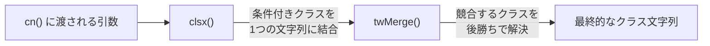
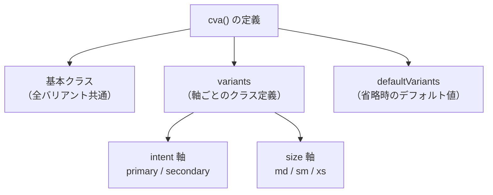
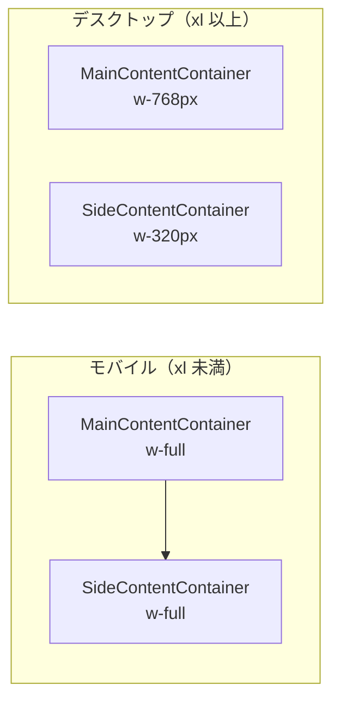

# 3-3-1 Tailwind CSS の応用テクニック

この Chapter では、LMS の UI 構築に使われるスタイリング技術とコンポーネントライブラリの全体像を学びます。3 つのセクションを通じて、Tailwind CSS の応用パターンからコンポーネントライブラリ、CSS-in-JS まで、LMS のスタイリング基盤を体系的に理解します。

| セクション | テーマ | 内容 |
|---|---|---|
| 3-3-1 | Tailwind CSS の応用テクニック | cn() ユーティリティ、CVA、レスポンシブデザイン、設定カスタマイズ |
| 3-3-2 | HeroUI と MUI | 主要コンポーネントライブラリと補助ライブラリの役割分担 |
| 3-3-3 | CSS-in-JS と Iconify | Emotion による動的スタイリングとアイコン管理 |

📖 **この Chapter の進め方**: 3-3-1 で Tailwind CSS の応用パターンを理解した上で、3-3-2 でコンポーネントライブラリがその上にどう乗るかを学び、3-3-3 で補完的な技術を押さえます。3-3-1 が他の 2 つのセクションの土台になるため、順番どおりに進めてください。

---

📝 **前提知識**: このセクションは COACHTECH 教材 tutorial-5（Tailwind CSS 基礎）の内容を前提としています。

## 🎯 このセクションで学ぶこと

- **cn() ユーティリティ** の仕組みと、clsx + tailwind-merge を組み合わせる理由を理解する
- **CVA（Class Variance Authority）** によるコンポーネントバリアント管理パターンを理解する
- **レスポンシブデザインパターン** のモバイルファーストの考え方と LMS での実装を理解する
- **tailwind.config.ts** のカスタマイズ内容（カラーシステム、アニメーション、HeroUI 統合）を読み解く

tutorial-5 で学んだ Tailwind CSS の基本的なユーティリティクラスの知識を土台に、実プロジェクトで必要になる 4 つの応用テクニックを順に見ていきます。

---

## 導入: 基本だけでは足りない Tailwind CSS の現実

COACHTECH 教材の tutorial-5 では、`bg-blue-500` や `text-lg` といった Tailwind CSS のユーティリティクラスを学びました。単一の要素にクラスを当てるだけなら、これで十分です。

しかし、LMS のような実プロジェクトでは次のような課題が発生します。

1. **クラスの条件分岐**: 「ボタンが無効なら `opacity-20` を追加したい」「エラー時だけ `border-red-500` にしたい」といった、状態に応じたクラスの出し分け
2. **クラスの競合**: 親コンポーネントが `bg-white` を指定し、子が `bg-blue-500` を指定した場合、Tailwind CSS はどちらが優先されるか保証しない
3. **バリアント管理**: ボタンに primary / secondary の色違いと md / sm / xs のサイズ違いがあり、その組み合わせをすべて管理する必要がある
4. **レスポンシブ対応**: モバイルとデスクトップでレイアウトが大きく変わるページの設計
5. **プロジェクト固有の設定**: ブランドカラー、独自のフォントサイズ、カスタムアニメーションの定義

これらの課題に対して、LMS では Tailwind CSS 本体に加えて **clsx**、**tailwind-merge**、**CVA** というライブラリを組み合わせ、`tailwind.config.ts` で大規模なカスタマイズを行っています。このセクションでは、これらの応用テクニックを 1 つずつ理解していきます。

### 🧠 先輩エンジニアはこう考える

> Tailwind CSS の基本を覚えただけの段階では、コンポーネントのクラス名がどんどん長くなって見通しが悪くなるんですよね。LMS の初期コードもそうでした。cn() や CVA を導入してからは、「このクラスは何のためにあるのか」が構造的に整理されて、コードレビューもしやすくなりました。ここで紹介する応用テクニックは、どれも「Tailwind CSS を大規模プロジェクトで運用するための必須パターン」だと思ってください。

---

## cn() ユーティリティ: クラス名の結合と競合解決

### なぜ cn() が必要なのか

React コンポーネントでは、条件によってクラス名を切り替えたい場面が頻繁にあります。素朴にテンプレートリテラルで書くと、こうなります。

```tsx
// テンプレートリテラルによる条件分岐（素朴なアプローチ）
<button
  className={`px-4 py-2 rounded ${
    isActive ? 'bg-blue-500 text-white' : 'bg-gray-200 text-gray-700'
  } ${isDisabled ? 'opacity-50 cursor-not-allowed' : ''}`}
>
```

条件が増えるほどネストが深くなり、空文字列が混入して余計なスペースが入る問題も起きます。さらに厄介なのが **クラスの競合** です。

```tsx
// コンポーネントの内部で bg-white を指定
function Card({ className }: { className?: string }) {
  return <div className={`bg-white p-4 rounded ${className}`}>...</div>
}

// 使う側で bg-blue-100 を上書きしたい
<Card className="bg-blue-100" />
// → "bg-white p-4 rounded bg-blue-100" になるが、どちらの背景色が勝つかは不定
```

Tailwind CSS のクラスは CSS の詳細度（specificity）ではなく、生成された CSS ファイル内の **記述順序** で優先度が決まります。そのため、HTML 上で後に書いたクラスが必ず勝つとは限りません。

この 2 つの問題を解決するのが、LMS の `cn()` ユーティリティです。

### cn() の実装: clsx + tailwind-merge

LMS の `cn()` は、2 つのライブラリを組み合わせた関数です。

```typescript
// frontend/src/lib/v2/cn.ts
import type { ClassValue } from 'clsx'
import clsx from 'clsx'
import { twMerge } from 'tailwind-merge'

export default function cn(...classNames: ClassValue[]) {
  return twMerge(clsx(classNames))
}
```

たった 3 行ですが、2 段階の処理が行われています。



**Step 1: clsx によるクラス結合**

clsx は、さまざまな形式のクラス名を受け取り、1 つの文字列にまとめるライブラリです。

```typescript
import clsx from 'clsx'

clsx('px-4', 'py-2')                    // → "px-4 py-2"
clsx('px-4', false && 'hidden')         // → "px-4"（false の条件は除外）
clsx('px-4', undefined, null, 'py-2')   // → "px-4 py-2"（falsy 値は除外）
clsx(['px-4', 'py-2'])                  // → "px-4 py-2"（配列も OK）
clsx({ 'bg-red-500': hasError })        // → hasError が true なら "bg-red-500"
```

clsx だけで条件分岐の問題は解決しますが、クラスの競合は解決しません。

**Step 2: tailwind-merge による競合解決**

tailwind-merge（twMerge）は、Tailwind CSS のクラス名の意味を理解し、同じカテゴリのクラスが複数ある場合に **後に書かれたクラスを優先** します。

```typescript
import { twMerge } from 'tailwind-merge'

twMerge('bg-white bg-blue-100')         // → "bg-blue-100"（背景色は後勝ち）
twMerge('px-4 px-8')                    // → "px-8"（padding-x は後勝ち）
twMerge('text-lg text-sm')              // → "text-sm"（font-size は後勝ち）
twMerge('px-4 py-2')                    // → "px-4 py-2"（カテゴリが違うので両方残る）
```

twMerge は「`bg-*` は背景色のカテゴリ」「`px-*` は水平パディングのカテゴリ」といった Tailwind CSS のクラス体系を内部的に把握しており、同一カテゴリの競合だけを解決します。

🔑 **ポイント**: clsx は「何を結合するか」を、tailwind-merge は「競合をどう解決するか」を担当します。cn() はこの 2 つを組み合わせることで、条件分岐と競合解決を同時に行います。

### LMS での cn() の使われ方

LMS の Button コンポーネントでの使用例を見てみましょう。

```tsx
// frontend/src/components/v1/ui/Button.tsx（抜粋）
const className = cn(
  button({ intent, size }),      // CVA が生成したバリアントクラス
  [isMouseDown && 'brightness-75'],  // マウス押下中の条件付きクラス
  [disabled && 'opacity-20'],        // 無効時の条件付きクラス
  props.className,                   // 外部から渡されたクラス（上書き用）
)
```

この 4 つの引数が cn() を通ると、以下の処理が行われます。

1. **clsx** が条件付きの値（`false && 'brightness-75'` など）を除外し、すべてを 1 つの文字列に結合
2. **twMerge** が結合された文字列の中で競合するクラスを解決（`props.className` で渡された値が優先される）

💡 **TIP**: `props.className` を最後の引数にしているのがポイントです。twMerge は後勝ちのルールなので、コンポーネントの利用側が渡したクラスで内部のスタイルを上書きできます。

---

## CVA（Class Variance Authority）: バリアント管理の仕組み

### バリアント管理の課題

UI コンポーネントには、見た目のバリエーション（バリアント）が付き物です。たとえばボタンなら、色の違い（primary / secondary）とサイズの違い（md / sm / xs）があります。これを条件分岐で書くと、組み合わせの数だけ if 文が増えていきます。

```tsx
// CVA を使わない場合（煩雑になる例）
function getButtonClass(intent: string, size: string) {
  let classes = 'cursor-pointer rounded px-5'
  if (intent === 'primary') classes += ' bg-gradient-to-r from-sub-color to-main-color text-white'
  if (intent === 'secondary') classes += ' border border-border-secondary bg-white text-text-secondary'
  if (size === 'md') classes += ' text-md min-w-44 leading-10'
  if (size === 'sm') classes += ' text-sm min-w-28 leading-7'
  if (size === 'xs') classes += ' text-xs min-w-16 leading-4'
  return classes
}
```

バリアントが増えるたびにこの関数は肥大化し、どの組み合わせがあるのか一目で把握できなくなります。

### CVA の基本構造

**CVA** （Class Variance Authority）は、バリアントの定義を宣言的なオブジェクトとして記述するライブラリです。`cva()` 関数で「基本クラス」「バリアント定義」「デフォルト値」を 1 つにまとめます。



### LMS での CVA の実例

**Button コンポーネント: intent x size の 2 軸**

LMS の Button は、`intent`（色のバリエーション）と `size`（サイズのバリエーション）の 2 軸でバリアントを管理しています。

```tsx
// frontend/src/components/v1/ui/Button.tsx（抜粋）
import { cva } from 'class-variance-authority'

export const button = cva(['cursor-pointer rounded px-5 line-clamp-1'], {
  variants: {
    intent: {
      primary: ['bg-gradient-to-r from-sub-color to-main-color text-white'],
      secondary: [
        'border border-border-secondary bg-white text-text-secondary hover:bg-bg-tertiary hover:text-white hover:drop-shadow',
      ],
    },
    size: {
      md: ['text-md min-w-44 leading-10'],
      sm: ['text-sm min-w-28 leading-7'],
      xs: ['text-xs min-w-16 leading-4'],
    },
  },
  defaultVariants: {
    intent: 'primary',
    size: 'md',
  },
})
```

この定義の構造を分解すると、以下のようになります。

| 要素 | 役割 | 例 |
|---|---|---|
| 第 1 引数（基本クラス） | すべてのバリアントに共通するクラス | `cursor-pointer rounded px-5 line-clamp-1` |
| `variants.intent` | 色のバリエーション | `primary` と `secondary` の 2 種類 |
| `variants.size` | サイズのバリエーション | `md`、`sm`、`xs` の 3 種類 |
| `defaultVariants` | props で指定しなかった場合のデフォルト | intent は `primary`、size は `md` |

使用時は、`button()` を関数として呼び出し、props を渡します。

```tsx
// 使用例
button({ intent: 'primary', size: 'md' })
// → "cursor-pointer rounded px-5 line-clamp-1 bg-gradient-to-r from-sub-color to-main-color text-white text-md min-w-44 leading-10"

button({ intent: 'secondary', size: 'sm' })
// → "cursor-pointer rounded px-5 line-clamp-1 border border-border-secondary bg-white text-text-secondary ... text-sm min-w-28 leading-7"
```

そして、CVA の出力を cn() に渡すことで、さらに条件付きクラスや外部クラスと安全にマージできます。

```tsx
// frontend/src/components/v1/ui/Button.tsx（抜粋）
const className = cn(
  button({ intent, size }),
  [isMouseDown && 'brightness-75'],
  [disabled && 'opacity-20'],
  props.className,
)
```

**Avatar コンポーネント: 単軸のバリアント**

Avatar は `size` の 1 軸のみで、6 段階のサイズを管理しています。

```tsx
// frontend/src/components/v1/ui/Avatar.tsx（抜粋）
const avatar = cva([], {
  variants: {
    size: {
      xs: ['w-5 h-5'],
      sm: ['w-8 h-8'],
      md: ['w-12 h-12'],
      lg: ['w-16 h-16'],
      xl: ['w-20 h-20'],
      xxl: ['w-24 h-24'],
    },
  },
  defaultVariants: {
    size: 'md',
  },
})
```

基本クラスが空配列 `[]` なのは、共通のスタイル（`rounded-full`、`shrink-0` など）を cn() の中で別途指定しているためです。

```tsx
// frontend/src/components/v1/ui/Avatar.tsx（抜粋）
const className = cn(
  avatar({ size: props.size }),
  'relative flex cursor-pointer items-center justify-center rounded-full shrink-0 bg-form-gray overflow-hidden',
  props.className,
)
```

**ProgressBar コンポーネント: サイズによる高さ制御**

ProgressBar も `size` の 1 軸で、バーの高さを制御しています。

```tsx
// frontend/src/components/v1/ui/ProgressBar.tsx（抜粋）
const progressBar = cva(['w-full rounded border-0 border-solid bg-bg-primary'], {
  variants: {
    size: {
      sm: ['h-1'],
      md: ['h-2'],
      lg: ['h-3'],
      xl: ['h-5'],
    },
  },
  defaultVariants: {
    size: 'md',
  },
})
```

🔑 **CVA のパターンまとめ**: LMS の CVA 利用には一貫したパターンがあります。

1. `cva()` でバリアントを定義する
2. コンポーネント内で `cva関数({ ...props })` を呼び出してクラス文字列を生成する
3. `cn()` で CVA の出力、条件付きクラス、外部クラスをマージする

このパターンを覚えておけば、LMS のどの UI コンポーネントを読んでも構造が理解できます。

### TypeScript との統合

CVA は `VariantProps` という型ユーティリティを提供しており、バリアントの型を自動的にコンポーネントの props に反映できます。

```tsx
// frontend/src/components/v1/ui/Button.tsx（抜粋）
import type { VariantProps } from 'class-variance-authority'

export type ButtonProps = React.ButtonHTMLAttributes<HTMLButtonElement> &
  VariantProps<typeof button> & {
    children: Readonly<React.ReactNode>
  }
```

`VariantProps<typeof button>` は、`button` の定義から `{ intent?: 'primary' | 'secondary'; size?: 'md' | 'sm' | 'xs' }` という型を自動生成します。バリアントを追加・削除すると型も自動的に追従するため、型定義の二重管理が不要です。

---

## レスポンシブデザインパターン: モバイルファーストの実践

### Tailwind CSS のレスポンシブの考え方

Tailwind CSS 3 のレスポンシブは **モバイルファースト** が原則です。何もプレフィックスを付けないクラスがモバイル（最小画面）向けのスタイルとなり、`sm:`、`md:`、`lg:`、`xl:` のプレフィックスを付けると、その画面幅以上でスタイルが適用されます。

```
プレフィックスなし  → すべての画面幅で適用（モバイル基準）
sm:               → 640px 以上で適用
md:               → 768px 以上で適用
lg:               → 1024px 以上で適用
xl:               → 1280px 以上で適用
```

⚠️ **注意**: `sm:` は「小さい画面」ではなく「640px 以上の画面」を意味します。モバイルファーストでは、プレフィックスなしがモバイル向けであり、プレフィックスを付けるほど大きな画面向けになります。この考え方に慣れていないと、条件の方向を逆に理解してしまうことがあります。

### LMS のブレークポイント設計

LMS では、Tailwind CSS のデフォルトブレークポイントに加えて `maxLg` というカスタムブレークポイントを定義しています。

```typescript
// frontend/src/constants/v1/breakpoint.ts
const breakpoints = {
  sm: '640px',
  md: '768px',
  lg: '1024px',
  xl: '1280px',
  maxLg: { max: '1024px' },
} as const
```

`maxLg` は `max-width: 1024px` を意味し、「1024px 以下の画面」に適用されます。通常の `lg:` が「1024px 以上」なので、`maxLg:` はその逆方向になります。このブレークポイントは `tailwind.config.ts` の `screens` に展開されるため、`maxLg:hidden` のように Tailwind CSS のクラスとして使えます。

### LMS のレスポンシブ実装パターン

LMS の実際のコードから、代表的なレスポンシブパターンを見ていきましょう。

**パターン 1: 表示/非表示の切り替え（hidden + プレフィックス:block）**

最も頻出するパターンです。モバイルでは要素を非表示にし、特定の画面幅以上で表示します。

```tsx
// frontend/src/components/v2/templates/PageLayout.tsx（抜粋）
<div className='hidden xl:block'>
  <Breadcrumbs items={breadcrumbs} />
  <h2 className='my-2 text-2xl font-bold'>{title}</h2>
</div>
```

- `hidden`: すべての画面幅でデフォルトは非表示（`display: none`）
- `xl:block`: 1280px 以上で表示（`display: block`）

パンくずリストとページタイトルは、デスクトップでのみ表示されます。モバイルではヘッダーやナビゲーションで代替するため、ここでは非表示にしています。

サイドバーも同様のパターンです。

```tsx
// frontend/src/components/v1/kit/layout/AdminLayout.tsx（抜粋）
<div className='hidden w-72 bg-bg-tertiary lg:block'>
  {/* サイドバーの内容 */}
</div>
```

- `hidden`: モバイルでは非表示
- `w-72`: 幅 18rem（288px）
- `bg-bg-tertiary`: 背景色
- `lg:block`: 1024px 以上で表示

💡 **TIP**: `hidden w-72` と書いても問題ありません。`hidden`（`display: none`）が適用されている間は `w-72` は視覚的に効果がなく、`lg:block` で表示されたときに初めて幅が効きます。

**パターン 2: 幅の段階的変更（w-full + プレフィックス:w-[固定値]）**

モバイルでは画面幅いっぱいに広がり、デスクトップでは固定幅になるパターンです。

```tsx
// frontend/src/components/v2/templates/MainContentContainer.tsx
<div className={`w-full shrink-0 xl:w-[768px] ${className}`}>
  {children}
</div>
```

```tsx
// frontend/src/components/v2/templates/SideContentContainer.tsx
<div className={`w-full shrink-0 xl:w-[320px] ${className}`}>
  {children}
</div>
```

この 2 つのコンポーネントは組み合わせて使われます。



モバイルでは縦に積まれ、デスクトップでは横に並ぶ 2 カラムレイアウトです。`shrink-0` は Flexbox のコンテナ内で縮小されないようにするためのクラスです。

🔑 **レスポンシブ設計のポイント**: LMS のレスポンシブパターンは、基本的に「モバイルをベースに書き、デスクトップ向けの差分だけプレフィックスを付ける」という一貫した方針です。コードを読むときは、プレフィックスなしのクラスでモバイルの見た目を把握し、`lg:` や `xl:` 付きのクラスでデスクトップの差分を確認する、という順序で読むとスムーズです。

---

## tailwind.config.ts の読み解き: LMS のスタイル基盤

### 設定ファイルの全体構造

LMS の `tailwind.config.ts` は、Tailwind CSS のデフォルト設定を大幅にカスタマイズしています。主要な設定項目を上から順に見ていきましょう。

```typescript
// frontend/tailwind.config.ts（構造の概要）
import { heroui } from '@heroui/react'
import type { Config } from 'tailwindcss'
import breakpoints from './src/constants/v1/breakpoint'

const config: Config = {
  content: [/* スキャン対象のパス */],
  theme: {
    extend: {
      screens: { ...breakpoints },         // ブレークポイント
      animation: { /* カスタムアニメーション */ },
      fontSize: { /* カスタムフォントサイズ */ },
      colors: { /* カスタムカラーシステム */ },
      maxWidth: { pc: '94.5rem' },         // PC 向け最大幅
    },
  },
  darkMode: 'class',
  plugins: [heroui()],
}
```

### content: Tailwind CSS のスキャン対象

```typescript
content: [
  './src/app/**/*.{js,ts,jsx,tsx,mdx}',
  './src/components/v1/**/*.{js,ts,jsx,tsx,mdx}',
  './src/components/v2/**/*.{js,ts,jsx,tsx,mdx}',
  './src/features/v1/**/*.{js,ts,jsx,tsx,mdx}',
  './src/features/v2/**/*.{js,ts,jsx,tsx,mdx}',
  './node_modules/@heroui/theme/dist/**/*.{js,ts,jsx,tsx}',
],
```

Tailwind CSS はビルド時に、ここで指定されたファイルをスキャンして使われているクラスだけを CSS に含めます（未使用クラスの除外）。LMS では v1 と v2 のコンポーネント・フィーチャーディレクトリに加えて、HeroUI のテーマファイルもスキャン対象に含めています。HeroUI のテーマを含めないと、HeroUI コンポーネントが内部で使う Tailwind CSS クラスが除外されてしまいます。

### カスタムカラーシステム

LMS のカラー設定は、v2 のセマンティックなカラーシステムと v1 のレガシーカラーが共存しています。以下は v2 のカラーシステムの主要部分の抜粋です。

```typescript
// frontend/tailwind.config.ts（カラー設定の抜粋）
colors: {
  /* ===== ブランドカラー ===== */
  brand: {
    primary: {
      DEFAULT: '#1C7F86',    // メインのブランドカラー（ティール）
      50: '#F1FCFB',         // 最も薄い（背景用）
      // ... 50 から 950 まで 11 段階のシェード
      950: '#09262A',        // 最も濃い
    },
    secondary: {
      DEFAULT: '#6B7C93',    // サブのブランドカラー（ブルーグレー）
      // ... 同様に 11 段階
    },
  },

  /* ===== セマンティックカラー ===== */
  semantic: {
    success: { text: '#2F9E44', bg: '#E8F6EE' },
    info:    { text: '#2A7FDC', bg: '#E9F2FF' },
    warning: { text: '#D97706', bg: '#FFF4E6' },
    error:   { text: '#D14343', bg: '#FDECEC' },
    natural: { text: '#64748B', bg: '#EFF3F8' },
  },

  /* ===== テキストカラー ===== */
  text: {
    primary: '#1F2937',      // メインテキスト
    secondary: '#4B5563',    // サブテキスト
    muted: '#6B7280',        // 控えめなテキスト（日付など）
    inverse: '#FFFFFF',      // 反転テキスト（暗い背景上）
  },

  /* ===== ボーダーカラー ===== */
  border: {
    subtle: '#E5E7EB',       // 控えめなボーダー
    strong: '#D1D5DB',       // 強調ボーダー
    grid: '#F1F1F1',         // グリッド線用
  },

  /* ===== 背景カラー ===== */
  background: {
    subtle: '#FFFFFF',
    default: { DEFAULT: '#F7F7F8', /* ... シェード */ },
  },

  /* ===== リンクカラー ===== */
  link: {
    default: '#1D6FD6',
    visited: '#5B3FB6',
    hover: '#165BB2',
    'on-dark': '#89B8FF',
  },
},
```

このカラーシステムには明確な設計思想があります。

| カテゴリ | 命名規則 | 使い方の例 |
|---|---|---|
| **brand** | `brand-primary-500` 等 | ロゴ、アクセントカラー |
| **semantic** | `semantic-success-text` 等 | 成功/エラー/警告の表示 |
| **text** | `text-primary` 等 | テキストの色指定 |
| **border** | `border-subtle` 等 | 区切り線やカードの枠 |
| **background** | `background-default` 等 | ページやカードの背景 |
| **link** | `link-default` 等 | リンクの色 |

📝 **ノート**: Tailwind CSS のクラスとして使うときは、`text-text-primary`（テキスト色の text-primary）や `bg-background-default`（背景色の background-default）のように、Tailwind CSS のプレフィックスとカスタムカラー名が組み合わさります。最初は冗長に見えますが、「何の用途のどの色か」が明確になるメリットがあります。

### カスタムフォントサイズ

```typescript
fontSize: {
  xxs: '0.5rem',   /* 8px */
  xs: '0.625rem',  /* 10px */
  sm: '0.75rem',   /* 12px */
  md: '0.875rem',  /* 14px */
},
```

⚠️ **注意**: LMS のカスタムフォントサイズは Tailwind CSS のデフォルト値を上書きしています。たとえば、Tailwind CSS のデフォルトでは `text-sm` は 14px ですが、LMS では 12px です。Tailwind CSS のドキュメントを見て「`text-sm` は 14px」と思い込むと、意図と異なるサイズになるため注意が必要です。

### カスタムアニメーション

```typescript
animation: {
  slideIn: 'slideIn 0.2s',
  slideInLeft: 'slideInLeft 0.2s',
  slideOut: 'slideOut 0.2s both',
},
```

通知パネルやドロワーメニューのスライドイン/アウトに使われるアニメーションです。`animate-slideIn` のようなクラスで利用できます。

### HeroUI プラグイン統合

```typescript
plugins: [heroui()],
```

HeroUI（LMS の主要コンポーネントライブラリ）を Tailwind CSS のプラグインとして統合しています。これにより、HeroUI のコンポーネントが Tailwind CSS のテーマ設定（色やフォントサイズ）を参照できるようになります。HeroUI の詳細は次のセクション 3-3-2 で解説します。

### ダークモード設定

```typescript
darkMode: 'class',
```

`class` ストラテジーは、HTML の `<html>` 要素に `class="dark"` を付けることでダークモードを切り替える方式です。OS のシステム設定に依存する `media` ストラテジーと異なり、アプリケーション側でダークモードの ON/OFF を制御できます。

---

## ✨ まとめ

- **cn()** は clsx（条件付きクラス結合）と tailwind-merge（クラス競合解決）を組み合わせたユーティリティで、LMS のほぼすべてのコンポーネントで使われている
- **CVA** はコンポーネントのバリアント（intent、size 等）を宣言的に定義するライブラリで、TypeScript の `VariantProps` 型と組み合わせて型安全にバリアントを管理できる
- **レスポンシブデザイン** はモバイルファーストの原則に従い、`hidden xl:block`（表示/非表示切り替え）や `w-full xl:w-[768px]`（幅の段階的変更）のパターンで実装されている
- **tailwind.config.ts** では、セマンティックなカラーシステム、カスタムフォントサイズ、アニメーション、HeroUI プラグイン統合が定義されており、LMS のスタイル基盤となっている

---

次のセクションでは、HeroUI（LMS の主要コンポーネントライブラリ）と MUI（DatePicker 等の補助利用）の役割分担、Provider 設定、LMS でのラッピングパターンを学びます。
