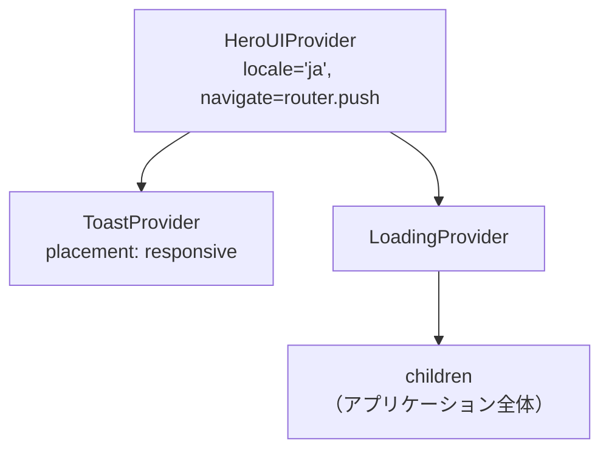

# 3-3-2 HeroUI と MUI

📝 **前提知識**: このセクションはセクション 3-3-1 Tailwind CSS の応用テクニックの内容を前提としています。

## 🎯 このセクションで学ぶこと

- UI コンポーネントライブラリの役割と、自作コンポーネントとの使い分けを理解する
- HeroUI と MUI の役割分担（メインライブラリと補助利用）を把握する
- Provider 設定（HeroUIProvider, ToastProvider, LoadingProvider）の仕組みを理解する
- LMS における 3 種類のラッピングパターン（シンプルパススルー、拡張ラッパー、直接利用）を識別できるようになる
- MUI の補助利用パターン（LocalizationProvider, sx prop, SSR ハイドレーション対策）を理解する

HeroUI と MUI がどのような役割分担で LMS に導入されているかを概観し、Provider 設定から個別コンポーネントのラッピングパターンまでを順に見ていきます。

---

## 導入: ボタンやモーダルを毎回自作する苦痛

Web アプリケーションには、ボタン、テキスト入力、モーダルダイアログ、テーブル、日付選択など、ほぼすべてのプロジェクトで必要になる UI 要素があります。セクション 3-3-1 で学んだ Tailwind CSS を使えば、これらの見た目は自由に作れます。しかし、見た目だけでは足りません。

たとえばモーダルダイアログを自作する場合、次のことをすべて自分で実装する必要があります。

- 背景のオーバーレイとクリック時の閉じる処理
- Escape キーでの閉じる処理
- フォーカストラップ（モーダル内でタブキーが循環する仕組み）
- アクセシビリティ属性（`role="dialog"`, `aria-modal` 等）
- 開閉アニメーション
- スクロール制御（モーダル表示中に背景がスクロールしない制御）

これをプロジェクト内のすべての UI 要素で行うのは、膨大な工数がかかるうえ、実装漏れによるアクセシビリティの問題やブラウザ間の不整合が発生しやすくなります。

**UI コンポーネントライブラリ** は、こうした「よく使われる UI 要素」を、動作ロジック・アクセシビリティ・アニメーションまで含めて提供するパッケージです。開発者はライブラリのコンポーネントを組み合わせるだけで、堅牢な UI を短時間で構築できます。

LMS では、2 つの UI コンポーネントライブラリを使い分けています。

| ライブラリ | バージョン | 役割 |
|---|---|---|
| **HeroUI** | @heroui/react ^2.7.10 | メインの UI ライブラリ。Button, Input, Modal, Table 等ほとんどの UI 要素を担当 |
| **MUI** | @mui/material ^5.15.11, @mui/x-date-pickers ^6.20.2 | 補助利用。HeroUI にない「年月選択」「ミニカレンダー」など特定の日付関連コンポーネントのみ |

この「メイン + 補助」という構成が、LMS の UI レイヤーの基本設計です。

### 🧠 先輩エンジニアはこう考える

> UI ライブラリの選定は、プロジェクト初期に一番悩むポイントの 1 つです。LMS では Tailwind CSS ベースの HeroUI をメインに採用しました。Tailwind との親和性が高く、`classNames` prop でスタイルを細かくカスタマイズできるのが決め手です。ただし、HeroUI には「年月だけを選択するピッカー」や「カレンダーを常時表示するウィジェット」がありません。そこだけ MUI の DatePicker 系コンポーネントで補っています。2 つのライブラリを混在させるとスタイルの統一が難しくなりますが、MUI の利用箇所を最小限に絞り、`sx` prop でデザインを合わせることで対処しています。

---

## Provider 設定: アプリ全体の土台を作る

UI コンポーネントライブラリを使うには、アプリケーションのルートに **プロバイダー** を配置する必要があります。プロバイダーは React の Context 機能を利用して、ライブラリの設定情報を配下のすべてのコンポーネントに渡す仕組みです。

LMS v2 では、`providers.tsx` というファイルに必要なプロバイダーをまとめています。

```tsx
// frontend/src/providers/v2/providers.tsx
'use client'

import { LoadingProvider } from '@/hooks/v2/useLoading'
import { isMobileDevice } from '@/lib/v2/device-detection'
import { HeroUIProvider } from '@heroui/react'
import { ToastProvider } from '@heroui/toast'
import { useRouter } from 'next/navigation'
import { useEffect, useState, type FC, type ReactNode } from 'react'

export const Providers: FC<{ children: ReactNode }> = ({ children }) => {
  const router = useRouter()
  const [placement, setPlacement] = useState<'top-center' | 'bottom-right'>('bottom-right')

  useEffect(() => {
    const handleResize = () => {
      setPlacement(isMobileDevice() ? 'top-center' : 'bottom-right')
    }
    handleResize()
    window.addEventListener('resize', handleResize)
    return () => window.removeEventListener('resize', handleResize)
  }, [])

  return (
    <HeroUIProvider locale='ja' navigate={router.push}>
      <ToastProvider placement={placement} toastProps={{ timeout: 1000 }} />
      <LoadingProvider>{children}</LoadingProvider>
    </HeroUIProvider>
  )
}
```

このコードには 3 つのプロバイダーがネストされています。それぞれの役割を見ていきましょう。

### HeroUIProvider

最も外側に配置される、HeroUI の中核プロバイダーです。2 つの重要な prop を受け取ります。

- **`locale='ja'`**: 日本語ロケールの設定。HeroUI の DatePicker やカレンダーコンポーネントの曜日・月名の表示言語に影響します
- **`navigate={router.push}`**: Next.js の `useRouter` から取得した `router.push` を渡しています。HeroUI の Link コンポーネントなどがクライアントサイドナビゲーションを行う際に、Next.js のルーターを使えるようにするための設定です

### ToastProvider

トースト通知（画面端に一時的に表示されるメッセージ）の設定を担当します。

- **`placement`**: トーストの表示位置。モバイルでは `'top-center'`（画面上部中央）、デスクトップでは `'bottom-right'`（画面右下）に切り替えています
- **`toastProps={{ timeout: 1000 }}`**: トーストが自動で消えるまでの時間（ミリ秒）

注目すべきは、表示位置をレスポンシブに切り替えるロジックです。`useEffect` 内で `isMobileDevice()` を呼び出し、さらに `resize` イベントを監視することで、画面サイズが変わったときにリアルタイムで表示位置が切り替わります。

### LoadingProvider

LMS 独自のプロバイダーで、アプリ全体のローディング状態を管理します。`useLoading` フックと連携して、API リクエスト中にローディングインジケーターを表示するための仕組みです。

💡 **TIP**: `'use client'` ディレクティブが先頭にあることに注目してください。プロバイダーは `useRouter` や `useState` といったフックを使うため、Client Component である必要があります。Next.js の App Router では、Server Component がデフォルトなので、このディレクティブを忘れるとエラーになります。

以下の図は、プロバイダーの入れ子構造を示しています。



---

## HeroUI の主要コンポーネント

HeroUI は、Tailwind CSS をベースにした React コンポーネントライブラリです。LMS では以下のようなコンポーネントが主に使われています。

| コンポーネント | 用途 |
|---|---|
| **Button** | ボタン。色・サイズ・ローディング状態などのバリエーション |
| **Input** | テキスト入力。ラベル・バリデーションエラー表示を内包 |
| **Modal** | モーダルダイアログ。ヘッダー・ボディ・フッターの構造 |
| **Table** | テーブル。ソート・ページネーション対応 |
| **DatePicker** | 日付選択。カレンダーポップアップ付き |
| **Accordion** | 折りたたみ。クリックで内容を展開 |
| **Autocomplete** | 補完付きセレクト。入力に応じて候補をフィルタリング |
| **Checkbox** | チェックボックス |

これらのコンポーネントを LMS でどのように利用しているかを見ると、大きく 3 つのパターンに分かれます。

---

## ラッピングパターン 1: シンプルパススルー

最も単純なパターンは、HeroUI のコンポーネントをそのまま薄くラップするだけの方法です。Button と Input がこのパターンに該当します。

```tsx
// frontend/src/components/v2/elements/Button.tsx
import type { ButtonProps as HeroButtonProps } from '@heroui/button'
import { Button as HeroButton } from '@heroui/button'

type Props = { children: React.ReactNode } & HeroButtonProps

export function Button({ children, ...props }: Props) {
  return <HeroButton {...props}>{children}</HeroButton>
}
```

```tsx
// frontend/src/components/v2/elements/Input.tsx
import type { InputProps as HeroInputProps } from '@heroui/react'
import { Input as HeroInput } from '@heroui/react'

type Props = HeroInputProps

export function Input({ ...props }: Props) {
  return <HeroInput {...props} />
}
```

この 2 つのコンポーネントは、事実上何も追加していません。HeroUI のコンポーネントをそのまま別名で re-export しているだけです。一見無意味に見えますが、このパターンには重要な意図があります。

🔑 **シンプルパススルーの目的**: プロジェクト内で HeroUI を直接 import する箇所を 1 か所に集約することで、将来ライブラリを差し替えるときの変更箇所を最小化できます。たとえば HeroUI の API が変わった場合でも、ラッパーファイルだけを修正すれば、利用側のコードには影響しません。

技術的なポイントとして、**スプレッド構文** (`...props`) が使われています。これは HeroUI の props をすべてそのまま内部のコンポーネントに渡す書き方です。Props の型も `HeroButtonProps` や `HeroInputProps` をそのまま継承しているため、HeroUI が提供するすべての prop（`color`, `size`, `isDisabled`, `isLoading` 等）を利用側からそのまま指定できます。

---

## ラッピングパターン 2: 拡張ラッパー

2 つ目のパターンは、HeroUI のコンポーネントを基にしつつ、独自の API を提供する方法です。Modal, Accordion, DatePicker, Autocomplete がこのパターンです。

### Modal: 複合コンポーネントの簡略化

HeroUI の Modal は、`Modal`, `ModalContent`, `ModalHeader`, `ModalBody`, `ModalFooter` という 5 つのコンポーネントを組み合わせて使う **複合コンポーネント** です。毎回これらを正しく組み合わせるのは手間がかかります。

LMS の Modal ラッパーは、`header`, `body`, `footer` を props として受け取り、内部で複合コンポーネントを組み立てます。

以下は主要部分の抜粋です。

```tsx
// frontend/src/components/v2/elements/Modal.tsx
import type { ModalProps as HeroModalProps } from '@heroui/react'
import {
  Modal as HeroModal, ModalBody as HeroModalBody,
  ModalContent as HeroModalContent, ModalFooter as HeroModalFooter,
  ModalHeader as HeroModalHeader,
} from '@heroui/react'

type Props = Omit<HeroModalProps, 'children'> & {
  isOpen: boolean
  header?: React.ReactNode
  body?: React.ReactNode
  footer?: (props: { onClose?: () => void }) => React.ReactNode
  onSubmit?: (e: React.FormEvent<HTMLFormElement>) => void
}

export function Modal({
  isOpen, header, body, scrollBehavior, footer,
  onSubmit = () => {}, onClose, ...props
}: Props) {
  return (
    <HeroModal isOpen={isOpen} scrollBehavior={scrollBehavior} onClose={onClose} {...props}>
      <HeroModalContent>
        {(onCloseFromContent) => {
          const handleClose = onClose || onCloseFromContent
          return (
            <form onSubmit={onSubmit} className='flex flex-1 flex-col'>
              {header && <HeroModalHeader className='text-xl font-bold'>{header}</HeroModalHeader>}
              {body && <HeroModalBody>{body}</HeroModalBody>}
              {footer && <HeroModalFooter>{footer({ onClose: handleClose })}</HeroModalFooter>}
            </form>
          )
        }}
      </HeroModalContent>
    </HeroModal>
  )
}
```

このラッパーが解決している問題を整理しましょう。

**1. API の簡略化**: 利用側は 5 つのコンポーネントを import して組み合わせる代わりに、1 つの `Modal` コンポーネントに `header`, `body`, `footer` を渡すだけで済みます。

**2. form 要素の統合**: `<form>` タグが自動的にモーダル全体を囲むため、フッターの送信ボタンが form の submit として機能します。`onSubmit` prop でフォーム送信時の処理を指定できます。

**3. onClose の受け渡し**: HeroUI の `ModalContent` は render prop パターン（子要素として関数を渡すパターン）で `onClose` を提供します。ラッパーはこの `onClose` を `footer` に自動的に渡すため、フッターのキャンセルボタンで確実にモーダルを閉じられます。

💡 **TIP**: `Omit<HeroModalProps, 'children'>` は TypeScript のユーティリティ型で、`HeroModalProps` から `children` プロパティを除外した型を作ります。ラッパーが独自の `header`, `body`, `footer` で内容を構成するため、元の `children` prop は不要になるからです。

### Accordion: classNames によるスタイルカスタマイズ

Accordion の拡張ラッパーは、HeroUI の **classNames** prop を活用したスタイルカスタマイズの例です。

```tsx
// frontend/src/components/v2/elements/Accordion.tsx
import { Accordion as HeroAccordion, AccordionItem as HeroAccordionItem } from '@heroui/react'

type Props = { children: React.ReactNode; title: string; className?: string }

export function Accordion({ children, title, className }: Props) {
  return (
    <HeroAccordion className={className}>
      <HeroAccordionItem key='1' aria-label={title} title={title}
        classNames={{
          base: 'rounded-lg overflow-hidden',
          heading: 'bg-background-subtle',
          content: 'bg-background-subtle',
          trigger: 'px-4',
          title: 'text-text-primary',
          indicator: 'text-text-primary',
        }}
      >
        <div className='bg-background-subtle px-2 py-5'>{children}</div>
      </HeroAccordionItem>
    </HeroAccordion>
  )
}
```

🔑 **classNames prop**: HeroUI のコンポーネントは、内部の各パーツに対して個別にクラス名を指定できる `classNames` prop を持っています。`base`, `heading`, `content`, `trigger`, `title`, `indicator` というキーが、Accordion 内部の各要素に対応しています。これにより、コンポーネントの構造を変更せずに、Tailwind CSS のクラスで見た目を細かく調整できます。

このパターンは HeroUI と Tailwind CSS が組み合わさる LMS ならではのアプローチです。セクション 3-3-1 で学んだ Tailwind のユーティリティクラスが、ここで直接活用されています。

---

## ラッピングパターン 3: 直接利用

3 つ目のパターンは、ラッパーを作らず HeroUI のコンポーネントを直接使う方法です。Table と `addToast` がこのパターンに該当します。

### Table: 複雑な構造をそのまま使う

Table は、表示するデータの構造がページごとに大きく異なるため、汎用的なラッパーを作ることが難しいコンポーネントです。そのため、利用箇所で HeroUI の Table 系コンポーネントを直接 import して使います。

```tsx
// frontend/src/features/v2/userTerm/components/UserTermTable.tsx
import { Table, TableBody, TableCell, TableColumn, TableHeader, TableRow } from '@heroui/react'

export function UserTermTable({ userTerms }: Props) {
  return (
    <Table aria-label='所属ターム' removeWrapper>
      <TableHeader>
        <TableColumn className='text-left text-sm font-semibold'>ターム</TableColumn>
        <TableColumn className='text-left text-sm font-semibold'>開始日</TableColumn>
      </TableHeader>
      <TableBody>
        {userTerms.map((userTerm) => (
          <TableRow key={userTerm.id}>
            <TableCell className='text-left text-sm'>{/* ... */}</TableCell>
          </TableRow>
        ))}
      </TableBody>
    </Table>
  )
}
```

`Table`, `TableHeader`, `TableColumn`, `TableBody`, `TableRow`, `TableCell` という 6 つのコンポーネントを組み合わせる複合コンポーネントパターンです。Modal とは異なり、カラムの数や内容がテーブルごとに異なるため、ラッパーで抽象化するメリットよりも、直接利用して柔軟に構成するメリットの方が大きいと判断されています。

`aria-label='所属ターム'` はアクセシビリティのためのラベルで、スクリーンリーダーがテーブルの内容を読み上げる際に使われます。`removeWrapper` はデフォルトの外枠スタイルを除去する prop です。

---

## ラッピングパターンのまとめ

3 つのパターンをまとめると、次のようになります。

| パターン | コンポーネント例 | 戦略 | 判断基準 |
|---|---|---|---|
| シンプルパススルー | Button, Input, Checkbox | HeroUI をそのまま薄くラップ | API 変更不要、ライブラリ依存の集約が目的 |
| 拡張ラッパー | Modal, DatePicker, Accordion, Autocomplete | 独自の簡略化 API を提供 | 元の API が複雑、またはプロジェクト固有のスタイル統一が必要 |
| 直接利用 | Table, addToast | ラッパーなしで直接使用 | 利用箇所ごとに構造が大きく異なる、または関数呼び出しで十分 |

🔑 **パターン選択の判断基準**: ラッパーを作るかどうかは「利用箇所での使い方がどれだけ統一されているか」で決まります。Button のように全箇所で同じ API を使うならパススルーで十分です。Modal のように毎回同じ構造（ヘッダー + ボディ + フッター）を組み立てるなら、拡張ラッパーで簡略化する価値があります。Table のように利用ごとに構造が異なるなら、ラッパーは逆に邪魔になります。

---

## MUI の補助利用

HeroUI がメインの UI ライブラリですが、HeroUI にはない機能が必要な場面では MUI（Material UI）を補助的に利用しています。LMS で MUI が使われているのは、年月選択と日付カレンダーの 2 箇所です。

### YearMonthDatePicker: 年月だけを選ぶ

通常の日付選択は「年月日」を選びますが、LMS には「年月」だけを選択する UI が必要な箇所があります。HeroUI の DatePicker にはこの機能がないため、MUI の DatePicker を `views` prop で制限して実現しています。

```tsx
// frontend/src/components/v2/elements/YearMonthDatePicker.tsx
import { AdapterDayjs } from '@mui/x-date-pickers/AdapterDayjs'
import { DatePicker } from '@mui/x-date-pickers/DatePicker'
import { LocalizationProvider } from '@mui/x-date-pickers/LocalizationProvider'

export function YearMonthDatePicker({ value, onChange, placeholder, className }: Props) {
  return (
    <div className={className}>
      <LocalizationProvider dateAdapter={AdapterDayjs}>
        <DatePicker
          views={['month', 'year']}
          format='YYYY年M月'
          value={value}
          onChange={onChange}
          slotProps={{
            textField: {
              placeholder,
              sx: {
                width: '176px',
                '& .MuiInputBase-root': {
                  height: '32px',
                  backgroundColor: '#FFFFFF',
                  border: '1px solid #E5E7EB',
                  borderRadius: '6px',
                },
                '& .MuiInputBase-input': {
                  padding: '4px 12px',
                  fontSize: '14px',
                },
                '& .MuiOutlinedInput-notchedOutline': {
                  border: 'none',
                },
              },
            },
          }}
        />
      </LocalizationProvider>
    </div>
  )
}
```

このコードには、MUI を使う際の 3 つの重要な概念が含まれています。

### LocalizationProvider と日付アダプター

MUI の日付関連コンポーネントは、**LocalizationProvider** で囲む必要があります。これは HeroUI の HeroUIProvider と同じく、設定を子コンポーネントに渡すためのプロバイダーです。

`dateAdapter` prop には日付ライブラリのアダプターを渡します。YearMonthDatePicker では `AdapterDayjs`（dayjs ライブラリ用）を、後述する MiniCalendar では `AdapterDateFns`（date-fns ライブラリ用）を使っています。

📝 **なぜ日付アダプターが 2 種類あるのか**: MUI は特定の日付ライブラリに依存しない設計になっています。dayjs, date-fns, luxon, moment など、プロジェクトで使っている日付ライブラリに合わせてアダプターを選択できます。LMS では機能の開発時期によって異なるアダプターが使われていますが、動作上の問題はありません。

### sx prop: MUI のインラインスタイル

MUI コンポーネントのスタイルをカスタマイズするには、**sx prop** を使います。sx prop は CSS プロパティをオブジェクトとして記述する仕組みで、Tailwind CSS のユーティリティクラスとは異なるアプローチです。

```tsx
sx: {
  width: '176px',
  '& .MuiInputBase-root': {
    height: '32px',
    backgroundColor: '#FFFFFF',
  },
}
```

`'& .MuiInputBase-root'` のような記述は、CSS のセレクタ構文です。`&` は現在の要素を指し、`.MuiInputBase-root` は MUI が内部的に付与するクラス名です。これにより、コンポーネント内部の特定の要素にスタイルを適用できます。

⚠️ **注意**: sx prop と Tailwind CSS は併用できますが、スタイルの適用方法がまったく異なります。Tailwind CSS はユーティリティクラス（`className`）、sx prop はインラインのスタイルオブジェクトです。LMS では MUI コンポーネントのスタイル調整は sx prop で行い、レイアウトの配置などは Tailwind CSS で行うという使い分けをしています。

### slotProps パターン

MUI の DatePicker は、内部に複数の子コンポーネント（テキストフィールド、カレンダーポップアップ等）を持っています。`slotProps` は、これらの内部コンポーネントに個別に props を渡すための仕組みです。

上のコードでは `slotProps.textField` に `placeholder` と `sx` を渡し、テキスト入力部分のスタイルをカスタマイズしています。HeroUI の `classNames` prop と目的は似ていますが、記述方法が異なります。

| ライブラリ | 内部要素のカスタマイズ方法 |
|---|---|
| HeroUI | `classNames` prop に Tailwind CSS のクラス名を渡す |
| MUI | `slotProps` と `sx` prop で CSS プロパティをオブジェクトとして渡す |

---

## MiniCalendar: SSR ハイドレーション対策

もう 1 つの MUI 利用箇所が、スケジュール機能で使われる MiniCalendar です。このコンポーネントには、MUI の利用に加えてもう 1 つ重要なパターンが含まれています。

```tsx
// frontend/src/features/v2/schedule/components/MiniCalendar.tsx
import { LocalizationProvider } from '@mui/x-date-pickers'
import { AdapterDateFns } from '@mui/x-date-pickers/AdapterDateFnsV3'
import { DateCalendar } from '@mui/x-date-pickers/DateCalendar'
import { ja } from 'date-fns/locale/ja'

export function MiniCalendar({ selectDate, onChange }: Props) {
  const [isClient, setIsClient] = useState(false)
  useEffect(() => { setIsClient(true) }, [])
  if (!isClient) return null  // Hydration safety

  return (
    <LocalizationProvider dateAdapter={AdapterDateFns} adapterLocale={ja}>
      <DateCalendar value={selectDate} onChange={debouncedHandleChange}
        sx={{
          width: '90%',
          '& .MuiPickersCalendarHeader-label': { fontWeight: 'bold' },
        }}
      />
    </LocalizationProvider>
  )
}
```

### isClient パターン

コードの冒頭にある `isClient` ステートに注目してください。

```tsx
const [isClient, setIsClient] = useState(false)
useEffect(() => { setIsClient(true) }, [])
if (!isClient) return null
```

この 3 行は **SSR ハイドレーション対策** です。Next.js では、サーバー側で HTML をレンダリングし（SSR）、クライアント側でその HTML に React のイベントハンドラーを紐付けます（ハイドレーション）。このとき、サーバーとクライアントのレンダリング結果が一致しないと、ハイドレーションエラーが発生します。

MUI の DateCalendar は、内部的にブラウザの `window` オブジェクトやロケール設定に依存するため、サーバー側ではレンダリングできません。そこで、`useEffect`（クライアント側でのみ実行される）で `isClient` を `true` に切り替え、サーバー側では `null`（何も表示しない）を返すことで、ハイドレーションの不一致を防いでいます。

🔑 **isClient パターンの使いどころ**: ブラウザ固有の API（`window`, `document`, `localStorage` 等）に依存するコンポーネントや、サーバーとクライアントで異なる結果を返す可能性のあるコンポーネントで使います。MUI に限らず、SSR 対応のアプリケーション全般で頻出するパターンです。

---

## addToast によるフィードバック

ユーザーの操作に対してフィードバックを返すことは、UI の基本です。LMS では HeroUI の **addToast** 関数を使って、画面端にトースト通知を表示しています。

```tsx
import { addToast } from '@heroui/react'

// 操作成功時
addToast({ title: '作成しました', color: 'success' })

// エラー発生時
addToast({ title: '失敗しました', description: 'もう一度お試しください', color: 'danger' })
```

`addToast` はコンポーネントではなく関数です。React の JSX の中に配置するのではなく、イベントハンドラーや API レスポンスの処理内で呼び出します。

### color による使い分け

| color | 用途 | 使用場面の例 |
|---|---|---|
| `'success'` | 操作が正常に完了した | データの保存成功、ユーザーの作成完了 |
| `'danger'` | エラーが発生した | API エラー、バリデーション失敗 |
| `'warning'` | 注意が必要な状態 | 一部のデータが保存されなかった等 |

`addToast` はラッパーを作らず直接利用されています（ラッピングパターン 3）。関数呼び出しという単純な API であり、ラッパーで簡略化する余地がほとんどないためです。

なお、`addToast` が機能するには、先述の `ToastProvider` がアプリケーションのルートに配置されている必要があります。Provider の設定で見た `placement`（表示位置）や `timeout`（表示時間）が、ここで呼び出されるすべてのトーストに適用されます。

---

## ✨ まとめ

- **UI コンポーネントライブラリ** は、ボタン・モーダル・テーブルなどの汎用 UI 要素を、動作ロジック・アクセシビリティ・アニメーション込みで提供するパッケージです
- LMS では **HeroUI** をメイン、**MUI** を補助として使い分けています。MUI の利用は年月選択（YearMonthDatePicker）とカレンダー表示（MiniCalendar）に限定されています
- **Provider 設定** は `providers.tsx` に集約されており、HeroUIProvider（ロケール・ナビゲーション）、ToastProvider（レスポンシブな通知位置）、LoadingProvider（ローディング状態）の 3 つがネストされています
- LMS のラッピングパターンは 3 種類あります。**シンプルパススルー** （Button, Input）はライブラリ依存の集約、**拡張ラッパー** （Modal, Accordion）は API の簡略化やスタイル統一、**直接利用** （Table, addToast）は柔軟性が優先される場面で使われます
- MUI を使う際は **LocalizationProvider** と日付アダプターの設定が必要です。スタイル調整には **sx prop** と **slotProps** を使います
- SSR 環境でブラウザ依存のコンポーネントを安全にレンダリングするために、**isClient パターン** が使われています

---

次のセクションでは、Emotion（CSS-in-JS）の仕組みと LMS での使用箇所、そして Iconify によるアイコン管理パターンについて学びます。
