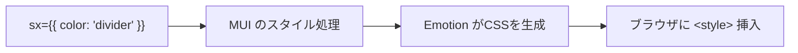
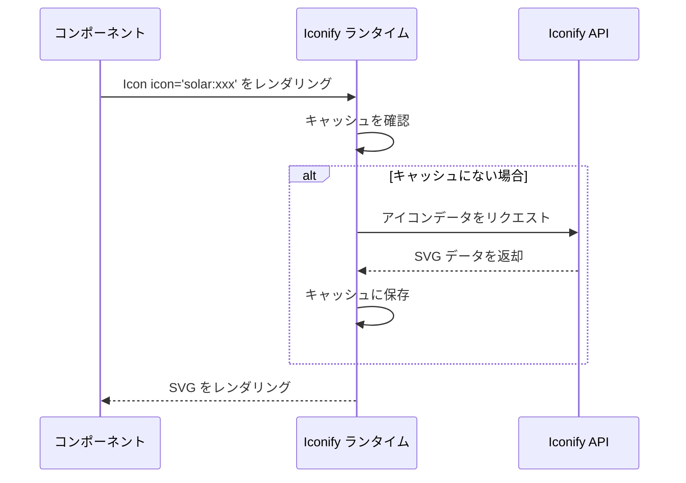
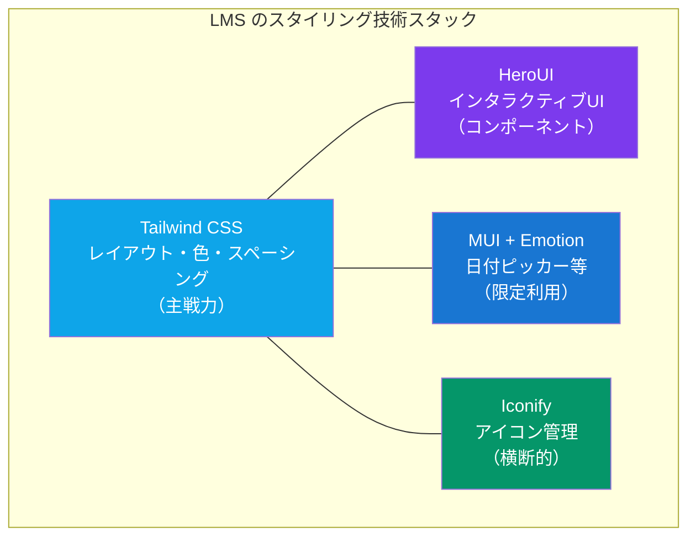

# 3-3-3 CSS-in-JS と Iconify

📝 **前提知識**: このセクションはセクション 3-3-1 Tailwind CSS の応用テクニックの内容を前提としています。

## 🎯 このセクションで学ぶこと

- CSS-in-JS の概念と、Emotion が LMS で果たしている役割（MUI の内部スタイリングエンジン）を理解する
- MUI の `sx` prop が Tailwind CSS では対応できないケースをどう解決するかを理解する
- Iconify によるアイコン管理パターンと、LMS で使われている 4 つのアイコンセットを把握する
- LMS のスタイリング技術全体像を整理し、各技術の担当領域を理解する

セクション 3-3-1 で学んだ Tailwind CSS、セクション 3-3-2 で学んだ HeroUI と MUI に続き、LMS のスタイリング技術の残りのピースである Emotion と Iconify を学びます。最後に、Chapter 3-3 全体を振り返り、LMS のスタイリング技術マップを完成させます。

---

## 導入: Tailwind と HeroUI でカバーできない領域

セクション 3-3-1 で、Tailwind CSS がレイアウト・スペーシング・色・タイポグラフィといった LMS のスタイリングの 95% 以上をカバーしていることを学びました。セクション 3-3-2 では、HeroUI と MUI がインタラクティブなコンポーネント（ボタン、モーダル、日付ピッカーなど）を提供していることを確認しました。

しかし、LMS のコードベースを読み進めると、Tailwind のユーティリティクラスでは表現できないスタイリングパターンに出会います。たとえば、MUI の `DateCalendar` コンポーネントの内部要素（カレンダーヘッダーや曜日ラベル）のスタイルをカスタマイズする場面です。これらの内部要素は `.MuiPickersCalendarHeader-root` のような MUI 固有のクラス名を持っており、Tailwind のユーティリティクラスでは直接指定できません。

また、LMS では 316 以上のアイコンが使われていますが、これらを個別の SVG ファイルとして管理していては、検索性も一貫性も失われます。

このセクションでは、これら 2 つの課題を解決する技術、**Emotion** （CSS-in-JS）と **Iconify** （アイコン管理）を学びます。

### 🧠 先輩エンジニアはこう考える

> LMS のスタイリングは「Tailwind でできることは Tailwind でやる」が基本方針です。ただ、MUI コンポーネントの内部をカスタマイズするときだけは、どうしても Tailwind の枠を超える必要があります。Emotion を直接使うことはほぼありませんが、MUI の `sx` prop の裏側で動いている仕組みを知っておくと、カレンダーやテーブルのスタイリングで「なぜこう書くのか」が腑に落ちます。アイコンについては、以前は複数のアイコンライブラリから個別にインポートしていて統一感がなかったのですが、Iconify に一本化してからは `icon='solar:xxx'` のようにアイコンセットを横断して使えるようになり、管理がとても楽になりました。

---

## CSS-in-JS とは何か

**CSS-in-JS** は、CSS のスタイル定義を JavaScript（TypeScript）のコードの中に記述するアプローチの総称です。従来は `.css` ファイルにスタイルを書いて HTML から読み込んでいましたが、CSS-in-JS ではコンポーネントのロジックとスタイルを同じファイルにまとめます。

代表的な CSS-in-JS ライブラリには **styled-components** と **Emotion** があります。LMS では **Emotion** が使われていますが、あなたが直接 Emotion の API を呼ぶことはありません。ここが重要なポイントです。

🔑 **ポイント**: LMS における Emotion は、MUI v5 の内部スタイリングエンジンとして間接的に利用されています。`@emotion/react`、`@emotion/styled`、`@emotion/cache` の 3 パッケージがインストールされていますが、これらは MUI が内部で使うためのものです。

### Emotion が MUI の裏側で動く仕組み

MUI v5 はスタイリングエンジンとして Emotion を採用しています。あなたが MUI コンポーネントに `sx` prop を渡すと、MUI は内部で Emotion を使ってそのスタイルを CSS に変換し、ブラウザに適用します。



この仕組みにより、`sx` prop に渡したオブジェクトが実行時に CSS に変換されます。Tailwind が ビルド時に静的な CSS クラスを生成するのとは対照的に、Emotion は実行時に動的にスタイルを生成します。

💡 **TIP**: LMS の `package.json` に `@emotion/react ^11.11.4`、`@emotion/styled ^11.11.0`、`@emotion/cache ^11.14.0` が含まれているのは、MUI の依存関係として必要だからです。LMS のアプリケーションコードで `import styled from '@emotion/styled'` のように直接インポートしている箇所はありません。

---

## MUI の sx prop: Tailwind では対応できないケース

セクション 3-3-2 で MUI コンポーネントの基本的な使い方を学びましたが、ここでは `sx` prop が必要になる具体的な場面を掘り下げます。Tailwind CSS では対応できないケースは、大きく 3 つのパターンに分類できます。

### パターン 1: ネストセレクタによる内部要素の指定

MUI のコンポーネントは、内部に複数の子要素を持ちます。たとえば `DateCalendar` は、カレンダーヘッダー、曜日ラベル、日付セルなどの内部要素で構成されます。これらの内部要素には `.MuiPickersCalendarHeader-root` のような MUI 固有のクラス名が付けられており、`sx` prop の **ネストセレクタ** で指定します。

以下は LMS の実コードです。

```tsx
{/* frontend/src/app/v1/renewal/.../Client.tsx */}
<DateCalendar
  sx={{
    width: '90%',
    '& .MuiPickersCalendarHeader-root': { paddingLeft: '8px', paddingRight: '0' },
    '& .MuiPickersCalendarHeader-label': { fontWeight: 'bold' },
    '& .MuiDayCalendar-weekDayLabel': { color: 'text.primary' },
  }}
/>
```

`&` は CSS の親セレクタを表し、`& .MuiPickersCalendarHeader-root` は「この `DateCalendar` コンポーネントの中にある `.MuiPickersCalendarHeader-root` クラスの要素」を意味します。Tailwind CSS にはこのような子要素のクラス名を指定してスタイルを当てる仕組みがないため、`sx` prop が必要になります。

### パターン 2: 擬似セレクタの組み合わせ

CSS には `&:last-child` のような擬似セレクタがあり、特定の条件に合致する要素だけにスタイルを適用できます。次の例では、テーブルの最後の行だけボーダーを消しています。

```tsx
{/* frontend/src/app/v1/renewal/.../Client.tsx */}
<Table sx={{ minWidth: 650 }} aria-label='simple table'>
  <TableBody>
    {userExams.map((userExam) => (
      <TableRow sx={{ '&:last-child td, &:last-child th': { border: 0 } }}>
        <TableCell>{userExam.name}</TableCell>
      </TableRow>
    ))}
  </TableBody>
</Table>
```

`'&:last-child td, &:last-child th'` は「最後の `TableRow` の中にある `td` と `th` 要素」を対象にしています。このような複合的な擬似セレクタの組み合わせは、Tailwind の `last:` バリアントだけでは表現できません。Tailwind の `last:border-0` は要素自身にしか適用されず、「最後の親要素の中の子要素」という関係を指定できないためです。

### パターン 3: テーマ対応値の参照

MUI にはテーマシステムがあり、色やスペーシングなどのデザイントークンが定義されています。`sx` prop では、これらのテーマ値を文字列で参照できます。

```tsx
{/* frontend/src/app/v1/renewal/.../Client.tsx */}
<Box sx={{ borderBottom: 1, borderColor: 'divider' }} className='mt-4'>
  <Tabs value={value} onChange={handleChange}>
    <Tab label='受講生としてログイン' className='w-1/2' />
  </Tabs>
</Box>
```

ここで `borderColor: 'divider'` は MUI テーマに定義された色を参照しています。`#e0e0e0` のような具体的な色コードではなく、テーマのセマンティックな名前を使うことで、テーマが変更されたときに自動的に追従します。

💡 **TIP**: 上の例のように、`sx` prop と Tailwind の `className` は同じ要素に共存できます。`Box` に `sx` でボーダー色を指定しつつ、`className='mt-4'` でマージンを Tailwind で指定しています。LMS では「MUI のテーマに関わる部分は `sx`、それ以外は Tailwind」という使い分けが一般的です。

### 3 つのパターンの整理

| パターン | sx prop の記法例 | Tailwind で対応できない理由 |
|---|---|---|
| ネストセレクタ | `'& .MuiXxx-root': { ... }` | MUI 内部クラス名を指定する手段がない |
| 擬似セレクタの組み合わせ | `'&:last-child td': { ... }` | 親の擬似状態に基づく子要素の指定ができない |
| テーマ対応値 | `borderColor: 'divider'` | MUI テーマシステムの値を参照する手段がない |

⚠️ **注意**: `sx` prop は MUI コンポーネントでのみ使えます。通常の HTML 要素（`<div>` など）や HeroUI コンポーネントには適用できません。MUI の `Box`、`Table`、`Tabs` などの MUI コンポーネントに限定された機能です。

---

## Iconify によるアイコン管理

LMS のアイコン管理は **Iconify** （`@iconify/react ^6.0.2`）に統一されています。Iconify は、複数のアイコンセットを単一のコンポーネントで横断的に利用できるライブラリです。

### なぜ Iconify を使うのか

Web アプリケーションでアイコンを使う方法はいくつかあります。

- **SVG ファイルを直接管理する**: アイコンごとに `.svg` ファイルを用意する。ファイル数が多くなると管理が煩雑
- **アイコンフォント（Font Awesome など）**: フォントファイルとして一括読み込み。使わないアイコンもすべて含まれるためサイズが大きい
- **個別アイコンライブラリ**: `react-icons` や `@heroicons/react` のようにセットごとに個別パッケージをインストール。複数セットを使うとインポート先がばらばらになる

Iconify はこれらの課題を解決します。200 以上のアイコンセット（20 万以上のアイコン）を `Icon` コンポーネント 1 つで利用でき、使用するアイコンだけをオンデマンドで読み込みます。

🔑 **ポイント**: Iconify のアイコン指定は `"アイコンセット名:アイコン名"` という文字列形式です。たとえば `"solar:pen-new-square-linear"` は、`solar` セットの `pen-new-square-linear` アイコンを意味します。

### Icon コンポーネントの基本

LMS での Iconify の使い方は非常にシンプルです。

```tsx
import { Icon } from '@iconify/react'

// 基本的な使い方
<Icon icon='solar:hamburger-menu-outline' className='size-6' />
```

`Icon` コンポーネントは `icon` prop にアイコン識別子を受け取り、SVG としてレンダリングします。サイズや色は Tailwind CSS のクラスで制御するのが LMS の標準パターンです。

| Tailwind クラス | 効果 | 例 |
|---|---|---|
| `size-4` / `size-5` / `size-6` | アイコンの幅と高さを指定 | 16px / 20px / 24px |
| `text-brand-primary` | アイコンの色を指定 | ブランドカラー |
| `text-text-primary` | テキストカラーに合わせる | テキストと同色 |

💡 **TIP**: `size-6` は Tailwind CSS の `width: 1.5rem; height: 1.5rem;` に相当します。`w-6 h-6` と書いても同じですが、LMS では `size-6` のショートハンドが使われています。

### LMS で使われる 4 つのアイコンセット

LMS では、用途や見た目のトーンに応じて 4 つのアイコンセットを使い分けています。

| アイコンセット | プレフィックス | 特徴 | 主な用途 |
|---|---|---|---|
| Solar | `solar:` | ビジネス向けの洗練されたデザイン。linear（線）と bold（塗り）のバリエーション | メインの UI アイコン全般 |
| Lucide | `lucide:` | シンプルで視認性の高い線画アイコン | 閉じるボタン、基本操作 |
| Heroicons | `heroicons:` | Tailwind CSS 公式チームが作成したアイコンセット | 補助的な UI アイコン |
| Material Design Icons | `mdi:` | Google Material Design に準拠した大規模アイコンセット | 特定のコンテキストで利用 |

💡 **TIP**: LMS では **Solar** が最も多く使われているプライマリのアイコンセットです。新しい画面を作る場合は、まず Solar セットから探すのが良いでしょう。

### 使用箇所のカテゴリ

LMS のコードを読むと、Iconify アイコンは大きく 3 つのカテゴリで使われていることがわかります。

**ナビゲーション**

メニューの開閉やページ遷移に関わるアイコンです。

```tsx
{/* frontend/src/app/v2/user/.../Client.tsx */}
<button onClick={chapterList.close} aria-label='章一覧を閉じる'>
  <Icon icon='lucide:x' className='size-6' />
</button>
<button onClick={chapterList.open} aria-label='章一覧を開く'>
  <Icon icon='solar:hamburger-menu-outline' className='size-6' />
</button>
```

閉じるボタンには `lucide:x`、ハンバーガーメニューには `solar:hamburger-menu-outline` が使われています。`aria-label` でアクセシビリティも確保している点に注目してください。

**ボタンコンテンツ**

HeroUI の `Button` コンポーネントの `startContent` prop にアイコンを渡すパターンです。

```tsx
{/* frontend/src/features/v2/aiChatbot/components/AiChatbotChat.tsx */}
<Button
  variant='bordered'
  size='sm'
  onPress={onNewQuestion}
  startContent={<Icon icon='solar:pen-new-square-linear' className='size-4' />}
>
  新しい質問をする
</Button>
```

ボタンのテキストの左側にアイコンを配置しています。`size-4`（16px）はボタン内のアイコンとして適切なサイズです。

**ステータス表示**

状態や属性を視覚的に伝えるアイコンです。

```tsx
{/* frontend/src/features/v2/aiChatbot/components/AiChatbotConversationDetail.tsx */}
<div className='flex items-center gap-2'>
  <Icon icon='solar:bot-linear' className='size-5 text-brand-primary' />
  <p className='text-base font-bold text-text-primary'>
    {conversation?.title ?? 'AIアシスタント'}
  </p>
</div>
```

AI チャットボットのアイコンに `text-brand-primary` クラスを適用して、ブランドカラーで表示しています。アイコンとテキストを `flex items-center gap-2` で横並びにするのは LMS 全体で頻出するパターンです。

### Iconify のアイコン読み込みの仕組み

Iconify は、アイコンデータを **Iconify API** （`api.iconify.design`）からオンデマンドで取得します。初回表示時にネットワークリクエストが発生しますが、取得したアイコンはブラウザにキャッシュされるため、2 回目以降は即座に表示されます。



⚠️ **注意**: オンデマンド取得のため、オフライン環境やネットワークが不安定な環境ではアイコンが表示されない可能性があります。プロダクション環境では通常問題になりませんが、ローカル開発時にネットワーク接続を確認してください。

---

## LMS のスタイリング技術マップ

Chapter 3-3 で学んできた 4 つの技術の担当領域を整理しましょう。

| 技術 | バージョン | 担当領域 | 使用割合 |
|---|---|---|---|
| Tailwind CSS | 3.x | レイアウト、スペーシング、色、タイポグラフィ、レスポンシブ、アニメーション | 95% 以上 |
| HeroUI | - | インタラクティブコンポーネント（Button, Modal, Table, Input 等） | コンポーネント単位 |
| MUI + Emotion | MUI v5 / Emotion 11 | 日付ピッカー、カレンダー、一部レガシーコンポーネント | 限定的 |
| Iconify | 6.x | アイコン管理（4 アイコンセット、316 以上のインスタンス） | アイコン全般 |

この表の見方のポイントは、**各技術の守備範囲が明確に分かれている** ことです。



🔑 **ポイント**: スタイリングの判断フローは次のとおりです。

1. まず **Tailwind CSS** で対応できないか検討する
2. インタラクティブなコンポーネントが必要なら **HeroUI** を使う
3. HeroUI にないコンポーネント（日付ピッカーなど）は **MUI** を使い、内部スタイリングに `sx` prop を活用する
4. アイコンが必要なら **Iconify** の `Icon` コンポーネントを使い、サイズ・色は Tailwind クラスで制御する

この判断フローは、LMS のコードベースを読むときの見通しを大きく改善します。ある要素のスタイルがどの技術で制御されているかがすぐにわかるようになるからです。

📝 **補足**: Tailwind CSS は HeroUI、MUI、Iconify のすべてと組み合わせて使われます。`className` による Tailwind のスタイル指定は、どの UI ライブラリのコンポーネントにも適用できるため、スタイリングの「共通語」として機能しています。

---

## ✨ まとめ

- **Emotion** は CSS-in-JS ライブラリだが、LMS では MUI v5 の内部スタイリングエンジンとして間接的に利用されている。直接 Emotion の API を使うことはない
- MUI の **sx prop** は、ネストセレクタ（MUI 内部クラスの指定）、擬似セレクタの組み合わせ（`&:last-child td`）、テーマ対応値（`'divider'`）の 3 パターンで、Tailwind CSS では対応できない場面をカバーする
- **Iconify** は `"セット名:アイコン名"` の文字列指定で、複数のアイコンセットを統一的に扱う。LMS では Solar / Lucide / Heroicons / MDI の 4 セットを使い分けている
- アイコンのサイズ・色は Tailwind CSS のクラス（`size-6`、`text-brand-primary`）で制御するのが LMS の標準パターン
- LMS のスタイリング技術は **Tailwind CSS** （主戦力）、**HeroUI** （インタラクティブ UI）、**MUI + Emotion** （限定利用）、**Iconify** （アイコン）の 4 層構造になっている

---

Chapter 3-3 では、Tailwind CSS の設計思想から HeroUI / MUI のコンポーネントライブラリ、そして Emotion と Iconify まで、LMS のスタイリング技術の全体像を学びました。これらは UI の「見た目」を担う技術ですが、LMS にはさらにリッチなコンテンツを扱うための専門的なライブラリ群があります。次の Chapter 3-4 リッチコンテンツと可視化では、BlockNote のブロックベースエディタの仕組み、react-markdown + remark/rehype プラグインによる Markdown レンダリング、FullCalendar によるスケジュール管理、Chart.js によるデータ可視化、そして dnd-kit によるドラッグ＆ドロップの実装パターンを学んでいきます。
