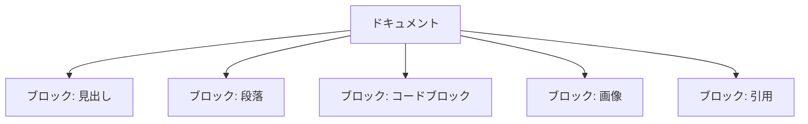
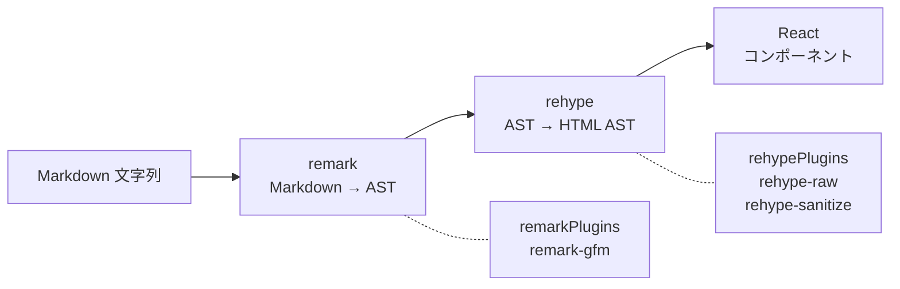

# 3-4-1 BlockNote エディタと Markdown レンダリング

Chapter 04 では、LMS のリッチな UI を支えるライブラリ群を学びます。プレーンなテキストやフォームでは表現しきれない、エディタ・カレンダー・チャート・ドラッグ＆ドロップといった機能がどのように実装されているかを理解するのがこの Chapter のゴールです。

| セクション | テーマ |
|---|---|
| 3-4-1（このセクション） | BlockNote エディタと Markdown レンダリング |
| 3-4-2 | FullCalendar と Chart.js |
| 3-4-3 | dnd-kit によるドラッグ＆ドロップ |

📖 **この Chapter の進め方**: 各セクションは独立した概念解説です。順番に読むと「入力 → 表示 → インタラクション」の流れで LMS のリッチ UI を網羅できますが、興味のあるセクションから読んでも構いません。

## 🎯 このセクションで学ぶこと

- BlockNote のブロックベースエディタの仕組みと、LMS で定義されたカスタムブロックの構造を理解する
- LMS の質問エディタ（Markdown テキストエリア + プレビュー切替）の仕組みを理解する
- react-markdown + remark/rehype プラグインによる Markdown レンダリングパイプラインを理解する
- LMS 独自のカスタマイズ（メッセージブロック、シンタックスハイライト、Mermaid 図、セキュリティ対策）を把握する

このセクションでは、まず「リッチテキスト編集」の課題から入り、BlockNote のブロックモデルを概観した後、LMS が実際に採用している Markdown ベースのエディタとレンダリングの仕組みを詳しく見ていきます。

---

## 導入: テキストエリアだけでは伝わらない

LMS には「質問機能」があります。受講生がつまずいたポイントをエンジニアに質問し、回答をもらうための機能です。質問の内容には、エラーメッセージのコードブロック、手順を示す番号付きリスト、スクリーンショット画像など、プレーンテキストでは表現しきれない要素が頻繁に含まれます。

HTML の `<textarea>` だけでは、こうしたリッチな表現を扱えません。かといって、ゼロからリッチテキストエディタを構築するのは非常に大変です。ここで選択肢は大きく2つに分かれます。

1. **ブロックベースエディタ**（Notion のような WYSIWYG）を導入する
2. **Markdown テキストエリア + プレビュー**（GitHub Issues のような方式）で対応する

LMS では当初 BlockNote というブロックベースエディタを導入しましたが、現在は Markdown テキストエリア + プレビューの方式に切り替えています。このセクションでは両方の仕組みを理解し、Markdown レンダリングの実装を深掘りします。

### 🧠 先輩エンジニアはこう考える

> リッチテキストエディタの選定は、想像以上に影響範囲が大きいです。WYSIWYG エディタはユーザー体験が良い反面、エディタが出力するデータ構造（JSON やカスタム HTML）の扱いが複雑になります。保存・検索・バージョン管理すべてに影響するんです。LMS では BlockNote を試した結果、Markdown ベースに切り替えました。Markdown なら保存はプレーンテキストで済みますし、Git やデータベースとの相性も良い。コードブロックや画像もシンタックスで書ける。トレードオフを理解した上での判断でした。

---

## BlockNote のブロックベースモデル

**BlockNote** は、Notion のようなブロックベースのリッチテキストエディタを React アプリケーションに組み込むためのライブラリです。LMS では `@blocknote/core` ^0.12.4 と `@blocknote/react` ^0.12.4 が使われています。

### ブロックとは何か

BlockNote の中核概念は **ブロック** です。エディタ内のすべてのコンテンツは、ブロックの配列として表現されます。



各ブロックは以下の構造を持ちます。

| プロパティ | 説明 |
|---|---|
| `type` | ブロックの種類（paragraph, heading, codeBlock 等） |
| `props` | ブロック固有の設定（テキスト配置、色、src 等） |
| `content` | ブロックの中身。`'inline'`（テキスト入力可）または `'none'`（装飾のみ） |
| `children` | ネストされた子ブロック |

🔑 **ポイント**: ブロックベースモデルでは、ドキュメント全体が構造化された JSON として表現されます。これは `<textarea>` のプレーンテキストとは根本的に異なるデータ構造です。

### カスタムブロックの定義

BlockNote は組み込みブロック（段落、見出し、リスト等）に加えて、`createReactBlockSpec` と `createReactStyleSpec` を使ったカスタムブロックの定義をサポートしています。

LMS では以下の4つのカスタムブロック/スタイルが定義されています。

| 名前 | 種類 | 用途 | content |
|---|---|---|---|
| BlockQuote | ブロック | 引用表示 | `'inline'` |
| Movie | ブロック | 動画埋め込み | `'inline'` |
| Divider | ブロック | 水平線 | `'none'` |
| Code | スタイル | インラインコード | (スタイルのため N/A) |

BlockQuote の実装を見てみましょう。

```tsx
// features/v1/questions/components/editor-components/block-specs/BlockQuote.tsx
import { defaultProps } from '@blocknote/core'
import { createReactBlockSpec } from '@blocknote/react'

export const BlockQuote = createReactBlockSpec(
  {
    type: 'blockQuote',
    propSchema: {
      textAlignment: defaultProps.textAlignment,
      textColor: defaultProps.textColor,
    },
    content: 'inline',
  },
  {
    render: (props) => (
      <div
        style={{
          borderLeft: '0.25rem solid currentcolor',
          padding: '0 0.75rem',
        }}
        ref={props.contentRef}
      />
    ),
  },
)
```

`createReactBlockSpec` は2つの引数を取ります。

1. **ブロック定義**: `type`（一意の識別子）、`propSchema`（プロパティのスキーマ）、`content`（内容の種類）
2. **レンダリング定義**: `render` 関数で React コンポーネントとしての表示を定義。`props.contentRef` を要素に渡すと、BlockNote がその要素内にインライン編集機能を注入します

Movie ブロックは `src` プロパティで動画 URL を指定し、`<video>` タグでレンダリングします。Divider ブロックは `content: 'none'` を指定しており、テキスト入力を受け付けない装飾専用のブロックです。

一方、Code はブロックではなく **スタイル** です。`createReactStyleSpec` を使い、選択したテキストにインラインコードの見た目を適用します。

```tsx
// features/v1/questions/components/editor-components/style-specs/Code.tsx
import { createReactStyleSpec } from '@blocknote/react'

export const Code = createReactStyleSpec(
  {
    type: 'code',
    propSchema: 'string',
  },
  {
    render: (props) => (
      <span
        style={{
          color: '#EB5757',
          borderRadius: '4px',
          background: 'rgba(135,131,120,.15)',
          padding: '0.2rem 0.4rem',
        }}
        ref={props.contentRef}
      />
    ),
  },
)
```

💡 **BlockNote と Markdown の関係**: BlockNote は内部的にブロック単位の JSON 構造でデータを保持します。Markdown との変換も可能ですが、カスタムブロックが増えるほど変換の複雑性が上がります。LMS が Markdown ベースに切り替えた背景には、このデータ構造の扱いやすさの差があります。

💡 **補足**: LMS では BlockNote のエディタ関連コードは現在コメントアウトされており、Markdown テキストエリア + プレビュー切替の方式で代替されています。カスタムブロックの定義ファイルはコードベースに残っていますが、実際の質問投稿では使われていません。

---

## 質問エディタの仕組み

LMS の質問投稿画面は、`CreateMain` コンポーネントで実装されています。BlockNote の代わりに、シンプルかつ実用的な「Markdown 入力 + プレビュー切替」のパターンを採用しています。

### SegmentedControl による切替

`CreateMain` の中核は、`SegmentedControl` による **マークダウン/プレビュー** の2つのモードの切替です。

以下は主要部分の抜粋です。

```tsx
// features/v1/questions/components/CreateMain.tsx
type SegmentKey = 'markdown' | 'preview'

export default function CreateMain({ workspaceId, className, onChangeTitle, onChange, ... }: CreateMainProps) {
  const [markdown, setMarkdown] = useState<string>('')
  const [segmentKey, setSegmentKey] = useState<SegmentKey>('markdown')

  const segments: Segment<SegmentKey>[] = [
    { key: 'markdown', label: 'マークダウン' },
    { key: 'preview', label: 'プレビュー' },
  ]

  // ...

  return (
    <div>
      <SegmentedControl segments={segments} defaultTabKey='markdown' onChange={changeSegmentKey} />
      <Input placeholder='質問のタイトルを追加' onChange={(e) => onChangeTitle(e.target.value)} />
      {segmentKey === 'markdown' ? (
        <>
          <Textarea value={markdown} onChange={handleChangeTextarea} />
          <Button onClick={() => setIsOpenFileUploadModal(true)}>画像アップロード</Button>
        </>
      ) : (
        <MarkDown2HTML>{markdown}</MarkDown2HTML>
      )}
    </div>
  )
}
```

<!-- TODO: 画像追加 - 質問投稿画面のマークダウン/プレビュー切替 -->

この設計のポイントは以下の3つです。

1. **segmentKey** ステートで表示モードを管理し、`'markdown'` のときは `<Textarea>` を、`'preview'` のときは `<MarkDown2HTML>` を表示する
2. **MarkDown2HTML** コンポーネントが Markdown 文字列を受け取り、リッチな HTML にレンダリングする（詳細は後述）
3. 保存されるデータは **Markdown のプレーンテキスト** であり、レンダリングは表示時に毎回行われる

### テンプレート機能

質問投稿時に白紙の状態から始めるのではなく、あらかじめ Markdown のテンプレートが挿入されます。ワークスペースに応じて異なるテンプレートが使い分けられています。

```tsx
// features/v1/questions/components/CreateMain.tsx
useEffect(() => {
  if (actor?.activeWorkspace.workspace?.name === MAZIDESIGN_WORKSPACE_NAME) {
    setMarkdown(QUESTION_TEMPLATE_MAZIDESIGN)
    onChange(QUESTION_TEMPLATE_MAZIDESIGN)
  } else {
    setMarkdown(QUESTION_TEMPLATE)
    onChange(QUESTION_TEMPLATE)
  }
}, [])
```

テンプレートには「質問の背景」「試したこと」「エラーメッセージ」といった記入欄が Markdown 形式で定義されており、受講生が質問の質を高めるためのガイドとして機能します。

### 画像アップロード

`FileUploadModal` を通じて画像ファイルをアップロードし、サーバーから返された URL を取得する仕組みが組み込まれています。アップロードした画像の URL を Markdown の画像記法（``）としてテキストエリアに挿入することで、プレビュー時に画像が表示されます。

---

## react-markdown によるレンダリング

質問エディタの **プレビューモード** で使われている `MarkDown2HTML` の中核は、`react-markdown` ライブラリ（^9.0.1）です。Markdown 文字列を React コンポーネントツリーに変換する役割を担います。

### プラグインパイプライン

react-markdown は単体でも基本的な Markdown をレンダリングできますが、拡張機能は **プラグイン** で追加します。プラグインは処理のタイミングに応じて2種類に分かれます。



| プラグイン種別 | 処理対象 | LMS で使用 |
|---|---|---|
| **remark** プラグイン | Markdown AST（mdast） | remark-gfm ^4.0.0 |
| **rehype** プラグイン | HTML AST（hast） | rehype-raw ^7.0.0, rehype-sanitize ^6.0.0 |

📝 **AST（Abstract Syntax Tree）** とは、テキストを構文解析した結果の木構造です。react-markdown は内部で Markdown を AST に変換し、プラグインがその AST を変形し、最終的に React コンポーネントに変換します。

各プラグインの役割を見てみましょう。

| プラグイン | 役割 |
|---|---|
| **remark-gfm** | GitHub Flavored Markdown（テーブル、取り消し線、タスクリスト、URL の自動リンク）を有効にする |
| **rehype-raw** | Markdown 中に含まれる生の HTML タグ（`<div>`, `<span>` 等）をそのまま処理する |
| **rehype-sanitize** | 危険な HTML タグ（`<script>` 等）を除去してセキュリティを確保する |

🔑 **ポイント**: rehype-raw と rehype-sanitize は **セットで使う** のが定石です。rehype-raw が HTML を通すだけだと XSS（クロスサイトスクリプティング）の脆弱性が生まれます。rehype-sanitize でホワイトリスト方式のフィルタリングを行い、安全なタグだけを残します。

### components プロパティによるカスタマイズ

react-markdown の強力な機能の一つが、`components` プロパティです。Markdown の各要素（h1, h2, p, pre, img 等）を、独自の React コンポーネントに差し替えることができます。

```tsx
// components/v1/base/MarkDown2HTML.tsx
<ReactMarkdown
  className='markdown w-full min-w-0'
  remarkPlugins={[remarkGfm]}
  rehypePlugins={[rehypeRaw, [rehypeSanitize, sanitizeSchema]]}
  components={{
    h1: H1,
    h2: H2,
    h3: H3,
    h4: H4,
    img: Image,
    ul: Ul,
    ol: Ol,
    p: P,
    pre: Pre,
    table: Table,
    a: A,
    blockquote: Blockquote,
  }}
>
  {processedText}
</ReactMarkdown>
```

`components` に渡したオブジェクトのキーが HTML 要素名、値がそのカスタムコンポーネントです。react-markdown が Markdown を処理して `<h1>` を生成しようとするとき、代わりに `H1` コンポーネントが使われます。これにより、LMS のデザインシステムに沿ったスタイリングを Markdown レンダリングに適用できます。

---

## LMS の Markdown カスタマイズ

LMS の `MarkDown2HTML`（v1）と `MarkDownToHTML`（v2）は、標準的な Markdown レンダリングに加えて、独自のカスタマイズを数多く施しています。

### カスタムメッセージブロック

Markdown 中に `:::warning メッセージ:::` という独自記法を使うと、色分けされたメッセージブロックとしてレンダリングされます。

```markdown
:::warning セキュリティ上の注意事項です:::
:::danger 重大なエラーが発生する可能性があります:::
:::info 参考情報です:::
:::tips ヒント: この方法を試してみてください:::
```

この独自記法は、`P` コンポーネント（`<p>` タグのカスタマイズ）の中で正規表現によるパターンマッチで実装されています。

```tsx
// components/v1/base/MarkDown2HTML.tsx（P コンポーネント内）
const labels = ['warning', 'danger', 'info', 'tips'] as const

const regex = /:::(\w+)\s*([\s\S]*?)\s*:::/
const match = children.match(regex)

if (match) {
  const type = match[1]  // 'warning', 'danger', 'info', 'tips'
  const text = match[2]  // メッセージ本文
  return Message(type, text)
}
```

各タイプに応じて背景色とアイコンが変わります。

| タイプ | 背景色 | アイコン（v1） |
|---|---|---|
| `warning` | 黄色 (`bg-amber-100`) | `IoWarningOutline` |
| `danger` | 赤色 (`bg-rose-100`) | `IoSkullOutline` |
| `info` | 青色 (`bg-blue-100`) | `BsInfoCircle` |
| `tips` | 緑色 (`bg-teal-100`) | `HiOutlineLightBulb` |

v2 ではアイコンが react-icons から Iconify（`@iconify/react`）に置き換わり、カラートークンもデザインシステムのセマンティックトークン（`bg-semantic-warning-bg` 等）に変更されています。

### シンタックスハイライト

Markdown のコードブロック（` ```language ` ）を、シンタックスハイライト付きで表示します。

**v1** では `react-syntax-highlighter` の **フルビルド** を `SyntaxHighlighter` として直接 import し、`dracula` テーマを適用しています。

```tsx
// components/v1/base/MarkDown2HTML.tsx（Pre コンポーネント内）
import SyntaxHighlighter from 'react-syntax-highlighter'
import { dracula } from 'react-syntax-highlighter/dist/esm/styles/hljs'

// language は ```tsx:filename.tsx の形式からパースされる
const classList = className ? className.split(':') : []
const language = classList[0]?.replace('language-', '')
const fileName = classList[1]
```

ファイル名の指定にも対応しています。` ```tsx:App.tsx ` のようにコロンの後にファイル名を書くと、コードブロックのヘッダーにファイル名が表示されます。さらに、コピーボタンが付いており、クリックでコードをクリップボードにコピーできます。

**v2** では `Light` ビルド（軽量版）を使い、必要な言語だけを個別に登録する方式に変更されています。

```tsx
// components/v2/elements/SyntaxHighlighterWrapper.tsx
import { Light as SyntaxHighlighter } from 'react-syntax-highlighter'
import javascript from 'react-syntax-highlighter/dist/esm/languages/hljs/javascript'
import typescript from 'react-syntax-highlighter/dist/esm/languages/hljs/typescript'
import php from 'react-syntax-highlighter/dist/esm/languages/hljs/php'
// ... bash, css, python, ruby, xml

SyntaxHighlighter.registerLanguage('javascript', javascript)
SyntaxHighlighter.registerLanguage('typescript', typescript)
// ...
```

さらに `SyntaxHighlighterWrapper` は `dynamic` import（`{ ssr: false }`）で読み込まれ、サーバーサイドレンダリングを回避しています。これはシンタックスハイライトの処理がブラウザ側でのみ必要であり、SSR 時のバンドルサイズを削減するための最適化です。

💡 **フルビルドと Light ビルドの違い**: フルビルドはすべての言語のハイライト定義を含むため、バンドルサイズが大きくなります。Light ビルドでは `registerLanguage` で使う言語だけを登録するため、バンドルサイズを大幅に抑えられます。v2 で Light ビルドに切り替えたのはパフォーマンス改善のためです。

### Mermaid 図レンダリング（v2）

v2 の `MarkDownToHTML` では、コードブロックの言語指定が `mermaid` の場合、シンタックスハイライトの代わりに **Mermaid 図** としてレンダリングします。

```tsx
// components/v2/elements/MarkDownToHTML.tsx（Pre コンポーネント内）
if (language === 'mermaid') {
  return (
    <div className='my-5'>
      <MermaidRenderer>{String(code).replace(/\n$/, '')}</MermaidRenderer>
    </div>
  )
}
```

`MermaidRenderer` コンポーネントは `mermaid` ライブラリを使って、テキストの図定義を SVG に変換します。

```tsx
// components/v2/elements/MermaidRenderer.tsx
import mermaid from 'mermaid'

let initialized = false

export default function MermaidRenderer({ children }: Props) {
  const [svg, setSvg] = useState<string>('')
  const idRef = useRef(`mermaid-${Math.random().toString(36).substring(2, 9)}`)

  useEffect(() => {
    if (!initialized) {
      mermaid.initialize({ startOnLoad: false, theme: 'default' })
      initialized = true
    }

    const renderDiagram = async () => {
      try {
        const { svg } = await mermaid.render(idRef.current, children)
        setSvg(svg)
      } catch {
        setSvg('')
      }
    }

    renderDiagram()
  }, [children])

  // SVG を dangerouslySetInnerHTML で表示、エラー時はフォールバック
}
```

この実装にはいくつかの工夫があります。

- **遅延初期化**: `initialized` フラグでモジュールレベルの初期化を1回だけ行う
- **一意な ID**: `useRef` でコンポーネントごとに固有の ID を生成し、複数の Mermaid 図が同一ページにあっても衝突しない
- **エラーフォールバック**: 不正な Mermaid 記法の場合、空 SVG ではなくソースコードをそのまま表示する
- **dynamic import**: `MarkDownToHTML` から `{ ssr: false }` で読み込まれ、サーバーサイドでの実行を回避する

⚠️ **注意**: `dangerouslySetInnerHTML` は名前のとおり XSS のリスクがあります。MermaidRenderer では `mermaid.render` の出力（ライブラリが生成した SVG）のみを渡しているため、ユーザー入力がそのまま HTML として挿入されることはありません。

### セキュリティ対策

Markdown にユーザーが入力したテキストをレンダリングする以上、セキュリティは最重要です。LMS では **二重の防御** を施しています。

**1. script タグのコードブロック変換（v1）**

ユーザーが `<script>` タグを含むテキストを入力した場合、rehype-raw が処理する前にコードブロックに変換します。

```tsx
// components/v1/base/MarkDown2HTML.tsx
const convertScriptTagsToCodeBlocks = (text: string): string => {
  const scriptRegex = /<script[\s\S]*?<\/script>/gi
  return text.replace(scriptRegex, (match) => {
    return `\n\`\`\`html\n${match}\n\`\`\`\n`
  })
}

const processedText = convertScriptTagsToCodeBlocks(props.children)
```

これにより `<script>alert('XSS')</script>` は実行されず、コードブロックとして表示されます。

**2. rehype-sanitize によるホワイトリストフィルタリング（v1）**

さらに `rehype-sanitize` で、許可するタグのホワイトリストから `script` を明示的に除外しています。

```tsx
// components/v1/base/MarkDown2HTML.tsx
const sanitizeSchema = {
  ...defaultSchema,
  tagNames: defaultSchema.tagNames?.filter((tag) => tag !== 'script') || [],
}
```

📝 `defaultSchema` は rehype-sanitize が提供するデフォルトのホワイトリストで、そもそも `script` タグは含まれていません。しかし LMS では「念のため明示的に除外」することで、ライブラリの挙動変更に対する防御も行っています。

---

## v1 と v2 の違い

LMS の Markdown レンダリングには、v1（`MarkDown2HTML`）と v2（`MarkDownToHTML`）の2つのバージョンが存在します。

| 観点 | v1（MarkDown2HTML） | v2（MarkDownToHTML） |
|---|---|---|
| ファイルパス | `components/v1/base/MarkDown2HTML.tsx` | `components/v2/elements/MarkDownToHTML.tsx` |
| シンタックスハイライト | フルビルド（直接 import） | Light ビルド + dynamic import（SSR 回避） |
| アイコン | react-icons | Iconify（`@iconify/react`） |
| カラートークン | 直接的な Tailwind クラス（`bg-amber-100` 等） | デザインシステムのセマンティックトークン（`bg-semantic-warning-bg` 等） |
| Mermaid 図 | 非対応 | 対応（`MermaidRenderer`） |
| sanitize | rehype-sanitize + script タグ変換 | rehype-sanitize なし（rehype-raw のみ） |
| ファイルカード | 非対応 | ドキュメントファイルリンクを `DocumentFileCard` で表示 |
| インラインコード | カスタムなし | `Code` コンポーネントでスタイル付き表示 |

v2 は v1 のリファクタリング版であり、デザインシステムへの準拠、パフォーマンス最適化（Light ビルド、dynamic import）、機能追加（Mermaid 図、ファイルカード）が主な改善点です。

💡 **v1 と v2 が共存している理由**: LMS ではフロントエンドの段階的なリニューアルを進めています。v1 の画面と v2 の画面が混在しているため、両バージョンのコンポーネントが並行して使われています。新規開発では v2 を使用します。

---

## ✨ まとめ

- **BlockNote** はブロックベースのリッチテキストエディタで、`createReactBlockSpec` / `createReactStyleSpec` でカスタムブロックを定義できる。LMS では試験的に導入されたが、現在は Markdown ベースに切り替わっている
- LMS の質問エディタは **SegmentedControl によるマークダウン/プレビュー切替** で実装されており、保存データは Markdown のプレーンテキスト
- **react-markdown** は remark プラグイン（Markdown AST 変形）と rehype プラグイン（HTML AST 変形）のパイプラインで Markdown をレンダリングする。`components` プロパティで各 HTML 要素の表示をカスタマイズできる
- LMS 独自のカスタマイズとして、**カスタムメッセージブロック**（`:::warning:::`）、**シンタックスハイライト**（react-syntax-highlighter + dracula テーマ）、**Mermaid 図レンダリング**（v2）がある
- セキュリティ対策として、**script タグのコードブロック変換** と **rehype-sanitize によるホワイトリストフィルタリング** の二重防御が施されている
- v1（MarkDown2HTML）と v2（MarkDownToHTML）はデザインシステム準拠・パフォーマンス最適化・Mermaid 対応の有無が主な違い

---

次のセクションでは、FullCalendar のプラグインアーキテクチャと Chart.js のデータ構造・カスタマイズの仕組みを学び、LMS でのスケジュール管理や学習進捗の可視化がどのように実装されているかを見ていきます。
