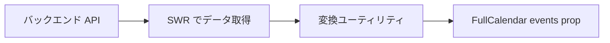
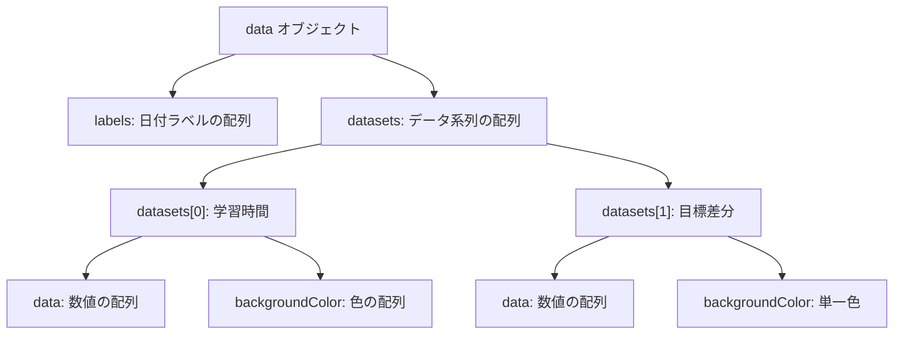
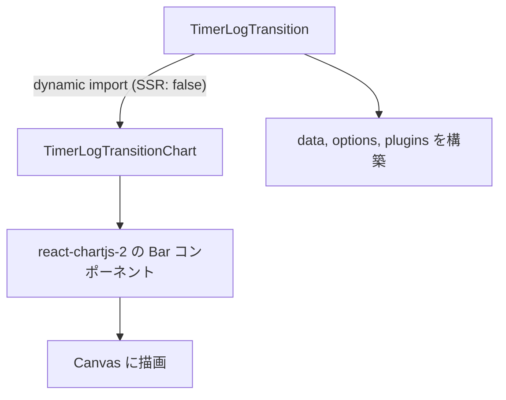

# 3-4-2 FullCalendar と Chart.js

## 🎯 このセクションで学ぶこと

- FullCalendar のプラグインアーキテクチャを理解し、plugins 配列による機能合成の仕組みを把握する
- FullCalendar の主要 props（initialView, locale, events, selectable, select, eventClick, eventDidMount）の役割を理解する
- Chart.js のモジュール登録（`ChartJS.register()`）とデータ構造（labels + datasets）を理解する
- Chart.js の options（scales, plugins, tooltip）とアノテーションプラグインによるカスタマイズ方法を理解する
- LMS でのスケジュール管理（UserScheduleCalendar）と学習進捗可視化（TimerLogTransition）の実装構造を読み解く

このセクションでは、LMS のスケジュール画面を支える FullCalendar と、ダッシュボードの学習時間グラフを描画する Chart.js の 2 つのライブラリを、アーキテクチャの視点から体系的に学びます。

---

## 導入: スケジュール画面とダッシュボードの裏側

LMS には、受講生やコーチが週間スケジュールを管理するカレンダー画面と、学習時間の推移を可視化するダッシュボードがあります。これらの画面を 1 から実装しようとすると、膨大な作業量になります。

<!-- TODO: 画像追加 - 受講生のスケジュール画面 -->

カレンダーであれば、週表示のグリッドレイアウト、時間軸のスクロール、イベントの配置計算（重なりの処理）、ドラッグによる時間帯選択、ロケール対応などが必要です。グラフであれば、Canvas API を使った描画、軸のスケーリング、ツールチップ、レスポンシブ対応、アニメーションなどが必要です。

これらの複雑な描画ロジックを自前で書くのではなく、**FullCalendar** と **Chart.js** という専門ライブラリに任せるのが現実的な選択です。ただし、これらのライブラリはそれぞれ独特のアーキテクチャを持っており、「props にデータを渡せば表示される」という単純な話ではありません。プラグインによる機能合成、モジュール登録、データ構造の変換など、ライブラリ固有の設計パターンを理解する必要があります。

### 🧠 先輩エンジニアはこう考える

> LMS のカレンダーは最初 Google カレンダーの埋め込みも検討されましたが、カスタマイズ性と UX の観点で FullCalendar を採用しました。FullCalendar は「必要な機能をプラグインで足す」という設計で、コアは軽量に保たれています。Chart.js も同様に、使う機能だけを register する Tree-shakable な設計です。この 2 つに共通する「必要なものだけ明示的に組み込む」という設計思想は、バンドルサイズを意識するフロントエンド開発の基本でもあるので、ぜひ押さえておいてください。

---

## FullCalendar のプラグインアーキテクチャ

**FullCalendar** は、カレンダー UI を構築するための JavaScript ライブラリです。LMS では React ラッパーである `@fullcalendar/react` ^6.1.11 を使用しています。

### プラグインによる機能合成

FullCalendar の最大の特徴は **プラグインアーキテクチャ** です。コアパッケージ（`@fullcalendar/core`）は最小限の機能しか持たず、表示形式やインタラクション機能をプラグインとして追加します。

LMS で使用しているプラグインは以下の 2 つです。

| パッケージ | 役割 |
|---|---|
| `@fullcalendar/timegrid` ^6.1.11 | 週表示・日表示のタイムグリッドビューを提供する |
| `@fullcalendar/interaction` ^6.1.11 | ドラッグによる時間帯選択、イベントクリックなどのユーザー操作を有効にする |

これらのプラグインは、`<FullCalendar>` コンポーネントの **`plugins` prop** に配列として渡します。

```tsx
{/* features/v2/schedule/components/UserScheduleCalendar.tsx */}
import interactionPlugin from '@fullcalendar/interaction'
import FullCalendar from '@fullcalendar/react'
import timeGridPlugin from '@fullcalendar/timegrid'

<FullCalendar
  plugins={[timeGridPlugin, interactionPlugin]}
  initialView='timeGridWeek'
  {/* ...他の props */}
/>
```

🔑 **ポイント**: `plugins` 配列に含めないプラグインの機能は使用できません。たとえば `interactionPlugin` を含めなければ、`selectable` や `select` といったインタラクション系の props を設定しても動作しません。この「明示的にオプトインする」設計により、使わない機能のコードがバンドルに含まれることを防いでいます。

FullCalendar は他にも `@fullcalendar/daygrid`（月表示）、`@fullcalendar/list`（リスト表示）、`@fullcalendar/google-calendar`（Google カレンダー連携）など多数のプラグインを提供しています。LMS では週間タイムグリッドが主要な表示形式であるため、`timegrid` と `interaction` の 2 つに絞っています。

### 主要 props の体系

`<FullCalendar>` コンポーネントの props は、大きく 4 つのカテゴリに分類できます。LMS の UserScheduleCalendar を例に見ていきましょう。

**1. 表示設定**

```tsx
{/* features/v2/schedule/components/UserScheduleCalendar.tsx */}
<FullCalendar
  initialView='timeGridWeek'
  locale={jaLocale}
  headerToolbar={{ left: '', center: '', right: '' }}
  nowIndicator={true}
  allDaySlot={false}
  dayHeaderFormat={{ weekday: 'short', day: 'numeric' }}
  slotLabelFormat={{
    hour: '2-digit',
    minute: '2-digit',
    omitZeroMinute: false,
    meridiem: 'short',
  }}
  scrollTime={currentScrollTime}
/>
```

| prop | 説明 |
|---|---|
| `initialView` | 初期表示のビュー。`'timeGridWeek'` は timegrid プラグインが提供する週表示 |
| `locale` | ロケール設定。`@fullcalendar/core/locales/ja` をインポートして日本語化 |
| `headerToolbar` | カレンダー上部のツールバー。LMS では全て空文字にし、独自の `ScheduleCalendarHeader` コンポーネントで置き換えている |
| `nowIndicator` | 現在時刻を示す赤い横線を表示する |
| `allDaySlot` | 「終日」枠の表示。LMS では不要なため `false` |
| `scrollTime` | 初期スクロール位置。LMS では現在時刻に設定 |

💡 **TIP**: `headerToolbar` を空にして独自のヘッダーを実装するパターンは、FullCalendar をカスタマイズする際によく使われます。LMS の `ScheduleCalendarHeader` は「今日」ボタンと週送りナビゲーション、年月表示を独自のデザインで提供しています。

**2. データ（イベント）**

```tsx
<FullCalendar
  events={events}
/>
```

`events` prop には FullCalendar が要求する形式のオブジェクト配列を渡します。各オブジェクトには `id`, `start`, `end`, `title` などのプロパティが含まれます。LMS のバックエンドから取得した生データをこの形式に変換する処理が必要ですが、これについてはこのセクションの後半で詳しく見ます。

**3. インタラクション**

```tsx
<FullCalendar
  selectable={!isAnyCreateModalOpen}
  select={isAnyCreateModalOpen ? undefined : handleAddEvent}
  eventAdd={handleSetEventInfo}
  eventClick={handleClickEvent}
  editable={false}
/>
```

| prop | 説明 |
|---|---|
| `selectable` | ドラッグによる時間帯選択を有効にする（`interaction` プラグインが必要） |
| `select` | 時間帯が選択されたときのコールバック。`DateSelectArg` 型の引数を受け取る |
| `eventClick` | 既存イベントがクリックされたときのコールバック。`EventClickArg` 型の引数を受け取る |
| `eventAdd` | イベントが追加されたときのコールバック |
| `editable` | イベントのドラッグ移動・リサイズの許可。LMS では `false`（イベントの移動は許可しない） |

⚠️ **注意**: `selectable` が `true` でも、`interaction` プラグインが `plugins` 配列に含まれていないと選択機能は動作しません。FullCalendar のインタラクション系機能は全て `interaction` プラグインに依存しています。

**4. レンダリングカスタマイズ**

```tsx
<FullCalendar
  dayHeaderContent={DateHeaderContent}
  eventDidMount={handleEventRender}
/>
```

| prop | 説明 |
|---|---|
| `dayHeaderContent` | 曜日ヘッダーのレンダリングをカスタマイズする。React コンポーネントを渡せる |
| `eventDidMount` | イベント要素が DOM にマウントされた後に呼ばれるコールバック |

`dayHeaderContent` は特に重要です。LMS では、曜日と日付の表示をカスタムコンポーネントで置き換え、「今日」の日付に丸い背景色を付けるデザインを実現しています。

```tsx
{/* features/v2/schedule/components/UserScheduleCalendar.tsx */}
const DateHeaderContent = (arg: DayHeaderContentArg) => {
  const { isToday, formatDate } = useDateTools()

  return (
    <div className='flex flex-col items-center justify-center'>
      <span className={cn('text-xs font-bold')}>{formatDate(arg.date, 'dd')}</span>
      <span
        className={cn(
          'flex size-9 items-center justify-center text-xl font-normal',
          isToday(arg.date) && 'rounded-full bg-brand-primary align-middle text-text-inverse',
        )}
      >
        {arg.date.getDate()}
      </span>
    </div>
  )
}
```

この `DateHeaderContent` は FullCalendar が各曜日ヘッダーを描画するたびに呼び出され、`DayHeaderContentArg` 型の引数からその日の `Date` オブジェクトを取得できます。`cn()` は Tailwind CSS のクラスを条件付きで結合するユーティリティです（セクション 3-3-1 参照）。

これら 4 カテゴリの props を組み合わせることで、FullCalendar の見た目と動作を LMS のデザインに合わせてカスタマイズしています。

---

## LMS のカレンダー実装

LMS には複数のカレンダーコンポーネントが存在します。受講生向けの `UserScheduleCalendar`、コーチ向けの `EmployeeScheduleCalendar`、CS（カスタマーサクセス）向けの `CsScheduleCalendar`、そしてオンボーディング機能で使われる `EmployeePeriodicShiftCalendar` などです。これらは全て同じ FullCalendar のプラグイン構成（`timeGridPlugin` + `interactionPlugin`）を使っており、違いは主に表示するイベントの種類とインタラクションの処理にあります。

### イベント変換ユーティリティ

FullCalendar にデータを渡すには、バックエンドから取得した生データを FullCalendar が要求する形式に変換する必要があります。LMS ではこの変換処理を **ユーティリティ関数** として切り出しています。



`convertToFullCalendarFormat.ts` には、データの種類ごとに変換関数が定義されています。

```typescript
// features/v2/schedule/utils/convertToFullCalendarFormat.ts
export const convertToMeetingEvents = (events: Meeting[] = []) => {
  const result = events.map((event) => {
    return {
      id: event.id.toString(),
      start: event.startDatetime,
      end: event.endDatetime,
      title: `面談 ${event.employee?.name ?? ''}コーチ`,
      backgroundColor: '#1C7F86', // brand.primary.DEFAULT
      textColor: '#FFFFFF', // text.inverse
      classNames: ['h-auto', 'meeting-event'],
      displayEventTime: false,
      isMeeting: true,
    }
  })
  return result
}
```

変換関数の共通パターンは以下のとおりです。

| プロパティ | 役割 |
|---|---|
| `id` | イベントの一意識別子。FullCalendar 内部でイベントの追跡に使用 |
| `start` / `end` | 開始・終了日時。ISO 8601 形式の文字列または `Date` オブジェクト |
| `title` | イベントのラベルとして表示されるテキスト |
| `backgroundColor` / `textColor` | イベントの背景色と文字色。LMS のデザイントークンに対応したカラーコードをハードコードしている |
| `classNames` | イベント要素に付与する CSS クラス名の配列。カスタム CSS でスタイリングする際に使用 |
| `displayEventTime` | 時刻の表示。LMS では `false` にしてイベント内に時刻を表示しない |
| カスタムプロパティ | `isMeeting`, `isApplication` などの独自プロパティ。FullCalendar の `extendedProps` として扱われ、イベントクリック時の分岐に使用 |

LMS では 4 種類の変換関数が定義されています。

| 関数 | 変換元データ | 用途 |
|---|---|---|
| `convertToScheduleEvents` | ScheduleEvent | 受講生の学習予定 |
| `convertToMeetingEvents` | Meeting | 面談予定 |
| `convertToPeriodicScheduleEvents` | PeriodicScheduleEvent | 繰り返し予定（曜日ベース） |
| `convertToApplicationEvents` | Application | 応募面談 |

🔑 **ポイント**: 変換関数をコンポーネントから分離するメリットは、テスタビリティとコンポーネントの責務の明確化にあります。カレンダーコンポーネントは「表示とインタラクション」に集中し、「データ変換」は純粋関数として独立させています。

### イベントの統合

UserScheduleCalendar では、複数の変換関数の結果を `useMemo` で結合し、1 つの `events` 配列にまとめて FullCalendar に渡しています。

```tsx
{/* features/v2/schedule/components/UserScheduleCalendar.tsx */}
const events = useMemo(() => {
  const convertedScheduleEvents = convertToScheduleEvents(scheduleEventsData)
  const convertedMeetings = convertToMeetingEvents(meetingsData)
  const convertedApplications = convertToApplicationEvents(applicationsData)
  const weekStartDate = getWeekStartDate(selectDate)
  const convertedPeriodicScheduleEvents = convertToPeriodicScheduleEvents(
    periodicScheduleEventsData,
    weekStartDate,
  )
  return [
    ...convertedScheduleEvents,
    ...convertedPeriodicScheduleEvents,
    ...convertedMeetings,
    ...convertedApplications,
  ]
}, [scheduleEventsData, meetingsData, periodicScheduleEventsData, applicationsData, selectDate])
```

`useMemo` で結果をメモ化することで、依存データが変化しない限り変換処理が再実行されないようにしています。`convertToPeriodicScheduleEvents` だけ追加の引数 `weekStartDate` を受け取っているのは、繰り返し予定が「毎週月曜の 10:00〜12:00」のように曜日ベースで定義されており、表示中の週の日付に変換する必要があるためです。

### カスタムヘッダーによるナビゲーション

LMS では FullCalendar のデフォルトヘッダーを無効化し、`ScheduleCalendarHeader` という独自コンポーネントで週送りナビゲーションを実装しています。

```tsx
{/* features/v2/schedule/components/ScheduleCalendarHeader.tsx */}
export function ScheduleCalendarHeader({ selectDate, onPreviousWeek, onNextWeek, onToday }: Props) {
  return (
    <div className='flex items-center justify-start gap-4'>
      <Button variant='bordered' onPress={debouncedToday}>今日</Button>
      <div className='flex items-center'>
        <Button variant='light' onPress={debouncedPreviousWeek}>
          <Icon icon='solar:alt-arrow-left-outline' className='size-5' />
        </Button>
        <Button variant='light' onPress={debouncedNextWeek}>
          <Icon icon='solar:alt-arrow-right-outline' className='size-5' />
        </Button>
        <div className='ml-8 text-xl font-bold text-text-primary'>
          {dayjs(weekStartDate).tz().format('YYYY年MM月')}
        </div>
      </div>
    </div>
  )
}
```

上記は主要部分の抜粋です。実際のコードでは `useDebouncedCallback` でボタンの連打を防止し、ローディング状態の管理も行っています。

FullCalendar の表示週を変更するには、`calendarRef` 経由で API を呼び出します。`selectDate` ステートが変更されるたびに `useEffect` で `calendarRef.current.getApi().gotoDate(selectDate)` が実行され、カレンダーの表示が連動して更新されます。

```tsx
{/* features/v2/schedule/components/UserScheduleCalendar.tsx */}
const calendarRef = useRef<FullCalendar>(null)

useEffect(() => {
  if (calendarRef && calendarRef.current) {
    calendarRef.current.getApi().gotoDate(selectDate)
  }
}, [selectDate, removeTemporaryEvent])
```

🔑 **ポイント**: FullCalendar の `ref` を通じた API 呼び出し（`getApi()`）は、宣言的な props だけでは制御しきれない操作（プログラムによる日付移動、イベントの動的追加・削除など）に使います。LMS では一時イベントの追加・削除にもこの API を活用しています。

---

## Chart.js のデータ構造

**Chart.js** は、Canvas API を使ってグラフを描画する JavaScript ライブラリです。LMS では React ラッパーである `react-chartjs-2` ^5.2.0 を使用しており、Chart.js 本体は ^4.4.3 です。

### モジュール登録（Tree-shaking）

Chart.js 4 は **Tree-shakable** な設計を採用しています。Chart.js が提供する全ての機能（スケール、要素、プラグインなど）は個別のモジュールとして提供されており、使用するものだけを明示的に登録します。

```tsx
{/* features/v2/dashboard/components/timerLogTransition/TimerLogTransitionChart.tsx */}
import {
  BarElement,
  CategoryScale,
  Chart as ChartJS,
  Legend,
  LinearScale,
  Title,
  Tooltip,
} from 'chart.js'
import annotationPlugin from 'chartjs-plugin-annotation'

ChartJS.register(CategoryScale, LinearScale, BarElement, annotationPlugin, Title, Tooltip, Legend)
```

`ChartJS.register()` に渡しているモジュールの役割は以下のとおりです。

| モジュール | 種類 | 役割 |
|---|---|---|
| `CategoryScale` | スケール | X 軸のカテゴリスケール（日付ラベルなど離散的な値） |
| `LinearScale` | スケール | Y 軸の数値スケール（連続的な値） |
| `BarElement` | 要素 | 棒グラフの棒要素の描画 |
| `Title` | プラグイン | グラフタイトルの表示 |
| `Tooltip` | プラグイン | ホバー時のツールチップ表示 |
| `Legend` | プラグイン | 凡例の表示 |
| `annotationPlugin` | 外部プラグイン | 目標線などのアノテーション描画（`chartjs-plugin-annotation` ^3.0.1） |

⚠️ **注意**: `ChartJS.register()` を呼ばずにグラフを描画しようとすると、「○○ is not a registered scale」のようなエラーが発生します。FullCalendar の `plugins` 配列と同じく、「使う機能は明示的に登録する」という原則です。

この登録はアプリケーション全体で 1 回行えば十分です。LMS では `TimerLogTransitionChart.tsx` のモジュールスコープ（コンポーネント外）で実行しています。

### data 構造: labels と datasets

Chart.js のグラフは **`data`** オブジェクトによってデータ内容が決まります。`data` は `labels`（X 軸のラベル）と `datasets`（描画するデータ系列の配列）で構成されます。

```typescript
// features/v2/dashboard/components/timerLogTransition/TimerLogTransition.tsx
const data = {
  labels: displayGraphLabels,  // ['3/1', '3/2', '3/3', ...] のような日付ラベル
  datasets: [
    {
      label: '学習時間',
      data: timerLogs.map((data) => data.studyData),
      backgroundColor: timerLogs.map((data) => {
        const today = dayjs().tz().format('M/DD')
        const dataDate = dayjs(data.startDatetime).tz().format('M/DD')
        return dataDate === today ? CHART_COLORS.brandPrimary : CHART_COLORS.brandSecondary
      }),
      barPercentage: 0.9,
    },
    {
      label: '目標時間までの差分',
      data: timerLogs.map((data) =>
        data.targetRemaining ?? Math.max(0, (data.target ?? 0) - data.studyData),
      ),
      backgroundColor: CHART_COLORS.brandSecondary300,
      barPercentage: 0.9,
    },
  ],
}
```



この例では 2 つの dataset が積み上げ棒グラフ（stacked bar chart）として描画されます。1 つ目が実際の学習時間、2 つ目が目標時間までの残り差分です。

📝 **ノート**: `backgroundColor` にはデータポイントごとの色の配列を渡すこともできます。LMS では今日の棒だけブランドプライマリカラー（`#1C7F86`）、それ以外はセカンダリカラー（`#6B7C93`）にするため、`timerLogs.map()` で日付を判定して色を切り替えています。

### options による詳細設定

`options` オブジェクトは、グラフの見た目と振る舞いを詳細に制御します。大きく `plugins`（プラグイン設定）、`scales`（軸設定）、`layout`（余白設定）に分かれます。

```typescript
// features/v2/dashboard/components/timerLogTransition/TimerLogTransition.tsx
const options: ChartOptions<'bar'> = {
  responsive: true,
  maintainAspectRatio: false,
  plugins: {
    legend: { display: false },
    title: {
      display: true,
      text: '時間',
      align: 'start',
      font: { size: 10, weight: 'bold' },
    },
    tooltip: {
      callbacks: {
        label: (context) => `${context.parsed.y}時間`,
      },
    },
    annotation: {
      annotations: targetStudyTime !== null ? {
        line: {
          type: 'line',
          yMin: targetStudyTime,
          yMax: targetStudyTime,
          borderColor: '#D14343',
          borderWidth: 2,
        },
      } : {},
    },
  },
  scales: {
    x: {
      stacked: true,
      grid: { display: true, color: '#F1F1F1' },
      border: { display: true, color: '#E5E7EB' },
    },
    y: {
      stacked: true,
      grid: { display: true, color: '#F1F1F1' },
      border: { display: true, color: '#E5E7EB' },
    },
  },
}
```

以下は主要部分の抜粋です。実際のコードでは `CHART_COLORS` 定数でカラーコードを一元管理しています。

主要な options の構造を整理します。

| カテゴリ | 設定項目 | LMS での使い方 |
|---|---|---|
| ルート | `responsive`, `maintainAspectRatio` | コンテナに合わせてリサイズ。アスペクト比は固定しない |
| `plugins.legend` | 凡例の表示制御 | `display: false` で非表示にし、独自の凡例を HTML で実装 |
| `plugins.title` | タイトルの表示 | Y 軸のラベル「時間」を表示 |
| `plugins.tooltip` | ツールチップのカスタマイズ | `callbacks.label` で「○時間」形式に変換 |
| `plugins.annotation` | アノテーションの描画 | 目標学習時間を赤い水平線で表示 |
| `scales.x` / `scales.y` | 軸の設定 | `stacked: true` で積み上げ表示。グリッド線とボーダーの色を LMS のデザイントークンに合わせる |

🔑 **ポイント**: `plugins.annotation` が条件分岐で空オブジェクト `{}` になるケースに注目してください。`targetStudyTime` が `null`（目標時間が未設定）のとき、アノテーションの描画をスキップしています。Chart.js の `options` はデータに応じて動的に構成できるため、このような条件付きの表示制御が柔軟に行えます。

---

## LMS のチャート実装

### TimerLogTransition: 積み上げ棒グラフ

LMS のダッシュボードには、受講生の学習時間の推移を表示する積み上げ棒グラフがあります。この機能は 2 つのコンポーネントに分離されています。

<!-- TODO: 画像追加 - ダッシュボードの学習時間推移グラフ -->



| コンポーネント | 責務 |
|---|---|
| `TimerLogTransition` | データの加工（`data`）、グラフ設定（`options`）、カスタムプラグイン（`plugins`）の構築 |
| `TimerLogTransitionChart` | Chart.js モジュールの登録と `<Bar>` コンポーネントのレンダリング |

**dynamic import と SSR 無効化**

`TimerLogTransitionChart` は `next/dynamic` で動的にインポートされ、`ssr: false` が指定されています。

```tsx
{/* features/v2/dashboard/components/timerLogTransition/TimerLogTransition.tsx */}
const TimerLogTransitionChart = dynamic(
  () => import('@/features/v2/dashboard/components/timerLogTransition/TimerLogTransitionChart'),
  { ssr: false },
)
```

⚠️ **注意**: Chart.js は Canvas API を使って描画するため、ブラウザ環境が必須です。サーバーサイドレンダリング（SSR）時にはブラウザの `window` オブジェクトや Canvas API が存在しないため、`ssr: false` でサーバーサイドでの読み込みを無効にしています。これを忘れると、ビルド時やサーバーサイドレンダリング時にエラーが発生します。

### カスタムプラグイン: axisLabelPlugin

Chart.js はプラグインシステムを通じて描画のライフサイクルにフックできます。LMS では、X 軸の右端に「日付」というラベルを表示するカスタムプラグインを実装しています。

```typescript
// features/v2/dashboard/components/timerLogTransition/TimerLogTransition.tsx
const axisLabelPlugin: Plugin<'bar'> = {
  id: 'axisLabel',
  afterDraw(chart) {
    const { ctx, chartArea } = chart
    ctx.save()
    ctx.font = 'bold 10px sans-serif'
    ctx.fillStyle = CHART_COLORS.textPrimary
    ctx.textAlign = 'right'
    ctx.textBaseline = 'bottom'
    ctx.fillText('日付', chartArea.right + 28, chartArea.bottom - 4)
    ctx.restore()
  },
}
```

Chart.js のプラグインは、ライフサイクルフック（`beforeDraw`, `afterDraw`, `beforeUpdate` など）を持つオブジェクトです。`afterDraw` はグラフの描画が完了した後に呼ばれるフックで、ここで Canvas の 2D コンテキスト（`ctx`）を使って任意のテキストや図形を追加描画できます。

📝 **ノート**: カスタムプラグインは `options` 内の `plugins` 設定とは異なります。`options.plugins` はビルトインプラグイン（legend, title, tooltip 等）の設定であり、カスタムプラグインは `<Bar>` コンポーネントの `plugins` prop に配列として渡します。

```tsx
<TimerLogTransitionChart options={options} data={data} plugins={chartPlugins} />
```

### カスタム凡例

LMS の学習時間グラフでは、Chart.js の組み込み凡例（`legend`）を `display: false` で無効化し、代わりに HTML/CSS で独自の凡例を実装しています。

```tsx
{/* features/v2/dashboard/components/timerLogTransition/TimerLogTransition.tsx */}
<div className='mb-2 flex flex-wrap justify-end gap-x-4 gap-y-1'>
  <div className='flex items-center gap-1.5'>
    <span className='inline-block size-3 rounded-sm'
      style={{ backgroundColor: CHART_COLORS.brandPrimary }} />
    <span className='text-xs text-text-muted'>今日の学習時間</span>
  </div>
  <div className='flex items-center gap-1.5'>
    <span className='inline-block size-3 rounded-sm'
      style={{ backgroundColor: CHART_COLORS.brandSecondary }} />
    <span className='text-xs text-text-muted'>学習時間</span>
  </div>
  {/* ...目標学習時間、学習時間目安の凡例も同様 */}
</div>
```

Chart.js の組み込み凡例は Canvas 内に描画されるため、LMS のデザインシステム（Tailwind CSS のクラス）でスタイリングするのが難しくなります。HTML で凡例を実装することで、デザインの統一性を維持しています。

### SVG ドーナツチャートとの使い分け

LMS のスケジュール画面には、週の学習目標に対する進捗を表示するドーナツチャートがあります。興味深いことに、このチャートは Chart.js を使わず **純粋な SVG** で実装されています。

```tsx
{/* features/v2/schedule/components/LearningObjectiveDoughnutChart.tsx */}
<svg viewBox='0 0 100 100' className='size-[220px]'>
  <defs>
    <linearGradient id={gradientId}>
      <stop offset='0%' className='[stop-color:theme(colors.brand.primary.DEFAULT)]' />
      <stop offset='100%' className='[stop-color:theme(colors.brand.primary.DEFAULT)]' />
    </linearGradient>
  </defs>

  {/* 背景円 */}
  <circle cx='50' cy='50' r='45'
    className='fill-background-subtle stroke-border-strong' strokeWidth='6' />

  {/* 進捗円 */}
  <circle cx='50' cy='50' r='45'
    stroke={`url(#${gradientId})`} strokeWidth='6'
    strokeDasharray={getStrokeDasharray()}
    transform='rotate(-90 50 50)' fill='transparent' />

  {/* 中央テキスト */}
  <text x='50' y='58' textAnchor='middle' fontSize='0.9rem' fontWeight='bold'>
    {formatTimeToHoursMinutes(remainingTime)}
  </text>
</svg>
```

このコンポーネントは `stroke-dasharray` 属性を使って円の進捗を表現しています。`getStrokeDasharray()` が進捗率に応じて `'140 143'`（約50%）のような値を返し、円周の一部だけを描画することでドーナツの進捗表示を実現しています。

🔑 **ポイント**: Chart.js と SVG の使い分けの判断基準は、グラフの複雑さです。複数のデータ系列、軸、ツールチップ、アノテーションなどが必要な場合は Chart.js が適しています。一方、単一の進捗率を表示するだけであれば、SVG で直接描画するほうが軽量でカスタマイズも容易です。LMS のドーナツチャートはデータが「現在の学習時間 / 目標時間」の 1 つだけなので、Chart.js の依存を追加する必要がありません。

Chart.js を使わないもう 1 つの利点として、SVG は HTML と同じように Tailwind CSS のクラスでスタイリングできます。上記のコードでは `className='fill-background-subtle stroke-border-strong'` のように Tailwind のカスタムカラーを直接使っています。

---

## ✨ まとめ

- **FullCalendar** はプラグインアーキテクチャを採用しており、`plugins` 配列に `timeGridPlugin`（週表示）と `interactionPlugin`（ユーザー操作）を渡すことで必要な機能を組み合わせる
- FullCalendar の props は「表示設定」「データ」「インタラクション」「レンダリングカスタマイズ」の 4 カテゴリに整理でき、`dayHeaderContent` や `headerToolbar` の無効化による独自ヘッダーで LMS のデザインに合わせている
- LMS のカレンダーでは、バックエンドのデータを FullCalendar 形式に変換する **ユーティリティ関数** をコンポーネントから分離し、`useMemo` で結合して `events` prop に渡している
- **Chart.js** は `ChartJS.register()` で使用するモジュールを明示的に登録する Tree-shakable な設計。`data`（labels + datasets）で描画内容を、`options`（plugins, scales）で見た目を制御する
- Chart.js のカスタムプラグイン（`afterDraw` フック）で Canvas に直接描画を追加でき、組み込み凡例を HTML で置き換えるパターンも LMS では使われている
- 単純な進捗表示には Chart.js ではなく **SVG** を直接使う選択肢があり、LMS のドーナツチャートは `stroke-dasharray` で実装されている
- 両ライブラリに共通する設計思想は「必要な機能だけを明示的に組み込む」であり、バンドルサイズの最適化につながっている

---

次のセクションでは、dnd-kit の DndContext と Sortable パターンを学び、LMS でのカリキュラム並び替え等のドラッグ＆ドロップの実装構造を理解します。
