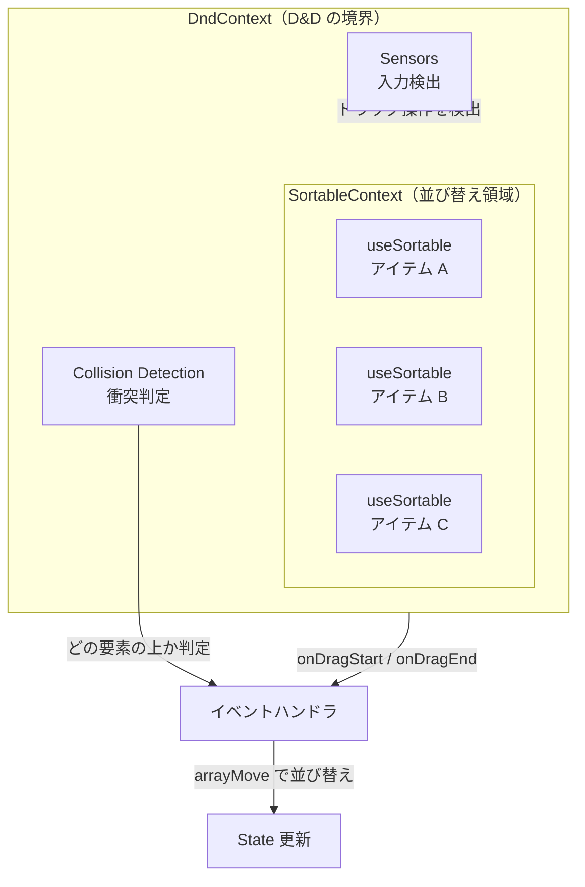
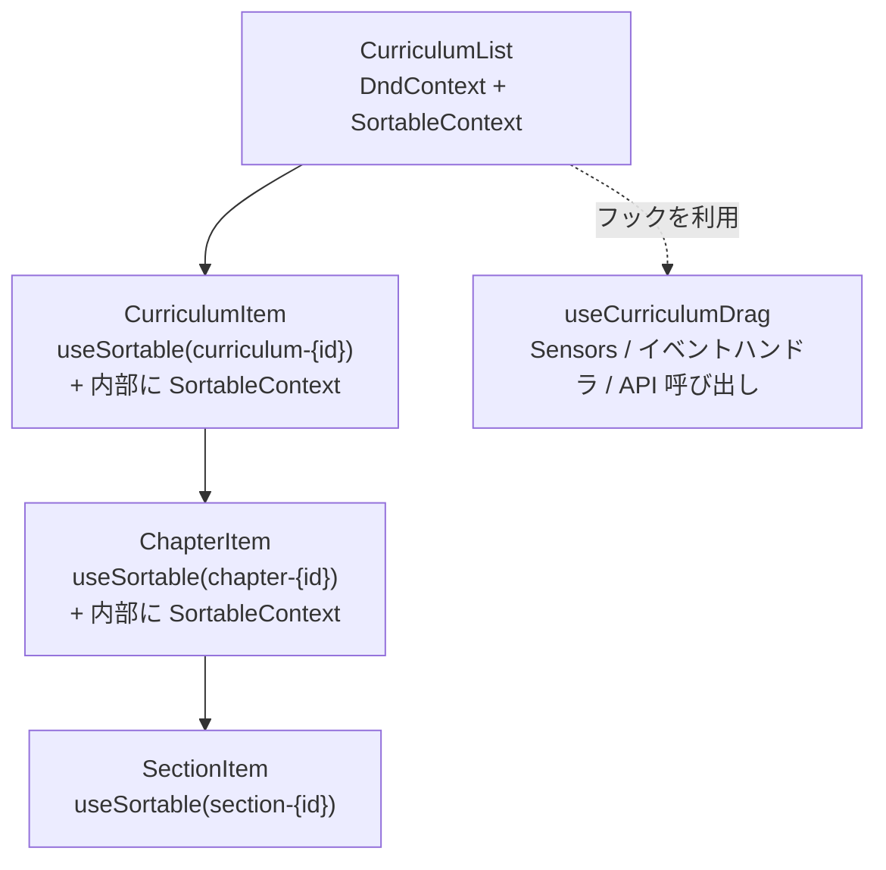
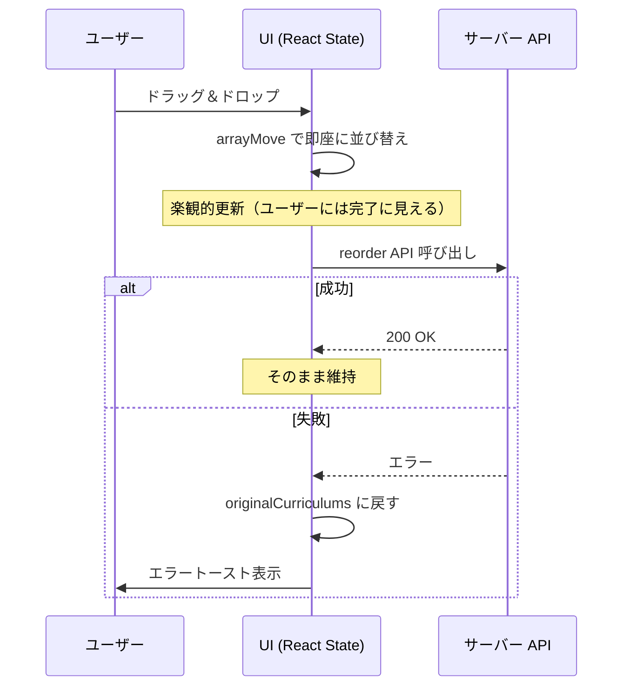

# 3-4-3 dnd-kit によるドラッグ＆ドロップ

## 🎯 このセクションで学ぶこと

- ドラッグ＆ドロップ（D&D）がなぜ Web アプリケーションで必要になるのか、その課題と解決策を理解する
- dnd-kit のコアアーキテクチャ（DndContext / SortableContext / useSortable / Sensors）の役割と連携を理解する
- LMS のカリキュラム並び替え実装を通じて、3 階層ネストの D&D パターンと楽観的更新の仕組みを理解する
- 再利用可能な DragHandle コンポーネントの設計パターン（attributes / listeners の分離）を理解する
- LMS 全体で dnd-kit が使われている 5 つの機能の全体像を把握する

このセクションでは、dnd-kit のコア概念を学んだ後、LMS のカリキュラム管理画面の並び替え実装を詳しく読み解きます。最後に、LMS 全体での dnd-kit の利用箇所を俯瞰し、共通パターンを整理します。

---

## 導入: カリキュラムの並び替えをどう実現するか

LMS の管理画面では、カリキュラムの表示順を変更する機能があります。カリキュラムの中にはチャプターがあり、チャプターの中にはセクションがあります。管理者はこれらの要素をドラッグして好きな順番に並び替えられます。

この機能を実装するには、いくつかの課題を解決する必要があります。

- **マウスのクリックとドラッグの区別**: ボタンやリンクのクリックと、並び替えのためのドラッグ操作を区別しなければなりません
- **タッチデバイスへの対応**: スマートフォンではスクロールとドラッグが衝突します。長押しで「ドラッグモード」に入るなどの工夫が必要です
- **視覚的フィードバック**: ドラッグ中の要素が半透明になる、ドロップ先がハイライトされるなど、ユーザーに操作状態を伝える UI が求められます
- **ネストした構造の処理**: カリキュラム > チャプター > セクションという 3 階層で、同じ階層内の並び替えだけを許可し、階層をまたぐ移動は防ぐ必要があります
- **サーバーとの同期**: 並び替え結果をサーバーに保存し、失敗時には元に戻す仕組みが必要です

これらをすべて自前で実装するのは非常に大変です。ブラウザの HTML5 Drag and Drop API は存在しますが、低レベルで扱いにくく、タッチデバイスのサポートも不十分です。そこで登場するのが **dnd-kit** です。

### 🧠 先輩エンジニアはこう考える

> ドラッグ＆ドロップのライブラリ選定では、以前は react-beautiful-dnd が人気でしたが、メンテナンスが止まっています。dnd-kit は React 18 にネイティブ対応しており、アクセシビリティも考慮されています。何より「並び替え」というユースケースに特化した `@dnd-kit/sortable` パッケージがあるのが大きくて、LMS のカリキュラム管理やガイド管理のように「リスト内の順番を変える」操作がメインの場合にぴったりです。実装してみて感じたのは、コア（`@dnd-kit/core`）とソート（`@dnd-kit/sortable`）が分離されている設計の良さです。並び替え以外の D&D が必要になったときも、コアの知識がそのまま使えます。

---

## dnd-kit とは何か

**dnd-kit** は、React 向けのドラッグ＆ドロップライブラリです。モジュラーなアーキテクチャを採用しており、必要な機能だけをパッケージ単位でインストールできます。

LMS では以下の 4 つのパッケージを使用しています。

| パッケージ | バージョン | 役割 |
|---|---|---|
| `@dnd-kit/core` | ^6.1.0 | D&D の基盤（コンテキスト・センサー・衝突検出） |
| `@dnd-kit/sortable` | ^8.0.0 | リスト並び替え機能（SortableContext・useSortable） |
| `@dnd-kit/modifiers` | ^7.0.0 | ドラッグ動作の制約（軸固定など） |
| `@dnd-kit/utilities` | ^3.2.2 | ユーティリティ（CSS Transform 変換など） |

dnd-kit の設計思想は「宣言的に D&D を構築する」ことです。React のコンポーネントとフックを組み合わせて、どの要素がドラッグ可能で、どの領域にドロップできるかを宣言的に定義します。

---

## dnd-kit のコアアーキテクチャ

dnd-kit の仕組みは、5 つのコア概念で成り立っています。これらがどう連携するかを先に把握してから、個別の詳細に入ります。



### DndContext: D&D の境界を定義する

`DndContext` は、ドラッグ＆ドロップが有効な領域を囲むコンポーネントです。React の Context API を使って、内部のすべてのドラッグ可能な要素とドロップ可能な要素を管理します。

`DndContext` に渡す主要な props は 4 つです。

| prop | 型 | 役割 |
|---|---|---|
| `sensors` | `SensorDescriptor[]` | 入力デバイスの設定（マウス・タッチ・キーボード） |
| `collisionDetection` | `CollisionDetection` | 衝突判定アルゴリズム |
| `onDragStart` | `(event: DragStartEvent) => void` | ドラッグ開始時のコールバック |
| `onDragEnd` | `(event: DragEndEvent) => void` | ドラッグ終了時のコールバック |

`DndContext` は React の `<Provider>` と同じ役割を担います。セクション 2-3-2 で学んだ `useContext` と同様に、`DndContext` の内部にある要素だけがドラッグ＆ドロップに参加できます。

### SortableContext: 並び替え可能なリストを定義する

`SortableContext` は `@dnd-kit/sortable` が提供するコンポーネントで、並び替え可能なアイテムのリストを定義します。

```tsx
<SortableContext items={['item-1', 'item-2', 'item-3']} strategy={verticalListSortingStrategy}>
  {/* 並び替え可能なアイテムをここに配置 */}
</SortableContext>
```

`items` には **一意な ID の配列** を渡します。`strategy` には並び替えの方向を指定します。`verticalListSortingStrategy` は縦方向のリスト用で、LMS ではすべての並び替えでこの戦略を使用しています。

🔑 **ポイント**: `SortableContext` の `items` に渡す ID は、後述する `useSortable` に渡す `id` と一致していなければなりません。この対応が崩れると、ドラッグ時にアイテムが正しく認識されません。

### useSortable: 個々のアイテムをドラッグ可能にする

`useSortable` フックは、個々のアイテムにドラッグ＆ドロップの機能を付与します。このフックが返すオブジェクトを DOM 要素に適用することで、その要素がドラッグ可能になります。

```tsx
const { attributes, listeners, setNodeRef, transform, isDragging } = useSortable({
  id: 'item-1',
})
```

返り値の各プロパティの役割を整理します。

| プロパティ | 役割 | 適用先 |
|---|---|---|
| `setNodeRef` | DOM 要素への参照を dnd-kit に登録する | ドラッグ対象の `ref` |
| `attributes` | アクセシビリティ属性（`role`, `tabIndex`, `aria-*`） | ドラッグハンドルの要素 |
| `listeners` | イベントリスナー（`onPointerDown`, `onKeyDown` 等） | ドラッグハンドルの要素 |
| `transform` | ドラッグ中の位置移動量 | `style` に変換して適用 |
| `isDragging` | 現在ドラッグ中かどうか | 透明度の変更などに使用 |

ここで重要なのは、`setNodeRef` と `attributes` / `listeners` の **適用先が異なる** ことです。`setNodeRef` はアイテム全体の外枠に適用しますが、`attributes` と `listeners` はドラッグハンドル（つまみ部分）にだけ適用できます。この分離により「アイテム全体ではなく、特定のハンドル部分を掴んでドラッグする」という操作が実現できます。

`transform` は `@dnd-kit/utilities` の `CSS.Transform.toString()` で CSS の `transform` プロパティに変換します。

```tsx
import { CSS } from '@dnd-kit/utilities'

const style = {
  transform: CSS.Transform.toString(transform),
  opacity: isDragging ? 0.5 : 1,
}
```

### Sensors: 入力デバイスの検出

**Sensors** は、ユーザーの入力（マウス操作、タッチ操作、キーボード操作）を検出し、ドラッグ操作として認識する仕組みです。dnd-kit は複数のセンサーを提供しています。

| センサー | 対象デバイス | 用途 |
|---|---|---|
| `MouseSensor` | マウス | デスクトップでの操作 |
| `PointerSensor` | マウス + タッチ | 統合的な入力（ただしタッチとの干渉に注意） |
| `TouchSensor` | タッチスクリーン | モバイルデバイスでの操作 |
| `KeyboardSensor` | キーボード | アクセシビリティ対応 |

センサーには **activationConstraint** （起動条件）を設定できます。これにより、クリックとドラッグを区別します。

```typescript
const sensors = useSensors(
  useSensor(MouseSensor, {
    activationConstraint: { distance: 8 },  // 8px 以上動かしたらドラッグ開始
  }),
  useSensor(TouchSensor, {
    activationConstraint: { delay: 200, tolerance: 6 },  // 200ms 長押し後にドラッグ開始
  }),
)
```

`distance: 8` は「マウスを 8 ピクセル以上動かしたときにドラッグとみなす」という意味です。これにより、クリック操作が誤ってドラッグとして認識されるのを防ぎます。`delay: 200` は「200 ミリ秒長押ししたらドラッグモードに入る」という意味で、スクロール操作との衝突を防ぎます。

### Collision Detection: 衝突判定

**Collision Detection** は、ドラッグ中の要素がどのドロップ先の上にあるかを判定するアルゴリズムです。LMS では `closestCenter`（最も近い中心点）を使用しています。

```tsx
import { closestCenter } from '@dnd-kit/core'

<DndContext collisionDetection={closestCenter} ...>
```

`closestCenter` は、ドラッグ中の要素の中心点と、各ドロップ先の中心点との距離を計算し、最も近いものをドロップ先として選択します。縦方向のリスト並び替えでは、この方式が最も直感的に動作します。

---

## LMS の並び替え実装パターン

dnd-kit のコア概念を理解したところで、LMS のカリキュラム管理画面の実装を読み解きます。この実装は、dnd-kit の典型的な活用例であると同時に、3 階層ネストという発展的なパターンを含んでいます。

### アーキテクチャの全体像

LMS のカリキュラム並び替えは、以下のコンポーネント構成で実現されています。



最上位の `CurriculumList` が `DndContext` を持ち、各階層のアイテムが `useSortable` でドラッグ可能になっています。ドラッグ操作のロジックは `useCurriculumDrag` カスタムフックに集約されています。

### CurriculumList: 最上位のコンテナ

`CurriculumList` コンポーネントの実装を見てみましょう。

```tsx
{/* features/v2/curriculum/components/CurriculumList.tsx */}
import { DndContext } from '@dnd-kit/core'
import { SortableContext, verticalListSortingStrategy } from '@dnd-kit/sortable'

export function CurriculumList({ curriculums, workspaceId, onUpdate }: Props) {
  const [items, setItems] = useState(curriculums)
  const [isDragProcess, setIsDragProcess] = useState(false)

  useEffect(() => {
    if (!isDragProcess && prevCurriculumsRef.current !== curriculums) {
      setItems(curriculums)
    }
  }, [curriculums, isDragProcess])

  const { sensors, collisionDetection, handleDragStart, handleDragEnd } = useCurriculumDrag({
    items, setItems, workspaceId,
    onError: (msg) => addToast({ title: 'エラー', description: msg, color: 'danger' }),
    setIsDragProcess, originalCurriculums: curriculums,
  })

  const curriculumIds = items.map((c) => `curriculum-${c.id}`)

  return (
    <DndContext sensors={sensors} collisionDetection={collisionDetection}
      onDragStart={handleDragStart} onDragEnd={handleDragEnd}>
      <SortableContext items={curriculumIds} strategy={verticalListSortingStrategy}>
        {items.map((curriculum, index) => (
          <CurriculumItem key={curriculum.id} curriculum={curriculum} index={index} ... />
        ))}
      </SortableContext>
    </DndContext>
  )
}
```

ここで注目すべきポイントがいくつかあります。

**ローカルステートによる即時反映**: `items` は `useState` で管理されており、ドラッグ操作で即座に更新されます。サーバーから取得した `curriculums` props とは別に保持することで、API レスポンスを待たずに UI を更新できます。

**ドラッグ中の外部更新の防止**: `isDragProcess` フラグにより、ドラッグ操作中に外部（SWR の再検証など）からデータが更新されても、ローカルステートが上書きされないようにしています。ドラッグ操作中にリストが突然変わると、ユーザーの操作が中断されてしまうためです。

**ID の命名規則**: `curriculum-${c.id}` のようにプレフィックスを付けています。この命名規則が 3 階層ネストの鍵になります。

### ID 命名規則: 3 階層を区別する仕組み

LMS のカリキュラム管理では、1 つの `DndContext` 内に 3 つの階層が存在します。

| 階層 | ID パターン | 例 |
|---|---|---|
| カリキュラム | `curriculum-{id}` | `curriculum-42` |
| チャプター | `chapter-{id}` | `chapter-108` |
| セクション | `section-{id}` | `section-256` |

ドラッグ終了時に `active.id`（ドラッグした要素）と `over.id`（ドロップ先の要素）のプレフィックスを比較することで、どの階層の並び替えかを判定します。

```typescript
// features/v2/curriculum/hooks/useCurriculumDrag.ts
const handleDragEnd = async (event: DragEndEvent) => {
  const { active, over } = event
  if (!over || active.id === over.id) { setIsDragProcess(false); return }

  const activeId = String(active.id)
  const overId = String(over.id)

  // プレフィックスで階層を判定し、対応するハンドラにルーティング
  if (activeId.startsWith('curriculum-') && overId.startsWith('curriculum-')) {
    await handleCurriculumReorder(activeId, overId)
  } else if (activeId.startsWith('chapter-') && overId.startsWith('chapter-')) {
    await handleChapterReorder(activeId, overId)
  } else if (activeId.startsWith('section-') && overId.startsWith('section-')) {
    await handleSectionReorder(activeId, overId)
  }
}
```

この設計には明確な意図があります。もしプレフィックスなしの数値 ID をそのまま使うと、カリキュラム ID = 1 とチャプター ID = 1 が衝突してしまいます。プレフィックスを付けることで ID のユニーク性を保証しつつ、階層の判定にも使えるようにしています。

さらに、`activeId` と `overId` のプレフィックスが一致しない場合（たとえばカリキュラムをチャプターの上にドロップした場合）は、どの `if` 文にも入らず何も起きません。これにより、**異なる階層間の移動が暗黙的に無効化** されています。

### 楽観的更新とロールバック

並び替えの結果をサーバーに保存する処理は、**楽観的更新** パターンで実装されています。

```typescript
// features/v2/curriculum/hooks/useCurriculumDrag.ts
const handleCurriculumReorder = async (activeId: string, overId: string) => {
  const activeIndex = items.findIndex((item) => `curriculum-${item.id}` === activeId)
  const overIndex = items.findIndex((item) => `curriculum-${item.id}` === overId)
  const newItems = arrayMove(items, activeIndex, overIndex)
  setItems(newItems)  // 1. まず UI を即座に更新（楽観的更新）

  try {
    await reorder({
      pathParams: { workspaceId, curriculumId },
      requestBody: { order: newOrder },
    })
    // 2. API 成功 → そのまま
  } catch {
    setItems(originalCurriculums)  // 3. API 失敗 → 元に戻す（ロールバック）
    onError('カリキュラムの並び替えに失敗しました')
  }
}
```

この処理の流れを整理します。



`arrayMove` は `@dnd-kit/sortable` が提供するユーティリティ関数で、配列内の要素を指定したインデックスから別のインデックスに移動した新しい配列を返します。元の配列は変更しません（イミュータブル）。

💡 **TIP**: 楽観的更新は、セクション 3-1-3 で学んだ SWR の `mutate` と似た考え方です。API の結果を待たずに先に UI を更新し、失敗時だけ元に戻すことで、ユーザーにはラグのない操作感を提供します。

### CurriculumItem: ネストされた SortableContext

`CurriculumItem` コンポーネントは、自身がドラッグ可能であると同時に、内部にチャプターの並び替え領域を持っています。

```tsx
{/* features/v2/curriculum/components/CurriculumItem.tsx */}
import { SortableContext, useSortable, verticalListSortingStrategy } from '@dnd-kit/sortable'
import { CSS } from '@dnd-kit/utilities'

export function CurriculumItem({ curriculum, index, workspaceId }: Props) {
  const { attributes, listeners, setNodeRef, transform, isDragging } = useSortable({
    id: `curriculum-${curriculum.id}`,
  })

  const style = {
    transform: CSS.Transform.toString(transform),
    opacity: isDragging ? 0.5 : 1,
  }

  const chapterIds = curriculum.chapters.map((ch) => `chapter-${ch.id}`)

  return (
    <div ref={setNodeRef} style={style}>
      <DragHandle attributes={attributes} listeners={listeners} />
      <span>{curriculum.title}</span>
      {isExpanded && (
        <SortableContext items={chapterIds} strategy={verticalListSortingStrategy}>
          {curriculum.chapters.map((chapter) => <ChapterItem key={chapter.id} ... />)}
        </SortableContext>
      )}
    </div>
  )
}
```

ここで 2 つの重要なパターンが見られます。

**SortableContext のネスト**: `CurriculumList` が持つ `SortableContext`（カリキュラムの並び替え用）の内側に、`CurriculumItem` がさらに `SortableContext`（チャプターの並び替え用）を持っています。同じ構造が `ChapterItem` にも適用され、セクションの並び替えが可能になっています。このネストにより、1 つの `DndContext` 内で 3 階層の独立した並び替えが実現しています。

**ref と attributes/listeners の分離**: `setNodeRef` は外枠の `<div>` に、`attributes` と `listeners` は `DragHandle` コンポーネントに渡しています。これにより、アイテム内のテキストやボタンは通常どおりクリックでき、ドラッグは DragHandle 部分を掴んだときだけ発動します。

---

## 再利用可能な DragHandle コンポーネント

LMS では、ドラッグハンドルを専用のコンポーネントとして分離しています。

```tsx
{/* components/v2/elements/DragHandle.tsx */}
import type { DraggableAttributes, DraggableSyntheticListeners } from '@dnd-kit/core'
import { RxDragHandleDots2 } from 'react-icons/rx'

type Props = {
  attributes: DraggableAttributes
  listeners: DraggableSyntheticListeners
}

export function DragHandle({ attributes, listeners }: Props) {
  return (
    <div
      {...attributes}
      {...listeners}
      className='cursor-grab active:cursor-grabbing'
      onClick={(e) => e.stopPropagation()}
    >
      <RxDragHandleDots2 className='size-5 text-text-muted' />
    </div>
  )
}
```

💡 アイコンには `react-icons` の `RxDragHandleDots2` が使われています。セクション 3-3-3 で学んだように LMS の v2 では Iconify が主流ですが、DragHandle のように一部のコンポーネントでは react-icons が残っています。

このコンポーネントの設計には 3 つのポイントがあります。

**attributes と listeners のスプレッド**: `{...attributes}` はアクセシビリティ属性（`role="button"`, `tabIndex`, `aria-roledescription` 等）を、`{...listeners}` はドラッグ操作に必要なイベントリスナー（`onPointerDown` 等）を展開しています。この 2 つを同じ要素にスプレッドすることで、この要素がドラッグの起点になります。

**cursor-grab / active:cursor-grabbing**: Tailwind CSS のユーティリティクラスで、マウスカーソルの形状をドラッグ操作に適した形に変えています。通常時は手のひらアイコン（`grab`）、ドラッグ中は握った手のアイコン（`grabbing`）になります。

**onClick の stopPropagation**: ドラッグハンドルをクリックしたとき、親要素のクリックイベント（アコーディオンの開閉など）が発火するのを防いでいます。

🔑 **ポイント**: `DragHandle` は `@dnd-kit/core` の型（`DraggableAttributes`, `DraggableSyntheticListeners`）のみに依存しており、`useSortable` の実装詳細を知りません。そのため、カリキュラム管理でもガイド管理でもチャットテンプレートでも、同じ `DragHandle` を再利用できます。LMS 全体で 1 つの `DragHandle` コンポーネントを共有しています。

---

## その他の使用箇所

LMS では、カリキュラム管理以外にも 4 つの機能で dnd-kit を使用しています。すべてに共通するパターンを理解すれば、コードリーディングが容易になります。

### 5 つの機能の一覧

| 機能 | 階層数 | 主なファイル | 特徴 |
|---|---|---|---|
| カリキュラム管理 | 3 | `features/v2/curriculum/` | カリキュラム > チャプター > セクションの 3 階層ネスト |
| ガイド管理 | 3 | `features/v2/guide/` | ガイド > チャプター > 記事の 3 階層ネスト（カリキュラムと同構造） |
| 演習ソート問題 | 1 | `features/v2/exercise/` | 学習者が解答する並び替え問題（回答済みで無効化） |
| チャットテンプレート | 1 | `features/v2/chatMessageTemplate/` | テンプレートの表示順管理 |
| バックログ | 1 | `features/v1/backlog/` | スプリント管理のタスク並び替え（v1） |

### ガイド管理: カリキュラムと同じ 3 階層パターン

ガイド管理は、カリキュラム管理とほぼ同じアーキテクチャです。`useGuideDrag` / `useGuideChapterDrag` / `useGuideArticleDrag` の 3 つのカスタムフックに分かれている点が異なりますが、ID の命名規則（`guide-{id}`, `chapter-{id}`, `article-{id}`）、楽観的更新、ロールバックの仕組みは共通です。

### 演習ソート問題: 回答状態による無効化

演習のソート問題は、学習者がドラッグで選択肢を並び替えて回答する UI です。カリキュラム管理とは異なる特徴があります。

```tsx
{/* features/v2/exercise/components/SortQuestion.tsx */}
// デバイス判定でセンサーを切り替え
const isTouchDevice =
  typeof window !== 'undefined' && window.matchMedia('(pointer: coarse)').matches

const sensors = useSensors(
  ...(isTouchDevice ? [touchSensor] : [pointerSensor]),
  keyboardSensor,
)
```

**デバイス判定**: `PointerSensor` と `TouchSensor` を同時に有効にするとタッチデバイスで干渉が起きるため、`window.matchMedia('(pointer: coarse)')` でタッチデバイスかどうかを判定し、適切なセンサーだけを有効にしています。

**KeyboardSensor**: アクセシビリティのために `KeyboardSensor` を追加しています。`sortableKeyboardCoordinates` と組み合わせることで、キーボードの矢印キーで並び替え操作ができます。

**回答済み状態での無効化**: `useSortable` の `disabled` オプションにより、回答を送信した後はドラッグ操作が無効になります。

```tsx
{/* features/v2/exercise/components/SortableItem.tsx */}
const { attributes, listeners, setNodeRef, transform, isDragging } = useSortable({
  id: `sort-item-${item.id}`,
  disabled: isDisabled,  // 回答済みならドラッグ不可
})
```

### チャットテンプレート: シンプルな 1 階層並び替え

チャットテンプレートの並び替えは、最もシンプルな dnd-kit の使用例です。1 階層のリストを並び替え、`reorder` API で順序を保存します。カリキュラム管理と比べると、ネストがなく ID のプレフィックス判定も不要なため、コードがコンパクトです。

### 共通パターンのまとめ

5 つの機能を横断すると、以下の共通パターンが浮かび上がります。

1. **DndContext + SortableContext + useSortable** の 3 点セットが基本構成
2. **Sensors** は `MouseSensor`（または `PointerSensor`）+ `TouchSensor` の組み合わせで、`activationConstraint` によりクリックとドラッグを区別
3. **ID にプレフィックスを付与** し、階層の判定やユニーク性を確保
4. **arrayMove による楽観的更新** → API 呼び出し → 失敗時ロールバック
5. **DragHandle の再利用**: `attributes` と `listeners` を受け取る共通コンポーネント

これらのパターンを理解していれば、新たに並び替え機能を追加する場合でも、Claude Code に「カリキュラム管理の並び替えと同じパターンで実装して」と指示するだけで、適切な実装が得られます。

---

## ✨ まとめ

- **dnd-kit** は React 向けのモジュラーなドラッグ＆ドロップライブラリで、`@dnd-kit/core`（基盤）と `@dnd-kit/sortable`（並び替え）を中心に構成される
- **DndContext** が D&D の境界を定義し、**SortableContext** が並び替え可能なリストを、**useSortable** が個々のアイテムをドラッグ可能にする
- **Sensors** がマウス・タッチ・キーボードの入力を検出し、`activationConstraint` でクリックとドラッグを区別する
- LMS のカリキュラム管理では、**ID プレフィックス** （`curriculum-`, `chapter-`, `section-`）で 3 階層を区別し、1 つの `DndContext` 内でネストされた並び替えを実現している
- 並び替えの結果は **楽観的更新** （arrayMove で即時 UI 更新 → API 呼び出し → エラー時ロールバック）で処理する
- **DragHandle** は `attributes` と `listeners` だけを受け取る再利用可能なコンポーネントとして設計されており、LMS の 5 つの機能で共有されている

---

Chapter 3-4「リッチコンテンツと可視化」では、BlockNote によるリッチテキスト編集、FullCalendar と Chart.js によるスケジュール管理・データ可視化、そして dnd-kit によるドラッグ＆ドロップと、LMS 固有のリッチ UI コンポーネントの仕組みを学びました。これらのライブラリはそれぞれ独立していますが、「宣言的な API でコンポーネントを構成する」「React のステートとライブラリの内部状態を同期する」「イベントハンドラでユーザー操作を処理する」という共通のパターンで動作しています。

Part 3 全体を振り返ると、Chapter 3-1 でフロントエンドのデータ管理戦略（Zustand・SWR・HTTP クライアント）を、Chapter 3-2 でフォームとバリデーション（React Hook Form・Yup）を、Chapter 3-3 で UI ライブラリとスタイリング（Tailwind CSS・HeroUI・MUI・Emotion・Iconify）を、そして Chapter 3-4 でリッチコンテンツと可視化（BlockNote・FullCalendar・Chart.js・dnd-kit）を学びました。これらを合わせると、LMS フロントエンドで使われているライブラリ群の全体像が見渡せるようになっています。Part 2 で学んだ React / Next.js / TypeScript の基盤の上に、Part 3 で学んだエコシステムのライブラリ群が載る形で、フロントエンドの全体構造を理解できたことになります。

次の Part 4 では、視点をバックエンドに移します。Laravel の MVC だけでは対応しきれない Fat Controller 問題に対して、LMS がどのように Clean Architecture の思想を取り入れ、Controller から UseCase、Service、Repository、Model へとレイヤーを分離しているのかを学んでいきます。
