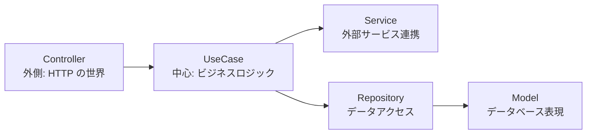
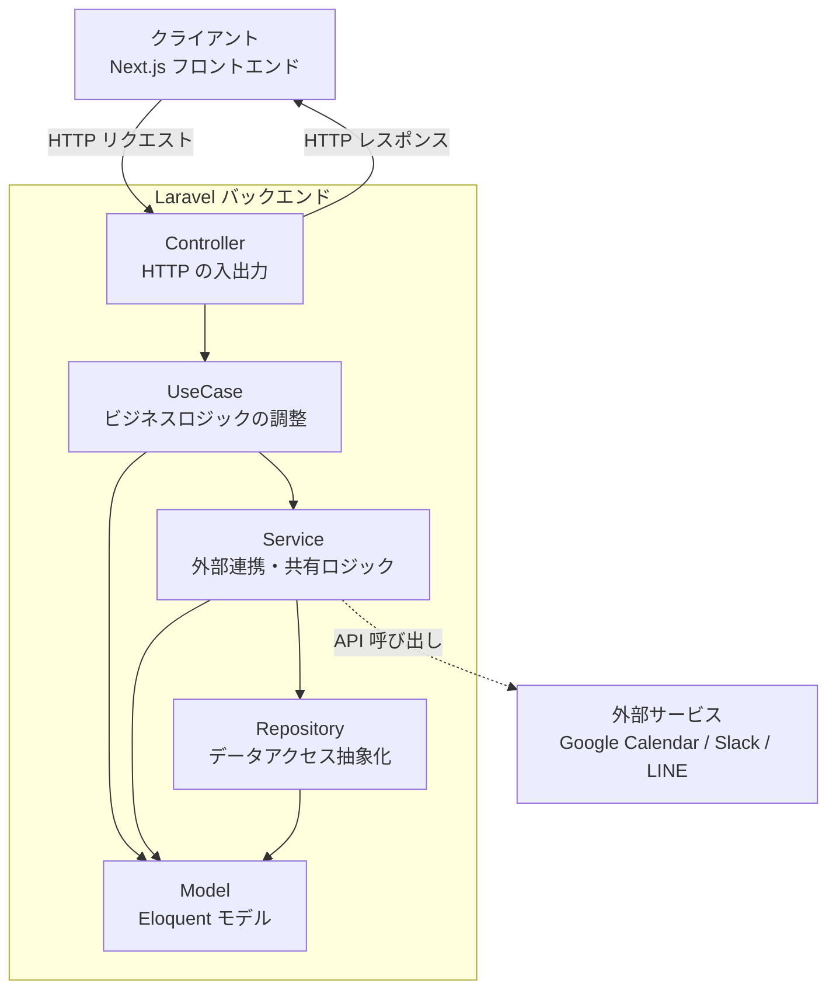
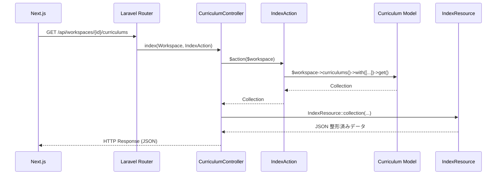

# 4-1-1 なぜ MVC だけでは足りないのか

この Chapter「Clean Architecture パターン」は以下の 4 セクションで構成されます。

| セクション | テーマ | 種類 |
|---|---|---|
| 4-1-1 | なぜ MVC だけでは足りないのか | 概念 |
| 4-1-2 | UseCase パターン | 概念 |
| 4-1-3 | Service 層と Repository パターン | 概念 |
| 4-1-4 | リクエスト/レスポンス変換層 | 概念 |

**Chapter ゴール**: LMS の Laravel アーキテクチャ（UseCase/Service/Repository）の設計思想と各層の役割を理解する

📖 まず本セクションで Laravel の標準 MVC がなぜ大規模開発で限界を迎えるかを理解し、Clean Architecture の思想と LMS が採用するレイヤー構成の全体像を把握します。次にセクション 4-1-2 で UseCase 層の設計パターンを深掘りし、4-1-3 で Service 層と Repository パターンによるビジネスロジックとデータアクセスの分離を学びます。最後に 4-1-4 でリクエスト/レスポンスの変換層（FormRequest / Resource）を理解します。4 つのセクションを通して、LMS バックエンドの各層がどのような責務を持ち、なぜそのように分けられているかが見えるようになります。

📝 **前提知識**: このセクションは COACHTECH 教材 tutorial-9（Laravel MVC 基礎）の内容を前提としています。

## 🎯 このセクションで学ぶこと

- Laravel 標準の MVC パターンが大規模開発で抱える問題（**Fat Controller** 問題）を理解する
- **Clean Architecture** の基本思想（依存の方向・関心の分離）を理解する
- LMS が採用するレイヤー構成（Controller → UseCase → Service → Repository → Model）の全体像を把握する

MVC の限界から出発し、Clean Architecture の思想を経て、LMS が実際に採用しているレイヤー構成を学びます。

---

## 導入: Controller が肥大化していく痛み

tutorial-9 で学んだ Laravel の MVC パターンを思い出してください。Controller がリクエストを受け取り、Model を操作し、View（または JSON レスポンス）を返す。シンプルな CRUD アプリケーションであれば、この構造で十分に機能します。

しかし、LMS のような本格的なアプリケーションでは、1 つの操作に対して多くの処理が必要になります。たとえば「面談を予約する」という操作を考えてみましょう。

1. リクエストのバリデーション
2. 同じ時間帯に既存の予約がないか確認
3. データベースに面談レコードを作成
4. Google Calendar にイベントを作成
5. 面談 URL を設定
6. Slack と LINE で担当者に通知

これらをすべて Controller に書くと、どうなるでしょうか。

```php
// もし全ての処理を Controller に書いたら...
class MeetingController extends Controller
{
    public function store(Request $request, Workspace $workspace)
    {
        // 1. バリデーション
        $validated = $request->validate([
            'employee_id' => 'required|exists:employees,id',
            'user_id' => 'required|exists:users,id',
            'start_datetime' => 'required|date',
            'end_datetime' => 'required|date|after:start_datetime',
        ]);

        // 2. 重複チェック
        $existingMeeting = Meeting::where('user_id', $validated['user_id'])
            ->where(function ($query) use ($validated) {
                $query->where(function ($q) use ($validated) {
                    $q->where('start_datetime', '<=', $validated['start_datetime'])
                        ->where('end_datetime', '>', $validated['start_datetime']);
                })->orWhere(function ($q) use ($validated) {
                    $q->where('start_datetime', '<', $validated['end_datetime'])
                        ->where('end_datetime', '>=', $validated['end_datetime']);
                });
            })
            ->exists();

        if ($existingMeeting) {
            throw new Exception('同じ時間帯に面談を予約しています');
        }

        // 3. Google Calendar 連携
        $employee = Employee::find($validated['employee_id']);
        $user = User::find($validated['user_id']);
        $meetingUrl = null;
        $googleEventId = null;

        if ($employee->googleCalendarToken) {
            $client = new Google_Client();
            $client->setAccessToken($employee->googleCalendarToken->access_token);
            // ... Google Calendar API の呼び出し（数十行のコード）
            $meetingUrl = $googleCalendarEvent->hangoutLink;
            $googleEventId = $googleCalendarEvent->id;
        }

        // 4. 面談レコード作成
        $meeting = Meeting::create([
            'workspace_id' => $workspace->id,
            'user_id' => $user->id,
            'employee_id' => $employee->id,
            'start_datetime' => $validated['start_datetime'],
            'end_datetime' => $validated['end_datetime'],
            'meeting_url' => $meetingUrl,
            'google_event_id' => $googleEventId,
        ]);

        // 5. 通知処理
        // ... Slack 通知のコード（十数行）
        // ... LINE 通知のコード（十数行）

        return response()->json($meeting, 201);
    }
}
```

この例は極端に見えるかもしれませんが、機能追加を重ねるうちに Controller のメソッドが数百行に膨れ上がるのは珍しくありません。この状態を **Fat Controller**（太ったコントローラー）と呼びます。

### 🧠 先輩エンジニアはこう考える

> LMS の開発初期を振り返ると、まさにこの Fat Controller の問題を肌で感じていました。最初はシンプルだった Controller が、Google Calendar 連携の追加、Slack 通知の追加、LINE 通知の追加と機能が増えるたびに膨張していく。1 つの Controller メソッドが 200 行を超えると、バグの原因を探すだけで一苦労です。さらに「通知ロジックだけ変えたい」というときに、面談作成ロジックの真ん中にある通知コードを慎重に書き換える必要があり、意図しない副作用が怖くて手を入れにくくなります。Controller は HTTP リクエストを受け取る入り口なので、ここにすべてを詰め込むと「入り口が倉庫を兼ねている」ような状態になるのです。


---

## MVC の構造的限界

Fat Controller は単なるコードの長さの問題ではありません。根本的な構造の問題を引き起こします。

### 責務の混在

先ほどの例を見ると、1 つの Controller メソッドの中に 5 つ以上の異なる関心事が混在しています。

| 関心事 | 具体的な処理 |
|---|---|
| HTTP 処理 | リクエストの受け取り、レスポンスの返却 |
| バリデーション | 入力値の検証 |
| ビジネスルール | 重複予約チェック |
| 外部サービス連携 | Google Calendar API の呼び出し |
| データ永続化 | データベースへの保存 |
| 通知 | Slack・LINE への送信 |

これらが 1 箇所にまとまっていると、以下の問題が生じます。

**テストが困難になる**: 「重複予約チェックのロジックだけをテストしたい」と思っても、Controller メソッド全体を実行するしかありません。HTTP リクエストの組み立て、データベースの準備、外部 API のモック、通知のモックをすべてセットアップする必要があります。

**再利用ができない**: 「面談予約」のロジックを別の場所（たとえばバッチ処理やコマンドライン）から呼びたくなったとき、Controller に書かれたロジックを直接呼び出すことはできません。Controller は HTTP リクエストに依存しているためです。

**変更の影響範囲が読めない**: Google Calendar の連携方法を変更したいとき、影響が面談作成ロジック全体に波及する可能性があります。通知処理の修正が、意図せずデータ永続化のロジックに影響を与えるリスクもあります。

### MVC は「どこに何を書くか」を十分に規定しない

Laravel の MVC パターンは、以下の 3 層を提供しています。

- **Model**: データベースとのやり取り（Eloquent）
- **View**: 表示ロジック（Blade テンプレートや JSON レスポンス）
- **Controller**: Model と View をつなぐ

問題は、**ビジネスロジックの置き場所** が明確に規定されていない点です。「重複予約チェック」や「Google Calendar 連携」はどこに書くべきでしょうか。Model でしょうか、Controller でしょうか。

MVC の 3 層だけでは、この問いに対する明確な答えがありません。結果として、行き場のないロジックが Controller に集まり、Fat Controller が生まれるのです。

💡 **TIP**: 「Model に書けばいい」と思うかもしれません。しかし、Google Calendar 連携や Slack 通知のような外部サービスとの連携ロジックを Eloquent Model に書くと、今度は **Fat Model** の問題が生じます。Model の責務は「データベースのテーブルを表現すること」であり、外部 API との連携はその範囲を超えています。

---

## Clean Architecture の思想

Fat Controller 問題の根本的な解決策は、「責務ごとにレイヤーを分ける」ことです。この考え方を体系化したのが、Robert C. Martin（通称 Uncle Bob）が提唱した **Clean Architecture** です。

LMS のアーキテクチャを理解するために、Clean Architecture の核心となる 2 つの原則を押さえましょう。

### 原則 1: 関心の分離

**関心の分離**（Separation of Concerns）とは、異なる種類の処理を異なる場所に配置するという原則です。

先ほどの Fat Controller の例に当てはめると、以下のように分離します。

- HTTP の入出力処理 → **Controller** が担当
- 入力値の検証 → **FormRequest** が担当
- ビジネスロジック → **UseCase** が担当
- 外部サービス連携 → **Service** が担当
- データベースアクセス → **Repository** が担当
- レスポンスの整形 → **Resource** が担当

こうすることで、各クラスは 1 つの関心事だけに集中できます。Google Calendar の連携方法が変わっても、修正するのは Service だけです。Controller も UseCase もデータベースアクセスも影響を受けません。

### 原則 2: 依存の方向

Clean Architecture のもう 1 つの重要な原則は、**依存の方向を一方向に保つ** ことです。



この図で重要なのは、矢印の方向です。外側（HTTP の世界）から内側（ビジネスロジック）に向かって依存しており、内側が外側に依存することはありません。

具体的に言うと、UseCase は「Controller がどうリクエストを受け取ったか」を知りません。HTTP 経由で呼ばれたのか、コマンドラインから呼ばれたのか、テストから呼ばれたのかに関係なく、同じビジネスロジックが実行されます。この独立性が、テストのしやすさと再利用性をもたらします。

🔑 **キーポイント**: Clean Architecture の本質は「ビジネスロジックを外部の技術的な詳細（HTTP、データベース、外部 API）から独立させること」です。学術的な図の形を暗記する必要はありません。「内側のロジックが外側の技術に依存しない」という方向性を理解していれば十分です。

---

## LMS のレイヤー構成

LMS の Laravel 10 バックエンドは、Clean Architecture の思想をベースに、以下の 5 つのレイヤーで構成されています。



それぞれのレイヤーがどのディレクトリに対応するかを見てみましょう。

```
backend/app/
├── Http/
│   ├── Controllers/          # Controller 層
│   ├── Requests/             # FormRequest（バリデーション）
│   └── Resources/            # Resource（レスポンス整形）
├── UseCases/                 # UseCase 層（67 ドメイン、277 ファイル）
│   ├── Auth/
│   ├── Curriculum/
│   ├── Meeting/
│   ├── User/
│   └── ...
├── Services/                 # Service 層
│   ├── GoogleCalendar/
│   ├── Slack/
│   ├── Line/
│   └── ...
├── Repositories/             # Repository 層
│   └── GoogleCalendarToken/
└── Models/                   # Model 層（Eloquent）
```

📝 **ノート**: LMS の UseCase は 67 のドメインディレクトリに分かれており、合計 277 のファイルがあります。各ドメインは `IndexAction.php`、`StoreAction.php`、`UpdateAction.php`、`DestroyAction.php` といったアクション単位でファイルが分かれています。この「1 ファイル 1 アクション」の設計については、次のセクション 4-1-2 で詳しく学びます。

---

## 各層の責務

レイヤー構成の全体像が見えたところで、各層の責務を整理しましょう。

### 責務サマリー

| レイヤー | 責務 | LMS のディレクトリ | 具体例 |
|---|---|---|---|
| **Controller** | HTTP リクエストの受け取りとレスポンスの返却。UseCase の呼び出しを仲介する | `Http/Controllers/` | `CurriculumController` |
| **UseCase** | 1 つのユースケース（操作）に対応するビジネスロジック。Service や Model を組み合わせて処理を調整する | `UseCases/` | `Meeting/StoreAction` |
| **Service** | 外部サービス連携や、複数の UseCase で共有されるビジネスロジック | `Services/` | `GoogleCalendarService` |
| **Repository** | データベースアクセスの抽象化。インターフェースを通じて Eloquent の詳細を隠蔽する | `Repositories/` | `GoogleCalendarTokenRepository` |
| **Model** | データベーステーブルの表現。リレーション定義やスコープ | `Models/` | `Meeting`, `User`, `Workspace` |

### 実際のコードで見る分離

Fat Controller の例で見た「面談予約」が、LMS では実際にどのように分離されているかを見てみましょう。

まず Controller です。驚くほどシンプルになっています。

```php
// backend/app/Http/Controllers/MeetingController.php（該当部分）
public function store(StoreRequest $request, Workspace $workspace, StoreAction $action)
{
    $action(
        $workspace,
        $request->employee_id,
        $request->user_id,
        $request->start_datetime,
        $request->end_datetime,
    );

    return response()->json(null, 201);
}
```

Controller は HTTP リクエストを受け取り、UseCase（`StoreAction`）を呼び出し、HTTP レスポンスを返すだけです。バリデーションは `StoreRequest`（FormRequest）に、ビジネスロジックは `StoreAction` に分離されています。

次に UseCase です。

```php
// backend/app/UseCases/Meeting/StoreAction.php
class StoreAction
{
    protected $createMeetingService;

    public function __construct(CreateMeetingService $createMeetingService)
    {
        $this->createMeetingService = $createMeetingService;
    }

    public function __invoke(
        Workspace $workspace,
        string $employeeId,
        string $userId,
        string $startDatetime,
        string $endDatetime
    ) {
        $user = User::find($userId);
        $employee = Employee::find($employeeId);

        ($this->createMeetingService)(
            $workspace, $user, $employee, $startDatetime, $endDatetime
        );
    }
}
```

UseCase は必要なデータを組み立て、Service に処理を委譲しています。`__invoke` メソッドを持つ **Invokable クラス** として実装されており、`$action($workspace, ...)` のように関数のように呼び出せます。この設計パターンの詳細はセクション 4-1-2 で学びます。

そして Service です。以下は主要部分の抜粋です。

```php
// backend/app/Services/Meeting/CreateMeetingService.php（主要部分の抜粋）
class CreateMeetingService
{
    protected $googleCalendarService;

    public function __construct(GoogleCalendarService $googleCalendarService)
    {
        $this->googleCalendarService = $googleCalendarService;
    }

    public function __invoke(
        Workspace $workspace, User $user, Employee $employee,
        string $startDatetime, string $endDatetime
    ) {
        return DB::transaction(function () use ($workspace, $user, $employee, $startDatetime, $endDatetime) {
            // 重複チェック
            // Google Calendar 連携
            // 面談レコード作成
            // 通知処理（Slack / LINE）
        });
    }
}
```

Service は実際のビジネスロジック（重複チェック、Google Calendar 連携、通知処理）を担当しています。データベーストランザクション管理もこの層で行われます。Service は別の Service（`GoogleCalendarService`）を注入して利用しており、外部連携のロジックもさらに分離されています。

### 分離によって得られるもの

Fat Controller を分離した結果、何が改善されたかをまとめます。

| 観点 | Fat Controller | レイヤー分離後 |
|---|---|---|
| **テスト** | Controller 全体を実行する必要がある | UseCase 単体、Service 単体でテスト可能 |
| **再利用** | HTTP 経由でしか呼べない | UseCase はコマンドライン・バッチからも呼べる |
| **変更の影響範囲** | 1 箇所の変更が全体に波及する恐れ | Google Calendar の変更は Service のみ影響 |
| **可読性** | 1 メソッドに数百行 | 各クラスが 1 つの責務に集中し短い |
| **協業** | 1 ファイルの同時編集が発生しやすい | 層ごとに担当を分けて並行開発しやすい |

### 🧠 先輩エンジニアはこう考える

> LMS で Clean Architecture を導入してから最も変わったのは「コードの変更が怖くなくなった」ことです。以前は Google Calendar の仕様変更があると「面談予約に影響しないか」「他の機能も壊れないか」と広範囲にテストが必要でした。レイヤーを分離してからは、`GoogleCalendarService` だけを見れば影響範囲が把握できます。また、Claude Code に修正を依頼するときも「`Services/GoogleCalendar/` のこの部分を変えて」と指示すれば、ビジネスロジックを壊すリスクなく修正できます。レイヤー構成があること自体が、コミュニケーションの共通言語になるのです。

---

## リクエストの処理フロー

最後に、HTTP リクエストが各レイヤーをどのように流れるかを、カリキュラム一覧取得を例に追跡してみましょう。



実際のコードを見てみましょう。

```php
// backend/app/Http/Controllers/CurriculumController.php
public function index(Workspace $workspace, IndexAction $action)
{
    return IndexResource::collection($action($workspace));
}
```

```php
// backend/app/UseCases/Curriculum/IndexAction.php
class IndexAction
{
    public function __invoke(Workspace $workspace)
    {
        return $workspace->curriculums()
            ->orderBy('order', 'asc')
            ->with(['chapters' => function ($query) {
                $query->orderBy('order', 'asc')
                    ->with(['sections' => function ($query) {
                        $query->orderBy('order', 'asc');
                    }]);
            }])
            ->get();
    }
}
```

Controller はわずか 1 行です。UseCase（`IndexAction`）を呼び出し、その結果を `IndexResource` でレスポンス用に整形して返しています。UseCase はデータの取得ロジック（並び順の指定、リレーションの Eager Loading）に集中しています。

注目すべきは、Controller のメソッド引数に `IndexAction $action` と書くだけで、Laravel の **サービスコンテナ** が自動的に UseCase のインスタンスを生成して注入してくれる点です。この仕組みを **依存注入**（Dependency Injection）と呼びます。`new IndexAction()` と手動でインスタンスを作る必要がなく、UseCase が他の Service に依存している場合も、それらの依存関係を Laravel が自動的に解決します。

⚠️ **注意**: この例ではシンプルなデータ取得のため UseCase が直接 Eloquent Model を使っていますが、外部サービス連携が絡む場合は UseCase → Service → Repository という流れになります。すべてのリクエストが全レイヤーを必ず通るわけではなく、処理の複雑さに応じて適切なレイヤーを使い分けるのが LMS のアーキテクチャの特徴です。

---

## ✨ まとめ

- Laravel の標準 MVC パターンでは、ビジネスロジックの置き場所が明確でないため、機能追加に伴い Controller が肥大化する **Fat Controller** 問題が生じる
- **Clean Architecture** の核心は、関心の分離（各レイヤーが 1 つの責務に集中する）と依存の方向（外側から内側へ依存する）の 2 つの原則である
- LMS は **Controller → UseCase → Service → Repository → Model** の 5 層構成を採用し、67 ドメイン・277 の UseCase ファイルでビジネスロジックを整理している
- レイヤー分離により、テスト容易性・再利用性・変更の局所化・可読性が大きく向上する

---

次のセクションでは、UseCase 層を深掘りし、Invokable クラス（`__invoke`）による単一責務の UseCase 設計、コンストラクタを通じた依存注入、そして複数の UseCase を組み合わせる UseCase 間の合成パターンを LMS の実例で学びます。
