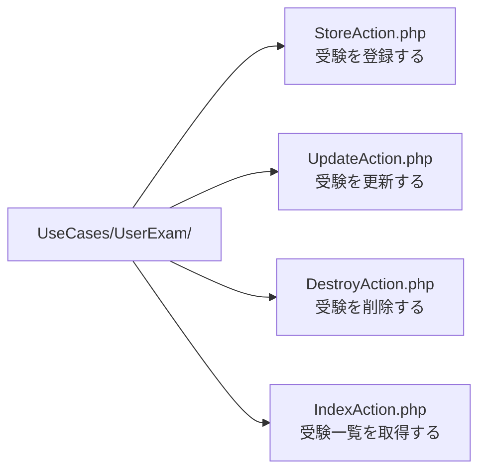
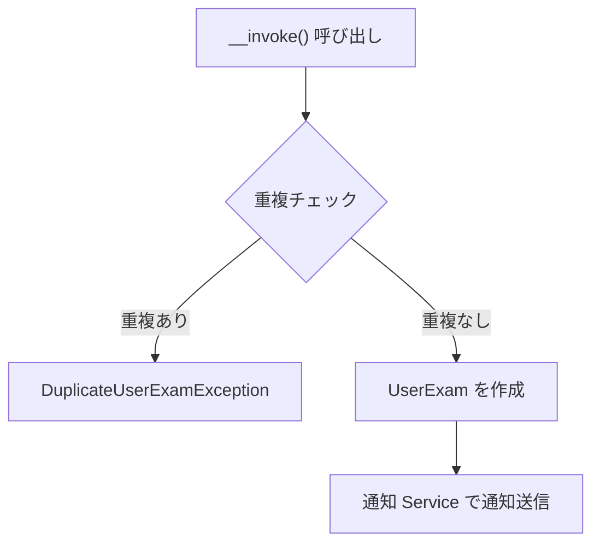
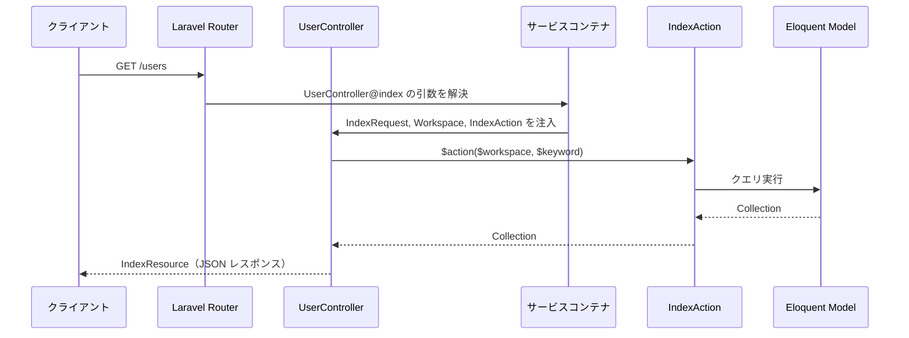

# 4-1-2 UseCase パターン

📝 **前提知識**: このセクションはセクション 4-1-1 なぜ MVC だけでは足りないのかの内容を前提としています。

## 🎯 このセクションで学ぶこと

- PHP の `__invoke()` マジックメソッドを使った Invokable クラスの仕組みと、UseCase にこのパターンを採用する理由を理解する
- LMS の UseCase ディレクトリの組織パターン（67 ドメイン、277 ファイル）を把握する
- シンプル、標準、複雑の 3 段階で UseCase の実コードを読み、設計パターンの使い分けを理解する
- コンストラクタインジェクションとメソッドパラメータインジェクションの違い、Controller からの呼び出しパターンを理解する

セクション 4-1-1 で学んだ「Controller にビジネスロジックを書かない」という原則を、LMS が実際にどう実現しているかを具体的なコードで見ていきます。

---

## 導入: ビジネスロジックの「居場所」問題

セクション 4-1-1 で、Fat Controller の問題を学びました。Controller にバリデーション、重複チェック、データ作成、通知送信といった処理をすべて詰め込むと、コードの見通しが悪くなり、テストも困難になります。

では、Controller から切り出したビジネスロジックはどこに置くべきでしょうか。Laravel の標準的な構成では、Model に寄せる方法（Fat Model）や、Service クラスに切り出す方法がよく採用されます。しかし、LMS では **UseCase** という層を設け、「1 つのユースケース = 1 つのクラス」というルールで整理しています。

この設計には明確な理由があります。「受験を登録する」「コーチを変更する」「ログインする」といった業務上の操作が、それぞれ独立したクラスとして存在するため、コードの場所が直感的に特定でき、影響範囲も明確になります。

### 🧠 先輩エンジニアはこう考える

> LMS の開発を始めたとき、最初は「UseCase って Service と何が違うの？」と思いました。でも実際にコードベースが大きくなると、この分離のありがたみがよくわかります。たとえば「受験の登録処理にバグがある」と言われたら、`UseCases/UserExam/StoreAction.php` を開けばいい。探す必要がないんです。もし Service クラスに複数のメソッドとしてまとめていたら、「UserExamService の中のどのメソッドだっけ？」と探すことになる。UseCase は 1 クラス 1 責務なので、ファイル名がそのままドキュメントになります。

---

## Invokable クラスとは

### PHP の `__invoke()` マジックメソッド

UseCase の仕組みを理解するには、まず PHP の `__invoke()` マジックメソッドを知る必要があります。`__invoke()` は、オブジェクトを関数のように呼び出せるようにする PHP の仕組みです。

```php
// 通常のクラス
class Greeter
{
    public function greet(string $name): string
    {
        return "こんにちは、{$name}さん";
    }
}

$greeter = new Greeter();
$greeter->greet('太郎');  // メソッドを明示的に呼ぶ

// Invokable クラス（__invoke を持つクラス）
class Greeter
{
    public function __invoke(string $name): string
    {
        return "こんにちは、{$name}さん";
    }
}

$greeter = new Greeter();
$greeter('太郎');  // オブジェクトを関数のように呼べる
```

`__invoke()` を定義したクラスのインスタンスは、`$object()` の形式で直接呼び出せます。`$object->execute()` や `$object->handle()` のようにメソッド名を指定する必要がありません。

### なぜ UseCase に `__invoke()` を使うのか

LMS の UseCase が `__invoke()` を採用している理由は、**単一責務の強制** と **呼び出しのシンプルさ** の 2 つです。

🔑 **単一責務の強制**: `__invoke()` を持つクラスは、公開メソッドが実質 1 つだけです。「このクラスは何をするのか」が常に明確で、複数の責務を持たせる誘惑が生まれにくくなります。通常のクラスだと `store()` と `update()` と `destroy()` を 1 つのクラスに書けてしまいますが、Invokable クラスではそれができません。

🔑 **呼び出しのシンプルさ**: Controller から UseCase を呼ぶとき、`$action($workspace, $request->validated())` のように関数呼び出しと同じ構文で書けます。メソッド名を覚える必要がなく、コードの読みやすさが向上します。

```php
// Invokable でない場合: メソッド名を知っている必要がある
$storeAction->execute($workspace, $data);
$storeAction->handle($workspace, $data);
$storeAction->run($workspace, $data);

// Invokable の場合: 統一された呼び出し方
$action($workspace, $data);
```

プロジェクト全体で「UseCase は `__invoke()` で呼ぶ」というルールが統一されているため、どの UseCase を見ても呼び出し方が同じです。この一貫性が、277 ファイルもの UseCase を持つ LMS のコードベースを読みやすくしています。

---

## LMS の UseCase ディレクトリ構造

LMS の UseCase は `backend/app/UseCases/` ディレクトリに格納されています。67 のドメインディレクトリの中に、合計 277 の UseCase ファイルが存在します。

```
backend/app/UseCases/
├── AiChatbotConversation/
├── Auth/
│   ├── Employee/
│   └── User/
├── Curriculum/
├── Employee/
├── Exam/
├── Meeting/
├── User/
├── UserExam/
└── ...（67 ドメイン）
```

### 命名規則: アクション名でファイルを分類

UseCase のファイル名は `{アクション名}Action.php` で統一されています。アクション名を見れば、何をする UseCase かがすぐにわかります。

| アクション名 | ファイル数 | 役割 |
|---|---|---|
| StoreAction | 46 | 新規作成 |
| IndexAction | 40 | 一覧取得 |
| UpdateAction | 36 | 更新 |
| DestroyAction | 25 | 削除 |
| ShowAction | 15 | 単一レコード取得 |
| ReorderAction | 7 | 並び替え |

この命名規則は Laravel のリソースコントローラーのメソッド名（`index`, `store`, `show`, `update`, `destroy`）と対応しています。Laravel の規約に馴染みがあれば、UseCase のファイル名から役割を即座に推測できます。

💡 `Auth/` ディレクトリのように、ドメインの中にさらにサブディレクトリ（`Employee/`, `User/`）を持つケースもあります。これは認証対象が従業員と受講生で異なるため、さらに細かく分類しているためです。

### ディレクトリ構造が意味するもの

この構造のポイントは、**ドメイン（業務領域）ごとにディレクトリを分け、その中に CRUD 操作を表すアクションが並ぶ** という組織パターンです。

たとえば「受験（UserExam）に関するコードを探したい」と思ったら、`backend/app/UseCases/UserExam/` を開くだけです。そこには `StoreAction.php`、`UpdateAction.php`、`DestroyAction.php` といったファイルが並んでおり、どの操作がどのファイルに書かれているかが一目瞭然です。



---

## UseCase の 3 つのパターン

LMS の UseCase を実際のコードで見ていきます。シンプルなものから複雑なものまで、3 つの段階で読み解きましょう。

### パターン 1: シンプル（依存なし）

最もシンプルな UseCase は、外部のサービスに依存せず、Eloquent モデルを直接操作するだけのものです。

```php
// backend/app/UseCases/ExamType/IndexAction.php
class IndexAction
{
    public function __invoke(Workspace $workspace, ?bool $isPublic = null)
    {
        $query = ExamType::with('exams')->where('workspace_id', $workspace->id);
        if ($isPublic !== null) {
            $query->whereHas('exams', function ($query) use ($isPublic) {
                $query->where('is_public', $isPublic);
            });
        }
        return $query->get();
    }
}
```

このコードを読み解きましょう。

- **コンストラクタがない**: 外部の Service や Repository に依存していないため、コンストラクタでの依存注入が不要です
- **`__invoke()` の引数**: `Workspace` モデル（どのワークスペースのデータか）と、オプションのフィルター条件 `$isPublic` を受け取ります
- **処理内容**: Eloquent のクエリビルダーを使い、条件に応じてフィルタリングした結果を返すだけです

「この UseCase の責務は何か？」と問えば、「ワークスペースに属する試験タイプの一覧を、公開状態でフィルタリングして返すこと」と明確に答えられます。

### パターン 2: 標準（依存注入 + ビジネスロジック）

多くの UseCase はこのパターンに該当します。コンストラクタで Service を受け取り、ビジネスルールの検証やデータ作成に加えて、通知などの副作用処理も行います。

```php
// backend/app/UseCases/UserExam/StoreAction.php
class StoreAction
{
    protected $userExamNotificationService;

    public function __construct(UserExamNotificationService $userExamNotificationService)
    {
        $this->userExamNotificationService = $userExamNotificationService;
    }

    public function __invoke(Workspace $workspace, string $examId, string $userId, string $startDate, string $endDate): void
    {
        $existingUserExam = UserExam::where('user_id', $userId)
            ->whereHas('exam.examType', function ($query) use ($workspace) {
                $query->where('workspace_id', $workspace->id);
            })
            ->where('exam_id', $examId)
            ->exists();

        if ($existingUserExam) {
            throw new DuplicateUserExamException();
        }

        $newUserExam = UserExam::create([
            'exam_id' => $examId,
            'user_id' => $userId,
            'status_id' => UserExamStatus::BEFORE_STARTED,
            'start_date' => $startDate,
            'end_date' => $endDate,
        ]);

        $this->userExamNotificationService->notifyUserExam($newUserExam, UserExamNotificationService::CREATED_TYPE);
    }
}
```

パターン 1 との違いに注目してください。

- **コンストラクタでの依存注入**: `UserExamNotificationService` をコンストラクタで受け取り、プロパティに保持しています。この Service は通知の送信を担当します
- **ビジネスルールの検証**: 同じ受講生が同じ試験に既に登録されていないかをチェックし、重複があれば `DuplicateUserExamException` を投げます。これは「重複登録を許さない」という業務ルールをコードで表現しています
- **データ作成**: `UserExam::create()` でレコードを作成し、初期ステータスとして `BEFORE_STARTED` を設定しています
- **副作用処理**: 作成後に通知 Service を呼び出して、関係者に通知を送ります

この UseCase の処理の流れを図で示します。



🔑 ここで重要なのは、**UseCase 自身は通知の送り方を知らない** ということです。通知の具体的な処理（メール送信なのか、Slack 通知なのか）は `UserExamNotificationService` の中に隠蔽されています。UseCase は「通知を送ってくれ」と依頼するだけです。この責務の分離が、コードの変更しやすさにつながります。

### パターン 3: 複雑（トランザクション、複数サービス、条件分岐）

複雑なビジネスロジックを扱う UseCase では、DB トランザクション、複数のサービス呼び出し、環境に応じた条件分岐が組み合わさります。

以下は主要部分の抜粋です。

```php
// backend/app/UseCases/Match/StoreAction.php
class StoreAction
{
    private DeactivateCoachMatchingNotificationService $deactivateCoachMatchingNotificationService;

    public function __construct(
        DeactivateCoachMatchingNotificationService $deactivateCoachMatchingNotificationService
    ) {
        $this->deactivateCoachMatchingNotificationService = $deactivateCoachMatchingNotificationService;
    }

    public function __invoke(Workspace $workspace, string $userId, string $employeeId, string $reason): void
    {
        DB::transaction(function () use ($workspace, $userId, $employeeId, $reason) {
            $oldMatching = $workspace->matches()
                ->where('user_id', $userId)
                ->where('is_active', true)
                ->with(['user', 'employee'])
                ->first();

            $workspace->matches()->where('user_id', $userId)->update(['is_active' => false]);
            $matching = $workspace->matches()->create([...]);

            // Chat room creation if needed
            // Multi-channel notifications (Slack, LINE)
            if (Environment::isProduction()) {
                $this->notificationSlackAndLineToOldCoach($oldMatching);
                $this->notificationSlackAndLineToNewCoach($matching);
            }
        });
    }
}
```

この UseCase が扱っているのは「コーチの変更（マッチング）」という、LMS の中でも重要な業務操作です。

- **`DB::transaction()`**: 複数のデータ操作を 1 つのトランザクションで囲んでいます。旧マッチングの無効化と新マッチングの作成が途中で失敗した場合、すべてロールバックされます。データの整合性を保つために不可欠です
- **旧データの取得と無効化**: 現在アクティブなマッチングを取得してから、`is_active` を `false` に更新しています。旧コーチへの通知に必要な情報を先に取得しておくという順序が重要です
- **環境による条件分岐**: `Environment::isProduction()` で本番環境かどうかを判定し、本番のみ Slack と LINE の通知を送信しています。開発環境やステージング環境で不要な通知が飛ばないようにする配慮です

⚠️ **注意**: UseCase が複雑になりすぎる場合は、処理の一部を Service に切り出すことを検討します。UseCase の `__invoke()` メソッドが長くなりすぎるのは、責務が広がりすぎているサインです。目安として、`__invoke()` の中で「何をしているか」を 3 つ以上の文で説明する必要がある場合は、Service への切り出しを検討しましょう。

---

## 依存注入の 2 つのパターン

UseCase のコードを読んでいると、引数の受け取り方に 2 つのパターンがあることに気づきます。**コンストラクタインジェクション** と **メソッドパラメータインジェクション** です。

### コンストラクタインジェクション

UseCase が動作するために必要な **Service やインフラ的な依存** を、コンストラクタで受け取るパターンです。

```php
// backend/app/UseCases/UserExam/StoreAction.php
public function __construct(UserExamNotificationService $userExamNotificationService)
{
    $this->userExamNotificationService = $userExamNotificationService;
}
```

Laravel のサービスコンテナが、クラスのコンストラクタに型宣言されたクラスを自動的にインスタンス化して渡してくれます。`new StoreAction(new UserExamNotificationService(...))` と手動で書く必要はありません。

💡 PHP 8.0 以降では **コンストラクタプロパティプロモーション** という構文が使えます。LMS のコードベースでは、新しく書かれた UseCase でこの構文が採用されています。

```php
// コンストラクタプロパティプロモーション（PHP 8.0+）
public function __construct(
    private AiChatbotService $aiChatbotService,
    private AiChatbotBedrockService $bedrockService,
) {}
```

これは以下のコードと同じ意味です。

```php
// 従来の書き方
private AiChatbotService $aiChatbotService;
private AiChatbotBedrockService $bedrockService;

public function __construct(
    AiChatbotService $aiChatbotService,
    AiChatbotBedrockService $bedrockService,
) {
    $this->aiChatbotService = $aiChatbotService;
    $this->bedrockService = $bedrockService;
}
```

引数に `private` や `protected` を付けるだけで、プロパティ宣言と代入を省略できます。LMS のコードベースでは両方の書き方が混在していますが、意味は同じです。

### メソッドパラメータインジェクション

`__invoke()` の引数として受け取るのは、**その操作固有のデータ** です。

```php
// backend/app/UseCases/UserExam/StoreAction.php
public function __invoke(Workspace $workspace, string $examId, string $userId, string $startDate, string $endDate): void
```

ここで受け取る `$workspace`、`$examId`、`$userId` などは、リクエストごとに変わる値です。UseCase が「何を対象に」「何の操作をするか」を決めるパラメータと言えます。

### 2 つのパターンの使い分け

| パターン | 受け取るもの | 誰が渡すか | タイミング |
|---|---|---|---|
| コンストラクタインジェクション | Service、Repository などの依存 | Laravel のサービスコンテナ（自動） | UseCase のインスタンス化時 |
| メソッドパラメータインジェクション | リクエスト固有のデータ | Controller（手動） | `__invoke()` の呼び出し時 |

この区別は直感的に理解できるはずです。通知 Service は「受験を登録するたびに毎回同じ Service を使う」ので、インスタンス化時に一度だけ渡せば十分です。一方、どの受講生のどの試験に登録するかは「リクエストごとに異なる」ので、呼び出し時にパラメータとして渡します。

---

## Controller からの呼び出し

UseCase の設計がわかったところで、Controller からどのように呼び出されるかを見てみましょう。

### メソッドインジェクションによる UseCase の受け取り

Laravel では、Controller のメソッド引数に型宣言を書くと、サービスコンテナが自動的にインスタンスを生成して渡してくれます。これを **メソッドインジェクション** と呼びます。

```php
// backend/app/Http/Controllers/UserController.php
public function index(IndexRequest $request, Workspace $workspace, IndexAction $action)
{
    return new IndexResource($action($workspace, $request->keyword));
}

public function update(UpdateRequest $request, Workspace $workspace, User $user, UpdateAction $action)
{
    $action($workspace, $user, $request->validated());
    return response()->json(null, 204);
}
```

このコードで起きていることを整理します。

1. **`IndexAction $action`**: Laravel のサービスコンテナが `IndexAction` のインスタンスを生成し、`$action` に渡します。UseCase のコンストラクタに依存がある場合は、それらも自動的に解決されます
2. **`$action($workspace, $request->keyword)`**: `$action` は Invokable クラスのインスタンスなので、関数のように呼び出せます。`$action->__invoke($workspace, $request->keyword)` と同じ意味です
3. **`IndexResource` でラッピング**: UseCase が返したデータを API リソースクラスで整形してレスポンスにします



🔑 Controller の役割が非常にシンプルになっていることに注目してください。Controller は「リクエストを受け取り、UseCase に処理を委譲し、レスポンスを返す」という接続役に徹しています。ビジネスロジックは一切含まれていません。

### 認証 UseCase の例: 遅延実行パターン

UseCase の中には、少し変わったパターンを使うものもあります。認証の UseCase を見てみましょう。

```php
// backend/app/UseCases/Auth/User/LoginAction.php
class LoginAction
{
    public function __invoke(string $email, string $password): User
    {
        if (! Auth::guard('user')->attempt(['email' => $email, 'password' => $password])) {
            throw new AuthenticationException('ログインに失敗しました。');
        }
        $user = Auth::guard('user')->user();
        $user->load(['activeWorkspace.plan', 'activeMatchings.employee']);

        $activeWorkspace = $user->activeWorkspace;
        $workspaceId = $activeWorkspace->id;
        $isRecentlyActive = $activeWorkspace->is_recently_active;

        app()->terminating(function () use ($workspaceId, $isRecentlyActive) {
            UserWorkspace::where('id', $workspaceId)->update(['last_login_at' => now()]);
        });

        return $user;
    }
}
```

`app()->terminating()` は、レスポンスをクライアントに返した **後** に実行されるコールバックを登録する仕組みです。ログイン日時の更新はレスポンスの内容に影響しないため、クライアントを待たせずにバックグラウンドで処理しています。ユーザー体験に影響しない更新処理を遅延させることで、レスポンス速度を改善するテクニックです。

📝 この `app()->terminating()` パターンは Laravel の機能で、UseCase 固有の仕組みではありません。ただし、LMS ではこのような最適化を UseCase の中に記述しており、Controller には一切影響を与えていない点が設計上のポイントです。

---

## ✨ まとめ

- LMS の UseCase は **Invokable クラス**（`__invoke()` を持つクラス）として実装されており、1 クラス 1 責務のルールで設計されています。ファイル名がそのまま業務操作を表すため、コードの検索性が高くなっています
- UseCase ディレクトリは **ドメインごとに分類** され、67 ドメイン、277 ファイルの規模でも秩序が保たれています。アクション名（StoreAction, IndexAction 等）は Laravel のリソースコントローラーの命名規則と対応しています
- UseCase には **3 つの複雑さのレベル** があります。依存なしのシンプルなクエリ、Service を使ったビジネスロジック付きの標準パターン、トランザクションや複数サービスを組み合わせた複雑なパターンです
- 依存注入は **コンストラクタインジェクション**（Service 等の固定的な依存）と **メソッドパラメータインジェクション**（リクエスト固有のデータ）の 2 種類を使い分けます
- Controller は **メソッドインジェクション** で UseCase を受け取り、`$action()` の形式で呼び出します。これにより Controller はビジネスロジックを持たない薄い接続層として機能します

---

次のセクションでは、UseCase から呼び出される Service 層と Repository パターンを学びます。Service がビジネスロジックや外部連携をどのように担当するか、Repository がデータアクセスをどのように抽象化するか、両者の役割分担、そしてインターフェースバインディングによる依存の逆転を LMS の実コードで理解します。
