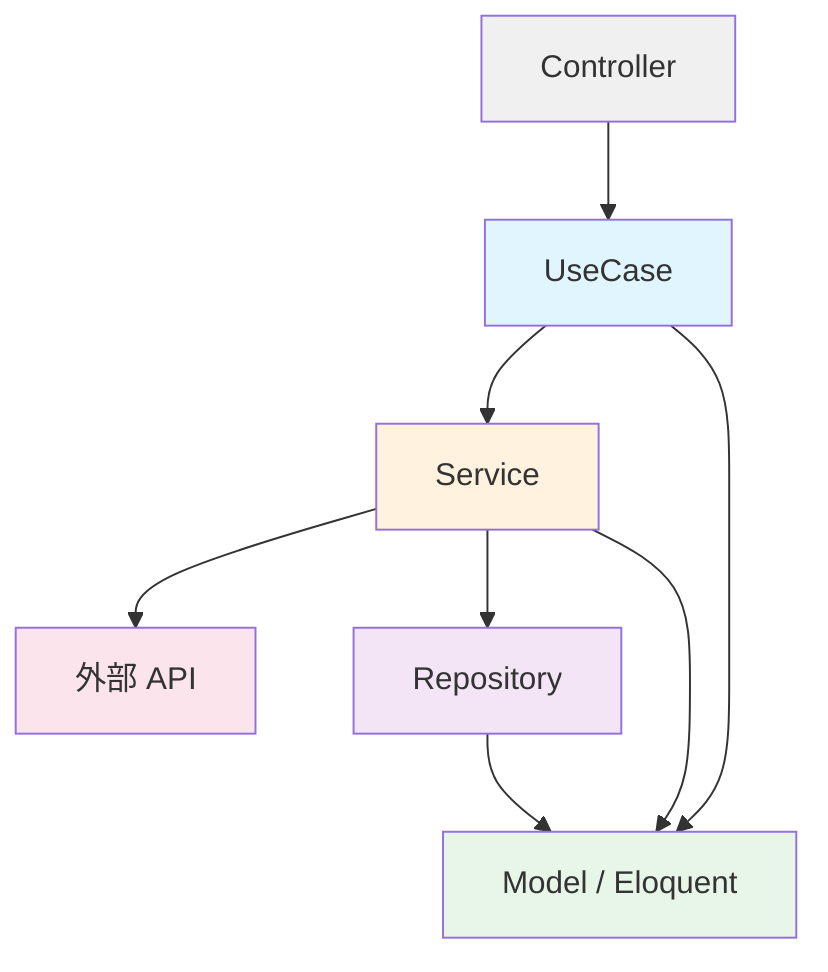
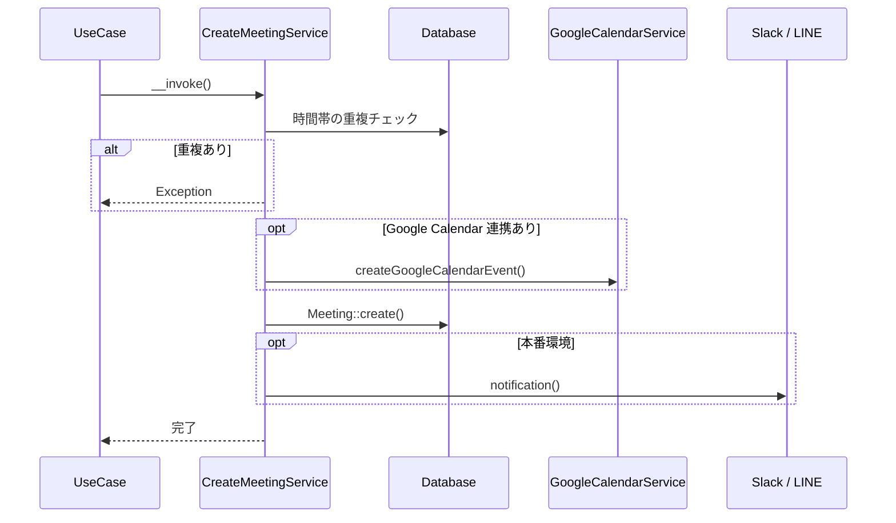
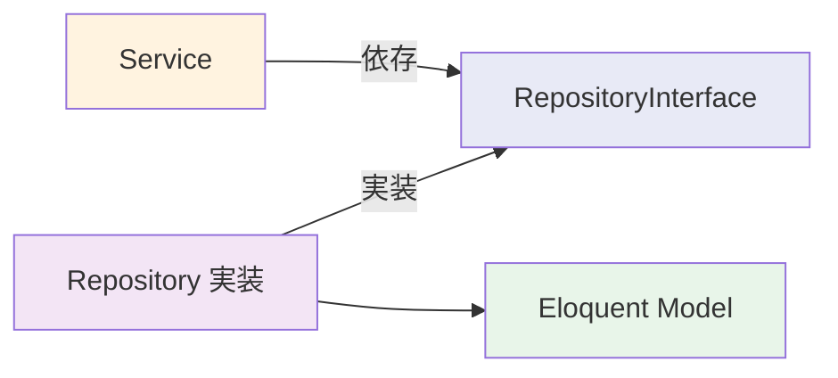
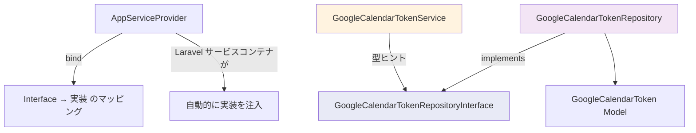
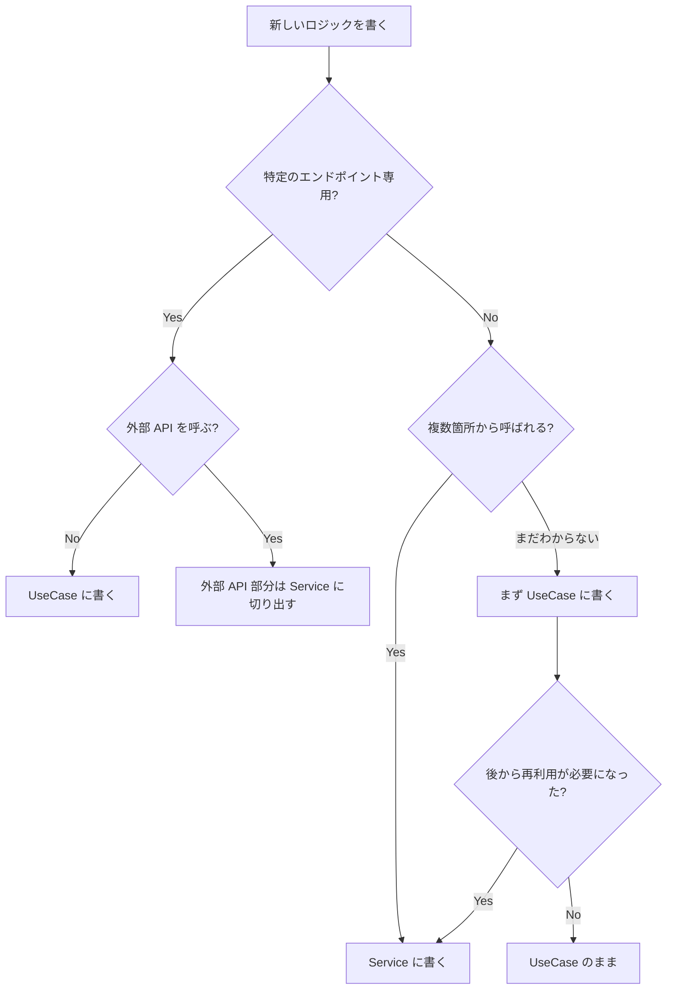

# 4-1-3 Service 層と Repository パターン

📝 **前提知識**: このセクションはセクション 4-1-2 UseCase パターンの内容を前提としています。

## 🎯 このセクションで学ぶこと

- **Service** 層の役割（ビジネスロジックの再利用・外部 API 連携の集約）を理解する
- LMS の Service 実装を **4つのパターン** に分類して読み解く
- **Repository パターン** の思想（インターフェースによるデータアクセスの抽象化）を理解する
- **インターフェースバインディング** の仕組みと Laravel のサービスコンテナとの関係を理解する
- **UseCase と Service の判断基準** を実務の観点で整理する

このセクションでは、まず UseCase だけでは対応しきれない場面を確認し、Service 層がその課題をどう解決するかを学びます。次に Repository パターンによるデータアクセスの抽象化を理解し、最後に UseCase と Service の使い分けの判断基準を整理します。

---

## 導入: UseCase だけでは足りない場面

セクション 4-1-2 で学んだ UseCase は、「1つの API エンドポイントに対応する1つのビジネスロジック」を表現するパターンでした。Controller から直接呼び出され、`__invoke` メソッドで単一の責務を果たします。

しかし、実際の LMS 開発では UseCase だけでは対処しにくい場面が出てきます。

**場面 1: 複数の UseCase で同じロジックを使いたい**

たとえば「AI チャットボットの1日あたりの利用回数を取得する」というロジックは、利用回数を表示する画面でも、新しい会話を開始する画面でも必要です。それぞれの UseCase に同じクエリを書くと、変更時に複数箇所を修正しなければなりません。

**場面 2: 外部 API を呼び出したい**

Google Calendar API や Slack API のような外部サービスとの通信は、認証トークンの管理、リトライ処理、エラーハンドリングなど、エンドポイント固有のロジックとは関係のない複雑さを伴います。UseCase にこれらを直接書くと、ビジネスロジックと外部通信の詳細が混在してしまいます。

**場面 3: データアクセスの方法を差し替えたい**

通常は Eloquent でデータベースにアクセスしますが、テスト時にはモックに差し替えたい、将来的にデータソースを変更する可能性がある、といったケースでは、データアクセスの具体的な実装に直接依存しない設計が求められます。

これらの課題を解決するのが **Service 層** と **Repository パターン** です。

### 🧠 先輩エンジニアはこう考える

> LMS の開発では、最初から Service を作るわけではありません。UseCase を書いていて「あ、この処理は別の画面でも使うな」と気づいたときに Service に切り出す、というのが自然な流れです。逆に、外部 API 連携は最初から Service として設計します。Google Calendar や Slack の通信処理を UseCase に直接書いてしまうと、後から切り出すのが大変になるからです。「再利用性が見えたら Service に切り出す」「外部連携は最初から Service」と覚えておけば、判断に迷うことは少ないと思います。

---

## Service 層の役割

### Service とは何か

Service は、**再利用可能なビジネスロジック** や **外部サービスとの連携** を担うクラスです。UseCase が「特定のエンドポイント専用のロジック」であるのに対し、Service は「複数の UseCase や他の Service から呼ばれる共有ロジック」を提供します。

アーキテクチャの中での位置づけを図で確認しましょう。



Controller は UseCase を呼び、UseCase は必要に応じて Service を呼びます。Service は外部 API との通信や、Repository を通じたデータアクセスを担当します。UseCase が Service を使うことで、UseCase 自身はビジネスフローの組み立てに集中できます。

### LMS の Service ディレクトリ構成

LMS の `backend/app/Services/` には、23 のファイルと 15 のサブディレクトリがあります（2026年3月時点）。

```
backend/app/Services/
├── AWSS3Service.php              # AWS S3 ファイル操作
├── GoogleOAuthService.php         # Google OAuth 認証
├── GoogleCalendarService.php      # Google Calendar API 連携
├── GoogleCalendarTokenService.php # Google Calendar トークン管理
├── GoogleSheetsService.php        # Google Sheets API 連携
├── AiChatbot/                     # AI チャットボット関連
├── Application/                   # 応募関連
├── ChatRoom/                      # チャットルーム関連
├── GoogleCalendar/                # Google Calendar 関連（サブ機能）
├── InvitationEmail/               # 招待メール関連
├── Line/                          # LINE 連携
├── Match/                         # マッチング関連
├── Meeting/                       # 面談関連
├── Slack/                         # Slack 連携
├── UserExam/                      # ユーザー試験関連
└── ...
```

ルート直下のファイルは外部サービスとの低レベルな連携（API クライアント）を担い、サブディレクトリ内のファイルは特定のドメイン領域のビジネスロジックを担います。この構成から、LMS の Service は大きく2つの役割に分かれていることがわかります。

🔑 **Service の2つの役割**:
- **外部 API 連携**: 外部サービスとの通信を抽象化する（ルート直下の Service）
- **ドメインロジックの再利用**: 複数の UseCase から共有されるビジネスロジックを集約する（サブディレクトリの Service）

---

## LMS の Service 実例

LMS の Service を4つのパターンに分類して読み解きます。実際のコードを見ながら、それぞれの特徴を理解しましょう。

### パターン 1: シンプルなクエリ Service

最も単純な Service のパターンです。特定のクエリロジックを再利用可能な形で切り出しています。

```php
// backend/app/Services/AiChatbot/AiChatbotService.php
class AiChatbotService
{
    const DAILY_LIMIT = 100;

    public function getDailyCount(string $workspaceId, string $userId): int
    {
        return AiChatbotConversation::where('workspace_id', $workspaceId)
            ->where('user_id', $userId)
            ->whereDate('created_at', today())
            ->count();
    }
}
```

このクラスは1つのメソッドだけを持ち、「特定のワークスペースとユーザーの今日の AI チャットボット利用回数」を返します。ポイントは以下の2つです。

- **定数の定義**: `DAILY_LIMIT = 100` という上限値を Service に持たせることで、利用回数の取得と上限チェックが同じクラスに集約されます
- **再利用性**: 利用回数の表示にも、利用可否の判定にも、同じメソッドを使い回せます

UseCase にこのクエリを直接書くこともできますが、Service に切り出すことで「1日の利用回数に関するロジック」が一箇所にまとまり、仕様変更時の修正が1箇所で済みます。

### パターン 2: 外部 API 連携 Service

外部サービスの API を呼び出す Service は、認証、エラーハンドリング、リトライなどの複雑さを内部に隠蔽します。

以下は Google Calendar API と連携する Service の主要部分の抜粋です。

```php
// backend/app/Services/GoogleCalendarService.php
class GoogleCalendarService
{
    protected $googleOAuthService;
    protected $googleCalendarTokenService;

    public function __construct(
        GoogleOAuthService $googleOAuthService,
        GoogleCalendarTokenService $googleCalendarTokenService,
    ) {
        $this->googleOAuthService = $googleOAuthService;
        $this->googleCalendarTokenService = $googleCalendarTokenService;
    }

    private function getUserAccessTokenByUserId($userId)
    {
        $googleCalendarTokens = $this->googleCalendarTokenService->search(
            collect(array('user_id' => $userId))
        );
        $googleCalendarToken = $googleCalendarTokens[0];

        if (!$googleCalendarToken) {
            throw new Exception("googleCalendarTokenが見つかりませんでした");
        }

        return $googleCalendarToken['access_token'];
    }

    public function insertEvent($request)
    {
        $properties = $request->only(['summary', 'start_datetime', 'end_datetime', 'user_id']);

        $insertParams = new Google_Service_Calendar_Event(array(
            'summary' => $properties['summary'],
            'start' => array(
                'dateTime' => $properties['start_datetime'],
                'timeZone' => 'Asia/Tokyo',
            ),
            // ...
        ));

        // Google Calendar API を呼び出してイベントを作成
    }
}
```

この Service の構造には、いくつかの重要な特徴があります。

**依存する他の Service をコンストラクタで受け取る**: `GoogleOAuthService`（OAuth 認証クライアント）と `GoogleCalendarTokenService`（トークン管理）を注入しています。Service 同士が協調して動作するパターンです。

**外部 API の詳細を隠蔽する**: このクラスを使う側（UseCase や他の Service）は、Google Calendar API のリクエスト形式やトークンのリフレッシュ処理を知る必要がありません。`insertEvent` を呼ぶだけでイベントが作成されます。

**エラーハンドリングの責務**: トークンが見つからない場合の例外送出など、外部 API 固有のエラー処理がこの層に集約されています。

💡 外部 API 連携の Service は、認証情報の管理やエラーハンドリングなどの共通パターンを持ちます。これらの詳細はセクション 4-4-1 で体系的に学びます。今は「外部 API との通信は Service に集約する」という原則を把握すれば十分です。

### パターン 3: 複雑なビジネスロジック Service

複数の処理を組み合わせたビジネスロジックを、トランザクション内で実行する Service です。

```php
// backend/app/Services/Meeting/CreateMeetingService.php
class CreateMeetingService
{
    protected $googleCalendarService;

    public function __construct(
        GoogleCalendarService $googleCalendarService
    ) {
        $this->googleCalendarService = $googleCalendarService;
    }

    public function __invoke(
        Workspace $workspace,
        User $user,
        Employee $employee,
        string $startDatetime,
        string $endDatetime
    ) {
        return DB::transaction(function () use (
            $workspace, $user, $employee, $startDatetime, $endDatetime
        ) {
            // 1. 時間帯の重複チェック
            $existingMeetingExists = Meeting::where('user_id', $user->id)
                ->where(function ($query) use ($startDatetime, $endDatetime) {
                    $query->where(function ($q) use ($startDatetime) {
                        $q->where('start_datetime', '<=', $startDatetime)
                            ->where('end_datetime', '>', $startDatetime);
                    })
                    ->orWhere(function ($q) use ($endDatetime) {
                        $q->where('start_datetime', '<', $endDatetime)
                            ->where('end_datetime', '>=', $endDatetime);
                    })
                    ->orWhere(function ($q) use ($startDatetime, $endDatetime) {
                        $q->where('start_datetime', '>=', $startDatetime)
                            ->where('end_datetime', '<=', $endDatetime);
                    });
                })
                ->exists();

            if ($existingMeetingExists) {
                throw new Exception('同じ時間帯に面談を予約しています');
            }

            // 2. Google Calendar イベント作成（連携している場合）
            if ($employee->googleCalendarToken) {
                $googleCalendarEvent = $this->createGoogleCalendarEvent(
                    $user, $employee, $startDatetime, $endDatetime
                );
                // ...
            }

            // 3. Meeting レコード作成
            Meeting::create($body);

            // 4. 本番環境のみ通知（Slack・LINE）
            if (Environment::isProduction()) {
                $this->notification($user, $employee, $startDatetime, $endDatetime);
            }
        });
    }
}
```

この Service は `__invoke` メソッドを持っており、UseCase に似た形をしています。しかし、これが `Services/Meeting/` に置かれている理由は、**面談の作成ロジックが複数の UseCase から呼ばれる可能性がある** ためです。

処理の流れを図で整理します。



🔑 **注目すべき設計ポイント**:
- **DB::transaction** で全体を包むことで、途中でエラーが発生した場合にすべての変更がロールバックされます
- **外部 API 連携は別の Service に委譲** しています（`GoogleCalendarService`）。外部 API の詳細を知らずにビジネスロジックを組み立てられます
- **環境に応じた分岐**（`Environment::isProduction()`）で、開発環境では通知を送らないようにしています

### パターン 4: キュー処理 Service

バッチ的な処理をキューで管理する Service です。

以下は招待メールのキュー処理 Service の主要部分の抜粋です。

```php
// backend/app/Services/InvitationEmail/InvitationEmailQueueService.php
class InvitationEmailQueueService
{
    private const MAX_RETRIES = 3;
    private const PROCESS_LIMIT = 50;

    public function enqueue(
        string $email,
        string $userId,
        string $workspaceId,
        ?DateTime $scheduledAt = null
    ): InvitationEmailQueue {
        // 重複チェック: 同じユーザー・ワークスペースで pending または sending のレコードが存在する場合は登録しない
        $existing = InvitationEmailQueue::where('user_id', $userId)
            ->where('workspace_id', $workspaceId)
            ->whereIn('status', [
                InvitationEmailQueueStatus::PENDING,
                InvitationEmailQueueStatus::SENDING,
            ])
            ->first();

        if ($existing) {
            return $existing;
        }

        return InvitationEmailQueue::create([
            'email' => $email,
            'user_id' => $userId,
            'workspace_id' => $workspaceId,
            'status' => InvitationEmailQueueStatus::PENDING,
            'scheduled_at' => $scheduledAt ?? now(),
        ]);
    }

    public function processQueue(?int $limit = null): int
    {
        $limit = $limit ?? self::PROCESS_LIMIT;

        $queues = InvitationEmailQueue::where('status', InvitationEmailQueueStatus::PENDING)
            ->where('scheduled_at', '<=', now())
            ->where('retry_count', '<', self::MAX_RETRIES)
            ->orderBy('scheduled_at', 'asc')
            ->limit($limit)
            ->lockForUpdate()
            ->get();

        $processed = 0;
        foreach ($queues as $queue) {
            if ($this->sendEmail($queue)) {
                $processed++;
            }
        }

        return $processed;
    }
}
```

このパターンは、メール送信のように「失敗する可能性がある処理」を安全に管理するための設計です。

- **enqueue**: 送信対象をキューに登録します。重複チェックにより、同じメールが二重に送信されることを防ぎます
- **processQueue**: キューから未処理のレコードを取得し、順番に処理します。`lockForUpdate()` で排他ロックをかけることで、複数のプロセスが同時に同じレコードを処理することを防ぎます
- **リトライ制御**: `MAX_RETRIES = 3` と `retry_count` により、失敗した場合は最大3回まで再試行します

⚠️ **注意**: `lockForUpdate()` は MySQL の排他ロック（`SELECT ... FOR UPDATE`）を使います。トランザクション内で使わないとロックが効かないため、実際のコードではこのクエリが `DB::transaction` の中で実行されています。

### 4つのパターンの整理

| パターン | 代表例 | 特徴 | 依存先 |
|---|---|---|---|
| シンプルクエリ | `AiChatbotService` | 再利用可能なクエリを切り出す | Model |
| 外部 API 連携 | `GoogleCalendarService` | 外部 API の通信を隠蔽する | 外部 API / 他の Service |
| 複雑なビジネスロジック | `CreateMeetingService` | 複数処理をトランザクションで組み立てる | 他の Service / Model |
| キュー処理 | `InvitationEmailQueueService` | バッチ処理をリトライ付きで管理する | Model |

---

## Repository パターンの思想

### なぜデータアクセスを抽象化するのか

ここまで見てきた Service の多くは、Eloquent Model（`Meeting::create()` や `AiChatbotConversation::where(...)` など）を直接呼び出していました。Laravel では Eloquent が強力なので、多くの場合これで十分です。

しかし、特定の条件ではデータアクセスを抽象化したくなる場面があります。

- **テスト時にデータベースアクセスをモックに差し替えたい**: 外部 API のトークンをデータベースから取得する処理をテストする際、実際のデータベースにアクセスせずにテストしたい
- **データソースの変更可能性**: 現在はデータベースに保存しているが、将来的に Redis やファイルシステムに変更する可能性がある
- **クエリロジックの集約**: 同じテーブルへのアクセスパターンが複数箇所に散らばるのを防ぎたい

Repository パターンは、**インターフェース**（メソッドの契約）と**実装**（具体的なデータアクセス）を分離することで、これらの課題を解決します。

### インターフェースと実装の分離

Repository パターンの構造を図で示します。



Service は **インターフェース** に依存し、**実装クラス** には依存しません。これにより、実装を差し替えても Service のコードを変更する必要がありません。

🔑 これは **依存性逆転の原則**（Dependency Inversion Principle）と呼ばれるソフトウェア設計の原則です。「上位のモジュール（Service）は下位のモジュール（Repository 実装）に直接依存せず、抽象（インターフェース）に依存すべき」という考え方です。

---

## LMS の Repository 実例

LMS では Repository パターンは **GoogleCalendarToken の1箇所だけ** に導入されています。これは重要なポイントなので、まずその設計判断の背景を理解してから、実装を見ていきましょう。

### なぜ GoogleCalendarToken だけなのか

LMS には多くの Model がありますが、Repository が存在するのは GoogleCalendarToken のみです。これは「全モデルに Repository を作る」のではなく、**必要な箇所にだけ導入する** という実践的なアプローチです。

GoogleCalendarToken に Repository が必要な理由は以下の通りです。

- **外部 API 連携と密接に関わるデータ**: Google Calendar のアクセストークン管理は、外部サービスの仕様に強く依存します。トークンの保存方法を変更したい場合（たとえばデータベースから暗号化ストレージに移行するなど）に、Service のコードを変更せずに対応できます
- **テストの容易性**: `GoogleCalendarTokenService` のテスト時に、実際のデータベースアクセスをモックに差し替えられます

一方、`Meeting` や `AiChatbotConversation` などの Model では Repository を使わず、Service から Eloquent を直接呼んでいます。Laravel の Eloquent 自体が十分に抽象化されているため、追加の抽象化層が不要だと判断されているのです。

### 🧠 先輩エンジニアはこう考える

> よく「Clean Architecture では全モデルに Repository を作るべき」という話を見かけますが、LMS ではそうしていません。Repository を作ると、インターフェースの定義・実装クラスの作成・サービスプロバイダーへのバインディング登録と、ファイルが3つ増えます。それに見合うメリットがある箇所にだけ導入する、というのが LMS の方針です。Google Calendar のトークンは、外部 API の仕様変更やセキュリティ要件でデータの保存方法が変わる可能性が高いので Repository で抽象化していますが、たとえば面談（Meeting）のデータは Eloquent で直接操作すれば十分です。過度な抽象化はコードの見通しを悪くするので、「本当に差し替える可能性があるか」を基準に判断しています。

### インターフェースの定義

```php
// backend/app/Repositories/GoogleCalendarToken/GoogleCalendarTokenRepositoryInterface.php
interface GoogleCalendarTokenRepositoryInterface
{
    public function getAll();
    public function show($id);
    public function search(array $params);
    public function hasToken(string $userId);
    public function updateOrCreate($condition, $value);
    public function store($googleCalendarToken);
    public function update($id, $googleCalendarToken);
    public function delete($id);
}
```

インターフェースは「このメソッドが存在すること」だけを宣言し、内部の実装には触れません。CRUD 操作に加え、`search`（条件検索）や `hasToken`（トークンの存在確認）といった、このドメイン固有のメソッドが定義されています。

### 実装クラス

```php
// backend/app/Repositories/GoogleCalendarToken/GoogleCalendarTokenRepository.php
class GoogleCalendarTokenRepository implements GoogleCalendarTokenRepositoryInterface
{
    public function getAll()
    {
        return GoogleCalendarToken::all();
    }

    public function show($id)
    {
        return GoogleCalendarToken::find($id);
    }

    public function search($params)
    {
        $query = GoogleCalendarToken::query();

        if (isset($params['user_id'])) {
            $query->where('user_id', $params['user_id']);
        }

        if (isset($params['user_ids'])) {
            $query->whereIn('user_id', $params['user_ids']);
        }

        return $query->get();
    }

    public function hasToken($userId)
    {
        $token = $this->search(['user_id' => $userId])->first();
        return !empty($token);
    }

    public function store($googleCalendarToken)
    {
        return GoogleCalendarToken::create($googleCalendarToken);
    }

    public function update($id, $googleCalendarToken)
    {
        $this->show($id)->update($googleCalendarToken);
        return $this->show($id);
    }

    public function delete($id)
    {
        return GoogleCalendarToken::destroy($id);
    }
}
```

実装クラスは `implements GoogleCalendarTokenRepositoryInterface` でインターフェースを実装し、各メソッドの中身を Eloquent で記述しています。もしデータの保存先を変更する場合は、同じインターフェースを実装した別のクラスを作成し、バインディングを差し替えるだけで済みます。

### サービスプロバイダーでのバインディング

インターフェースと実装を紐づけるのが、Laravel のサービスコンテナへの **バインディング** です。

```php
// backend/app/Providers/AppServiceProvider.php
public function register()
{
    $this->app->bind(
        GoogleCalendarTokenRepositoryInterface::class,
        GoogleCalendarTokenRepository::class
    );
}
```

`$this->app->bind()` は「`GoogleCalendarTokenRepositoryInterface` が要求されたら、`GoogleCalendarTokenRepository` のインスタンスを渡す」という設定です。これにより、Service のコンストラクタで型ヒントにインターフェースを指定するだけで、Laravel が自動的に実装クラスを注入します。

### Service からの利用

```php
// backend/app/Services/GoogleCalendarTokenService.php
class GoogleCalendarTokenService
{
    protected $googleCalendarTokenRepository;
    protected $googleOAuthService;

    public function __construct(
        GoogleCalendarTokenRepositoryInterface $googleCalendarTokenRepository,
        GoogleOAuthService $googleOAuthService,
    ) {
        $this->googleCalendarTokenRepository = $googleCalendarTokenRepository;
        $this->googleOAuthService = $googleOAuthService;
    }

    public function index()
    {
        return $this->googleCalendarTokenRepository->getAll();
    }

    public function store($request)
    {
        try {
            $properties = $request->only(['user_id', 'code']);
            $client = $this->googleOAuthService->getGoogleClientByJson();
            // ... OAuth 認証処理 ...

            $googleCalendarToken = $this->googleCalendarTokenRepository->store([
                'user_id' => $properties['user_id'],
                'access_token' => $accessToken['access_token'],
                'refresh_token' => $accessToken['refresh_token'],
                'calendar_id' => $calendarId
            ]);
        } catch (\Throwable $th) {
            throw $th;
        }
        return $googleCalendarToken;
    }
}
```

コンストラクタの型ヒントが `GoogleCalendarTokenRepositoryInterface`（インターフェース）になっている点に注目してください。`GoogleCalendarTokenRepository`（実装クラス）ではありません。Service は「データの取得・保存ができること」だけを知っており、「どうやって取得・保存するか」は知りません。

Repository パターン全体の依存関係をまとめます。



---

## UseCase と Service の判断基準

ここまで UseCase（セクション 4-1-2）と Service の両方を学びました。どちらもビジネスロジックを担うクラスですが、その役割は明確に異なります。

| 観点 | UseCase | Service |
|---|---|---|
| **責務** | 1つのユースケース（API エンドポイント）に対応 | 再利用可能なビジネスロジック・外部連携 |
| **呼び出し元** | Controller から直接 | UseCase や他の Service から |
| **再利用性** | 低い（特定のエンドポイント専用） | 高い（複数の UseCase から呼ばれる） |
| **`__invoke`** | 必須 | 任意（`CreateMeetingService` のように使う場合もある） |
| **外部 API** | 直接呼ばない（Service に委譲） | 直接呼ぶ |

実務での判断フローを図にすると以下のようになります。



⚠️ **注意**: UseCase と Service の境界は厳密なルールではなく、チームの合意に基づくガイドラインです。LMS では `CreateMeetingService` のように `__invoke` を持つ Service もあり、UseCase との違いは「配置場所」と「再利用の意図」で判断しています。迷ったときは、まず UseCase に書いて、再利用が必要になった時点で Service に切り出すのが安全なアプローチです。

---

## ✨ まとめ

- **Service 層** は、再利用可能なビジネスロジックと外部 API 連携を担う。UseCase が「エンドポイント専用」なのに対し、Service は「複数箇所から呼ばれる共有ロジック」を提供する
- LMS の Service は **4つのパターン** に分類できる: シンプルクエリ、外部 API 連携、複雑なビジネスロジック、キュー処理
- **Repository パターン** は、インターフェースと実装を分離してデータアクセスを抽象化する。テスト時のモック差し替えやデータソース変更に備える設計
- LMS では **GoogleCalendarToken の1箇所だけ** に Repository を導入している。全モデルに Repository を作るのではなく、必要な箇所にだけ導入する実践的なアプローチ
- **インターフェースバインディング** は `AppServiceProvider` で設定し、Laravel のサービスコンテナが自動的に実装クラスを注入する
- UseCase と Service の判断基準: 「特定のエンドポイント専用なら UseCase、再利用されるなら Service、外部 API は最初から Service」

---

次のセクションでは、Controller と UseCase の間に位置するリクエスト/レスポンス変換層として、FormRequest によるバリデーション分離と Resource による snake_case から camelCase への変換やレスポンス整形の仕組みを学びます。あわせて、LMS での命名規則とディレクトリ構成も確認します。
