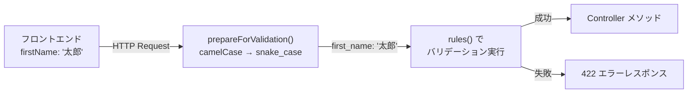
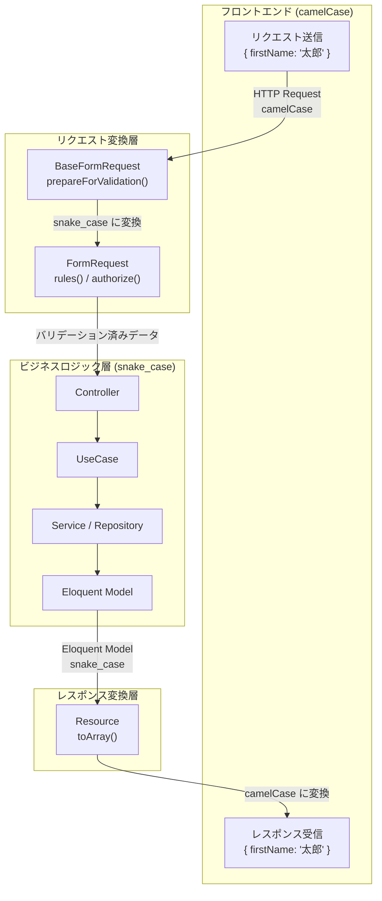

# 4-1-4 リクエスト/レスポンス変換層

📝 **前提知識**: このセクションはセクション 4-1-1（Clean Architecture の全体像と Controller の役割）の内容を前提としています。

## 🎯 このセクションで学ぶこと

- フロントエンドとバックエンドの命名規則の違い（camelCase vs snake_case）と、その変換がなぜ必要かを理解する
- FormRequest によるバリデーションロジックの分離パターンを把握する
- BaseFormRequest による camelCase→snake_case 自動変換の仕組みを理解する
- Resource による snake_case→camelCase 変換とレスポンス整形のパターンを学ぶ
- LMS の Requests / Resources ディレクトリ構成と命名規則を把握する

まず「なぜ変換層が必要なのか」をフロントエンドとバックエンドの言語的な違いから理解し、FormRequest と Resource それぞれの役割と LMS での実装パターンを順に見ていきます。最後にリクエストからレスポンスまでの全体像を Mermaid 図で整理します。

---

## 導入: フロントエンドとバックエンドの「言葉の壁」

Web アプリケーション開発では、フロントエンドとバックエンドが異なるプログラミング言語で書かれることが一般的です。LMS もフロントエンドは TypeScript（JavaScript）、バックエンドは PHP（Laravel 10）で構成されています。この 2 つの言語には、プロパティの命名規則に根本的な違いがあります。

| 言語 | 慣習的な命名規則 | 例 |
|---|---|---|
| JavaScript / TypeScript | **camelCase** | `firstName`, `lastName`, `lastLoginAt` |
| PHP / Laravel | **snake_case** | `first_name`, `last_name`, `last_login_at` |

フロントエンドから API にリクエストを送るとき、JavaScript の慣習に従って `{ "firstName": "太郎" }` という JSON が送られます。一方、Laravel のデータベースカラムや Eloquent モデルのプロパティは `first_name` です。レスポンスを返すときも、データベースの `first_name` をそのまま返すとフロントエンドで `user.first_name` と書く必要があり、JavaScript の慣習に反します。

つまり、フロントエンドとバックエンドの間には **命名規則の変換** が必要です。さらに、Controller にバリデーションロジックやレスポンス整形のコードが混在すると、Controller が肥大化してしまいます。

Laravel はこの 2 つの課題を解決するための仕組みを提供しています。

- **FormRequest**: リクエストのバリデーションと変換を Controller から分離する
- **Resource**: レスポンスの整形と変換を Controller から分離する

### 🧠 先輩エンジニアはこう考える

> LMS の初期開発では、Controller の中にバリデーションもレスポンス整形も全部書いていた時期がありました。1 つの Controller メソッドが 50 行を超えて、「この Controller は何をしているのか」が読み取りにくくなったんです。FormRequest と Resource に分離してからは、Controller のメソッドが 3〜5 行になりました。Controller を見れば「何を受け取って、何を処理して、何を返すか」が一目で分かる。命名規則の変換も BaseFormRequest と Resource に集約されているので、「camelCase と snake_case の変換ってどこでやってるんだっけ？」と迷うことがなくなりました。

---

## FormRequest の役割

### Controller からバリデーションを分離する

Laravel の基本的なバリデーションは、Controller のメソッド内に `$request->validate([...])` と書く方法です。

```php
// バリデーションを Controller に直接書く場合
public function store(Request $request)
{
    $validated = $request->validate([
        'first_name' => 'required|string',
        'last_name' => 'required|string',
        'email' => 'required|string|unique:employees,email',
    ]);

    // ビジネスロジック...
}
```

この書き方はシンプルですが、バリデーションルールが増えると Controller が長くなります。また、同じエンティティの `store` と `update` で似たバリデーションルールを使いたい場合に、ルールが重複してしまいます。

**FormRequest** は、バリデーションロジックを専用のクラスに分離する仕組みです。Controller のメソッド引数の型を `Request` から `FormRequest` に変えるだけで、Laravel が自動的にバリデーションを実行します。

```php
// FormRequest を使う場合
public function store(StoreRequest $request, Workspace $workspace, StoreAction $action)
{
    return new ShowResource($action($workspace, $request->validated()));
}
```

Controller のメソッドは 1 行になりました。バリデーションは `StoreRequest` クラスに、ビジネスロジックは `StoreAction`（UseCase）に、レスポンス整形は `ShowResource` にそれぞれ分離されています。

🔑 **FormRequest の動作タイミング**: FormRequest のバリデーションは Controller のメソッドが実行される **前に** 自動的に行われます。バリデーションに失敗した場合は、Controller のメソッドに到達する前に 422 エラーレスポンスが返されます。

### BaseFormRequest による camelCase→snake_case 自動変換

LMS では、すべての FormRequest が直接 `Illuminate\Foundation\Http\FormRequest` を継承するのではなく、独自の `BaseFormRequest` を継承しています。この基底クラスが命名規則の変換を担います。

```php
// backend/app/Http/Requests/BaseFormRequest.php
class BaseFormRequest extends FormRequest
{
    protected function prepareForValidation()
    {
        $this->replace($this->convertKeys($this->all()));
    }

    private function convertKeys(array $array)
    {
        $result = [];
        foreach ($array as $key => $value) {
            $newKey = Str::snake($key);
            if (is_array($value)) {
                $value = $this->convertKeys($value);
            }
            $result[$newKey] = $value;
        }
        return $result;
    }
}
```

この仕組みを順に見ていきましょう。

1. **`prepareForValidation()`** は Laravel が提供するフックメソッドで、バリデーション実行 **前に** 自動的に呼ばれます
2. **`$this->all()`** でリクエストの全データを取得します（例: `{ "firstName": "太郎" }`）
3. **`convertKeys()`** がすべてのキーを `Str::snake()` で snake_case に変換します（例: `firstName` → `first_name`）
4. ネストされた配列も再帰的に変換されます
5. **`$this->replace()`** で変換後のデータでリクエストデータを置き換えます

この仕組みにより、フロントエンドは JavaScript の慣習どおり `camelCase` でデータを送り、バリデーションルールや後続の処理ではすべて `snake_case` で扱えます。個々の FormRequest で変換を書く必要はありません。



💡 **TIP**: `prepareForValidation()` は Laravel の `FormRequest` が提供するメソッドで、バリデーション前にデータを加工するために設計されています。LMS ではキー名の変換に使っていますが、一般的にはデフォルト値の設定やデータのフォーマット変換（例: 電話番号のハイフン除去）にも使われます。

---

## LMS の FormRequest 実例

### シンプルな FormRequest

最も基本的なパターンは、`rules()` でバリデーションルールを定義し、`messages()` でカスタムエラーメッセージを指定するものです。

```php
// backend/app/Http/Requests/Employee/StoreRequest.php
class StoreRequest extends BaseFormRequest
{
    public function rules()
    {
        return [
            'first_name' => 'string',
            'last_name' => 'string',
            'email' => 'string|unique:employees,email',
            'role' => 'string|in:cs,coach',
        ];
    }

    public function messages()
    {
        return [
            'email.unique' => 'メールアドレスがすでに使用されています。',
            'role.in' => '役割はcsまたはcoachのみです。',
        ];
    }
}
```

ここで注目すべき点は、`rules()` のキーが `first_name`（snake_case）であることです。フロントエンドからは `firstName`（camelCase）で送られますが、`BaseFormRequest` の `prepareForValidation()` が事前に変換してくれるため、バリデーションルールは snake_case で書けばよいのです。

`messages()` メソッドはバリデーション失敗時のエラーメッセージをカスタマイズします。Laravel のデフォルトエラーメッセージは英語なので、日本語のユーザー向けメッセージに置き換えています。

### Enum バリデーション

PHP 8.1 で導入された Enum（列挙型）をバリデーションルールに活用するパターンです。

```php
// backend/app/Http/Requests/Exercise/StoreRequest.php
class StoreRequest extends BaseFormRequest
{
    public function rules()
    {
        return [
            'chapter_id' => 'required|string|exists:chapters,id',
            'title' => 'required|string|max:255',
            'type' => ['required', 'integer', new Enum(ExerciseType::class)],
        ];
    }
}
```

`new Enum(ExerciseType::class)` は Laravel 9 以降で使えるバリデーションルールオブジェクトです。`ExerciseType` という Enum に定義された値のいずれかであることを検証します。文字列ベースの `in:1,2,3` と異なり、Enum クラスに値が追加されればバリデーションルールも自動的に追従するため、保守性が高くなります。

また、`exists:chapters,id` は「`chapters` テーブルの `id` カラムに存在する値であること」を検証するルールです。外部キーの整合性をバリデーション段階でチェックできます。

### authorize トレイトによる認可の再利用

FormRequest には `authorize()` メソッドで認可ロジックも定義できます。LMS では、複数の FormRequest で共通する認可ロジックをトレイトに切り出しています。

```php
// backend/app/Http/Requests/ChatRoomStatus/Concerns/AuthorizesChatRoomStatusAccess.php
trait AuthorizesChatRoomStatusAccess
{
    protected function authorizeEmployeeAccess(): bool
    {
        $employee = Auth::guard('employee')->user();

        if (!$employee) {
            return false;
        }

        if (!in_array($employee->role, [Employee::ROLE_ADMIN, Employee::ROLE_CS], true)) {
            return false;
        }

        $workspace = $this->route('workspace');
        if ($employee->getWorkspaceByWorkspaceId($workspace->id) === null) {
            return false;
        }

        $chatRoom = $this->route('chat_room');

        return $chatRoom->workspace_id === $workspace->id;
    }

    protected function authorizeChatRoomStatusOwnership(): bool
    {
        if (!$this->authorizeEmployeeAccess()) {
            return false;
        }

        $chatRoomStatus = $this->route('chatRoomStatus');
        $chatRoom = $this->route('chat_room');

        return $chatRoomStatus->chat_room_id === $chatRoom->id;
    }
}
```

このトレイトは以下の認可チェックを段階的に行います。

1. **認証チェック**: ログイン済みの従業員（employee）かどうか
2. **ロールチェック**: 管理者（admin）または CS 担当かどうか
3. **ワークスペースチェック**: 対象のワークスペースに所属しているか
4. **所有権チェック**: 対象のチャットルームステータスが、指定されたチャットルームに属しているか

`$this->route('workspace')` は、ルートパラメータからモデルインスタンスを取得する Laravel の **ルートモデルバインディング** の機能です。URL の `{workspace}` 部分が自動的に `Workspace` モデルに解決されます。

トレイトとして切り出すことで、`StoreRequest`、`UpdateStatusRequest`、`UpdateAssigneeRequest` など複数の FormRequest から `use AuthorizesChatRoomStatusAccess` で再利用できます。

---

## Resource の役割

### snake_case→camelCase 変換とレスポンス整形

FormRequest がリクエストの入口で変換を行うのに対し、**Resource** はレスポンスの出口で変換を行います。Eloquent モデルの snake_case プロパティを camelCase の JSON に変換し、フロントエンドが扱いやすい形に整形します。

Resource を使わずに Eloquent モデルをそのまま返すとどうなるでしょうか。

```php
// Resource を使わない場合
public function show(Employee $employee)
{
    return response()->json($employee);
}
```

この場合、レスポンスは以下のようになります。

```json
{
    "id": "abc-123",
    "first_name": "太郎",
    "last_name": "田中",
    "email": "tanaka@example.com",
    "created_at": "2024-01-01T00:00:00.000000Z",
    "updated_at": "2024-01-15T10:30:00.000000Z",
    "password": "$2y$10$..."
}
```

問題が 3 つあります。

1. **命名規則が snake_case**: フロントエンドで `employee.first_name` と書く必要がある
2. **不要なカラムの露出**: `password` や `updated_at` など、フロントエンドに不要なデータまで返している
3. **フォーマットの不統一**: 関連データ（リレーション）を含める場合のフォーマットが統一できない

Resource を使うことで、これらの問題をすべて解決できます。

```php
// Resource を使う場合
public function show(Employee $employee)
{
    return new ShowResource($employee);
}
```

Resource の `toArray()` メソッドで、返すプロパティとその名前を明示的に定義します。

### Resource クラスの基本構造

Laravel の `JsonResource` を継承し、`toArray()` メソッドをオーバーライドして実装します。

以下は主要部分の抜粋です。

```php
// backend/app/Http/Resources/Employee/IndexResource.php
class IndexResource extends JsonResource
{
    public function toArray($request)
    {
        return [
            'id' => $this->id,
            'firstName' => $this->first_name,
            'lastName' => $this->last_name,
            'email' => $this->email,
            'avatar' => $this->avatar,
            'nickname' => $this->nickname,
            'name' => $this->fullName,
            'lastLoginAt' => $this->last_login_at,
            'role' => $this->role,
        ];
    }
}
```

`toArray()` の中で行われていることを整理します。

| 処理 | 例 |
|---|---|
| **snake_case→camelCase 変換** | `$this->first_name` → キー `firstName` |
| **必要なプロパティだけを選択** | `password` や `updated_at` は含めない |
| **アクセサの利用** | `$this->fullName` は Eloquent のアクセサ（カスタムプロパティ） |

🔑 **`$this` の正体**: Resource クラスの `$this` は、コンストラクタに渡された Eloquent モデルを指します。`$this->first_name` は `$employee->first_name` と同じ意味です。内部的には `$this->resource` にモデルが格納されており、`__get()` マジックメソッドでプロキシされています。

---

## LMS の Resource 実例

### ネストされたリレーションの整形

実際のアプリケーションでは、1 つのエンティティだけでなく関連データも含めてレスポンスを構築することが多くあります。

以下は主要部分の抜粋です。

```php
// backend/app/Http/Resources/SuspendApplication/ShowResource.php
class ShowResource extends JsonResource
{
    public function toArray($request)
    {
        return [
            'id' => $this->id,
            'userId' => $this->user_id,
            'status' => [
                'value' => $this->status_id->value,
                'label' => $this->status_id->label(),
            ],
            'user' => [
                'id' => $this->user->id,
                'fullName' => $this->user->fullName,
            ],
            'latestApplicationInterview' => $this->latestApplicationInterview ? [
                'id' => $this->latestApplicationInterview->id,
                'interviewDatetime' => $this->latestApplicationInterview->interview_datetime,
            ] : null,
        ];
    }
}
```

この Resource には 3 つの注目すべきパターンがあります。

**1. Enum のオブジェクト変換**

```php
'status' => [
    'value' => $this->status_id->value,
    'label' => $this->status_id->label(),
],
```

PHP の Enum をそのまま返すと整数値（`1`, `2` など）になりますが、フロントエンドでは値（`value`）とラベル（`label`、表示用テキスト）の両方が必要です。Resource で構造化することで、フロントエンドは `status.value` で内部値を、`status.label` で表示用テキストを使い分けられます。

**2. リレーションのネスト**

```php
'user' => [
    'id' => $this->user->id,
    'fullName' => $this->user->fullName,
],
```

`$this->user` は Eloquent のリレーション（`belongsTo`）で取得される `User` モデルです。ここでも必要なプロパティだけを選択し、camelCase に変換しています。

**3. nullable なリレーションの安全な処理**

```php
'latestApplicationInterview' => $this->latestApplicationInterview ? [
    'id' => $this->latestApplicationInterview->id,
    'interviewDatetime' => $this->latestApplicationInterview->interview_datetime,
] : null,
```

リレーション先が存在しない可能性がある場合、三項演算子で `null` チェックを行います。存在しなければ JSON 上も `null` を返します。これにより、フロントエンドは `if (data.latestApplicationInterview)` で安全に分岐できます。

### コレクションとメタデータ

一覧 API では、データの配列に加えてページネーション情報などのメタデータを返す必要があります。LMS では `BaseResourceCollection` がこの役割を担います。

```php
// backend/app/Http/Resources/BaseResourceCollection.php
class BaseResourceCollection extends ResourceCollection
{
    public function paginationInformation($request, $paginated, $default)
    {
        unset($default['links']);
        unset($default['meta']['links']);
        unset($default['meta']['path']);

        $default['meta'] = collect($default['meta'])->mapWithKeys(function ($value, $key) {
            return [Str::camel($key) => $value];
        })->toArray();

        return $default;
    }
}
```

Laravel のデフォルトのページネーションレスポンスは以下のような構造です。

```json
{
    "data": [...],
    "links": { "first": "...", "last": "...", "prev": null, "next": "..." },
    "meta": {
        "current_page": 1,
        "per_page": 15,
        "total": 50,
        "last_page": 4,
        "links": [...]
    }
}
```

`BaseResourceCollection` は以下の加工を行います。

1. **不要な `links` の除去**: フロントエンドで使わない `links` 情報を削除
2. **メタデータの camelCase 変換**: `current_page` → `currentPage`、`per_page` → `perPage` のように変換

加工後のレスポンスは以下のようになります。

```json
{
    "data": [...],
    "meta": {
        "currentPage": 1,
        "perPage": 15,
        "total": 50,
        "lastPage": 4
    }
}
```

Controller での使い方も見ておきましょう。LMS の `EmployeeController` にはメタデータ付きのコレクションを返す例があります。

```php
// backend/app/Http/Controllers/EmployeeController.php
public function indexForCS(Workspace $workspace, IndexForCSAction $action)
{
    [$employees, $totalAvailableCount, $totalActiveUserCount, $totalWorkRate] = $action($workspace);
    return IndexForCSResource::make($employees)
        ->withMeta([
            'totalAvailableCount' => $totalAvailableCount,
            'totalActiveUserCount' => $totalActiveUserCount,
            'totalWorkRate' => $totalWorkRate,
        ]);
}
```

`IndexForCSResource` は `BaseResourceCollection` を継承しており、`withMeta()` はその基底クラスが提供するメソッドです。ビジネスロジック固有のメタデータ（集計値など）をレスポンスに追加し、ページネーション情報と合わせて `meta` キーに含まれます。

---

## ディレクトリ構成と命名規則

LMS のリクエスト/レスポンス変換層は、以下のようなディレクトリ構成で組織されています。

```
backend/app/Http/
├── Requests/
│   ├── BaseFormRequest.php          # 全 FormRequest の基底クラス
│   ├── Employee/
│   │   ├── StoreRequest.php         # 新規作成のバリデーション
│   │   ├── UpdateRequest.php        # 更新のバリデーション
│   │   ├── IndexRequest.php         # 一覧取得のバリデーション
│   │   └── ...
│   ├── Exercise/
│   │   ├── StoreRequest.php
│   │   └── ...
│   ├── ChatRoomStatus/
│   │   ├── StoreRequest.php
│   │   ├── UpdateStatusRequest.php
│   │   ├── Concerns/               # 認可トレイト
│   │   │   └── AuthorizesChatRoomStatusAccess.php
│   │   └── ...
│   └── ... (65 エンティティフォルダ、約 199 クラス)（2026年3月時点）
│
└── Resources/
    ├── BaseResourceCollection.php   # 全コレクションの基底クラス
    ├── Employee/
    │   ├── IndexResource.php        # 一覧表示用
    │   ├── ShowResource.php         # 詳細表示用
    │   ├── MeResource.php           # ログインユーザー用
    │   └── ...
    ├── SuspendApplication/
    │   ├── ShowResource.php
    │   └── ...
    └── ... (55 エンティティフォルダ、142 クラス)（2026年3月時点）
```

### 命名規則のパターン

**FormRequest の命名**: `{Action}Request.php`

| ファイル名 | 用途 |
|---|---|
| `StoreRequest.php` | 新規作成（POST） |
| `UpdateRequest.php` | 更新（PUT/PATCH） |
| `IndexRequest.php` | 一覧取得（GET、フィルタ条件のバリデーション） |
| `UpdateStatusRequest.php` | 特定フィールドの更新 |

**Resource の命名**: `{Purpose}Resource.php`

| ファイル名 | 用途 |
|---|---|
| `IndexResource.php` | 一覧表示（項目を絞った軽量版） |
| `ShowResource.php` | 詳細表示（リレーション含むフル情報） |
| `MeResource.php` | ログインユーザー専用 |

🔑 **命名規則の一貫性**: FormRequest は「何をするか」（Store, Update, Index）、Resource は「何のために使うか」（Index, Show, Me）で命名されています。エンティティごとにフォルダが分かれているため、`Employee/StoreRequest` と `Exercise/StoreRequest` のように同名クラスが衝突しません。名前空間（namespace）で区別されます。

💡 **TIP**: FormRequest のフォルダ数（65）と Resource のフォルダ数（55）に差があるのは、すべてのエンティティがレスポンス整形を必要としないためです。例えば、削除操作（DELETE）では Resource を使わずにステータスコード 204 のみを返すことが多いです。

---

## リクエスト/レスポンスパイプラインの全体像

セクション 4-1-1 で学んだ Clean Architecture の層構造に、FormRequest と Resource の位置を加えた全体像を確認しましょう。



データの流れを整理すると、以下のようになります。

| ステップ | 処理 | 命名規則 |
|---|---|---|
| 1. フロントエンドから送信 | `{ firstName: "太郎" }` | camelCase |
| 2. BaseFormRequest で変換 | `prepareForValidation()` | camelCase → snake_case |
| 3. FormRequest でバリデーション | `rules()` で snake_case ルール適用 | snake_case |
| 4. Controller → UseCase → Service | ビジネスロジック処理 | snake_case |
| 5. Repository → Model | データベース操作 | snake_case |
| 6. Resource で変換 | `toArray()` で camelCase キーに変換 | snake_case → camelCase |
| 7. フロントエンドで受信 | `{ firstName: "太郎" }` | camelCase |

このように、**フロントエンドは常に camelCase、バックエンド内部は常に snake_case** という原則が守られています。変換は入口（BaseFormRequest）と出口（Resource）の 2 箇所だけで行われるため、バックエンドのコード全体で命名規則が統一されます。

⚠️ **注意**: BaseFormRequest の camelCase→snake_case 変換は **自動** ですが、Resource の snake_case→camelCase 変換は **手動** です。`toArray()` メソッドで 1 つずつキー名を camelCase で書く必要があります。これは意図的な設計で、Resource ではプロパティの選択やフォーマット変換も同時に行うため、自動変換よりも明示的な定義の方が適しています。

---

## ✨ まとめ

- フロントエンド（camelCase / JavaScript）とバックエンド（snake_case / PHP）の命名規則の違いは、**リクエスト変換層（FormRequest）** と **レスポンス変換層（Resource）** で吸収される
- **BaseFormRequest** の `prepareForValidation()` が、リクエストデータのキーを camelCase から snake_case に自動変換する。個々の FormRequest は snake_case でバリデーションルールを書けばよい
- **FormRequest** はバリデーション（`rules()`）と認可（`authorize()`）を Controller から分離し、Controller のメソッドを簡潔に保つ
- 認可ロジックはトレイトに切り出して複数の FormRequest で再利用できる
- **Resource** は Eloquent モデルを camelCase の JSON に変換し、不要なプロパティの除外、Enum のオブジェクト化、リレーションのネスト、nullable な安全処理を行う
- **BaseResourceCollection** がページネーションメタデータの camelCase 変換を担い、一覧 API のレスポンス形式を統一する
- LMS では 65 エンティティフォルダに約 199 の FormRequest クラス、55 エンティティフォルダに 142 の Resource クラスが配置され（2026年3月時点）、`{Action}Request` / `{Purpose}Resource` の命名規則で統一されている

---

以上で Chapter 4-1「Clean Architecture パターン」は完了です。Controller の役割、UseCase によるビジネスロジックの分離、Service / Repository によるデータアクセスの抽象化、そして FormRequest / Resource によるリクエスト/レスポンスの変換層と、LMS バックエンドの層構造を一通り学びました。

次の Chapter 4-2 では、この層構造の上に構築される認証と API 設計を学びます。Sanctum のトークン認証とセッション認証の仕組み、マルチガード構成によるユーザー種別ごとの認証分離、ワークスペースベースのマルチテナンシーの実装、そして OpenAPI 仕様に基づく Swagger による API ドキュメント自動生成について理解を深めていきます。
