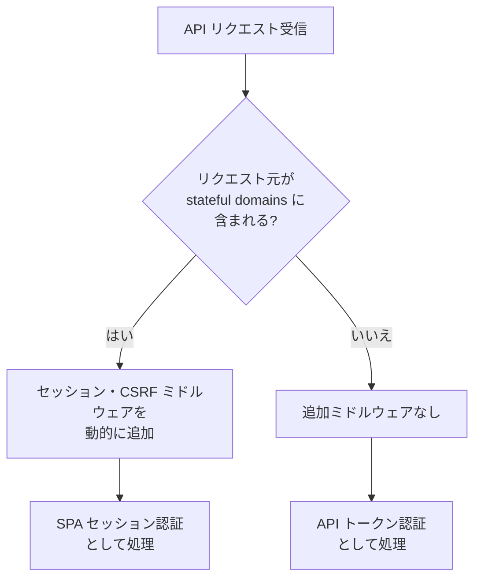
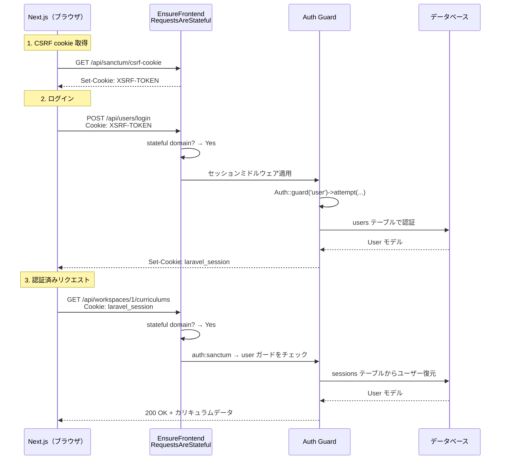

# 4-2-1 Laravel Sanctum とマルチガード認証

この Chapter「認証と API 設計」は以下の 2 セクションで構成されます。

| セクション | テーマ | 種類 |
|---|---|---|
| 4-2-1 | Laravel Sanctum とマルチガード認証 | 概念 |
| 4-2-2 | Swagger/OpenAPI による API ドキュメント | 概念 |

**Chapter ゴール**: マルチユーザー認証と API ドキュメント自動生成の仕組みを理解する

📖 まず本セクションで SPA + API 構成における認証の課題を理解し、Laravel Sanctum の 2 つの認証方式と LMS のマルチガード構成を学びます。次にセクション 4-2-2 で OpenAPI 仕様の構造と、L5-Swagger・Scramble によるアノテーションベースの API ドキュメント自動生成の仕組みを学びます。2 つのセクションを通して、LMS のバックエンドが「誰がアクセスしているか」を判定する仕組みと、API の仕様を自動的に文書化する仕組みの全体像が見えるようになります。

📝 **前提知識**: このセクションは COACHTECH 教材 tutorial-10（認証基礎）とセクション 4-1-1（なぜ MVC だけでは足りないのか）の内容を前提としています。

## 🎯 このセクションで学ぶこと

- **SPA + API 構成** で認証の仕組みが根本的に変わる理由を理解する
- Laravel Sanctum の **2 つの認証方式**（SPA セッション認証・API トークン認証）の仕組みと使い分けを理解する
- LMS の **マルチガード構成**（user / employee / system_user）の設計意図と実装を理解する
- **ワークスペースベースのマルチテナンシー** がルーティングと認証にどう影響するかを理解する

Sanctum がなぜ必要かという課題から出発し、2 つの認証方式を学んだ後、LMS の実際のマルチガード構成とルーティング設計を読み解きます。

---

## 導入: フロントエンドとバックエンドが分離したら認証はどうなる

tutorial-10 で学んだ Laravel の認証を思い出してください。Blade テンプレートを使う従来の構成では、フロントエンドとバックエンドが同じ Laravel アプリケーションの中にありました。ブラウザがフォームを POST し、Laravel がセッションに認証情報を保存し、CSRF トークンで不正リクエストを防ぐ。すべてが同一ドメイン上で完結するシンプルな仕組みです。

しかし、LMS では Next.js 14 のフロントエンドと Laravel 10 のバックエンドが**別々のアプリケーション**として動いています。フロントエンドは `localhost:3000`、バックエンドは `localhost:80` のように異なるオリジン（ドメイン + ポート）で動作します。この構成では、従来の認証の前提が崩れます。

- **セッション cookie はどうなる**: ブラウザの Same-Origin Policy により、異なるオリジン間での cookie の送受信には明示的な設定が必要になる
- **CSRF トークンはどう渡す**: Blade テンプレートなら `@csrf` ディレクティブで埋め込めたが、別アプリのフロントエンドにはその手段がない
- **モバイルアプリや外部システムからのアクセス**: ブラウザのセッションに依存できない API クライアントにはどう対応するか

さらに LMS には、**生徒（User）**、**講師・スタッフ（Employee）**、**システム管理者（SystemUser）** という 3 種類のユーザーが存在します。それぞれが異なるログイン画面を持ち、アクセスできるリソースも異なります。「誰がアクセスしているか」だけでなく「どの種類のユーザーなのか」まで判定しなければなりません。

### 🧠 先輩エンジニアはこう考える

> LMS を Blade から SPA + API 構成に移行したとき、認証は最も苦労した領域の 1 つでした。Blade 時代は Laravel が全部やってくれていたので意識すらしていなかったのですが、フロントエンドが別アプリになった途端、「セッション cookie が飛ばない」「CSRF トークンが取れない」「CORS エラーが出る」と問題が噴出しました。さらに LMS には生徒と講師という 2 種類のユーザーがいて、最初は 1 つの `users` テーブルに `role` カラムで区別していたのですが、それぞれの認証フローやアクセス権限が全く違うため、ガードを分けたほうが圧倒的にシンプルになりました。Sanctum の導入とマルチガード設計は、この SPA 移行を支えた重要な設計判断です。

---

## Laravel Sanctum とは

**Laravel Sanctum** は、Laravel に同梱されている軽量な認証パッケージです。Laravel 10 ではデフォルトで利用可能であり、追加インストールは不要です。

Sanctum が解決する課題を一言でまとめると、**SPA・モバイルアプリ・API クライアントなど多様なクライアントに対して、統一的な認証の仕組みを提供すること** です。

Sanctum は 2 つの認証方式を提供しており、クライアントの種類に応じて使い分けます。

| 認証方式 | 対象クライアント | 仕組み | LMS での用途 |
|---|---|---|---|
| **SPA セッション認証** | 同一ドメインの SPA（Next.js） | cookie + セッション | メインの認証方式 |
| **API トークン認証** | モバイルアプリ、外部システム | Bearer トークン | デプロイ用 API 等 |

🔑 **キーポイント**: Sanctum の最大の特長は、**1 つのルート定義で SPA セッション認証と API トークン認証の両方に対応できる** ことです。`auth:sanctum` ミドルウェアを指定するだけで、リクエストの種類に応じて適切な認証方式が自動的に選択されます。

---

## SPA セッション認証の仕組み

LMS のメイン認証方式である SPA セッション認証から見ていきましょう。この方式は、従来の Blade テンプレートでのセッション認証を SPA でも使えるようにしたものです。

### 認証の流れ

SPA セッション認証は、以下の 3 ステップで行われます。

**Step 1: CSRF cookie の取得**

フロントエンドがログインリクエストを送る前に、まず `/api/sanctum/csrf-cookie` エンドポイントにリクエストを送ります。

```
GET /api/sanctum/csrf-cookie
```

このリクエストに対して、Laravel は `XSRF-TOKEN` という cookie をレスポンスに含めて返します。フロントエンドの HTTP クライアント（Axios 等）は、この cookie を自動的に後続のリクエストヘッダーに含めます。これにより、Blade テンプレートの `@csrf` に相当する CSRF 保護が実現します。

**Step 2: ログイン**

CSRF cookie を取得したら、認証情報を送ってログインします。

```
POST /api/users/login
Body: { "email": "user@example.com", "password": "secret" }
```

認証が成功すると、Laravel はセッションに認証情報を保存し、セッション cookie をレスポンスに含めます。以降のリクエストでは、ブラウザがこのセッション cookie を自動的に送信します。

**Step 3: 認証済みリクエスト**

ログイン後は、ブラウザがセッション cookie を自動送信するため、追加の認証ヘッダーは不要です。

```
GET /api/workspaces/{workspace}/curriculums
Cookie: laravel_session=xxx; XSRF-TOKEN=xxx
```

### Stateful Domains の設定

SPA セッション認証を機能させるには、フロントエンドのドメインを Sanctum に「信頼できる SPA のオリジン」として登録する必要があります。この設定が **stateful domains** です。

以下は主要部分の抜粋です。実際のコードでは IPv6 localhost（`::1`）や `Sanctum::currentApplicationUrlWithPort()` も含まれます。

```php
// backend/config/sanctum.php
'stateful' => explode(',', env('SANCTUM_STATEFUL_DOMAINS', 'localhost,localhost:3000,127.0.0.1,127.0.0.1:8000')),
```

Sanctum は受信したリクエストのオリジン（`Referer` / `Origin` ヘッダー）が `stateful` に含まれているかをチェックします。含まれていれば SPA セッション認証、含まれていなければ API トークン認証として扱います。この判定が自動で行われるのが Sanctum の便利な点です。

💡 **TIP**: 本番環境では `.env` ファイルで `SANCTUM_STATEFUL_DOMAINS` に本番のフロントエンドドメインを設定します。ローカル開発時の `localhost:3000` と本番の `app.example.com` のように環境ごとに異なる値を設定できます。

---

## API トークン認証の仕組み

SPA セッション認証はブラウザベースのクライアント向けですが、モバイルアプリや外部システムなど、ブラウザの cookie を使えないクライアントには **API トークン認証** を使います。

### トークンの発行と利用

```php
// トークンの発行
$token = $user->createToken('api-token');
$plainTextToken = $token->plainTextToken; // "1|abc123..."
```

`createToken` メソッドは `personal_access_tokens` テーブルにトークンを保存し、平文のトークン文字列を返します。この文字列をクライアントに渡し、クライアントは `Authorization` ヘッダーに含めてリクエストを送ります。

```
GET /api/workspaces/{workspace}/curriculums
Authorization: Bearer 1|abc123...
```

### LMS でのトークン設定

LMS の Sanctum 設定を確認しましょう。

```php
// backend/config/sanctum.php
'expiration' => 60 * 24, // トークンの有効期限: 1440 分（1 日）
```

トークンの有効期限が 1 日に設定されています。期限切れのトークンでリクエストすると `401 Unauthorized` が返ります。

📝 **ノート**: LMS のメインの認証方式は SPA セッション認証であり、API トークン認証は主にデプロイ API など特殊なユースケースで使われます。`routes/api.php` に定義されている `verify.deploy.token` ミドルウェアを使ったデプロイルートがその例です。

---

## EnsureFrontendRequestsAreStateful ミドルウェア

Sanctum が SPA セッション認証と API トークン認証を自動で切り替える仕組みの核心は、**EnsureFrontendRequestsAreStateful** ミドルウェアにあります。

### 切り替えの仕組み

LMS の `Kernel.php` で、API ミドルウェアグループの先頭にこのミドルウェアが登録されています。

```php
// backend/app/Http/Kernel.php（API ミドルウェアグループ）
'api' => [
    \Laravel\Sanctum\Http\Middleware\EnsureFrontendRequestsAreStateful::class,
    \Illuminate\Routing\Middleware\ThrottleRequests::class.':api',
    \Illuminate\Routing\Middleware\SubstituteBindings::class,
    \App\Http\Middleware\UpdateLastLoginAt::class,
],
```

このミドルウェアは、すべての API リクエストに対して以下の判定を行います。



**stateful domains に含まれる場合**: `EnsureFrontendRequestsAreStateful` が、通常は Web ルートにだけ適用されるセッション管理・CSRF 保護のミドルウェアを API リクエストにも動的に追加します。これにより、API ルートでありながらセッション cookie ベースの認証が機能します。

**stateful domains に含まれない場合**: 何もせずリクエストをそのまま通します。後続の `auth:sanctum` ミドルウェアが `Authorization: Bearer` ヘッダーからトークンを検証します。

🔑 **キーポイント**: この仕組みにより、同じ `auth:sanctum` ミドルウェアが SPA からのリクエストには cookie 認証を、外部 API クライアントからのリクエストにはトークン認証を適用します。ルート定義を二重に書く必要がありません。

---

## LMS のマルチガード構成

ここからが LMS 固有の設計です。Laravel の **ガード**（Guard）は、「リクエストごとにユーザーをどう認証するか」を定義する仕組みです。tutorial-10 では `web` ガードだけを使っていたかもしれませんが、LMS では 3 つのガードを定義して 3 種類のユーザーを区別しています。

### config/auth.php のガード定義

```php
// backend/config/auth.php（主要部分の抜粋）
'guards' => [
    'user' => [
        'driver' => 'session',
        'provider' => 'users',
    ],
    'employee' => [
        'driver' => 'session',
        'provider' => 'employees',
    ],
    'system_user' => [
        'driver' => 'session',
        'provider' => 'system_users',
    ],
],

'providers' => [
    'users' => [
        'driver' => 'eloquent',
        'model' => App\Models\User::class,
    ],
    'employees' => [
        'driver' => 'eloquent',
        'model' => App\Models\Employee::class,
    ],
    'system_users' => [
        'driver' => 'eloquent',
        'model' => App\Models\SystemUser::class,
    ],
],
```

各ガードとプロバイダーの対応を整理します。

| ガード | プロバイダー | Eloquent モデル | 対象ユーザー |
|---|---|---|---|
| `user` | `users` | `App\Models\User` | 生徒（受講生） |
| `employee` | `employees` | `App\Models\Employee` | 講師・スタッフ |
| `system_user` | `system_users` | `App\Models\SystemUser` | システム管理者 |

**ガード** は「認証のドライバー（方法）」と「ユーザー情報の取得元（プロバイダー）」の組み合わせです。3 つのガードすべてが `session` ドライバーを使っていますが、プロバイダーが異なるため、それぞれ独立した認証情報を持ちます。つまり、`user` ガードで認証されたリクエストは `users` テーブルからユーザーを取得し、`employee` ガードで認証されたリクエストは `employees` テーブルからユーザーを取得します。

### Sanctum のマルチガード設定

Sanctum 自体にも、どのガードをチェックするかの設定があります。

```php
// backend/config/sanctum.php
'guard' => ['user', 'employee'],
```

`auth:sanctum` ミドルウェアが認証を試みるとき、この配列に含まれるガードを **順番に** チェックします。`user` ガードで認証が通ればそのユーザーを返し、通らなければ `employee` ガードを試します。どちらも通らなければ `401 Unauthorized` を返します。

⚠️ **注意**: `system_user` が Sanctum の `guard` 配列に含まれていない点に注目してください。システム管理者は `auth:sanctum` ではなく `auth:system_user` で明示的にガードを指定してアクセスします。これは、システム管理者のルートを一般の生徒・講師向けルートから完全に分離するための設計判断です。

### なぜテーブルを分けるのか

「1 つの `users` テーブルに `role` カラムを追加すればいいのでは」と疑問に思うかもしれません。LMS がテーブルを分けている理由は、各ユーザー種別が持つデータ構造と振る舞いが大きく異なるためです。

- **User（生徒）**: 学習進捗、カリキュラム、面談予約、課題提出など学習に関するリレーションを持つ
- **Employee（講師・スタッフ）**: 担当生徒、シフト、Google Calendar 連携、コードレビュー権限など業務に関するリレーションを持つ
- **SystemUser（管理者）**: ワークスペース管理、プラン管理、全体設定など管理に関するリレーションを持つ

これらを 1 つのテーブルに押し込むと、使わないカラムが大量に生まれ、リレーションの定義も条件分岐だらけになります。テーブルとモデルを分けることで、各ユーザー種別が自分に必要なデータとロジックだけを持てます。

### 🧠 先輩エンジニアはこう考える

> マルチガードの設計は最初から完成形だったわけではありません。開発初期は `users` テーブルに `is_employee` フラグを持たせていた時期もありました。しかし、講師と生徒では認証フローが違う（講師は管理画面からログインする）、持つリレーションが全く違う（講師には Google Calendar 連携があるが生徒にはない）、アクセス権限の粒度も違う、と差異が積み重なっていきました。結局、テーブルもガードも分けたほうがコードがシンプルになりました。Claude Code に「講師専用の機能を追加して」と依頼するときも、`employee` ガードのルートと `Employee` モデルだけを対象にすればよいので、指示が明確になります。

---

## ルーティングにおけるガード指定

マルチガード構成がルーティングでどのように使われているかを見ていきましょう。LMS の `routes/api.php` は、ガードの種類に応じてルートグループを分けています。

### ルートグループの全体構成

```php
// backend/routes/api.php（構成の概要）

// 1. 認証不要のルート（ログイン）
Route::post('/users/login', [UserAuthController::class, 'login']);
Route::post('/employees/login', [EmployeeAuthController::class, 'login']);

// 2. User 専用ルート
Route::middleware('auth:user')->group(function () {
    Route::post('/users/logout', [UserAuthController::class, 'logout']);
});

// 3. Employee 専用ルート
Route::middleware('auth:employee')->group(function () {
    Route::post('/employees/logout', [EmployeeAuthController::class, 'logout']);
});

// 4. Sanctum ルート（User と Employee の両方がアクセス可能）
Route::middleware('auth:sanctum')->prefix('workspaces/{workspace}')->group(function () {
    Route::apiResource('users', UserController::class);
    Route::apiResource('employees', EmployeeController::class);
    // ... 400 行以上のルート定義
});

// 5. システム管理者専用ルート
Route::middleware('auth:system_user')->prefix('system')->group(function () {
    Route::apiResource('workspaces', SystemWorkspaceController::class);
    // ...
});

// 6. デプロイ用ルート（トークンベース、ユーザー認証とは別）
Route::middleware('verify.deploy.token')->prefix('deploy')->group(function () {
    Route::post('/sections/upsert', [DeploySectionController::class, 'upsert']);
});
```

### 各ルートグループの役割

| # | ミドルウェア | プレフィックス | 対象 | 用途 |
|---|---|---|---|---|
| 1 | なし | `/api` | 全員 | ログインエンドポイント |
| 2 | `auth:user` | `/api` | 生徒のみ | 生徒のログアウト等 |
| 3 | `auth:employee` | `/api` | 講師のみ | 講師のログアウト等 |
| 4 | `auth:sanctum` | `/api/workspaces/{workspace}` | 生徒 + 講師 | メインの業務 API |
| 5 | `auth:system_user` | `/api/system` | 管理者のみ | システム管理 API |
| 6 | `verify.deploy.token` | `/api/deploy` | デプロイシステム | 教材デプロイ等 |

注目すべきは **グループ 4** です。`auth:sanctum` ミドルウェアは、前述の通り `sanctum.php` の `guard` 設定に基づいて `user` と `employee` の両方を順番にチェックします。つまり、生徒がログインしていても講師がログインしていても、同じルートにアクセスできます。

これにより、カリキュラムの閲覧や面談情報の取得といった「生徒と講師の両方が使う API」を二重に定義する必要がなくなります。Controller 側では `Auth::guard('user')->user()` や `Auth::guard('employee')->user()` で、リクエスト元がどちらの種類のユーザーかを判定できます。

### ログインの UseCase

認証の実装が UseCase パターン（セクション 4-1-1 で学んだ構造）とどう結びつくかを確認しましょう。以下は主要部分の抜粋です。

```php
// backend/app/UseCases/Auth/User/LoginAction.php
class LoginAction
{
    public function __invoke(string $email, string $password): User
    {
        if (! Auth::guard('user')->attempt(['email' => $email, 'password' => $password])) {
            throw new AuthenticationException('ログインに失敗しました。');
        }
        $user = Auth::guard('user')->user();
        $user->load(['activeWorkspace.plan', 'activeMatchings.employee']);

        $activeWorkspace = $user->activeWorkspace;
        $workspaceId = $activeWorkspace->id;
        $isRecentlyActive = $activeWorkspace->is_recently_active;

        app()->terminating(function () use ($workspaceId, $isRecentlyActive) {
            UserWorkspace::where('id', $workspaceId)->update(['last_login_at' => now()]);
        });

        return $user;
    }
}
```

`Auth::guard('user')->attempt(...)` で `user` ガードを明示的に指定しています。これにより、`users` テーブルのメールアドレスとパスワードで認証が行われます。講師のログインでは同様に `Auth::guard('employee')->attempt(...)` が使われます。

`app()->terminating(...)` は、HTTP レスポンスをクライアントに返した**後**に実行される処理を登録しています。ログイン日時の更新はレスポンス速度に影響しない非同期的な処理として実装されています。

---

## ワークスペースベースのマルチテナンシー

LMS のルーティングで目を引くのが、`workspaces/{workspace}` というプレフィックスです。

```php
Route::middleware('auth:sanctum')->prefix('workspaces/{workspace}')->group(function () {
    // すべてのリソースがワークスペースにスコープされる
    Route::apiResource('users', UserController::class);
    Route::apiResource('curriculums', CurriculumController::class);
    // ...
});
```

### ワークスペースとは

LMS では、**ワークスペース** が「テナント」の単位です。1 つのワークスペースは 1 つの教室や組織に対応し、そのワークスペースに所属する生徒・講師・カリキュラム・面談などのデータはワークスペースごとに分離されています。

この設計は **マルチテナンシー**（1 つのアプリケーションで複数のテナントを扱う構成）と呼ばれます。URL にワークスペース ID を含めることで、すべての API リクエストが「どのワークスペースのデータか」を明示します。

```
GET /api/workspaces/1/curriculums    → ワークスペース 1 のカリキュラム一覧
GET /api/workspaces/2/curriculums    → ワークスペース 2 のカリキュラム一覧
```

### UpdateLastLoginAt ミドルウェア

API ミドルウェアグループに含まれている `UpdateLastLoginAt` ミドルウェアは、ワークスペースと認証を結びつける役割を持っています。以下は処理の流れを簡略化した疑似コードです。実際のコードでは `updateUserLastLoginAt()` / `updateEmployeeLastLoginAt()` の private メソッドに委譲し、同日中の重複更新をスキップするロジックも含まれます。

```php
// backend/app/Http/Middleware/UpdateLastLoginAt.php
class UpdateLastLoginAt
{
    public function handle(Request $request, Closure $next)
    {
        return $next($request);
    }

    public function terminate(Request $request, $response)
    {
        // レスポンス送信後に実行される（非ブロッキング）
        foreach (['user', 'employee'] as $guard) {
            $authUser = Auth::guard($guard)->user();
            if ($authUser) {
                // ユーザーの activeWorkspace から紐付けを取得して last_login_at を更新
                $workspace = $authUser->activeWorkspace;
                if ($workspace) {
                    // UserWorkspace または EmployeeWorkspace の更新
                }
            }
        }
    }
}
```

このミドルウェアの特徴は 2 つあります。

**terminate メソッドの利用**: `handle` メソッドではなく `terminate` メソッドに処理を書いています。`terminate` はレスポンスがクライアントに送信された後に実行されるため、ログイン日時の更新がレスポンス速度に影響しません。

**マルチガードの順次チェック**: `['user', 'employee']` の両方のガードをループでチェックし、認証済みのユーザーがいればそのワークスペースでの最終ログイン日時を更新します。`auth:sanctum` ルート内ではどちらのガードで認証されたかが事前にはわからないため、このように両方をチェックする設計になっています。

---

## 認証フロー全体図

ここまで学んだ内容を、1 つの図で俯瞰しましょう。LMS の認証フローの全体像です。



💡 **TIP**: 外部 API クライアント（トークン認証）の場合は、Step 1 の CSRF cookie 取得が不要になり、Step 2 でトークンを発行し、Step 3 で `Authorization: Bearer` ヘッダーを送る流れになります。Sanctum の `stateful domain` チェックで「No」と判定され、トークン認証パスが使われます。

---

## ✨ まとめ

- SPA + API 構成では、フロントエンドとバックエンドが異なるオリジンで動くため、従来のセッション + CSRF だけでは認証が成立しない。**Laravel Sanctum** がこの課題を解決する
- Sanctum は **SPA セッション認証**（cookie ベース）と **API トークン認証**（Bearer ヘッダー）の 2 方式を提供し、`EnsureFrontendRequestsAreStateful` ミドルウェアが `stateful domains` 設定に基づいてリクエストごとに自動で切り替える
- LMS は **3 つのガード**（`user` / `employee` / `system_user`）を定義し、各ガードが独立した Eloquent モデル・テーブルに紐づくことで、ユーザー種別ごとの認証を実現している
- `auth:sanctum` ミドルウェアは `user` と `employee` の両ガードを順次チェックし、生徒と講師が同じルートにアクセスできる設計になっている。`system_user` は専用の `auth:system_user` ミドルウェアで分離されている
- **ワークスペース** をプレフィックスに含むルーティングにより、すべての API リクエストがテナント単位でスコープされるマルチテナンシーを実現している

---

次のセクションでは、認証済みの API がどのように文書化されるかを学びます。OpenAPI 仕様の構造を理解した上で、LMS で使われている L5-Swagger と Scramble によるアノテーションベースの API ドキュメント自動生成の仕組みを見ていきます。
