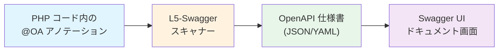
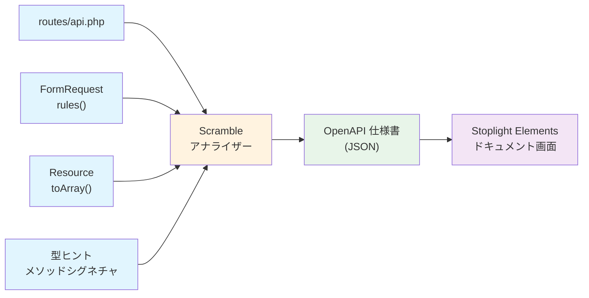
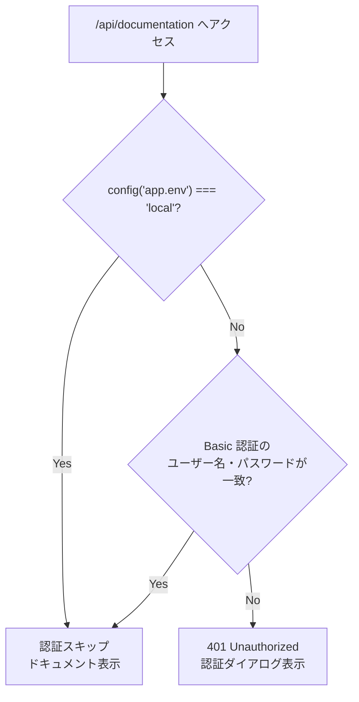

# 4-2-2 Swagger/OpenAPI による API ドキュメント

📝 **前提知識**: このセクションは COACHTECH 教材 tutorial-11（API 基礎）の内容を前提としています。

## 🎯 このセクションで学ぶこと

- **OpenAPI 仕様** の構造（info, paths, components/schemas, securitySchemes）を理解する
- **L5-Swagger** のアノテーションベースのドキュメント生成の仕組みを理解する
- **Scramble** のコードベースからの自動推論によるドキュメント生成の仕組みを理解する
- LMS での **L5-Swagger と Scramble の併用** とそれぞれの役割を理解する
- API ドキュメントへの **アクセス制御** の仕組みを理解する

このセクションでは、まず API ドキュメントがなぜ必要かを確認し、次に OpenAPI 仕様の構造を学びます。その後、LMS で使われている2つのドキュメント生成ツール（L5-Swagger と Scramble）の仕組みと使い分けを理解し、最後にドキュメントへのアクセス制御を確認します。

---

## 導入: API が増えると何が起きるか

tutorial-11 で API の基本的な作り方を学びました。エンドポイントが数個のうちは、コードを読めばリクエストの形式もレスポンスの構造もすぐにわかります。

しかし、LMS のように API の数が増えてくると、次のような問題が発生します。

**エンドポイントの把握が困難になる**: 「ユーザー一覧を取得する API はどのパスだったか」「このエンドポイントは GET か POST か」といった基本的な情報を確認するだけで `routes/api.php` を探し回ることになります。

**リクエスト/レスポンスの形式がわからない**: 「このエンドポイントに送るべきパラメータは何か」「レスポンスの JSON はどういう構造か」を知るには、Controller、FormRequest、Resource のコードを順にたどる必要があります。

**フロントエンドとの認識齟齬が生まれる**: フロントエンドの開発者が API を利用する際、「ドキュメントがないからバックエンドのコードを読んでください」では効率が悪く、パラメータ名の認識違いやレスポンス構造の誤解によるバグが生まれます。

これらの問題を解決するのが **API ドキュメント** です。API の仕様を機械可読な形式で記述し、見やすい UI で表示する仕組みがあれば、誰でもすぐに API の使い方を確認できます。

### 🧠 先輩エンジニアはこう考える

> LMS の開発で一番困るのは「このエンドポイント、どういうパラメータを受け取るんだっけ？」という場面です。自分で書いた API でも、数ヶ月経つと忘れます。フロントエンド側の開発で API を呼び出す際にも、毎回バックエンドの Controller と FormRequest を読みに行くのは非効率です。API ドキュメントが自動生成されていれば、ブラウザでさっと確認して実装に戻れる。特にフロントエンドとバックエンドを1人で開発する場合、この「確認のしやすさ」が開発速度に直結します。

---

## OpenAPI 仕様とは

### RESTful API の記述標準

**OpenAPI 仕様**（旧称: Swagger Specification）は、RESTful API の構造を記述するための業界標準フォーマットです。JSON または YAML で記述し、「どのエンドポイントが存在するか」「各エンドポイントがどんなパラメータを受け取り、どんなレスポンスを返すか」を機械可読な形式で定義します。

OpenAPI 仕様で記述された API 定義ファイル（仕様書）は、そのまま **Swagger UI** などのツールで読み込んで、インタラクティブな API ドキュメントとして表示できます。仕様書が正しければ、ドキュメントの見た目やナビゲーションはツールが自動的に生成してくれます。

<!-- TODO: 画像追加 - Swagger UI の API ドキュメント画面 -->

### OpenAPI 仕様の構造

OpenAPI 3.0 の仕様書は、大きく4つのセクションで構成されます。以下は LMS の API を例にした構造です。

```yaml
# OpenAPI 仕様書の全体構造
openapi: 3.0.0

# 1. info: API の基本情報
info:
  title: LMS API
  version: 1.0.0

# 2. paths: エンドポイントの定義
paths:
  /api/workspaces/{workspace}/users:
    get:
      summary: ユーザー一覧取得
      parameters:
        - name: workspace
          in: path
          required: true
      responses:
        '200':
          description: 成功
          content:
            application/json:
              schema:
                type: array
                items:
                  $ref: '#/components/schemas/User'

# 3. components: 再利用可能なスキーマ定義
components:
  schemas:
    User:
      type: object
      properties:
        id:
          type: string
        firstName:
          type: string
  # 4. securitySchemes: 認証方式の定義
  securitySchemes:
    sanctum:
      type: http
      scheme: bearer
```

各セクションの役割を整理します。

| セクション | 役割 | 具体例 |
|---|---|---|
| **info** | API のタイトル、バージョン、説明 | `title: "LMS API"`, `version: "1.0.0"` |
| **paths** | エンドポイントごとの HTTP メソッド、パラメータ、レスポンス | `/api/workspaces/{workspace}/users` の GET |
| **components/schemas** | リクエストボディやレスポンスの JSON 構造を再利用可能な形で定義 | `User` スキーマ（id, firstName 等） |
| **securitySchemes** | 認証方式の定義 | Sanctum のベアラートークン認証 |

🔑 **重要なポイント**: `$ref: '#/components/schemas/User'` のように、`components/schemas` で定義したスキーマを `paths` の中から参照できます。同じレスポンス構造を複数のエンドポイントで使い回す際に、定義の重複を避けられます。

この仕様書を手で書く必要はありません。次に紹介する L5-Swagger や Scramble が、PHP のコードから自動的に仕様書を生成してくれます。

---

## L5-Swagger: アノテーションによるドキュメント生成

### 仕組み

**L5-Swagger**（`darkaonline/l5-swagger`）は、PHP コードに記述した **アノテーション**（PHPDoc コメント内の特殊なタグ）を解析して OpenAPI 仕様書を生成するパッケージです。

処理の流れを図で示します。



1. 開発者が Controller やモデルの PHPDoc に `@OA\Get`, `@OA\Response` などのアノテーションを書く
2. L5-Swagger が指定されたディレクトリ（`app/` 配下）をスキャンし、アノテーションを収集する
3. 収集した情報から OpenAPI 仕様書（JSON または YAML）を生成する
4. Swagger UI がその仕様書を読み込み、ブラウザ上にドキュメントを表示する

### LMS での設定

LMS の L5-Swagger の設定を確認しましょう。以下は設定の要点を整理したものです。実際のファイルでは `'documentations' => ['default' => [...]]` のネスト構造になっています。

```php
// backend/config/l5-swagger.php
return [
    'default' => 'default',
    'documentations' => [
        'default' => [
            'routes' => [
                'api' => 'api/documentation',  // ドキュメント UI の URL
            ],
            'paths' => [
                'annotations' => [
                    base_path('app'),          // この配下をスキャン対象とする
                ],
            ],
        ],
    ],
    'defaults' => [
        'routes' => [
            'docs' => 'docs',                 // 生成された仕様書の URL
            'group_options' => [
                'middleware' => ['org.basic.auth'],  // Basic 認証で保護
            ],
        ],
        'paths' => [
            'docs' => storage_path('api-docs'),     // 仕様書の保存先
        ],
        'generate_always' => env('L5_SWAGGER_GENERATE_ALWAYS', false),
    ],
];
```

設定のポイントは3つです。

- **`annotations`**: `base_path('app')` が指定されており、`app/` ディレクトリ配下のすべての PHP ファイルがスキャン対象です
- **`generate_always`**: `false` がデフォルトで、本番環境ではリクエストのたびに再生成しません。開発環境では `.env` で `true` に設定すると、コード変更のたびに仕様書が自動更新されます
- **`middleware`**: `org.basic.auth` ミドルウェアにより、ドキュメント UI へのアクセスが Basic 認証で保護されています（詳細は後述）

### API 情報の定義

L5-Swagger でドキュメントを生成するには、最低限 `@OA\Info` アノテーションが必要です。LMS ではベースの Controller に定義されています。

```php
// backend/app/Http/Controllers/Controller.php
/**
 * @OA\Info(
 *     version="1.0.0",
 *     title="COACHTECH LMS API",
 *     description="COACHTECH LMSのAPI仕様書"
 * )
 */
class Controller extends BaseController
{
    use AuthorizesRequests, DispatchesJobs, ValidatesRequests;
}
```

`@OA\Info` は OpenAPI 仕様書の `info` セクションに対応します。ここで API のタイトル、バージョン、説明文を定義しています。すべての Controller がこの `Controller` を継承するので、この定義はアプリケーション全体で1箇所だけ書けば十分です。

### アノテーションの書き方

個々のエンドポイントは、Controller のメソッドに `@OA\Get` や `@OA\Post` といったアノテーションを付けて記述します。以下は教育目的の例です。

```php
/**
 * @OA\Get(
 *     path="/api/workspaces/{workspace}/users",
 *     summary="ユーザー一覧を取得する",
 *     tags={"Users"},
 *     @OA\Parameter(
 *         name="workspace",
 *         in="path",
 *         required=true,
 *         @OA\Schema(type="string")
 *     ),
 *     @OA\Response(
 *         response=200,
 *         description="成功",
 *         @OA\JsonContent(
 *             type="array",
 *             @OA\Items(ref="#/components/schemas/User")
 *         )
 *     ),
 *     security={{"sanctum":{}}}
 * )
 */
public function index(IndexRequest $request, Workspace $workspace, IndexAction $action)
{
    return new IndexResource($action($workspace, $request->keyword));
}
```

アノテーションの各要素は OpenAPI 仕様の構造に対応しています。

| アノテーション | OpenAPI での対応 | 説明 |
|---|---|---|
| `@OA\Get(path=...)` | `paths` の各パス + HTTP メソッド | エンドポイントの定義 |
| `tags={"Users"}` | タグによるグルーピング | UI 上でのカテゴリ分け |
| `@OA\Parameter` | `parameters` | パスパラメータやクエリパラメータ |
| `@OA\Response` | `responses` | レスポンスの定義 |
| `@OA\JsonContent` | `content.application/json.schema` | レスポンスボディの JSON 構造 |
| `security={{"sanctum":{}}}` | `security` | 必要な認証方式 |

💡 アノテーションの構文を暗記する必要はありません。重要なのは「PHPDoc コメントに OpenAPI の構造をアノテーションとして書くと、L5-Swagger がそれを解析して仕様書を生成する」という仕組みを理解することです。実際にアノテーションを追加する場面では、Claude Code に「この Controller メソッドに L5-Swagger のアノテーションを追加して」と指示すれば適切なアノテーションを生成してくれます。

### L5-Swagger の特徴

**メリット**:
- エンドポイントごとに詳細な説明を自由に記述できる
- コードの実装とは独立して仕様を定義できるため、先に仕様書を書いてから実装する「API ファースト」のワークフローに対応できる

**デメリット**:
- アノテーションを手動で書く必要があり、コードとドキュメントが乖離するリスクがある
- アノテーションの記述量が多く、Controller のコードが肥大化する
- 実装を変更してもアノテーションの更新を忘れると、ドキュメントが古いままになる

---

## Scramble: コードベースからの自動生成

### 仕組み

**Scramble**（`dedoc/scramble`）は、アノテーションを一切書かずに、Laravel のコードベースから API ドキュメントを **自動推論** するパッケージです。



Scramble が情報を取得するソースは4つあります。

| ソース | 推論される情報 |
|---|---|
| **routes/api.php** | エンドポイントのパス、HTTP メソッド |
| **FormRequest の `rules()`** | リクエストパラメータとバリデーションルール |
| **Resource の `toArray()`** | レスポンスの JSON 構造 |
| **型ヒント（メソッドシグネチャ）** | パラメータの型（int, string 等） |

つまり、Scramble は「Laravel の規約に従ってコードを書いていれば、そのコードから API の仕様を読み取れる」という発想です。アノテーションのような追加の記述が不要なため、コードとドキュメントが自動的に同期します。

### LMS での設定

LMS の Scramble 設定を確認しましょう。

```php
// backend/config/scramble.php
use Dedoc\Scramble\Http\Middleware\RestrictedDocsAccess;

return [
    'api_path' => 'api',
    'export_path' => 'storage/api-docs/api.json',
    'info' => [
        'version' => env('API_VERSION', '0.0.1'),
        'description' => 'LMSで使用するAPIです。',
    ],
    'ui' => [
        'title' => 'LMS API',
        'theme' => 'light',
        'hide_schemas' => true,
        'layout' => 'responsive',
    ],
    'middleware' => [
        'web',
        RestrictedDocsAccess::class,
    ],
];
```

設定のポイントを整理します。

- **`api_path`**: `'api'` で始まるルートが自動的にドキュメント生成の対象になります。`routes/api.php` に定義されたルートが自動でスキャンされるということです
- **`export_path`**: 生成された OpenAPI 仕様書の保存先です。L5-Swagger の保存先（`storage/api-docs/`）と同じディレクトリを使用しています
- **`ui`**: ドキュメント画面の設定です。Scramble は Swagger UI ではなく **Stoplight Elements** という別の UI ライブラリを使用しています。`hide_schemas` が `true` になっており、目次にスキーマ一覧を表示しない設定です
- **`middleware`**: `RestrictedDocsAccess` ミドルウェアでアクセスを制御しています

### Scramble の自動推論の仕組み

Scramble がどのようにコードから API 仕様を推論するか、具体的に見ていきましょう。

たとえば、以下のようなルート定義があるとします。

```php
// backend/routes/api.php
Route::get('/workspaces/{workspace}/users', [UserController::class, 'index']);
```

Scramble はこのルート定義から `GET /api/workspaces/{workspace}/users` というエンドポイントを検出します。次に、`UserController` の `index` メソッドのシグネチャを解析します。

```php
public function index(IndexRequest $request, Workspace $workspace, IndexAction $action)
{
    return new IndexResource($action($workspace, $request->keyword));
}
```

ここから Scramble は以下の情報を推論します。

1. **`IndexRequest`** が FormRequest であれば、その `rules()` メソッドからリクエストパラメータを取得する
2. **`Workspace $workspace`** はルートモデルバインディングで、パスパラメータ `{workspace}` に対応する
3. **`IndexResource`** が API Resource であれば、その `toArray()` メソッドからレスポンス構造を推論する

この仕組みにより、開発者が FormRequest や Resource を正しく定義していれば、追加のアノテーションなしで API ドキュメントが生成されます。

### Scramble の特徴

**メリット**:
- アノテーションが不要で、コードとドキュメントが自動的に同期する
- 実装を変更すればドキュメントも自動で更新されるため、乖離のリスクがない
- FormRequest や Resource を活用している Laravel プロジェクトとの相性が良い

**デメリット**:
- 推論に頼るため、複雑なレスポンス構造や条件分岐による動的なレスポンスをうまく表現できない場合がある
- 「コードに書かれていない情報」（詳細な説明文やユースケースの注釈など）はドキュメントに含められない
- Laravel の規約に沿わないコード（たとえば FormRequest を使わずにバリデーションしている場合）からは推論できない

---

## LMS での使い分け

### 2つのツールを併用する理由

LMS では L5-Swagger と Scramble の両方が `composer.json` に含まれています。

<!-- backend/composer.json（抜粋） -->

```json
"darkaonline/l5-swagger": "^8.0",
"dedoc/scramble": "^0.12.18"
```

なぜ2つのツールを併用するのでしょうか。それぞれの特性が異なるためです。

| 観点 | L5-Swagger | Scramble |
|---|---|---|
| **ドキュメント生成方式** | 手動アノテーション | コードからの自動推論 |
| **ドキュメント UI** | Swagger UI | Stoplight Elements |
| **アクセス URL** | `/api/documentation` | `/docs/api` |
| **コードとの同期** | 手動で維持（乖離リスクあり） | 自動（常に最新） |
| **カスタマイズ性** | 高い（自由に記述可能） | 低い（コードに依存） |
| **導入コスト** | 高い（アノテーション記述が必要） | 低い（設定のみ） |

LMS のコードベースを調査すると、`@OA\Info` のアノテーションが `Controller.php` に存在するのみで、個々のエンドポイントに `@OA\Get` や `@OA\Post` のアノテーションは記述されていません。これは、日常的な API ドキュメントの参照には **Scramble による自動生成を主に活用** し、L5-Swagger は将来的に手動で詳細なドキュメントを追加する必要が生じた際の基盤として組み込まれている構成です。

### 🧠 先輩エンジニアはこう考える

> 実際のところ、アノテーションをすべてのエンドポイントに書き切るのは大変です。LMS には多くのエンドポイントがあるので、全部にアノテーションを書こうとすると膨大な作業量になりますし、実装を変更するたびにアノテーションも更新しなければならない。Scramble は「コードをちゃんと書いていればドキュメントが勝手にできる」というアプローチなので、日常的にはこちらを使っています。ただ、Scramble が推論しきれない複雑なエンドポイントや、外部向けに詳細な説明が必要な API がある場合は、L5-Swagger のアノテーションで補完するという選択肢を残しています。

---

## API ドキュメントへのアクセス制御

### なぜ制御が必要か

API ドキュメントには、エンドポイントの一覧、パラメータの構造、認証方式といった情報が含まれています。これらの情報が外部に漏れると、不正アクセスの手がかりを与えることになります。そのため、本番環境ではドキュメントへのアクセスを制限する必要があります。

### L5-Swagger のアクセス制御

L5-Swagger のドキュメント UI は、`OriginalBasicAuthMiddleware` による **Basic 認証** で保護されています。

まず、このミドルウェアがどのように登録されているか確認しましょう。

```php
// backend/app/Http/Kernel.php（抜粋）
'org.basic.auth' => \App\Http\Middleware\OriginalBasicAuthMiddleware::class,
```

`org.basic.auth` というエイリアス名で登録されています。L5-Swagger の設定で `'middleware' => ['org.basic.auth']` と指定されているので、ドキュメント UI にアクセスする際にこのミドルウェアが実行されます。

ミドルウェアの実装を見てみましょう。

```php
// backend/app/Http/Middleware/OriginalBasicAuthMiddleware.php
class OriginalBasicAuthMiddleware
{
    public function handle(Request $request, Closure $next)
    {
        // ローカル環境では認証をスキップ
        if (config('app.env') === 'local') {
            return $next($request);
        }

        $username = $request->getUser();
        $password = $request->getPassword();

        if ($username == config('app.basic_auth_username')
            && $password == config('app.basic_auth_password')) {
            return $next($request);
        }

        header('WWW-Authenticate: Basic realm="ユーザ名とパスワードを入力してください"');
        header("HTTP/1.0 401 Unauthorized");
        abort(401);

        return $next($request);
    }
}
```

処理の流れを整理します。



🔑 **設計のポイント**:
- **ローカル環境ではバイパス**: `config('app.env') === 'local'` の場合、認証なしでドキュメントにアクセスできます。開発中に毎回認証情報を入力する手間を省くためです
- **認証情報は環境変数で管理**: `config('app.basic_auth_username')` と `config('app.basic_auth_password')` はアプリケーションの設定ファイル経由で環境変数から取得します。コードに直接書かれていないため、環境ごとに異なる認証情報を設定できます

### Scramble のアクセス制御

Scramble のドキュメント UI は、別の仕組みで保護されています。

```php
// backend/config/scramble.php（抜粋）
'middleware' => [
    'web',
    RestrictedDocsAccess::class,
],
```

`RestrictedDocsAccess` は Scramble パッケージが提供するミドルウェアで、デフォルトではローカル環境からのアクセスのみを許可します。本番環境でのアクセス制御をカスタマイズする場合は、Scramble のサービスプロバイダーで設定を変更できます。

### 2つのドキュメントのアクセス先まとめ

| ドキュメント | URL | 認証方式 | ローカル環境 |
|---|---|---|---|
| L5-Swagger | `/api/documentation` | Basic 認証（`OriginalBasicAuthMiddleware`） | 認証スキップ |
| Scramble | `/docs/api` | `RestrictedDocsAccess` | アクセス可能 |

⚠️ **注意**: 本番環境で API ドキュメントを公開する際は、認証設定が正しく動作していることを必ず確認してください。ドキュメントから API の構造が漏れると、セキュリティ上のリスクになります。

---

## ✨ まとめ

- **OpenAPI 仕様** は RESTful API の記述標準で、info、paths、components/schemas、securitySchemes の4つのセクションで構成される
- **L5-Swagger** は PHPDoc アノテーション（`@OA\Get`, `@OA\Response` 等）からドキュメントを生成する。カスタマイズ性が高いが、手動記述の負担とコードとの乖離リスクがある
- **Scramble** は Laravel のルート定義、FormRequest、Resource、型ヒントからドキュメントを自動推論する。コードとドキュメントが常に同期するが、複雑な仕様の表現には限界がある
- LMS では **Scramble を主に活用** し、L5-Swagger は補完的に併用する構成をとっている
- API ドキュメントへのアクセスは **OriginalBasicAuthMiddleware**（L5-Swagger）と **RestrictedDocsAccess**（Scramble）で制御し、ローカル環境では認証をバイパスしている

---

Chapter 4-2 では、Laravel Sanctum によるマルチガード認証と、OpenAPI 仕様に基づく API ドキュメントの自動生成について学びました。API の「誰がアクセスできるか」（認証）と「どう使えるか」（ドキュメント）の両面を理解したことで、バックエンド API の設計と運用の全体像が見えてきたはずです。

次の Chapter 4-3 では、Eloquent の Observer によるモデルイベント（creating, updating, deleted）の監視、Event/Listener パターンによるイベント駆動アーキテクチャ、saveQuietly() を用いた再帰防止、そして通知システムの仕組みを学びます。
