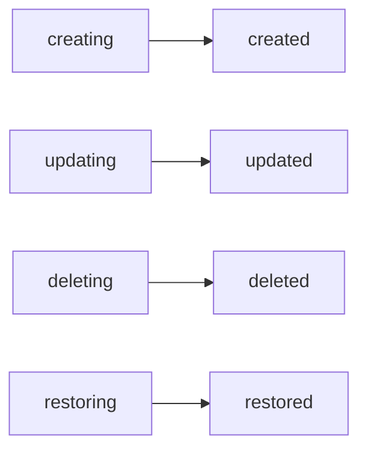
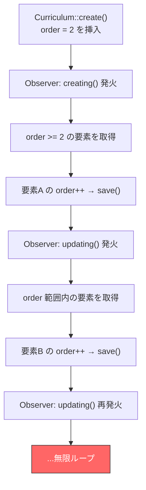
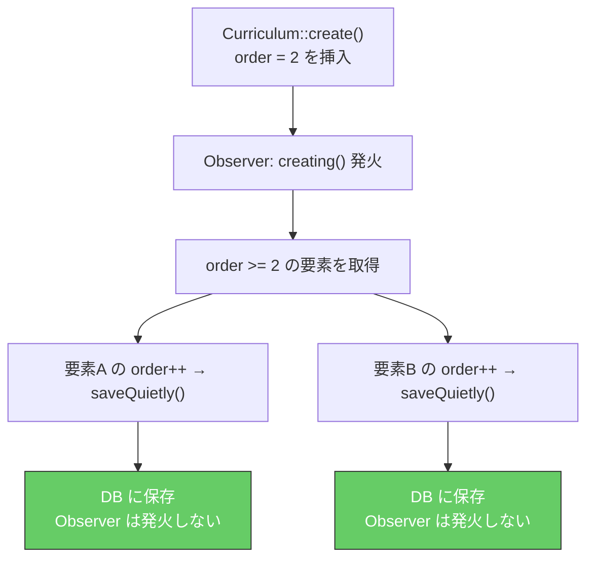
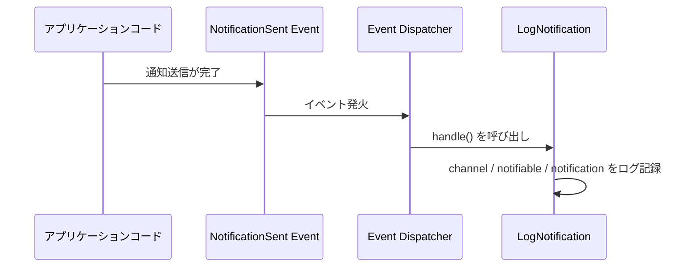

# 4-3-1 Observer と Listener

この Chapter「イベント駆動アーキテクチャ」は以下の 2 セクションで構成されます。

| セクション | テーマ | 種類 |
|---|---|---|
| 4-3-1 | Observer と Listener | 概念 |
| 4-3-2 | 通知システム | 概念 |

**Chapter ゴール**: Observer・Listener・通知システムによるイベント駆動パターンを理解する

📖 まず本セクションで Eloquent Observer によるモデルイベントの自動処理と、Event/Listener パターンによるイベント駆動の仕組みを学びます。LMS の並び替え Observer を題材に、`saveQuietly()` による再帰防止という実務上の重要テクニックも理解します。次にセクション 4-3-2 で Laravel の通知システム（Notification）を学び、メール・Slack・LINE といった複数チャネルへの通知フローを理解します。2 つのセクションを通して、「何かが起きたら自動的に処理を実行する」イベント駆動パターンの全体像が見えるようになります。

📝 **前提知識**: このセクションは COACHTECH 教材 tutorial-9（Eloquent 基礎）の内容を前提としています。

## 🎯 このセクションで学ぶこと

- Eloquent **Observer** の仕組みと、モデルのライフサイクルイベント（creating / updating / deleted 等）を理解する
- LMS の 4 つの Observer（Curriculum / Chapter / Section / UserTask）が並び替え（order 管理）をどう自動化しているかを理解する
- **`saveQuietly()`** による Observer の再帰防止メカニズムを理解する
- **Event/Listener** パターンの仕組みと Observer との使い分けを理解する

Observer の必要性から出発し、LMS の実装を読み解きながら、イベント駆動の 2 つのパターンを体系的に学びます。

---

## 導入: 並び替えを手動で管理する辛さ

LMS にはカリキュラム、チャプター、セクションといった教材コンテンツがあり、それぞれに表示順を決める `order`（並び順）カラムがあります。管理画面でカリキュラムの順番を入れ替えたとき、何が起きる必要があるでしょうか。

たとえば、5 つのカリキュラムが order = 1, 2, 3, 4, 5 と並んでいる状態で、order = 4 のカリキュラムを order = 2 に移動するケースを考えます。

1. 移動対象のカリキュラムの order を 4 → 2 に変更する
2. 元々 order = 2 だったカリキュラムを order = 3 にずらす
3. 元々 order = 3 だったカリキュラムを order = 4 にずらす

この「周囲の要素をずらす」処理を、カリキュラムの順番を変えるたびに Controller や UseCase で毎回書くとしたらどうでしょうか。同じ並び替えロジックがチャプターの更新、セクションの更新、カリキュラムの削除（削除後に詰める）など、あらゆる場所に散らばることになります。どこか 1 箇所でずらし忘れれば、order が重複したり歯抜けになったりして、表示順がおかしくなります。

この問題の本質は、「**モデルが保存・削除されるたびに、必ず実行すべき処理がある**」ということです。こうした処理を漏れなく自動実行する仕組みが、Eloquent Observer です。

### 🧠 先輩エンジニアはこう考える

> LMS の開発で並び替えのバグは何度か経験しています。初期の頃は UseCase の中に並び替えロジックを書いていたのですが、「カリキュラムを削除したときに後ろの要素を詰める」処理を1箇所入れ忘れて、order が歯抜けになったことがありました。管理画面からは正常に見えるのに、フロントエンドで表示順がおかしくなって初めて気づく。Observer に集約してからは「保存すれば自動的に order が調整される」という安心感があり、UseCase 側は本来のビジネスロジックに集中できるようになりました。

---

## Eloquent Observer の仕組み

### モデルのライフサイクルイベント

Laravel 10 の Eloquent モデルは、CRUD 操作の各段階で **イベント** を自動的に発火します。たとえば、`Curriculum::create(...)` を実行すると、内部的に以下の順序でイベントが発火します。



Laravel 10 が提供するモデルイベントの一覧です。

| イベント | 発火タイミング | 用途の例 |
|---|---|---|
| **creating** | DB に INSERT する直前 | デフォルト値の設定、並び替え |
| **created** | DB に INSERT した直後 | 関連データの生成、ログ記録 |
| **updating** | DB に UPDATE する直前 | 変更前後の差分チェック、並び替え |
| **updated** | DB に UPDATE した直後 | キャッシュの更新 |
| **deleting** | DB に DELETE する直前 | 関連データの削除チェック |
| **deleted** | DB に DELETE した直後 | 後続要素の並び替え |
| **restoring** | ソフトデリートからの復元直前 | 復元可能かの検証 |
| **restored** | ソフトデリートからの復元直後 | 復元後の並び替え |

🔑 **キーポイント**: `creating` と `created` の違いに注意してください。`creating` は DB に保存される **前** に発火するため、ここでモデルの属性を変更するとその値が DB に保存されます。`created` は保存 **後** に発火するため、追加の処理を行いたい場合に使います。

### Observer クラスの基本構造

Observer は、特定のモデルのイベントに応じた処理をまとめたクラスです。メソッド名がイベント名と一致しており、該当するイベントが発火すると自動的に呼ばれます。

```php
// 基本構造の例
class CurriculumObserver
{
    public function creating(Curriculum $curriculum)
    {
        // INSERT 前に実行される
    }

    public function updating(Curriculum $curriculum)
    {
        // UPDATE 前に実行される
    }

    public function deleted(Curriculum $curriculum)
    {
        // DELETE 後に実行される
    }
}
```

必要なイベントのメソッドだけを定義すれば十分です。すべてのイベントを網羅する必要はありません。

### AppServiceProvider での登録

Observer を Laravel に認識させるには、`AppServiceProvider` の `boot()` メソッドでモデルと Observer を紐づけます。

```php
// backend/app/Providers/AppServiceProvider.php
public function boot()
{
    UserTask::observe(UserTaskObserver::class);
    Curriculum::observe(CurriculumObserver::class);
    Chapter::observe(ChapterObserver::class);
    Section::observe(SectionObserver::class);
}
```

`Curriculum::observe(CurriculumObserver::class)` と書くだけで、以後 `Curriculum` モデルの保存・削除・復元時に `CurriculumObserver` の対応メソッドが自動で呼ばれるようになります。

---

## LMS の Observer 実例: 並び替えの自動化

LMS には 4 つの Observer が存在し、いずれも `order`（並び順）の自動管理を担っています。

| Observer | 対象モデル | スコープ | 特記事項 |
|---|---|---|---|
| `CurriculumObserver` | Curriculum | グローバル（全カリキュラム） | 基本パターン |
| `ChapterObserver` | Chapter | `curriculum_id` 単位 | 親カリキュラム内で管理 |
| `SectionObserver` | Section | `chapter_id` 単位 | 検索用テキスト生成あり |
| `UserTaskObserver` | UserTask | `user_project_id` 単位 | `withTrashed()` で復元時の order 管理 |

### CurriculumObserver: 並び替えパターンの詳細

`CurriculumObserver` を詳しく読みながら、Observer による並び替えの仕組みを理解しましょう。

```php
// backend/app/Observers/CurriculumObserver.php
class CurriculumObserver
{
    public function creating(Curriculum $curriculum)
    {
        if (is_null($curriculum->order)) {
            $curriculum->order = Curriculum::max('order') + 1;
            return;
        }

        $lowerPriorityCurriculums = Curriculum::where('order', '>=', $curriculum->order)
            ->get();

        foreach ($lowerPriorityCurriculums as $lowerPriorityCurriculum) {
            $lowerPriorityCurriculum->order++;
            $lowerPriorityCurriculum->saveQuietly();
        }
    }

    public function updating(Curriculum $curriculum)
    {
        if ($curriculum->isClean('order')) {
            return;
        }

        if (is_null($curriculum->order)) {
            $curriculum->order = Curriculum::max('order');
        }

        if ($curriculum->getOriginal('order') > $curriculum->order) {
            $positionRange = [
                $curriculum->order, $curriculum->getOriginal('order')
            ];
        } else {
            $positionRange = [
                $curriculum->getOriginal('order'), $curriculum->order
            ];
        }

        $lowerPriorityCurriculums = Curriculum::where('id', '!=', $curriculum->id)
            ->whereBetween('order', $positionRange)
            ->get();

        foreach ($lowerPriorityCurriculums as $lowerPriorityCurriculum) {
            if ($curriculum->getOriginal('order') < $curriculum->order) {
                $lowerPriorityCurriculum->order--;
            } else {
                $lowerPriorityCurriculum->order++;
            }
            $lowerPriorityCurriculum->saveQuietly();
        }
    }

    public function deleted(Curriculum $curriculum)
    {
        $lowerPriorityCurriculums = Curriculum::where('order', '>', $curriculum->order)->get();

        foreach ($lowerPriorityCurriculums as $lowerPriorityCurriculum) {
            $lowerPriorityCurriculum->order--;
            $lowerPriorityCurriculum->saveQuietly();
        }
    }

    public function restored(Curriculum $curriculum)
    {
        $lowerPriorityCurriculums = Curriculum::where('order', '>=', $curriculum->order)
            ->where('id', '!=', $curriculum->id)
            ->get();

        foreach ($lowerPriorityCurriculums as $lowerPriorityCurriculum) {
            $lowerPriorityCurriculum->order++;
            $lowerPriorityCurriculum->saveQuietly();
        }
    }
}
```

4 つのイベントそれぞれの動作を整理します。

**`creating`（新規作成前）**: order が指定されていなければ末尾に追加します（`max('order') + 1`）。order が指定されていれば、その位置に挿入するために、既存の要素を 1 つずつ後ろにずらします。

**`updating`（更新前）**: まず `isClean('order')` で order カラムに変更があるかをチェックします。変更がなければ何もしません。変更がある場合、`getOriginal('order')` で変更前の値を取得し、移動元と移動先の間にある要素を前後にシフトします。前方に移動する場合（order が小さくなる）は間の要素を後ろにずらし、後方に移動する場合は前にずらします。

**`deleted`（削除後）**: 削除されたカリキュラムより後ろの要素を 1 つずつ前に詰めます。これにより、order に歯抜けが生じません。

**`restored`（復元後）**: ソフトデリートから復元された場合、復元位置以降の要素を 1 つずつ後ろにずらして場所を空けます。

💡 **TIP**: `isClean('order')` と `isDirty('order')` は対になるメソッドです。`isDirty()` は「変更されたか」、`isClean()` は「変更されていないか」を返します。`getOriginal('order')` は DB に保存されている変更前の値を返します。これらは Eloquent のダーティチェック機能であり、Observer 内で「何が変わったか」を判断するために頻繁に使われます。

### ChapterObserver / UserTaskObserver: 同一パターンのスコープ違い

`ChapterObserver` と `UserTaskObserver` は `CurriculumObserver` と同じ並び替えパターンを採用しています。違いはスコープ（並び替えの範囲）だけです。

```php
// backend/app/Observers/ChapterObserver.php（creating の例）
public function creating(Chapter $chapter)
{
    if (is_null($chapter->order)) {
        $chapter->order = Chapter::where('curriculum_id', $chapter->curriculum_id)->max('order') + 1;
        return;
    }

    $lowerPriorityChapters = Chapter::where('curriculum_id', $chapter->curriculum_id)
        ->where('order', '>=', $chapter->order)
        ->get();

    foreach ($lowerPriorityChapters as $lowerPriorityChapter) {
        $lowerPriorityChapter->order++;
        $lowerPriorityChapter->saveQuietly();
    }
}
```

`CurriculumObserver` がグローバルに全カリキュラムの order を管理するのに対し、`ChapterObserver` は `where('curriculum_id', $chapter->curriculum_id)` で **親カリキュラム内** に絞って並び替えます。`UserTaskObserver` も同様に `user_project_id` 単位でスコープを絞ります。

`UserTaskObserver` の `restored()` だけは特殊な実装になっています。

```php
// backend/app/Observers/UserTaskObserver.php
public function restored(UserTask $userTask)
{
    $maxOrder = UserTask::withTrashed()->where('user_project_id', $userTask->user_project_id)->max('order');

    if ($userTask->order !== $maxOrder) {
        $userTask->order = $maxOrder + 1;
    }

    $userTask->saveQuietly();
}
```

`withTrashed()` を使ってソフトデリート済みのレコードも含めた最大 order を取得し、復元されたタスクを末尾に追加します。他の Observer が「元の位置に戻す」のに対し、`UserTaskObserver` は「末尾に追加する」という異なるビジネスルールを実装しています。

### SectionObserver: 並び替え + 検索用テキスト生成

`SectionObserver` は並び替えに加えて、もう 1 つの責務を持っています。`created` イベントと `updating` イベントで検索用テキスト（`free_word`）を生成する機能です。

```php
// backend/app/Observers/SectionObserver.php
public function created(Section $section)
{
    $section->free_word = self::buildFreeWord($section->title, $section->text);
    $section->saveQuietly();
}

public function updating(Section $section)
{
    if ($section->isDirty('title') || $section->isDirty('text')) {
        $section->free_word = self::buildFreeWord($section->title, $section->text);
    }

    // ... 以下、並び替えロジック（他の Observer と同じパターン）
}

public static function buildFreeWord(?string $title, ?string $text): string
{
    $raw = ($title ?? '') . ' ' . ($text ?? '');

    // HTMLタグを除去
    $cleaned = preg_replace('/<[^>]+>/', '', $raw);

    // マークダウン記号を除去
    $cleaned = preg_replace('/[#*_`\[\]()!-]+/', '', $cleaned);

    return $cleaned;
}
```

`buildFreeWord()` は、セクションのタイトルと本文から HTML タグとマークダウン記号を除去し、プレーンテキストに変換します。このテキストは全文検索に使われます。`created` イベント（INSERT 後）で初回生成し、`updating` イベント（UPDATE 前）でタイトルか本文が変更された場合に再生成します。

注目すべきは、`created` イベントで `$section->saveQuietly()` を呼んでいる点です。`created` は DB 保存後に発火するため、生成した `free_word` を保存するには追加の save が必要です。ここで `saveQuietly()` を使っている理由は、このあと詳しく解説します。

---

## saveQuietly() による再帰防止

ここまでのコードで、すべての Observer が `save()` ではなく `saveQuietly()` を使っていることに気づいたでしょうか。これがこのセクションの核心です。

### save() を使うとどうなるか

`CurriculumObserver` の `creating` イベントで、`saveQuietly()` の代わりに `save()` を使った場合を考えてみましょう。

```php
// もし saveQuietly() の代わりに save() を使ったら...
public function creating(Curriculum $curriculum)
{
    $lowerPriorityCurriculums = Curriculum::where('order', '>=', $curriculum->order)->get();

    foreach ($lowerPriorityCurriculums as $lowerPriorityCurriculum) {
        $lowerPriorityCurriculum->order++;
        $lowerPriorityCurriculum->save(); // Observer が再び発火する!
    }
}
```

`$lowerPriorityCurriculum->save()` を実行すると、そのモデルの `updating` イベントが発火し、`CurriculumObserver` の `updating()` メソッドが呼ばれます。`updating()` 内でも他のカリキュラムの `save()` が呼ばれ、さらに `updating` イベントが発火します。



この無限ループにより、PHP のメモリ上限に達してアプリケーションがクラッシュするか、最大実行時間を超えてタイムアウトします。

### saveQuietly() の仕組み

`saveQuietly()` は Laravel 10 の Eloquent が提供するメソッドで、**モデルイベントを発火せずに保存** します。



`saveQuietly()` を使うことで、Observer 内での保存が別の Observer の発火を引き起こさず、処理が 1 回で完結します。

🔑 **キーポイント**: `saveQuietly()` は「Observer の中から他のモデル（または同じモデル）を保存するとき」に使う必須のテクニックです。Observer が別の Observer を連鎖的に発火させてしまう再帰を防ぎます。LMS の Observer コードで `saveQuietly()` が徹底的に使われているのはこのためです。

⚠️ **注意**: `saveQuietly()` を使うと、保存時に `creating` / `updating` / `created` / `updated` といったすべてのモデルイベントがスキップされます。そのため、Observer 以外にもモデルイベントに依存する処理（例: 別の Observer が同じモデルを監視している場合）がある場合は、意図しない副作用がないか確認が必要です。

### 🧠 先輩エンジニアはこう考える

> `saveQuietly()` を知らなかった頃に、Observer 内で普通に `save()` を呼んでしまい、開発環境でリクエストがタイムアウトして焦った経験があります。ログを見ると同じクエリが何百回も発行されていて、「Observer が Observer を呼んでいる」と気づくまでに時間がかかりました。この無限ループはローカル環境なら「遅い」で済みますが、本番環境ではデータベースに大量の UPDATE が走り、他のリクエストにも影響を及ぼす深刻な障害になりえます。Observer を書くときは「この save はイベントを発火させるか？」と常に自問する癖をつけるのが大切です。

---

## Event/Listener パターン

Observer はモデルのライフサイクルに紐づくイベント駆動の仕組みでした。Laravel にはもう 1 つ、より汎用的なイベント駆動の仕組みがあります。**Event/Listener** パターンです。

### Observer との違い

| 観点 | Observer | Event/Listener |
|---|---|---|
| **トリガー** | Eloquent モデルの CRUD 操作 | 任意のタイミング（手動で発火） |
| **スコープ** | 1 つのモデルに限定 | アプリケーション全体 |
| **イベントの定義** | Laravel が定義済み（creating / updated 等） | 開発者が自由に定義 |
| **登録場所** | `AppServiceProvider` | `EventServiceProvider` |
| **典型的な用途** | データの自動補完、並び替え | 通知の送信、ログ記録、外部連携 |

Observer が「モデルに何かが起きたとき」に限定されるのに対し、Event/Listener は「アプリケーション内で何かが起きたとき」に幅広く対応できます。

### EventServiceProvider での登録

Event と Listener の紐づけは `EventServiceProvider` の `$listen` プロパティで定義します。

```php
// backend/app/Providers/EventServiceProvider.php
protected $listen = [
    Registered::class => [
        SendEmailVerificationNotification::class,
    ],
    'Illuminate\Notifications\Events\NotificationSent' => [
        'App\Listeners\LogNotification',
    ],
];

public function shouldDiscoverEvents(): bool
{
    return false;
}
```

`$listen` は「Event クラス => Listener クラスの配列」という構造です。1 つの Event に対して複数の Listener を紐づけることもできます。

LMS では 2 つの Event/Listener が登録されています。

| Event | Listener | 説明 |
|---|---|---|
| `Registered` | `SendEmailVerificationNotification` | ユーザー登録時にメール認証通知を送信（Laravel 標準） |
| `NotificationSent` | `LogNotification` | 通知送信後に送信内容をログ記録（LMS 独自） |

💡 **TIP**: `shouldDiscoverEvents()` が `false` を返しているため、LMS ではイベントの自動検出（Auto Discovery）を使わず、`$listen` に明示的に登録しています。これは、どの Event にどの Listener が紐づいているかを一覧で把握しやすくするための設計判断です。

### LogNotification Listener の実装

LMS 独自の Listener である `LogNotification` を見てみましょう。

```php
// backend/app/Listeners/LogNotification.php
class LogNotification
{
    public function __construct()
    {
        //
    }

    public function handle(NotificationSent $event)
    {
        $event->channel;
        $event->notifiable;
        $event->notification;
    }
}
```

`handle()` メソッドが Listener の本体です。引数に Event クラス（`NotificationSent`）を受け取り、そのプロパティから情報を取得します。`NotificationSent` は Laravel が通知送信後に自動的に発火するイベントで、どのチャネル（`channel`）で、誰に（`notifiable`）、何を（`notification`）送ったかの情報を持っています。

📝 **ノート**: `NotificationSent` イベントと通知チャネル（メール・Slack・LINE）の詳細は、次のセクション 4-3-2 で学びます。ここでは「通知が送られたらログを記録する」という Event/Listener の使い方のパターンを理解してください。

### Event/Listener の処理フロー

Event/Listener パターンの処理フローを整理します。



1. アプリケーション内で何かが起きる（ここでは通知送信の完了）
2. Event クラスのインスタンスが生成され、イベントが発火する
3. Laravel の Event Dispatcher が、`EventServiceProvider` の `$listen` を参照して対応する Listener を見つける
4. Listener の `handle()` メソッドが、Event インスタンスを引数に呼ばれる

Observer と同様に、ビジネスロジックの本流（通知送信）と副次的な処理（ログ記録）が分離されている点がポイントです。

---

## Observer と Event/Listener の使い分け

最後に、2 つのイベント駆動パターンをいつ使うべきかを整理します。

| 判断基準 | Observer が適切 | Event/Listener が適切 |
|---|---|---|
| **何がトリガーか** | モデルの保存・削除・復元 | モデル以外のアクション、複数モデルにまたがる処理 |
| **処理の範囲** | 対象モデルと密接に関連する処理 | モデルから独立した副次的処理 |
| **再利用性** | 同じモデルの同じイベントに常に反応 | 異なる場所から同じイベントを発火したい |
| **LMS での実例** | 並び替え（order 管理）、検索テキスト生成 | 通知ログ記録、メール認証通知 |

🔑 **キーポイント**: 迷ったら「このロジックはモデルの保存と不可分か？」を問いかけてください。「カリキュラムが保存されたら order を調整する」はモデルの保存と不可分なので Observer。「通知が送られたらログを記録する」は通知という独立した操作の副作用なので Event/Listener です。

---

## ✨ まとめ

- Eloquent **Observer** は、モデルのライフサイクルイベント（creating / created / updating / updated / deleting / deleted / restoring / restored）に自動的に反応する仕組みである
- LMS では 4 つの Observer（Curriculum / Chapter / Section / UserTask）が並び替え（order 管理）を自動化しており、すべて同じパターン（挿入時にずらす・移動時にシフト・削除時に詰める・復元時に空ける）で実装されている
- **`saveQuietly()`** は Observer 内でモデルを保存する際に必須のテクニックであり、モデルイベントを発火せずに保存することで、Observer の再帰的な無限ループを防ぐ
- **Event/Listener** パターンは Observer よりも汎用的なイベント駆動の仕組みで、モデル以外のアクションにも対応できる。LMS では通知送信後のログ記録に使われている

---

次のセクションでは、Laravel Notification の仕組みを学びます。メール、Slack、LINE といった複数のチャネルへの通知を統一的に扱う設計パターンと、LMS での通知フローを理解します。
