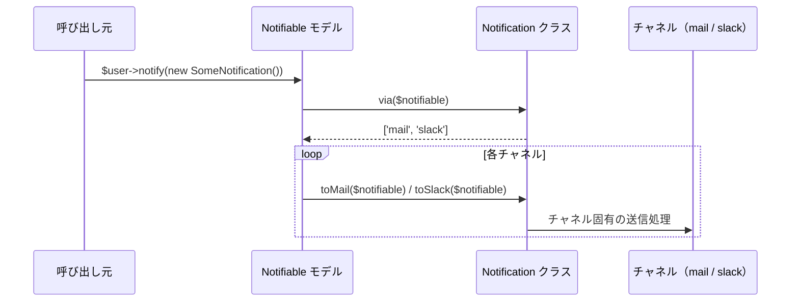
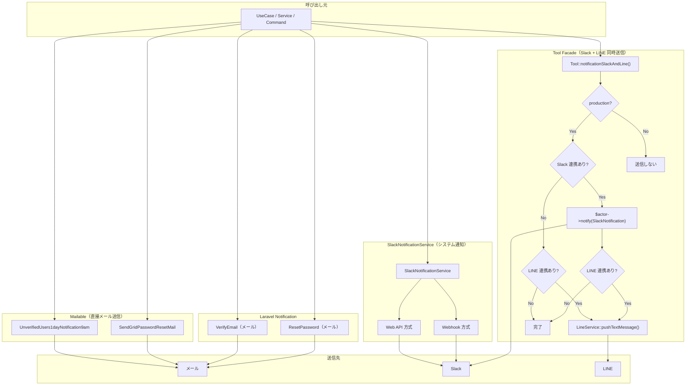

# 4-3-2 通知システム

📝 **前提知識**: このセクションはセクション 4-3-1 Observer と Listener の内容を前提としています。

## 🎯 このセクションで学ぶこと

- **Laravel Notification** の基本構造（Notification クラス、`via()` によるチャネル選択、`Notifiable` トレイト）を理解する
- LMS の3つの Notification クラス（SlackNotification / ResetPassword / VerifyEmail）の設計意図を読み解く
- **カスタム通知ディスパッチャー**（Tool Facade）による Slack + LINE 同時送信パターンを理解する
- **Slack 連携** の2つの方式（Webhook / Web API）と **LINE 連携** の仕組みを理解する
- **Mailable クラス** と Notification の使い分けを理解する
- LMS の通知アーキテクチャ全体像を把握する

このセクションでは、まず「通知をチャネルごとにバラバラに実装する」課題を確認し、Laravel Notification がそれをどう解決するかを学びます。次に LMS の実装を読み解き、Notification だけでは対応しきれない部分をカスタムディスパッチャーや Service で補完するハイブリッドな設計を理解します。

---

## 導入: チャネルが増えるたびに複雑化する通知

LMS では「何かが起きた」ことをユーザーやコーチに伝える手段が複数あります。面談が予約されたらメールで通知し、チャットメッセージが届いたら Slack と LINE で知らせ、パスワードリセットのリンクはメールで送る。それぞれの通知先には固有の API や認証方式があります。

もし通知のたびに「メールを送る処理」「Slack に投稿する処理」「LINE にプッシュする処理」をバラバラに書いていたらどうなるでしょうか。通知を追加するたびに3つの送信処理を個別に書き、エラーハンドリングもそれぞれ別に実装することになります。送信先が増えれば増えるほど、管理が煩雑になり、漏れや不整合が発生しやすくなります。

Laravel はこの課題に対して **Notification** という仕組みを提供しています。「何を通知するか」と「どのチャネルで送るか」を1つのクラスにまとめることで、通知ロジックを一元管理できます。ただし LMS では、Laravel Notification だけではカバーしきれない要件もあり、カスタムの仕組みと組み合わせた**ハイブリッドなアプローチ** を採用しています。

### 🧠 先輩エンジニアはこう考える

> 通知周りのデバッグは独特の難しさがあります。開発環境では Slack や LINE への送信を止めたいし、本番環境でだけ動かしたい。でもテストのために本番にデプロイするわけにもいかない。LMS では `config('app.env') !== 'production'` のガードを入れて本番環境のみ送信するようにしていますが、これがないと開発中にテスト用の通知が Slack チャネルに大量に流れて大変なことになります。実際に一度やらかしたことがあって、それ以来このガードは必ず入れるようにしています。通知を実装するときは「開発中にどう動作確認するか」を最初に考えるのが大事です。

---

## Laravel Notification の基本構造

### Notification クラスの仕組み

Laravel の Notification は、以下の3つの要素で構成されます。

| 要素 | 役割 |
|---|---|
| **Notification クラス** | 通知の内容とチャネルを定義する |
| **`Notifiable` トレイト** | モデルに「通知を受け取れる能力」を付与する |
| **チャネルメソッド** | `toMail()`, `toSlack()` 等、チャネルごとの送信内容を定義する |

処理の流れを図で確認しましょう。



`$user->notify()` を呼ぶと、Laravel は Notification クラスの `via()` メソッドでチャネルの一覧を取得し、各チャネルに対応する `toMail()` や `toSlack()` メソッドを実行します。

🔑 **重要なポイント**:
- `via()` メソッドが返す配列で **どのチャネルに送るか** を決定する
- チャネルごとに `toXxx()` メソッドで **何を送るか** を定義する
- `Notifiable` トレイトを持つモデルなら、`$model->notify()` で通知を送れる

### routeNotificationForSlack() の役割

Slack チャネルに通知を送る場合、Laravel は送信先の Webhook URL をどこから取得するのでしょうか。`Notifiable` トレイトを持つモデルに `routeNotificationForSlack()` メソッドを定義することで、送信先を指定できます。

LMS では User モデルと Employee モデルの両方にこのメソッドが定義されています。

```php
// backend/app/Models/User.php
public function routeNotificationForSlack()
{
    return $this->slackNotificationToken->web_hook_url;
}
```

```php
// backend/app/Models/Employee.php
public function routeNotificationForSlack()
{
    return $this->slackNotificationToken->web_hook_url;
}
```

ユーザーごとに設定された Slack Webhook URL を `SlackNotificationToken` モデルから取得しています。この仕組みにより、Notification クラス側は送信先を意識する必要がありません。

---

## LMS の Notification クラス

LMS には3つの Notification クラスがあります。それぞれ異なる用途とチャネルを持っています。

| クラス | チャネル | 用途 |
|---|---|---|
| `SlackNotification` | Slack | 汎用的な Slack 通知 |
| `ResetPassword` | メール | パスワードリセットメール |
| `VerifyEmail` | メール | メール確認（会員登録案内） |

### SlackNotification: 汎用 Slack 通知

最もシンプルな Notification クラスです。

```php
// backend/app/Notifications/SlackNotification.php
class SlackNotification extends Notification
{
    use Queueable;

    protected $message;

    public function __construct($message)
    {
        $this->message = $message;
    }

    public function via($notifiable)
    {
        return ['slack'];
    }

    public function toSlack($notifiable)
    {
        return (new SlackMessage)
            ->content($this->message);
    }
}
```

このクラスの特徴は以下の通りです。

- **`via()` は `['slack']` のみ** を返します。メールは送りません
- **コンストラクタでメッセージ文字列を受け取る** 汎用的な設計です。送信元が自由にメッセージを組み立てて渡します
- **`Queueable` トレイト** を使っているため、キューに投入して非同期で送信できます（Laravel 10 のキュー機能）
- **`SlackMessage` クラス** で Slack 固有のメッセージ形式を組み立てています

💡 `SlackMessage` は `laravel/slack-notification-channel` パッケージが提供するクラスで、Slack Incoming Webhooks の API 形式に変換してくれます。

### ResetPassword: パスワードリセットメール

Laravel 組み込みの `ResetPasswordNotification` を拡張しています。

```php
// backend/app/Notifications/ResetPassword.php
class ResetPassword extends ResetPasswordNotification
{
    use Queueable;

    private string $actorType;
    public $token;

    public function __construct(string $token, string $actorType)
    {
        $this->token = $token;
        $this->actorType = $actorType;
    }

    public function toMail($notifiable)
    {
        $url = $this->generateResetPasswordUrl($notifiable);
        return (new MailMessage())
            ->subject('パスワード再設定のご案内')
            ->markdown('mail.reset_password', ['url' => $url]);
    }

    private function generateResetPasswordUrl($notifiable)
    {
        $baseClientUrl = config('app.app_client');
        $queryParams = [
            'token' => $this->token,
            'email' => $notifiable->email,
        ];
        $resetRoute = "/v2/{$this->actorType}/reset-password?" . http_build_query($queryParams);
        return url($baseClientUrl . $resetRoute);
    }
}
```

🔑 **注目すべき設計ポイント**:

- **`actorType` によるURL切り替え**: LMS には User（受講生）と Employee（コーチ/管理者）がいます。`$this->actorType` の値（`'user'` や `'employee'`）に応じて、パスワードリセット画面の URL パスが `/v2/user/reset-password?...` または `/v2/employee/reset-password?...` に切り替わります
- **フロントエンド URL の生成**: `config('app.app_client')` でフロントエンドのベース URL を取得し、バックエンドではなくフロントエンドのパスワードリセット画面への URL を組み立てています。SPA + API アーキテクチャでは、メール内のリンクはフロントエンドに向ける必要があります
- **Laravel 組み込みの拡張**: `ResetPasswordNotification` を継承し、`toMail()` をオーバーライドすることで、Laravel のパスワードリセット機能を活かしつつ、LMS 固有の URL 生成に差し替えています

### VerifyEmail: メール確認（会員登録案内）

最も複雑な Notification クラスです。ワークスペースコンテキストを持ち、初期パスワードの自動生成も行います。

```php
// backend/app/Notifications/VerifyEmail.php
class VerifyEmail extends VerifyEmailNotification
{
    use Queueable;

    private string $actorType;
    private string $workspaceId;

    public function __construct(string $workspaceId, string $actorType)
    {
        $this->workspaceId = $workspaceId;
        $this->actorType = $actorType;
    }

    public function toMail($notifiable)
    {
        $password = Str::random(10);
        $notifiable->update(['password' => Hash::make($password)]);
        $url = $this->verificationUrl($notifiable);
        $workspace = Workspace::find($this->workspaceId);

        return (new MailMessage())->markdown('mail.verify', [
            'url' => $url,
            'email' => $notifiable->email,
            'password' => $password,
            'actorType' => $this->actorType,
            'workspaceId' => $workspace->id,
            'workspaceName' => $workspace->name,
            'loginUrl' => $this->loginUrl(),
        ])->subject("{$workspace->name} 会員登録のご案内");
    }

    public function verificationUrl($notifiable)
    {
        return URL::temporarySignedRoute(
            'verification.verify',
            Carbon::now()->addMinutes(Config::get('auth.verification.expire')),
            [
                'id' => $notifiable->getKey(),
                'hash' => sha1($notifiable->getEmailForVerification()),
                'actorType' => $this->actorType,
                'workspaceId' => $this->workspaceId,
            ]
        );
    }
}
```

🔑 **注目すべき設計ポイント**:

- **ワークスペースコンテキスト**: LMS はマルチワークスペース対応のため、どのワークスペースへの招待かを `workspaceId` で管理しています。メールの件名にもワークスペース名が含まれます
- **初期パスワードの自動生成**: `toMail()` 内で `Str::random(10)` でランダムなパスワードを生成し、ハッシュ化してデータベースに保存した上で、平文のパスワードをメール本文に含めています。これにより、招待されたユーザーは初回ログイン時にこのパスワードを使えます
- **`temporarySignedRoute` による署名付きURL**: `URL::temporarySignedRoute()` は、有効期限付きで改ざん防止の署名が含まれた URL を生成します。`auth.verification.expire` の設定値に基づいて有効期限が決まります。URL には `id`、`hash`、`actorType`、`workspaceId` がパラメータとして含まれます

⚠️ **注意**: `toMail()` 内でデータベースの更新（`$notifiable->update()`）を行っているのは、一般的な Notification の設計としては珍しいパターンです。通常、Notification はメッセージの組み立てに専念し、副作用のあるデータ変更は呼び出し元で行うのが望ましいですが、LMS ではパスワード生成とメール送信を不可分な処理として扱っています。

---

## カスタム通知ディスパッチャー（Tool Facade）

LMS の通知には、Laravel Notification だけではカバーしきれないパターンがあります。「Slack と LINE に同じメッセージを同時に送る」という要件です。

LINE は Laravel Notification の標準チャネルではないため、`via()` で `['slack', 'line']` と書くことはできません。LMS ではこの課題を **カスタム通知ディスパッチャー** で解決しています。

### Notification クラス（Libs/Notification.php）

```php
// backend/app/Libs/Notification.php
class Notification
{
    public function notificationSlackAndLine(User | Employee $actor, string $message)
    {
        if (config('app.env') !== 'production') {
            return;
        }

        try {
            if ($actor->slackNotificationToken) {
                $actor->notify(new SlackNotification($message));
            }
        } catch (\Throwable $th) {
            Log::error($th);
        }

        try {
            if ($actor->lineUserId) {
                $lineService = new LineService;
                $message = $message . "\n" . "※このメッセージには返信できません。LMSにてご確認ください。";
                $lineService->pushTextMessage($actor->lineUserId->line_user_id, $message);
            }
        } catch (\Throwable $th) {
            Log::error($th);
        }
    }
}
```

このクラスは `Illuminate\Notifications\Notification` とは全く別のクラスです。`App\Libs\Notification` として独自に定義されています。

🔑 **設計上の重要なポイント**:

- **本番環境ガード**: `config('app.env') !== 'production'` で、開発環境やステージング環境では通知を一切送りません。これにより、開発中に Slack チャネルや LINE にテスト通知が流れることを防ぎます
- **個別の try-catch**: Slack と LINE の送信をそれぞれ別の `try-catch` で囲んでいます。Slack の送信に失敗しても LINE は送信を試みます。片方のチャネルの障害がもう片方に影響しない設計です
- **連携状態の確認**: `$actor->slackNotificationToken` と `$actor->lineUserId` の存在を確認し、連携していないチャネルにはスキップします。全ユーザーが Slack と LINE の両方を連携しているわけではないためです
- **ハイブリッドなアプローチ**: Slack 通知には Laravel Notification の `$actor->notify()` を使い、LINE 通知には `LineService` を直接呼んでいます。標準機能と独自実装を組み合わせた実用的な設計です

### Tool Facade によるアクセス

このディスパッチャーは `Tool` Facade を通じて呼び出されます。

```php
// backend/app/Facades/Tool.php
class Tool extends Facade
{
    protected static function getFacadeAccessor()
    {
        return 'tool';
    }
}
```

```php
// backend/app/Providers/ToolServiceProvider.php
public function register()
{
    $this->app->bind('tool', '\App\Libs\Notification');
}
```

`ToolServiceProvider` が `'tool'` という名前で `App\Libs\Notification` をバインドしています。これにより、アプリケーション全体で `Tool::notificationSlackAndLine()` と呼び出せます。

実際の使用例を見てみましょう。LMS のコードベース全体で `Tool::notificationSlackAndLine()` は多くの箇所から呼ばれています。

```php
// backend/app/Services/Meeting/CreateMeetingService.php（面談作成時の通知）
Tool::notificationSlackAndLine($employee, $channelMessage);

// backend/app/UseCases/ChatMessage/StoreAction.php（チャットメッセージ送信時の通知）
Tool::notificationSlackAndLine($chatRoomUser->actor, $notificationUserMessage);

// backend/app/Services/UserExam/UserExamNotificationService.php（試験結果の通知）
Tool::notificationSlackAndLine($userExam->user, $message);
```

どの箇所でも `Tool::notificationSlackAndLine($actor, $message)` という統一的なインターフェースで Slack + LINE の同時送信ができています。

---

## Slack 連携の仕組み

LMS の Slack 通知には2つの方式があります。`SlackNotificationService` がその両方を担っています。

### Webhook 方式と Web API 方式

以下は主要部分の抜粋です。

```php
// backend/app/Services/Slack/SlackNotificationService.php
class SlackNotificationService
{
    use Notifiable;

    public $webhook;
    public $botToken;

    public function __construct()
    {
        $this->botToken = config('app.slack_bot_token');
    }

    // Webhook 方式: Laravel Notification 経由
    public function send($message = null)
    {
        $this->notify(new SlackNotification($message));
    }

    public function routeNotificationForSlack()
    {
        if ($this->webhook) {
            return config('slack.channels.' . $this->webhook);
        }
        throw new Exception('please call slackChannel function');
    }

    public function slackChannel($channel)
    {
        $this->webhook = $channel;
        return $this;
    }

    // Web API 方式: Guzzle HTTP クライアントで直接送信
    public function sendViaApi($message, $channelName = null)
    {
        $channel = $channelName ?? $this->webhook;
        $client = new Client();
        $response = $client->post('https://slack.com/api/chat.postMessage', [
            'headers' => [
                'Authorization' => 'Bearer ' . $this->botToken,
                'Content-Type' => 'application/json',
            ],
            'json' => [
                'channel' => $channel,
                'text' => $message,
            ],
        ]);
        // ... エラーハンドリング
    }

    // Web API 方式: スレッド返信
    public function sendThreadReply($message, $threadTs, $channelName = null)
    {
        // sendViaApi と同様だが、'thread_ts' パラメータを追加
    }
}
```

2つの方式の違いを整理します。

| 方式 | メソッド | 認証 | 特徴 |
|---|---|---|---|
| **Webhook** | `send()` | Incoming Webhook URL | シンプル。チャネル固定。Laravel Notification 経由 |
| **Web API** | `sendViaApi()`, `sendThreadReply()` | Bot Token | 柔軟。任意チャネル送信、スレッド返信が可能 |

注目すべきは、`SlackNotificationService` 自身が `Notifiable` トレイトを使っている点です。User や Employee モデルではなく、Service クラスが通知の送信元になっています。`routeNotificationForSlack()` を自身に定義することで、ユーザー個別の Webhook URL ではなく、`config('slack.channels.xxx')` に設定されたシステム共通のチャネルに送信します。

💡 **使い分けの指針**: ユーザー個別への通知は `Tool::notificationSlackAndLine()` を使い（ユーザーの Webhook URL に送信）、システム全体の通知チャネル（開発通知チャネルなど）への送信は `SlackNotificationService` を使います。

### SlackNotificationToken モデル

```php
// backend/app/Models/SlackNotificationToken.php
class SlackNotificationToken extends Model
{
    use HasFactory, HasUlids;

    protected $fillable = ['web_hook_url', 'actor_id', 'actor_type'];

    public function actor()
    {
        return $this->morphTo();
    }
}
```

**ポリモーフィックリレーション**（`morphTo`）を使っています。`actor_type` が `App\Models\User` の場合は User、`App\Models\Employee` の場合は Employee に紐づきます。1つのテーブルで両方のアクター種別の Slack 連携情報を管理できます。

---

## LINE 連携の仕組み

LINE 連携は Laravel Notification のチャネルとしてではなく、`LineService` を直接呼び出す形で実装されています。

### pushTextMessage によるプッシュ通知

```php
// backend/app/Services/Line/LineService.php
public function pushTextMessage(string $userId, string $message)
{
    if (empty($userId)) {
        throw new Exception('LINE連携していません');
    }

    $url = 'https://api.line.me/v2/bot/message/push';

    $postData = json_encode([
        'to' => $userId,
        'messages' => [
            ['type' => 'text', 'text' => $message]
        ]
    ]);

    $client = new Client();
    $client->post($url, [
        'headers' => [
            'Content-Type' => 'application/json',
            'Authorization' => 'Bearer ' . config('app.line_channel_access_token'),
        ],
        'body' => $postData
    ]);
}
```

LINE Messaging API の Push API を Guzzle HTTP クライアントで直接呼び出しています。認証には `config('app.line_channel_access_token')` に設定されたチャネルアクセストークンを使います。

### LineUserId モデルと OAuth 認証

```php
// backend/app/Models/LineUserId.php
class LineUserId extends Model
{
    use HasFactory, HasUlids;

    protected $fillable = ['actor_id', 'actor_type', 'line_user_id'];

    public function actor()
    {
        return $this->morphTo();
    }
}
```

`SlackNotificationToken` と同じくポリモーフィックリレーションで、User と Employee の両方に対応しています。`line_user_id` フィールドに LINE のユーザー ID が保存されており、これが Push API の送信先になります。

LINE ユーザー ID の取得には OAuth 2.0 認証フローを使います。`LineService` には `getAuthorizeLink()` と `getAccessToken()` メソッドがあり、LINE Login のフローを処理します。ユーザーが LINE ログインを完了すると、LINE API からプロフィール情報（ユーザー ID を含む）が返され、`LineUserId` モデルに保存されます。

💡 LINE 連携の OAuth フローの詳細はセクション 4-4-4 で学びます。今は「LINE ユーザー ID がデータベースに保存されていて、それを使って Push API でメッセージを送る」という構造を把握すれば十分です。

---

## Mailable クラス: Notification とは別のメール送信パターン

LMS では、Notification クラス以外にも **Mailable クラス** を使ったメール送信パターンがあります。

### Notification と Mailable の違い

| 観点 | Notification | Mailable |
|---|---|---|
| **送信方法** | `$user->notify(new XxxNotification())` | `Mail::send(new XxxMail())` |
| **チャネル** | 複数チャネル対応（mail / slack 等） | メール専用 |
| **送信先** | `Notifiable` モデルから自動解決 | `to()` で明示的に指定 |
| **適した場面** | 特定ユーザーへの通知 | 一斉送信、バッチメール |

### LMS の Mailable 実例

LMS の `backend/app/Mail/` には、Notification ではなく Mailable で実装されたメールがあります。

```php
// backend/app/Mail/SendGridPasswordResetMail.php
class SendGridPasswordResetMail extends Mailable
{
    use Queueable, SerializesModels;

    public $user;
    public $url;

    public function __construct($user, $url)
    {
        $this->user = $user;
        $this->url = $url;
    }

    public function build()
    {
        return $this->markdown('mail.reset_password')
                    ->to($this->user->email)
                    ->subject('パスワード再設定')
                    ->with(['url' => $this->url, 'user' => $this->user]);
    }
}
```

📝 Notification の `ResetPassword` クラスとは別に、Mailable として `SendGridPasswordResetMail` が存在しています。これは、Notification 経由の送信と直接的なメール送信の両方のパスが使い分けられていることを示しています。

もう1つの例は、未確認ユーザーへのリマインドメールです。

```php
// backend/app/Mail/UnverifiedUsers1dayNotification9am.php
class UnverifiedUsers1dayNotification9am extends Mailable
{
    use Queueable, SerializesModels;

    protected $user;

    public function __construct($user)
    {
        $this->user = $user;
    }

    public function envelope()
    {
        return new Envelope(
            subject: 'COACHTECH LMSからのお知らせ：ログインが必要です',
        );
    }

    public function content()
    {
        return new Content(
            view: 'mail.unverified_users_1day_notification_9am',
            with: [
                'user' => $this->user->last_name . $this->user->first_name,
                'starting_date' => Carbon::parse($this->user->StudentInformation->starting_date)
                    ->format('Y年n月j日')
            ],
        );
    }
}
```

この Mailable は Laravel 10 の `Envelope` / `Content` 形式（Laravel 9 で導入された新しい Mailable 記法）を使っています。スケジュールタスクから一斉送信されるバッチ処理向けのメールであり、特定ユーザーへの通知ではないため、Notification ではなく Mailable として実装されています。

---

## LMS の通知アーキテクチャ全体図

ここまで学んだ LMS の通知に関する仕組みを全体図で整理します。



LMS の通知アーキテクチャは、以下の4つの経路で構成されています。

| 経路 | 仕組み | 用途 |
|---|---|---|
| **Tool Facade** | `Libs\Notification` + Laravel Notification + `LineService` | ユーザー/コーチへの Slack + LINE 同時通知 |
| **Laravel Notification** | `ResetPassword`, `VerifyEmail` | 認証系のメール通知 |
| **Mailable** | `SendGridPasswordResetMail`, `UnverifiedUsers1dayNotification9am` 等 | バッチメール、直接メール送信 |
| **SlackNotificationService** | Webhook / Web API 方式 | システム全体の Slack チャネルへの通知 |

これらを組み合わせた**ハイブリッドなアプローチ** が LMS の通知設計の特徴です。Laravel Notification の標準機能で対応できる部分（メール、Slack Webhook）はそのまま活用し、標準機能ではカバーできない部分（LINE プッシュ、Slack Web API）は独自の Service で補完しています。

---

## ✨ まとめ

- **Laravel Notification** は、`via()` でチャネルを選択し、`toMail()` / `toSlack()` でチャネルごとの内容を定義する仕組み。`Notifiable` トレイトを持つモデルから `$model->notify()` で送信する
- LMS の3つの Notification クラスはそれぞれ異なる用途を持つ: **SlackNotification**（汎用 Slack 通知）、**ResetPassword**（actorType による URL 切り替え）、**VerifyEmail**（ワークスペースコンテキスト + 署名付き URL）
- **Tool Facade**（`App\Libs\Notification`）は、Slack と LINE への同時送信をまとめたカスタムディスパッチャー。本番環境ガード、個別 try-catch、連携状態の確認を備える
- **Slack 連携** は Webhook 方式（Laravel Notification 経由）と Web API 方式（Guzzle 直接）の2つ。ユーザー個別の通知と、システム全体の通知チャネルで使い分ける
- **LINE 連携** は `LineService` の `pushTextMessage()` で LINE Messaging API を直接呼び出す。ユーザー ID はポリモーフィックな `LineUserId` モデルで管理
- **Mailable クラス** は、Notification とは別のメール専用の送信パターン。バッチ処理や一斉送信に適する
- LMS は **ハイブリッドアプローチ** を採用: Laravel Notification の標準機能 + カスタム Service + Tool Facade を組み合わせて、メール / Slack / LINE の全チャネルをカバーしている

---

この Chapter では、Observer と Listener によるモデルイベントの自動処理と、Notification / Mailable / カスタムディスパッチャーによる通知システムを学びました。イベント駆動の仕組みを理解したことで、「何かが起きたとき、どこで何が動くか」をコードから追跡できるようになりました。

次の Chapter では、これらの通知チャネル（Slack、LINE）を含む外部サービスとの連携を体系的に学びます。外部 API 連携の設計原則として、Service 層への集約、`config/services.php` による認証情報管理、エラーハンドリング、リトライ戦略を理解し、LMS で使われる個別の外部サービスの構造を読み解いていきます。
