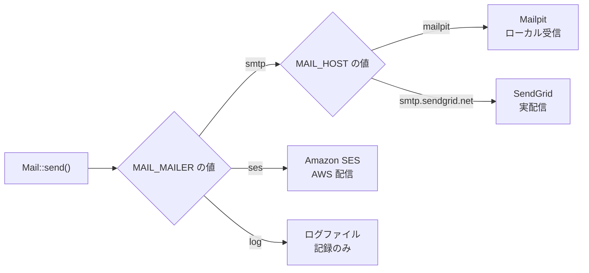
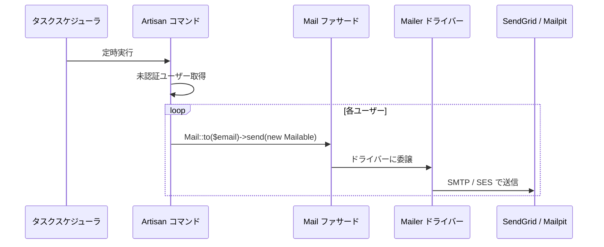
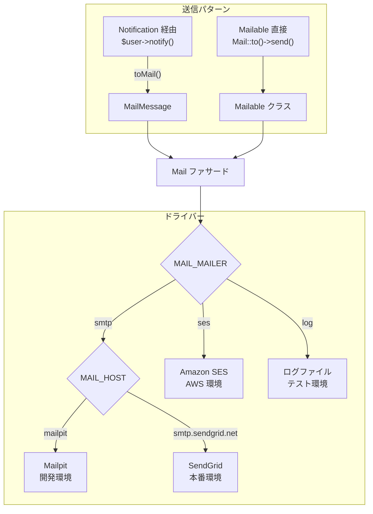

# 4-4-2 メール送信（SendGrid / SES）

📝 **前提知識**: このセクションはセクション 4-4-1 外部 API 連携の共通パターンの内容を前提としています。

## 🎯 このセクションで学ぶこと

- Laravel のメール送信基盤（Mailer ドライバー、config/mail.php）の仕組みと、環境ごとの切り替え方を理解する
- Mailable クラスの 2 つの書き方（`build()` 方式と `envelope()`/`content()` 方式）の違いを理解し、LMS のコードを読めるようにする
- SendGrid（SMTP ドライバー経由）と SES（AWS ドライバー）の使い分けと設定構造を理解する
- Mailable と Notification のどちらを使うべきかの判断基準を身につける

Laravel のメール送信の仕組みを、設定層から Mailable クラスの実装、そして外部サービスとの接続まで順を追って見ていきます。

---

## 導入: メール送信が「あちこちで」必要になる問題

Web アプリケーションにおいて、メール送信はほぼ必須の機能です。しかし、メールの種類は開発が進むにつれて増え続けます。LMS でも以下のような場面でメールを送信しています。

- 会員登録案内（VerifyEmail）
- パスワードリセット（ResetPassword）
- 未ログインユーザーへのリマインド通知（UnverifiedUsers1dayNotification）

これらのメールは、送信タイミングも送信元もバラバラです。Controller から直接送るもの、Artisan コマンドからバッチ送信するもの、Notification として Model 経由で送るものが混在します。さらに、開発環境では実際にメールを送信したくないし、本番環境では SendGrid や SES のような専用サービスを経由させたいという要件もあります。

Laravel はこの複雑さを **Mailer ドライバー** と **Mailable クラス** という 2 つの仕組みで整理しています。

### 🧠 先輩エンジニアはこう考える

> LMS の開発で一番怖いのは「テスト中に本番メールが飛ぶ」ことです。パスワードリセットのメールが実際のユーザーに届いてしまったら大問題ですよね。だから開発環境では Mailpit を使って、すべてのメールをローカルで受け止めるようにしています。`.env` の `MAIL_HOST` を `mailpit` に向けるだけで切り替わるので、コードを一切変えずに環境だけで制御できる。この「コードは同じ、設定だけ変える」という設計が Laravel のメール基盤の良いところです。

---

## Laravel Mail の仕組み: ドライバーで送信先を切り替える

Laravel のメール送信は、`config/mail.php` を中心とした設定ファイルで制御されます。セクション 4-4-1 で学んだ `config/services.php` による認証情報管理と同じく、環境変数で動作を切り替える設計です。

### config/mail.php の構造

以下は主要部分の抜粋です。

```php
// backend/config/mail.php
'default' => env('MAIL_MAILER', 'smtp'),

'mailers' => [
    'smtp' => [
        'transport' => 'smtp',
        'host' => env('MAIL_HOST', 'smtp.mailgun.org'),
        'port' => env('MAIL_PORT', 587),
        'encryption' => env('MAIL_ENCRYPTION', 'tls'),
        'username' => env('MAIL_USERNAME'),
        'password' => env('MAIL_PASSWORD'),
        'timeout' => null,
    ],

    'ses' => [
        'transport' => 'ses',
    ],

    'log' => [
        'transport' => 'log',
        'channel' => env('MAIL_LOG_CHANNEL'),
    ],
],

'from' => [
    'address' => env('MAIL_FROM_ADDRESS', 'hello@example.com'),
    'name' => env('MAIL_FROM_NAME', 'Example'),
],
```

この設定のポイントは 3 つあります。

**`default`**: 環境変数 `MAIL_MAILER` で、どのドライバーを使うかを決定します。未設定の場合は `smtp` がデフォルトです。

**`mailers`**: 利用可能なドライバーの一覧です。`smtp`、`ses`、`log` など複数のドライバーが定義されており、`.env` の設定だけで切り替えられます。

**`from`**: 全メール共通の送信元アドレス。個別の Mailable クラスで上書きすることもできます。

### 環境ごとのドライバー使い分け

LMS では環境に応じて以下のように Mailer ドライバーを切り替えています。

| 環境 | ドライバー | 接続先 | 目的 |
|---|---|---|---|
| 開発（ローカル） | smtp | Mailpit（localhost:1025） | メールの見た目確認。外部には一切送信しない |
| 本番 | smtp | SendGrid（smtp.sendgrid.net） | 実際のメール配信 |
| AWS 環境 | ses | Amazon SES | AWS インフラとの統合 |
| テスト | log | ログファイル | テスト時にメール送信を記録だけする |



🔑 ここで重要なのは、**Mailable クラスのコードは環境によって変わらない** という点です。`Mail::to($email)->send(new SomeMailable())` という呼び出しはどの環境でも同じ。送信先のサービスは `.env` ファイルだけで切り替わります。これがセクション 4-4-1 で学んだ「設定とコードの分離」の実例です。

---

## Mailable クラスの 2 つの書き方

Laravel 10 の Mailable クラスには、歴史的な経緯から 2 つの書き方が存在します。LMS のコードベースには両方が混在しているため、どちらも読めるようになる必要があります。

### build() 方式（Laravel 9 以前のスタイル）

古くからある書き方で、`build()` メソッド 1 つにすべての設定をチェーンで記述します。

```php
// backend/app/Mail/SendGridPasswordResetMail.php
class SendGridPasswordResetMail extends Mailable
{
    use Queueable, SerializesModels;

    public $data;
    public $user;
    public $url;

    public function __construct($user, $url)
    {
        $this->user = $user;
        $this->url = $url;
    }

    public function build()
    {
        return $this->markdown('mail.reset_password')
                    ->to($this->user->email)
                    ->subject('パスワード再設定')
                    ->with([
                        'url' => $this->url,
                        'user' => $this->user,
                    ]);
    }
}
```

このコードを読み解きましょう。

- **`use Queueable, SerializesModels`**: `Queueable` はメール送信をキューに入れて非同期処理する機能、`SerializesModels` は Eloquent モデルをキューに渡す際にシリアライズする機能を提供します
- **`public` プロパティ**: `$user` と `$url` が `public` で宣言されています。Mailable の `public` プロパティは自動的にビューテンプレートに渡されます
- **`build()` メソッド**: `markdown()` でテンプレートを指定し、`to()` で宛先、`subject()` で件名、`with()` で追加データを設定しています。メソッドチェーンで全設定を 1 箇所にまとめるスタイルです
- **`markdown()`**: Blade テンプレートではなく、Laravel の Markdown メールテンプレートを使用しています。`resources/views/mail/reset_password.blade.php` に対応します

### envelope()/content() 方式（Laravel 10 推奨スタイル）

Laravel 10 で導入された新しい書き方では、メールの「封筒（Envelope）」と「本文（Content）」を別メソッドに分離します。

```php
// backend/app/Mail/UnverifiedUsers1dayNotification9am.php
class UnverifiedUsers1dayNotification9am extends Mailable
{
    use Queueable, SerializesModels;

    protected $user;

    public function __construct($user)
    {
        $this->user = $user;
    }

    public function envelope()
    {
        return new Envelope(
            subject: 'COACHTECH LMSからのお知らせ：ログインが必要です',
        );
    }

    public function content()
    {
        return new Content(
            view: 'mail.unverified_users_1day_notification_9am',
            with: [
                'user' => $this->user->last_name . $this->user->first_name,
                'starting_date' => Carbon::parse($this->user->StudentInformation->starting_date)->format('Y年n月j日')
            ],
        );
    }

    public function attachments()
    {
        return [];
    }
}
```

`build()` 方式との違いに注目してください。

- **`envelope()`**: 件名、送信元、CC、BCC など「封筒」に書く情報を `Envelope` オブジェクトで返します。PHP 8.0 の名前付き引数（`subject:`）を使って可読性高く記述できます
- **`content()`**: テンプレートと渡すデータを `Content` オブジェクトで返します。`view:` で Blade テンプレートを、`with:` でデータを指定します
- **`attachments()`**: 添付ファイルを配列で返します。このメールでは添付なしなので空配列です
- **`protected $user`**: `public` ではなく `protected` で宣言されています。新しい方式では `content()` の `with:` で明示的にデータを渡すため、プロパティの可視性に依存しません

### 2 つの方式の比較

| 項目 | build() 方式 | envelope()/content() 方式 |
|---|---|---|
| Laravel バージョン | 9 以前から利用可能 | 10 で導入 |
| 設定の場所 | `build()` に全部まとめる | `envelope()`、`content()`、`attachments()` に分離 |
| テンプレートへのデータ渡し | `public` プロパティが自動で渡る | `content()` の `with:` で明示的に渡す |
| 可読性 | メソッドチェーンが長くなると見通しが悪い | 責務ごとにメソッドが分かれていて読みやすい |
| LMS での使用 | `SendGridPasswordResetMail` | `UnverifiedUsers1dayNotification9am` |

💡 どちらの方式も Laravel 10 で問題なく動作します。新規作成時は `envelope()`/`content()` 方式を使い、既存のコードは無理に書き換える必要はありません。`php artisan make:mail` コマンドで生成すると、自動的に新しい方式のテンプレートが作られます。

---

## LMS のメール送信パターン

LMS では、メール送信の呼び出し方に大きく **2 つのパターン** があります。Mailable を直接送信するパターンと、Notification 経由で送信するパターンです。

### パターン 1: Mail ファサードで直接送信

Artisan コマンドやバッチ処理から、`Mail` ファサードを使って直接送信するパターンです。

```php
// backend/app/Console/Commands/Login/UnverifiedUsers1dayNotification.php
public function handle()
{
    $today = Carbon::now('Asia/Tokyo');

    $unverifiedUsers = User::query()
        ->whereNull('email_verified_at')
        ->whereHas('activeWorkspace', function ($query) {
            $targetStartDate = Carbon::today('Asia/Tokyo')->subDay(2)->endOfDay();
            $targetEndDate = Carbon::today('Asia/Tokyo')->subDay(1)->endOfDay();
            $query->whereBetween('starting_date', [$targetStartDate, $targetEndDate]);
        })
        ->with('activeWorkspace')
        ->get();

    foreach ($unverifiedUsers as $user) {
        if ($today->hour === 9) {
            Mail::to($user->email)->send(new UnverifiedUsers1dayNotification9am($user));
        } elseif ($today->hour === 18) {
            Mail::to($user->email)->send(new UnverifiedUsers1dayNotification18am($user));
        }
    }
}
```

この Artisan コマンドの処理を読み解きましょう。

- **対象ユーザーの絞り込み**: `email_verified_at` が `null`（未認証）で、受講開始日が 1〜2 日前のユーザーを取得しています。つまり「登録はしたがまだログインしていない」ユーザーへのリマインドです
- **時間帯による出し分け**: 9 時なら `UnverifiedUsers1dayNotification9am` を、18 時なら `UnverifiedUsers1dayNotification18am` を送信しています。同じ目的のメールでも時間帯によって文面を変えています
- **`Mail::to()->send()`**: `Mail` ファサードの `to()` で宛先を指定し、`send()` で Mailable インスタンスを渡して送信します



### パターン 2: Notification 経由で送信

セクション 4-3-2 で学んだ Notification の仕組みを使い、Model の `notify()` メソッドからメールを送信するパターンです。

```php
// backend/app/Models/User.php
public function sendPasswordResetNotification($token)
{
    $this->notify(new ResetPassword($token, self::TYPE_STRING));
}
```

```php
// backend/app/Notifications/ResetPassword.php
class ResetPassword extends ResetPasswordNotification
{
    use Queueable;

    private string $actorType;
    public $token;

    public function __construct(string $token, string $actorType)
    {
        $this->token = $token;
        $this->actorType = $actorType;
    }

    public function toMail($notifiable)
    {
        $url = $this->generateResetPasswordUrl($notifiable);
        return (new MailMessage())
            ->subject('パスワード再設定のご案内')
            ->markdown('mail.reset_password', ['url' => $url]);
    }

    private function generateResetPasswordUrl($notifiable)
    {
        $baseClientUrl = config('app.app_client');
        $queryParams = [
            'token' => $this->token,
            'email' => $notifiable->email,
        ];
        $resetRoute = "/v2/{$this->actorType}/reset-password?" . http_build_query($queryParams);
        return url($baseClientUrl . $resetRoute);
    }
}
```

Notification 経由のメール送信には、Mailable 直接送信とは異なる特徴があります。

- **`MailMessage` を使う**: Mailable クラスではなく `MailMessage` オブジェクトを返します。`MailMessage` は Notification に特化した簡易的なメール構築クラスです
- **`$notifiable` を受け取る**: `toMail($notifiable)` の引数は、`notify()` を呼んだ Model インスタンス（この場合は `User`）です。宛先は `$notifiable` のメールアドレスが自動的に使われます
- **Laravel の認証フレームワークとの統合**: `ResetPasswordNotification` を継承しているため、パスワードリセットの標準フローに組み込まれます。`User` モデルの `sendPasswordResetNotification()` をオーバーライドするだけで、Laravel のパスワードリセット機構がこの Notification を使うようになります

---

## Mailable vs Notification: いつどちらを使うか

LMS のコードベースに両方のパターンが存在するのは、設計上の理由があります。

| 判断基準 | Mailable（Mail ファサード） | Notification |
|---|---|---|
| **送信チャネル** | メールのみ | メール、Slack、LINE、データベースなど複数チャネルに対応 |
| **送信起点** | どこからでも（コマンド、Controller、Service） | Model の `notify()` メソッド |
| **テンプレートの自由度** | 高い（独自の Blade テンプレートを完全にカスタマイズ可） | 標準テンプレートベース（カスタマイズも可能） |
| **Laravel 機能との統合** | なし（自前で実装） | パスワードリセット、メール認証など Laravel の認証機能と統合済み |
| **LMS での用途** | バッチメール、カスタムメール | 認証関連メール（パスワードリセット、メール認証） |

🔑 判断基準をシンプルにまとめると、以下のようになります。

- **Laravel の認証機能に組み込まれるメール**: Notification を使う。`ResetPassword`、`VerifyEmail` がこれに該当します。Laravel のフレームワークが `notify()` を呼ぶことを前提に設計されているためです
- **それ以外の業務メール**: Mailable を使う。バッチ処理からのリマインドメール、管理者への通知メールなど、送信タイミングやロジックを自由にコントロールしたい場合に適しています

⚠️ **注意**: `SendGridPasswordResetMail`（Mailable）と `ResetPassword`（Notification）は、どちらもパスワードリセットに関連するメールですが、用途が異なります。`ResetPassword` Notification は Laravel の標準パスワードリセットフローで使われ、`SendGridPasswordResetMail` は別のコンテキストでのリセットメール送信に使われています。名前が似ていても、呼び出し元と用途を確認することが重要です。

---

## SendGrid の利用: SMTP ドライバー経由

LMS の本番環境では **SendGrid** をメール配信サービスとして利用しています。SendGrid との接続は、SMTP ドライバーを経由する形で行われます。

### 設定の仕組み

SendGrid を使うために特別な設定ファイルは不要です。`config/mail.php` の `smtp` ドライバー設定をそのまま使い、`.env` で SendGrid の SMTP サーバーを指定するだけです。

```
MAIL_MAILER=smtp
MAIL_HOST=smtp.sendgrid.net
MAIL_PORT=587
MAIL_USERNAME=apikey
MAIL_PASSWORD=SG.xxxxx...   # SendGrid の API キー
MAIL_ENCRYPTION=tls
```

SendGrid は標準的な SMTP プロトコルをサポートしているため、Laravel 側は「SMTP でメールを送っている」だけであり、SendGrid 固有のコードは一切必要ありません。これがドライバーパターンの利点です。

### SendGrid SDK の存在

LMS の `composer.json` には `"sendgrid/sendgrid": "^8.0"` が含まれています。これは SendGrid の REST API を直接呼ぶための SDK です。SMTP 経由ではなく API 経由で送信したい場合や、SendGrid のマーケティング機能（テンプレート管理、統計取得など）を使いたい場合に利用します。

💡 SMTP 経由の送信と API 経由の送信は併用できます。通常のトランザクションメール（パスワードリセットなど）は SMTP で、特殊な機能が必要な場合は SDK を使うという使い分けが可能です。

---

## SES の利用: AWS 環境との統合

AWS 環境では **Amazon SES**（Simple Email Service）をメール配信に利用する選択肢があります。SES は AWS の他サービス（ECS、CloudWatch など）との統合がスムーズで、IAM ロールによる認証が使えるという利点があります。

### config/services.php の設定

SES の認証情報は `config/services.php` で管理されています。

```php
// backend/config/services.php
'ses' => [
    'key' => env('AWS_ACCESS_KEY_ID'),
    'secret' => env('AWS_SECRET_ACCESS_KEY'),
    'region' => env('AWS_DEFAULT_REGION', 'us-east-1'),
],
```

`config/mail.php` の `ses` ドライバーは `'transport' => 'ses'` とだけ記述されています。SES 固有の認証情報は `config/services.php` に集約するという、セクション 4-4-1 で学んだパターンに従っています。

### SES を有効にするには

`.env` で `MAIL_MAILER=ses` と設定するだけで、すべてのメール送信が SES 経由に切り替わります。

```
MAIL_MAILER=ses
AWS_ACCESS_KEY_ID=AKIA...
AWS_SECRET_ACCESS_KEY=xxxx...
AWS_DEFAULT_REGION=ap-northeast-1
```

LMS の `composer.json` には `"aws/aws-sdk-php": "^3.235"` が含まれており、SES ドライバーの依存パッケージが解決済みです。

### SendGrid vs SES: どちらを選ぶか

| 観点 | SendGrid | SES |
|---|---|---|
| 接続方式 | SMTP（標準プロトコル） | AWS SDK |
| 認証 | API キー | IAM 認証 |
| 料金 | 無料枠あり、従量課金 | AWS の料金体系に統合 |
| 管理画面 | 配信統計、テンプレート管理が充実 | CloudWatch でモニタリング |
| 適したケース | メール配信に特化した管理が必要な場合 | AWS インフラに統合したい場合 |

### 🧠 先輩エンジニアはこう考える

> LMS では本番環境で SendGrid を使っていますが、SES も使える状態にしてあります。SendGrid は管理画面でバウンス率やクリック率を見られるので運用が楽です。一方で、AWS に寄せたいという判断もあり得ます。ECS で動いているアプリなら、IAM ロールで認証できる SES のほうがシークレット管理が簡単です。結局のところ、どちらを選んでも `.env` の 1 行を変えるだけで切り替えられるのが Laravel のドライバー設計の良さです。

---

## 開発環境のメール: Mailpit で安全にテスト

開発環境では、メールが外部に送信されないようにする仕組みが不可欠です。LMS では **Mailpit** を使って、ローカルですべてのメールを受け止めています。

### .env.example の設定

```
MAIL_HOST=mailpit
MAIL_PORT=1025
MAIL_ENCRYPTION=null
```

Mailpit は Docker Compose で起動するローカルの SMTP サーバーです。ポート 1025 でメールを受信し、Web UI（通常はポート 8025）でメールの内容を確認できます。

<!-- TODO: 画像追加 - Mailpit の Web UI 画面 -->

この設定のポイントは `MAIL_ENCRYPTION=null` です。ローカルの Mailpit は TLS を必要としないため、暗号化を無効にしています。本番環境では `tls` を指定する点に注意してください。

💡 Mailpit は MailHog の後継ツールで、Go 言語で書かれた軽量な SMTP サーバーです。Docker 環境との相性が良く、LMS の Docker Compose 構成に含まれています。

---

## メール送信の全体像

ここまで学んだ内容を、全体像として整理します。



この図が示すように、Laravel のメール送信基盤は **送信パターン**（Mailable / Notification）と **配信ドライバー**（SMTP / SES / log）が独立しています。どの送信パターンを使っても、最終的には `MAIL_MAILER` の設定に従ってドライバーが選択されます。この分離のおかげで、メールの内容を変えずに配信先だけを切り替えたり、配信先を変えずにメールの書き方を変えたりできます。

---

## ✨ まとめ

- Laravel のメール送信は **Mailer ドライバー** で制御されます。`config/mail.php` と `.env` の設定だけで、Mailpit（開発）、SendGrid（本番）、SES（AWS）、log（テスト）を切り替えられます。Mailable クラスのコードは環境によって変わりません
- Mailable クラスには **`build()` 方式** と **`envelope()`/`content()` 方式** の 2 つの書き方があります。LMS には両方が混在しており、`SendGridPasswordResetMail` は `build()` 方式、`UnverifiedUsers1dayNotification9am` は `envelope()`/`content()` 方式で実装されています
- **SendGrid** は SMTP ドライバー経由で利用します。`MAIL_HOST=smtp.sendgrid.net` と設定するだけで、Laravel のコードに SendGrid 固有の処理は不要です。SDK（`sendgrid/sendgrid: ^8.0`）も導入済みで、API 直接呼び出しも可能です
- **SES** は `MAIL_MAILER=ses` で有効になります。認証情報は `config/services.php` で管理し、`aws/aws-sdk-php` パッケージが依存を解決します
- **Mailable と Notification の使い分け**: Laravel の認証フレームワークと統合されるメール（パスワードリセット、メール認証）は Notification を、それ以外の業務メール（バッチリマインド等）は Mailable を使います

---

次のセクションでは、OAuth 2.0 フローとトークン管理（リフレッシュ）の仕組み、Google Calendar イベント作成と Meet 自動生成、そして LMS のスケジュール同期構造を学びます。
