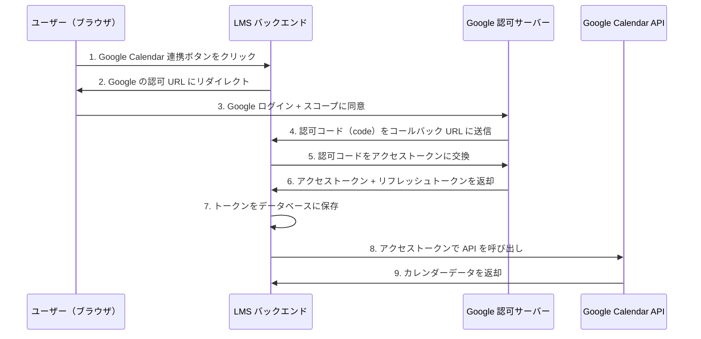
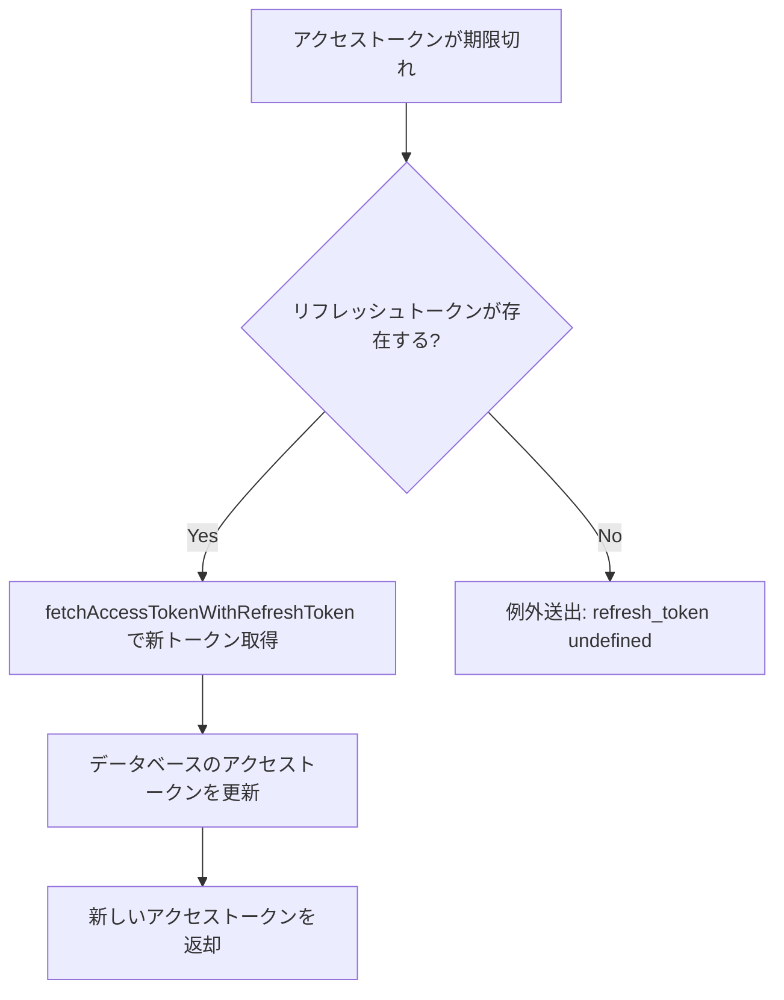
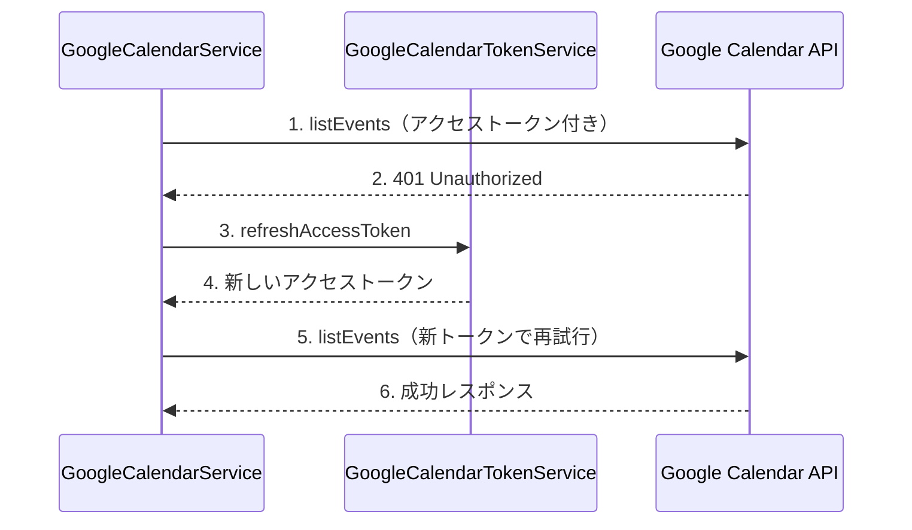
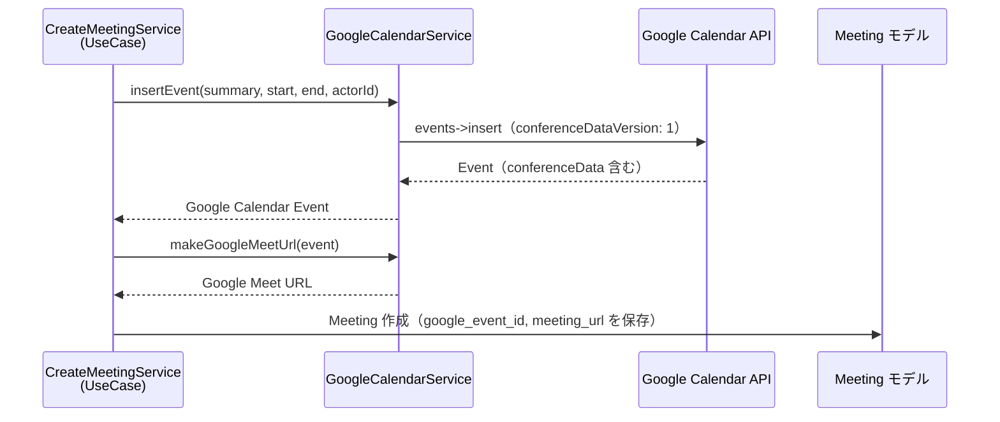
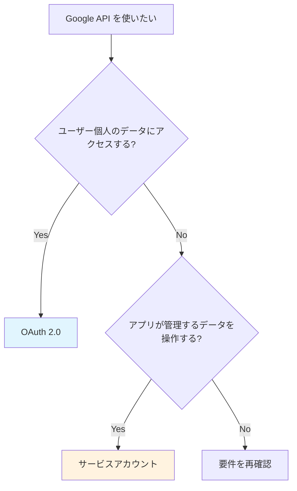

# 4-4-3 Google Calendar / Drive API

📝 **前提知識**: このセクションはセクション 4-4-1 外部 API 連携の共通パターンの内容を前提としています。

## 🎯 このセクションで学ぶこと

- **OAuth 2.0** の認可コードフローの仕組みを理解する
- **トークン管理**（保存・リフレッシュ・失効）の実装パターンを理解する
- **Google Calendar API** によるイベント作成と Google Meet URL の自動生成の仕組みを理解する
- **Google Drive API** によるスプレッドシートコピー・フォルダ作成の仕組みを理解する
- **OAuth 2.0 とサービスアカウント** の使い分けの判断基準を理解する

このセクションでは、まず OAuth 2.0 の認可コードフローを図解し、LMS がどのように Google の認可を得ているかを学びます。次にトークン管理の実装を読み解き、Google Calendar API のイベント操作と Meet URL 自動生成を理解します。最後に Google Drive API のサービスアカウント認証との違いを整理します。

---

## 導入: 手動では回らないスケジュール連携

LMS では、生徒と講師（社員）の面談予約時に Google Calendar にイベントを自動作成し、Google Meet の URL を自動生成しています。この連携がなければ、面談が予約されるたびに以下の手作業が発生します。

1. Google Calendar を開いてイベントを手動作成する
2. Google Meet の URL を手動で発行する
3. 発行した URL を生徒と講師に共有する
4. 面談がキャンセル・変更された場合に手動でカレンダーを更新する

面談は1日に何件も発生するため、この手作業は現実的ではありません。LMS はこの一連の流れを API で自動化しています。

さらに、LMS では生徒ごとの学習管理スプレッドシートを Google Drive 上で自動作成する機能も持っています。テンプレートのスプレッドシートをコピーし、生徒専用のフォルダに配置する処理です。

これらの連携には、Google Calendar API と Google Drive API という2つの API を使いますが、それぞれ **異なる認証方式** を採用しています。なぜ使い分けるのか、どう実装されているのかを見ていきましょう。

### 🧠 先輩エンジニアはこう考える

> Google Calendar 連携で一番厄介なのは、トークンの有効期限切れです。OAuth 2.0 のアクセストークンは通常1時間で切れるので、面談予約のタイミングによっては期限切れに遭遇します。本番環境で「カレンダーにイベントが作られない」という報告が来て調べると、リフレッシュトークンの処理が正しく動いていなかった、というのは実際に経験しました。もう1つ厄介なのが Google Meet URL の生成で、`conferenceDataVersion` パラメータを渡し忘れると URL が作られません。API のレスポンスにはエラーが出ないので、気づかずに本番に出してしまいがちです。

---

## OAuth 2.0 の認可コードフロー

### なぜ OAuth 2.0 が必要なのか

Google Calendar API を使うには、対象ユーザーの Google アカウントにアクセスする許可が必要です。しかし、ユーザーの Google パスワードを直接預かるわけにはいきません。**OAuth 2.0** は「ユーザーのパスワードを知らなくても、ユーザーが許可した範囲で API にアクセスできる」仕組みを提供します。

セクション 4-4-1 で学んだ API キー認証との違いは以下の通りです。

| 認証方式 | 誰の権限でアクセスするか | ユーザーの許可 |
|---|---|---|
| API キー | アプリケーション自身 | 不要 |
| OAuth 2.0 | 特定のユーザー | 必要（認可画面で同意） |

Google Calendar はユーザー個人のカレンダーを操作するため、OAuth 2.0 が必須です。

### 認可コードフローの全体像

LMS で使われている OAuth 2.0 の認可コードフロー（Authorization Code Flow）を図で示します。



このフローのポイントは以下の3つです。

- **認可コード**: ステップ 4 で返される一時的なコード。これ自体では API にアクセスできず、サーバーサイドでトークンに交換する必要があります
- **アクセストークン**: API にアクセスするための短命なトークン（通常1時間で失効）
- **リフレッシュトークン**: アクセストークンが失効した際に、ユーザーの再認可なしで新しいアクセストークンを取得するための長命なトークン

🔑 認可コードフローでは、アクセストークンがブラウザに露出しません。認可コードだけがブラウザを経由し、トークン交換はサーバー間通信で行われます。これがセキュリティ上の大きな利点です。

---

## GoogleOAuthService: 認証 URL の生成

OAuth 2.0 フローの起点となるのが `GoogleOAuthService` です。Google の認可画面への URL を生成し、クライアントの初期化を担います。

```php
// backend/app/Services/GoogleOAuthService.php
class GoogleOAuthService
{
    public function getAuthUrl()
    {
        $userId = Auth::id();
        $client = $this->getGoogleClientByJson();
        $client->setAccessType('offline');
        $client->setScopes([
            'https://www.googleapis.com/auth/calendar.readonly',
            'https://www.googleapis.com/auth/calendar.events',
        ]);
        $client->setRedirectUri(config('app.google_oauth_redirect_url'));
        $client->setPrompt('consent');
        $client->setState($userId);

        $authUrl = $client->createAuthUrl();
        return $authUrl;
    }

    public function getGoogleClientByJson()
    {
        $client = new Google_Client();
        $client->setAuthConfig(storage_path('google/credentials.json'));
        return $client;
    }
}
```

各設定の意味を確認しましょう。

| 設定 | 値 | 意味 |
|---|---|---|
| `setAccessType` | `'offline'` | リフレッシュトークンを取得する。ユーザーがオフラインでもトークンを更新可能にする |
| `setScopes` | `calendar.readonly`, `calendar.events` | API でアクセスできる範囲。カレンダーの読み取りとイベント操作を許可 |
| `setRedirectUri` | `config(...)` | 認可後のコールバック URL。Google がここに認可コードを送信する |
| `setPrompt` | `'consent'` | 毎回同意画面を表示する。これにより確実にリフレッシュトークンが発行される |
| `setState` | `$userId` | CSRF 対策。コールバック時にどのユーザーの認可かを識別する |

**`credentials.json`** は Google Cloud Console で作成した OAuth クライアントの認証情報ファイルです。クライアント ID とクライアントシークレットが含まれており、`storage/google/` ディレクトリに配置します。

💡 **スコープ** は「このアプリが何をできるか」をユーザーに明示するものです。ユーザーが Google の認可画面で「このアプリにカレンダーの読み取りとイベント操作を許可しますか？」と聞かれるのは、ここで設定したスコープに基づいています。必要最小限のスコープだけを要求することが、セキュリティとユーザー体験の両面で重要です。

---

## GoogleCalendarTokenService: トークン管理

認可コードを受け取った後のトークン交換と保存、そしてトークンの有効期限管理を担うのが `GoogleCalendarTokenService` です。

### トークンの保存

```php
// backend/app/Services/GoogleCalendarTokenService.php
class GoogleCalendarTokenService
{
    protected $googleCalendarTokenRepository;
    protected $googleOAuthService;

    public function __construct(
        GoogleCalendarTokenRepositoryInterface $googleCalendarTokenRepository,
        GoogleOAuthService $googleOAuthService,
    ) {
        $this->googleCalendarTokenRepository = $googleCalendarTokenRepository;
        $this->googleOAuthService = $googleOAuthService;
    }

    public function store($request)
    {
        try {
            $properties = $request->only(['user_id', 'code']);
            $client = $this->googleOAuthService->getGoogleClientByJson();
            $client->setRedirectUri(config('app.google_oauth_redirect_url'));

            $accessToken = $client->fetchAccessTokenWithAuthCode($request->code);

            $user = User::where('id', $properties['user_id'])->firstOrFail();
            $calendarId = $user->email;

            $googleCalendarToken = $this->googleCalendarTokenRepository->store([
                'user_id' => $properties['user_id'],
                'access_token' => $accessToken['access_token'],
                'refresh_token' => $accessToken['refresh_token'],
                'calendar_id' => $calendarId
            ]);
        } catch (\Throwable $th) {
            throw $th;
        }
        return $googleCalendarToken;
    }
}
```

`store` メソッドの処理フローは以下の通りです。

1. **認可コードの受け取り**: コールバックで Google から送られた `code` を取得する
2. **トークン交換**: `fetchAccessTokenWithAuthCode` で認可コードをアクセストークンとリフレッシュトークンに交換する
3. **カレンダー ID の設定**: Google Calendar のカレンダー ID はユーザーのメールアドレスと同じです
4. **Repository で保存**: `googleCalendarTokenRepository->store()` でデータベースに永続化する

🔑 ここで `GoogleCalendarTokenRepositoryInterface` が使われている点に注目してください。セクション 4-1-3 で学んだ Repository パターンがここで活用されています。`GoogleCalendarTokenService` はインターフェースに依存しており、データの保存方法の具体（Eloquent で MySQL に保存する）を知りません。これにより、テスト時にはモックに差し替えることができます。

### トークンのリフレッシュ

アクセストークンは通常1時間で失効します。失効した場合にリフレッシュトークンを使って新しいアクセストークンを取得する処理が `refreshAccessToken` です。

```php
// backend/app/Services/GoogleCalendarTokenService.php
public function refreshAccessToken($client, $actorId)
{
    $googleCalendarToken = $this->search(collect(array('actor_id' => $actorId)))[0];
    if ($client->isAccessTokenExpired() && isset($googleCalendarToken) && !empty($googleCalendarToken['refresh_token'])) {
        $client->fetchAccessTokenWithRefreshToken($googleCalendarToken['refresh_token']);
    } else {
        throw new Exception('refresh_token undefined', 401);
    }

    $accessToken = $client->getAccessToken();
    GoogleCalendarToken::updateOrCreate([
        'actor_id' => $actorId,
    ], [
        'access_token' => $accessToken['access_token'],
    ]);

    return $accessToken;
}
```

この処理の流れを整理します。



`updateOrCreate` でデータベースのアクセストークンを更新している点がポイントです。次回のリクエストでは更新後のトークンが使われるため、毎回リフレッシュが走ることを防ぎます。

⚠️ **注意**: リフレッシュトークンも永久に有効ではありません。Google の公式ドキュメント（[OAuth 2.0 トークンの有効期限](https://developers.google.com/identity/protocols/oauth2?hl=ja#expiration)）によると、リフレッシュトークンは以下の条件で失効します。

- ユーザーがアプリのアクセスを取り消した場合
- リフレッシュトークンが6か月間使用されなかった場合
- Google Cloud プロジェクトが「テスト」ステータスのままで7日が経過した場合

リフレッシュトークンが失効した場合、ユーザーに再度 OAuth 認可フローを実行してもらう必要があります。

### トークンの削除（連携解除）

```php
// backend/app/Services/GoogleCalendarTokenService.php
public function delete($id)
{
    try {
        $client = $this->googleOAuthService->getGoogleClientByJson();
        $googleCalendarToken = $this->show($id);

        $client->setAccessToken($googleCalendarToken['access_token']);
        $client->revokeToken();

        $result = $this->googleCalendarTokenRepository->delete($id);
    } catch (\Throwable $th) {
        throw $th;
    }
    return $result;
}
```

連携解除時には `revokeToken()` で Google 側のトークンを無効化した上で、データベースからも削除します。Google 側だけ削除してデータベースに残ると、無効なトークンで API を呼び出し続けることになるため、両方を処理する必要があります。

---

## GoogleCalendarService: イベント操作と Meet URL 生成

Google Calendar API のイベント CRUD を担うのが `GoogleCalendarService` です。LMS にはルート直下の `Services/GoogleCalendarService.php`（旧バージョン）とサブディレクトリの `Services/GoogleCalendar/GoogleCalendarService.php`（新バージョン）の2つが存在します。新バージョンはリトライパターンが追加された改良版です。

### イベント作成と Meet URL の自動生成

新バージョンの `insertEvent` メソッドを見てみましょう。

```php
// backend/app/Services/GoogleCalendar/GoogleCalendarService.php
public function insertEvent(string $summary, string $startDatetime, string $endDatetime, string $actorId)
{
    try {
        $insertParams = new Google_Service_Calendar_Event(array(
            'summary' => $summary,
            'start' => array(
                'dateTime' => $startDatetime,
                'timeZone' => 'Asia/Tokyo'
            ),
            'end' => array(
                'dateTime' => $endDatetime,
                'timeZone' => 'Asia/Tokyo'
            ),
            'conferenceData' => array(
                'createRequest' => array(
                    'requestId' => Ulid::generate(),
                    'conferenceSolutionKey' => array('type' => "hangoutsMeet"),
                )
            ),
        ));

        $googleCalendarToken = GoogleCalendarToken::where('actor_id', $actorId)->first();
        $calendarId = $googleCalendarToken->calendar_id;
        $accessToken = $googleCalendarToken->access_token;

        $client = $this->googleOAuthService->getGoogleClientByJson();
        $client->setScopes('https://www.googleapis.com/auth/calendar.events');
        $client->setAccessToken($accessToken);

        if ($client->isAccessTokenExpired()) {
            $accessToken = $this->googleCalendarTokenService->refreshAccessToken($client, $actorId);
            $client->setAccessToken($accessToken);
        }

        $service = new Google_Service_Calendar($client);

        return $service->events->insert($calendarId, $insertParams, ['conferenceDataVersion' => 1]);
    } catch (\Google\Service\Exception $e) {
        // ... エラーハンドリング（後述）
    }
}
```

このコードには重要な設計ポイントがいくつかあります。

**Google Meet URL の自動生成**: `conferenceData` フィールドが Meet URL を自動生成するための設定です。

| フィールド | 値 | 意味 |
|---|---|---|
| `requestId` | `Ulid::generate()` | リクエストの一意識別子。冪等性を保証する（同じ ID で再リクエストしても重複作成されない） |
| `conferenceSolutionKey.type` | `hangoutsMeet` | Google Meet を会議ソリューションとして指定する |
| `conferenceDataVersion` | `1` | `insert` メソッドの第3引数。これを渡さないと `conferenceData` が無視される |

⚠️ **注意**: `conferenceDataVersion` パラメータは `insert` メソッドの **オプション引数** として渡す必要があります。`Google_Service_Calendar_Event` のコンストラクタに含めるのではなく、`$service->events->insert($calendarId, $insertParams, ['conferenceDataVersion' => 1])` のように第3引数で指定します。これを忘れると、イベントは作成されますが Meet URL が生成されません。エラーも出ないため、気づきにくいバグの原因になります。

**トークンの事前リフレッシュ**: API を呼ぶ前に `isAccessTokenExpired()` でトークンの期限を確認し、期限切れなら先にリフレッシュしています。これにより、ほとんどの場合は1回の API 呼び出しで成功します。

### Meet URL の抽出

イベント作成後に Meet URL を取得するメソッドです。

```php
// backend/app/Services/GoogleCalendar/GoogleCalendarService.php
public function makeGoogleMeetUrl($googleCalendarEvent)
{
    if (isset($googleCalendarEvent['conferenceData']) && isset($googleCalendarEvent['conferenceData']['conferenceId'])) {
        return 'https://meet.google.com/' . $googleCalendarEvent['conferenceData']['conferenceId'];
    }

    return null;
}
```

Google Calendar API のレスポンスに含まれる `conferenceData.conferenceId` から Meet URL を組み立てています。`conferenceData` が存在しない場合（Meet 生成に失敗した場合や、`conferenceDataVersion` を渡し忘れた場合）は `null` を返します。

### リトライパターン: 401 エラーへの対処

事前チェックでトークンが有効と判断されても、実際の API 呼び出しで 401（認証エラー）が返る場合があります。Google 側でトークンが無効化された場合や、タイミングの問題で発生します。新バージョンではこの状況に対処するリトライパターンが実装されています。

```php
// backend/app/Services/GoogleCalendar/GoogleCalendarService.php
private function retryWithRefreshToken($client, string $actorId, callable $apiCall)
{
    try {
        $accessToken = $this->googleCalendarTokenService->refreshAccessToken($client, $actorId);
        $client->setAccessToken($accessToken);

        $service = new Google_Service_Calendar($client);
        return $apiCall($service);
    } catch (\Exception $refreshError) {
        Log::error('Token refresh failed', [
            'actor_id' => $actorId,
            'error' => $refreshError->getMessage()
        ]);
        return null;
    }
}
```

`retryWithRefreshToken` は **コールバックパターン** を使っています。リフレッシュ後の API 呼び出しを `callable` として受け取ることで、イベント取得・作成・削除のどの操作でも同じリトライロジックを再利用できます。

イベント取得の `getGoogleCalendarEvents` でのリトライの流れを図で示します。



`insertEvent` では、リトライに失敗した場合に「再認証が必要です」という例外を投げています。一方、`getGoogleCalendarEvents` や `deleteEvent` ではリトライ失敗時に空の結果や `null` を返して処理を継続します。イベント作成は確実に成功する必要がありますが、イベント取得やイベント削除は失敗しても致命的ではない、という判断です。

💡 `deleteEvent` では 401 に加えて **410（Gone）** エラーも考慮しています。既に削除済みのイベントに対する削除リクエストは 410 を返しますが、目的（イベントの削除）は達成されているため、成功として扱います。

### スケジュール同期の全体構造

ここまで `GoogleCalendarService` の個々のメソッドを見てきましたが、LMS の面談予約フロー全体の中でこれらがどう組み合わさるかを整理します。



面談予約時には、Meeting の UseCase（例: `CreateMeetingService`）が `GoogleCalendarService.insertEvent()` を呼び出してカレンダーにイベントを作成します。作成されたイベントには Google Meet URL が自動生成されており、`makeGoogleMeetUrl()` で抽出します。Meeting モデルには `google_event_id`（カレンダーイベントの識別子）と `meeting_url`（Meet URL）が保存されます。

面談が変更・キャンセルされた場合は、保存された `google_event_id` を使って `updateEvent()` や `deleteEvent()` が呼ばれ、Google Calendar 側のイベントも同期されます。この双方向の同期により、LMS とカレンダーの状態が常に一致します。

---

## GoogleSheetsService: サービスアカウントによる Drive 操作

ここまで見てきた Google Calendar 連携は OAuth 2.0 を使っていました。一方、LMS の Google Drive 連携（スプレッドシートのコピーやフォルダ作成）では **サービスアカウント** という異なる認証方式を使っています。

```php
// backend/app/Services/GoogleSheetsService.php
class GoogleSheetsService
{
    private const GOOGLE_SPREAD_SHEETS_BASE_URL = 'https://docs.google.com/spreadsheets/d/';

    private $driveService;

    public function __construct()
    {
        $client = new Client();
        $client->setAuthConfig(config_path('google/service-account-credentials.json'));
        $client->setScopes([Drive::DRIVE]);

        $this->driveService = new Drive($client);
    }

    public function copySpreadsheet(string $originalSheetId, string $newTitle, string $destinationFolderId): string
    {
        try {
            $copyMetadata = new DriveFile();
            $copyMetadata->setName($newTitle);
            $copyMetadata->setParents([$destinationFolderId]);

            $copiedFile = $this->driveService->files->copy($originalSheetId, $copyMetadata);

            $newUrl = self::GOOGLE_SPREAD_SHEETS_BASE_URL . $copiedFile->getId() . '/edit';
            return $newUrl;
        } catch (Exception $e) {
            throw new Exception('スプレッドシートのコピーに失敗しました: ' . $e->getMessage());
        }
    }

    public function createFolder(string $folderName, string $parentFolderId): string
    {
        try {
            $folderMetadata = new DriveFile();
            $folderMetadata->setName($folderName);
            $folderMetadata->setMimeType('application/vnd.google-apps.folder');
            $folderMetadata->setParents([$parentFolderId]);

            $folder = $this->driveService->files->create($folderMetadata);
            return $folder->getId();
        } catch (Exception $e) {
            throw new Exception('フォルダの作成に失敗しました: ' . $e->getMessage());
        }
    }
}
```

OAuth 2.0 と比較して、いくつかの違いがあります。

### 認証情報の違い

| 項目 | OAuth 2.0（Calendar） | サービスアカウント（Drive） |
|---|---|---|
| 認証情報ファイル | `storage/google/credentials.json` | `config/google/service-account-credentials.json` |
| 認証の主体 | ユーザー個人 | アプリケーション自身 |
| ユーザーの同意 | 必要（認可画面） | 不要 |
| トークン管理 | アクセストークン + リフレッシュトークンをDBに保存 | ライブラリが自動管理 |

### コンストラクタでの初期化

`GoogleSheetsService` のコンストラクタに注目してください。`setAuthConfig` でサービスアカウントの認証情報を読み込み、`setScopes` でスコープを設定するだけで、すぐに API を使えます。OAuth 2.0 のようなトークン交換やリフレッシュの処理は不要です。

これは、サービスアカウント認証では Google のクライアントライブラリがトークンの取得・更新を内部で自動的に行うためです。サービスアカウントは秘密鍵を使って JWT（JSON Web Token）を生成し、これを Google の認証サーバーに送信してアクセストークンを取得します。この一連の処理がライブラリに隠蔽されているため、開発者はトークンを意識する必要がありません。

### スプレッドシートコピーの仕組み

`copySpreadsheet` は Google Drive API の `files->copy` を使ってスプレッドシートを複製します。

1. `DriveFile` オブジェクトにコピー先の名前と親フォルダ ID を設定する
2. `files->copy` でテンプレートのスプレッドシートをコピーする
3. コピーされたファイルの ID から URL を組み立てて返す

`createFolder` も同様のパターンで、`DriveFile` に `mimeType` として `application/vnd.google-apps.folder` を指定することでフォルダを作成します。

💡 `GoogleSheetsService` にはスプレッドシート固有の操作（セルの読み書き等）はなく、実質的には Google Drive のファイル操作サービスです。クラス名に「Sheets」が含まれているのは、主な用途がスプレッドシートのコピーであるためです。

---

## OAuth 2.0 とサービスアカウントの使い分け

LMS では Google Calendar に OAuth 2.0、Google Drive にサービスアカウントを使っています。この使い分けの判断基準を整理します。



| 判断基準 | OAuth 2.0 を選ぶ場合 | サービスアカウントを選ぶ場合 |
|---|---|---|
| **データの所有者** | ユーザー個人 | アプリケーション（組織） |
| **ユーザーの同意** | 必要 | 不要 |
| **具体例** | ユーザーの Google Calendar にイベントを作成 | 組織の Google Drive にファイルを作成 |
| **トークン管理** | 開発者が実装（DB 保存・リフレッシュ） | ライブラリが自動管理 |
| **複雑さ** | 高い（認可フロー・トークン管理が必要） | 低い（認証情報ファイルの配置のみ） |

LMS の場合:
- **Google Calendar**: 講師（社員）個人のカレンダーにイベントを作成するため、講師の許可が必要 → **OAuth 2.0**
- **Google Drive**: LMS のシステム用 Google Drive にスプレッドシートを作成するため、特定ユーザーの許可は不要 → **サービスアカウント**

### 🧠 先輩エンジニアはこう考える

> サービスアカウントは OAuth 2.0 に比べて実装が圧倒的にシンプルです。トークンの保存もリフレッシュも不要ですから。ただし、サービスアカウントは「アプリケーション自身のアカウント」として動作するので、ユーザー個人のカレンダーにはアクセスできません。Google Workspace の管理者権限でドメイン全体の委任を設定すれば可能ですが、それは一般的なユースケースではありません。「誰のデータにアクセスするか」が使い分けの基準です。あと、サービスアカウントの認証情報ファイルは秘密鍵を含んでいるので、リポジトリにコミットしないよう `.gitignore` に追加するのを忘れないでください。

---

## ✨ まとめ

- **OAuth 2.0 認可コードフロー** は、ユーザーの許可を得て Google API にアクセスする仕組み。認可コード → アクセストークン + リフレッシュトークンの交換がサーバーサイドで行われる
- **GoogleOAuthService** は認証 URL の生成と Google クライアントの初期化を担い、`credentials.json` からクライアント情報を読み込む
- **GoogleCalendarTokenService** はトークンの保存・リフレッシュ・削除を管理する。セクション 4-1-3 で学んだ **Repository パターン**（`GoogleCalendarTokenRepositoryInterface`）を使ってデータアクセスを抽象化している
- **GoogleCalendarService** はイベントの CRUD と Google Meet URL の自動生成を担う。`conferenceData` と `conferenceDataVersion` パラメータの組み合わせで Meet URL が生成される
- **リトライパターン**: API 呼び出しで 401 エラーが返った場合、トークンをリフレッシュして再試行する。コールバックパターンで操作の種類を問わず再利用可能
- **GoogleSheetsService** はサービスアカウント認証で Google Drive を操作する。OAuth 2.0 と異なりトークン管理が不要で、実装がシンプル
- **使い分けの基準**: ユーザー個人のデータにアクセスするなら OAuth 2.0、アプリケーション管理のデータなら サービスアカウント

---

次のセクションでは、LMS が連携する残りの外部サービスとして、HubSpot CRM 連携によるリード管理、LINE Login OAuth と LINE Notify によるプッシュメッセージ送信、Notion API によるデータベース連携、Veritrans 決済による支払い処理の各構造を学びます。
