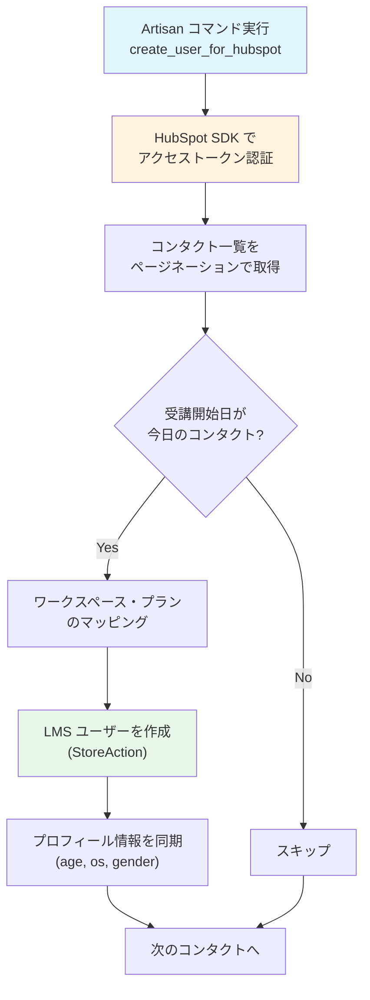
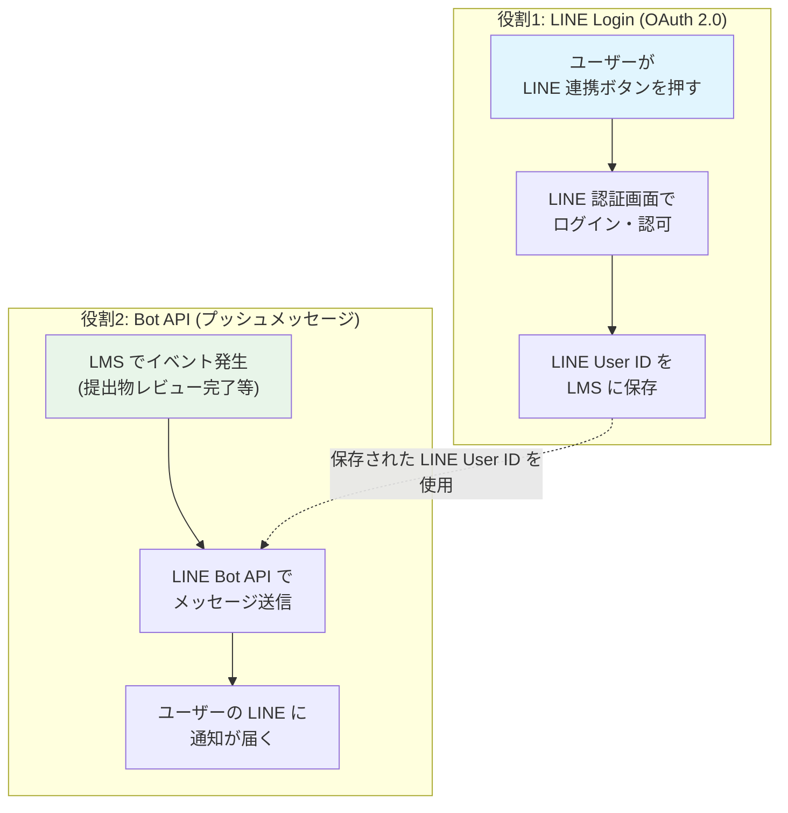
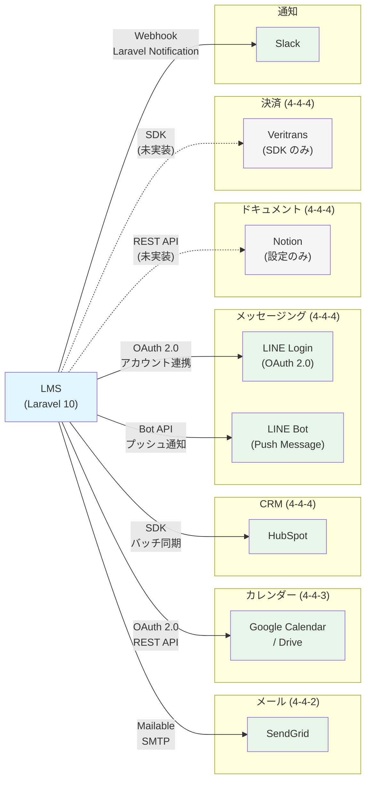

# 4-4-4 HubSpot・LINE・Notion・Veritrans

📝 **前提知識**: このセクションはセクション 4-4-1（外部 API 連携の共通パターン）の内容を前提としています。

## 🎯 このセクションで学ぶこと

- **HubSpot CRM 連携** のバッチコマンドによるコンタクト同期の仕組みを理解する
- **LINE 連携** の2つの役割（LINE Login OAuth によるアカウント連携と Bot API によるプッシュメッセージ）を理解する
- **Notion API** の設定構造と現時点での利用状況を把握する
- **Veritrans 決済** の SDK 構成と、将来の連携に共通パターンをどう適用するかを理解する
- LMS と全外部サービスの関係を **全体マップ** として俯瞰する

このセクションでは、セクション 4-4-2（SendGrid）、4-4-3（Google Calendar）に続く残りの外部サービス連携を一気に学びます。各サービスの詳細な API 仕様には深入りせず、4-4-1 で学んだ共通パターン（Service 層への集約、config による認証情報管理、エラーハンドリング）がそれぞれどのように適用されているかに注目します。

---

## 導入: 多様な外部サービスをどう管理するか

LMS は学習管理システムとしての機能を提供するだけでなく、ビジネスの様々な場面で外部サービスと連携しています。CRM（顧客管理）では HubSpot、メッセージングでは LINE、ドキュメント管理では Notion、決済では Veritrans と、それぞれ異なるドメインのサービスが関わっています。

これらのサービスは API の設計思想も認証方式も異なります。HubSpot は SDK ベースのアクセストークン認証、LINE は OAuth 2.0 とチャネルアクセストークンの2種類、Notion は API トークン認証、Veritrans は独自の決済プロトコルです。サービスごとにバラバラの実装をしてしまうと、コードの見通しが悪くなり、メンテナンスコストが増大します。

だからこそ、4-4-1 で学んだ共通パターンが重要になります。認証情報は `config()` で一元管理する、外部 API 呼び出しは Service 層に集約する、エラーは適切にハンドリングする。この原則を守ることで、サービスの数が増えても統一的な構造を維持できます。

### 🧠 先輩エンジニアはこう考える

> LMS の開発をしていると「次は LINE 連携を追加して」「HubSpot からユーザーを自動作成したい」と、外部サービスの連携要件がどんどん増えていきます。そのたびにゼロから設計し直すのは非効率なので、最初に共通のパターンを決めておくことが本当に大事です。認証情報の管理方法、API クライアントの配置場所、エラー時の挙動。これらが統一されていれば、新しいサービスを追加するときも「前と同じパターンで Service クラスを作る」で済みます。逆にパターンがバラバラだと、担当者が変わるたびに「この連携どうなってるの？」と調査から始めることになります。

---

## HubSpot CRM 連携

### HubSpot とは

**HubSpot** は CRM（Customer Relationship Management）プラットフォームで、顧客情報の管理、営業パイプラインの追跡、マーケティングの自動化などを提供するサービスです。LMS では、HubSpot に登録された受講生のコンタクト情報をもとに、LMS ユーザーを自動作成する連携を行っています。

### バッチコマンドによるユーザー同期

SendGrid や Google Calendar の連携がリアルタイムの API 呼び出し（ユーザー操作をトリガーに即座に API を叩く）であるのに対し、HubSpot 連携は **バッチ処理**（定期実行）によるデータ同期です。この違いは連携の性質によるものです。

- **リアルタイム連携**: ユーザーがメールを送信する、カレンダーに予定を追加するなど、即時性が求められる場面
- **バッチ連携**: 日次でデータを同期する、一括でレコードを更新するなど、即時性よりもデータの整合性が重要な場面

LMS の HubSpot 連携は **Artisan コマンド** として実装されており、Laravel のタスクスケジューラで毎日定時に実行されます。

```php
// backend/app/Console/Kernel.php（抜粋）
$this->windowDailyAt($schedule, 'create_user_for_hubspot', '06:00', ['production']);
```

本番環境で毎朝 6:00 に `create_user_for_hubspot` コマンドが実行され、HubSpot のコンタクト情報から LMS ユーザーが自動作成されます。

### コマンドの処理フロー

以下は `CreateUserForHubspot` コマンドの処理フローです。



以下はコマンドの主要部分の抜粋です。

```php
// backend/app/Console/Commands/User/CreateUserForHubspot.php
class CreateUserForHubspot extends Command
{
    protected $signature = 'create_user_for_hubspot';
    protected $description = 'Hubspotの受講開始日当日にLMSユーザを作成';

    public function handle()
    {
        $token = config('app.hubspot_access_token');
        $creationDate = Carbon::now()->format('Y-m-d');

        // HubSpot PHP SDK でクライアントを初期化
        $hubspot = Factory::createWithAccessToken($token);

        // コンタクトをページネーションで全件取得
        $contacts = $hubspot->crm()->contacts()->basicApi()->getPage(
            $limit, null, $properties
        );

        foreach ($result as $contact) {
            DB::beginTransaction();
            try {
                $properties = $contact['properties'];
                // 受講開始日が今日のコンタクトのみ処理
                if ($properties['start_course'] == $creationDate) {
                    $this->createUser($properties);
                }
                DB::commit();
            } catch (Throwable $e) {
                DB::rollBack();
                Log::error($message);
                Slack::slackChannel('#03_develop_notification')->send($message);
            }
        }
    }
}
```

### 共通パターンとの対応

4-4-1 で学んだ共通パターンがどう適用されているか確認しましょう。

| 共通パターン | HubSpot 連携での適用 |
|---|---|
| **認証情報の config 管理** | `config('app.hubspot_access_token')` で環境変数から取得 |
| **Service 層への集約** | Artisan コマンドに直接実装（SDK が Service 層の役割を担う） |
| **エラーハンドリング** | `try/catch` + `DB::rollBack()` + Slack 通知でエラーを可視化 |
| **レート制限への対応** | HubSpot の制限（10秒あたり100リクエスト）に合わせて `$requestLimit = 100` を設定 |

💡 HubSpot 連携では SDK（`HubSpot\Factory`）が API クライアントの役割を担っているため、独自の Service クラスを作る代わりに SDK を直接使用しています。SDK が提供する `basicApi()->getPage()` のようなメソッドで、HTTP リクエストの詳細を意識せずにデータを取得できます。

### コースプランのマッピング

HubSpot と LMS ではコースプランの名称が異なるため、**マッピング定数** で変換しています。

```php
// backend/app/Console/Commands/User/CreateUserForHubspot.php
public const WORKSPACE_COURSE_CONFIG_LIST = [
    'COACHTECH' => [
        'plans' => [
            [
                'hubspot_name' => 'フリーランスコース（3ヶ月）',
                'lms_name' => '3ヶ月コース'
            ],
            [
                'hubspot_name' => 'フリーランスコース（6ヶ月）',
                'lms_name' => '6ヶ月コース'
            ],
            // ... 他のプラン
        ],
        'hubspot_course_property' => 'course',
    ],
    'マジデザ' => [
        'plans' => [
            // マジデザ用のプランマッピング
        ],
        'hubspot_course_property' => 'course_mazidesign',
    ]
];
```

このマッピングにより、HubSpot 側の「フリーランスコース（3ヶ月）」を LMS 側の「3ヶ月コース」に自動変換してユーザーを作成できます。ワークスペース（COACHTECH、マジデザ）ごとにプラン名や HubSpot のプロパティ名が異なるため、それぞれのマッピングを定義しています。

⚠️ **注意**: マッピング定数はコード内にハードコードされています。HubSpot 側でコースプラン名を変更した場合、このコードも同時に更新しないとユーザー作成に失敗します。

---

## LINE 連携

### 2つの役割

LMS の LINE 連携には、明確に異なる **2つの役割** があります。



| 役割 | 目的 | 使用 API | 認証方式 |
|---|---|---|---|
| **LINE Login** | LMS アカウントと LINE アカウントを紐づける | LINE Login OAuth 2.0 | クライアント ID + シークレット |
| **Bot API** | LMS からユーザーにメッセージを送信する | LINE Messaging API | チャネルアクセストークン |

この2つは別々の LINE サービス（LINE Login と LINE Official Account / Messaging API）を利用しており、認証情報も異なります。しかし、LMS ではこれらを1つの `LineService` クラスにまとめて管理しています。

### LINE Login: OAuth 2.0 によるアカウント連携

LINE Login は OAuth 2.0 プロトコルに基づいたログイン機能です。セクション 4-4-3 で学んだ Google Calendar の OAuth フローと同じ仕組みですが、LINE Login の場合は「LMS ユーザーと LINE アカウントを紐づける」ことが主目的です。

💡 `LineService` は `Illuminate\Console\Command` を継承しています。これは歴史的な経緯によるもので、Service クラスとしては通常の設計ではありません。実際の LINE API 呼び出し機能には影響しないため、ここでは API 連携パターンに注目します。

```php
// backend/app/Services/Line/LineService.php
class LineService extends Command
{
    // ... プロパティ・コンストラクタ省略

    public function getAuthorizeLink(string $actorId, string $actorType, string $redirectPath)
    {
        $uri = 'https://access.line.me/oauth2/v2.1/authorize';
        $query = http_build_query([
            'response_type' => 'code',
            'client_id' => config('app.line_login_client_id'),
            'redirect_uri' => config('app.app_url') . '/api/line/callback',
            'state' => json_encode([
                'service' => 'coachtech_lms_line_login',
                'actor_id' => $actorId,
                'actor_type' => $actorType,
                'redirect_path' => $redirectPath,
            ]),
            'scope' => 'profile openid',
        ]);
        return $uri . '?' . $query;
    }
}
```

OAuth フローの各ステップを整理します。

**Step 1: 認可 URL の生成**(`getAuthorizeLink`)

ユーザーが LINE 連携ボタンを押すと、LINE の認可画面に遷移するための URL を生成します。`state` パラメータに `actor_id`（ユーザー ID）や `actor_type`（ユーザー種別）を JSON で埋め込み、コールバック時にどのユーザーの連携かを識別できるようにしています。

**Step 2: アクセストークンの取得**(`getAccessToken`)

LINE 認可画面でユーザーが許可すると、LMS のコールバック URL に認可コードが返されます。そのコードを LINE のトークンエンドポイントに送信してアクセストークンを取得します。

```php
// backend/app/Services/Line/LineService.php
public function getAccessToken(string $code)
{
    $client = new Client();
    $response = $client->post('https://api.line.me/oauth2/v2.1/token', [
        'headers' => ['Content-Type' => 'application/x-www-form-urlencoded'],
        'form_params' => [
            'grant_type' => 'authorization_code',
            'code' => $code,
            'redirect_uri' => config('app.app_url') . '/api/line/callback',
            'client_id' => config('app.line_login_client_id'),
            'client_secret' => config('app.line_login_client_secret'),
        ]
    ]);
    $body = json_decode($response->getBody()->getContents());
    return $body->access_token;
}
```

**Step 3: プロフィール取得と LINE User ID の保存**(`getProfile`)

取得したアクセストークンを使って LINE のプロフィール API にアクセスし、LINE User ID を取得します。この ID が `LineUserId` モデルに保存され、以降のプッシュメッセージ送信に使われます。

```php
// backend/app/Models/LineUserId.php
class LineUserId extends Model
{
    use HasFactory, HasUlids;

    protected $fillable = ['actor_id', 'actor_type', 'line_user_id'];

    public function actor()
    {
        return $this->morphTo();
    }
}
```

🔑 **ポリモーフィックリレーション**: `LineUserId` は `actor_id` と `actor_type` による **ポリモーフィックリレーション** を持っています。これにより、`User`（受講生）と `Employee`（講師・管理者）のどちらも LINE アカウントと紐づけられます。

### Bot API: プッシュメッセージ

LINE Login でアカウント連携が完了すると、LMS から LINE にメッセージを送信できるようになります。

```php
// backend/app/Services/Line/LineService.php
public function pushTextMessage(string $userId, string $message)
{
    if (empty($userId)) {
        throw new Exception('LINE連携していません');
    }

    $client = new Client();
    $client->post('https://api.line.me/v2/bot/message/push', [
        'headers' => [
            'Content-Type' => 'application/json',
            'Authorization' => 'Bearer ' . config('app.line_channel_access_token'),
        ],
        'body' => json_encode([
            'to' => $userId,
            'messages' => [['type' => 'text', 'text' => $message]]
        ])
    ]);
}
```

ここで注目すべき点は、LINE Login の認証情報（`line_login_client_id` / `line_login_client_secret`）と Bot API の認証情報（`line_channel_access_token`）が **別物** であることです。LINE Login は OAuth 2.0 クライアントとしての認証、Bot API はチャネル（LINE 公式アカウント）としての認証です。

### 通知システムとの統合

セクション 4-3-2 で学んだ通知システムと LINE の関係を確認しましょう。LMS には `Notification` ユーティリティクラスがあり、Slack と LINE への通知を一括で処理します。

```php
// backend/app/Libs/Notification.php
public function notificationSlackAndLine(User | Employee $actor, string $message)
{
    if (config('app.env') !== 'production') {
        return;
    }

    try {
        if ($actor->slackNotificationToken) {
            $actor->notify(new SlackNotification($message));
        }
    } catch (\Throwable $th) {
        Log::error($th);
    }

    try {
        if ($actor->lineUserId) {
            $lineService = new LineService;
            $message = $message . "\n" . "※このメッセージには返信できません。LMSにてご確認ください。";
            $lineService->pushTextMessage($actor->lineUserId->line_user_id, $message);
        }
    } catch (\Throwable $th) {
        Log::error($th);
    }
}
```

この実装から読み取れる設計判断が3つあります。

1. **本番環境でのみ通知**: `config('app.env') !== 'production'` で開発・ステージング環境での誤送信を防止しています
2. **Slack と LINE を独立して処理**: それぞれ別の `try/catch` で囲むことで、一方の送信失敗がもう一方に影響しないようにしています
3. **LINE は Laravel Notification を使わない**: Slack は `$actor->notify()` で Laravel の通知システムを利用していますが、LINE は `LineService` を直接呼び出しています。これは LINE Messaging API が Laravel Notification の標準チャネルに含まれないためです

💡 LINE メッセージの末尾に「※このメッセージには返信できません。LMSにてご確認ください。」という案内文が自動的に追加されます。Bot API のプッシュメッセージは一方通行で、ユーザーからの返信を受け取る仕組みは実装されていないためです。

### LineController と UseCase パターン

LINE 連携の Controller は、セクション 4-1-2 で学んだ UseCase パターンに従っています。

```php
// backend/app/Http/Controllers/LineController.php
class LineController extends Controller
{
    public function getOAuthLink(GetOAuthLinkRequest $request, GetOAuthLinkAction $action)
    {
        $url = $action($request->validated('guard_type'), $request->validated('redirect_path'));
        return response()->json($url);
    }

    public function callback(CallbackRequest $request, CallbackAction $action)
    {
        return redirect($action($request->validated('code'), $request->validated('state')));
    }

    public function disconnectLine(DisconnectLineRequest $request, DisconnectLineAction $action)
    {
        $action($request->validated('guard_type'));
        return response()->json(null, 204);
    }
}
```

各エンドポイントの責務がはっきりしています。

| メソッド | 役割 | UseCase |
|---|---|---|
| `getOAuthLink` | LINE 認可 URL を生成して返す | `GetOAuthLinkAction` |
| `callback` | OAuth コールバックを処理し LINE User ID を保存 | `CallbackAction` |
| `disconnectLine` | LINE 連携を解除 | `DisconnectLineAction` |

Controller はリクエストのバリデーションとレスポンスの返却だけを担い、ビジネスロジックは UseCase に委譲しています。この構造は LMS 全体で一貫しており、外部サービス連携でも同じパターンが守られています。

---

## Notion 連携

### 設定のみの状態

LMS のコードベースには Notion API の設定ファイルが存在します。

```php
// backend/config/notion.php
return [
    'token' => env('NOTION_API_TOKEN'),
    'database' => env('NOTION_DATABASE_ID'),
];
```

しかし、現時点ではこの設定を利用する Service クラスや Controller は実装されていません。`config/notion.php` にトークンとデータベース ID の設定だけが用意されている状態です。

### Notion API の連携パターン

Notion API は REST API ベースで、API トークン認証（Internal Integration Token）を使用します。もし将来 Notion 連携を実装する場合、4-4-1 の共通パターンに従って以下のような構造になるでしょう。

| 共通パターン | Notion での適用（想定） |
|---|---|
| **認証情報の config 管理** | `config('notion.token')` で API トークンを取得（設定済み） |
| **Service 層への集約** | `NotionService` クラスを作成し、ページ取得・作成等の API 操作をメソッド化 |
| **エラーハンドリング** | API レスポンスのステータスコード確認、レート制限（3リクエスト/秒）への対応 |

💡 設定ファイルだけ先に作成しておくのは、外部サービス連携の準備としてよくあるパターンです。環境変数の設計を先に決めておけば、実装時にスムーズに着手できます。

---

## Veritrans 決済

### SDK の配置

LMS のコードベースには、Veritrans の決済 SDK（`veritrans-tgmdk`）が **ローカルパッケージ** として配置されています。

```
backend/local_packages/veritrans-tgmdk/
└── src/tgMdk/dto/
    ├── CardAuthorizeRequestDto.php
    ├── CardAuthorizeResponseDto.php
    ├── CardCaptureRequestDto.php
    └── ... (多数の DTO クラス)
```

SDK にはクレジットカード決済、銀行振込（Virtual Account）、キャリア決済などの DTO（Data Transfer Object）が含まれていますが、現時点では **LMS のアプリケーションコード（`app/` 配下）からこの SDK を呼び出している箇所はありません**。

### 将来の連携に共通パターンをどう適用するか

Veritrans 決済を実装する場合、4-4-1 の共通パターンは以下のように適用できます。

| 共通パターン | Veritrans での適用（想定） |
|---|---|
| **認証情報の config 管理** | `config('services.veritrans.merchant_id')` 等でマーチャント情報を管理 |
| **Service 層への集約** | `VeritransService` クラスに決済の開始・確認・キャンセル等のメソッドを集約 |
| **エラーハンドリング** | 決済失敗時のリトライ、タイムアウト、二重課金防止のための冪等性確保 |
| **ログ** | 決済トランザクションの全操作をログに記録（監査証跡） |

⚠️ **注意**: 決済連携は他の外部サービスと比べて特に慎重な設計が必要です。金銭が絡むため、エラー時の挙動（途中で失敗した場合に課金されるのかされないのか）、テスト環境と本番環境の完全な分離、PCI DSS（クレジットカード情報のセキュリティ基準）への準拠など、技術的な考慮事項が多くなります。

---

## 外部連携の全体マップ

ここまで Chapter 4-4 で学んできた外部サービスの全体像を Mermaid 図で俯瞰しましょう。



各サービスの連携方式を一覧で整理します。

| サービス | 連携方式 | 実行タイミング | 実装状態 |
|---|---|---|---|
| **SendGrid** | Mailable + SMTP ドライバー | リアルタイム（ユーザー操作トリガー） | 実装済み |
| **Google Calendar** | OAuth 2.0 + REST API | リアルタイム（予約作成時） | 実装済み |
| **HubSpot** | SDK + アクセストークン | バッチ（毎朝 6:00） | 実装済み |
| **LINE Login** | OAuth 2.0 | ユーザー主導（連携ボタン押下時） | 実装済み |
| **LINE Bot** | Bot API + チャネルアクセストークン | イベント駆動（通知発生時） | 実装済み |
| **Slack** | Webhook + Laravel Notification | イベント駆動（通知発生時） | 実装済み |
| **Notion** | REST API + API トークン | 未定 | 設定のみ |
| **Veritrans** | SDK（tgMdk） | 未定 | SDK 配置のみ |

🔑 すべての実装済みサービスに共通しているのは、**認証情報を `config()` 経由で環境変数から取得** している点です。この一貫した管理方法により、環境ごとの切り替え（開発 / ステージング / 本番）が容易になっています。

---

## ✨ まとめ

- **HubSpot 連携** は Artisan コマンド + タスクスケジューラによるバッチ処理で、毎朝 HubSpot のコンタクトから LMS ユーザーを自動作成する。SDK ベースで HTTP リクエストの詳細を抽象化している
- **LINE 連携** は2つの役割を持つ。LINE Login（OAuth 2.0）でアカウントを紐づけ、Bot API（プッシュメッセージ）でユーザーに通知を送信する。認証情報もそれぞれ別物である
- **Notion** は `config/notion.php` に API トークンとデータベース ID の設定が用意されているが、現時点ではアプリケーションコードからの利用はない
- **Veritrans** は SDK がローカルパッケージとして配置されているが、アプリケーションコードへの組み込みは未実装。将来の連携時には 4-4-1 の共通パターン（Service 層への集約、config 管理、エラーハンドリング）を適用する
- すべての外部サービス連携に共通するのは、**認証情報の config 管理** と **エラーの適切なハンドリング** という 4-4-1 で学んだ共通パターンである

---

Chapter 4-4 では、外部 API 連携の共通パターンを学んだうえで、SendGrid によるメール送信、Google Calendar / Drive API との OAuth 連携、そして HubSpot・LINE・Notion・Veritrans の各サービスとの連携構造を見てきました。サービスごとに API の設計や認証方式は異なりますが、共通パターン（Service 層への集約、config による認証情報管理、エラーハンドリング）を守ることで、統一的な構造を維持できることが理解できたはずです。

Part 4 全体を振り返ると、Chapter 4-1 では Clean Architecture（UseCase / Repository / Service パターン）によるビジネスロジックの整理、Chapter 4-2 では Sanctum による API 認証と Swagger/OpenAPI による API ドキュメント、Chapter 4-3 では Observer / Event / Listener によるイベント駆動アーキテクチャと通知システム、そして Chapter 4-4 では外部サービス連携と学んできました。これらはすべて「Laravel アプリケーションを本番運用レベルで構築するための応用パターン」であり、LMS のバックエンドを支える設計思想です。

Part 5 では、このバックエンドアプリケーションが実際に動作する基盤であるインフラストラクチャに目を向けます。AWS 上の構成（ECS/CloudFront/ALB 等）がどのようにアプリケーションをホストしているか、Terraform によるインフラ管理でインフラをコードとしてどう定義するか、そして GitHub Actions による CI/CD パイプラインがコードの変更をどのように本番環境へ届けるかを学んでいきます。
