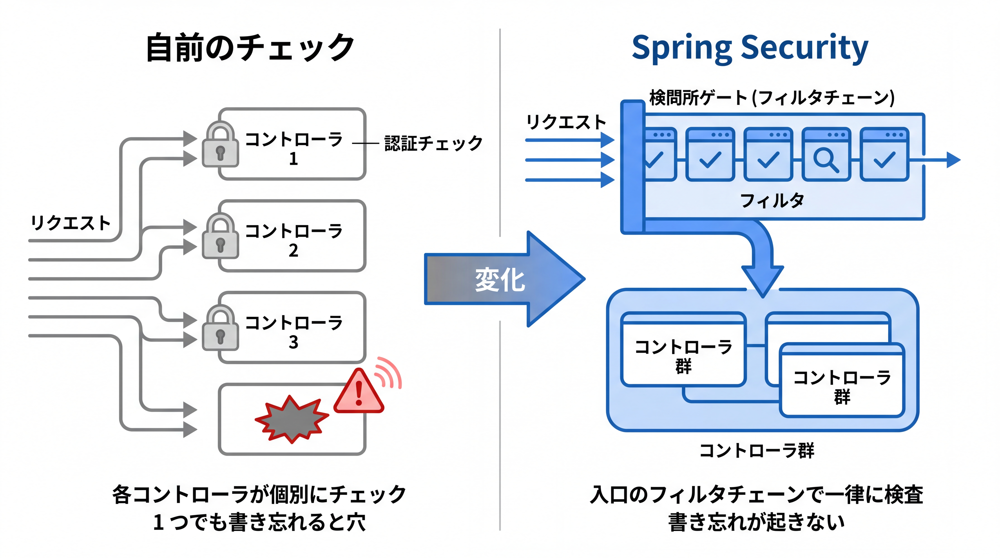
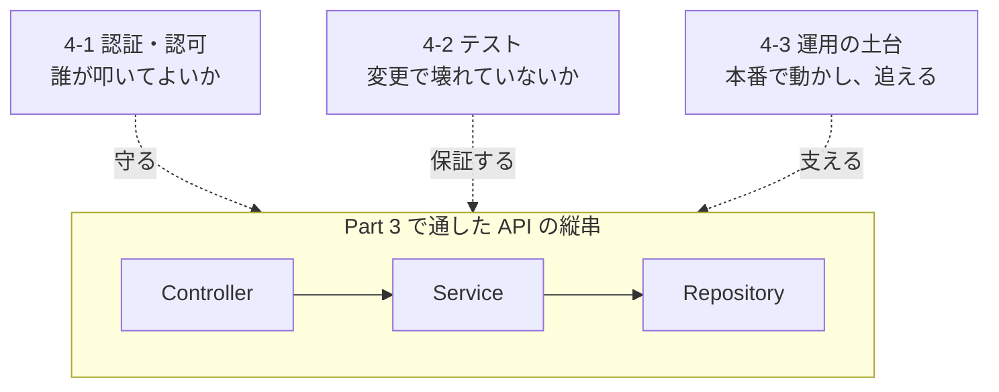
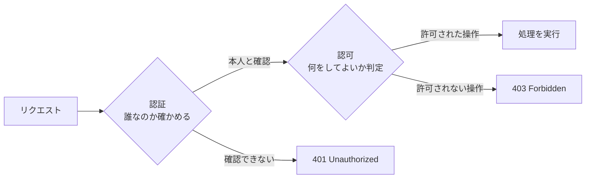
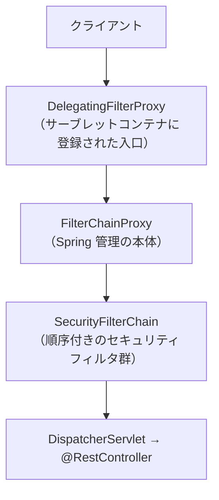

# 4-1-1 Spring Security の仕組み

Chapter 4-1 では、Spring Security を使って「誰がこの API を叩けるのか」を制御できるようになります。本セクションでまず Spring Security 全体の見取り図（認証・認可・フィルタチェーン・設定の入口・パスワード保管）を押さえ、次の 4-1-2 で具体的なログイン認証と JWT によるトークンベース認証へ進みます。

| セクション | テーマ | 種類 |
|---|---|---|
| 4-1-1 Spring Security の仕組み | フィルタチェーン・認証 / 認可・`SecurityFilterChain`・パスワードハッシュ | 概念 |
| 4-1-2 認証の実装と JWT 入門 | `UserDetails`・認証フロー・JWT（ステートレス認証） | 概念 |

📖 **この Chapter の進め方**: まず本セクションで、リクエストが Spring Security のフィルタチェーンをどう通り、認証と認可がどこで効くのか、その全体像をつかみます。次に 4-1-2 で、ユーザー情報を Spring Security につなぐ `UserDetails` と認証のフロー、そして画面を持たない API に向いた JWT によるステートレス認証へと進み、トークンベース認証の流れを説明できる状態を目指します。

📝 **前提知識**: このセクションは「3-3-1 リクエストを受けて返す」の内容を前提としています。

## 🎯 このセクションで学ぶこと

- 認証（誰なのか）と認可（何をしてよいか）の違いを説明できる
- リクエストが **フィルタチェーン** を通って検査される仕組みを理解し、Spring Security が何を守っているかを説明できる
- `SecurityFilterChain` を Bean として定義し、どのパスを誰に許すかを設定できる
- パスワードをハッシュ化して保管する理由と `PasswordEncoder` の役割を説明できる

本セクションでは、まず Part 4 全体の地図を確認したあと、認証と認可の違いから始め、フィルタチェーンの仕組み、`SecurityFilterChain` による設定、パスワードのハッシュ化へと進みます。

---

## 導入: 認証を自前で書くと、何が抜け落ちるか

Part 3 で、タスク管理 API の縦串が一通り通りました。ですが、いま作った API には大きな穴があります。**誰でも叩けてしまう** のです。`DELETE /api/tasks/1` は、ログインしていようがいまいが、URL を知っていれば誰でも実行できます。本番に出す前に、「ログインした人だけが」「自分のタスクだけを」操作できるように制御しなければなりません。

Laravel なら、ルートに `auth` ミドルウェアを 1 つ付け、ポリシーで「自分の資源か」を判定するだけでした。あの仕組みを、自前で書こうとしたらどうなるでしょうか。リクエストからトークンやセッションを取り出し、ユーザーを引き、パスワードを照合し、認証済みかどうかを各コントローラで確認し、権限を判定する。これを全エンドポイントに漏れなく適用し、さらにパスワードを安全に保管し、と考え始めると、本来のタスク管理の機能にたどり着く前に、セキュリティの作り込みで日が暮れます。しかも自前のセキュリティは、たった一箇所の抜けが重大な事故につながります。この領域を、実績のある仕組みごと引き受けてくれるのが **Spring Security** です。

### 🧠 先輩エンジニアの思考プロセス

> Laravel に来る前、私は最初の現場で認証を自前で書いていました。ログイン時にパスワードを照合し、セッションにユーザー ID を入れ、各コントローラの先頭で「ログイン済みか」を確認する。動いてはいましたが、ある日、確認の 1 行を書き忘れたエンドポイントが見つかり、ヒヤリとしました。全部のコントローラに同じ確認をコピペしていたのが、そもそもの間違いでした。

> Spring Security を使い始めて安心したのは、認証・認可が「各コントローラの仕事」ではなく「リクエストが必ず通る一本道（フィルタチェーン）の仕事」になっていたことです。入口で一律に検査するので、エンドポイントごとの書き忘れが原理的に起きません。Laravel のミドルウェアで `auth` を付けていたあの感覚が、Spring ではフレームワークの土台そのものに組み込まれていると感じました。最初はフィルタの多さに面食らいますが、「入口で守る」という発想さえ掴めば読み解けます。



---

## Part 4 の地図: 縦串に「品質」を備える

Part 4 は、Part 3 で通した API の縦串に、現場に出すための **品質** を備える Part です。動く API と、企業に通用する API の差は、おおむね次の 3 つに集約されます。



- **Chapter 4-1 認証と認可**: 「誰がこの API を叩けるのか」を制御します。Spring Security の仕組みを押さえ、ログイン認証と JWT によるトークンベース認証を扱います（本 Chapter）。
- **Chapter 4-2 テスト**: 「変更しても壊れていないか」を自動で確かめられるようにします。JUnit と Mockito による単体テスト、`MockMvc` や `@SpringBootTest` による Spring のテストを学びます。
- **Chapter 4-3 運用の土台**: 「本番で動かし、何が起きたか追える」状態にします。例外設計とログ、設定の外部化、Docker パッケージングを扱います。

🔑 これら 3 つは、Part 3 の機能とは別物の「飾り」ではありません。**認証がなければ公開できず**、**テストがなければ安心して変更できず**、**運用の土台がなければ本番で動かせない**。機能が「動く」ことと、現場で「使える」ことの差を埋めるのが Part 4 です。本セクションは、その最初の関門である認証・認可に取り組みます。

💡 **Laravel との対応**: Laravel では認証（Fortify / Sanctum）・認可（Gate / Policy）・テスト（PHPUnit）・ログ（Monolog）・環境設定（`.env`）・Docker（Sail）が、フレームワークや標準ツールとして最初から揃っていました。Part 4 で学ぶのは、それらに対応する Java / Spring の道具立てです。「やりたいこと」は Laravel 時代と同じで、「道具の名前と作法」が変わるだけだと捉えてください。

---

## 認証と認可: 「誰なのか」と「何をしてよいか」

セキュリティの話に入る前に、しばしば混同される 2 つの言葉をはっきり分けておきます。**認証** と **認可** です。

- **認証** （Authentication）は、**「あなたは誰か」を確かめる** ことです。ユーザー名とパスワードが正しいかを検証し、「確かにこのユーザー本人だ」と確定させます。ログインがまさに認証です。
- **認可** （Authorization）は、**「あなたは何をしてよいか」を判定する** ことです。認証で身元が分かったうえで、「このユーザーはこの操作を許されているか」を確認します。「管理者だけが削除できる」「自分のタスクだけ編集できる」が認可です。

順序が大事です。**まず認証で身元を確定し、その後で認可で権限を判定** します。身元が分からなければ、何を許してよいかも決められません。



この 2 つは、返すべき HTTP ステータスも違います。認証に失敗した（誰だか分からない）なら **401 Unauthorized**、認証は済んだが権限がない（誰かは分かるが許されていない）なら **403 Forbidden** です。3-3-1 で学んだステータスコードの設計が、ここでも効いてきます。

💡 **Laravel との対応**: Laravel の `auth` ミドルウェアが担っていたのが認証、`Gate` / `Policy` による `authorize()` が担っていたのが認可です。`can('update', $task)` で「このユーザーはこのタスクを更新してよいか」を判定していたあの仕組みが、認可にあたります。Spring Security でも、この 2 つは別々の段階として扱われます。

---

## リクエストはフィルタチェーンを通る

では Spring Security は、この認証・認可をどこで行うのでしょうか。答えは **フィルタチェーン** です。これが Spring Security の心臓部であり、最初に押さえるべき全体像です。

Java の Web アプリケーションでは、リクエストがコントローラ（`@RestController` のメソッド）に届く前に、**フィルタ** （Servlet Filter）という関所をいくつも通過します。フィルタは「リクエストとレスポンスの通り道に挟まって、前処理・後処理を行う部品」です。Spring Security は、このフィルタの仕組みに乗って、認証・認可の検査を **コントローラに届く手前で一律に** 行います。

リクエストが Spring Security に入るまでの流れは、次のようになっています。



- **`DelegatingFilterProxy`**: サーブレットコンテナ（Tomcat）に登録された 1 つのフィルタで、処理を Spring 側の Bean へ橋渡しします。コンテナの世界と Spring の世界の継ぎ目です。
- **`FilterChainProxy`**: Spring が管理する Spring Security の本体です。リクエストに対して、用意された `SecurityFilterChain` の中から **最初に一致したもの** を選び、そのフィルタ列にリクエストを通します。
- **`SecurityFilterChain`**: 認証・認可を担う **順序付きのフィルタの並び** です。リクエストはこの並びを上から順に通過し、すべてを通り抜けて初めてコントローラに届きます。

`SecurityFilterChain` の中には、役割の異なるフィルタが順番に並んでいます。代表的なものを、通過する順に挙げます。

| フィルタ（抜粋） | 役割 |
|---|---|
| `SecurityContextHolderFilter` | 既存の認証情報（あれば）を読み込み、リクエストの間だけ保持する |
| `CsrfFilter` | CSRF トークンを検証する（API では無効化することが多い） |
| `UsernamePasswordAuthenticationFilter` | フォームログインの ID / パスワードを処理する（認証） |
| `BasicAuthenticationFilter` | HTTP Basic 認証を処理する（認証） |
| `ExceptionTranslationFilter` | 下流で起きた認証 / 認可の例外を捕まえ、401 / 403 やログイン誘導に変換する |
| `AuthorizationFilter` | 最後に位置し、「このリクエストを通してよいか」を判定する（認可） |

🔑 ここで押さえる要点は、**認証も認可も、コントローラに届く前にフィルタチェーンで完結する** ことです。だからこそ、あなたのコントローラのメソッドには認証チェックの `if` を書く必要がありません。導入で触れた「全コントローラに確認をコピペして 1 つ書き忘れる」事故は、検査を入口の一本道に集約することで構造的に防がれます。認証を担うフィルタが前方に、認可を担う `AuthorizationFilter` が最後に置かれているのも、「先に身元を確かめ、後で権限を判定する」という順序の現れです。

💡 **Laravel との対応**: フィルタチェーンは、Laravel の **ミドルウェアのパイプライン** に対応します。リクエストがコントローラに届く前に、登録されたミドルウェアを順に通過していったあの仕組みです。Laravel で `auth` ミドルウェアがリクエストを横で検査していたように、Spring Security のフィルタがリクエストを検査します。違いは、Spring Security が認証・認可に特化した多数のフィルタを 1 本のチェーンとしてあらかじめ組み上げてくれる点です。

なお、`spring-boot-starter-security` を依存に追加すると、Spring Boot のオートコンフィギュレーション（3-1-1）が **既定のセキュリティ設定を自動で当てます**。具体的には、すべてのエンドポイントが認証必須になり、起動時にランダムなパスワードがログに出力される、という状態になります。「依存を入れただけで全部ロックされた」のは、このオートコンフィギュレーションの働きです。ここから先は、その既定を自分の要件に合わせて上書きしていくことになります。

---

## SecurityFilterChain で「何を・どう守るか」を設定する

フィルタチェーンの中身（どのパスを誰に許すか、どの認証方式を使うか）は、`SecurityFilterChain` を **Bean として定義** することで設定します。3-2-1 で学んだ「`@Bean` でコンテナに部品を登録する」が、ここでそのまま使われます。

最小の設定クラスを見てみましょう。

```java
// SecurityConfig.java
package com.example.taskapp.config;

import org.springframework.context.annotation.Bean;
import org.springframework.context.annotation.Configuration;
import org.springframework.security.config.Customizer;
import org.springframework.security.config.annotation.web.builders.HttpSecurity;
import org.springframework.security.config.annotation.web.configuration.EnableWebSecurity;
import org.springframework.security.web.SecurityFilterChain;

@Configuration
@EnableWebSecurity
public class SecurityConfig {

    @Bean
    public SecurityFilterChain filterChain(HttpSecurity http) throws Exception {
        http
            .authorizeHttpRequests(auth -> auth
                .requestMatchers("/api/auth/**").permitAll()   // ログインなどは誰でも
                .anyRequest().authenticated()                  // それ以外は認証必須
            )
            .httpBasic(Customizer.withDefaults());             // 認証方式（ここでは HTTP Basic）
        return http.build();
    }
}
```

このコードを読み解きます。

- **`HttpSecurity http`**: フィルタチェーンの設定を組み立てるためのビルダーです。メソッドを呼び出して「何を・どう守るか」を宣言し、最後に `http.build()` で `SecurityFilterChain` を生成します。
- **`authorizeHttpRequests(...)`**: 認可のルール、つまり「どのパスを誰に許すか」を定義します。`requestMatchers("/api/auth/**").permitAll()` は「`/api/auth/` 以下は認証なしで通す」、`anyRequest().authenticated()` は「それ以外のすべてのリクエストは認証を要求する」という意味です。ルールは上から順に評価されます。
- **`httpBasic(Customizer.withDefaults())`**: 認証方式として HTTP Basic を有効にします（4-1-2 では、これを JWT に置き換えます）。

ラムダ（`auth -> ...`、2-4-3）でルールを囲むこの書き方を、Spring Security では **Lambda DSL** と呼びます。`permitAll()` のほかに `.hasRole("ADMIN")`（特定のロールを持つ人だけ）、`.denyAll()`（全拒否）など、認可の終端メソッドが用意されています。

> 💡 **古い記事との大きな違い（Spring Security のバージョン）**: 本教材は Spring Boot 4.0.x が引き込む **Spring Security 7.0 系** を前提にしています。世の中には、`WebSecurityConfigurerAdapter` を継承して `configure(HttpSecurity)` をオーバーライドする 5.x 以前の書き方の記事が大量に残っていますが、このクラスは **6.0 で削除** され、7.0 には存在しません。現在は上記のように `SecurityFilterChain` を **Bean として定義** します。あわせて、7.0 では `authorizeRequests()` は `authorizeHttpRequests()` に、`antMatchers(...)` は `requestMatchers(...)` に置き換わり、引数なしの `.httpBasic()` のような書き方も廃止されて **`Customizer.withDefaults()` を渡す** 必要があります。古い記事を見たら、まずこの差分を疑ってください。

💡 **Laravel との対応**: `authorizeHttpRequests` で「このパスは認証必須、このパスは公開」と宣言するのは、Laravel でルートに `middleware('auth')` を付けたり、`routes/api.php` でルートグループごとにミドルウェアを振り分けたりしていたのに対応します。設定を 1 クラス（`SecurityConfig`）に集約できる点は、Laravel のルート定義やミドルウェア登録を 1 か所で見渡せたのと似た感覚です。

---

## パスワードは必ずハッシュ化して保管する

認証の話に欠かせないのが、**パスワードの保管** です。原則は明快で、**パスワードを平文（そのままの文字列）でデータベースに保存してはいけません**。万一データベースが漏洩したとき、平文のパスワードはそのまま悪用されてしまうからです。代わりに、元に戻せない形に変換した **ハッシュ値** を保存します。

Spring Security は、このハッシュ化を `PasswordEncoder` というインターフェースで担います。中心となるメソッドは 2 つです。

- **`encode(生パスワード)`**: 生のパスワードをハッシュ値に変換します。ユーザー登録時に使い、結果をデータベースに保存します。
- **`matches(生パスワード, 保存済みハッシュ)`**: ログイン時に、入力された生パスワードと保存済みのハッシュが一致するかを検証します。ハッシュは元に戻せないので、「入力をハッシュ化して突き合わせる」形で照合します。

推奨される実装は、`PasswordEncoderFactories.createDelegatingPasswordEncoder()` が返す **委譲（delegating）方式** のエンコーダです。Bean として登録しておきます。

```java
// SecurityConfig.java（パスワードエンコーダを追加）
import org.springframework.security.crypto.factory.PasswordEncoderFactories;
import org.springframework.security.crypto.password.PasswordEncoder;

@Bean
public PasswordEncoder passwordEncoder() {
    return PasswordEncoderFactories.createDelegatingPasswordEncoder();
}
```

この委譲方式には、覚えておくと役立つ特徴があります。保存されるハッシュが、`{bcrypt}$2a$10$...` のように **先頭にアルゴリズム名（`{bcrypt}`）が付いた形** になるのです。`matches` のときはこの接頭辞を見て、対応するアルゴリズムで照合します。これにより、将来ハッシュ方式を新しいものに移行しても、古い方式で保存済みのパスワードと混在したまま検証できます。既定では **bcrypt** （`BCryptPasswordEncoder`）でハッシュ化されます。

⚠️ **注意**: パスワードのハッシュ化（`encode`）は、ユーザー登録のときに **1 回だけ** 行い、結果を保存します。ログインのたびに `encode` し直して比較するのではありません。照合は必ず `matches(生パスワード, 保存済みハッシュ)` で行います。bcrypt はハッシュ化のたびに異なる salt を用いるため、同じパスワードでも `encode` の結果は毎回変わります。だから「もう一度 `encode` して文字列が一致するか」では照合できないのです。

💡 **Laravel との対応**: Laravel の `Hash::make($password)` が `PasswordEncoder.encode(...)` に、`Hash::check($input, $hashed)` が `passwordEncoder.matches(...)` に対応します。Laravel も既定で bcrypt を使っていたので、ハッシュ化の考え方はそのまま通用します。違いは、Spring Security のハッシュ値には `{bcrypt}` のようなアルゴリズム識別子が先頭に付き、複数方式の混在や移行に対応している点です。

---

## ✨ まとめ

- **認証** （誰なのか）と **認可** （何をしてよいか）は別の段階。まず認証で身元を確定し、その後に認可で権限を判定する。失敗時のステータスは認証エラーが 401、認可エラーが 403
- Spring Security は **フィルタチェーン** （`DelegatingFilterProxy` → `FilterChainProxy` → `SecurityFilterChain`）として動き、認証・認可をコントローラに届く手前で一律に検査する。だからコントローラに認証チェックを書かなくてよい（Laravel のミドルウェアに対応）
- `SecurityFilterChain` を **Bean として定義** し、`authorizeHttpRequests` でどのパスを誰に許すかを設定する。Spring Security 7.0 系では `WebSecurityConfigurerAdapter` は廃止済みで、`requestMatchers` / `Customizer.withDefaults()` を使う
- パスワードは平文で保存せず **`PasswordEncoder`** でハッシュ化する。委譲方式（`{bcrypt}` 接頭辞付き）が推奨。登録時に `encode`、ログイン時に `matches` で照合する（Laravel の `Hash::make` / `Hash::check` に対応）

---

次のセクションでは、ここで見た仕組みの上に、実際の認証を実装します。ユーザー情報を Spring Security につなぐ `UserDetails` と `UserDetailsService`、ログインから認証済みになるまでの認証フローを押さえたうえで、画面を持たない API に向いた **JWT によるステートレス認証** の考え方に入ります。セッションを使う認証と JWT の違いを理解し、トークンベース認証の流れ（ログインでトークンを発行し、以降のリクエストでそれを検証する）を説明できるようになります。
