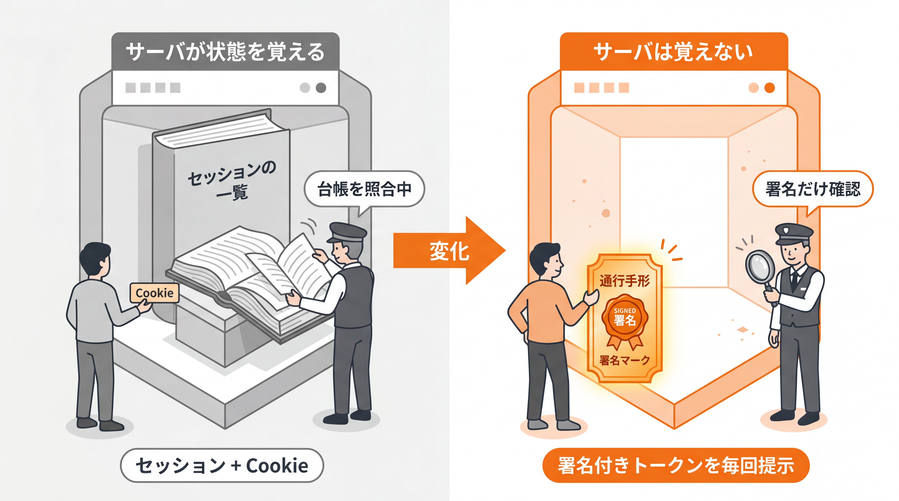
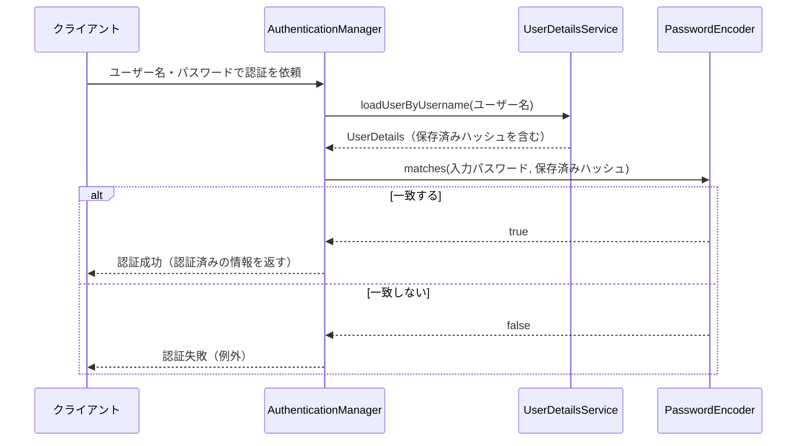
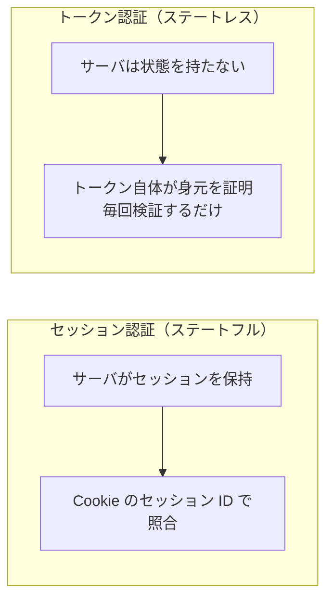
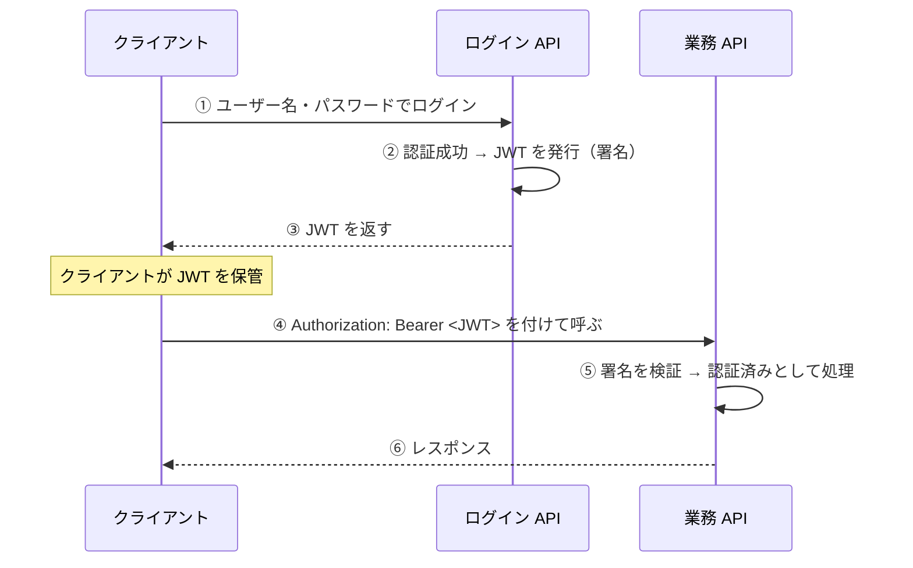

# 4-1-2 認証の実装と JWT 入門

📝 **前提知識**: このセクションは「4-1-1 Spring Security の仕組み」の内容を前提としています。

## 🎯 このセクションで学ぶこと

- `UserDetails` と `UserDetailsService` で、自前のユーザー情報を Spring Security につなげることを理解する
- ログインから認証済みになるまでの認証フロー（`UserDetailsService` でユーザーを引き、`PasswordEncoder` で照合する）を説明できる
- セッションを使う認証と **JWT によるステートレス認証** の違いを説明できる
- JWT の構造と、発行・検証の流れ（ログインでトークンを発行し、以降のリクエストで検証する）を説明できる

本セクションでは、ユーザー情報を Spring Security につなぐ仕組みから始め、認証のフロー、ステートレス認証という考え方、JWT の構造、そして Spring での JWT 発行・検証へと進みます。

---

## 導入: 画面のない API で、ログイン状態をどう持ち回るか

4-1-1 で、Spring Security がフィルタチェーンで認証・認可を行うこと、パスワードはハッシュ化して保管することを押さえました。残る問いは 2 つです。1 つは「Spring Security は、どこからユーザー情報を取ってくるのか」。あなたのアプリには `users` テーブルがあり、独自の `User` エンティティがあります。これを Spring Security に教えてあげる必要があります。

もう 1 つは「一度ログインしたユーザーを、次のリクエストでどう思い出すのか」です。Laravel の Web 画面では、ログインするとサーバがセッションを作り、ブラウザがセッション Cookie を送り返すことで「ログイン中」が維持されました。ですが、本教材が作るのは画面を持たない **REST API** です。スマホアプリや別のフロントエンドから叩かれることを想定すると、サーバ側にセッションを抱える方式は相性が悪くなります。そこで登場するのが **JWT** （JSON Web Token）です。本セクションでは、ユーザー情報の接続と、JWT によるステートレスなログイン状態の持ち回りを学びます。

### 🧠 先輩エンジニアの思考プロセス

> Laravel で Web アプリを作っていたころは、セッション認証で何も困りませんでした。ログインすればセッションができ、Cookie が勝手に運ばれ、`Auth::user()` で現在のユーザーが取れる。意識すらしていませんでした。風向きが変わったのは、SPA とスマホアプリから同じ API を叩く案件です。Cookie 前提の認証がうまく噛み合わず、そこで初めて Sanctum のトークンや JWT を真剣に調べました。

> Java の現場でも事情は同じで、API はトークンベースのステートレス認証で組むことがほとんどです。最初は「サーバが状態を持たないのに、どうやってログインを覚えるのか」が腑に落ちませんでした。答えは「サーバが覚えない。トークン自体が身元の証明を持ち歩く」でした。この発想の転換さえできれば、JWT は怖くありません。署名付きの通行手形を毎回見せる、それだけのことです。



---

## ユーザー情報を Spring Security につなぐ: UserDetails

Spring Security は、認証のときに「ユーザー名からユーザー情報を引く」処理を、`UserDetailsService` というインターフェース 1 つに集約しています。あなたがやることは、このインターフェースを実装して「ユーザー名を受け取ったら、自分の `users` テーブルから引いて返す」だけです。

まず、3-4-1 で最小構成にとどめていた `User` エンティティに、認証で使う **パスワード** フィールドを加えます（3-4-1 で「パスワードは Part 4 の領域」と予告したものです）。

```java
// User.java（パスワードを追加）
package com.example.taskapp.entity;

import jakarta.persistence.*;

@Entity
@Table(name = "users")
public class User {

    @Id
    @GeneratedValue(strategy = GenerationType.IDENTITY)
    private Long id;

    @Column(nullable = false, unique = true)
    private String username;

    @Column(nullable = false)
    private String email;

    @Column(nullable = false)
    private String password;   // ハッシュ化済みのパスワードを保存（{bcrypt}...）

    protected User() {
    }

    // getter / setter は省略
}
```

`password` には、4-1-1 の `PasswordEncoder.encode(...)` でハッシュ化した文字列（`{bcrypt}...`）を保存します。平文は決して入れません。

次に、ユーザー名からこの `User` を引く Repository のメソッドを用意します。3-4-2 で学んだ **派生クエリ** がそのまま使えます。

```java
// UserRepository.java
package com.example.taskapp.repository;

import com.example.taskapp.entity.User;
import org.springframework.data.jpa.repository.JpaRepository;
import java.util.Optional;

public interface UserRepository extends JpaRepository<User, Long> {
    Optional<User> findByUsername(String username);   // 派生クエリ（3-4-2）
}
```

そして `UserDetailsService` を実装します。`loadUserByUsername` で `User` を引き、Spring Security が扱える `UserDetails` の形に変換して返します。

```java
// CustomUserDetailsService.java
package com.example.taskapp.security;

import com.example.taskapp.entity.User;
import com.example.taskapp.repository.UserRepository;
import org.springframework.security.core.userdetails.UserDetails;
import org.springframework.security.core.userdetails.UserDetailsService;
import org.springframework.security.core.userdetails.UsernameNotFoundException;
import org.springframework.stereotype.Service;

@Service
public class CustomUserDetailsService implements UserDetailsService {

    private final UserRepository userRepository;

    public CustomUserDetailsService(UserRepository userRepository) {
        this.userRepository = userRepository;
    }

    @Override
    public UserDetails loadUserByUsername(String username) {
        User user = userRepository.findByUsername(username)
                .orElseThrow(() -> new UsernameNotFoundException(username));

        // Spring Security 標準の User（UserDetails 実装）に詰め替えて返す
        return org.springframework.security.core.userdetails.User
                .withUsername(user.getUsername())
                .password(user.getPassword())   // 保存済みのハッシュ
                .roles("USER")                   // 権限（ここでは一律 USER）
                .build();
    }
}
```

`UserDetails` は、Spring Security が認証に必要とするユーザー情報の **契約（インターフェース）** です。`getUsername()` / `getPassword()` / `getAuthorities()`（ロールなどの権限）といったメソッドを持ち、Spring Security はこの契約を通してユーザーを扱います。あなたの `User` エンティティをそのまま渡すのではなく、この契約の形に変換するのがポイントです。

⚠️ **注意（2 つの `User` に注意）**: 上のコードには `User` が 2 つ登場します。あなたのエンティティ `com.example.taskapp.entity.User` と、Spring Security 標準の `org.springframework.security.core.userdetails.User`（`UserDetails` の組み込み実装）です。名前が同じで紛らわしいので、ここでは標準の `User` を完全修飾名（フルパス）で書いて区別しています。「自前のエンティティを、Spring の `UserDetails` に詰め替えている」という役割の違いを意識してください。

💡 **Laravel との対応**: `UserDetails` は、Laravel の `User` モデルが実装していた `Authenticatable` インターフェースに対応します。`UserDetailsService.loadUserByUsername` は、Laravel の認証で「ユーザープロバイダがユーザー名（や ID）からユーザーを引く」処理にあたります。Laravel が規約で隠していた「どうユーザーを引くか」を、Spring では自分で 1 メソッドとして書く、という違いです。

---

## 認証のフロー: ログインから認証済みになるまで

役者が揃ったので、ログイン時に何が起きるかを追います。ユーザー名とパスワードを受け取り、認証済みと判定されるまでの流れです。



中心にいるのが **`AuthenticationManager`** です。「このユーザー名とパスワードを認証して」という依頼を受け取り、`UserDetailsService` でユーザーを引き、`PasswordEncoder.matches` で入力パスワードと保存済みハッシュを照合します。一致すれば「認証済み」の情報を返し、一致しなければ例外で失敗を知らせます。`UserDetailsService` と `PasswordEncoder` を Bean として用意しておけば、この照合の段取りは Spring Security が組み立ててくれます。あなたが書くのは「ユーザーをどう引くか」と「どのエンコーダを使うか」だけです。

認証に成功すると、その情報は **`SecurityContext`** という入れ物に格納され、リクエストの間そこに保持されます。コントローラやサービスからは `SecurityContextHolder.getContext().getAuthentication()` で「いま誰が認証済みか」を取り出せます（Part 5 で「自分のタスクだけ操作させる」認可に使います）。

---

## ステートレス認証という考え方: セッションと JWT

認証に成功したとして、その「ログイン中」という事実を、次のリクエストでどう引き継ぐのでしょうか。ここに 2 つの方式があります。

- **セッション認証（ステートフル）**: サーバがログイン状態を **自分で覚えます**。ログイン時にセッションを作ってサーバ側に保持し、クライアントには小さな識別子（セッション ID）を Cookie で渡します。以降のリクエストでその Cookie を見て、サーバが保持している状態と突き合わせます。Laravel の Web 認証がこれです。
- **トークン認証（ステートレス）**: サーバは状態を **覚えません**。代わりに、ログイン時に「あなたは確かに本人だ」という情報を詰めた **トークン** を発行してクライアントに渡します。以降のリクエストでは、クライアントがそのトークンを毎回送り、サーバはトークンの正しさを検証するだけで身元を判断します。



REST API でトークン認証が好まれるのは、サーバが状態を持たないため **スケールしやすい** からです。サーバを複数台に増やしても、どの台にリクエストが届いてもトークンを検証できれば認証できます。セッション方式だと、台ごとに別のセッションを持ってしまうため、共有の仕組みが要ります。

Spring Security では、`SessionCreationPolicy.STATELESS` を指定して「セッションを作らず・使わない」と宣言します。こうすると Spring Security はリクエスト間で認証情報を保持しなくなり、**すべてのリクエストが自分でトークンを持って認証を通す** ことになります。

💡 **Laravel との対応**: Laravel の標準的な Web 認証（セッション + Cookie）がステートフル、API 向けの Sanctum トークンや JWT がステートレスにあたります。SPA やスマホアプリ向けに API トークンを発行していたなら、その発想がそのまま JWT に通じます。「Cookie でセッションを照合する」から「トークンを毎回送って検証する」への切り替えだと捉えてください。

---

## JWT の構造と、発行・検証の流れ

**JWT** （JSON Web Token、「ジョット」と読みます）は、トークン認証で広く使われるトークンの形式です。`xxxxx.yyyyy.zzzzz` のように **ピリオドで区切られた 3 つの部分** からなります。

| 部分 | 名前 | 中身 |
|---|---|---|
| 1 つ目 | ヘッダー（Header） | 署名アルゴリズムなどのメタ情報 |
| 2 つ目 | ペイロード（Payload） | 主張（クレーム）。ユーザー名・有効期限など |
| 3 つ目 | 署名（Signature） | ヘッダーとペイロードを秘密鍵で署名した値 |

肝は **署名** です。サーバは秘密鍵を使ってヘッダーとペイロードに署名し、その署名を 3 つ目に付けます。受け取ったトークンを検証するときは、同じ秘密鍵で署名を再計算し、付いてきた署名と一致するかを確かめます。もし誰かがペイロード（たとえばユーザー名）を書き換えれば、署名が合わなくなって **改ざんが検知** されます。だからサーバは状態を持たなくても、「このトークンは自分が発行した本物だ」と確信できるのです。

⚠️ **注意**: ペイロードは署名されているだけで、**暗号化されてはいません**。Base64 でエンコードされているだけなので、誰でもデコードして中身を読めます。したがって、パスワードや個人情報のような秘密の値を JWT のペイロードに入れてはいけません。入れてよいのは、ユーザー名やユーザー ID のような「漏れても致命的でない、身元を示す情報」だけです。

ログインからリクエスト処理までの一連の流れは、次のようになります。



ログイン時に JWT を発行して渡し（①〜③）、以降のリクエストではクライアントが `Authorization: Bearer <JWT>` というヘッダーにトークンを載せて送り（④）、サーバは署名を検証して認証する（⑤）。この往復が、トークンベース認証の全体像です。

---

## Spring での JWT 発行と検証

最後に、この発行・検証を Spring でどう実現するかを、入門の範囲で見ます。Spring Security は JWT を扱う公式の仕組みを持っており、`spring-security-oauth2-jose`（発行・検証）と `spring-security-oauth2-resource-server`（受け取ったトークンの検証）を依存に加えると使えます。内部では Nimbus という JOSE ライブラリが動きます。

**発行・検証の鍵となる部品** を Bean として用意します。ここでは対称鍵（1 つの秘密鍵で署名・検証する HS256）の最小例です。

```java
// JwtConfig.java
package com.example.taskapp.config;

import javax.crypto.SecretKey;
import com.nimbusds.jose.jwk.source.ImmutableSecret;
import org.springframework.context.annotation.Bean;
import org.springframework.context.annotation.Configuration;
import org.springframework.security.oauth2.jose.jws.MacAlgorithm;
import org.springframework.security.oauth2.jwt.*;

@Configuration
public class JwtConfig {

    private final SecretKey secretKey; // 32 バイト以上の秘密鍵（設定から注入。4-3-2 で扱う）

    public JwtConfig(SecretKey secretKey) {
        this.secretKey = secretKey;
    }

    @Bean
    JwtEncoder jwtEncoder() {                       // トークンを発行する側
        return new NimbusJwtEncoder(new ImmutableSecret<>(secretKey));
    }

    @Bean
    JwtDecoder jwtDecoder() {                        // トークンを検証する側
        return NimbusJwtDecoder.withSecretKey(secretKey)
                .macAlgorithm(MacAlgorithm.HS256)
                .build();
    }
}
```

ログイン成功時、`JwtEncoder` で JWT を発行します。ペイロードに当たる **クレーム** を組み立てて署名します。

```java
// TokenService.java（発行の主要部分の抜粋）
import java.time.Instant;
import java.time.temporal.ChronoUnit;
import org.springframework.security.oauth2.jwt.*;
import org.springframework.stereotype.Service;

@Service
public class TokenService {

    private final JwtEncoder jwtEncoder;   // JwtConfig で定義した Bean を注入（3-2-1）

    public TokenService(JwtEncoder jwtEncoder) {
        this.jwtEncoder = jwtEncoder;
    }

    public String issueToken(String username) {
        Instant now = Instant.now();
        JwtClaimsSet claims = JwtClaimsSet.builder()
                .issuer("self")
                .subject(username)                        // 誰のトークンか
                .issuedAt(now)
                .expiresAt(now.plus(1, ChronoUnit.HOURS)) // 有効期限（ここでは 1 時間）
                .build();
        return jwtEncoder.encode(JwtEncoderParameters.from(claims)).getTokenValue();
    }
}
```

検証側は、4-1-1 で書いた `SecurityFilterChain` に **`oauth2ResourceServer`** を加えるだけです。これで、`Authorization: Bearer <JWT>` ヘッダーのトークンを自動で検証するフィルタがチェーンに入り、`JwtDecoder` が署名と有効期限を確かめてくれます。

```java
// SecurityConfig.java（4-1-1 の SecurityFilterChain に JWT 検証とステートレスを追加）
import org.springframework.security.config.http.SessionCreationPolicy;

@Bean
public SecurityFilterChain filterChain(HttpSecurity http) throws Exception {
    http
        .authorizeHttpRequests(auth -> auth
            .requestMatchers("/api/auth/**").permitAll()   // ログイン・登録は公開
            .anyRequest().authenticated()
        )
        .sessionManagement(s -> s.sessionCreationPolicy(SessionCreationPolicy.STATELESS))
        .csrf(csrf -> csrf.disable())                       // トークン認証では CSRF 保護は不要
        .oauth2ResourceServer(oauth2 -> oauth2.jwt(Customizer.withDefaults()));  // JWT を検証
    return http.build();
}
```

検証に成功すると、Spring Security はトークンの中身（`subject` のユーザー名など）から認証済みの情報を組み立て、`SecurityContext` に入れてくれます。あとは 4-1-1 で見たとおり、コントローラは認証チェックを書かずに「認証済みの前提」で処理できます。

🔑 ここまでの流れを通して押さえてほしいのは、コードの細部より **「発行 → 携行 → 検証」というサイクル** です。すなわち、発行（ログイン時に署名付きトークンを作って渡す）→ 携行（クライアントが `Bearer` ヘッダーで毎回送る）→ 検証（サーバが署名を確かめる）の往復です。このサイクルが、状態を持たないサーバでログイン状態を成立させる仕掛けそのものです。実際に手を動かして組むのは Part 5 のハンズオンで行います。

> 💡 **もう一つの選択肢（jjwt）**: JWT を扱うライブラリには、Spring に依存しない **jjwt** （`io.jsonwebtoken`、2026年6月時点で 0.13.0）もあり、現場でもよく見かけます。`Jwts.builder()...compact()` で発行、`Jwts.parser()...parseSignedClaims(token)` で検証と、API が直感的です。ただし jjwt を使う場合は、トークンを検証する処理を自前のフィルタとして書く必要があります。本教材では、`oauth2ResourceServer` にそのまま差し込める Spring 標準の道（Nimbus）を採ります。「jjwt + 自前フィルタ」の記事を見かけても、やっていること（発行・携行・検証）は同じだと捉えてください。

💡 **Laravel との対応**: Laravel の Sanctum で、ログイン時にトークンを発行し（`createToken`）、以降のリクエストで `Authorization: Bearer` ヘッダーに載せて送り、サーバが検証していた流れと、ほぼ同じです。Sanctum はトークンを DB に保存して照合する方式でしたが、JWT は署名で検証するため DB 参照すら要らない、という違いがあります（その代わり、発行後すぐに失効させるのが難しいので、有効期限を短くするのが定石です）。

---

## ✨ まとめ

- `UserDetailsService.loadUserByUsername` を実装し、自前の `User` エンティティを Spring Security 標準の `UserDetails` に詰め替えて返す。これでフレームワークがユーザー情報を扱えるようになる（Laravel の `Authenticatable` に対応）
- 認証は `AuthenticationManager` が中心になり、`UserDetailsService` でユーザーを引き、`PasswordEncoder.matches` でパスワードを照合する。成功すると認証情報は `SecurityContext` に保持される
- セッション認証（サーバが状態を持つ）に対し、JWT は **ステートレス** （サーバは状態を持たず、トークン自体が身元を証明）。API ではスケールしやすいトークン認証が好まれ、`SessionCreationPolicy.STATELESS` で宣言する
- JWT は ヘッダー・ペイロード・署名 の 3 部構成。**署名で改ざんを検知** する（ペイロードは暗号化されないので秘密情報は入れない）。発行 → `Bearer` ヘッダーで携行 → 検証 のサイクルで成り立つ。Spring では Nimbus（`JwtEncoder` / `JwtDecoder`）と `oauth2ResourceServer` で実現する

---

【Chapter 4-1 の振り返り】本章では、API を「誰でも叩ける」状態から「認証された人だけが叩ける」状態へ引き上げました。4-1-1 で、Spring Security が **フィルタチェーン** として認証・認可をコントローラの手前で一律に検査すること、`SecurityFilterChain` を Bean として設定すること、パスワードを `PasswordEncoder` でハッシュ化することを押さえました。4-1-2 では、その上に `UserDetailsService` で自前のユーザーを接続し、認証フローを追い、画面を持たない API に向く **JWT のステートレス認証** の発行・検証サイクルを掴みました。Laravel のミドルウェア・認証・Sanctum の経験が、Spring Security の各部品にそのまま橋渡しされたはずです。

次の Chapter 4-2 では、品質の 2 つ目の柱である **テスト** に入ります。認証付き API をここまで組んでくると、「変更しても壊れていないか」を手で確かめ続けるのは限界があります。最初のセクション 4-2-1 では、**JUnit（Jupiter）** によるテストの書き方と **アサーション** で結果を検証する方法、そして **Mockito** で依存をモックに差し替える方法を学び、Service の単体テストを書けるようになります。PHPUnit でテストを書いた経験が、そのまま土台になります。
