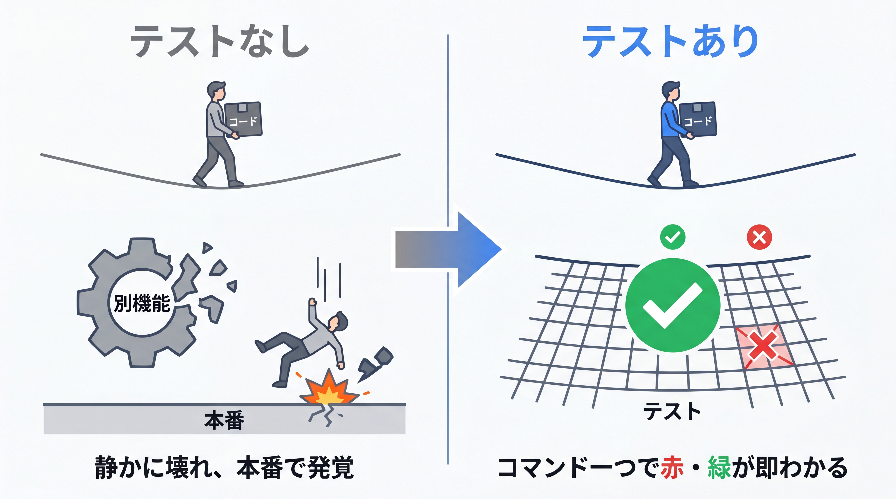
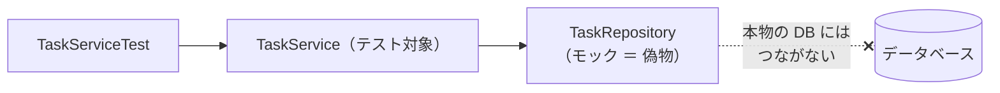

# 4-2-1 単体テスト

Chapter 4-2 では、書いた API が「変更しても壊れていないか」を自動で確かめられるようにします。本セクションで、Spring を起動しない純粋な単体テスト（JUnit と Mockito）を扱い、次の 4-2-2 で Spring の機能を含めて検証するテスト（Web 層・データ層・統合）へ進みます。

| セクション | テーマ | 種類 |
|---|---|---|
| 4-2-1 単体テスト | JUnit（Jupiter）・アサーション・Mockito によるモック | 概念 |
| 4-2-2 Spring のテスト | `@WebMvcTest` / `MockMvc`・`@DataJpaTest`・`@SpringBootTest` | 概念 |

📖 **この Chapter の進め方**: まず本セクションで、1 つのクラス（Service）を周囲から切り離して試す **単体テスト** を、JUnit でのテストの書き方・アサーション・Mockito によるモックの順に押さえます。次に 4-2-2 で、Spring が配線する部分まで含めて検証する **テストスライス** （`@WebMvcTest`・`@DataJpaTest`・`@SpringBootTest`）を学び、テスト対象の層に応じて適切なテストを選べるようになります。

📝 **前提知識**: このセクションは「3-2-2 レイヤードアーキテクチャ」の内容を前提としています。

## 🎯 このセクションで学ぶこと

- JUnit（Jupiter）でテストクラス・テストメソッドを書き、ライフサイクル（`@BeforeEach` など）を扱える
- アサーション（`assertEquals` / `assertThrows` や AssertJ の `assertThat`）で実行結果を検証できる
- Mockito で依存（Repository）をモックに差し替え、Service を周囲から切り離してテストできる

本セクションでは、単体テストとは何かから始め、JUnit でのテストの書き方、アサーションでの検証、Mockito によるモック、そして Service の単体テストの組み立てへと進みます。

---

## 導入: 「動くはず」を確かめるすべがない

ここまでで、認証付きのタスク管理 API がかなりの規模になってきました。Service にビジネスロジックが増え、エンドポイントも増えています。ここで、ある Service のメソッドに修正を入れたとします。あなたは、その修正が他のロジックを壊していないと、どうやって確信しますか。

手作業で確かめるなら、アプリを起動し、ログインし、API を順に叩いて、レスポンスを目で確認することになります。修正のたびにこれを全機能ぶん繰り返すのは、現実的ではありません。やがて「たぶん大丈夫だろう」で確認を省くようになり、いつの間にか別の機能が壊れている、という事態に陥ります。これを防ぐのが **自動テスト** です。テストコードを書いておけば、コマンド一つで「期待どおり動くか」を一瞬で・何度でも検証できます。あなたは Laravel で PHPUnit のテストを書いた経験があるので、「テストで振る舞いを保証する」価値そのものは既に知っているはずです。本 Chapter では、それを Java / Spring の道具立てで実現します。

### 🧠 先輩エンジニアの思考プロセス

> 私がテストの価値を本当に理解したのは、テストのない大きなコードベースを引き継いだときでした。少し直すたびに、どこかで別の機能が静かに壊れる。壊れたことに気づくのはたいてい本番で、ユーザーからの報告でした。怖くて、リファクタリングどころか小さな修正にすら及び腰になりました。

> テストを書く習慣がついてからは、修正に対する恐怖が消えました。直したらテストを走らせる。緑なら安心して次へ進める。赤なら、壊した場所がその場で分かる。Java に来て道具は PHPUnit から JUnit と Mockito に変わりましたが、「テストが変更を支える」感覚はまったく同じでした。むしろ静的型付けのおかげで、テストが通る前にコンパイラが多くの間違いを止めてくれる分、安心感は増したくらいです。



---

## 単体テストとは: 1 つの部品を切り離して試す

テストにはいくつかの種類がありますが、本セクションで扱うのは **単体テスト** （ユニットテスト）です。単体テストとは、**1 つの部品（多くはクラス）を、周囲から切り離して単独で試す** テストです。

3-2-2 で、アプリを Controller / Service / Repository の 3 層に分けました。このうち Service には、業務上のルール（ビジネスロジック）が集まっています。単体テストの主役はここです。「期限切れのタスクだけ抽出する」「存在しない ID なら例外を投げる」といったロジックが、入力に対して正しい結果を返すかを、Service クラス単独で検証します。

ここで問題になるのが、Service は Repository に依存していることです（`TaskService` は `TaskRepository` を使う）。Service を単独で試したいのに、Repository は本物のデータベースにつながっています。これでは「Service のロジックの誤り」なのか「データベースの状態の問題」なのか、切り分けられません。

そこで、依存する Repository を **本物そっくりの偽物（モック）** に差し替えます。「`findById(1)` が呼ばれたら、このタスクを返したことにする」と、こちらが結果を指定できる偽物です。これにより、データベースなしで・こちらが用意した条件だけで、Service のロジックだけを純粋に検証できます。



🔑 単体テストの勘所は、**テスト対象を依存から切り離す** ことです。Service のテストでは Repository をモックにし、データベースを使いません。だからテストは速く、安定し（DB の状態に左右されず）、失敗したときの原因が「その Service のロジック」に絞られます。

💡 **Laravel との対応**: 単体テストという考え方も、依存をモックに差し替える発想も、PHPUnit と Mockery で経験済みのはずです。Laravel の `createMock()` や Mockery で「このメソッドが呼ばれたらこれを返す」と仕込んでいたのと、まったく同じことを Java では Mockito で行います。

---

## JUnit（Jupiter）でテストを書く

Java の標準的なテストフレームワークが **JUnit** です。現在の JUnit は **JUnit Jupiter** と呼ばれるプログラミングモデルを使います（`spring-boot-starter-test` に同梱されるので、依存を別途足す必要はありません）。

最小のテストクラスを見てみましょう。Java の慣習として、テストは `src/test/java` 以下の、本体と同じパッケージに置きます。

```java
// src/test/java/com/example/taskapp/CalculatorTest.java
package com.example.taskapp;

import org.junit.jupiter.api.BeforeEach;
import org.junit.jupiter.api.DisplayName;
import org.junit.jupiter.api.Test;
import static org.junit.jupiter.api.Assertions.assertEquals;

class CalculatorTest {

    private Calculator calc;

    @BeforeEach
    void setUp() {
        calc = new Calculator();   // 各テストの前に毎回実行される
    }

    @Test
    @DisplayName("1 + 2 は 3 になる")
    void add() {
        int result = calc.add(1, 2);
        assertEquals(3, result);   // 期待値 3 と実際の結果が等しいか
    }
}
```

要点を挙げます。

- **`@Test`**: このメソッドが 1 つのテストであることを示します。これを付けたメソッドが、テスト実行時に呼ばれます。
- **`@BeforeEach`**: 各テストメソッドの **前に毎回** 実行される準備処理です。テスト対象を初期化し、テスト間で状態を持ち越さないようにします（後始末は `@AfterEach`、クラス全体で 1 回だけの準備・後始末は `@BeforeAll` / `@AfterAll`）。
- **`@DisplayName`**: テストの表示名を日本語などで付けられます。何を確かめるテストかが結果一覧で読み取りやすくなります。
- テストクラスもテストメソッドも **`public` である必要はありません** （上の例はパッケージプライベート）。一方で `@Test` メソッドを `private` にはできません。

📝 JUnit には、同じ検証を入力値を変えて繰り返す `@ParameterizedTest`（`@ValueSource` や `@CsvSource` で値を与える）や、テストを入れ子に整理する `@Nested` もあります。PHPUnit の `@dataProvider` に当たるのが `@ParameterizedTest` です。入門段階では、まず `@Test` と `@BeforeEach`、そして次に見るアサーションを押さえれば十分です。

> 💡 **JUnit のバージョン（5 と 6）**: 2026年6月時点で JUnit は 5 系と 6 系が併存し、本教材の Spring Boot 4.0.x は **JUnit Jupiter 6 系** （`spring-boot-starter-test` 同梱）を引き込みます。とはいえ、`@Test` やアサーションといった日常的に書くプログラミングモデルは 5 系とほぼ同一なので、世の中の JUnit 5 向けの記事もほぼそのまま通用します（6 系は動作に必要な Java が 17 以上、という基盤の違いが主です）。

💡 **Laravel との対応**: `@Test` は PHPUnit のテストメソッド（`test` で始まる名前や `#[Test]` 属性）に、`@BeforeEach` / `@AfterEach` は PHPUnit の `setUp()` / `tearDown()` に対応します。「準備して、実行して、検証する」という 1 テストの流れは、フレームワークが変わっても同じです。

---

## アサーション: 結果を検証する

テストの心臓は **アサーション** （assertion、表明）です。「結果はこうなっているはずだ」と表明し、そのとおりでなければテストを失敗させます。JUnit のアサーションは `org.junit.jupiter.api.Assertions` にまとまっています。

```java
import static org.junit.jupiter.api.Assertions.*;

assertEquals(3, result);              // 等しいか（期待値, 実際の値 の順）
assertTrue(task.isDone());            // true か
assertNotNull(found);                 // null でないか
```

⚠️ **注意**: `assertEquals` の引数は **「期待値（expected）, 実際の値（actual）」の順** です。逆に書いても多くの場合テストは通りますが、失敗時のメッセージ（「expected 3 but was 5」）の意味が反転して読みにくくなります。期待値を先に書く、と覚えてください。

例外が投げられること自体を検証したいときは、**`assertThrows`** を使います。「この処理を実行すると、この型の例外が投げられるはずだ」という表明です。3-3-3 や 3-4-3 で使った `TaskNotFoundException` が、見つからないときに正しく投げられるかを確かめる、といった用途にぴったりです。

```java
import static org.junit.jupiter.api.Assertions.assertThrows;

assertThrows(TaskNotFoundException.class, () -> taskService.findById(999L));
```

JUnit 標準のアサーションに加えて、`spring-boot-starter-test` には **AssertJ** というライブラリも同梱されています。`assertThat(...)` から始める流れるような書き方（fluent）が特徴で、読みやすく、表現力も豊かです。

```java
import static org.assertj.core.api.Assertions.assertThat;
import static org.assertj.core.api.Assertions.assertThatThrownBy;

assertThat(result).isEqualTo(3);
assertThat(task.getTitle()).isEqualTo("買い物");
assertThat(tasks).hasSize(2);

// 例外の検証（メッセージまで確かめられる）
assertThatThrownBy(() -> taskService.findById(999L))
        .isInstanceOf(TaskNotFoundException.class);
```

JUnit 標準と AssertJ のどちらを使っても構いません。本教材では、読みやすさから AssertJ を中心に使いつつ、例外検証など場面に応じて使い分けます。

💡 **Laravel との対応**: `assertEquals` / `assertTrue` は PHPUnit の同名のアサーションそのものです。`assertThrows` は PHPUnit の `expectException(...)` に対応します。AssertJ の `assertThat(...)->...` という流れる書き方は、Laravel のテストで使った `$response->assertStatus(200)->assertJson([...])` のようなメソッドチェーンに近い感覚で読めます。

---

## Mockito で依存を差し替える

単体テストの主役、Service を試すには、依存する Repository をモックに差し替える必要があります。これを担うのが **Mockito** です（これも `spring-boot-starter-test` に同梱）。

Mockito を JUnit と組み合わせるには、テストクラスに `@ExtendWith(MockitoExtension.class)` を付け、モックにしたいフィールドに `@Mock`、テスト対象に `@InjectMocks` を付けます。

- **`@Mock`**: そのフィールドをモック（偽物）にします。中身は空っぽで、何を返すかはこちらで指定します。
- **`@InjectMocks`**: テスト対象のインスタンスを作り、`@Mock` で用意したモックを **コンストラクタ経由で注入** します。3-2-2 のコンストラクタインジェクションが、テストでもそのまま効きます。

モックの振る舞いは、`when(...).thenReturn(...)` で指定します。「`findById(1L)` が呼ばれたら、この `Optional` を返せ」という仕込みです。さらに `verify(...)` で「そのメソッドが期待どおり呼ばれたか」を検証できます。

```java
when(taskRepository.findById(1L)).thenReturn(Optional.of(task));  // 振る舞いを仕込む
// ... テスト対象を実行 ...
verify(taskRepository).findById(1L);   // findById(1L) が呼ばれたことを検証
```

💡 **JDK 21 で出る警告について**: Mockito をこの構成で動かすと、実行時に「Mockito is currently self-attaching ...」という警告がコンソールに出ることがあります。これは将来の JDK での動作に関する注意で、**テスト自体は問題なく成功します**。気になる場合の設定はありますが、入門段階では「無害な警告」と捉えて先に進んで構いません。

---

## Service の単体テストを組み立てる

部品が揃ったので、`TaskService` の単体テストを組み立てます。まず、テスト対象となる Service のメソッドを確認します（3-3-3 / 3-4-3 で触れた、見つからなければ `TaskNotFoundException` を投げる `findById`）。

```java
// TaskService.java（テスト対象の抜粋。3-3-2 のとおり、取得したエンティティを DTO に変換して返す）
public TaskResponse findById(Long id) {
    Task task = taskRepository.findById(id)
            .orElseThrow(() -> new TaskNotFoundException(id));
    return toResponse(task);   // エンティティ → DTO 変換（3-3-2 の手動マッピング）
}
```

これに対する単体テストは、次のようになります。`@ExtendWith(MockitoExtension.class)` を付けるだけで、**Spring は一切起動しません**。純粋な JUnit + Mockito の世界です。

```java
// src/test/java/com/example/taskapp/service/TaskServiceTest.java
package com.example.taskapp.service;

import com.example.taskapp.dto.TaskResponse;
import com.example.taskapp.entity.Task;
import com.example.taskapp.exception.TaskNotFoundException;
import com.example.taskapp.repository.TaskRepository;
import org.junit.jupiter.api.DisplayName;
import org.junit.jupiter.api.Test;
import org.junit.jupiter.api.extension.ExtendWith;
import org.mockito.InjectMocks;
import org.mockito.Mock;
import org.mockito.junit.jupiter.MockitoExtension;

import java.util.Optional;

import static org.assertj.core.api.Assertions.assertThat;
import static org.assertj.core.api.Assertions.assertThatThrownBy;
import static org.mockito.Mockito.verify;
import static org.mockito.Mockito.when;

@ExtendWith(MockitoExtension.class)   // Mockito を有効化（Spring は起動しない）
class TaskServiceTest {

    @Mock
    private TaskRepository taskRepository;   // 依存をモックに

    @InjectMocks
    private TaskService taskService;         // テスト対象（モックが注入される）

    @Test
    @DisplayName("存在する ID なら、そのタスクを返す")
    void findById_returnsTask() {
        Task task = new Task();                          // 準備
        task.setTitle("買い物");
        when(taskRepository.findById(1L)).thenReturn(Optional.of(task));

        TaskResponse result = taskService.findById(1L);  // 実行

        assertThat(result.title()).isEqualTo("買い物");   // 検証（record のアクセサは title()）
        verify(taskRepository).findById(1L);              // 呼ばれたことも確認
    }

    @Test
    @DisplayName("存在しない ID なら、TaskNotFoundException を投げる")
    void findById_whenNotFound_throws() {
        when(taskRepository.findById(999L)).thenReturn(Optional.empty());  // 「無い」を仕込む

        assertThatThrownBy(() -> taskService.findById(999L))
                .isInstanceOf(TaskNotFoundException.class);
    }
}
```

2 つのテストは、それぞれ「正常系」と「異常系」を押さえています。1 つ目は、Repository が「タスクを返す」と仕込んだ状態で、Service がそのタスクを正しく返すか。2 つ目は、Repository が「空（見つからない）」を返す状態で、Service が `TaskNotFoundException` を投げるか。どちらも **データベースを使わず**、こちらが仕込んだ条件だけで、Service のロジックを検証しています。これが単体テストの基本形です。

🔑 「準備（モックに振る舞いを仕込む）→ 実行（テスト対象を呼ぶ）→ 検証（結果とやり取りを確かめる）」という 3 段の流れが、単体テストの型です。この型は、対象が `TaskService` の別メソッドでも、まったく同じように組み立てられます。

💡 **Laravel との対応**: PHPUnit でサービスクラスのテストを書き、Mockery でリポジトリのメソッドに `shouldReceive('findById')->andReturn(...)` と仕込んでいたなら、`when(...).thenReturn(...)` はその直訳です。`@InjectMocks` がモックを注入してくれるので、テスト対象を `new` する際に依存を手で渡す手間も省けます。

---

## ✨ まとめ

- **単体テスト** は 1 つのクラスを周囲から切り離して試すテスト。Service のテストでは依存する Repository をモックにし、データベースを使わずロジックだけを検証する（速く・安定し・原因が絞れる）
- JUnit（Jupiter）では `@Test` でテストメソッド、`@BeforeEach` で各テスト前の準備を書く。`@DisplayName` で読みやすい名前を付けられる。本教材の Spring Boot 4.0.x は JUnit Jupiter 6 系だが、書き方は 5 系とほぼ同じ
- **アサーション** で結果を検証する。JUnit 標準の `assertEquals` / `assertThrows` と、`spring-boot-starter-test` 同梱の AssertJ（`assertThat(...).isEqualTo(...)` / `assertThatThrownBy(...)`）を使う
- **Mockito** で依存を差し替える。`@ExtendWith(MockitoExtension.class)` + `@Mock` + `@InjectMocks`、`when(...).thenReturn(...)` で振る舞いを仕込み、`verify(...)` で呼び出しを検証する。「準備 → 実行 → 検証」が単体テストの型（PHPUnit / Mockery の経験がそのまま生きる）

---

次のセクションでは、Spring を起動しない単体テストでは試せない部分、つまり Spring が配線する Web 層やデータ層を検証する **Spring のテスト** に進みます。必要な層だけを起動する **テストスライス** という考え方を軸に、`@WebMvcTest` と `MockMvc` による Controller のテスト、`@DataJpaTest` による Repository のテスト、`@SpringBootTest` による統合テストを学び、テスト対象の層に応じて適切なテストを選べるようになります。
