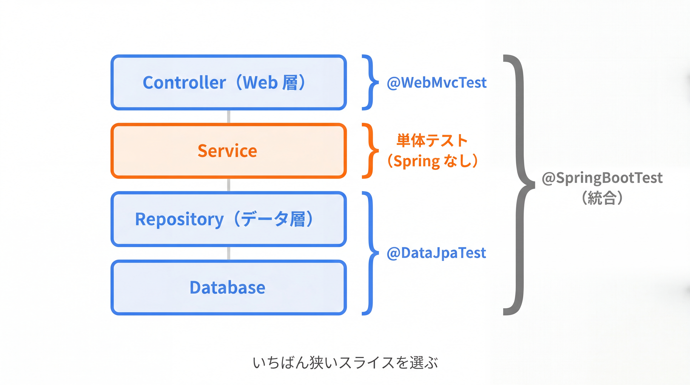

# 4-2-2 Spring のテスト

📝 **前提知識**: このセクションは「4-2-1 単体テスト」「3-3-1 リクエストを受けて返す」「3-4-2 リレーションとリポジトリ」の内容を前提としています。

## 🎯 このセクションで学ぶこと

- 必要な層だけを起動する **テストスライス** の考え方を理解し、テスト対象に応じて使い分けられる
- `@WebMvcTest` と `MockMvc` で Controller を、`@DataJpaTest` で Repository をテストできる
- `@SpringBootTest` でアプリ全体を起動する統合テストの位置づけを説明できる

本セクションでは、単体テストでは試せない領域から始め、テストスライスの考え方、Web 層のテスト、データ層のテスト、統合テストへと進みます。

---

## 導入: Spring が配線する部分は、単体テストでは試せない

4-2-1 の単体テストは、Service のロジックを切り離して検証する強力な手段でした。ですが、単体テストでは試せない領域があります。それは **Spring が配線してくれている部分** です。

たとえば Controller です。`@GetMapping("/api/tasks/{id}")` という URL のマッピング、`@PathVariable` でのパス変数の取り出し、戻り値の JSON への変換、`@Valid` による検証、`@RestControllerAdvice` での例外のエラーレスポンス化。これらはすべて、あなたのコードではなく **Spring の機能** が担っています。Controller クラスを `new` して単体テストしても、これらの配線は動きません。「`/api/tasks/1` を GET したら、本当に 200 とこの JSON が返るのか」は、Spring を絡めて初めて検証できます。

同じことが Repository にも言えます。`findByDoneFalse` のような派生クエリ（3-4-2）が、本当に意図した SQL を生成して正しく動くかは、JPA / Hibernate を動かしてみないと分かりません。本セクションでは、こうした「Spring が配線する部分」を、必要な範囲だけ起動して検証する方法を学びます。

### 🧠 先輩エンジニアの思考プロセス

> Controller を単体テストで済ませようとして、苦労した時期がありました。Controller を `new` してメソッドを直接呼べばロジックは試せます。でも、URL のマッピングが正しいか、パス変数がちゃんと取れるか、例外がきちんと 404 に変換されるか、肝心の「Spring が組み立てる部分」がまるで検証できない。結局、本番で「ルートのタイプミスで 404」みたいな事故が起きました。

> `MockMvc` を知ってからは、Controller のテストはこれ一択になりました。Spring の Web の仕組みを実際に通してリクエストを投げ、返ってきたステータスと JSON を検証できる。Laravel の Feature テストで `$this->getJson('/api/tasks/1')->assertStatus(200)` と書いていた、あの感覚そのものでした。道具の名前は違っても、「HTTP のレベルで API の振る舞いを保証する」という目的はまったく同じだと腑に落ちました。



---

## テストスライス: 必要な層だけ起動する

Spring を絡めたテストと聞くと、「アプリ全体を毎回起動するのか、重そうだ」と感じるかもしれません。実際、アプリ全体の起動は時間がかかります。そこで Spring Boot は、**必要な層だけを切り出して起動する** 仕組みを用意しています。これを **テストスライス** （test slice）と呼びます。

「スライス（薄切り）」の名のとおり、アプリ全体ではなく、関心のある層だけを薄く起動します。Web 層をテストしたいなら Web 層だけ、データ層をテストしたいならデータ層だけを起動し、無関係な部分は読み込みません。これにより、Spring の配線を検証しつつ、起動を軽く・速く保てます。

本教材で使う主なテストの種類を整理します。

| アノテーション | 起動する範囲 | 主な用途 |
|---|---|---|
| （なし。4-2-1） | 何も起動しない（純粋な JUnit + Mockito） | Service のロジック（単体テスト） |
| `@WebMvcTest` | Web 層だけ（Controller・例外ハンドラ・JSON 変換） | Controller のテスト |
| `@DataJpaTest` | データ層だけ（エンティティ・Repository・JPA） | Repository のテスト |
| `@SpringBootTest` | アプリ全体 | 複数層をまたぐ統合テスト |

🔑 選び方の原則は、**検証したい層に合わせて、いちばん狭いスライスを選ぶ** ことです。Controller の振る舞いを見たいなら `@WebMvcTest`、Repository のクエリを見たいなら `@DataJpaTest`。全部を `@SpringBootTest` で済ませることもできますが、起動が重く、失敗時に原因の層を絞りにくくなります。狭いスライスほど速く、原因も特定しやすくなります。

---

## Web 層のテスト: @WebMvcTest と MockMvc

Controller をテストするには、`@WebMvcTest` を使います。これは Web 層（指定した Controller・例外ハンドラ・JSON 変換など）だけを起動し、Service や Repository は読み込みません。そして、HTTP リクエストを擬似的に投げる **`MockMvc`** を自動で用意してくれます。

Web 層だけを起動するので、Controller が依存する Service は本物が存在しません。そこで、Service を **モック Bean** としてコンテナに差し込みます。これに使うのが **`@MockitoBean`** です。4-2-1 の `@Mock` がコンテナを使わない単体テスト用だったのに対し、`@MockitoBean` は「Spring のコンテナに、この Bean のモックを登録する」ためのものです。

`TaskController` の GET エンドポイントをテストしてみます。

```java
// src/test/java/com/example/taskapp/controller/TaskControllerTest.java
package com.example.taskapp.controller;

import com.example.taskapp.dto.TaskResponse;
import com.example.taskapp.service.TaskService;
import java.time.LocalDate;
import org.junit.jupiter.api.Test;
import org.springframework.beans.factory.annotation.Autowired;
import org.springframework.boot.test.autoconfigure.web.servlet.WebMvcTest;
import org.springframework.security.test.context.support.WithMockUser;
import org.springframework.test.context.bean.override.mockito.MockitoBean;
import org.springframework.test.web.servlet.MockMvc;

import static org.mockito.Mockito.when;
import static org.springframework.test.web.servlet.request.MockMvcRequestBuilders.get;
import static org.springframework.test.web.servlet.result.MockMvcResultMatchers.jsonPath;
import static org.springframework.test.web.servlet.result.MockMvcResultMatchers.status;

@WebMvcTest(TaskController.class)   // Web 層だけ起動（この Controller に絞る）
class TaskControllerTest {

    @Autowired
    private MockMvc mockMvc;          // 擬似 HTTP リクエストを投げる道具

    @MockitoBean
    private TaskService taskService;  // 依存 Service はモック Bean に差し替え

    @Test
    @WithMockUser                     // 認証済みユーザーとしてリクエスト（4-1 で入れた認証を通す）
    void getTask_returnsJson() throws Exception {
        when(taskService.findById(1L))
                .thenReturn(new TaskResponse(1L, "買い物", false, LocalDate.of(2026, 6, 30)));

        mockMvc.perform(get("/api/tasks/1"))
                .andExpect(status().isOk())                    // 200 か
                .andExpect(jsonPath("$.title").value("買い物")); // JSON の title が一致するか
    }
}
```

`mockMvc.perform(get("/api/tasks/1"))` で GET リクエストを擬似的に投げ、`andExpect(...)` で結果を検証します。`status().isOk()` はステータス 200 を、`jsonPath("$.title")` はレスポンス JSON の `title` フィールドを検証します。URL マッピング・パス変数の取り出し・JSON 変換という「Spring が配線する部分」が、実際に動いた結果を確かめている点が、単体テストとの違いです。

> ⚠️ **よくあるエラー**: `@MockBean` を import しようとすると、Spring Boot 4.0 ではコンパイルが通りません。
>
> ```
> cannot find symbol: class MockBean
> ```
>
> **原因**: 長く使われてきた `@MockBean` / `@SpyBean`（`org.springframework.boot.test.mock.mockito` パッケージ）は、Spring Framework 6.2 / Spring Boot 3.4 で非推奨化され、**Spring Boot 4.0 で削除** されました。世の中の記事の大半はまだ `@MockBean` で書かれているので要注意です。
>
> **対処法**: 後継の **`@MockitoBean`** （`org.springframework.test.context.bean.override.mockito` パッケージ）を使います。スパイは `@MockitoSpyBean` です。import 文の先頭が `org.springframework.test.context.bean.override.mockito` であることを確認してください。

💡 **認証を通す `@WithMockUser`**: 4-1 で API に認証をかけたため、何もしないと `@WebMvcTest` のリクエストは認証で弾かれます。テストメソッドに **`@WithMockUser`** （`spring-security-test` 由来）を付けると、「認証済みのユーザーとして」リクエストを投げられます。これは Laravel の Feature テストで使った **`actingAs($user)`** に対応します。

💡 **Laravel との対応**: `mockMvc.perform(get(...)).andExpect(status().isOk())` は、Laravel の Feature テスト `$this->getJson('/api/tasks/1')->assertStatus(200)->assertJson([...])` にそのまま対応します。`jsonPath("$.title")` が `assertJson` のフィールド検証に当たります。「実際に HTTP を通して API の振る舞いを検証する」目的は共通です。

---

## データ層のテスト: @DataJpaTest

Repository のクエリが正しく動くかは、`@DataJpaTest` で検証します。これはデータ層（エンティティ・Repository・JPA）だけを起動し、Web 層や Service は読み込みません。

```java
// src/test/java/com/example/taskapp/repository/TaskRepositoryTest.java
package com.example.taskapp.repository;

import com.example.taskapp.entity.Task;
import org.junit.jupiter.api.Test;
import org.springframework.beans.factory.annotation.Autowired;
import org.springframework.boot.test.autoconfigure.orm.jpa.DataJpaTest;

import java.util.List;

import static org.assertj.core.api.Assertions.assertThat;

@DataJpaTest   // データ層だけ起動
class TaskRepositoryTest {

    @Autowired
    private TaskRepository taskRepository;

    @Test
    void findByDoneFalse_returnsOnlyIncomplete() {
        Task task = new Task();
        task.setTitle("未完了のタスク");   // done は既定の false
        taskRepository.save(task);

        List<Task> result = taskRepository.findByDoneFalse();  // 3-4-2 の派生クエリ

        assertThat(result).hasSize(1);
    }
}
```

`@DataJpaTest` には便利な性質があります。各テストは **トランザクションの中で実行され、終了時に自動でロールバック** されます。つまり、テストで保存したデータはテストごとに巻き戻され、テスト間で汚染し合いません。3-4-3 で学んだトランザクションが、テストの独立性を保つために活かされています。

📝 既定では、`@DataJpaTest` はテスト用の組み込みデータベースに差し替えて動きます。本番と同じ MySQL でテストしたい場合は `@AutoConfigureTestDatabase(replace = Replace.NONE)` を付けて差し替えを止めます（実際の DB 接続を伴うテストの構成は Part 5 で扱います）。

💡 **Laravel との対応**: `@DataJpaTest` の自動ロールバックは、Laravel のテストで使った `RefreshDatabase` や `DatabaseTransactions` トレイトに対応します。テストごとに DB の状態を巻き戻し、テストを独立させる、という発想は共通です。

---

## 統合テスト: @SpringBootTest

最後に、複数の層をまたいで「全体が本当につながって動くか」を確かめたいときは、`@SpringBootTest` を使います。これは **アプリ全体のコンテキストを起動** する、もっとも本物に近いテストです。スライスのようにモックで穴埋めせず、Controller → Service → Repository → DB を実際につないで検証できます。

```java
// src/test/java/com/example/taskapp/TaskApiIntegrationTest.java
package com.example.taskapp;

import org.junit.jupiter.api.Test;
import org.springframework.beans.factory.annotation.Autowired;
import org.springframework.boot.test.autoconfigure.web.servlet.AutoConfigureMockMvc;
import org.springframework.boot.test.context.SpringBootTest;
import org.springframework.security.test.context.support.WithMockUser;
import org.springframework.test.web.servlet.MockMvc;

import static org.springframework.test.web.servlet.request.MockMvcRequestBuilders.get;
import static org.springframework.test.web.servlet.result.MockMvcResultMatchers.status;

@SpringBootTest              // アプリ全体を起動
@AutoConfigureMockMvc        // MockMvc を使えるようにする
class TaskApiIntegrationTest {

    @Autowired
    private MockMvc mockMvc;

    @Test
    @WithMockUser
    void listTasks_returnsOk() throws Exception {
        mockMvc.perform(get("/api/tasks")).andExpect(status().isOk());
    }
}
```

⚠️ **注意**: `@SpringBootTest` は全体を起動する分、`@WebMvcTest` や `@DataJpaTest` より重く、遅くなります。`@WebMvcTest` は `MockMvc` を自動で用意しますが、`@SpringBootTest` で `MockMvc` を使うには `@AutoConfigureMockMvc` を併せて付ける必要があります。「層を絞れるなら絞る、全体のつながりを見たいときだけ統合テスト」という使い分けが基本です。

> 💡 **Spring Boot 4 で新しくなった点（`RestTestClient`）**: Spring Boot 4.0 / Spring Framework 7.0 では、テスト用の HTTP クライアント **`RestTestClient`** が新たに加わりました。`restClient.get().uri("/api/tasks").exchange().expectStatus().isOk()` のように、リクエストの組み立てから検証までを流れるように書けます。`MockMvc` 経由でも実際に起動したサーバ相手でも使え、WebFlux への依存も要りません。本教材では広く普及している `MockMvc` を中心に進めますが、新しいプロジェクトでは選択肢になります（同様に、`MockMvc` を AssertJ 流に書ける `MockMvcTester` も Spring Framework 6.2 以降で使えます）。

💡 **Laravel との対応**: `@SpringBootTest` + `MockMvc` は、Laravel の Feature テストでアプリ全体を起動して API を叩いていたのに近い位置づけです。Laravel では単体テスト（Unit）と機能テスト（Feature）の 2 区分が中心でしたが、Spring ではその間に「層ごとのスライス」という選択肢が加わる、と捉えると整理できます。

---

## ✨ まとめ

- **テストスライス** は、アプリ全体ではなく検証したい層だけを起動する仕組み。狭いスライスほど速く、失敗時の原因も絞りやすい。検証対象に合わせていちばん狭いスライスを選ぶ
- **`@WebMvcTest`** + **`MockMvc`** で Controller をテストする。依存 Service は **`@MockitoBean`** でモック Bean に差し替える。`perform(...).andExpect(status()...)` / `jsonPath(...)` で HTTP の振る舞いを検証する（Laravel の Feature テストに対応）
- **`@DataJpaTest`** で Repository をテストする。各テストは自動でロールバックされ独立する（Laravel の `RefreshDatabase` に対応）
- **`@SpringBootTest`** はアプリ全体を起動する統合テスト。`MockMvc` を使うには `@AutoConfigureMockMvc` を併用する。重いので層を絞れるときはスライスを選ぶ
- バージョン注意: `@MockBean` / `@SpyBean` は Spring Boot 4.0 で削除され、**`@MockitoBean` / `@MockitoSpyBean`** に置き換わった（古い記事の大半は `@MockBean`）。テスト用 HTTP クライアント `RestTestClient` は Spring Boot 4 の新顔

---

【Chapter 4-2 の振り返り】本章では、API を「安心して変更できる」状態へ引き上げました。4-2-1 で、Spring を起動しない純粋な単体テスト（JUnit + Mockito）で Service のロジックを切り離して検証する型を、4-2-2 で、Spring が配線する部分を必要な層だけ起動して検証するテストスライス（`@WebMvcTest` / `MockMvc`・`@DataJpaTest`・`@SpringBootTest`）を学びました。PHPUnit と Feature テストの経験が、JUnit・Mockito・`MockMvc` にそのまま橋渡しされたはずです。これで、変更のたびにコマンド一つで振る舞いを保証できるようになりました。

次の Chapter 4-3 では、品質の最後の柱である **運用の土台** に入ります。本番で動かしたアプリは、必ず想定外の事態に出くわします。そのとき「何が起きたのか」を追えるように、最初のセクション 4-3-1 では、例外をどう分類し・どの層で処理するかという **例外設計の指針** と、**SLF4J / Logback** によるログ、**ログレベル** の使い分けを学び、運用に耐える例外とログを設計できるようになります。3-3-3 で作った統一エラーレスポンスの仕組みを土台に、その「設計」の観点へ踏み込みます。
