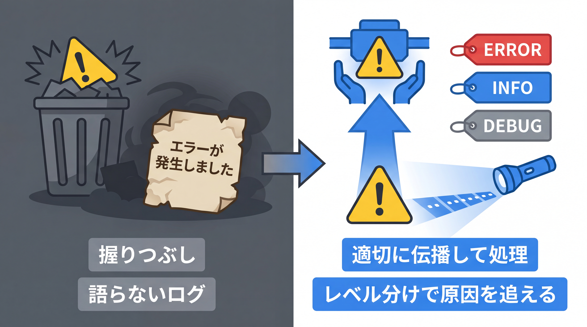
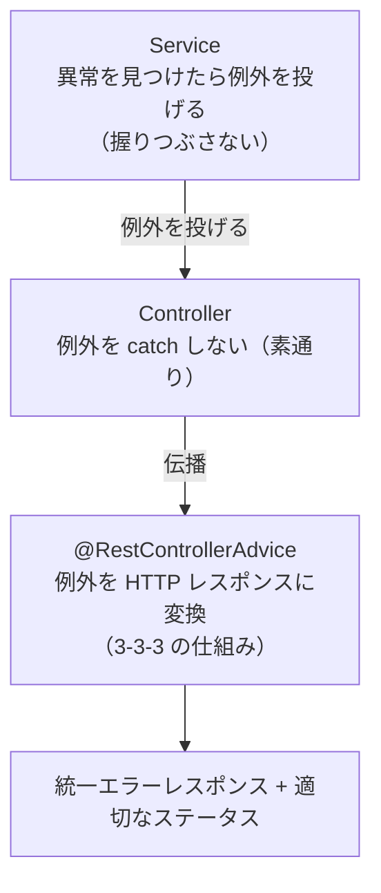

# 4-3-1 例外設計とログ

Chapter 4-3 では、アプリを「本番で動かし、何が起きたか追える」状態にします。本セクションで、運用に耐える例外の設計とログを扱い、次の 4-3-2 で、環境ごとに動かすための設定の外部化と Docker パッケージングへ進みます。

| セクション | テーマ | 種類 |
|---|---|---|
| 4-3-1 例外設計とログ | 例外の分類・設計指針・SLF4J / Logback・ログレベル | 概念 |
| 4-3-2 設定の外部化とパッケージング | プロファイル・環境変数・シークレット・Docker パッケージング | 概念 |

📖 **この Chapter の進め方**: まず本セクションで、例外をどう分類し・どの層で処理するかという設計の指針（3-3-3 で作った統一エラーレスポンスの仕組みの上に）と、SLF4J / Logback による運用に耐えるログを学びます。次に 4-3-2 で、開発・本番で設定を切り替えるプロファイル、環境変数やシークレットの扱い、そして Docker パッケージングを扱い、「どの環境でも動かせる形」にしてアプリを仕上げます。

📝 **前提知識**: このセクションは「3-3-3 バリデーションと例外ハンドリング」の内容を前提としています。

## 🎯 このセクションで学ぶこと

- 例外を分類し（検査 / 非検査・どこで処理するか）、運用に耐える例外設計の指針を説明できる
- 標準化されたエラー本文（`ProblemDetail` / RFC 9457）という選択肢を理解する
- SLF4J / Logback の関係とログレベルの使い分けを理解し、例外とログを連携させて設計できる

本セクションでは、例外を握りつぶす痛みから始め、例外の分類と処理場所、標準化されたエラー本文、ログの仕組み（SLF4J / Logback）、ログレベル、そして例外とログの連携へと進みます。

---

## 導入: 例外を握りつぶす、ログが何も語らない

3-3-3 で、例外を `@RestControllerAdvice` で受け止め、統一エラーレスポンスに変換する **仕組み** を作りました。仕組みは整いましたが、運用の現場では、その先の「設計」が問われます。

ありがちな失敗が 2 つあります。1 つは **例外の握りつぶし** です。`try { ... } catch (Exception e) { }` と、捕まえた例外で何もしない。エラーが起きてもアプリは何事もなかったように進み、データは中途半端なまま、誰も異常に気づきません。もう 1 つは **語らないログ** です。本番で「500 エラーが出た」と報告されても、ログに `エラーが発生しました` としか出ていなければ、原因の手がかりはゼロです。逆に、何でもかんでもログに吐いていると、肝心の情報が大量のノイズに埋もれます。

本番のアプリは、必ず想定外に出くわします。そのとき被害を最小限にし、原因を追えるようにするのが、例外設計とログの役割です。本セクションでは、3-3-3 の仕組みを土台に、「例外をどう設計し、何を・どのレベルでログに残すか」という運用の観点を扱います。

### 🧠 先輩エンジニアの思考プロセス

> 新人のころ、私はエラーが怖くて、とりあえず `catch` で囲んで握りつぶしていました。画面が赤くならなければ安心、という感覚です。でもある日、決済処理で例外を握りつぶしていたせいで、「課金は失敗しているのに成功扱い」というデータが大量に生まれました。例外は、握りつぶすのではなく、適切な場所まで伝えて処理すべきものだと、痛い目で学びました。

> ログについても似た失敗をしました。原因調査のために後からログを足す、を繰り返した結果、ログが洪水になり、本当に見たい 1 行が見つからない。今は「異常は ERROR、節目は INFO、調査用は DEBUG」と最初からレベルで仕分け、例外は必ずスタックトレースごと残す、と決めています。地味ですが、深夜に障害対応する未来の自分を救うのは、結局この習慣でした。



---

## 例外をどう分類し、どこで処理するか

まず、例外の分類です。1-3-2 で学んだ **検査例外** （`Exception` 系。コンパイル時に処理を強制される）と **非検査例外** （`RuntimeException` 系。強制されない）の区別が、設計の起点になります。

現代の Spring / Java の実務では、**業務上の異常は非検査例外（`RuntimeException` を継承）で表す** のが基本です。3-3-3 や 3-4-3 で使った `TaskNotFoundException` が、まさに `RuntimeException` を継承する非検査例外でした。Spring 自身も、データアクセスで起きる検査例外（`SQLException`）を、非検査の `DataAccessException` 体系に変換してくれます（3-2-2 で `@Repository` の付加価値として触れたものです）。なぜ非検査かというと、「タスクが見つからない」のような異常は、呼び出し元が `try-catch` でその場で回復できる類のものではなく、上位（最終的には `@RestControllerAdvice`）まで伝えて一括で扱う方が素直だからです。

次に、**どこで処理するか** です。ここが設計の肝で、層ごとに役割を決めます。



- **Service は、異常を見つけたら例外を投げる**。「在庫が足りない」「権限がない」といった業務上の異常を、適切な例外として投げます。間違っても握りつぶしません。
- **Controller は、例外を catch しない**。エラー処理の `if` や `try-catch` をコントローラに書くと、3-3-3 で追い出したはずのエラー処理が逆流します。例外はそのまま素通りさせます。
- **`@RestControllerAdvice` が、例外を HTTP レスポンスに変換する**。例外の型ごとにステータスと本文を組み立てる、唯一の処理場所です。

🔑 「**Service が投げ、Advice が変換し、その間の Controller は素通り**」。この役割分担が、例外設計の背骨です。3-3-3 で作った仕組みは、この設計を実現するための土台でした。例外処理を一箇所（Advice）に集約するからこそ、各所での握りつぶしや、エラー応答のばらつきを防げます。

なお、ごく単純なケースでは、例外クラスに **`@ResponseStatus`** を付けるだけで、その例外が処理されずに伝播したときに指定のステータスを返せます（例外ごとにハンドラメソッドを書かない軽量な手段です）。

```java
// TaskNotFoundException.java（@ResponseStatus を使う軽量版）
import org.springframework.http.HttpStatus;
import org.springframework.web.bind.annotation.ResponseStatus;

@ResponseStatus(HttpStatus.NOT_FOUND)   // この例外が伝播したら 404
public class TaskNotFoundException extends RuntimeException {
    public TaskNotFoundException(Long id) {
        super("タスクが見つかりません: id=" + id);
    }
}
```

💡 **Laravel との対応**: Laravel で業務的な異常を例外として投げ、`app/Exceptions/Handler.php`（の `render`）で応答に変換していた構図と同じです。`@ResponseStatus(HttpStatus.NOT_FOUND)` は、Laravel の `abort(404)` や、`ModelNotFoundException` が自動で 404 になっていた挙動に近い、軽量な対応づけだと捉えてください。

---

## 標準化されたエラー本文: ProblemDetail（RFC 9457）

3-3-3 では、エラー応答の形を独自の `ErrorResponse`（`record`）で揃えました。これはこれで有効ですが、エラー応答の形式には **業界標準** も用意されています。**RFC 9457「Problem Details for HTTP APIs」** です。エラー本文の項目（`type`・`title`・`status`・`detail`・`instance`）を標準化したもので、Spring Framework 6 以降は `ProblemDetail` クラスでこれを扱えます。

```java
// @ExceptionHandler の中で ProblemDetail を組み立てて返す例
import org.springframework.http.ProblemDetail;
import org.springframework.http.HttpStatus;

@ExceptionHandler(TaskNotFoundException.class)
public ProblemDetail handleTaskNotFound(TaskNotFoundException ex) {
    ProblemDetail problem = ProblemDetail.forStatus(HttpStatus.NOT_FOUND);
    problem.setTitle("Task Not Found");
    problem.setDetail(ex.getMessage());
    return problem;   // application/problem+json で返る
}
```

返ってくる JSON は、次のような標準形式になります。

```json
{
  "type": "about:blank",
  "title": "Task Not Found",
  "status": 404,
  "detail": "タスクが見つかりません: id=999"
}
```

独自の `ErrorResponse` と `ProblemDetail`、どちらを採るかは API の方針次第です。クライアントとの取り決めで独自形式が決まっているなら `ErrorResponse`、標準に乗りたいなら `ProblemDetail`、という選び方になります。

💡 Spring のフレームワークが投げる組み込みの例外（検証エラーや 404 など）まで自動で `ProblemDetail` 形式にしたい場合は、設定で `spring.mvc.problemdetails.enabled` を `true` にします（既定は無効）。ただし自分の `@ExceptionHandler` から `ProblemDetail` を返すこと自体は、この設定に関係なくできます。本教材では「標準化されたエラー本文という選択肢がある」ことを押さえれば十分です。

---

## ログの仕組み: SLF4J と Logback

例外設計とならぶ運用の柱が **ログ** です。Java のログには、3-4-1 で見た JPA と Hibernate の関係（仕様と実装の分離）とそっくりな構図があります。

- **SLF4J** （Simple Logging Facade for Java）は、ログの **ファサード（窓口）** です。あなたがコードで呼ぶのは、この SLF4J の API（`Logger` インターフェース）です。SLF4J 自体は実際の出力をせず、「ログ出力の取り決め」だけを提供します。
- **Logback** は、その SLF4J の裏で **実際にログを出力する実装** です。Spring Boot の既定の実装で、コンソールやファイルへの書き出しを担います。

つまり、あなたは SLF4J という窓口に向かってログを書き、実際の出力は Logback が引き受けます。JPA（仕様）に書いて Hibernate（実装）が SQL を発行したのと、まったく同じ「仕様と実装の分離」です。この分離のおかげで、実装を別のログライブラリに替えても、あなたのコードはそのまま動きます。

ログを書くには、クラスごとに `Logger` を 1 つ用意します。

```java
// TaskService.java（ロガーの宣言）
import org.slf4j.Logger;
import org.slf4j.LoggerFactory;

@Service
public class TaskService {

    private static final Logger log = LoggerFactory.getLogger(TaskService.class);

    // ... log.info(...) のように使う
}
```

`LoggerFactory.getLogger(TaskService.class)` で、そのクラス用のロガーを取得します。`private static final` で 1 つ持つのが定石です。import が `org.slf4j` で始まっていることを確認してください（Logback や他のログライブラリのクラスを直接 import しないのがポイントです）。

💡 Lombok というライブラリを使うと、`@Slf4j` を付けるだけで `log` フィールドが自動生成されます。現場でよく見かけますが、本教材では仕組みを明確にするため `LoggerFactory.getLogger(...)` を手で書きます。`@Slf4j` を見かけたら「これは `LoggerFactory.getLogger` の省略形だ」と捉えてください（Lombok の依存が必要です）。

💡 **Laravel との対応**: Laravel のログは、内部で **Monolog** が動いていました。あなたが `Log::info(...)` と書いていた `Log` ファサードが SLF4J の窓口に、その裏の Monolog が Logback（実装）に対応します。「窓口に書いて、実装が出力する」構図は同じです。

---

## ログレベルを使い分ける

ログには **レベル** があり、低いほど詳細、高いほど重大です。SLF4J / Logback では次の 5 段階を使います。

```text
TRACE  <  DEBUG  <  INFO  <  WARN  <  ERROR
（詳細）                              （重大）
```

| レベル | 何を出すか |
|---|---|
| `ERROR` | 対応が必要な失敗（想定外の例外、外部連携の失敗など） |
| `WARN` | 異常ではあるが処理は継続できた事柄（リトライ成功、非推奨の使用など） |
| `INFO` | 業務上の節目（起動、重要な処理の開始 / 完了など） |
| `DEBUG` | 開発・調査用の詳細な情報 |
| `TRACE` | 最も細かい追跡情報 |

設定で「どのレベル以上を出力するか」を決めます。たとえば `INFO` に設定すると、`INFO`・`WARN`・`ERROR` が出力され、`DEBUG`・`TRACE` は抑制されます。これにより、本番では `INFO` 以上だけを出して静かに保ち、調査時だけ `DEBUG` まで下げて詳細を見る、という運用ができます。設定は `application.yml` に書きます（3-1-3 で学んだ設定ファイルです）。

```yaml
# application.yml
logging:
  level:
    root: info                     # 全体の既定レベル
    com.example.taskapp: debug     # 自分のアプリのパッケージだけ詳細に
    org.hibernate.SQL: debug       # Hibernate が発行する SQL を見たいとき
```

🔑 ログレベルの使い分けの勘所は、**「本番で常に見たいか」で線を引く** ことです。常時見たい節目は `INFO`、対応が要る失敗は `ERROR`、調査のときだけ見たい詳細は `DEBUG`。最初からレベルで仕分けておけば、導入で触れた「ログの洪水で肝心の 1 行が埋もれる」事態を避けられます。

💡 **Laravel との対応**: ログレベル（`debug` / `info` / `warning` / `error` など）は、Laravel（PSR-3 準拠の Monolog）の `Log::info()` / `Log::error()` と同じ体系です。`config/logging.php` でチャンネルやレベルを設定したのが、Spring では `application.yml` の `logging.level` や（高度な設定なら）`logback-spring.xml` に当たります。

---

## 例外とログを連携させる

例外とログは、運用では必ずセットになります。最後に、両者を正しくつなぐ要点を押さえます。

**1. 例外はスタックトレースごと記録する**

例外をログに残すときは、**例外オブジェクトそのものを最後の引数として渡します**。こうすると SLF4J がスタックトレース（どこで・何が起きたかの追跡情報）を丸ごと出力します。

```java
try {
    // 何らかの処理
} catch (ExternalApiException ex) {
    log.error("外部 API の呼び出しに失敗しました", ex);   // 例外を最後の引数に渡す
    throw ex;   // 必要なら再送出（握りつぶさない）
}
```

⚠️ **よくある間違い**: `log.error("失敗: " + ex.getMessage())` や `log.error("失敗", ex.getMessage())` と書くと、メッセージの文字列しか残らず、**スタックトレースが失われます**。原因の行番号が分からなくなるので、例外は必ず `ex`（オブジェクト）そのものを最後の引数として渡してください。

**2. プレースホルダ `{}` で値を埋め込む**

ログメッセージに変数を入れるときは、文字列結合（`+`）ではなく **`{}` プレースホルダ** を使います。

```java
log.info("タスクを作成しました: id={}", task.getId());   // {} に値が入る
```

`{}` を使うと、そのレベルが無効なとき（例: 本番で `DEBUG` を抑制しているとき）に、メッセージ文字列の組み立て自体がスキップされ、無駄な処理を避けられます。文字列結合だと、出力されない場合でも結合のコストが毎回かかります。

**3. どこでログを出すか、何を出さないか**

ログは、出す場所を絞ります。想定外の例外は、最終的に受け止める `@RestControllerAdvice` で 1 回だけ `ERROR` ログを出すのが基本です（各層で `catch` して毎回ログを出すと、同じ例外が何度も記録され、ノイズになります）。業務上の節目（重要な処理の完了など）は Service で `INFO` を出します。

そして、**秘密情報は絶対にログに出しません**。パスワード、トークン（JWT を含む）、`Authorization` ヘッダー、個人情報。これらをログに残すと、ログ自体が情報漏洩の経路になります。4-1 で扱ったパスワードやトークンは、ログの世界では「出してはいけないもの」の代表です。

💡 **Laravel との対応**: 例外を `report()` でログに送り、`Log::error($message, ['exception' => $e])` のようにコンテキストを添えていたのと、発想は同じです。「例外は情報を保ったまま記録する」「秘密情報はログに出さない」は、フレームワークを問わない運用の鉄則です。

---

## ✨ まとめ

- 業務上の異常は **非検査例外（`RuntimeException`）** で表す。**Service が投げ、`@RestControllerAdvice` が HTTP に変換し、その間の Controller は素通り** が例外設計の背骨（3-3-3 の仕組みを土台に。握りつぶさない）。単純な対応づけには `@ResponseStatus` も使える
- エラー本文は独自の `ErrorResponse`（3-3-3）でも、標準の **`ProblemDetail`（RFC 9457）** でもよい。API の方針で選ぶ
- ログは **SLF4J（窓口）** に書き、**Logback（実装）** が出力する（JPA / Hibernate と同じ仕様・実装の分離）。`LoggerFactory.getLogger(クラス.class)` でロガーを得る
- ログレベルは `TRACE < DEBUG < INFO < WARN < ERROR` の 5 段階。`logging.level` で出力範囲を決め、「本番で常に見たいか」で線を引く
- 例外は **オブジェクトを最後の引数に渡してスタックトレースごと** 記録する。メッセージは **`{}` プレースホルダ** で埋める。秘密情報（パスワード・トークン・個人情報）はログに出さない

---

次のセクションでは、ここまで作ったアプリを「どの環境でも動かせる形」に仕上げます。開発と本番で設定を切り替える **プロファイル**、設定を外から注入する **環境変数** と優先順位、データベースのパスワードのような **シークレットの扱い**、そしてアプリを 1 つの成果物にまとめる **パッケージング** （実行可能 JAR）と **Docker イメージ化** （Buildpacks / Dockerfile）を学び、環境ごとに動かせる形にできるようになります。
