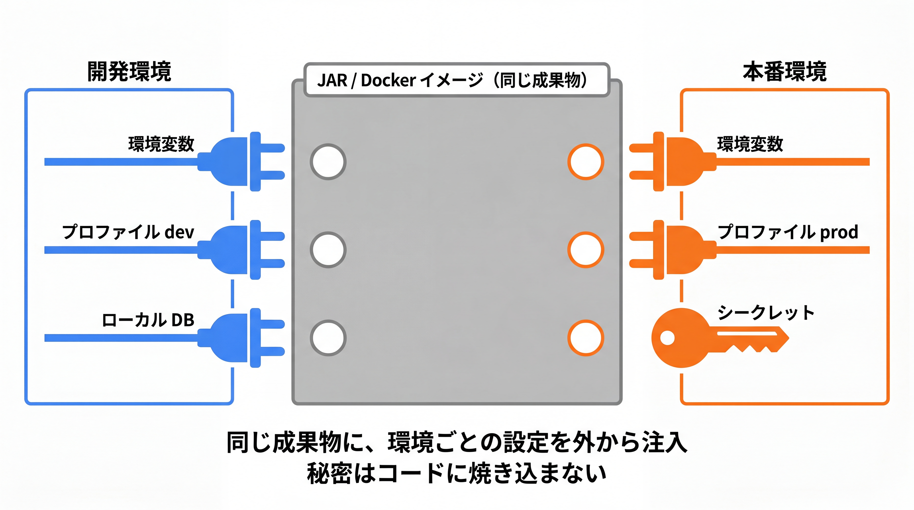

# 4-3-2 設定の外部化とパッケージング

📝 **前提知識**: このセクションは「3-1-3 アプリケーションの起動と設定」の内容を前提としています。

## 🎯 このセクションで学ぶこと

- プロファイルと `@ConfigurationProperties` で、環境ごとの設定を型安全に扱える
- 環境変数の優先順位を踏まえ、シークレット（DB パスワード・秘密鍵など）を安全に外から注入できる
- 実行可能 JAR（レイヤー化）と Docker イメージ化（Buildpacks / Dockerfile）で、どの環境でも動かせる成果物を作れる

本セクションでは、環境ごとに設定が変わる課題から始め、プロファイルと型安全な設定、シークレットの扱い、パッケージング（実行可能 JAR）、そして Docker イメージ化へと進みます。

---

## 導入: 開発と本番で設定が違う、秘密情報をどこに置くか

3-1-3 で、`application.yml` に設定を書き、プロファイルで環境ごとに切り替え、機密は環境変数で上書きできることを押さえました。アプリを本番に出す段になると、この「設定の外部化」が、いよいよ現実の問題として迫ってきます。

開発機ではローカルの MySQL に `localhost` で繋ぎますが、本番では別のホストの DB に繋ぎます。ログのレベルも、開発は `DEBUG`、本番は `INFO` にしたい。そして最大の問題が、**DB のパスワードや JWT の秘密鍵（4-1-2）をどこに置くか** です。これらを `application.yml` に直書きして Git にコミットすれば、リポジトリを見られる全員に秘密が漏れます。設定を「環境ごとに変えられ」「秘密はコードに残さず外から注入できる」形に整えることが、本番運用の前提です。

さらに、アプリそのものを「持ち運べる 1 つの成果物」にまとめる必要もあります。本セクションでは、設定の外部化を一段深め、最後にアプリを実行可能 JAR・Docker イメージとしてパッケージングし、Part 4 を締めくくります。

### 🧠 先輩エンジニアの思考プロセス

> 設定の外部化で痛い目に遭ったのは、Laravel 時代に本番の DB パスワードをうっかり設定ファイルにコミットしてしまったときでした。すぐ気づいて消しましたが、Git の履歴には残る。結局パスワードを変更して回る羽目になりました。それ以来、秘密は絶対にファイルに書かず環境変数から、を鉄則にしています。

> Java に来てうれしかったのは、`@ConfigurationProperties` で設定を型付きのクラスに束ねられることでした。`.env` の値を文字列であちこちから読んでいた頃に比べ、設定がひとかたまりの型になって、補完も効くし綴り間違いにも気づける。パッケージングも、PHP では「ファイル一式をサーバに置く」感覚でしたが、Spring Boot は jar 一つ、あるいは Docker イメージ一つにまとまる。配るものが 1 個だと、運用はこんなに楽になるのかと実感しました。



---

## プロファイルで環境ごとに分ける: おさらいと一歩先へ

環境ごとの設定切り替えは、3-1-3 で学んだ **プロファイル** が担います。共通の `application.yml` をベースに、`application-dev.yml` / `application-prod.yml` といった環境別ファイルを重ね、`spring.profiles.active` で有効化する、というあの仕組みです。本番でどのプロファイルを使うかは、起動時に環境変数 `SPRING_PROFILES_ACTIVE=prod` で与えるのが定石です（設定ファイルに本番固定で書かず、環境側で指定します）。

プロファイルは設定ファイルだけでなく、**Bean の有効・無効** にも使えます。`@Profile` を付けると、その Bean は指定プロファイルのときだけ登録されます。「開発時だけ動くダミー実装」「本番だけ有効にする設定」などを切り替えられます。

```java
// 開発プロファイルのときだけ有効になる Bean
import org.springframework.context.annotation.Profile;

@Profile("dev")
@Configuration
public class DevDataLoader {
    // 開発用のサンプルデータ投入など
}
```

🔑 設定値の上書き（環境ごとに値を変える）は `application-{profile}.yml`、振る舞いの切り替え（Bean を出し分ける）は `@Profile`、と使い分けます。どちらも「同じアプリを、環境に応じて違う顔で動かす」ための道具です。

💡 **Laravel との対応**: Laravel で `APP_ENV` を `local` / `production` と切り替え、環境ごとに `.env` を差し替えていたのが、`SPRING_PROFILES_ACTIVE` とプロファイル別ファイルに対応します。`@Profile` による Bean の出し分けは、Laravel のサービスプロバイダで環境を見て登録を変えていたのに近い発想です。

---

## 設定を外から注入する: 環境変数と型安全な束縛

3-1-3 で見たとおり、設定値には **優先順位** があり、コマンドライン引数や環境変数が設定ファイルの値を上書きします（おおまかに コマンドライン引数 ＞ 環境変数 ＞ `application-{profile}.yml` ＞ `application.yml` の順）。そして環境変数は、リラックスバインディングにより `spring.datasource.url` ↔ `SPRING_DATASOURCE_URL` のように対応づきます。この性質があるからこそ、**同じ JAR に、環境変数で別々の設定を注入して動かせる** わけです。

ここで一歩進めて、設定値を **型安全なクラスに束ねる** 方法を見ます。3-1-3 では設定を個別に読む前提でしたが、関連する設定をひとまとめにしたいことがよくあります。たとえば 4-1-2 で「設定から注入する」と保留した JWT の秘密鍵と有効期限です。`@ConfigurationProperties` を使うと、`app.jwt.*` 以下の設定を 1 つのクラスにまとめて束ねられます。

```yaml
# application.yml
app:
  jwt:
    secret: ${JWT_SECRET}     # 環境変数 JWT_SECRET から注入（ファイルに直書きしない）
    expiration: 3600          # トークンの有効期間（秒）
```

```java
// JwtProperties.java
package com.example.taskapp.config;

import org.springframework.boot.context.properties.ConfigurationProperties;

@ConfigurationProperties(prefix = "app.jwt")
public class JwtProperties {
    private String secret;       // app.jwt.secret が束縛される
    private long expiration;     // app.jwt.expiration が束縛される
    // getter / setter は省略
}
```

📝 `@ConfigurationProperties` を付けたクラスを Bean として有効にするには、起動クラスに `@ConfigurationPropertiesScan` を付けるか、`@EnableConfigurationProperties(JwtProperties.class)` で登録します。これで `JwtProperties` がコンテナに載り、`JwtConfig` などへコンストラクタで注入できるようになります。

`${JWT_SECRET}` という記法は、「環境変数（または他の設定）`JWT_SECRET` の値をここに差し込む」という意味です。秘密鍵の実体はファイルに書かず、環境変数で与えます。これで、4-1-2 の `JwtConfig` は `JwtProperties` から鍵を受け取れます。

設定を読むもう 1 つの方法に `@Value` があります。使い分けの目安は次のとおりです。

| 方法 | 向いている用途 |
|---|---|
| `@Value("${app.jwt.expiration}")` | 単発の 1 値を手軽に読む |
| `@ConfigurationProperties("app.jwt")` | 関連する複数の設定を型付きクラスにまとめる（推奨） |

💡 **Laravel との対応**: `@Value` は Laravel の `config('app.jwt.expiration')` で 1 値を読むのに近く、`@ConfigurationProperties` は設定を型付きのオブジェクトとして扱える点で一歩進んでいます。`${JWT_SECRET}` による環境変数の差し込みは、Laravel の `env('JWT_SECRET')` に対応します。「秘密は `.env`（環境変数）に置き、コードはキー名で参照する」流儀は共通です。

---

## シークレットを安全に扱う

設定の中でも、**シークレット** （秘密情報）は特別な注意が要ります。DB パスワード、JWT の秘密鍵、外部 API のキーなど、漏れると被害が出る値です。原則は 3 つです。

1. **コミットしない**: シークレットの実体を `application.yml` に直書きして Git に入れない。値は `${JWT_SECRET}` のように外部参照にしておく。
2. **環境変数で注入する**: 実行環境（サーバやコンテナ）の環境変数として与える。前述のリラックスバインディングと優先順位により、ファイルの値を安全に上書きできる。
3. **ログに出さない**: 4-3-1 で触れたとおり、シークレットはログにも残さない。

コンテナ環境では、もう一歩進んだ方法もあります。Docker や Kubernetes が「秘密をファイルとしてマウントする」仕組み（Secrets）を持っており、Spring Boot はそれを **コンフィグツリー** として読み込めます。

```yaml
# application.yml（マウントされた秘密ファイルを読み込む）
spring:
  config:
    import: "optional:configtree:/run/secrets/"
```

これは「`/run/secrets/` 以下に置かれたファイルを、ファイル名をキー・中身を値として設定に取り込む」指定です（`optional:` は、無くても起動を失敗させないという意味）。環境変数より秘密が露出しにくいため、本番のコンテナ運用で使われます。本教材では「環境変数での注入」を基本とし、コンフィグツリーは「コンテナではこういう選択肢もある」と知っておけば十分です。

💡 **Laravel との対応**: 「`.env` を `.gitignore` に入れてコミットしない」「本番のサーバ環境変数で値を与える」という Laravel の鉄則が、そのまま Spring Boot にも当てはまります。コンフィグツリーは、Laravel にはあまり馴染みのない、コンテナ運用ならではの仕組みです。

---

## アプリを 1 つの成果物にまとめる: パッケージング

設定を外部化できたら、アプリ本体を「持ち運べる成果物」にまとめます。3-1-3 で、`spring-boot-maven-plugin` が組み込み Tomcat ごと **実行可能 JAR** を作り、`java -jar` で起動できることに触れました。これを担うのが、このプラグインの `repackage` ゴールです。Maven の `package` フェーズに紐づいているので、ビルドコマンドはいつもどおりです。

```bash
# 実行可能 JAR を作る（target/ に生成される）
./mvnw package
```

できあがる JAR は、アプリのコード・依存ライブラリ・組み込み Tomcat をすべて含んだ「これ 1 つで動く」成果物です。さらに Spring Boot は、この JAR を **レイヤー化** しています。中身が、変更頻度の異なる 4 つの層（依存ライブラリ・ローダ・スナップショット依存・アプリ本体）に分けて格納されているのです。

| 層 | 中身 | 変更頻度 |
|---|---|---|
| `dependencies` | リリース版の依存ライブラリ | 低い（めったに変わらない） |
| `spring-boot-loader` | 起動用のローダ | 低い |
| `snapshot-dependencies` | スナップショット版の依存 | 中 |
| `application` | あなたのアプリのコード | 高い（毎回変わる） |

この層分けは、次に見る Docker イメージ化で効いてきます。変更頻度の低い依存ライブラリと、毎回変わるアプリ本体を別の層に分けておくと、Docker がビルド時に「変わっていない層」をキャッシュから再利用でき、イメージのビルドと配布が速くなるからです。

💡 **Laravel との対応**: PHP では「ソース一式をサーバに配置する」のが基本で、1 つの実行ファイルにまとめる発想は薄かったはずです。Spring Boot の実行可能 JAR は、アプリとサーバと依存を 1 個にまとめた、配布しやすい成果物だと捉えてください。

---

## Docker イメージにする: Buildpacks と Dockerfile

最後に、アプリを Docker イメージにします。Laravel で Sail（Docker）を使った経験があるなら、コンテナで動かす意義はつかめているはずです。Spring Boot には、イメージを作る方法が 2 つあります。

**方法 1: Cloud Native Buildpacks（Dockerfile を書かない）**

Spring Boot が推奨するのは、`spring-boot-maven-plugin` の `build-image` ゴールです。Dockerfile を 1 行も書かずに、コマンド一つで最適化された OCI イメージ（Docker イメージ）が作れます。

```bash
# Dockerfile なしでイメージをビルドする（Docker の起動が必要）
./mvnw spring-boot:build-image
```

内部では Paketo Buildpacks という仕組みが、適切な JRE の選定やレイヤー構成を自動で行います。「ベースイメージは何にするか」「どう層を分けるか」を自分で決めなくてよいのが利点です。

**方法 2: Dockerfile（細かく制御したいとき）**

イメージの中身を自分で制御したいときは、Dockerfile を書きます。ここで、先ほどのレイヤー化 JAR が活きます。マルチステージビルドで JAR を層ごとに展開し、変更頻度順にコピーします。

```dockerfile
# Dockerfile
# --- ビルド用ステージ: JAR を層ごとに展開する ---
FROM eclipse-temurin:21-jre AS builder
WORKDIR /builder
ARG JAR_FILE=target/*.jar
COPY ${JAR_FILE} application.jar
RUN java -Djarmode=tools -jar application.jar extract --layers --destination extracted

# --- 実行用ステージ: 展開した層を順にコピーする ---
FROM eclipse-temurin:21-jre
WORKDIR /application
COPY --from=builder /builder/extracted/dependencies/ ./
COPY --from=builder /builder/extracted/spring-boot-loader/ ./
COPY --from=builder /builder/extracted/snapshot-dependencies/ ./
COPY --from=builder /builder/extracted/application/ ./
ENTRYPOINT ["java", "-jar", "application.jar"]
```

変更頻度の低い `dependencies` を先に、毎回変わる `application` を最後にコピーすることで、コードだけ直したときに Docker は依存の層をキャッシュから使い回せます。ベースイメージには Java 21 の JRE（`eclipse-temurin:21-jre`）を使っています。

> ⚠️ **よくある古い書き方（`jarmode` の変更）**: JAR を層に展開するコマンドは、現在は **`java -Djarmode=tools -jar application.jar extract --layers --destination extracted`** です。Spring Boot 3.2 以前は `-Djarmode=layertools -jar application.jar extract` という別の書き方で、ネット上の記事や Baeldung 等にはまだこの **`layertools`** 版が大量に残っています。Spring Boot 4 では `layertools` は使えず、`tools` に置き換わっている（サブコマンドや `--layers` / `--destination` の指定も必要）点に注意してください。

💡 **Laravel との対応**: Laravel Sail は、開発環境を Docker で立てるためのものでした。ここで作るのは、それとは目的が違う「本番にデプロイするアプリ本体のイメージ」です。Buildpacks の「Dockerfile を書かずにイメージができる」手軽さは、Sail が `docker-compose.yml` を用意してくれて細部を気にせず使えたのに通じる発想です。

---

## ✨ まとめ

- **プロファイル** （`application-{profile}.yml` / `SPRING_PROFILES_ACTIVE`）で環境ごとに設定を切り替え、`@Profile` で Bean を出し分ける（3-1-3 の発展）
- 関連する設定は **`@ConfigurationProperties`** で型付きクラスに束ねる（単発の値は `@Value`）。`${JWT_SECRET}` で環境変数を差し込み、4-1-2 の秘密鍵などをファイルに残さず注入する
- **シークレット** は「コミットしない・環境変数で注入する・ログに出さない」が鉄則。コンテナでは `configtree` で秘密ファイルを読み込む選択肢もある
- `spring-boot-maven-plugin` の `repackage` で **実行可能 JAR** （組み込みサーバ込み・**レイヤー化**）を作る。レイヤー化は Docker のキャッシュ効率を高める
- Docker イメージは **Buildpacks** （`spring-boot:build-image`、Dockerfile 不要）か **Dockerfile** （マルチステージ + `jarmode=tools` で層展開）で作る。`layertools` は古い書き方なので注意

---

【Chapter 4-3 の振り返り】本章では、アプリを「本番で動かし、追える」状態に仕上げました。4-3-1 で、例外を非検査例外で表し「Service が投げ・Advice が変換する」設計と、SLF4J / Logback によるレベル分けされたログ、例外とログの連携を学びました。4-3-2 で、プロファイルと `@ConfigurationProperties` による設定の外部化、シークレットの安全な注入、そして実行可能 JAR と Docker イメージへのパッケージングを押さえ、どの環境でも同じアプリを動かせる形にしました。

【Part 4 の振り返り】Part 4 では、Part 3 で通した API の縦串に、企業に通用するための **品質** を備えました。4-1（認証と認可）で、Spring Security のフィルタチェーン・`SecurityFilterChain`・パスワードハッシュ・`UserDetails`、そして JWT によるステートレス認証を学び、「誰が叩いてよいか」を制御できるようにしました。4-2（テスト）で、JUnit と Mockito の単体テスト、`@WebMvcTest` / `@DataJpaTest` / `@SpringBootTest` のテストスライスを学び、「変更しても壊れていないか」を自動で保証できるようにしました。4-3（運用の土台）で、例外設計・ログ・設定の外部化・パッケージングを学び、「本番で動かし、追える」状態にしました。動く API（Part 3）に、認証・テスト・運用の 3 つの品質が加わり、現場に出せる形になりました。

ここまでの Part 1〜4 で、Java の言語（Part 1）、オブジェクト指向と現代的な Java（Part 2）、Spring Boot による REST API の縦串（Part 3）、そして実務に耐える品質（Part 4）と、必要な知識が一通り揃いました。次の Part 5 は、いよいよ総合ハンズオンです。これまで概念として学んできた全知識を統合し、認証付きの **タスク管理 REST API** を、AI（Claude Code）の活用を前提に、ゼロから設計・実装・テストします。最初のセクション 5-1-1 では、題材の要件を整理し、ドメインモデル・テーブル・API エンドポイントを設計するところから始めます。「Laravel で作ったものを Java で作り直す」感覚で、ここまでの学びが 1 つのアプリとして形になっていきます。
