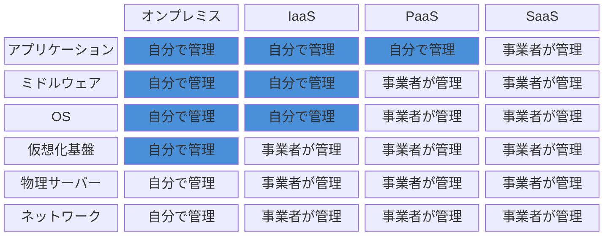
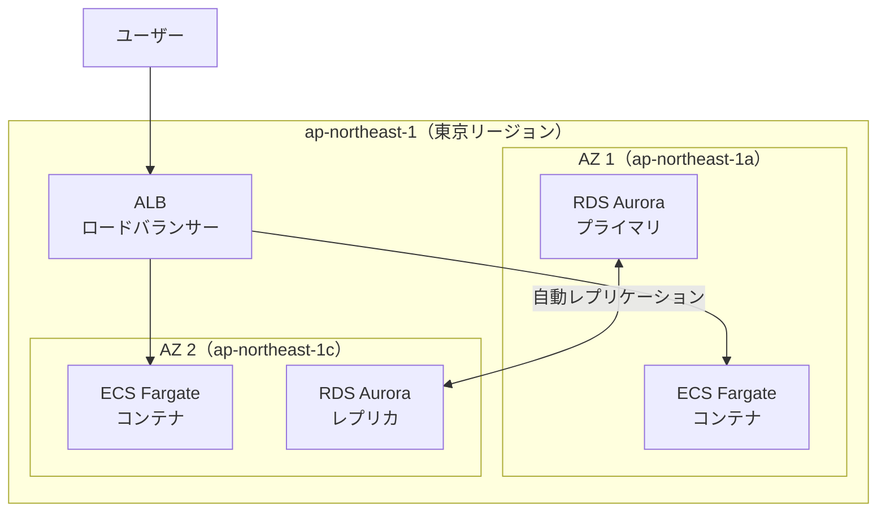

# 5-1-1 クラウドインフラの基礎概念

この Chapter「クラウドインフラの基礎と AWS アーキテクチャ」は以下の 4 セクションで構成されます。

| セクション | テーマ | 種類 |
|---|---|---|
| 5-1-1 | クラウドインフラの基礎概念 | 概念 |
| 5-1-2 | LMS の AWS アーキテクチャ全体像 | 概念 |
| 5-1-3 | コンテナオーケストレーション（ECS Fargate） | 概念 |
| 5-1-4 | CDN・ロードバランサー・ストレージ・データベース | 概念 |

**Chapter ゴール**: クラウドインフラの基礎概念と LMS の AWS 構成を理解する

📖 まず本セクションでクラウドインフラの基礎概念を学び、次に 5-1-2 で LMS の AWS アーキテクチャ全体像を把握します。5-1-3 では ECS Fargate によるコンテナオーケストレーションを、5-1-4 では CDN・ロードバランサー・ストレージ・データベースの各サービスを深掘りします。4 つのセクションを通して、LMS を支えるクラウドインフラの全体像が見えるようになります。

## 🎯 このセクションで学ぶこと

- **オンプレミス** と **クラウド** の違いを理解する
- **IaaS / PaaS / SaaS** の 3 層モデルと、それぞれの責任範囲を理解する
- AWS の主要サービスカテゴリ（コンピュート・ストレージ・ネットワーク・データベース）を把握する
- **リージョン** と **アベイラビリティゾーン** の概念を理解する

オンプレミスとクラウドの比較から出発し、サービスの分類モデルを経て、AWS の主要サービスカテゴリと地理的な構成を学びます。

---

## 導入: 開発環境の Docker と本番環境は何が違うのか

Part 1 で学んだように、LMS の開発環境は Docker Compose で構成されています。`docker compose up` を実行すれば、Laravel アプリケーション、Nginx、MySQL がローカルマシン上で動き出します。開発には十分です。

しかし、ここで疑問が生まれます。本番環境ではこれらのコンテナはどこで動いているのでしょうか。あなたの MacBook の上ではないことは確かです。では、どこかの物理的なサーバーの上でしょうか。そのサーバーは誰が管理しているのでしょうか。サーバーが壊れたらどうなるのでしょうか。アクセスが急増したらどう対処するのでしょうか。

これらの問いに答えるのが **クラウドインフラ** の知識です。LMS は **AWS**（Amazon Web Services）というクラウドプラットフォーム上で本番稼働しています。この Part 5 では、LMS を支えるクラウドインフラの全体像を理解していきます。

### 🧠 先輩エンジニアはこう考える

> 自分もバックエンドの開発から入ったので、最初は「Docker で動くならそれでいいのでは」と思っていました。でも実際に LMS を運用し始めると、「アクセスが増えたときにサーバーを増やしたい」「障害が起きたときに自動復旧してほしい」「デプロイを自動化したい」といった課題が次々に出てきます。これらはすべてインフラの領域です。クラウドの概念を理解してからは、「なぜこのサービスを使っているのか」「この設定は何を守っているのか」がわかるようになり、開発の判断にも自信が持てるようになりました。コードを書けなくても、構造を理解していれば Claude Code に的確な指示が出せます。

---

## オンプレミスとクラウドの違い

クラウドを理解するために、まずその対比にある **オンプレミス**（on-premises）を押さえましょう。

### オンプレミスとは

オンプレミスとは、自社でサーバー機器を購入・設置し、自前で管理する形態です。社内やデータセンターにラックサーバーを置き、ネットワーク機器を接続し、OS をインストールし、ミドルウェアを設定し、アプリケーションをデプロイします。

この方式では、ハードウェアの調達からメンテナンスまですべてが自分たちの責任です。サーバーが故障したら部品を交換し、容量が足りなくなったら新しいサーバーを発注して設置します。

### クラウドとは

クラウドとは、サーバーやネットワーク等のインフラ資源を、インターネット経由で必要な分だけ借りて使う形態です。物理サーバーはクラウド事業者（AWS, Google Cloud, Microsoft Azure 等）が保有・管理しており、利用者は Web コンソールや API を通じて仮想的なサーバーやストレージ、データベースを作成・削除できます。

Docker に置き換えて考えるとイメージしやすいかもしれません。Docker はローカルマシン上に仮想的な環境を作りますが、クラウドはこの「仮想化」をデータセンター規模で提供しているものです。

### 比較表

| 観点 | オンプレミス | クラウド |
|---|---|---|
| **初期コスト** | 高い（サーバー購入・設置工事） | 低い（アカウント作成で即利用可能） |
| **運用コスト** | 固定費（使わなくても費用発生） | 従量課金（使った分だけ支払い） |
| **スケーリング** | サーバーの追加購入が必要（数週間〜数ヶ月） | 数分〜数秒で拡張・縮小可能 |
| **可用性** | 自前で冗長構成を設計・構築 | クラウド事業者が高可用性の仕組みを提供 |
| **メンテナンス** | ハードウェア故障対応も自己責任 | 物理インフラの管理はクラウド事業者が担当 |
| **セキュリティ** | 物理・ネットワークともに自前で管理 | 物理セキュリティはクラウド事業者、論理セキュリティは利用者の責任 |

🔑 **キーポイント**: クラウドの最大の利点は **弾力性**（Elasticity）です。アクセスが増えればサーバーを自動的に増やし、減れば縮小する。必要な分だけ使って、使った分だけ支払う。この柔軟性がスタートアップから大企業まで広くクラウドが採用される理由です。

💡 **TIP**: LMS のようなスタートアップのプロダクトでは、初期投資を抑えられることも大きなメリットです。サーバーを購入する代わりに、月額数万円から始められ、ユーザー数の増加に合わせてインフラを拡張できます。

---

## IaaS・PaaS・SaaS の 3 層モデル

クラウドサービスは、「どこまでをクラウド事業者が管理し、どこからを自分で管理するか」という責任範囲の違いによって、大きく 3 つの層に分類されます。

### 各層の説明

**IaaS**（Infrastructure as a Service）は、仮想サーバー・ストレージ・ネットワークといったインフラ基盤をサービスとして提供します。OS のインストールやミドルウェアの設定は利用者が行います。最も自由度が高い反面、管理すべき範囲も広くなります。

**PaaS**（Platform as a Service）は、アプリケーションの実行プラットフォームをサービスとして提供します。OS やミドルウェアの管理はクラウド事業者が行い、利用者はアプリケーションのデプロイと設定に集中できます。AWS の **マネージドサービス** と呼ばれるものの多くがここに該当します。

**SaaS**（Software as a Service）は、完成されたソフトウェアをサービスとして提供します。利用者はブラウザや API を通じて機能を利用するだけで、インフラやアプリケーションの管理は一切不要です。

### 責任範囲の違い

以下の Mermaid 図は、オンプレミス・IaaS・PaaS・SaaS それぞれにおける管理責任の分担を示しています。色付きの部分が利用者の責任範囲です。

上に行くほどアプリケーションに近く、下に行くほど物理インフラに近い層です。IaaS では OS より上が、PaaS ではアプリケーションだけが、SaaS では管理する範囲がほぼなくなります。

### LMS の技術スタックをこの分類にマッピング

LMS が利用する技術やサービスを IaaS / PaaS / SaaS に分類すると、以下のようになります。

| 分類 | サービス例 | LMS での役割 | 利用者の責任範囲 |
|---|---|---|---|
| **IaaS** | EC2, VPC, S3 | 仮想サーバー、ネットワーク、ストレージ | OS・ミドルウェア・アプリの管理 |
| **PaaS** | ECS Fargate, RDS Aurora, DynamoDB | コンテナ実行、データベース | アプリケーションの設定・デプロイ |
| **SaaS** | GitHub, SendGrid, HubSpot | ソースコード管理、メール送信、CRM | API を通じた利用のみ |

📝 **ノート**: LMS は PaaS 寄りの構成を多く採用しています。たとえば ECS Fargate はサーバーの管理が不要な「サーバーレス」コンテナ実行環境であり、RDS Aurora はデータベースエンジンのパッチ適用やバックアップを AWS が自動管理します。「サーバーの管理をできるだけ AWS に任せ、アプリケーション開発に集中する」という設計方針です。

💡 **TIP**: S3（Simple Storage Service）は IaaS に分類しましたが、実際には PaaS 的な側面もあります。ファイルを保存するだけで、ストレージサーバーの管理は不要です。このように、実際のサービスは 3 層モデルの境界をまたぐことがあります。分類の正確さよりも、「自分がどこまで管理する必要があるか」を把握するためのモデルとして使ってください。

---

## AWS の主要サービスカテゴリ

AWS は 200 以上のサービスを提供していますが、LMS で使用しているのはそのうちの一部です。ここでは、AWS のサービスを 6 つのカテゴリに分類し、LMS で使用するサービスを整理します。

### カテゴリ別の概要

**コンピュート**（計算資源）は、アプリケーションを実行するためのサービスです。

- **ECS Fargate**: Docker コンテナをサーバー管理なしで実行するサービス。LMS の Laravel バックエンドと Nginx がここで動いています。開発環境の `docker compose up` に相当する本番版と考えるとイメージしやすいです
- **Lambda**: 関数単位でコードを実行するサーバーレスサービス。LMS では現時点で主要な用途はありませんが、AWS のコンピュートサービスとして知っておくと AWS の全体像が掴みやすくなります

**ストレージ**（データ保管）は、ファイルやデータを保管するためのサービスです。

- **S3**（Simple Storage Service）: オブジェクトストレージ。LMS ではフロントエンドのビルド成果物（HTML/CSS/JS）や、ユーザーがアップロードする画像ファイルの保管に使われています

**ネットワーク**（通信制御）は、通信経路やアクセス制御を管理するサービスです。

- **VPC**（Virtual Private Cloud）: AWS 上に作る仮想的なプライベートネットワーク。LMS の各サービスはこの VPC 内に配置され、外部から直接アクセスできないように保護されています
- **CloudFront**: CDN（Content Delivery Network）。世界中のエッジロケーション（中継拠点）にコンテンツをキャッシュし、ユーザーに近い場所から高速に配信します。LMS ではフロントエンドの静的ファイルの配信と、バックエンド API へのリクエスト振り分けを担当しています
- **ALB**（Application Load Balancer）: アプリケーションへのリクエストを複数のコンテナに分散するロードバランサー。1 つのコンテナに負荷が集中しないようにします
- **Route 53**: DNS サービス。ドメイン名（例: `lms.example.com`）を IP アドレスに変換します

**データベース**（データ管理）は、構造化されたデータを管理するサービスです。

- **RDS Aurora**（MySQL 互換）: マネージドリレーショナルデータベース。開発環境で使っている MySQL の本番版です。バックアップ、パッチ適用、レプリケーションを AWS が自動管理します
- **DynamoDB**: マネージド NoSQL データベース。LMS ではセッション管理とキャッシュの保管に使われています

**セキュリティ**（認証・アクセス制御）は、AWS リソースへのアクセスを管理するサービスです。

- **IAM**（Identity and Access Management）: AWS リソースへのアクセス権限を管理。「誰が何のサービスにアクセスできるか」を制御します
- **Secrets Manager**: データベースのパスワードや API キー等の秘密情報を安全に管理するサービス。Laravel の `.env` に書くような機密情報を、暗号化された場所に保管します
- **Security Groups**: VPC 内の通信ルール。「このサービスにはポート 80 と 443 のみアクセスを許可する」といったファイアウォールの役割を果たします

**運用**（監視・デプロイ）は、アプリケーションの稼働状況を監視し、デプロイを自動化するサービスです。

- **CloudWatch**: ログの収集とメトリクス（CPU 使用率、メモリ等）の監視。Laravel のログもここに集約されます
- **CodeBuild**: ソースコードのビルドとテストを自動実行するサービス。Docker イメージのビルドと ECR へのプッシュを担当します
- **CodeDeploy**: アプリケーションのデプロイを自動化するサービス。LMS では Blue/Green デプロイ（新旧バージョンを切り替える方式）を実現しています

そのほか、**ECR**（Elastic Container Registry）は Docker イメージの保管庫です。開発環境ではローカルにビルドしたイメージをそのまま使いますが、本番ではビルドしたイメージを ECR にプッシュし、ECS Fargate がそこからイメージを取得して実行します。**SES**（Simple Email Service）はメール送信サービス、**Amplify** はフロントエンドのホスティングサービスです。

### LMS で使う AWS サービス一覧

| サービス | カテゴリ | LMS での用途 |
|---|---|---|
| **ECS Fargate** | コンピュート | Laravel + Nginx コンテナの実行 |
| **ECR** | コンピュート | Docker イメージの保管 |
| **S3** | ストレージ | フロントエンドビルド成果物・画像ファイルの保管 |
| **VPC** | ネットワーク | プライベートネットワークの構築 |
| **CloudFront** | ネットワーク | CDN 配信・リクエスト振り分け |
| **ALB** | ネットワーク | コンテナへのリクエスト分散 |
| **Route 53** | ネットワーク | DNS 管理 |
| **RDS Aurora** | データベース | MySQL 互換のリレーショナル DB |
| **DynamoDB** | データベース | セッション・キャッシュの保管 |
| **IAM** | セキュリティ | アクセス権限管理 |
| **Secrets Manager** | セキュリティ | 機密情報の管理 |
| **Security Groups** | セキュリティ | ネットワークアクセス制御 |
| **CloudWatch** | 運用 | ログ収集・メトリクス監視 |
| **CodeBuild** | 運用 | イメージビルド・テスト自動化 |
| **CodeDeploy** | 運用 | Blue/Green デプロイ |
| **SES** | メール | メール送信 |
| **Amplify** | ホスティング | フロントエンドのホスティング |

⚠️ **注意**: 初めて見ると AWS のサービス数に圧倒されるかもしれません。しかし、すべてを一度に覚える必要はありません。この一覧は「LMS がどのサービスを使っているか」のリファレンスとして、後のセクションで個々のサービスを学ぶときに立ち返ってください。

---

## リージョンとアベイラビリティゾーン

AWS のサービスは世界中のデータセンターで提供されています。AWS はこのデータセンター群を **リージョン** と **アベイラビリティゾーン**（AZ）という 2 つの階層で整理しています。

### リージョン

**リージョン** は、地理的に離れた場所に配置されたデータセンター群の単位です。東京、大阪、バージニア、フランクフルトなど、世界中に 30 以上のリージョンがあります。

LMS は **ap-northeast-1**（東京リージョン）で稼働しています。リージョンの選択は主に以下の観点で決まります。

- **レイテンシ**（通信遅延）: ユーザーに地理的に近いリージョンほど応答が速い。日本のユーザーが主な対象であれば東京リージョンが最適
- **法規制**: データの保管場所に関する法律の要件
- **サービスの提供状況**: すべてのリージョンで同じサービスが使えるとは限らない

### アベイラビリティゾーン（AZ）

**アベイラビリティゾーン**（AZ）は、1 つのリージョン内にある物理的に独立したデータセンター（群）です。東京リージョンには `ap-northeast-1a`、`ap-northeast-1c`、`ap-northeast-1d` の 3 つの AZ があります。

各 AZ は独立した電源、冷却装置、ネットワーク接続を持っており、1 つの AZ で障害が発生しても他の AZ には影響しません。これは、マンションの非常階段が複数あるようなものです。1 つの階段が使えなくなっても、別の階段で避難できます。

### Multi-AZ 構成による耐障害性

LMS の本番環境は **2 AZ 構成** を採用しています。これは、同じシステムを 2 つの AZ に分散配置することで、片方の AZ に障害が起きてもサービスを継続できるようにする構成です。

この図のポイントは以下のとおりです。

- **ALB** がリクエストを 2 つの AZ のコンテナに分散しているため、片方の AZ が停止してももう片方がリクエストを処理し続けます
- **RDS Aurora** はプライマリ（書き込み用）とレプリカ（読み取り用）を別の AZ に配置しています。プライマリに障害が発生した場合、レプリカが自動的にプライマリに昇格します（**フェイルオーバー**）
- この構成により、1 つのデータセンターが丸ごとダウンしても、ユーザーへのサービス提供が途切れないようになっています

🔑 **キーポイント**: リージョンは「どの国・地域にインフラを置くか」、AZ は「その地域の中でどう冗長性を確保するか」を決める概念です。LMS は東京リージョンの 2 つの AZ に跨がる構成を取ることで、可用性と耐障害性を確保しています。

### 🧠 先輩エンジニアはこう考える

> リージョンと AZ の概念は最初は抽象的に感じますが、実際に障害が起きるとその重要性がよくわかります。AWS では年に数回、特定の AZ で大小の障害が発生します。Multi-AZ 構成にしていれば「AZ-a で障害が発生しているが、サービスは AZ-c で稼働中なので影響なし」と落ち着いていられます。LMS が 2 AZ 構成を採用しているのは、教育サービスとしてレッスン中にダウンすることが許容されないためです。コストとのバランスを見て、3 AZ ではなく 2 AZ にしているのは現実的な判断です。

---

## ✨ まとめ

- **オンプレミス** は物理サーバーを自前で管理する形態、**クラウド** はインフラ資源を必要な分だけ借りて使う形態。クラウドの最大の利点は弾力性（Elasticity）と従量課金である
- **IaaS / PaaS / SaaS** は「どこまでを自分で管理するか」の責任範囲で分類される。LMS は PaaS（ECS Fargate, RDS Aurora 等のマネージドサービス）を中心に構成されている
- AWS のサービスは **コンピュート・ストレージ・ネットワーク・データベース・セキュリティ・運用** の 6 カテゴリに整理できる。LMS は 17 のサービスを組み合わせて本番環境を構築している
- **リージョン** は地理的なデータセンター群の単位（LMS は東京リージョン）、**AZ** はリージョン内の独立データセンター。LMS は 2 AZ 構成で耐障害性を確保している

---

次のセクションでは、これらの AWS サービスが LMS でどのように組み合わされているかを、リクエストフロー、各サービスの役割と接続関係、ネットワーク構成の観点から学びます。
