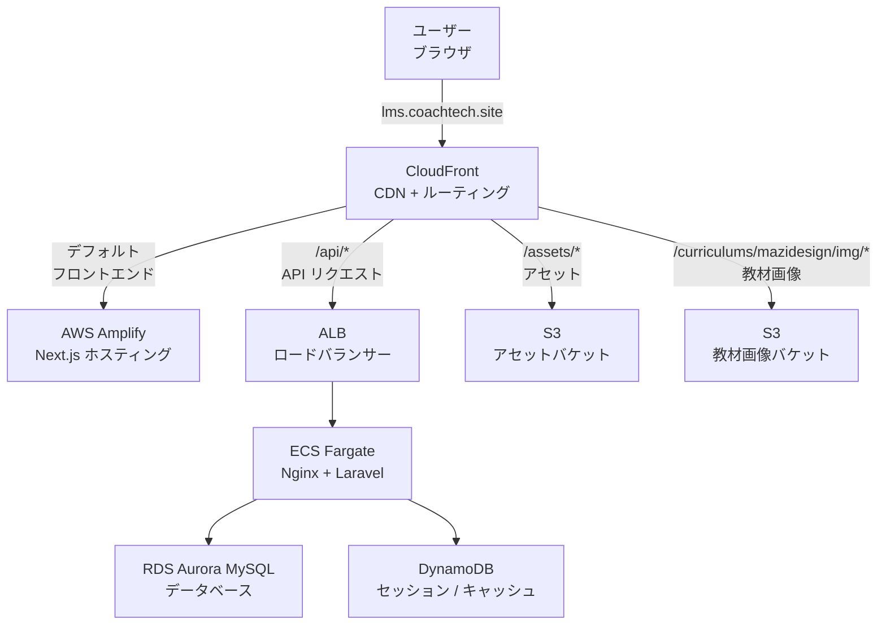
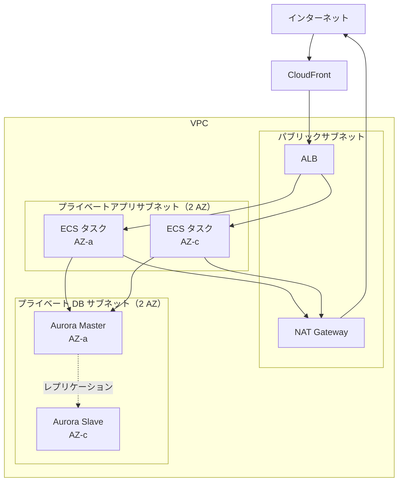

# 5-1-2 LMS の AWS アーキテクチャ全体像

📝 **前提知識**: このセクションはセクション 5-1-1（クラウドインフラの基礎概念）の内容を前提としています。

## 🎯 このセクションで学ぶこと

- LMS のリクエストフロー（CloudFront → ALB → ECS Fargate → RDS Aurora）の全体像を理解する
- 各 AWS サービスの役割と接続関係を把握する
- ネットワーク構成（VPC・サブネット・セキュリティグループ）による多層防御の仕組みを理解する
- Production と Staging の構成差分を把握する

セクション 5-1-1 で学んだクラウドインフラの基礎概念を土台に、LMS が実際にどのような AWS アーキテクチャで動いているかを俯瞰します。

---

## 導入: ユーザーが LMS の URL にアクセスしたとき、裏側で何が起きているのか

あなたが `lms.coachtech.site` にブラウザでアクセスしたとき、画面が表示されるまでの間に何が起きているでしょうか。ローカル開発環境では `localhost` にアクセスすれば Docker コンテナが直接リクエストを処理しますが、本番環境ではその間に複数の AWS サービスが連携しています。

CDN がリクエストを受け取り、パスに応じてフロントエンドアプリ・API サーバー・静的ファイルのいずれかに振り分ける。API リクエストはロードバランサーを経由してコンテナに届き、コンテナ内の Nginx が Laravel に処理を渡す。Laravel はデータベースからデータを取得し、レスポンスを返す。この一連の流れが、ユーザーには一瞬で完了しているように見えます。

このセクションでは、この「裏側」の全体像を掴みます。個別の AWS サービスの詳細は後のセクションで学びますが、まずは **地図** を手に入れることが重要です。

### 🧠 先輩エンジニアはこう考える

> インフラの学習で最もありがちな失敗は、いきなり個別のサービス（ECS の設定方法、RDS のパラメータ等）に飛び込んでしまうことです。個別の知識を積み上げても、全体の中でそのサービスがどこに位置し、何とつながっているかが分からなければ、トラブル時に原因の切り分けができません。「CloudFront のログにエラーが出ている」と言われたときに、それが ALB の問題なのか ECS の問題なのか RDS の問題なのかを判断するには、リクエストフロー全体の地図が頭に入っている必要があります。まずは大きな絵を描いてから、各パーツの詳細に入りましょう。


---

## LMS のリクエストフロー全体像

LMS では、すべてのトラフィックが **CloudFront**（CDN）を経由します。CloudFront は単一ドメイン `lms.coachtech.site` への全リクエストを受け取り、URL のパスに応じて 4 つの経路に振り分けます。



### 経路 1: フロントエンド（デフォルト）

4 つの特定パスに該当しないリクエストは、すべて **AWS Amplify** にルーティングされます。Amplify は Next.js 14 のフロントエンドアプリケーションをホスティングしており、React で構築された画面の HTML・JavaScript・CSS を返します。

CloudFront の設定では、これが `default_cache_behavior`（デフォルトキャッシュビヘイビア）として定義されています。つまり、特別なパスパターンに一致しないすべてのリクエストが Amplify に向かいます。

以下は主要部分の抜粋です。

```hcl
# infra/stacks/modules/cdn/cloudfront.tf（該当部分）
default_cache_behavior {
  target_origin_id         = local.amplify_origin_id
  viewer_protocol_policy   = "redirect-to-https"
  cache_policy_id          = data.aws_cloudfront_cache_policy.caching_disabled.id
}
```

💡 **TIP**: フロントエンドのキャッシュが `caching_disabled`（キャッシュ無効）になっている点に注目してください。Next.js はサーバーサイドレンダリング（SSR）やサーバーコンポーネントを使用するため、リクエストごとに異なるレスポンスを返す可能性があります。そのため、CloudFront ではキャッシュせずに毎回 Amplify にリクエストを転送しています。

### 経路 2: API リクエスト（`/api/*`）

フロントエンドから発行される API リクエスト（`/api/*`）は、**ALB**（Application Load Balancer）を経由して **ECS Fargate** のコンテナに届きます。コンテナ内では Nginx がリクエストを受け取り、Laravel の PHP-FPM に処理を渡します。Laravel はビジネスロジックを実行し、必要に応じて **RDS Aurora MySQL** からデータを取得してレスポンスを返します。

以下は主要部分の抜粋です。

```hcl
# infra/stacks/modules/cdn/cloudfront.tf（該当部分）
ordered_cache_behavior {
  path_pattern             = "/api/*"
  target_origin_id         = local.alb_origin_id
  viewer_protocol_policy   = "redirect-to-https"
  cache_policy_id          = data.aws_cloudfront_cache_policy.caching_disabled.id
}
```

API リクエストもキャッシュは無効です。API のレスポンスはユーザーごと、リクエストごとに異なるため、キャッシュすると古いデータを返してしまう恐れがあります。

### 経路 3: アセット（`/assets/*`）

ユーザーのプロフィール画像や教材の添付ファイルなどのアセットは、**S3** バケット（`coachtech-lms-bucket`）から直接配信されます。

以下は主要部分の抜粋です。

```hcl
# infra/stacks/modules/cdn/cloudfront.tf（該当部分）
ordered_cache_behavior {
  path_pattern             = "/assets/*"
  target_origin_id         = local.s3_origin_id
  viewer_protocol_policy   = "redirect-to-https"
  cache_policy_id          = data.aws_cloudfront_cache_policy.caching_optimized.id
}
```

アセットは `caching_optimized`（キャッシュ最適化）が適用されています。画像やファイルは頻繁に変わらないため、CloudFront のエッジサーバーにキャッシュすることで、S3 へのアクセス回数を減らし、ユーザーへのレスポンスを高速化しています。

### 経路 4: 教材画像（`/curriculums/mazidesign/img/*`）

マジデザインの教材画像は、アセットとは別の S3 バケットから配信されます。経路 3 と同様にキャッシュが最適化されています。

以下は主要部分の抜粋です。

```hcl
# infra/stacks/modules/cdn/cloudfront.tf（該当部分）
ordered_cache_behavior {
  path_pattern             = "/curriculums/mazidesign/img/*"
  target_origin_id         = local.mazidesign_s3_origin_id
  cache_policy_id          = data.aws_cloudfront_cache_policy.caching_optimized.id
}
```

🔑 **キーポイント**: CloudFront が全リクエストの入口として機能し、パスベースのルーティングで適切なバックエンドに振り分けるという構成は、LMS アーキテクチャの基本構造です。「すべてのトラフィックは CloudFront を通る」と覚えておいてください。

---

## 各 AWS サービスの役割と接続関係

LMS で使用している主要な AWS サービスの一覧です。各サービスが何を担当し、LMS でどのように設定されているかを把握しましょう。

| サービス | 役割 | LMS での具体的な設定 |
|---|---|---|
| **CloudFront** | CDN + パスベースルーティング | 単一ドメインで 4 経路に振り分け |
| **Amplify** | フロントエンドホスティング | Next.js 14 アプリの SSR 実行環境 |
| **ALB** | ロードバランシング + Blue/Green デプロイ | パブリックサブネットに配置。2 つのターゲットグループで Blue/Green 切り替え |
| **ECS Fargate** | コンテナ実行基盤 | Nginx + Laravel PHP-FPM のサイドカー構成 |
| **ECR** | Docker イメージレジストリ | `nginx` と `laravel` の 2 リポジトリ |
| **RDS Aurora MySQL** | メインデータベース | Aurora MySQL 8.0 互換。クラスターエンドポイントで接続 |
| **DynamoDB** | セッションとキャッシュ | `lms-{env}-new-session` と `lms-{env}-new-cache` の 2 テーブル |
| **S3** | アセットストレージ | `coachtech-lms-bucket`（Production） |
| **Secrets Manager** | 機密情報管理 | DB パスワード、APP_KEY、HubSpot トークン、LINE 認証情報、Slack Bot トークン |
| **CloudWatch** | ログ・メトリクス | ECS コンテナログ、CloudFront アクセスログ |
| **SES** | メール送信 | `no-reply@lms.estra.jp` からのメール送信 |
| **CodeBuild / CodeDeploy** | ビルド・デプロイ | Docker イメージのビルドと Blue/Green デプロイ |

📝 **ノート**: **DynamoDB** をセッションとキャッシュに使っている理由を補足します。ローカル開発環境では Laravel のセッションをファイルに、キャッシュを Redis に保存するのが一般的です。しかし、ECS Fargate では複数のコンテナが起動するため、ファイルベースのセッションではコンテナ間でセッションを共有できません。DynamoDB はサーバーレスのキーバリューストアで、複数コンテナから同じセッションデータにアクセスできます。LMS の `config/session.php` で `SESSION_DRIVER=dynamodb` と設定することで、Laravel が DynamoDB をセッションストレージとして使用します。

---

## ネットワーク構成（VPC・サブネット・セキュリティグループ）

AWS のネットワーク構成は、インフラの中でも特に重要な部分です。LMS では、外部からアクセスできる領域と、外部から完全に隔離された領域を明確に分けています。

### VPC とサブネット

**VPC**（Virtual Private Cloud）は、AWS 上に作る仮想的なネットワーク空間です。自分専用のプライベートなネットワークを AWS 内に持つイメージです。LMS の全リソースはこの VPC の中に配置されます。

VPC の中はさらに **サブネット** という小さなネットワーク区画に分割されます。サブネットには 2 種類あります。

- **パブリックサブネット**: インターネットと直接通信できる領域
- **プライベートサブネット**: インターネットから直接アクセスできない領域

LMS では、以下の 3 層のサブネット構成を採用しています。



各サブネットに配置されるリソースと、そのCIDR ブロック（IP アドレスの範囲）は以下のとおりです。

| サブネット | 配置リソース | Production CIDR | Staging CIDR |
|---|---|---|---|
| パブリック | ALB, NAT Gateway | 共有 VPC で管理 | 共有 VPC で管理 |
| プライベートアプリ（AZ-a） | ECS タスク | 10.4.2.0/24 | 10.3.2.0/24 |
| プライベートアプリ（AZ-c） | ECS タスク | 10.4.3.0/24 | 10.3.3.0/24 |
| プライベート DB（AZ-a） | Aurora Master | 10.4.4.0/24 | 10.3.4.0/24 |
| プライベート DB（AZ-c） | Aurora Slave | 10.4.5.0/24 | 10.3.5.0/24 |

💡 **TIP**: **AZ**（Availability Zone）とは、AWS リージョン内にある物理的に独立したデータセンター群のことです。LMS では `ap-northeast-1a`（東京リージョン AZ-a）と `ap-northeast-1c`（AZ-c）の 2 つの AZ にリソースを分散配置しています。1 つの AZ で障害が発生しても、もう 1 つの AZ で処理を継続できる可用性の高い構成です。

### セキュリティグループ（ファイアウォール）

**セキュリティグループ** は、各リソースに対するファイアウォールです。「このリソースには、どこからの、どのポートの通信を許可するか」を定義します。

LMS では 3 つのセキュリティグループでトラフィックを段階的にフィルタリングしています。

| セキュリティグループ | 許可するインバウンド | 適用対象 |
|---|---|---|
| **ELB SG** | CloudFront からの HTTPS（443）のみ | ALB |
| **App SG** | ALB からの HTTP（80）のみ | ECS タスク |
| **DB SG** | ECS からの MySQL（3306）のみ | RDS Aurora |

この構成は **多層防御** と呼ばれます。トラフィックは以下のように 3 つの関門を通過する必要があります。

```text
CloudFront → [ELB SG: 443 のみ] → ALB → [App SG: 80 のみ] → ECS → [DB SG: 3306 のみ] → RDS
```

仮に ALB に直接アクセスしようとしても、ELB SG が CloudFront からの通信しか許可していないため拒否されます。同様に、ECS のコンテナに直接アクセスしようとしても、App SG が ALB からの通信しか許可しないため拒否されます。データベースは最も深い層に配置され、ECS からの MySQL ポートの通信のみを受け入れます。

実際の Terraform コードを見ると、セキュリティグループの設定がどのように定義されているかが分かります。

```hcl
# infra/stacks/modules/network/security_groups.tf（主要部分の抜粋）

# ELB SG: CloudFront からの HTTPS のみ許可
resource "aws_security_group_rule" "from_cf_to_elb" {
  type              = "ingress"
  security_group_id = aws_security_group.elb.id
  prefix_list_ids   = [data.aws_ec2_managed_prefix_list.cloudfront.id]
  from_port         = var.https_port  # 443
  to_port           = var.https_port
  protocol          = var.tcp
}

# App SG: ALB からの HTTP のみ許可
resource "aws_security_group_rule" "from_elb_to_app" {
  type                     = "ingress"
  security_group_id        = aws_security_group.app.id
  source_security_group_id = aws_security_group.elb.id
  from_port                = var.http_port  # 80
  to_port                  = var.http_port
  protocol                 = var.tcp
}

# DB SG: ECS からの MySQL ポートのみ許可
resource "aws_security_group_rule" "app_to_target_rds" {
  type                     = "ingress"
  security_group_id        = aws_security_group.db.id
  source_security_group_id = aws_security_group.app.id
  from_port                = var.db_port  # 3306
  to_port                  = var.db_port
  protocol                 = var.tcp
}
```

📝 **ノート**: `prefix_list_ids` に CloudFront のマネージドプレフィックスリストを指定している点に注目してください。これは AWS が管理する CloudFront の IP アドレス範囲のリストです。IP アドレスを個別に指定するのではなく、AWS が提供する公式リストを参照することで、CloudFront の IP アドレスが変更されても自動的に追従します。

### NAT Gateway とVPC エンドポイント

プライベートサブネットはインターネットから直接アクセスできない反面、プライベートサブネット内のリソースからインターネットにアクセスしたい場合があります。たとえば、ECS コンテナから外部 API（Google Calendar、Slack、LINE 等）を呼び出す場合です。

この問題を解決するのが **NAT Gateway** です。NAT Gateway はパブリックサブネットに配置され、プライベートサブネットからのインターネット向け通信を中継します。外部 API への通信は NAT Gateway を経由してインターネットに出ますが、インターネットからプライベートサブネットへの直接アクセスは引き続き遮断されます。

```hcl
# infra/stacks/modules/network/route_tables.tf（該当部分）
resource "aws_route" "private_app" {
  count = length(aws_subnet.private_app)

  route_table_id         = aws_route_table.private_app[count.index].id
  destination_cidr_block = var.default_route
  nat_gateway_id = (var.is_production
    ? element(var.nat_gateway_ids, count.index)
    : var.nat_gateway_ids[0]  # 本番環境以外では NAT Gateway は 1 つ
  )
}
```

Production では AZ ごとに NAT Gateway を配置し、片方の NAT Gateway に障害が発生しても通信が継続できるようにしています。Staging ではコスト削減のため NAT Gateway を 1 つに共有しています。

一方、S3 や DynamoDB のような AWS 内部のサービスへのアクセスは、NAT Gateway を経由する必要がありません。**VPC エンドポイント**（ゲートウェイ型）を使うことで、AWS のネットワーク内で直接通信できます。これにより NAT Gateway の通信料金を節約し、さらにレイテンシも低減できます。

```hcl
# infra/stacks/modules/network/route_tables.tf（該当部分）
resource "aws_vpc_endpoint_route_table_association" "dynamodb" {
  count           = length(aws_subnet.private_app)
  vpc_endpoint_id = var.gateway_vpce_ids["dynamodb"]
  route_table_id  = aws_route_table.private_app[count.index].id
}

resource "aws_vpc_endpoint_route_table_association" "s3" {
  count           = length(aws_subnet.private_app)
  vpc_endpoint_id = var.gateway_vpce_ids["s3"]
  route_table_id  = aws_route_table.private_app[count.index].id
}
```

LMS では **DynamoDB** と **S3** への VPC エンドポイントが設定されています。セッション管理（DynamoDB）やファイルアップロード（S3）は頻繁に発生する処理であるため、VPC エンドポイントによる直接接続がパフォーマンスとコストの両面で効果的です。

---

## Production と Staging の構成差分

LMS では、Production（本番）と Staging（検証）の 2 つの環境を運用しています。基本的なアーキテクチャは同じですが、可用性・パフォーマンス・コストのバランスを環境ごとに調整しています。

| 項目 | Production | Staging |
|---|---|---|
| **ドメイン** | lms.coachtech.site | stag-new.coachtech.site |
| **ECS CPU / メモリ** | 1024 / 2048 MiB | 256 / 512 MiB |
| **ECS タスク数** | 2（冗長構成） | 1 |
| **DB インスタンス** | db.t3.medium（Master + Slave） | db.serverless（自動一時停止あり） |
| **NAT Gateway** | AZ ごとに 1 つ（冗長） | 共有（1 つ） |
| **バッチ実行頻度** | 5 分ごと | 1 時間ごと |
| **Git ブランチ** | main | staging |
| **ログレベル** | error | notice |

🔑 **キーポイント**: Staging 環境では **Aurora Serverless v2** が使われており、`seconds_until_auto_pause = 300`（5 分で自動停止）が設定されています。アクセスがないときはデータベースが自動的に停止してコストを抑え、アクセスが来ると自動で起動します。Production では安定したレスポンスタイムが求められるため、常時起動の固定インスタンス（`db.t3.medium`）を使用しています。

```hcl
# infra/stacks/modules/db/rds.tf（該当部分）
# Staging のみ適用される Serverless v2 設定
dynamic "serverlessv2_scaling_configuration" {
  for_each = var.is_production ? [] : [1]
  content {
    min_capacity             = var.rds_serverless_min_acu
    max_capacity             = var.rds_serverless_max_acu
    seconds_until_auto_pause = 300  # 5 分で自動停止
  }
}
```

Production の ECS タスク数が 2 である理由も重要です。2 つのタスクが 2 つの AZ に分散配置されるため、1 つの AZ で障害が発生しても、もう 1 つの AZ のタスクがリクエストを処理し続けます。Staging は検証用途なのでタスク 1 つで十分です。

```hcl
# infra/stacks/modules/application/ecs.tf（該当部分）
resource "aws_ecs_service" "app" {
  desired_count = var.is_production ? 2 : 1  # 本番環境のみ冗長構成
}
```

### 🧠 先輩エンジニアはこう考える

> Production と Staging で構成を変える判断基準は「その差分でどれだけコストを節約できるか」と「その差分が検証の信頼性に影響するか」のバランスです。CPU やメモリの差は検証に大きな影響を与えないので Staging では最小スペックにしています。一方で、ネットワーク構成やセキュリティグループは Production と Staging で同一にしています。なぜなら、ネットワーク周りの設定ミスは本番デプロイ時に重大なインシデントを起こす可能性があるため、Staging で本番と同じ構成で検証する必要があるからです。

---

## ✨ まとめ

- LMS のすべてのトラフィックは **CloudFront** を経由し、パスパターンに応じて Amplify（フロントエンド）、ALB → ECS（API）、S3（アセット・教材画像）の 4 経路に振り分けられる
- 各 AWS サービスは明確な役割を持ち、CloudFront → ALB → ECS Fargate → RDS Aurora というリクエストフローを形成している。セッションとキャッシュには DynamoDB、機密情報には Secrets Manager を使用する
- ネットワークは VPC 内にパブリック・プライベートアプリ・プライベート DB の 3 層サブネットで構成され、セキュリティグループによる多層防御でリソースを保護している
- NAT Gateway はプライベートサブネットから外部 API への通信を中継し、VPC エンドポイントは S3・DynamoDB への直接接続でコストとレイテンシを最適化している
- Production と Staging は同一アーキテクチャをベースに、スペック・冗長性・コストのバランスを環境ごとに調整している

---

次のセクションでは、リクエストフローの中心にある ECS Fargate について、クラスター・サービス・タスク定義の階層構造、Fargate のサーバーレスコンテナ実行、LMS の Nginx + Laravel サイドカーパターンを詳しく学びます。
