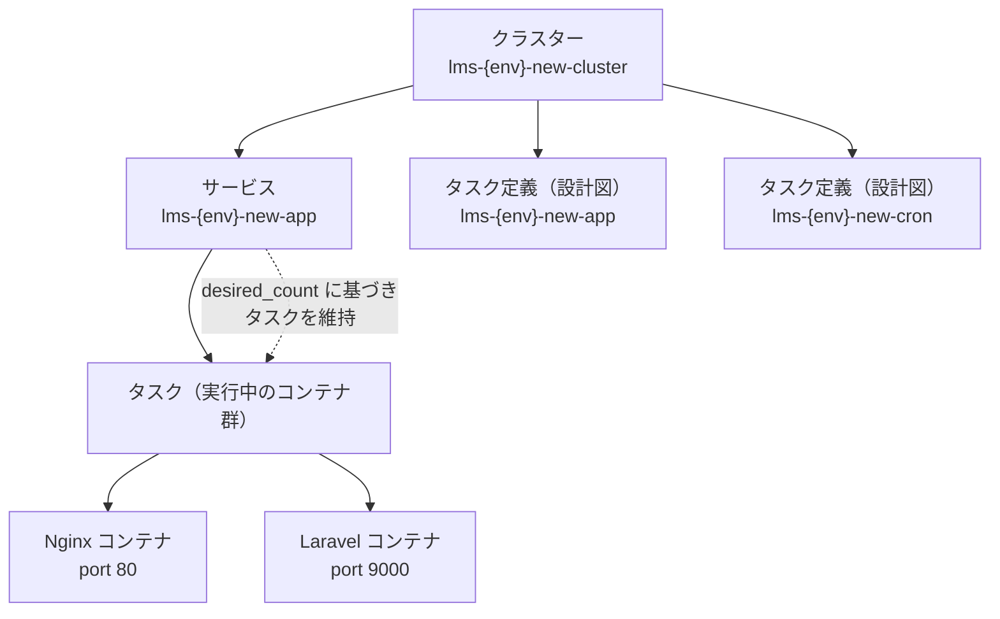
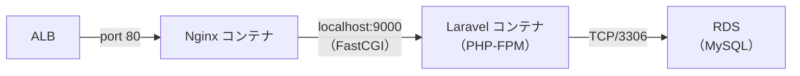
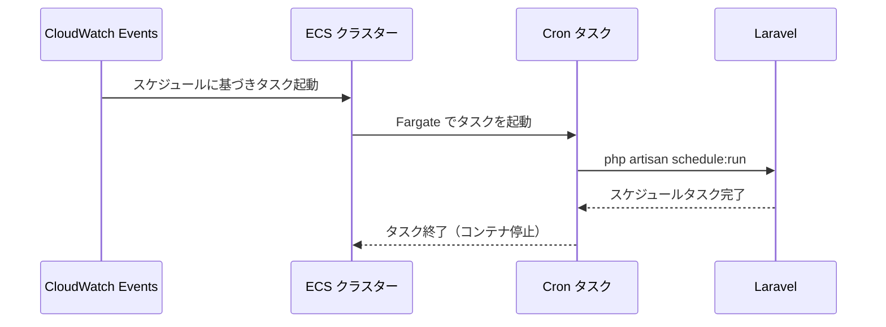
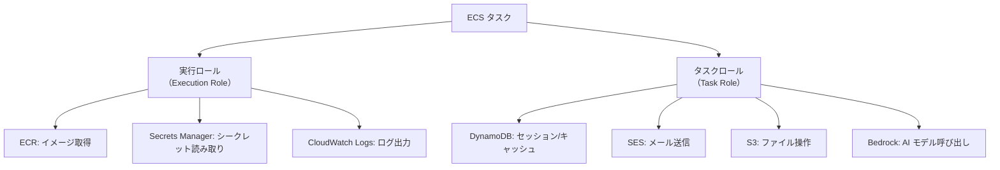

# 5-1-3 コンテナオーケストレーション（ECS Fargate）

📝 **前提知識**: このセクションはセクション 5-1-2（LMS の AWS アーキテクチャ全体像）および COACHTECH 教材 tutorial-6（Docker 基礎）の内容を前提としています。

## 🎯 このセクションで学ぶこと

- コンテナオーケストレーションが解決する問題と、Docker Compose との根本的な違いを理解する
- ECS の 3 層構造（クラスター、サービス、タスク定義）の役割と関係を理解する
- Fargate によるサーバーレスコンテナ実行の仕組みを理解する
- LMS の ECS 構成（Nginx + Laravel のサイドカーパターン、バッチタスク）を Terraform コードから読み解く

Docker Compose でのコンテナ管理から出発し、本番環境で必要なコンテナオーケストレーションの全体像を学んだ後、LMS の実際の ECS 構成を Terraform コードで確認していきます。

---

## 導入: 「docker-compose up」の先にあるもの

Docker Compose は開発環境で非常に便利なツールです。`docker-compose up` の一発で Nginx、Laravel、MySQL のコンテナが立ち上がり、ローカルで動作確認ができます。しかし、ここで 1 つの問いが生まれます。

**本番環境では、誰がコンテナを起動し、落ちたら再起動し、複数台に分散してくれるのでしょうか。**

開発環境では自分の PC 上で `docker-compose up` を実行し、問題があれば `docker-compose restart` で手動復旧できます。しかし本番環境では、24 時間 365 日の稼働が求められます。深夜にコンテナがクラッシュしたとき、手動で再起動するわけにはいきません。アクセスが急増したとき、手動でコンテナを増やすのも現実的ではありません。

この「本番でのコンテナ管理」を自動化するのが、コンテナオーケストレーションです。

### 🧠 先輩エンジニアはこう考える

> LMS の開発環境では Docker Compose を使っていて、`docker-compose up -d` で全コンテナが立ち上がります。最初は「本番でもこれを使えばいいのでは？」と思いました。でも実際には、本番環境では全く別の仕組みが必要です。Docker Compose は単一のサーバー上でしか動かないし、コンテナが落ちても自動で復旧してくれません。ECS に移行して何が変わったかというと、「コンテナの面倒を見る仕事」がほぼなくなりました。デプロイすれば ECS が自動でコンテナを入れ替えてくれるし、ヘルスチェックに失敗したコンテナは自動で再起動されます。開発者はアプリケーションのコードに集中できるようになったんです。

---

## コンテナオーケストレーションとは

### Docker Compose の限界

Docker Compose は開発環境では十分ですが、本番環境で使うには 3 つの大きな制約があります。

| 制約 | 内容 |
|---|---|
| **単一サーバー** | 1 台のマシン上でしかコンテナを管理できない。サーバーが故障すると全サービスが停止する |
| **自動復旧なし** | コンテナがクラッシュしても自動で再起動されない。`restart: always` は同一サーバー内での簡易的な対策に過ぎない |
| **スケーリング不可** | アクセス増加時にコンテナ数を動的に増減させる仕組みがない |

### コンテナオーケストレーションが解決する問題

コンテナオーケストレーションは、複数のサーバーにまたがるコンテナの管理を自動化する仕組みです。具体的には以下の 4 つの問題を解決します。

🔑 **配置（Scheduling）**: どのサーバーでコンテナを起動するかを自動的に判断します。CPU やメモリの空き状況を見て、最適なサーバーにコンテナを配置します。

🔑 **スケーリング（Scaling）**: 負荷に応じてコンテナの数を増減します。アクセスが増えたらコンテナを追加し、減ったら削除することで、リソースを効率的に使います。

🔑 **ヘルスチェック（Health Check）**: コンテナが正常に動作しているかを定期的に確認します。異常を検知したらそのコンテナを停止し、新しいコンテナを起動して自動復旧します。

🔑 **ローリングアップデート（Rolling Update）**: アプリケーションを更新する際、古いコンテナと新しいコンテナを段階的に入れ替えます。ダウンタイムなしでデプロイできます。

### Kubernetes と ECS の選択

コンテナオーケストレーションのツールとして代表的なのは **Kubernetes**（通称 K8s）と **Amazon ECS** の 2 つです。

| 項目 | Kubernetes | ECS |
|---|---|---|
| 提供元 | OSS（Google 発） | AWS マネージドサービス |
| 学習コスト | 高い（独自の概念が多い） | 比較的低い（AWS に統合） |
| 柔軟性 | 非常に高い | AWS エコシステム内で十分 |
| 運用負荷 | 高い（コントロールプレーンの管理が必要） | 低い（AWS が管理） |

LMS では **ECS** を採用しています。理由はシンプルで、LMS のインフラはすべて AWS 上に構築されており、ECS は ALB（ロードバランサー）、CloudWatch（監視）、Secrets Manager（シークレット管理）といった AWS サービスとネイティブに連携できるためです。Kubernetes ほどの柔軟性は必要なく、AWS エコシステムの中で完結するシンプルな構成が LMS の規模に適しています。

---

## ECS の 3 層構造

ECS は **クラスター**、**サービス**、**タスク定義** の 3 層で構成されています。この階層関係を理解することが、ECS を理解する第一歩です。



### クラスター: コンテナの論理グループ

**クラスター** は、ECS でコンテナを管理するための最上位の論理グループです。1 つのクラスターの中に、複数のサービスやタスクを配置できます。

LMS では環境ごとに 1 つのクラスターを持っています。

```hcl
# infra/stacks/modules/application/ecs.tf
resource "aws_ecs_cluster" "main" {
  name = "${var.name_prefix}-cluster"
}
```

`name_prefix` は `lms-{env}-new` という形式なので、本番環境では `lms-production-new-cluster`、ステージング環境では `lms-staging-new-cluster` というクラスター名になります。

💡 クラスター自体はコンテナを実行する「場所」を提供するわけではありません。あくまで管理上のグルーピングです。実際のコンテナ実行基盤は、後述する Fargate が担います。

### サービス: タスクの数を維持する仕組み

**サービス** は、指定した数のタスク（コンテナ群）を常に維持してくれる仕組みです。コンテナがクラッシュしたら自動で新しいタスクを起動し、常に指定数を保ちます。

```hcl
# infra/stacks/modules/application/ecs.tf
resource "aws_ecs_service" "app" {
  name            = "${var.name_prefix}-app"
  cluster         = aws_ecs_cluster.main.id
  task_definition = data.aws_ecs_task_definition.app.arn
  desired_count   = var.is_production ? 2 : 1
  launch_type     = "FARGATE"

  network_configuration {
    subnets          = var.private_app_subnet_ids
    security_groups  = [var.app_sg_id]
    assign_public_ip = false
  }

  deployment_controller {
    type = "CODE_DEPLOY"
  }

  load_balancer {
    target_group_arn = var.alb_target_group_arn
    container_name   = var.container_name_nginx
    container_port   = var.container_port_nginx
  }
}
```

このコードから読み取れるポイントを整理します。

- **`desired_count`**: 本番環境では `2`、ステージング環境では `1` に設定されています。本番環境で 2 タスクを維持するのは、1 つのタスクに障害が発生しても、もう 1 つがリクエストを処理し続けられるようにするためです
- **`launch_type = "FARGATE"`**: コンテナの実行基盤として Fargate を使用します（詳細は次の節で解説します）
- **`network_configuration`**: タスクはプライベートサブネットに配置され、パブリック IP は付与されません。インターネットからの直接アクセスは ALB を経由します
- **`deployment_controller = "CODE_DEPLOY"`**: デプロイ方式として AWS CodeDeploy を使用しています。これにより Blue/Green デプロイ（旧バージョンと新バージョンを切り替える方式）が可能になります
- **`load_balancer`**: ALB のターゲットグループと紐づけ、Nginx コンテナのポート 80 にトラフィックを振り分けます

### タスク定義: コンテナの設計図

**タスク定義** は、どのコンテナをどのような設定で起動するかを記述した「設計図」です。Docker Compose の `docker-compose.yml` に相当するものと考えてください。タスク定義には、使用するコンテナイメージ、CPU/メモリの割り当て、環境変数、ポートマッピングなどを記述します。

タスク定義の具体的な内容は、後続の節で詳しく見ていきます。

### Docker Compose との対比

Docker Compose の概念と ECS の概念を対比すると、以下のようになります。

| Docker Compose | ECS | 説明 |
|---|---|---|
| `docker-compose.yml` | タスク定義 | コンテナの構成を定義する設計図 |
| `services:` 配下の定義 | コンテナ定義（タスク定義内） | 個々のコンテナの設定 |
| `docker-compose up` | サービスの作成 | コンテナを起動し、維持する |
| なし | クラスター | 管理上の論理グループ |
| なし | desired_count | コンテナ数の自動維持 |
| `restart: always` | サービスによる自動復旧 | 異常時の自動再起動 |

Docker Compose にはクラスターや desired_count に相当する概念がありません。これが「Docker Compose は本番環境では使えない」と言われる理由です。ECS のサービスは、指定した数のタスクを自動的に維持し、異常があれば復旧するという、本番運用に不可欠な機能を提供しています。

---

## Fargate: サーバーレスコンテナ実行

### EC2 起動タイプと Fargate の違い

ECS でコンテナを動かすには、「どこで動かすか」を選ぶ必要があります。選択肢は 2 つです。

| 項目 | EC2 起動タイプ | Fargate |
|---|---|---|
| サーバー管理 | 自分で EC2 インスタンスを管理 | AWS が管理（サーバーレス） |
| OS パッチ適用 | 自分で実施 | 不要 |
| スケーリング | EC2 のスケーリング + タスクのスケーリング | タスクのスケーリングのみ |
| 課金 | EC2 インスタンスの時間課金 | タスク単位の CPU/メモリ課金 |
| 柔軟性 | 高い（GPU、特殊なカーネル設定等） | 標準的なワークロード向け |

LMS では **Fargate** を採用しています。Fargate を使うと、コンテナを動かすサーバー（EC2 インスタンス）を自分で管理する必要がありません。「どのサーバーにコンテナを配置するか」「サーバーの OS パッチを当てるか」といった運用作業から解放され、アプリケーションコンテナの管理だけに集中できます。

### awsvpc ネットワークモード

Fargate を使う場合、ネットワークモードは **awsvpc** が必須です。LMS のタスク定義でも `network_mode = "awsvpc"` が指定されています。

```hcl
# infra/stacks/modules/application/ecs.tf
resource "aws_ecs_task_definition" "app" {
  family                   = "${var.name_prefix}-app"
  requires_compatibilities = ["FARGATE"]
  network_mode             = "awsvpc"
  # ...
}
```

awsvpc モードでは、各タスクが独自の **ENI**（Elastic Network Interface、仮想ネットワークカード）を持ちます。これにより、各タスクが固有のプライベート IP アドレスを持ち、セキュリティグループを直接適用できます。

💡 Docker Compose ではコンテナ間の通信に Docker のブリッジネットワークを使いますが、ECS Fargate では AWS の VPC ネットワークを直接使います。この違いは、後述するサイドカーパターンでのコンテナ間通信に影響します。

### LMS の Fargate リソース設定

LMS では環境ごとに異なるリソースをタスクに割り当てています。

| 環境 | CPU（vCPU 単位） | メモリ（MiB） |
|---|---|---|
| Production | 1024（1 vCPU） | 2048（2 GB） |
| Staging | 256（0.25 vCPU） | 512（0.5 GB） |

Staging 環境はコスト削減のため最低スペックに抑えられています。Fargate はタスク単位の課金なので、使用する CPU とメモリに比例して料金が発生します。本番環境では十分なリソースを確保しつつ、ステージング環境ではコストを最小化するという運用が可能です。

---

## LMS のサイドカーパターン

### サイドカーパターンとは

ECS のタスク定義では、1 つのタスクの中に複数のコンテナを配置できます。メインのアプリケーションコンテナに、補助的な役割を持つコンテナを「横に付ける」構成を **サイドカーパターン** と呼びます。バイクの横に取り付けるサイドカー（側車）に由来する名前です。

LMS では、1 つのタスクに **Nginx コンテナ** と **Laravel コンテナ** の 2 つを配置するサイドカーパターンを採用しています。

### LMS のタスク構成

LMS のタスク定義を Terraform コードで見てみましょう。以下は主要部分の抜粋です。実際のコードには `logConfiguration` なども含まれていますが、ここではコンテナ構成の理解に必要な部分に絞っています。

```hcl
# infra/stacks/modules/application/ecs.tf
resource "aws_ecs_task_definition" "app" {
  family                   = "${var.name_prefix}-app"
  requires_compatibilities = ["FARGATE"]
  network_mode             = "awsvpc"
  execution_role_arn       = aws_iam_role.fargate_execution_role.arn
  task_role_arn            = aws_iam_role.fargate_task_role.arn
  cpu                      = var.ecs_task_cpu
  memory                   = var.ecs_task_memory

  container_definitions = jsonencode([
    {
      name      = "nginx"
      image     = "${aws_ecr_repository.nginx.repository_url}:latest"
      essential = true
      portMappings = [
        {
          containerPort = var.container_port_nginx  # 80
        }
      ]
      dependsOn = [
        {
          containerName = var.container_name_laravel  # "laravel"
          condition     = "START"
        }
      ]
    },
    {
      name      = var.container_name_laravel  # "laravel"
      image     = "${aws_ecr_repository.laravel.repository_url}:latest"
      essential = true
      portMappings = [
        {
          containerPort = var.container_port_laravel  # 9000
        }
      ]
      environment = local.environment
      secrets     = local.secrets
    },
  ])
}
```

この定義から読み取れる 2 つのコンテナの役割を整理します。

| コンテナ | ポート | 役割 |
|---|---|---|
| **nginx** | 80 | ALB からの HTTP リクエストを受け取り、静的ファイルの配信や PHP リクエストの Laravel への転送を行う |
| **laravel** | 9000（PHP-FPM） | アプリケーションのビジネスロジックを処理する |

両方のコンテナに `essential = true` が設定されています。これは、どちらか一方が停止した場合にタスク全体を停止するという意味です。Nginx だけ、あるいは Laravel だけが動いている状態ではリクエストを正常に処理できないため、両方を essential にしています。

### 同一タスク内のコンテナ間通信

サイドカーパターンの重要なポイントは、同一タスク内のコンテナが **ネットワーク名前空間を共有する** ことです。つまり、コンテナ間の通信に `localhost` を使えます。



開発環境の Docker Compose と比較すると、通信方法の違いがよくわかります。

| 環境 | Nginx から Laravel への通信 | 仕組み |
|---|---|---|
| 開発（Docker Compose） | `fastcgi_pass app:9000` | Docker DNS がサービス名 `app` を解決 |
| 本番（ECS Fargate） | `fastcgi_pass localhost:9000` | 同一タスク内でネットワーク名前空間を共有 |

Docker Compose では、各コンテナが独立したネットワーク名前空間を持つため、サービス名（`app`）で名前解決して通信します。一方、ECS の同一タスク内のコンテナは `localhost` で直接通信できます。

⚠️ **注意**: この違いがあるため、Nginx の設定ファイルは開発環境と本番環境で `fastcgi_pass` の値が異なります。Docker イメージをビルドする際に、環境に応じた Nginx 設定を含める必要があります。

### コンテナの依存関係

タスク定義の中で、Nginx コンテナは Laravel コンテナへの依存関係が設定されています。

```hcl
dependsOn = [
  {
    containerName = var.container_name_laravel
    condition     = "START"
  }
]
```

`condition = "START"` は、Laravel コンテナの起動が開始されてから Nginx コンテナを起動するという意味です。Nginx が先に起動して Laravel にリクエストを転送しようとしても、Laravel がまだ起動していなければエラーになります。この依存関係により、起動順序が保証されます。

💡 `condition` には `"START"`（起動開始時）のほかに `"HEALTHY"`（ヘルスチェック成功時）や `"COMPLETE"`（完了時）も指定できます。LMS では `"START"` を使用しており、Laravel の PHP-FPM プロセスが起動を開始した時点で Nginx の起動が始まります。

---

## バッチタスク（スケジュール実行）

### LMS のバッチ処理

LMS では、定期的に実行する必要がある処理（メール送信のスケジュール、データ集計など）を Laravel の **タスクスケジューラ** で管理しています。`php artisan schedule:run` コマンドを定期的に実行することで、登録されたスケジュールタスクが処理されます。

このバッチ処理のために、Web アプリケーション用とは別のタスク定義が用意されています。

```hcl
# infra/stacks/modules/application/ecs.tf
resource "aws_ecs_task_definition" "cron" {
  family                   = "${var.name_prefix}-cron"
  requires_compatibilities = ["FARGATE"]
  network_mode             = "awsvpc"
  execution_role_arn       = aws_iam_role.fargate_execution_role.arn
  task_role_arn            = aws_iam_role.fargate_task_role.arn
  cpu                      = "256"
  memory                   = "512"

  container_definitions = jsonencode([
    {
      name      = "cron"
      image     = "${aws_ecr_repository.laravel.repository_url}:latest"
      essential = true
      command   = ["php", "artisan", "schedule:run"]
      environment = local.environment
      secrets     = local.secrets
    }
  ])
}
```

Web アプリケーション用のタスク定義との違いに注目してください。

| 項目 | Web アプリ（app） | バッチ（cron） |
|---|---|---|
| コンテナ数 | 2（Nginx + Laravel） | 1（Laravel のみ） |
| CPU / メモリ | 環境依存（本番: 1024/2048） | 固定（256/512） |
| 実行方法 | サービスが常時維持 | スケジュールで起動、完了後に停止 |
| command | なし（デフォルトの PHP-FPM） | `php artisan schedule:run` |

バッチタスクは HTTP リクエストを受け付ける必要がないため、Nginx コンテナは不要です。Laravel コンテナだけを起動し、`php artisan schedule:run` を実行して終了します。CPU/メモリも最低限の 256/512 に固定されており、コストを抑えています。

### CloudWatch Events（EventBridge）によるスケジュール実行

バッチタスクの定期実行には、AWS の **CloudWatch Events**（現在は **EventBridge** に統合）を使用しています。

```hcl
# infra/stacks/modules/application/cloudwatch.tf
resource "aws_cloudwatch_event_rule" "daily_cron" {
  name                = "${var.name_prefix}-daily-cron"
  description         = "Run daily cron jobs"
  schedule_expression = var.batch_schedule_expression
  state               = "ENABLED"
}

resource "aws_cloudwatch_event_target" "daily_cron" {
  rule      = aws_cloudwatch_event_rule.daily_cron.name
  target_id = "RunDailyCron"
  arn       = aws_ecs_cluster.main.arn
  role_arn  = aws_iam_role.cloudwatch_events_role.arn

  ecs_target {
    task_count          = 1
    task_definition_arn = "arn:aws:ecs:${var.aws_region}:${var.aws_account_id}:task-definition/${aws_ecs_task_definition.cron.family}"
    launch_type         = "FARGATE"
    platform_version    = "LATEST"

    network_configuration {
      subnets          = var.private_app_subnet_ids
      security_groups  = [var.app_sg_id]
      assign_public_ip = false
    }
  }
}
```

この仕組みの流れは以下のとおりです。



環境ごとの実行間隔は以下のとおりです。

| 環境 | スケジュール式 | 実行間隔 |
|---|---|---|
| Production | `cron(0/5 * * * ? *)` | 5 分ごと |
| Staging | `cron(0 * * * ? *)` | 1 時間ごと（毎時 0 分） |

本番環境では 5 分間隔で `schedule:run` を実行し、登録されたスケジュールタスクを漏れなく処理しています。ステージング環境ではコスト削減のため 1 時間間隔に抑えています。

📝 `schedule:run` は起動するたびに新しいタスクが立ち上がり、処理が完了するとタスクは自動的に停止します。Web アプリケーションのようにサービスで常時維持されるのではなく、必要なときだけ実行される「ワンショット」型の実行方式です。

---

## 環境変数と Secrets Manager

### ECS タスク定義での環境変数の渡し方

コンテナに設定値を渡す方法として、ECS では **environment** と **secrets** の 2 つの方式を使い分けます。

```hcl
# infra/stacks/modules/application/ecs.tf（Laravel コンテナの定義内）
environment = local.environment
secrets     = local.secrets
```

**environment** は平文の設定値です。LMS では 25 個の環境変数がこの方式で渡されています。

```hcl
# infra/stacks/modules/application/ecs.tf
locals {
  environment = [
    { name = "APP_NAME", value = var.project_name },
    { name = "APP_ENV", value = var.env_name },
    { name = "DB_CONNECTION", value = "mysql" },
    { name = "DB_HOST", value = var.rds_database_host },
    { name = "SESSION_DRIVER", value = "dynamodb" },
    { name = "CACHE_DRIVER", value = "dynamodb" },
    { name = "FILESYSTEM_DISK", value = "s3" },
    { name = "MAIL_MAILER", value = "ses" },
    # ... 他 18 個の環境変数
  ]
}
```

これらは漏洩しても直ちにセキュリティリスクにならない設定値です。データベースのホスト名やセッションドライバーの種類などが該当します。

**secrets** は機密情報で、AWS Secrets Manager から取得されます。LMS では 8 個のシークレットが定義されています。

```hcl
# infra/stacks/modules/application/ecs.tf
locals {
  secrets = [
    { name = "DB_PASSWORD", valueFrom = "${var.rds_secrets_manager_arn}:password::" },
    { name = "DB_USERNAME", valueFrom = "${var.rds_secrets_manager_arn}:username::" },
    { name = "APP_KEY", valueFrom = var.app_key_secrets_manager_arn },
    { name = "HUBSPOT_ACCESS_TOKEN", valueFrom = var.hubspot_secrets_manager_arn },
    { name = "LINE_LOGIN_CLIENT_ID", valueFrom = "${var.line_secrets_manager_arn}:client_id::" },
    { name = "LINE_LOGIN_CLIENT_SECRET", valueFrom = "${var.line_secrets_manager_arn}:client_secret::" },
    { name = "LINE_CHANNEL_ACCESS_TOKEN", valueFrom = "${var.line_secrets_manager_arn}:access_token::" },
    { name = "SLACK_BOT_TOKEN", valueFrom = var.slack_bot_token_secrets_manager_arn },
  ]
}
```

`valueFrom` には Secrets Manager の ARN（Amazon Resource Name）が指定されています。`${var.rds_secrets_manager_arn}:password::` のように `:password::` が付いているものは、JSON 形式のシークレットから特定のキーを取得する構文です。

🔑 この `environment` と `secrets` の使い分けは、Laravel 開発で馴染みのある `.env` ファイルに相当します。`.env` ファイルではすべての設定値が平文でしたが、ECS では機密情報を Secrets Manager で暗号化管理し、タスク起動時に自動的に復号して注入するという、よりセキュアな仕組みになっています。

### IAM ロール: 実行ロールとタスクロール

ECS タスクには 2 種類の IAM ロールが紐づけられます。それぞれ目的が異なるため、混同しないように理解しておきましょう。

```hcl
# infra/stacks/modules/application/ecs.tf
resource "aws_ecs_task_definition" "app" {
  execution_role_arn = aws_iam_role.fargate_execution_role.arn
  task_role_arn      = aws_iam_role.fargate_task_role.arn
  # ...
}
```

**実行ロール（Execution Role）** は、ECS がタスクを起動する際に使用するロールです。コンテナを起動するための準備作業に必要な権限を持ちます。

| 権限 | 用途 |
|---|---|
| ECR からのイメージ取得 | コンテナイメージをダウンロードする |
| Secrets Manager の読み取り | `secrets` に指定された機密情報を取得する |
| CloudWatch Logs への書き込み | コンテナのログを送信する |

**タスクロール（Task Role）** は、コンテナの中で動くアプリケーションが使用するロールです。Laravel のコードから AWS サービスにアクセスする際の権限を定義します。

LMS のタスクロールには、以下の権限が付与されています。

| 権限 | 対象サービス | 用途 |
|---|---|---|
| DynamoDB 操作 | セッションテーブル、キャッシュテーブル | セッション管理とキャッシュ |
| SES メール送信 | SES | メール通知の送信 |
| S3 オブジェクト操作 | アセット用バケット | ファイルのアップロード・ダウンロード・削除 |
| Bedrock モデル呼び出し | Bedrock | AI チャットボット機能 |



この 2 つのロールの違いを直感的に理解するなら、**実行ロールは「コンテナを起動する人」の権限**、**タスクロールは「コンテナの中で動くアプリ」の権限** です。実行ロールは ECS 基盤が使い、タスクロールは Laravel アプリケーションが使います。

---

## ECR: コンテナイメージの管理

ECS で使用するコンテナイメージは、AWS の **ECR**（Elastic Container Registry）に保存されています。ECR は Docker Hub のような AWS 版のコンテナレジストリです。

```hcl
# infra/stacks/modules/application/ecr.tf
resource "aws_ecr_repository" "laravel" {
  name                 = "${var.name_prefix}-laravel"
  image_tag_mutability = "IMMUTABLE"
}

resource "aws_ecr_repository" "nginx" {
  name                 = "${var.name_prefix}-nginx"
  image_tag_mutability = "IMMUTABLE"
}
```

LMS では Laravel 用と Nginx 用の 2 つの ECR リポジトリを持っています。

🔑 **`image_tag_mutability = "IMMUTABLE"`** は重要な設定です。同じタグ名で別のイメージを上書きできないようにしています。たとえば `v1.0.0` というタグでイメージをプッシュしたら、そのタグで別のイメージを上書きすることはできません。これにより「同じタグなのに中身が違う」という事故を防ぎます。

また、古いイメージが無制限に溜まらないように、ライフサイクルポリシーが設定されています。

```hcl
# infra/stacks/modules/application/ecr.tf
locals {
  ecr_lifecycle_policy = {
    rules = [{
      rulePriority = 1
      description  = "Expire old images"
      selection = {
        tagStatus   = "any"
        countType   = "imageCountMoreThan"
        countNumber = 10
      }
      action = { type = "expire" }
    }]
  }
}
```

各リポジトリで最新の 10 個のイメージだけを保持し、それより古いイメージは自動的に削除されます。ストレージコストの管理と、不要なイメージの蓄積を防ぐための設定です。

---

## ✨ まとめ

- **コンテナオーケストレーション** は、Docker Compose では対応できない本番環境の要件（自動復旧、スケーリング、ローリングアップデート）を解決する仕組みです。LMS では AWS ネイティブでシンプルな **ECS** を採用しています
- ECS は **クラスター**（論理グループ）、**サービス**（タスク数の維持と ALB 連携）、**タスク定義**（コンテナの設計図）の 3 層構造で構成されています
- **Fargate** はサーバーレスのコンテナ実行基盤で、サーバーの管理が不要です。LMS では本番環境に 1024 CPU / 2048 MB、ステージング環境に 256 CPU / 512 MB を割り当てています
- LMS は **サイドカーパターン** を採用し、1 つのタスクに Nginx コンテナ（port 80）と Laravel コンテナ（port 9000、PHP-FPM）を配置しています。同一タスク内のコンテナは `localhost` で通信します
- **バッチタスク** は Web アプリとは別のタスク定義で、Laravel コンテナのみを起動して `php artisan schedule:run` を実行します。CloudWatch Events により本番では 5 分ごと、ステージングでは 1 時間ごとにスケジュール実行されます
- 環境変数は **environment**（平文設定値）と **secrets**（Secrets Manager からの機密情報）を使い分けます。IAM ロールは **実行ロール**（ECS 基盤の権限）と **タスクロール**（アプリケーションの権限）の 2 種類があります

---

次のセクションでは、ECS の周辺を支える AWS サービス群として、CloudFront による CDN とオリジンルーティング、ALB によるロードバランシングと Blue/Green デプロイ、S3 によるストレージ、RDS Aurora と DynamoDB によるデータベースを学びます。
