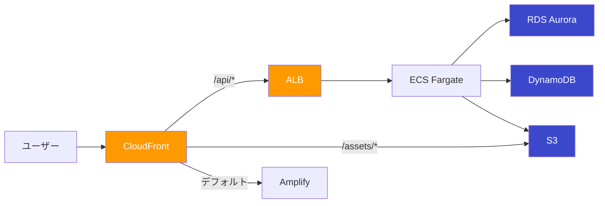
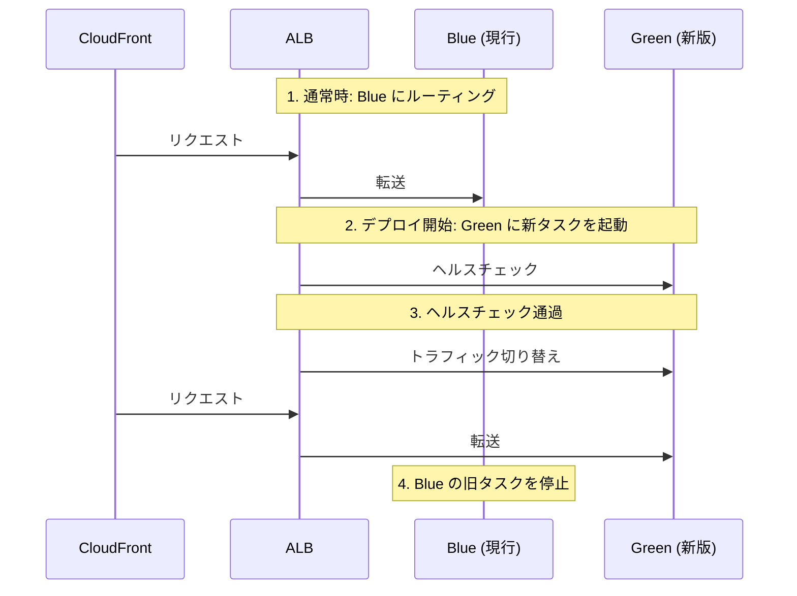
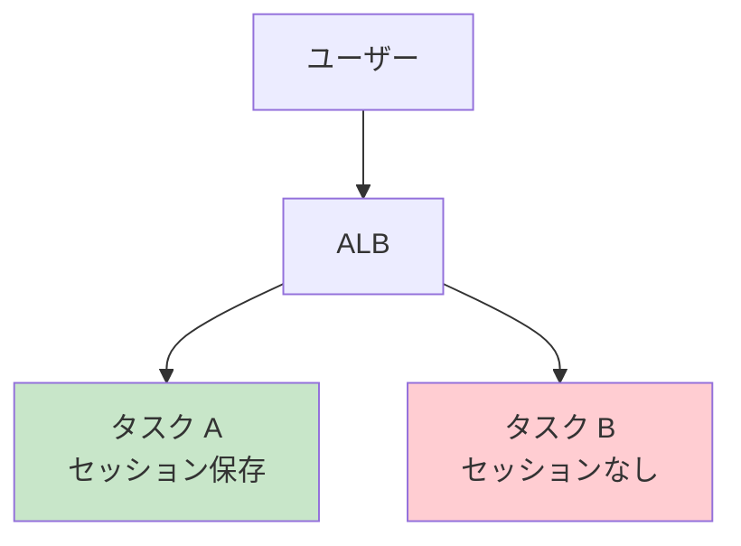

# 5-1-4 CDN・ロードバランサー・ストレージ・データベース

📝 **前提知識**: このセクションはセクション 5-1-2（LMS の AWS アーキテクチャ全体像）の内容を前提としています。

## 🎯 このセクションで学ぶこと

- **CloudFront** の CDN としての役割と、LMS でのマルチオリジン構成（リクエスト振り分け）を理解する
- **ALB** によるロードバランシングと Blue/Green デプロイの仕組みを理解する
- **S3** の用途別バケット構成と OAC によるアクセス制御を理解する
- **RDS Aurora** のクラスター構成と、本番/ステージング環境での使い分けを理解する
- **DynamoDB** をセッション・キャッシュに使う理由と、TTL による自動削除の仕組みを理解する

このセクションでは、ECS の周辺に位置する AWS サービスを1つずつ取り上げ、それぞれの仕組みと LMS での具体的な設定を Terraform コードとともに確認します。

---

## 導入: リクエストはどうやって ECS に届くのか？

セクション 5-1-3 で、LMS のアプリケーションが ECS Fargate 上のコンテナとして動いていることを学びました。しかし、ユーザーがブラウザで `lms.coachtech.site` にアクセスしたとき、そのリクエストがどうやって ECS のコンテナに届くのかはまだ見ていません。

また、アプリケーションが扱うデータについても疑問が残ります。ユーザーがアップロードした画像はどこに保存されるのか？データベースはどこで動いているのか？セッション情報はどう管理されているのか？

これらの疑問に答えるのが、このセクションで扱う5つの AWS サービスです。



ユーザーのリクエストはまず CloudFront に到達し、パスに応じて ALB（API）、S3（アセット）、Amplify（フロントエンド）に振り分けられます。ECS 上のアプリケーションは RDS Aurora にデータを保存し、DynamoDB でセッションとキャッシュを管理します。

### 🧠 先輩エンジニアはこう考える

> LMS のインフラ設計で意識しているのは「マネージドサービスをできるだけ使う」ということです。CloudFront を前段に置くのは、CDN としての高速化だけではなく、1つのドメインで複数のサービス（Amplify、ALB、S3）をまとめられるからです。セッションを DynamoDB にしたのは、ECS Fargate ではタスク間でファイルシステムを共有できないから。Redis（ElastiCache）を立てる方法もありますが、DynamoDB ならサーバーレスで管理不要、Pay-per-request で使った分だけ課金されます。小規模なチームでは、運用負荷の低さが最優先です。

---

## CloudFront: CDN とオリジンルーティング

### CDN（Content Delivery Network）の仕組み

**CDN** とは、世界中に分散配置されたエッジサーバーからコンテンツを配信する仕組みです。ユーザーに地理的に近いサーバーからレスポンスを返すことで、表示速度を向上させます。

たとえば、東京のサーバーにあるコンテンツを大阪のユーザーがリクエストした場合、CDN を使わなければ毎回東京まで通信が往復します。CDN を使えば、最初のリクエスト時にエッジサーバーにキャッシュされ、2回目以降はエッジサーバーから直接配信されます。

**CloudFront** は AWS が提供する CDN サービスです。世界中に 400 以上のエッジロケーションを持ち、自動的にユーザーに最も近い拠点からコンテンツを配信します。

### LMS での CloudFront の役割

LMS における CloudFront は、単なる CDN（キャッシュによる高速化）以上の役割を果たしています。最も重要な役割は **リクエストの振り分け**（オリジンルーティング）です。

ユーザーがアクセスする URL は `lms.coachtech.site` の1つだけですが、裏側では複数のサービスが動いています。CloudFront がリクエストの URL パスを見て、適切なサービスにルーティングします。

### マルチオリジン構成

LMS の CloudFront は4つのオリジン（リクエストの転送先）を持っています。Terraform の設定を見てみましょう。

```hcl
# infra/stacks/modules/cdn/cloudfront.tf
locals {
  amplify_origin_id       = "amplify_origin"
  s3_origin_id            = "s3_origin"
  mazidesign_s3_origin_id = "mazidesign_s3_origin"
  alb_origin_id           = "alb_origin"
}
```

4つのオリジン ID が定義されています。それぞれの振り分けルールを整理します。

| パスパターン | オリジン | キャッシュポリシー | 用途 |
|---|---|---|---|
| デフォルト（`/*`） | Amplify | `Managed-CachingDisabled` | フロントエンド（Next.js） |
| `/api/*` | ALB | `Managed-CachingDisabled` | バックエンド API |
| `/assets/*` | S3（アセットバケット） | `Managed-CachingOptimized` | ユーザーアップロード画像等 |
| `/curriculums/mazidesign/img/*` | S3（教材画像バケット） | `Managed-CachingOptimized` | 教材の画像 |

キャッシュポリシーの違いに注目してください。

- **Managed-CachingDisabled**: キャッシュしない。API レスポンスやフロントエンドのページは、ユーザーごと・リクエストごとに内容が変わるためキャッシュできません
- **Managed-CachingOptimized**: 長期キャッシュする。画像やアセットは一度アップロードされたら内容が変わらないため、エッジサーバーにキャッシュして高速配信します

実際の Terraform コードで `/api/*` のルーティング設定を見てみましょう。

```hcl
# infra/stacks/modules/cdn/cloudfront.tf
ordered_cache_behavior {
  path_pattern             = "/api/*"
  target_origin_id         = local.alb_origin_id
  allowed_methods          = ["DELETE", "GET", "HEAD", "OPTIONS", "PATCH", "POST", "PUT"]
  cached_methods           = ["GET", "HEAD"]
  viewer_protocol_policy   = "redirect-to-https"
  cache_policy_id          = data.aws_cloudfront_cache_policy.caching_disabled.id
  origin_request_policy_id = data.aws_cloudfront_origin_request_policy.all_viewer.id
}
```

`allowed_methods` にすべての HTTP メソッド（GET、POST、PUT、DELETE 等）が含まれているのは、API エンドポイントはデータの取得だけでなく作成・更新・削除も行うためです。`viewer_protocol_policy = "redirect-to-https"` により、HTTP でアクセスされた場合は自動的に HTTPS にリダイレクトされます。

### Price Class と SSL 証明書

```hcl
# infra/stacks/modules/cdn/cloudfront.tf
price_class = "PriceClass_200"

viewer_certificate {
  cloudfront_default_certificate = false
  acm_certificate_arn            = data.aws_acm_certificate.virginia.arn
  ssl_support_method             = "sni-only"
  minimum_protocol_version       = "TLSv1.2_2021"
}
```

**Price Class** は、CloudFront のエッジロケーションの範囲を指定する設定です。`PriceClass_200` は北米、欧州、アジア、中東、アフリカのエッジロケーションを使用します。全リージョン対応の `PriceClass_All` よりコストを抑えつつ、LMS のユーザーがいる主要地域をカバーしています。

SSL 証明書は **ACM**（AWS Certificate Manager）で管理されたものを使用しています。CloudFront の証明書は必ず **バージニア北部（us-east-1）** リージョンで発行する必要があります。

🔑 **単一ドメインで複数サービスを束ねるメリット**: `lms.coachtech.site` という1つのドメインで、フロントエンド（Amplify）、API（ALB 経由の ECS）、静的ファイル（S3）を統合できます。ユーザーから見れば1つのサイトですが、裏側ではそれぞれ異なるインフラで動いています。CORS（クロスオリジン）の問題も発生しません。

---

## ALB: ロードバランシングと Blue/Green デプロイ

### ALB（Application Load Balancer）とは

**ALB** は、HTTP/HTTPS レベルでトラフィックを複数のターゲット（ECS タスクなど）に分散させるロードバランサーです。Laravel 開発で使う `php artisan serve` は1つのプロセスしか起動しませんが、本番環境では複数のコンテナが同時にリクエストを処理します。ALB がリクエストを各コンテナに振り分けることで、負荷を分散させます。

### LMS の ALB 構成

LMS の ALB 設定を Terraform コードで確認しましょう。

```hcl
# infra/stacks/modules/load_balancing/elb.tf
resource "aws_lb" "app" {
  name               = "${var.name_prefix}-alb"
  internal           = false
  load_balancer_type = "application"
  security_groups    = [var.elb_sg_id]
  subnets            = var.public_subnet_ids

  access_logs {
    bucket  = var.alb_logs_bucket_name
    enabled = true
  }
}
```

いくつかの重要な設定を確認します。

- **`internal = false`**: インターネットからアクセス可能な外部向け ALB です
- **`subnets = var.public_subnet_ids`**: パブリックサブネットに配置されています
- **`security_groups`**: セキュリティグループで受信元を制限しています
- **`access_logs`**: アクセスログを S3 バケットに保存しています

### CloudFront からのみ受信する仕組み

ALB はインターネットに公開されていますが、直接アクセスされては困ります。CloudFront を経由せずに ALB に直接リクエストを送ると、CDN のキャッシュや WAF（Web Application Firewall）をバイパスできてしまいます。

LMS では、セキュリティグループで CloudFront からのトラフィックのみを許可しています。

```hcl
# infra/stacks/modules/network/security_groups.tf
data "aws_ec2_managed_prefix_list" "cloudfront" {
  name = "com.amazonaws.global.cloudfront.origin-facing"
}

resource "aws_security_group_rule" "from_cf_to_elb" {
  type              = "ingress"
  security_group_id = aws_security_group.elb.id
  prefix_list_ids   = [data.aws_ec2_managed_prefix_list.cloudfront.id]
  from_port         = var.https_port
  to_port           = var.https_port
  protocol          = var.tcp
}
```

**マネージドプレフィックスリスト** は、AWS が管理する IP アドレスの一覧です。`com.amazonaws.global.cloudfront.origin-facing` には CloudFront のエッジサーバーの IP アドレスが含まれており、AWS が自動的に更新します。これにより、CloudFront 以外からの HTTPS アクセスはセキュリティグループでブロックされます。

### ターゲットグループとヘルスチェック

ALB は、受信したリクエストを **ターゲットグループ** に登録されたターゲット（ECS タスク）に転送します。

```hcl
# infra/stacks/modules/load_balancing/elb.tf
resource "aws_lb_target_group" "app" {
  name        = "${var.name_prefix}-alb-tg"
  port        = var.http_port
  protocol    = var.http
  vpc_id      = var.vpc_id
  target_type = "ip"

  health_check {
    path                = "/"
    healthy_threshold   = 5
    unhealthy_threshold = 2
  }
}
```

- **`target_type = "ip"`**: ECS Fargate では、タスクに動的に IP アドレスが割り当てられるため、IP ベースのターゲットタイプを使います
- **`port = var.http_port`**: ターゲット（ECS タスク内の Nginx コンテナ）のポート 80 にルーティングします
- **`health_check`**: ALB は定期的にパス `/` にリクエストを送り、ターゲットが正常に動作しているか確認します。正常判定（`healthy_threshold = 5`）は5回連続成功、異常判定（`unhealthy_threshold = 2`）は2回連続失敗で切り替わります

### Blue/Green デプロイ

LMS の ALB には、ターゲットグループが **2つ** 定義されています。

```hcl
# infra/stacks/modules/load_balancing/elb.tf
# 通常のターゲットグループ
resource "aws_lb_target_group" "app" {
  name = "${var.name_prefix}-alb-tg"
  # ...
}

# ブルー/グリーンデプロイ用に追加
resource "aws_lb_target_group" "app2" {
  name = "${var.name_prefix}-alb-tg2"
  # ...
}
```

これは **Blue/Green デプロイ** のための構成です。Blue/Green デプロイとは、ゼロダウンタイムでアプリケーションを更新するデプロイ手法です。



1. 通常時は **Blue**（ターゲットグループ `app`）にトラフィックが流れています
2. 新しいバージョンをデプロイすると、**Green**（ターゲットグループ `app2`）に新しい ECS タスクが起動します
3. ヘルスチェックが通過したら、ALB のリスナーが Green にトラフィックを切り替えます
4. 古い Blue のタスクが停止します

この切り替えは AWS CodeDeploy が自動で行います。リスナーの `lifecycle` ブロックに `ignore_changes = [default_action]` が指定されているのは、CodeDeploy がデプロイ時にリスナーの転送先を書き換えるため、Terraform がその変更を「差分」として検出しないようにするためです。

💡 Blue/Green デプロイにより、新バージョンに問題があった場合でもすぐに旧バージョン（Blue）に戻せます。ユーザーはデプロイ中もサービスを利用し続けることができます。

---

## S3: オブジェクトストレージ

### S3 とは

**S3**（Simple Storage Service）は、AWS が提供するオブジェクトストレージサービスです。ファイルを **バケット** と呼ばれるコンテナに保存し、容量の上限なく利用できます。画像、動画、ログファイル、バックアップなど、あらゆる種類のファイルを保存できます。

ローカル開発で `storage/app/public` にファイルを保存するのと似ていますが、S3 はサーバーとは独立した場所にファイルが保存されるため、ECS タスクが再起動してもファイルが消えません。

### LMS の S3 バケット

LMS では用途ごとに複数の S3 バケットを使い分けています。

| バケット名 | 用途 | 管理 |
|---|---|---|
| `coachtech-lms-bucket`（prod）/ `coachtech-lms-bucket-stag`（staging） | ユーザーアップロード画像等のアセット | 既存バケットを `data` で参照 |
| `lms-mazidesign-assets` | 教材画像 | shared モジュールで管理 |
| `estra-{env}-new-alb-logs` | ALB アクセスログ | stacks モジュールで管理 |
| `estra-lms-tfstate` | Terraform 状態ファイル | 手動作成 |

Terraform コードでバケットの管理方法を確認しましょう。

```hcl
# infra/stacks/modules/storage/s3.tf

# アセット用バケット（既存のバケットをデータソースとして参照）
data "aws_s3_bucket" "assets_bucket" {
  bucket = var.assets_bucket_name
}

# ALBのログ用バケット（Terraform で新規作成）
resource "aws_s3_bucket" "alb_logs" {
  bucket = "${var.bucket_name_prefix}-${var.name_prefix}-alb-logs"
}

resource "aws_s3_bucket_lifecycle_configuration" "alb_logs" {
  bucket = aws_s3_bucket.alb_logs.id

  # 保持期間は7日とする
  rule {
    id     = "retain-7d"
    status = "Enabled"

    expiration {
      days = 7
    }

    filter {}
  }
}
```

アセット用バケットは `data` ソース（既に存在するリソースの参照）で管理されています。つまり、Terraform 以前に手動で作成されたバケットを参照しているだけです。一方、ALB ログ用バケットは `resource`（Terraform で作成・管理するリソース）として定義されています。

ALB ログバケットには **ライフサイクルルール** が設定されており、7日経過したログファイルは自動的に削除されます。ログは永久に保存する必要がないため、ストレージコストを抑える設計です。

### OAC（Origin Access Control）

S3 バケットに保存されたアセットは CloudFront 経由で配信されますが、S3 バケットの URL に直接アクセスされては困ります。そこで **OAC**（Origin Access Control）を使い、CloudFront からのアクセスのみを許可します。

```hcl
# infra/stacks/modules/cdn/cloudfront.tf
resource "aws_cloudfront_origin_access_control" "s3" {
  name                              = "${var.name_prefix}-s3-oac"
  origin_access_control_origin_type = "s3"
  signing_behavior                  = "always"
  signing_protocol                  = "sigv4"
}
```

- **`signing_behavior = "always"`**: CloudFront がリクエストに必ず署名を付与します
- **`signing_protocol = "sigv4"`**: AWS の標準的な署名プロトコル（SigV4）を使用します

この OAC を CloudFront の S3 オリジンに設定することで、CloudFront が S3 にアクセスする際に自動的に認証情報が付与されます。S3 バケット側のポリシーで「この CloudFront ディストリビューションからのアクセスのみ許可」と設定すれば、直接アクセスは拒否されます。

```hcl
# infra/stacks/modules/cdn/cloudfront.tf
origin {
  domain_name              = var.assets_bucket_domain_name
  origin_access_control_id = aws_cloudfront_origin_access_control.s3.id
  origin_id                = local.s3_origin_id
}
```

`origin_access_control_id` で OAC を紐づけている点に注目してください。これにより、このオリジンへのアクセスは CloudFront の署名付きリクエストでのみ行われます。

### Laravel からの S3 アクセス

Laravel 側では、`.env` の `FILESYSTEM_DISK=s3` を設定することで、`Storage::put()` や `Storage::get()` でファイルを S3 に保存・取得できます。Laravel の Filesystem 機能がドライバーとして S3 をサポートしているため、ローカルストレージと同じインターフェースで S3 を操作できます。

---

## RDS Aurora: リレーショナルデータベース

### RDS Aurora とは

**RDS Aurora** は、AWS が提供するマネージドのリレーショナルデータベースサービスです。MySQL 互換のため、Laravel の Eloquent やマイグレーションをそのまま使えます。ローカル開発で Docker Compose の MySQL コンテナを使っているのと同じ感覚ですが、AWS がバックアップ、パッチ適用、フェイルオーバー（障害時の切り替え）などを自動で管理してくれます。

### LMS の RDS 構成

LMS の RDS 構成を Terraform コードで確認しましょう。

```hcl
# infra/stacks/modules/db/rds.tf
resource "aws_rds_cluster" "main" {
  cluster_identifier         = "${var.name_prefix}-db-cluster"
  database_name              = "laravel"
  master_username            = "dbuser"
  master_password_wo         = var.rds_database_password
  master_password_wo_version = 1
  engine                     = var.rds_engine
  engine_version             = var.rds_engine_version
  backup_retention_period    = 7
  preferred_backup_window    = "12:00-14:00"

  vpc_security_group_ids = [var.db_sg_id]
  db_subnet_group_name   = aws_db_subnet_group.aurora_mysql_subnet_group.name

  availability_zones = [
    "${var.aws_region}a",
    "${var.aws_region}c",
  ]

  storage_encrypted = true

  # Serverless v2用の設定
  dynamic "serverlessv2_scaling_configuration" {
    # production以外の場合のみ設定する
    for_each = var.is_production ? [] : [1]
    content {
      min_capacity             = var.rds_serverless_min_acu
      max_capacity             = var.rds_serverless_max_acu
      seconds_until_auto_pause = 300 # 5分で自動停止
    }
  }
}
```

主要な設定を整理します。

- **`database_name = "laravel"`**: データベース名は `laravel` です
- **`master_username = "dbuser"`**: 管理者ユーザー名は `dbuser` です
- **`master_password_wo`**: パスワードは変数から渡されます。実際の値は Secrets Manager で管理されています（後述）
- **`backup_retention_period = 7`**: 自動バックアップを7日間保持します
- **`storage_encrypted = true`**: ストレージを暗号化しています
- **`availability_zones`**: 2つのアベイラビリティーゾーン（`a` と `c`）に配置し、片方のデータセンターに障害が発生しても稼働を継続できます（**Multi-AZ** 構成）

### 本番環境とステージング環境の違い

LMS の RDS 構成は、本番環境とステージング環境で大きく異なります。

```hcl
# infra/stacks/modules/db/rds.tf
resource "aws_rds_cluster_instance" "aurora_master" {
  identifier         = "${var.name_prefix}-rds-master"
  cluster_identifier = aws_rds_cluster.main.id
  instance_class = (
    var.is_production
    ? var.rds_instance_class # 本番環境なら変数で指定されたインスタンスクラスに
    : "db.serverless"        # 本番環境以外ならサーバーレスに
  )
  # ...
}

resource "aws_rds_cluster_instance" "aurora_slave" {
  count              = var.is_production ? 1 : 0
  identifier         = "${var.name_prefix}-rds-slave"
  cluster_identifier = aws_rds_cluster.main.id
  instance_class     = var.rds_instance_class
  # ...
}
```

| 項目 | 本番環境 | ステージング環境 |
|---|---|---|
| マスターインスタンス | `db.t3.medium`（固定スペック） | `db.serverless`（Serverless v2） |
| スレーブインスタンス | 1台（リードレプリカ） | なし（`count = 0`） |
| 自動停止 | なし | 5分アイドルで自動停止 |
| AZ 配置 | `a`（マスター）+ `c`（スレーブ） | `a`（マスターのみ） |

本番環境では **マスター + スレーブ** の2台構成です。マスターは読み書き両方を受け付け、スレーブはマスターのデータを複製します。マスターに障害が発生した場合、スレーブが自動的にマスターに昇格して稼働を継続します（**フェイルオーバー**）。`promotion_tier` の値が小さいほど昇格の優先度が高く、マスター（`0`）が最優先、スレーブ（`15`）が次の候補です。

ステージング環境では **Serverless v2** を使い、5分間アイドル状態が続くと自動停止します。開発やテストでのみ使うため、常時稼働させるコストを削減しています。

### セキュリティ: ネットワークとパスワード管理

RDS はプライベート DB サブネットに配置されており、インターネットから直接アクセスすることはできません（`publicly_accessible = false`）。セキュリティグループにより、**ECS のアプリケーションからのみ** データベースポートへのアクセスが許可されています。

```hcl
# infra/stacks/modules/network/security_groups.tf
resource "aws_security_group_rule" "app_to_target_rds" {
  type                     = "ingress"
  security_group_id        = aws_security_group.db.id
  source_security_group_id = aws_security_group.app.id
  from_port                = var.db_port
  to_port                  = var.db_port
  protocol                 = var.tcp
}
```

`source_security_group_id` で ECS のセキュリティグループを指定しているため、ECS タスク以外からのアクセスはブロックされます。

パスワードは **Secrets Manager** で管理されています。

```hcl
# infra/stacks/modules/storage/secrets_manager.tf
resource "aws_secretsmanager_secret" "rds_credentials" {
  name = "${var.name_prefix}-rds-credentials"
}

resource "aws_secretsmanager_secret_version" "rds_credentials" {
  secret_id = aws_secretsmanager_secret.rds_credentials.id
  secret_string_wo = jsonencode({
    username = var.rds_database_username
    password = var.rds_database_password
  })
  secret_string_wo_version = 1
}
```

Secrets Manager に保存されたパスワードは、ECS タスク定義の環境変数として安全に注入されます。Terraform のコードや GitHub のリポジトリにパスワードがハードコードされることはありません。

💡 `master_password_wo` の `wo` は "write-only" の略です。Terraform の state ファイルにパスワードが記録されないようにする機能で、セキュリティ上の重要な設定です。

---

## DynamoDB: セッションとキャッシュ

### DynamoDB とは

**DynamoDB** は、AWS が提供するフルマネージドの NoSQL データベースです。キーバリュー型のデータストアで、MySQL のようにテーブル定義（スキーマ）を厳密に設計する必要がなく、キーを指定してデータを読み書きします。サーバーのプロビジョニングが不要（サーバーレス）で、リクエスト数に応じた従量課金（Pay-per-request）です。

### なぜセッションとキャッシュに DynamoDB を使うのか

Laravel のデフォルトでは、セッションは `file` ドライバー（サーバーのファイルシステムに保存）、キャッシュも `file` ドライバーです。ローカル開発ではこれで問題ありませんが、ECS Fargate 環境では問題が発生します。

**ECS Fargate はタスク間でファイルシステムを共有しません。** つまり、タスク A に保存されたセッションファイルは、タスク B からは見えません。ALB が次のリクエストをタスク B に振り分けた場合、ユーザーのセッションが見つからずログアウトされてしまいます。



この問題を解決するには、セッションとキャッシュを **タスク外の共有ストレージ** に保存する必要があります。選択肢としては以下があります。

| 選択肢 | メリット | デメリット |
|---|---|---|
| **RDS（MySQL）** | 既存の DB を流用 | セッションの読み書きで DB 負荷が増大 |
| **ElastiCache（Redis）** | 高速、Laravel 標準サポート | サーバー管理が必要、固定コスト |
| **DynamoDB** | サーバーレス、管理不要、従量課金 | Redis より若干遅い |

LMS では **DynamoDB** を採用しています。少人数のチームで運用するため、サーバー管理が不要で従量課金の DynamoDB が最適です。

### LMS の DynamoDB テーブル

LMS では2つの DynamoDB テーブルを使用しています。

```hcl
# infra/stacks/modules/db/dynamodb.tf
resource "aws_dynamodb_table" "session" {
  name         = "${var.name_prefix}-session"
  billing_mode = "PAY_PER_REQUEST"
  hash_key     = "id"

  attribute {
    name = "id"
    type = "S"
  }
  ttl {
    attribute_name = "expires"
    enabled        = true
  }
}

resource "aws_dynamodb_table" "cache" {
  name         = "${var.name_prefix}-cache"
  billing_mode = "PAY_PER_REQUEST"
  hash_key     = "key"

  attribute {
    name = "key"
    type = "S"
  }
  ttl {
    attribute_name = "expires_at"
    enabled        = true
  }
}
```

| テーブル | 名前パターン | ハッシュキー | TTL 属性 | 用途 |
|---|---|---|---|---|
| セッション | `lms-{env}-new-session` | `id`（文字列） | `expires` | ユーザーのログイン状態等 |
| キャッシュ | `lms-{env}-new-cache` | `key`（文字列） | `expires_at` | アプリケーションキャッシュ |

両テーブルに共通する重要な設定を確認します。

- **`billing_mode = "PAY_PER_REQUEST"`**: リクエスト数に応じた従量課金です。あらかじめ読み書きのキャパシティを設定する必要がありません
- **`hash_key`**: DynamoDB のプライマリキーです。セッションテーブルでは `id`（セッション ID）、キャッシュテーブルでは `key`（キャッシュキー）で各レコードを一意に識別します
- **`ttl`（Time To Live）**: 有効期限を過ぎたレコードを DynamoDB が自動的に削除します。セッションテーブルでは `expires` 属性、キャッシュテーブルでは `expires_at` 属性にタイムスタンプが設定され、その時刻を過ぎるとバックグラウンドで自動削除されます

### Laravel 側の設定

Laravel 側では `.env` で以下のように設定します。

```bash
SESSION_DRIVER=dynamodb
CACHE_DRIVER=dynamodb
DYNAMODB_CACHE_TABLE=lms-production-new-cache
DYNAMODB_SESSION_TABLE=lms-production-new-session
```

Laravel は `SESSION_DRIVER=dynamodb` を検知すると、セッションの読み書きを DynamoDB に対して行います。開発者はセッションの保存先を意識する必要がなく、`session()` ヘルパーや `Cache::get()` / `Cache::put()` をローカルと同じように使えます。

⚠️ **注意**: TTL による削除はリアルタイムではありません。DynamoDB は期限切れのアイテムを数分から数十分の遅延で削除します。ただし、Laravel のセッションドライバーは有効期限をチェックしてから値を返すため、アプリケーション上は期限切れセッションが使われることはありません。

---

## ✨ まとめ

- **CloudFront** は CDN としてのキャッシュ配信に加え、リクエストのパスパターンに応じて Amplify、ALB、S3 にルーティングする「振り分け役」を担う。単一ドメインで複数サービスを統合できる
- **ALB** は ECS タスクへのトラフィック分散を行い、2つのターゲットグループによる Blue/Green デプロイでゼロダウンタイム更新を実現する。セキュリティグループにより CloudFront からのアクセスのみ許可する
- **S3** は用途別に複数のバケットを使い分ける。アセットバケットは OAC により CloudFront 経由でのみアクセス可能。ALB ログバケットは7日間のライフサイクルルールでコストを抑える
- **RDS Aurora** は MySQL 互換のマネージドデータベース。本番環境はマスター + スレーブの Multi-AZ 構成、ステージング環境は Serverless v2 で5分アイドル停止。パスワードは Secrets Manager で管理する
- **DynamoDB** はセッションとキャッシュの保存先。ECS Fargate のタスク間でファイルシステムを共有できない問題を解決する。サーバーレスで管理不要、TTL による自動削除でクリーンアップも不要

---

この Chapter では、クラウドインフラの基礎概念から始めて、LMS の AWS アーキテクチャ全体像、ECS Fargate によるコンテナオーケストレーション、そして周辺サービス（CloudFront、ALB、S3、RDS Aurora、DynamoDB）の役割と設定を学びました。次の Chapter では、これらの AWS リソースを Terraform でどのように定義・管理しているかを学びます。IaC のメリット、plan/apply/state による変更管理サイクル、HCL 構文の読み方、S3 バックエンドによる状態ファイル管理を理解します。
