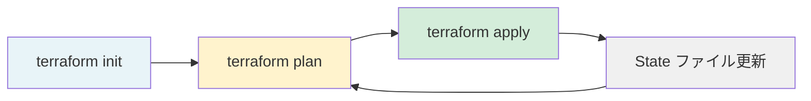
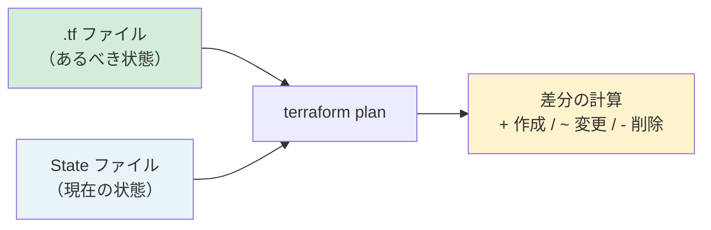

# 5-2-1 Terraform の基礎概念

この Chapter「Terraform によるインフラ管理」は以下の 2 セクションで構成されます。

| セクション | テーマ | 種類 |
|---|---|---|
| 5-2-1 | Terraform の基礎概念 | 概念 |
| 5-2-2 | LMS の Terraform 構成 | 概念 |

**Chapter ゴール**: Infrastructure as Code の概念と LMS の Terraform 構成を理解する

📖 まず本セクションで IaC の概念と Terraform の基本的な仕組み（動作モデル・HCL 構文・状態管理）を学びます。次にセクション 5-2-2 で LMS の実際の Terraform 構成（ディレクトリ構造・モジュール分割・環境別管理）を読み解きます。2 つのセクションを通して、LMS のインフラがどのようにコードとして管理されているかが理解できるようになります。

## 🎯 このセクションで学ぶこと

- **Infrastructure as Code**（IaC）のメリットと、手動設定との違いを理解する
- Terraform の **動作モデル**（plan → apply → state）を理解する
- **HCL 構文** の主要ブロック（resource / variable / output / module / data / locals）を読めるようになる
- **状態管理**（State）の仕組みと S3 バックエンドの役割を理解する

IaC の意義から出発し、Terraform の動作サイクルを把握した後、HCL 構文の読み方を LMS の実コードで学び、最後に状態管理の仕組みを理解します。

---

## 導入: AWS コンソールでの手動設定は何が問題なのか

Chapter 5-1 で、LMS を支える AWS サービス群（ECS、RDS、CloudFront、ALB 等）を学びました。これらのサービスは AWS マネジメントコンソール（Web の管理画面）から手動で作成・設定できます。ボタンをクリックし、フォームに値を入力し、「作成」を押す。直感的で、最初はこれで十分に思えます。

しかし、手動設定には深刻な問題があります。

- **再現性がない**: ステージング環境と本番環境で同じ構成を作りたいとき、手順書どおりに操作しても設定漏れが起きます
- **変更履歴が残らない**: 誰がいつ何を変えたのか追跡できません。障害が発生したとき「最近何か変えた？」と聞いて回ることになります
- **レビューできない**: コードの PR レビューのように、インフラの変更を事前にチェックする仕組みがありません
- **ドキュメントが陳腐化する**: 手順書を作っても、実際の設定と乖離していきます

これらの課題を解決するのが **Infrastructure as Code**（IaC）という考え方です。

### 🧠 先輩エンジニアはこう考える

> 最初は AWS コンソールで作業していた時期がありました。ステージング環境で検証して「OK」と思い、本番環境に同じ設定を手動で再現しようとしたら、セキュリティグループのルールが1つ抜けていて障害になったことがあります。Terraform を導入してからは、インフラの変更が PR として上がってくるので、コードレビューの段階で「この設定変更は大丈夫か」と確認できるようになりました。`git diff` を見れば何が変わったか一目瞭然ですし、問題があれば `git revert` で戻せます。インフラもコードと同じように管理できるというのは、想像以上に安心感があります。

---

## Infrastructure as Code（IaC）とは

**Infrastructure as Code**（IaC）とは、サーバー、ネットワーク、データベースといったインフラの構成を、コード（設定ファイル）として記述・管理する手法です。

### 従来の課題と IaC のメリット

手動設定の課題と、IaC による解決策を対比して整理します。

| 課題 | 手動設定 | IaC |
|---|---|---|
| **再現性** | 手順書に依存、設定漏れのリスク | コードを実行すれば同じ環境を再現 |
| **変更管理** | 誰が何を変えたか不明 | Git で変更履歴を追跡 |
| **レビュー** | 事前チェックの仕組みなし | PR レビューでインフラ変更を検証 |
| **環境の一貫性** | 環境ごとに微妙な差異が蓄積 | 同一コードから複数環境を生成 |
| **ドキュメント** | 手順書が実態と乖離 | コード自体がドキュメント |

IaC を採用すると、インフラの管理にソフトウェア開発と同じプラクティス（バージョン管理、コードレビュー、自動テスト）を適用できます。これは、Laravel のコードを Git で管理し、PR でレビューしている普段の開発フローと同じ考え方です。

### Terraform の位置づけ

**Terraform** は、HashiCorp 社が開発した IaC ツールです。LMS では **Terraform 1.11** を使用しています。

Terraform の特徴は以下のとおりです。

- **マルチクラウド対応**: AWS だけでなく、Google Cloud、Azure 等の複数のクラウドプロバイダーに対応しています。LMS では主に AWS を対象としていますが、一部 GCP（BigQuery）の変数定義もあります（変数として定義されていますが、主要なインフラは AWS で完結しています）
- **宣言的記述**: 「どう作るか」（手順）ではなく「どうあるべきか」（状態）を記述します。Terraform が現在の状態との差分を計算し、必要な操作を自動的に決定します
- **豊富なプロバイダーエコシステム**: AWS の各サービスに対応するプロバイダープラグインが提供されており、ほぼすべての AWS リソースをコードで管理できます

💡 **TIP**: AWS 専用の IaC ツールとして **CloudFormation** がありますが、Terraform は特定のクラウドに縛られない点が大きな違いです。LMS のように AWS をメインにしつつ GCP も使うケースでは、Terraform のマルチクラウド対応が活きます。

---

## Terraform の動作モデル

Terraform は、3 つの主要コマンドによるサイクルで動作します。



### terraform init: 初期化

プロジェクトディレクトリで最初に実行するコマンドです。以下を行います。

- **プロバイダープラグインのダウンロード**: AWS プロバイダー（`hashicorp/aws`）等、設定ファイルで指定されたプラグインを取得します
- **バックエンドの初期化**: 状態ファイル（State）の保存先を設定します（詳しくは後述）

Laravel プロジェクトでいえば `composer install` に相当する準備ステップです。

### terraform plan: 実行計画の確認

設定ファイル（コード）と現在の状態（State）を比較し、「何を作成・変更・削除するか」のプレビューを表示します。実際のリソースにはまだ何も変更を加えません。

```bash
# 実行例（出力イメージ）
$ terraform plan

# aws_dynamodb_table.session will be created
+ resource "aws_dynamodb_table" "session" {
    + name         = "lms-production-new-session"
    + billing_mode = "PAY_PER_REQUEST"
    + hash_key     = "id"
  }

Plan: 1 to add, 0 to change, 0 to destroy.
```

`+` は作成、`~` は変更、`-` は削除を意味します。この出力を見て、意図した変更かどうかを確認してから次のステップに進みます。

🔑 **キーポイント**: `plan` は「ドライラン」です。実際にリソースを操作する前に変更内容を確認できるため、事故を防ぐ重要なステップです。

### terraform apply: 変更の適用

`plan` で確認した変更を、実際に AWS に適用します。実行前に確認プロンプトが表示されるため、誤って適用してしまうリスクは低くなっています。

- リソースの作成（例: 新しい DynamoDB テーブルを作る）
- リソースの変更（例: ECS タスクの CPU を 256 から 512 に変更する）
- リソースの削除（例: 不要になったセキュリティグループを削除する）

apply が成功すると、State ファイルが更新されます。

### terraform destroy: リソースの削除

Terraform が管理するすべてのリソースを削除します。本番環境では通常使いませんが、検証用の一時環境を片付けるときに使うことがあります。

⚠️ **注意**: `destroy` は管理下の全リソースを削除するため、本番環境での実行は極めて危険です。後述する `prevent_destroy` ライフサイクル設定で、重要なリソースの誤削除を防ぐ仕組みがあります。

### 宣言的 vs 命令的

Terraform のアプローチは **宣言的**（declarative）です。「サーバーを起動して、ポートを開けて、ロードバランサーに登録して...」という手順（命令的）ではなく、「CPU 256、メモリ 512 の ECS タスクがあるべき」という最終状態を記述します。

Terraform は、記述された状態と現在の状態の差分を自動的に計算し、必要な操作だけを実行します。

💡 **TIP**: Laravel のマイグレーションも似たアプローチです。`Schema::create` でテーブルの最終形を宣言すると、Laravel が「このテーブルはまだないから作る」と判断します。Terraform はこれをインフラ全体に適用したものと考えられます。ただし、Laravel のマイグレーションが差分を1つずつのファイルとして記録する（命令的な側面がある）のに対し、Terraform は常に設定ファイル全体と現在の状態を比較する点が異なります。

---

## HCL 構文の読み方

Terraform の設定ファイルは **HCL**（HashiCorp Configuration Language）という専用の言語で記述します。拡張子は `.tf` です。

HCL は汎用プログラミング言語ではなく、インフラの設定を記述するために設計された **宣言的な構成言語** です。制御構文はありますが、基本的には「ブロック」を並べてリソースの構成を定義します。

ここでは、LMS の実際のコードを引用しながら主要なブロックの読み方を学びます。

### resource: AWS リソースの定義

**resource** ブロックは、作成・管理したい AWS リソースを定義します。Terraform の最も基本的なブロックです。

以下は LMS のセッション管理に使われる DynamoDB テーブルの定義です。

```hcl
# infra/stacks/modules/db/dynamodb.tf
resource "aws_dynamodb_table" "session" {
  name         = "${var.name_prefix}-session"
  billing_mode = "PAY_PER_REQUEST"
  hash_key     = "id"

  attribute {
    name = "id"
    type = "S"
  }
  ttl {
    attribute_name = "expires"
    enabled        = true
  }

  lifecycle {
    prevent_destroy = true
  }
}
```

構文の構造を分解します。

- `resource` はブロックの種類（「これはリソース定義である」）
- `"aws_dynamodb_table"` はリソースタイプ（AWS プロバイダーの DynamoDB テーブル）
- `"session"` は Terraform 内での名前（コード内で `aws_dynamodb_table.session` として参照する）
- ブロック内の `name`, `billing_mode`, `hash_key` 等がリソースの設定項目

📝 **ノート**: `"${var.name_prefix}-session"` は文字列の中に変数を埋め込む構文です。PHP の `"{$variable}-session"` と同じ考え方です。`var.name_prefix` が `lms-production-new` なら、テーブル名は `lms-production-new-session` になります。

### variable: 入力パラメータ

**variable** ブロックは、外部から値を受け取るためのパラメータを定義します。PHP の関数引数に相当します。

以下は LMS の変数定義の抜粋です。

```hcl
# infra/stacks/variables.tf
variable "ecs_task_cpu" {
  description = "Number of cpu units used by ECS task"
  type        = number
}

variable "rds_database_password" {
  type      = string
  sensitive = true
  default   = ""
}
```

variable ブロックの主要な属性を整理します。

| 属性 | 説明 | 例 |
|---|---|---|
| `description` | 変数の説明文 | `"Number of cpu units used by ECS task"` |
| `type` | 型（`string`, `number`, `bool`, `list(string)` 等） | `number` |
| `default` | デフォルト値。省略すると必須入力になる | `"lms"` |
| `sensitive` | `true` にすると `plan` / `apply` の出力でマスクされる | `true`（パスワード等） |

LMS では `variables.tf` に 40 個の変数が定義されています。環境ごとに異なる値（CPU 数、インスタンスクラス、ドメイン名等）を変数化することで、同じコードから本番環境とステージング環境を構築できます。

### output: モジュールの出力値

**output** ブロックは、リソースの情報を外部に公開します。PHP の関数の `return` に相当します。

```hcl
# infra/stacks/modules/db/outputs.tf
output "rds_database_host" {
  description = "Database host of RDS"
  value       = aws_rds_cluster.main.endpoint
}

output "rds_database_name" {
  description = "Database name of RDS"
  value       = aws_rds_cluster.main.database_name
}
```

`aws_rds_cluster.main.endpoint` は、`main` という名前で定義した RDS クラスターの接続エンドポイント（ホスト名）を参照しています。このように、あるリソースの属性値を他のモジュールに受け渡すのが output の役割です。

### module: モジュールの呼び出し

**module** ブロックは、別ディレクトリに定義されたリソース群をまとめて呼び出します。PHP のクラスをインスタンス化するイメージに近い概念です。

以下は LMS の `main.tf` でデータベースモジュールを呼び出している部分の抜粋です。

```hcl
# infra/stacks/main.tf（主要部分の抜粋）
module "db" {
  source = "../modules/db/"

  is_production          = local.is_production
  name_prefix            = local.name_prefix
  project_name           = var.project_name
  aws_region             = var.aws_region
  rds_instance_class     = var.rds_instance_class
  rds_engine             = var.rds_engine
  rds_engine_version     = var.rds_engine_version
  rds_serverless_min_acu = var.rds_serverless_min_acu
  rds_serverless_max_acu = var.rds_serverless_max_acu
  private_db_subnet_ids  = module.network.private_db_subnet_ids
  db_sg_id               = module.network.db_sg_id
  rds_database_password  = var.rds_database_password
}
```

- `source` はモジュールのソースディレクトリ（`../modules/db/` にある `.tf` ファイル群を使う）
- その下の行はモジュールに渡す引数です。`variable` で定義された入力パラメータに値を渡しています
- `module.network.private_db_subnet_ids` のように、別のモジュールの `output` を参照して値を受け渡すことができます

🔑 **キーポイント**: モジュールの仕組みにより、「ネットワーク」「データベース」「アプリケーション」等の責務ごとにコードを分割し、それらを `main.tf` で組み合わせるという設計が実現できます。Laravel のサービスクラスを Controller から呼び出す構造と似ています。

### data: 既存リソースの参照

**data** ブロックは、Terraform の管理外に存在するリソースや、別のスタックが管理するリソースの情報を読み取ります。resource が「作る」のに対し、data は「参照する」だけです。

```hcl
# infra/stacks/main.tf
data "aws_caller_identity" "current" {}

data "terraform_remote_state" "shared" {
  backend = "s3"

  config = {
    bucket = "estra-lms-tfstate"
    key    = "shared-new/terraform.tfstate"
    region = "ap-northeast-1"
  }
}
```

- `data "aws_caller_identity" "current"` は、現在の AWS アカウント情報を取得します。`data.aws_caller_identity.current.id` でアカウント ID を参照できます
- `data "terraform_remote_state" "shared"` は、別のスタック（shared）の State ファイルから出力値を取得します。これにより、shared スタックが管理する VPC やサブネットの情報を参照できます

### locals: ローカル変数

**locals** ブロックは、設定ファイル内で繰り返し使う値に名前をつけます。PHP の変数定義に近い概念です。

```hcl
# infra/stacks/main.tf
locals {
  name_prefix = "${var.project_name}-${var.env_name}-new"
  default_tags = {
    Service     = var.project_name
    Environment = var.env_name
  }
  is_production = var.env_name == "production"
}
```

- `name_prefix` は各リソースの命名に使われる共通プレフィックスです。本番環境なら `lms-production-new`、ステージング環境なら `lms-staging-new` になります
- `default_tags` はすべてのリソースに付与するタグです
- `is_production` は本番環境かどうかを判定するフラグで、リソースの条件分岐に使われます

`local.name_prefix` のように `local.` をつけて参照します（`var.` と同様のアクセス方法です）。

### provider: プロバイダーの設定

**provider** ブロックは、どのクラウドプロバイダーのどのリージョンを使うかを設定します。

```hcl
# infra/stacks/main.tf
provider "aws" {
  region = var.aws_region
  default_tags {
    tags = local.default_tags
  }
}
```

LMS のメインリージョンは `ap-northeast-1`（東京）です。ただし、CloudFront の ACM 証明書のように `us-east-1`（バージニア）でしか作成できないリソースもあります。その場合は **エイリアス** を使って別リージョンのプロバイダーを定義します。

```hcl
# infra/stacks/modules/cdn/acm.tf
provider "aws" {
  alias  = "virginia"
  region = var.virginia_region
  default_tags {
    tags = var.default_tags
  }
}
```

`alias = "virginia"` を設定することで、リソース定義で `provider = aws.virginia` と指定して、このプロバイダーを使い分けることができます。

### HCL 構文のまとめ

ここまで学んだ主要なブロックを一覧にまとめます。

| ブロック | 役割 | PHP での対応概念 |
|---|---|---|
| `resource` | AWS リソースの作成・管理 | DB テーブルの定義（マイグレーション） |
| `variable` | 外部からの入力パラメータ | 関数の引数 |
| `output` | モジュールの出力値 | 関数の `return` |
| `module` | モジュールの呼び出し | クラスのインスタンス化 |
| `data` | 既存リソースの参照（読み取り専用） | 外部 API からのデータ取得 |
| `locals` | ローカル変数 | 変数定義 |
| `provider` | クラウドプロバイダーの設定 | データベース接続設定 |

💡 **TIP**: HCL の構文をすべて暗記する必要はありません。重要なのは、`.tf` ファイルを開いたときに「これは resource だからリソースの定義だな」「これは variable だから入力パラメータだな」と構造を読み取れることです。具体的な属性の意味は、Claude Code に聞けば教えてもらえます。

---

## 状態管理（State）

Terraform の動作モデルで「現在の状態と設定ファイルを比較する」と説明しました。この「現在の状態」を記録しているのが **State**（状態ファイル）です。

### State とは何か

State は、Terraform が管理するリソースの現在の情報を記録した JSON ファイル（`terraform.tfstate`）です。各リソースの ID、属性値、依存関係等が含まれています。

`terraform plan` を実行すると、Terraform は以下の 2 つを比較します。

1. **設定ファイル**（`.tf` ファイル）: 「こうあるべき」という宣言
2. **State ファイル**: 「現在こうなっている」という記録

この差分が `plan` の出力として表示され、`apply` で実際に適用されます。



### ローカル State vs リモート State

デフォルトでは、State ファイルはローカルディスクに保存されます。しかし、チームで開発する場合はこれでは問題があります。

- メンバー A がローカルで `apply` しても、メンバー B の State には反映されない
- ローカルの State ファイルを誤って削除すると、Terraform はリソースの存在を認識できなくなる

この問題を解決するのが **リモートバックエンド** です。State ファイルをクラウドストレージ（S3 等）に保存することで、チーム全員が同じ State を参照できます。

### S3 バックエンド: LMS の設定

LMS では、S3 バケット `estra-lms-tfstate` に State ファイルを保存しています。

```hcl
# infra/stacks/production/backend.tf
terraform {
  backend "s3" {
    bucket = "estra-lms-tfstate"
    key    = "production_new/terraform.tfstate"
    region = "ap-northeast-1"
  }
}
```

| 属性 | 説明 | LMS の値 |
|---|---|---|
| `bucket` | State を保存する S3 バケット名 | `estra-lms-tfstate` |
| `key` | バケット内のファイルパス | `production_new/terraform.tfstate` |
| `region` | バケットのリージョン | `ap-northeast-1` |

LMS では環境ごとに異なる `key` を使って State ファイルを分離しています。

| 環境 | key |
|---|---|
| 本番 | `production_new/terraform.tfstate` |
| ステージング | `staging_new/terraform.tfstate` |
| 共有リソース | `shared-new/terraform.tfstate` |

### リモート状態参照

先ほど `data` ブロックの説明で触れた `terraform_remote_state` は、別のスタックの State ファイルから出力値を読み取る仕組みです。

```hcl
# infra/stacks/main.tf
data "terraform_remote_state" "shared" {
  backend = "s3"

  config = {
    bucket = "estra-lms-tfstate"
    key    = "shared-new/terraform.tfstate"
    region = "ap-northeast-1"
  }
}
```

LMS では 2 種類のリモート State 参照があります。`terraform_remote_state "shared"` は LMS リポジトリ内の `infra/shared/` で管理される共有リソース（Amplify、共有 S3 バケット）を参照します。一方、`terraform_remote_state "shared_vpc"` は LMS とは別の Terraform プロジェクト（`estra-infra-shared-tfstate` バケットで State を管理）で管理されている VPC を参照します。VPC は複数プロジェクトで共用されるため、LMS の Terraform とは独立して管理されています。例えば `data.terraform_remote_state.shared_vpc.outputs.vpc_id` でこの別プロジェクトが管理する VPC ID を取得できます。

⚠️ **注意**: State ファイルにはリソースの全属性（パスワード等の機密情報を含む）が記録されています。State ファイルを直接編集したり、Git にコミットしたりしてはいけません。LMS では S3 バケットに `encrypt = true` 相当の暗号化設定を施して保護しています。

---

## Terraform のライフサイクル管理

Terraform はデフォルトで、設定ファイルに記述されていないリソースを削除しようとします。しかし、本番データベースを誤って削除されては困ります。**lifecycle** ブロックは、リソースの作成・更新・削除の振る舞いをカスタマイズするための仕組みです。

### prevent_destroy: 誤削除の防止

`prevent_destroy = true` を設定すると、`terraform destroy` や設定からのリソース削除時にエラーが発生し、リソースが保護されます。

LMS では、データを持つ重要なリソースにこの設定が適用されています。

```hcl
# infra/stacks/modules/db/rds.tf（lifecycle 部分の抜粋）
resource "aws_rds_cluster" "main" {
  # ... RDS クラスターの設定 ...

  lifecycle {
    ignore_changes  = [availability_zones]
    prevent_destroy = true
  }
}
```

LMS で `prevent_destroy = true` が設定されているリソースは以下のとおりです。

- **RDS**（Aurora MySQL クラスター、マスター / スレーブインスタンス）: 本番データベース
- **DynamoDB**（session テーブル、cache テーブル）: セッション・キャッシュデータ
- **Secrets Manager**: API キー等の機密情報

🔑 **キーポイント**: `prevent_destroy` は「このリソースは Terraform から削除できない」という安全装置です。本番データを持つリソースには必ず設定すべきです。

### ignore_changes: 外部からの変更を無視

`ignore_changes` は、指定した属性の変更を Terraform が検知しないようにします。Terraform 以外の仕組み（CI/CD パイプライン等）がリソースを更新する場合に使います。

```hcl
# infra/stacks/modules/application/ecs.tf（lifecycle 部分の抜粋）
resource "aws_ecs_service" "main" {
  # ... ECS サービスの設定 ...

  lifecycle {
    # CodeBuildで上書きされる項目の変更は無視する
    ignore_changes = [task_definition, load_balancer]
  }
}
```

LMS では、ECS のタスク定義（`task_definition`）はデプロイのたびに CodeBuild が更新します。もし `ignore_changes` を設定しなければ、次に `terraform apply` を実行したとき、CodeBuild が更新した最新のタスク定義が Terraform に巻き戻されてしまいます。

### moved ブロック: リソースのリファクタリング

コードをリファクタリングしてリソースの構造を変更する場合、Terraform は「古いリソースの削除 + 新しいリソースの作成」と解釈してしまいます。`moved` ブロックを使うと、「名前が変わっただけで同じリソースである」と Terraform に伝えることができます。

```hcl
# infra/stacks/modules/db/rds.tf
# tfsate上のリソースのアドレスを更新
moved {
  from = aws_rds_cluster_instance.aurora_slave
  to   = aws_rds_cluster_instance.aurora_slave[0]
}
```

この例では、RDS スレーブインスタンスに `count` パラメータを追加した際、State 上のアドレスが `aurora_slave` から `aurora_slave[0]` に変わるため、`moved` ブロックで対応関係を示しています。これがないと、Terraform は既存のスレーブインスタンスを削除して新しく作り直そうとしてしまいます。

---

## ✨ まとめ

- **Infrastructure as Code**（IaC）は、インフラの構成をコードとして管理する手法です。再現性、変更管理、コードレビュー、環境の一貫性といったメリットがあります
- **Terraform** は HashiCorp 製の IaC ツールで、宣言的にリソースを定義し、`init` → `plan` → `apply` のサイクルでインフラを管理します
- **HCL 構文** の主要ブロック（`resource` / `variable` / `output` / `module` / `data` / `locals` / `provider`）を理解すれば、Terraform の設定ファイルを読み解くことができます
- **State** は Terraform が管理するリソースの現在の状態を記録するファイルで、LMS では S3 バケットにリモート保存されています
- **lifecycle** ブロック（`prevent_destroy` / `ignore_changes`）と **moved** ブロックにより、リソースの安全な管理とリファクタリングが可能です

---

次のセクションでは、LMS の Terraform ディレクトリ構造（shared/stacks/modules）、モジュール分割（application/network/db/cdn/cicd 等）、環境別 tfvars による production/staging の管理を実際のコードで読み解きます。
