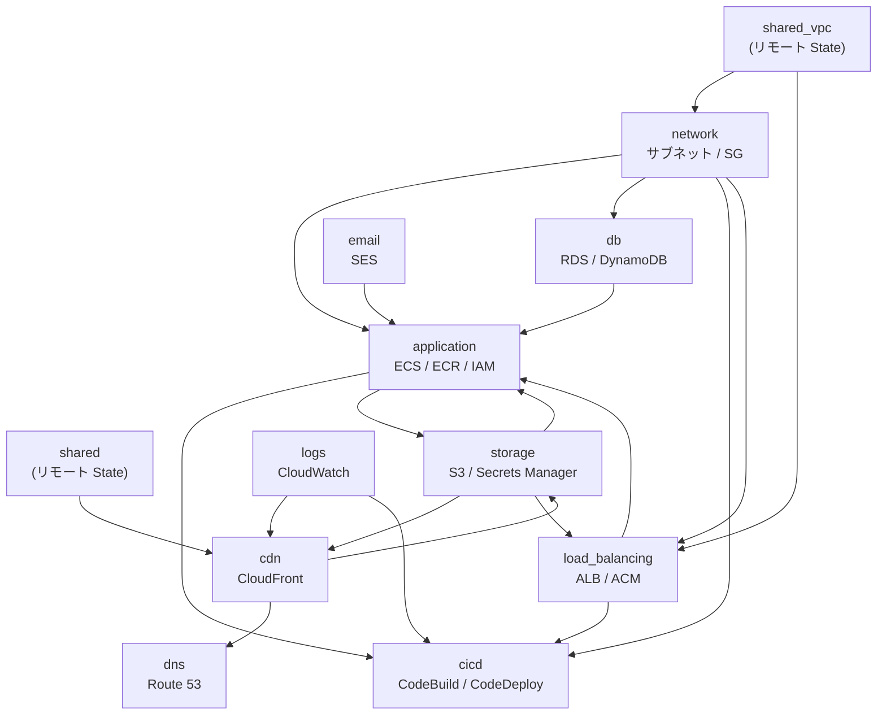

# 5-2-2 LMS の Terraform 構成

📝 **前提知識**: このセクションはセクション 5-2-1（Terraform の基礎概念）の内容を前提としています。

## 🎯 このセクションで学ぶこと

- LMS の Terraform ディレクトリ構造（shared / stacks / modules の 3 層）を理解する
- 10 モジュール（application / network / db / cdn / cicd 等）の役割と依存関係を把握する
- モジュールの入出力インターフェースの読み方を身につける
- 環境別 tfvars による production / staging の管理方法を理解する

10 のモジュール、40 の変数、2 つの環境。LMS のインフラ全体がコードとして管理されています。このセクションでは、そのコードがどう整理されているかを読み解きます。

---

## 導入: LMS のインフラコードはどこにあるのか

セクション 5-2-1 で Terraform の基本構文と動作モデルを学びました。HCL で `resource` や `variable` を定義し、`terraform plan` / `terraform apply` でインフラを管理する流れは理解できたはずです。

しかし、LMS のような実際のプロダクトでは、リソースの数が数十に及びます。ECS クラスター、RDS データベース、CloudFront ディストリビューション、ALB、S3 バケット、セキュリティグループ、IAM ロール......。これらをすべて 1 つのファイルに書いたらどうなるでしょうか。数千行のファイルになり、「CloudFront の設定を変えたい」と思ったときに該当箇所を探すだけで一苦労です。

LMS の Terraform コードは `infra/` ディレクトリに格納されています。このディレクトリの構造を理解すれば、「この AWS リソースの設定を変えたい」と思ったとき、どのファイルを見ればいいかがすぐにわかります。

### 🧠 先輩エンジニアはこう考える

> Terraform のコードが増えると、1 つのファイルに全リソースを書くのは破綻します。LMS ではモジュールで関心を分離し、環境ごとの差分は変数ファイルで吸収しています。この構造を知っていれば「CloudFront のキャッシュ設定を変えたい」→「cdn モジュールの cloudfront.tf を見よう」、「ECS のメモリを増やしたい」→「terraform.tfvars の ecs_task_memory を変えよう」と、迷わずたどり着けます。逆にこの構造を知らないと、毎回ファイルを grep して探し回ることになります。

---

## LMS の Terraform ディレクトリ構造

LMS の Terraform コードは、大きく **shared**、**stacks**、**stacks/modules** の 3 層で構成されています。

```text
infra/
├── versions.tf                     # Terraform / プロバイダーのバージョン制約
├── shared/                         # 環境をまたいで共有するリソース
│   ├── main.tf
│   ├── backend.tf
│   ├── variables.tf
│   ├── outputs.tf
│   └── modules/
│       ├── site/                   # Amplify（フロントエンドホスティング）
│       └── storage/                # 共有 S3 バケット
├── stacks/                         # 環境固有のインフラ定義
│   ├── main.tf                     # 全モジュールのオーケストレーション
│   ├── variables.tf                # 40 の変数定義
│   ├── outputs.tf                  # スタックの出力
│   ├── modules/                    # 再利用可能なモジュール群（10 モジュール）
│   │   ├── application/            # ECS, ECR, IAM
│   │   ├── network/                # サブネット, セキュリティグループ
│   │   ├── db/                     # RDS Aurora, DynamoDB
│   │   ├── cdn/                    # CloudFront
│   │   ├── load_balancing/         # ALB, ACM
│   │   ├── storage/                # S3, Secrets Manager
│   │   ├── cicd/                   # CodeBuild, CodeDeploy
│   │   ├── logs/                   # CloudWatch ログ
│   │   ├── dns/                    # Route 53
│   │   └── email/                  # SES
│   ├── production/                 # Production 環境ディレクトリ
│   │   ├── main.tf -> ../main.tf           # シンボリックリンク
│   │   ├── variables.tf -> ../variables.tf # シンボリックリンク
│   │   ├── outputs.tf -> ../outputs.tf     # シンボリックリンク
│   │   ├── terraform.tfvars                # 環境固有の変数値
│   │   └── backend.tf                      # 環境固有の State 設定
│   └── staging/                    # Staging 環境ディレクトリ
│       ├── main.tf -> ../main.tf           # シンボリックリンク
│       ├── variables.tf -> ../variables.tf # シンボリックリンク
│       ├── outputs.tf -> ../outputs.tf     # シンボリックリンク
│       ├── terraform.tfvars                # 環境固有の変数値
│       └── backend.tf                      # 環境固有の State 設定
```

それぞれの層の役割を見ていきましょう。

### shared/: 環境をまたいで共有するリソース

`shared/` は、production と staging の両方から参照される共有リソースを管理します。

以下は主要部分の抜粋です。

```hcl
# infra/shared/main.tf
locals {
  name_prefix = "${var.project_name}-new"
  default_tags = {
    Service     = var.project_name
    Environment = "shared"
  }
}

module "site" {
  source = "./modules/site"

  name_prefix           = local.name_prefix
  github_repository_url = var.github_repository_url
  github_token          = var.github_token
}

module "storage" {
  source = "./modules/storage"

  name_prefix = local.name_prefix
  cloudfront_arns = [
    data.terraform_remote_state.staging.outputs.cloudfront_arn,
    data.terraform_remote_state.production.outputs.cloudfront_arn,
  ]
}
```

ここで管理されているのは 2 つです。

- **site モジュール**: AWS Amplify のアプリケーション設定。フロントエンド（Next.js）のホスティング基盤で、production / staging の両方の CloudFront から参照されます
- **storage モジュール**: 教材画像用の共有 S3 バケット（`lms-mazidesign-assets`）。両環境の CloudFront がオリジンとして参照するため、共有リソースとして管理されています

共有リソースの State は `estra-lms-tfstate` バケットの `shared-new/terraform.tfstate` に保存されます。

### stacks/: 環境固有のインフラを束ねるオーケストレーター

`stacks/` が LMS の Terraform コードの中心です。`main.tf` で 10 のモジュールを呼び出し、`variables.tf` で 40 の変数を定義しています。

ポイントは、`main.tf` と `variables.tf` 自体は環境に依存しないことです。環境ごとの差分は、`production/terraform.tfvars` や `staging/terraform.tfvars` で変数の値を切り替えることで吸収しています。

### stacks/modules/: 再利用可能な 10 モジュール

AWS リソースを関心ごとにグルーピングした 10 のモジュールです。各モジュールは独立したディレクトリとして存在し、`variables.tf`（入力）、`outputs.tf`（出力）、リソース定義ファイル群で構成されています。詳細は次の見出しで解説します。

### stacks/production/ と stacks/staging/: シンボリックリンク戦略

production と staging のディレクトリを見ると、`main.tf`、`variables.tf`、`outputs.tf` はすべて親ディレクトリ（`stacks/`）へのシンボリックリンクです。

```text
production/main.tf      -> ../main.tf        # 同じコード
production/variables.tf  -> ../variables.tf   # 同じ変数定義
production/outputs.tf    -> ../outputs.tf     # 同じ出力定義
production/terraform.tfvars                   # 環境固有の値
production/backend.tf                         # 環境固有の State 設定
```

この設計の意味は明確です。**同じ Terraform コードを使い、変数の値だけを変えて 2 つの環境を作る** ということです。`terraform plan` や `terraform apply` は環境ディレクトリ内で実行します。Terraform は自動的にそのディレクトリの `terraform.tfvars` を読み込むため、同じ `main.tf` でも環境ごとに異なる設定が適用されます。

💡 **TIP**: この戦略により、「production にだけ存在するリソース」や「staging にだけ適用される設定」が生まれにくくなります。両環境は同じコードから生成されるため、staging で検証した変更をそのまま production に適用できます。

---

## 10 モジュールの全体像

stacks/modules/ 配下の 10 モジュールを一覧で把握しましょう。Chapter 5-1 で学んだ AWS サービスとの対応も示します。

| モジュール | 管理するリソース | Chapter 5-1 との対応 |
|---|---|---|
| **application** | ECS クラスター / サービス / タスク定義、ECR リポジトリ、IAM ロール | セクション 5-1-3 で学んだコンテナ基盤 |
| **network** | サブネット、セキュリティグループ、ルートテーブル | セクション 5-1-2 で学んだネットワーク構成 |
| **db** | RDS Aurora MySQL、DynamoDB（セッション / キャッシュ） | セクション 5-1-4 で学んだデータベース |
| **cdn** | CloudFront ディストリビューション、ACM 証明書（バージニア） | セクション 5-1-4 で学んだ CDN |
| **load_balancing** | ALB、ターゲットグループ、ACM 証明書（東京） | セクション 5-1-4 で学んだロードバランサー |
| **storage** | S3 バケット、Secrets Manager（DB 認証情報、APP_KEY 等） | セクション 5-1-4 で学んだストレージ + セキュリティ |
| **cicd** | CodeBuild、CodeDeploy、IAM ロール | Chapter 5-3 で詳しく学ぶ |
| **logs** | CloudWatch ロググループ（CloudFront 用、CodeBuild 用） | ログの集約管理 |
| **dns** | Route 53 レコード | ドメイン名の解決 |
| **email** | SES ドメイン認証 | メール送信基盤 |

### モジュール間の依存関係

モジュールは独立しているわけではありません。あるモジュールの出力（output）が、別のモジュールの入力（variable）として渡されます。この依存関係を図で可視化します。



この図から読み取れる重要なパターンがあります。

- **network** は多くのモジュールの土台です。サブネット ID やセキュリティグループ ID を application、db、cicd、load_balancing に提供しています
- **application** は最も多くの入力を受け取るモジュールです。ネットワーク、データベース、ストレージ、メール、ロードバランシングのすべてから情報を受け取って ECS を構成します
- **cicd** は application と load_balancing の出力に依存しています。デプロイ先の ECS クラスターやターゲットグループの情報が必要だからです
- **shared_vpc** はリモート State として参照され、VPC ID やパブリックサブネット ID を提供しています。VPC 自体は LMS の Terraform ではなく、別の Terraform プロジェクトで管理されています

### 各モジュールの標準ファイル構成

各モジュールは共通のファイル構成パターンに従っています。application モジュールを例にとります。

```text
modules/application/
├── cloudwatch.tf      # CloudWatch アラーム
├── ecr.tf             # ECR リポジトリ定義
├── ecs.tf             # ECS クラスター / サービス / タスク定義
├── iam.tf             # IAM ロール / ポリシー
├── variables.tf       # モジュールの入力変数
└── outputs.tf         # モジュールの出力値
```

どのモジュールにも共通するのは **variables.tf** と **outputs.tf** です。この 2 つがモジュールの「インターフェース」を定義します。残りのファイルはリソースの種類ごとに分割されており、ファイル名を見ればどの AWS サービスの定義が入っているか推測できます。

---

## モジュールの内部構造: application モジュールを例に

モジュールの読み方を、最も複雑な application モジュールを例に学びましょう。

### variables.tf: モジュールが受け取る入力

以下は application モジュールの variables.tf です。

```hcl
# infra/stacks/modules/application/variables.tf
variable "aws_account_id" {}
variable "is_production" {}
variable "name_prefix" {}
variable "aws_region" {}
variable "project_name" {}
variable "http_port" {}
variable "db_port" {}
variable "container_name_nginx" {}
variable "container_port_nginx" {}
variable "container_name_laravel" {}
variable "container_port_laravel" {}
variable "site_domain" {}
variable "site_sub_domain" {}
variable "env_name" {}
variable "ecs_task_cpu" {}
variable "ecs_task_memory" {}
variable "private_app_subnet_ids" {}
variable "app_sg_id" {}
variable "alb_target_group_arn" {}
variable "session_table_name" {}
variable "session_table_arn" {}
variable "cache_table_name" {}
variable "cache_table_arn" {}
variable "rds_database_name" {}
variable "rds_database_host" {}
variable "rds_secrets_manager_arn" {}
variable "app_key_secrets_manager_arn" {}
variable "hubspot_secrets_manager_arn" {}
variable "line_secrets_manager_arn" {}
variable "slack_bot_token_secrets_manager_arn" {}
variable "assets_bucket_name" {}
variable "assets_bucket_arn" {}
variable "ses_domain_identity_arn" {}
variable "mail_from_name" {}
variable "mail_domain" {}
variable "l5_swagger_generate_always" {}
variable "log_level" {}
variable "batch_schedule_expression" {}
```

38 の変数がありますが、大きく 3 種類に分類できます。

1. **直接的な設定値**: `ecs_task_cpu`、`ecs_task_memory`、`env_name` など。terraform.tfvars から渡される環境固有の値です
2. **他のモジュールからの出力**: `private_app_subnet_ids`（network から）、`alb_target_group_arn`（load_balancing から）、`session_table_name`（db から）、`rds_secrets_manager_arn`（storage から）など。モジュール間の依存関係を表しています
3. **共通のプレフィックス / 識別子**: `name_prefix`、`aws_region`、`project_name` など。リソースの命名規則やリージョン指定に使われます

### outputs.tf: モジュールが公開する出力

```hcl
# infra/stacks/modules/application/outputs.tf
output "ecr_laravel_repository_url" {
  description = "ECR repository url for Laravel"
  value       = aws_ecr_repository.laravel.repository_url
}

output "ecr_nginx_repository_url" {
  description = "ECR repository url for Nginx"
  value       = aws_ecr_repository.nginx.repository_url
}

output "ecr_laravel_repository_arn" {
  description = "ARN of ECR repository for Laravel"
  value       = aws_ecr_repository.laravel.arn
}

output "ecr_nginx_repository_arn" {
  description = "ARN of ECR repository url for Nginx"
  value       = aws_ecr_repository.nginx.arn
}

output "ecs_cluster_name" {
  description = "ECS cluster name"
  value       = aws_ecs_cluster.main.name
}

output "ecs_service_name" {
  description = "ECS service name"
  value       = aws_ecs_service.app.name
}

output "ecs_task_definition_family" {
  description = "ARN of ECS task definition"
  value       = data.aws_ecs_task_definition.app.family
}

output "batch_task_definition_family" {
  description = "ARN of batch task definition"
  value       = data.aws_ecs_task_definition.cron.family
}

output "fargate_execution_role_arn" {
  description = "ARN of Fargate execution role"
  value       = aws_iam_role.fargate_execution_role.arn
}

output "fargate_task_role_arn" {
  description = "ARN of Fargate task role"
  value       = aws_iam_role.fargate_task_role.arn
}
```

application モジュールの出力は、主に **cicd** モジュールが消費します。ECR リポジトリの URL はコンテナイメージのプッシュ先として、ECS クラスター名やサービス名はデプロイ先の指定として、IAM ロールの ARN は権限の委譲として使われます。

💡 **TIP**: モジュールの **variables.tf** と **outputs.tf** を見れば、そのモジュールが「何に依存し」「何を提供するか」がわかります。リソース定義ファイル（ecs.tf や ecr.tf）の詳細を読まなくても、モジュールの役割と他モジュールとの関係を把握できます。これが、コードリーディングの最初のステップです。

### stacks/main.tf での呼び出し

application モジュールが stacks/main.tf でどのように呼び出されているかを見てみましょう。以下は主要部分の抜粋です。

```hcl
# infra/stacks/main.tf（application モジュール部分）
module "application" {
  source = "../modules/application/"

  aws_account_id         = data.aws_caller_identity.current.id
  is_production          = local.is_production
  name_prefix            = local.name_prefix
  ecs_task_cpu           = var.ecs_task_cpu
  ecs_task_memory        = var.ecs_task_memory
  private_app_subnet_ids = module.network.private_app_subnet_ids
  app_sg_id              = module.network.app_sg_id
  alb_target_group_arn   = module.load_balancing.alb_target_group_arn
  session_table_name     = module.db.session_table_name
  rds_database_host      = module.db.rds_database_host
  rds_secrets_manager_arn = module.storage.rds_secrets_manager_arn
  ses_domain_identity_arn = module.email.ses_domain_identity_arn
  # ... 他の変数も同様に渡される
}
```

この呼び出しを読むと、値の出どころが 4 種類あることがわかります。

| 値の出どころ | 例 | 意味 |
|---|---|---|
| `var.*` | `var.ecs_task_cpu` | terraform.tfvars で定義された環境固有の値 |
| `local.*` | `local.name_prefix` | locals ブロックで定義された計算値 |
| `module.*` | `module.network.app_sg_id` | 他のモジュールの output |
| `data.*` | `data.aws_caller_identity.current.id` | AWS から取得したデータ |

---

## stacks/main.tf のコードリーディング

ここまで application モジュールを詳しく見てきました。次は、10 モジュールすべてを束ねる stacks/main.tf の全体構造を読み解きましょう。

### locals ブロック: 共通値の定義

```hcl
# infra/stacks/main.tf
locals {
  name_prefix = "${var.project_name}-${var.env_name}-new"
  default_tags = {
    Service     = var.project_name
    Environment = var.env_name
  }
  is_production = var.env_name == "production"
}
```

3 つの値が定義されています。

- **name_prefix**: リソース名のプレフィックス。production なら `lms-production-new`、staging なら `lms-staging-new` になります。ほぼすべてのモジュールに渡され、リソース名の衝突を防ぎます
- **default_tags**: すべてのリソースに付与されるタグ。AWS コンソールでリソースを検索するときや、コスト管理でサービス / 環境別にフィルタリングするときに使います
- **is_production**: 環境が production かどうかの真偽値。一部のモジュール（application、db、network）で、production のみ有効な設定の分岐に使われます

### provider 設定: デフォルトタグの自動付与

```hcl
# infra/stacks/main.tf
provider "aws" {
  region = var.aws_region
  default_tags {
    tags = local.default_tags
  }
}
```

`default_tags` を provider レベルで設定すると、このプロバイダーで作成されるすべての AWS リソースに自動的にタグが付与されます。個別のリソース定義でタグを書き忘れる心配がなくなります。

### data ブロック: 外部データの参照

```hcl
# infra/stacks/main.tf
data "aws_caller_identity" "current" {}

data "terraform_remote_state" "shared" {
  backend = "s3"
  config = {
    bucket = "estra-lms-tfstate"
    key    = "shared-new/terraform.tfstate"
    region = "ap-northeast-1"
  }
}

data "terraform_remote_state" "shared_vpc" {
  backend = "s3"
  config = {
    bucket = "estra-infra-shared-tfstate"
    key    = "shared_vpc/${var.env_name}/terraform.tfstate"
    region = "ap-northeast-1"
  }
}
```

3 つの外部データを参照しています。

- **aws_caller_identity**: 現在の AWS アカウント ID を取得。IAM ポリシーの ARN 構築などで使います
- **terraform_remote_state "shared"**: 前述の shared/ ディレクトリで管理されている State を参照。Amplify のデフォルトドメインや共有 S3 バケットのドメイン名を取得します
- **terraform_remote_state "shared_vpc"**: 別の Terraform プロジェクトで管理されている VPC の State を参照。VPC ID、パブリックサブネット ID、NAT ゲートウェイ ID などのネットワーク基盤情報を取得します

💡 **TIP**: `terraform_remote_state` は、異なる Terraform プロジェクト間で値を共有するための仕組みです。LMS では VPC を shared_vpc という別プロジェクトで管理しているため、このデータソースを通じて VPC の情報を取得しています。

### 10 モジュールの呼び出しと値の受け渡し

stacks/main.tf では 10 のモジュールが呼び出されます。ここでは、モジュール間の値の受け渡しパターンに注目しましょう。

**network モジュール** はリモート State から VPC 情報を受け取り、サブネットやセキュリティグループを作成します。

```hcl
# infra/stacks/main.tf（network モジュール部分）
module "network" {
  source = "../modules/network/"

  vpc_id         = data.terraform_remote_state.shared_vpc.outputs.vpc_id
  vpc_cidr_block = data.terraform_remote_state.shared_vpc.outputs.vpc_cidr_block
  nat_gateway_ids = data.terraform_remote_state.shared_vpc.outputs.nat_gateway_ids
  # ...
}
```

network モジュールの出力は、多くのモジュールに渡されます。たとえば以下のように、`module.network.private_app_subnet_ids` が application と cicd の両方で使われています。

```hcl
# infra/stacks/main.tf（application・cicd モジュール部分、抜粋）
# application モジュールへ
module "application" {
  private_app_subnet_ids = module.network.private_app_subnet_ids
  app_sg_id              = module.network.app_sg_id
  # ...
}

# cicd モジュールへ
module "cicd" {
  private_app_subnet_ids = module.network.private_app_subnet_ids
  app_sg_id              = module.network.app_sg_id
  codebuild_sg_id        = module.network.codebuild_sg_id
  # ...
}
```

同様に、**application モジュール** の出力は **cicd モジュール** に渡されます。

```hcl
# infra/stacks/main.tf（cicd モジュール部分、抜粋）
module "cicd" {
  ecr_laravel_repository_url   = module.application.ecr_laravel_repository_url
  ecr_nginx_repository_url     = module.application.ecr_nginx_repository_url
  ecs_cluster_name             = module.application.ecs_cluster_name
  ecs_service_name             = module.application.ecs_service_name
  ecs_task_definition_family   = module.application.ecs_task_definition_family
  fargate_execution_role_arn   = module.application.fargate_execution_role_arn
  fargate_task_role_arn        = module.application.fargate_task_role_arn
  alb_listener_arn             = module.load_balancing.alb_listener_arn
  alb_target_group_name_app    = module.load_balancing.alb_target_group_name_app
  alb_target_group_name_app2   = module.load_balancing.alb_target_group_name_app2
  # ...
}
```

このように、あるモジュールの **output** が別のモジュールの **variable** になるパターンが、main.tf 全体で繰り返されています。Terraform はこの依存関係を自動的に解析し、正しい順序でリソースを作成します。たとえば、network モジュールのサブネットが作成されるまで、application モジュールの ECS サービスの作成は待機されます。

🔑 **キーポイント**: main.tf を読むときは、各モジュールの `source` と、引数の値がどこから来ているか（`var.*`、`local.*`、`module.*`、`data.*`）に注目してください。これで「何が何に依存しているか」の全体像が見えます。

---

## 環境別 tfvars による管理

最後に、production と staging の差分がどのように管理されているかを見ましょう。

### production/terraform.tfvars と staging/terraform.tfvars の比較

以下は、2 つの環境の主要な差分をまとめた表です。

| 変数 | Production | Staging | 差分の意味 |
|---|---|---|---|
| `env_name` | `"production"` | `"staging"` | 環境識別子。name_prefix の生成に使用 |
| `private_app_subnet_cidr_blocks` | `10.4.2.0/24`, `10.4.3.0/24` | `10.3.2.0/24`, `10.3.3.0/24` | VPC 内での IP アドレス帯の棲み分け |
| `private_db_subnet_cidr_blocks` | `10.4.4.0/24`, `10.4.5.0/24` | `10.3.4.0/24`, `10.3.5.0/24` | 同上 |
| `ecs_task_cpu` | `1024`（1 vCPU） | `256`（0.25 vCPU） | Staging はコスト節約のため最低スペック |
| `ecs_task_memory` | `2048`（2 GB） | `512`（0.5 GB） | 同上 |
| `site_sub_domain` | `"lms"` | `"stag-new"` | `lms.coachtech.site` vs `stag-new.coachtech.site` |
| `github_branch_name` | `"main"` | `"staging"` | デプロイ対象のブランチ |
| `mail_from_name` | `"COACHTECH LMS"` | `"COACHTECH LMS Staging"` | メール送信者名の区別 |
| `log_level` | `"error"` | `"notice"` | Staging はより詳細なログを出力 |
| `assets_bucket_name` | `"coachtech-lms-bucket"` | `"coachtech-lms-bucket-stag"` | アセット用 S3 バケットの環境別命名 |
| `image_tag_laravel` / `image_tag_nginx` | `"latest"` | `"20250805233320"` | コンテナイメージタグ。Staging は固定タグで安定性を確保 |
| `batch_schedule_expression` | `cron(0/5 * * * ? *)` | `cron(0 * * * ? *)` | Production は 5 分間隔、Staging は 1 時間間隔 |

差分のパターンは 3 つに分類できます。

1. **スペック差分**: ECS の CPU / メモリ、バッチの実行頻度など。Staging ではコストを抑えるために低スペックにしています
2. **識別差分**: ドメイン名、ブランチ名、環境名など。2 つの環境を区別するための値です
3. **運用差分**: ログレベルの違いなど。Staging ではデバッグしやすいように詳細なログを出力します

一方、以下の値は両環境で共通です。

- `rds_engine` / `rds_engine_version` / `rds_instance_class`: データベースエンジンとインスタンスサイズ
- `acm_domain` / `site_domain`: ベースドメイン
- `is_7777_enabled`: DB 接続用の踏み台コンテナの有効化

### backend.tf の比較: State の分離

```hcl
# infra/stacks/production/backend.tf
terraform {
  backend "s3" {
    bucket = "estra-lms-tfstate"
    key    = "production_new/terraform.tfstate"
    region = "ap-northeast-1"
  }
}
```

```hcl
# infra/stacks/staging/backend.tf
terraform {
  backend "s3" {
    bucket = "estra-lms-tfstate"
    key    = "staging_new/terraform.tfstate"
    region = "ap-northeast-1"
  }
}
```

同じ S3 バケット（`estra-lms-tfstate`）を使いますが、**key** が異なります。これにより、production と staging の State ファイルが完全に分離されます。staging で `terraform apply` しても production の State には一切影響しません。

⚠️ **注意**: backend.tf はシンボリックリンクではなく、各環境ディレクトリに直接配置されています。State の保存先を間違えると、一方の環境の変更が他方に影響する危険があるため、これは意図的な設計です。

### terraform plan で環境ごとの差分をプレビューする

実際に環境に変更を適用する流れは以下のとおりです。

```bash
# Production 環境の変更をプレビュー
cd infra/stacks/production
terraform plan

# Staging 環境の変更をプレビュー
cd infra/stacks/staging
terraform plan
```

各ディレクトリで `terraform plan` を実行すると、そのディレクトリの `terraform.tfvars` と `backend.tf` が使われます。同じ main.tf（シンボリックリンク）でも、変数値と State が異なるため、環境ごとに適切な差分が表示されます。

---

## ✨ まとめ

- LMS の Terraform コードは **shared**（共有リソース）、**stacks**（環境固有のオーケストレーション）、**stacks/modules**（再利用可能なモジュール群）の 3 層構造で整理されている
- **10 のモジュール** が AWS リソースを関心ごとにグルーピングし、variables.tf / outputs.tf をインターフェースとして値を受け渡している
- **stacks/main.tf** が全モジュールを束ね、モジュール間の依存関係（output → variable）を定義するオーケストレーターの役割を担う
- production / staging の環境ディレクトリは **シンボリックリンク** で同じコードを共有し、**terraform.tfvars** と **backend.tf** のみが環境固有
- モジュールの **variables.tf** と **outputs.tf** を読めば、そのモジュールが何に依存し何を提供するかがわかる。コードリーディングの出発点として最適

---

この Chapter では、Infrastructure as Code の概念から始めて、Terraform の動作モデルと HCL 構文を学び、LMS の実際の Terraform 構成（10 モジュール、40 変数、2 環境）を読み解きました。次の Chapter では、これらのインフラ上で動く CI/CD パイプラインを学びます。GitHub Actions の仕組みと LMS のワークフロー、CodeBuild と CodeDeploy によるデプロイ自動化、環境管理とモニタリングを理解します。
